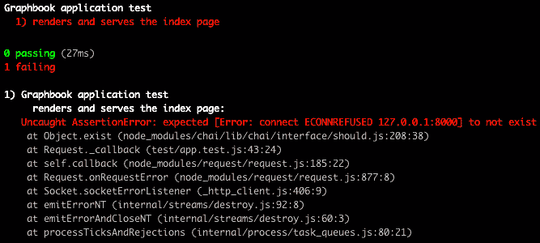
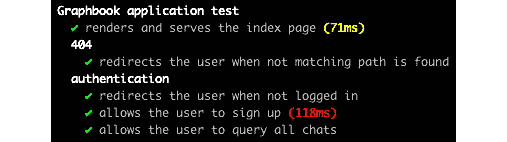

# 第十一章：*第十一章*：为 React 和 Node.js 编写测试

到目前为止，我们已经编写了大量的代码，遇到了各种问题。我们尚未为我们的软件实现自动化测试；然而，在修改应用程序后确保一切正常工作是一种常见的方法。自动化测试极大地提高了软件的质量，并减少了生产中的错误。

为了实现这一目标，我们将在本章中涵盖以下主要主题：

+   如何使用 Mocha 进行测试

+   使用 Mocha 和 Chai 测试 GraphQL **应用程序编程接口**（**API**）

+   使用 Enzyme 和 JSDOM 测试 React

# 技术要求

本章的源代码可在以下 GitHub 仓库中找到：

[`github.com/PacktPublishing/Full-Stack-Web-Development-with-GraphQL-and-React-Second-Edition/tree/main/Chapter11`](https://github.com/PacktPublishing/Full-Stack-Web-Development-with-GraphQL-and-React-Second-Edition/tree/main/Chapter11)

# 使用 Mocha 进行测试

我们面临的问题是，我们必须确保软件的质量，同时不增加手动测试的数量。当发布新更新时，不可能重新检查我们软件的每个功能。为了解决这个问题，我们将使用 Mocha，这是一个用于运行一系列异步测试的 JavaScript 测试框架。如果所有测试都成功通过，则你的应用程序是正常的，可以发布到生产环境中。

许多开发者遵循**测试驱动开发**（**TDD**）的方法。通常，当你第一次实现测试时，它们会失败，因为正在被测试的业务逻辑缺失。在实现所有测试之后，我们必须编写实际的应用程序代码以满足测试的要求。在这本书中，我们没有遵循这种方法，但这并不是问题，因为我们也可以在之后实现测试。通常，我倾向于与应用程序代码并行编写测试。

要开始，我们必须使用`npm`安装所有依赖项以测试我们的应用程序，如下所示：

```js
npm install --save-dev mocha chai @babel/polyfill request
```

`mocha`包几乎包含了运行测试所需的一切。除了 Mocha，我们还安装了`chai`，这是一个断言库。它提供了将测试与许多变量和类型链式连接的出色方法，用于 Mocha 测试内部。我们还安装了`@babel/polyfill`包，它允许我们的测试将`request`包作为库来发送测试中的所有查询或突变。我建议你设置`NODE_ENV`环境变量为`production`以测试每个功能，就像在实时环境中一样。确保你正确设置了环境变量，以便使用所有生产功能。

## 我们的第一条 Mocha 测试

首先，让我们向我们的`package.json`文件的`scripts`字段添加一个新命令，如下所示：

```js
"test": "mocha --exit test/ --require babel-hook --require @babel/polyfill --recursive"
```

如果你现在执行`npm run test`，我们将运行`test`文件夹中的`mocha`包，我们将在下一秒创建这个文件夹。前面的`--require`选项加载指定的文件或包。我们还将加载一个`babel-hook.js`文件，我们也将创建它。`--recursive`参数告诉 Mocha 运行`test`文件夹的完整文件树，而不仅仅是第一层。这种行为很有用，因为它允许我们在多个文件和文件夹中结构化我们的测试。

让我们从添加到项目根目录的`babel-hook.js`文件开始，紧挨着`package.json`文件。插入以下代码：

```js
require("@babel/register")({
  "plugins": [
    "require-context-hook"
  ],
  "presets": ["@babel/env","@babel/react"]
});
```

这个文件的目的在于提供一个替代的 Babel 配置文件，相对于我们的标准`.babelrc`文件。如果你比较这两个文件，你应该会看到我们使用了`require-context-hook`插件。我们在使用`npm run server`启动后端时已经使用了这个插件。它允许我们使用**正则表达式**（**regex**）导入我们的 Sequelize 模型。

如果我们以`npm run test`开始测试，我们会在文件开始处要求这个文件。在`babel-hook.js`文件内部，我们加载`@babel/register`，它根据前面的配置编译测试中随后导入的所有文件。

注意

注意，当运行生产构建或环境时，也会使用生产数据库。所有更改都应用到这个数据库上。请确认你已经在服务器的`configuration`文件夹中正确配置了数据库凭据。你只需正确设置`host`、`username`、`password`和`database`环境变量即可。

这给了我们从测试文件中启动后端服务器并在服务器上渲染应用的选择。我们的测试准备工作现在已完成。在项目根目录下创建一个名为`test`的文件夹来存放所有可运行的测试。Mocha 将扫描所有文件或文件夹，所有测试都将被执行。为了运行一个基本的测试，创建一个`app.test.js`文件。这是主文件，确保我们的后端正在运行，我们可以在其中定义更多的测试。我们的测试的第一个版本如下所示：

```js
const assert = require('assert');
const request = require('request');
const expect = require('chai').expect;
const should = require('chai').should();
describe('Graphbook application test', function() {
  it('renders and serves the index page', function(done) {
    request('http://localhost:8000', function(err, res,
      body) {
      should.not.exist(err);
      should.exist(res);
      expect(res.statusCode).to.be.equal(200);
      assert.ok(body.indexOf('<html') !== -1);
      done(err);
    });
  });
});
```

让我们更仔细地看看这里发生了什么，如下所示：

1.  我们导入 Node.js 的`assert`函数。这使我们能够验证变量的值或类型。

1.  我们导入`request`包，我们用它来向我们的后端发送查询。

1.  我们从`chai`包中导入两个 Chai 函数，`expect`和`should`。这两个函数都不包含在 Mocha 中，但它们都显著提高了测试的功能。

1.  测试的开始部分使用`describe`函数。因为 Mocha 执行`app.test.js`文件，所以我们处于正确的范围，可以使用所有 Mocha 函数。`describe`函数用于结构化你的测试及其输出。

1.  我们使用`it`函数，它启动第一个测试。

`it` 函数可以理解为回调函数内我们想要测试的应用程序功能。作为第一个参数，你应该输入一个易于阅读的句子，例如 `'it does this and that'`。函数本身等待第二个参数中的 `callback` 函数的完整执行。回调的结果将是所有断言都成功，或者由于某种原因测试失败，或者回调没有在合理的时间内完成。

`describe` 函数是我们测试输出的标题。然后，对于每个执行的 `it` 函数，我们都有一个新行。每一行代表一个单独的测试步骤。`it` 函数将一个 `done` 函数传递给回调。`done` 函数必须在所有断言完成后执行，且没有其他事情要做。如果在一定时间内没有执行，当前测试将被标记为失败。在先前的代码片段中，我们首先发送了一个 `GET` 请求到 `http://localhost:8000`，这被我们的后端服务器接受。预期的答案将以通过 React 创建的服务器端渲染的 **超文本标记语言**（**HTML**）的形式出现。

为了证明响应包含此信息，我们在先前的测试中做出了一些断言，如下所示：

1.  我们使用 Chai 的 `should` 函数。它的好处是它是可链式的，并且代表一个直接解释我们正在做什么意义的句子。`should.not.exist` 函数链确保给定的值是空的。如果值是 `undefined` 或 `null` 等示例，结果将是 `true`。结果是，当 `err` 变量被填充时，断言失败，因此我们的测试 `'渲染并服务首页'` 也失败了。

1.  对于 `should.exist` 这一行也是同样的道理。它确保了 `res` 变量，即后端给出的响应，被填充。否则，后端可能存在问题。

1.  `expect` 函数也可以像之前的两个函数一样表示一个句子。我们期望 `res.statusCode` 的值为 `200`。这个断言可以写成 `expect(res.statusCode).to.be.equal(200)`。如果我们收到 HTTP 状态码为 `200`，我们可以确信一切顺利。

1.  如果到目前为止没有失败，我们检查返回的 `body` 变量，即 `request` 函数的第三个回调参数，是否有效。对于我们的测试场景，我们只需要检查它是否包含一个 `html` 标签。

1.  我们执行 `done` 函数。我们将 `err` 对象作为参数传递。这个函数的结果与 `should.not.exist` 函数类似。如果你将一个填充的错误对象传递给 `done` 函数，测试将失败。使用 Chai 语法时，测试变得更易读。

如果你现在执行 `npm run test`，你会收到以下错误：



图 11.1 – 服务器未运行导致的测试失败

我们第一次的`should.not.exist`断言失败并抛出了错误。这是因为我们在运行测试时没有启动后端。在第二个终端中使用正确的环境变量通过`npm run server`启动后端，然后重新运行测试。现在，测试成功，如下所示：

![Figure 11.2 – 测试通过如果服务器运行]

![Figure 11.02 – B17337.jpg]

Figure 11.2 – 测试通过如果服务器运行

输出结果很好，但过程并不十分直观。在部署应用程序或推送新的提交到您的**版本控制系统**（**VCS**）时自动运行测试，当前的流程很难实现。我们将在下一个版本中改变这种行为。

## 使用 Mocha 启动后端

当我们想要运行一个测试时，服务器应该自动启动。有两种方法可以实现这种行为，如下所述：

+   我们将`npm run server`命令添加到`package.json`文件中的`test`脚本中。

+   我们在`app.test.js`文件中导入所有必要的文件以启动服务器。这允许我们对后端运行更多的断言或命令。

最佳选择是在我们的测试中启动服务器，而不是依赖于第二个命令，因为我们可以在后端运行更多的测试。我们需要导入一个额外的包，以便在测试中启动服务器，如下所示：

```js
require('babel-plugin-require-context-hook/register')();
```

我们使用并执行这个包，因为我们使用`require.context`函数加载 Sequelize 模型。通过加载这个包，`require.context`函数对服务器端代码是可执行的。在我们开始在测试中启动服务器之前，插件尚未使用，尽管它已在`babel-hooks.js`文件中加载。

现在，我们可以在测试中直接加载服务器。在刚刚编写的`describe`函数顶部添加以下代码行：

```js
var app;
this.timeout(50000);
before(function(done) {
  app = require('../src/server').default;
  app.on("listening", function() {
    done();
  });
});
```

理念是在我们的测试中加载服务器的`index.js`文件，这会自动启动后端。为此，我们定义一个名为`app`的空变量。然后，我们使用`this.timeout`将 Mocha 中所有测试的超时时间设置为`50000`，因为启动我们的服务器，包括 Apollo Server，需要一些时间。否则，测试可能会因为启动时间过长而失败，这对于标准的 Mocha 超时来说太长了。

我们必须确保在执行任何测试之前服务器已经完全启动。这个逻辑可以通过 Mocha 的`before`函数实现。使用这个函数，你可以在我们的场景中设置和配置诸如启动后端等事情。为了继续并处理所有测试，我们需要执行`done`函数来完成`before`函数的回调。为了确保服务器已经启动，我们不仅在加载`index.js`文件后运行`done`函数。我们使用`app.on`函数绑定服务器的`listening`事件。如果服务器发出`listening`事件，我们可以安全地运行`done`函数，并且所有测试都可以向服务器发送请求。我们也可以直接将`require`函数的返回值保存到`app`变量中，以保存`server`对象。然而，这个顺序的问题在于服务器可能在我们可以绑定`listening`事件之前就开始监听。我们现在这样做确保服务器还没有启动。

然而，测试仍然没有工作。你会看到一个错误消息，说`'TypeError: app.on is not a function'`。仔细看看服务器的`index.js`文件。在文件的末尾，我们没有导出`server`对象，因为我们只使用它来启动后端。这意味着我们测试中的`app`变量是空的，我们无法运行`app.on`函数。解决方案是在服务器`index.js`文件的末尾导出`server`对象，如下所示：

```js
export default server;
```

现在，你可以再次执行测试。一切看起来都应该是正常的，并且所有测试都应该通过。

然而，还有一个最后的问题。如果你比较在将服务器直接导入我们的测试或在一个第二个终端启动之前的行为，你可能会注意到测试并没有完成，或者至少进程没有停止。之前，所有步骤都执行了，我们回到了正常的 shell，并且可以执行下一个命令。这是因为服务器仍然在我们的`app.test.js`文件中运行。因此，我们必须在所有测试执行完毕后停止后端。在`before`函数之后插入以下代码：

```js
after(function(done) {
  app.close(done);
});
```

当所有测试完成后，会运行`after`函数。我们的`app`对象提供了`close`函数，该函数终止服务器。作为一个回调，我们传递`done`函数，一旦服务器停止，该函数就会被执行。这意味着我们的测试也已经完成。

## 验证正确的路由

我们现在想检查我们应用程序的所有功能是否按预期工作。我们应用程序的一个主要功能是 React Router 在以下两种情况下将用户重定向：

+   用户访问了一个无法匹配的路由。

+   用户访问了一个可以匹配的路由，但他们不允许查看页面。

在两种情况下，用户都应该被重定向到登录表单。在第一种情况下，我们可以采用与第一次测试相同的方法。我们向一个不在我们路由器内的路径发送请求。将以下代码添加到`describe`函数的底部：

```js
describe('404', function() {
  it('redirects the user when not matching path is found',
    function(done) {
    request({
      url: 'http://localhost:8000/path/to/404',
    }, function(err, res, body) {
      should.not.exist(err);
      should.exist(res);
      expect(res.statusCode).to.be.equal(200);
      assert.ok(res.req.path === '/');
      assert.ok(body.indexOf('<html') !== -1);
      assert.ok(body.indexOf('class="authModal"') !== -1);
      done(err);
    });
  });
});
```

让我们快速回顾一下前面测试的所有步骤，如下：

1.  我们添加一个新的`describe`函数来结构化我们的测试输出。

1.  我们在另一个`it`函数内部向一个不匹配的路径发送请求。

1.  检查与我们在启动服务器时使用的检查相同。

1.  我们验证响应的路径是`/`根路径。这是在执行重定向时发生的。因此，我们使用`res.req.path === '/'`条件。

1.  我们检查返回的`body`变量是否包含具有`authModal`类的 HTML 标签。这应该在用户未登录且渲染登录或注册表单时发生。

如果断言成功，我们知道 React Router 在第一种场景中工作正确。第二种场景与只能由认证用户访问的私有路由相关。我们可以复制前面的检查并替换请求。我们进行的断言保持不变，但请求的**统一资源定位符**（**URL**）不同。在前面一个测试下面添加以下测试：

```js
describe('authentication', function() {
  it('redirects the user when not logged in', 
    function(done) {
    request({
      url: 'http://localhost:8000/app',
    }, function(err, res, body) {
      should.not.exist(err);
      should.exist(res);
      expect(res.statusCode).to.be.equal(200);
      assert.ok(res.req.path === '/');
      assert.ok(body.indexOf('<html') !== -1);
      assert.ok(body.indexOf('class="authModal"') !== -1);
      done(err);
    });
  });
});
```

如果未认证的用户请求`/app`路由，他们将被重定向到`/`根路径。断言验证登录表单是否如之前一样显示。为了区分测试，我们添加一个新的`describe`函数，使其结构更好。

在本节中，我们学习了如何使用 Mocha 断言我们的应用程序工作正确。我们现在正在验证我们的应用程序是否启动，以及路由是否按预期工作并返回正确的页面。

接下来，我们想要测试我们构建的 GraphQL API，而不仅仅是**服务器端渲染**（**SSR**）功能。

# 使用 Mocha 测试 GraphQL API

我们必须验证我们提供的所有 API 函数是否正确工作。我将通过以下两个示例向您展示如何做到这一点：

+   用户需要注册或登录。这是一个关键特性，我们应该验证 API 是否正确工作。

+   用户通过 GraphQL API 查询或修改数据。对于我们的测试用例，我们将请求登录用户相关的所有聊天。

这两个示例应该解释测试 API 每个部分的所有基本技术。您可以在任何时刻添加更多您想要测试的函数。

## 测试认证

我们通过添加注册功能扩展了我们的测试认证。我们将向我们的后端发送一个简单的 GraphQL 请求，包括注册新用户所需的所有数据。我们已经发送了请求，所以这里没有什么新的内容。然而，与之前的所有请求相比，我们必须发送一个`POST`请求，而不是`GET`请求。此外，注册的端点是`/graphql`路径，我们的 Apollo Server 在这里监听传入的突变或查询。通常，当用户在 Graphbook 上注册时，认证令牌会直接返回，用户会登录。我们必须保留这个令牌以进行未来的 GraphQL 请求。我们不需要使用 Apollo Client 进行测试，因为我们不需要测试 GraphQL API。

在`app`变量旁边创建一个全局变量，用于存储注册后返回的**JavaScript 对象表示法（JSON）Web 令牌（JWT**），如下所示：

```js
var authToken;
```

在测试内部，我们可以设置返回的 JWT。将以下代码添加到`authentication`函数中：

```js
it('allows the user to sign up', function(done) {
  const json = {
    operationName: null,
    query: "mutation signup($username: String!, $email : 
      String!, 
    $password : String!) { signup(username: $username,
      email: $email,   
    password : $password) { token }}",
    variables: {
      "email": "mocha@test.com",
      "username": "mochatest",
      "password": "123456789"
    }
  };
  request.post({
    url: 'http://localhost:8000/graphql',
    json: json,
  }, function(err, res, body) {
    should.not.exist(err);
    should.exist(res);
    expect(res.statusCode).to.be.equal(200);
    body.should.be.an('object');
    body.should.have.property('data');
    authToken = body.data.signup.token;
    done(err);
  });
});
```

我们首先创建一个`json`变量。这个对象以 JSON 体形式发送到我们的 GraphQL API。其内容应该对你来说很熟悉——它几乎与我们之前在 Postman 中测试 GraphQL API 时使用的格式相同。

注意

我们发送的 JSON 代表了一种手动发送 GraphQL 请求的方式。有一些库你可以轻松使用来保存这个请求并直接发送查询，而不需要将其包裹在对象中，例如`graphql-request`：[`github.com/prisma-labs/graphql-request`](https://github.com/prisma-labs/graphql-request)。

`json`对象包含用于创建具有`mochatest`用户名的用户的模拟注册变量。我们将使用`request.post`函数发送 HTTP `POST`请求。要使用`json`变量，我们将它传递到`json`字段。`request.post`函数会自动将正文作为 JSON 字符串添加，并为你添加正确的`Content-Type`头。当响应到达时，我们运行标准检查，例如检查错误或检查 HTTP 状态码。我们还检查返回的`body`变量的格式，因为响应的`body`变量不会返回 HTML，而是返回 JSON。我们确保它是一个使用`should.be.an('object')`函数的对象。`should`断言可以直接使用并链接到`body`变量。如果`body`是一个对象，我们检查其中是否有`data`属性。从`body.data.signup.token`属性读取令牌就足够安全了。

用户现在已创建在我们的数据库中。我们可以使用这个令牌进行后续请求。请注意，在本地机器上再次运行此测试很可能会导致失败，因为用户已经存在。在这种情况下，你可以手动从数据库中删除它。当使用**持续集成（CI**）运行此测试时，这个问题不会发生。我们将在最后一章中关注这个主题。接下来，我们将向 Apollo Server 进行认证查询并测试其结果。

## 测试认证请求

在注册请求之后，我们设置了 `authToken` 变量。如果测试时用户已经存在，您也可以使用登录请求来做这件事。只有查询和我们所使用的断言将会改变。此外，将以下代码插入到 `before` 认证函数中：

```js
it('allows the user to query all chats', function(done) {
  const json = {
    operationName: null,
    query: "query {chats {id users {id avatar username}}}",
    variables: {}
  };
  request.post({
    url: 'http://localhost:8000/graphql',
    headers: {
      'Authorization': authToken
    },
    json: json,
  }, function(err, res, body) {
    should.not.exist(err);
    should.exist(res);
    expect(res.statusCode).to.be.equal(200);
    body.should.be.an('object');
    body.should.have.property('data');
     body.data.should.have.property(
       'chats').with.lengthOf(0);
    done(err);
  });
});
```

如您在前面的代码片段中所见，`json` 对象不包含任何变量，因为我们只查询了已登录用户的聊天记录。我们相应地更改了 `query` 字符串。与登录或注册请求相比，聊天查询需要用户进行身份验证。我们保存的 `authToken` 变量被发送在 `Authorization` 头部中。我们现在再次验证请求是否成功，并在 `body` 变量中检查 `data` 属性。请注意，在运行 `done` 函数之前，我们验证 `data` 对象是否有一个名为 `chats` 的字段。我们还检查 `chats` 字段的长度，这证明了它是一个数组。长度可以静态设置为 `0`，因为发送查询的用户刚刚注册，还没有任何聊天记录。Mocha 的输出如下所示：



图 11.3 – 认证测试

这就是您需要了解的所有内容，以测试您 API 的所有功能。

接下来，我们将看看 Enzyme，这是一个伟大的测试工具，它允许我们与我们所编写的 React 组件进行交互，并确保它们按预期工作。

# 使用 Enzyme 测试 React

到目前为止，我们已经成功测试了我们的服务器和所有 GraphQL API 函数。然而，目前我们仍然缺少对前端代码的测试。当我们请求任何服务器路由，如 `/app` 路径时，我们只能访问最终结果，而不能访问每个组件。我们应该改变这一点，以执行某些无法通过后端测试的组件的功能。首先，在使用 `npm` 之前安装一些依赖项，如下所示：

```js
npm install --save-dev enzyme @wojtekmaj/enzyme-adapter-react-17ignore-styles jsdom isomorphic-fetch
```

有关各种包的详细信息，请参阅此处：

+   `enzyme` 和 `@wojtekmaj/enzyme-adapter-react-17` 包为 React 提供了特定的功能，以渲染和与 React 树进行交互。这可以通过真实的 **文档对象模型**（**DOM**）或浅渲染来实现。在本章中，我们将使用真实的 DOM，因为它允许我们测试所有功能，而浅渲染仅限于组件的第一层。我们需要依赖第三方包来提供 React 适配器，因为目前 Enzyme 对 React 17 没有官方支持。

+   `ignore-styles` 包移除了所有针对 **层叠样式表**（**CSS**）文件的 `import` 语句。这非常有帮助，因为我们不需要 CSS 进行测试。

+   The `jsdom` package creates a DOM object for us, which is then used to render the React code into.

+   `isomorphic-fetch`包替换了所有浏览器默认提供的`fetch`函数。这在 Node.js 中不可用，因此我们需要一个 polyfill。

我们首先在其他`require`语句下面直接导入新的包，如下所示：

```js
require('isomorphic-fetch');
import React from 'react';
import { configure, mount } from 'enzyme';
import Adapter from @wojtekmaj/enzyme-adapter-react-17';
configure({ adapter: new Adapter() });
import register from 'ignore-styles';
register(['.css', '.sass', '.scss']);
```

要使用 Enzyme，我们导入 React。然后，我们为支持 React 16 的 Enzyme 创建一个适配器。我们将适配器插入到 Enzyme 的`configure`语句中。在开始前端代码之前，我们导入`ignore-styles`包以忽略所有 CSS 导入。我还直接排除了**Syntactically Awesome Style Sheets**（**SASS**）和 SCSS 文件。下一步是初始化我们的 DOM 对象，所有 React 代码都将在这里渲染。以下是您需要的代码：

```js
const { JSDOM } = require('jsdom');
const dom = new JSDOM('<!doctype html><html><body></body>
  </html>', { url: 'http://graphbook.test' });
const { window } = dom;
global.window = window;
global.document = window.document;
```

我们需要`jsdom`包，并用一个小的 HTML 字符串初始化它。我们不需要使用服务器或客户端的模板文件，因为我们只想将我们的应用程序渲染到任何 HTML 中，所以它的外观并不重要。第二个参数是一个`options`对象。我们指定一个`url`字段，这是渲染 React 代码的主机 URL。否则，在访问`localStorage`时可能会出错。初始化后，我们提取`window`对象并定义两个全局变量，这些变量是挂载 React 组件到我们的模拟 DOM 所必需的。这两个属性在行为上类似于浏览器中的`document`和`window`对象，但它们不是浏览器中的全局对象，而是在我们的 Node.js 服务器内部的全局对象。

通常，将 Node.js 的`global`对象与浏览器的 DOM 混合在一起，并在其中渲染 React 应用程序并不是一个好主意。然而，我们只是在测试我们的应用程序，而不是在这个环境中运行生产环境，所以虽然这可能不被推荐，但它有助于使我们的测试更易于阅读。我们将从我们的登录表单开始第一个前端测试。访问我们页面的访客可以直接登录或切换到注册表单。目前，我们没有以任何方式测试这个切换功能。这是一个复杂的例子，但你应该能够快速理解其背后的技术。

要渲染我们的完整 React 代码，我们将为我们的测试初始化一个 Apollo 客户端。导入所有依赖项，如下所示：

```js
import { ApolloClient, InMemoryCache, from } from '@apollo/client';
import { createUploadLink } from 'apollo-upload-client';
import App from '../src/server/ssr';
```

我们还导入了服务器端渲染的 React 代码的`index.js`组件。这个组件将接收我们的客户端，我们将在稍后初始化它。为所有前端测试添加一个新的`describe`函数，如下所示：

```js
describe('frontend', function() {
  it('renders and switches to the login or register form', 
  function(done) {
    const httpLink = createUploadLink({
      uri: 'http://localhost:8000/graphql',
      credentials: 'same-origin',
    });
    const client = new ApolloClient({
      link: from([
        httpLink
      ]),
      cache: new InMemoryCache()
    });
  });
});
```

上述代码创建了一个新的 Apollo 客户端。客户端不实现任何逻辑，例如身份验证或 WebSockets，因为我们不需要这些来测试从登录表单切换到注册表单。它只是一个渲染我们应用程序所必需的属性。如果你想测试仅在认证时渲染的组件，你当然可以轻松实现它。Enzyme 要求我们传递一个真实的 React 组件，该组件将被渲染到 DOM 中。在`client`变量下面直接添加以下代码：

```js
class Graphbook extends React.Component {
  render() {
    return(
      <App client={client} context={{}} loggedIn={false}
        location= {"/"}/>
    )
  }
}
```

上述代码是围绕从服务器的`ssr`文件夹导入的`App`变量的小包装。`client`属性填充了新的 Apollo 客户端。按照给定的说明来渲染和测试你的 React 前端代码。以下代码直接位于`Graphbook`类下方：

1.  我们使用 Enzyme 的`mount`函数将`Graphbook`类渲染到 DOM 中，如下所示：

    ```js
    const wrapper = mount(<Graphbook />);
    ```

1.  `wrapper`变量提供了许多函数来访问或与 DOM 及其内部组件交互。我们使用它来证明第一次渲染显示了登录表单。代码如下所示：

    ```js
    expect(wrapper.html()).to.contain('<a>Want to sign up? Click here</a>');
    ```

    `wrapper`变量的`html`函数返回由 React 代码渲染的完整 HTML 字符串。我们使用 Chai 的`contain`函数来检查这个字符串。如果检查成功，我们可以继续。

1.  通常，用户点击`wrapper`变量。Enzyme 自带这种功能，如下所示：

    ```js
    wrapper.find('LoginRegisterForm').find('a').simulate('click');
    ```

    `find`函数使我们能够访问`LoginRegisterForm`组件。在组件的标记内部，我们搜索一个`a`标签，只能有一个。如果`find`方法返回多个结果，我们无法触发点击等操作，因为`simulate`函数固定只针对一个可能的靶点。在运行了两个`find`函数之后，我们执行 Enzyme 的`simulate`函数。唯一需要的参数是我们想要触发的事件。在我们的场景中，我们在`a`标签上触发一个`click`事件，这允许 React 处理其余部分。

1.  我们通过执行以下代码来检查表单是否正确更改：

    ```js
    expect(wrapper.html()).to.contain('<a>Want to login?
      Click here</a>');
    done();
    ```

    我们使用`html`和`contain`函数来验证是否正确渲染了所有内容。使用 Mocha 的`done`方法来完成测试。

    注意

    要获取 API 的更详细概述以及 Enzyme 提供的所有函数，请查看官方文档：[`enzymejs.github.io/enzyme/docs/api/`](https://enzymejs.github.io/enzyme/docs/api/)。

这部分比较简单。当我们想要验证客户端是否可以发送带有身份验证的查询或突变时，这个过程实际上并没有那么不同。我们已注册了一个新用户并获得了 JWT。我们只需要将 JWT 附加到我们的 Apollo 客户端上，并且路由器需要接收正确的`loggedIn`属性。这个测试的最终代码如下所示：

```js
it('renders the current user in the top bar', function(done) {
  const AuthLink = (operation, next) => {
    operation.setContext(context => ({
        ...context,
        headers: {
            ...context.headers,
            Authorization: authToken
        },
    }));
    return next(operation);
  };
  const httpLink = createUploadLink({
    uri: 'http://localhost:8000/graphql',
    credentials: 'same-origin',
  });
  const client = new ApolloClient({
    link: from([
      AuthLink,
      httpLink
    ]),
    cache: new InMemoryCache()
  });
  class Graphbook extends React.Component {
    render() {
      return(
        <App client={client} context={{}} loggedIn={true}
          location= {"/app"}/>
      )
    }
  }
  const wrapper = mount(<Graphbook />);
  setTimeout(function() {
    expect(wrapper.html()).to.contain(
     '<div class="user">
     <span>mochatest</span></div>');
    done();
  },2000);
});
```

在这里，我们使用的是我们在原始前端代码中使用的`AuthLink`函数。我们将`authToken`变量传递给 Apollo Client 发出的每一个请求。在`Apollo.from`方法中，我们在`httpLink`之前添加它。在`Graphbook`类中，我们将`loggedIn`设置为`true`，将`location`设置为`/app`以渲染新闻源。由于请求默认是异步的，而`mount`方法不会等待 Apollo Client 获取所有查询，所以我们不能直接检查 DOM 以获取正确的内容。相反，我们将断言和`done`函数包裹在一个`setTimeout`函数中。运行了 2,000 毫秒的`currentUser`查询，并且顶栏已经渲染出来以显示已登录用户。通过这两个示例，你现在应该能够使用你的应用程序的前端代码运行任何你想要的测试。

# 摘要

在本章中，我们学习了测试应用程序自动化的所有基本技术，包括测试服务器、GraphQL API 和用户的客户端。你可以将你学到的 Mocha 和 Chai 模式应用到其他项目中，以在任何时候达到高软件质量。你的个人测试时间将大大减少。

在下一章中，我们将探讨如何提高性能和错误日志记录，以确保我们始终提供良好的**用户体验**（**UX**）。
