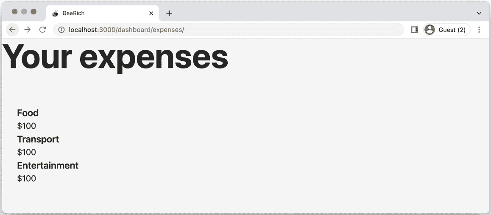
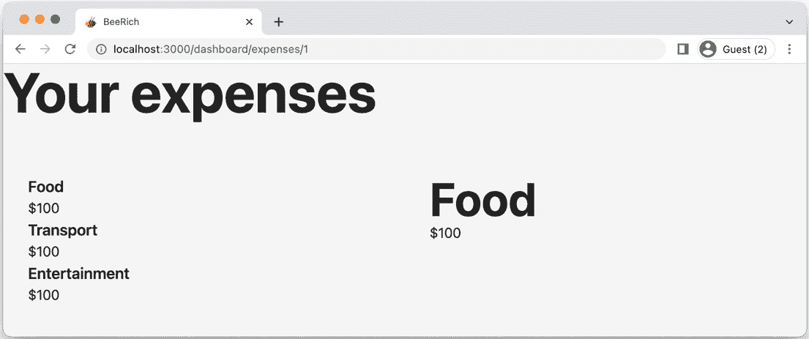
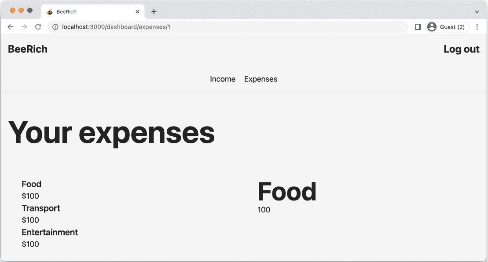
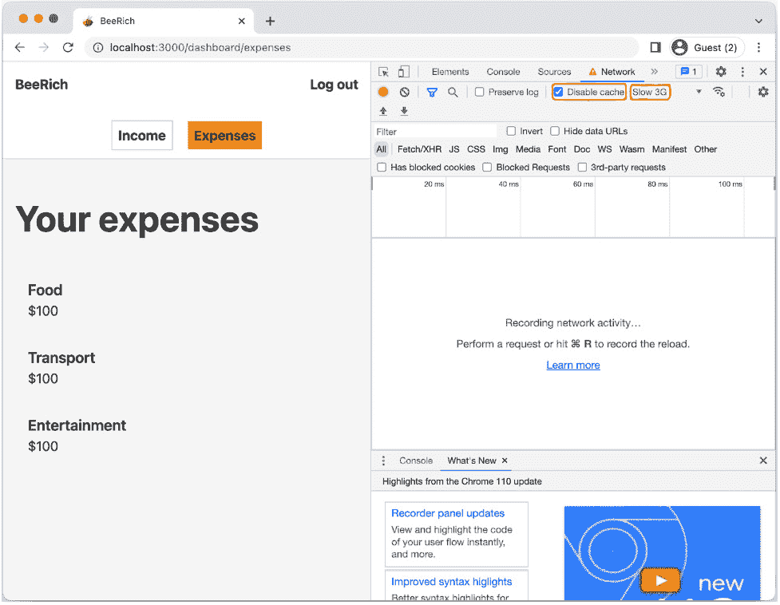

# 第四章：Remix 中的路由

“路由可能是理解 Remix 中最重要的概念。”

– Remix 文档

迈克尔·杰克逊和瑞安·弗洛里斯花费了多年时间构建 React Router。路由在 Remix 中扮演着核心角色并不令人惊讶。迈克尔和瑞安从 React Router 带到 Remix 的一个核心思想是嵌套路由。嵌套路由是一个强大的功能，它能够组合路由组件。

在本章中，您将了解 Remix 中的路由。我们将涵盖以下主题：

+   使用 Remix 的路由模块 API 进行工作

+   从嵌套路由组合页面

+   使用路由参数进行动态路由

+   共享布局

+   在 Remix 中处理导航

在本章中，我们将深入了解嵌套路由并介绍 Remix 的路由约定。我们将从创建独立页面并回顾 Remix 的路由模块导出开始。接下来，我们将回顾嵌套、索引、动态和（无路径）布局路由。最后，我们将学习如何在路由之间进行转换，并了解全局导航对象。

到本章结束时，您将了解 Remix 路由解决方案背后的核心原则。您将练习创建新的路由模块，并了解 Remix 支持哪些导出。您将理解嵌套路由和布局路由的优势。您还将练习如何处理路由参数。最后，您将了解如何使用 Remix 的全局导航对象。

在本章中，我们将向 BeeRich 应用程序添加登录和注册页面。我们将进一步创建一个包含嵌套支出和收入子路由的仪表板路由。然后，我们将为索引、登录和注册页面创建共享布局。最后，我们将使用全局导航对象来动画化页面转换。让我们直接进入正题，并在 Remix 中创建我们的第一个路由。

# 技术要求

在*第三章*，*部署目标、适配器和堆栈*中，我们为本书设置了演示应用程序。如果您还没有这样做，请确保遵循*第三章*的说明，因为我们将在本章继续使用 BeeRich。

您可以在 GitHub 上找到本章的解决方案代码和附加信息：[`github.com/PacktPublishing/Full-Stack-Web-Development-with-Remix/tree/main/04-routing-in-remix`](https://github.com/PacktPublishing/Full-Stack-Web-Development-with-Remix/tree/main/04-routing-in-remix)。

# 使用 Remix 的路由模块 API 进行工作

Remix 承担了编译器、运行时和路由器的责任。在 Remix 中，您将创建路由（路由模块）作为层次结构的一部分。在其他方面，Remix 的路由器确定哪些路由模块与请求匹配并渲染。

本节将指导你如何在 Remix 中创建路由模块。你将学习如何创建独立的页面，并了解路由如何与`root.tsx`文件相关联。你将进一步了解索引路由是如何融入画面（或者说，我应该说是屏幕）的。最后，本节将介绍路由模块可以公开的不同导出。

## 路由文件命名规范

在我们开始之前，请注意，Remix 从 Remix v2 开始切换到新的路由文件命名约定。本书遵循该约定。

如果你刚接触 Remix，那么这一章将帮助你开始使用 Remix 的最新约定。如果你之前有使用 Remix v1 文件系统路由约定的经验，你可以参考以下指南了解有哪些变化：[`remix.run/docs/en/1.19.3/file-conventions/route-files-v2`](https://remix.run/docs/en/1.19.3/file-conventions/route-files-v2)。

## 使用基于文件的路由进行工作

我们首先检查 BeeRich 当前的路线结构。我们将继续使用上一章的 BeeRich 代码。或者，你可以在以下位置找到本章的起始代码：[`github.com/PacktPublishing/Full-Stack-Web-Development-with-Remix/tree/main/03-deployment-targets-adapters-and-stacks/bee-rich`](https://github.com/PacktPublishing/Full-Stack-Web-Development-with-Remix/tree/main/03-deployment-targets-adapters-and-stacks/bee-rich)。

让我们回顾当前的路线层次结构：

1.  在你的 Remix 项目的根目录下终端中运行以下命令：

    ```js
    app/routes folder. We can see that there are currently two files in the folder:*   `demo.tsx`*   `_index.tsx`You will find that this matches the hierarchy displayed by the `remix route` command. The hierarchy can be interpreted as a tree. Everything starts at the root (`root.tsx`). Nested, we have two child routes, each pointing to a file in the `routes` folder. Since the two route modules themselves have no children, they are leaves.Note that one route is flagged as `index`, while the demo route has a `path` property, which matches its filename. Each route segment in the routes hierarchy can have one index file. The index file is the default child route for a parent route and its URL path segment. The root of the `routes` folder maps to the `/`path. The `_index.tsx` file on the root level of the `routes` folder acts as the default route module for that path segment (`/`).
    ```

1.  让我们在本地运行我们的应用程序，通过在终端中执行`npm run dev`来启动。

1.  通过在浏览器中导航到[`localhost:3000/`](http://localhost:3000/)来打开应用程序。这将把我们引导到应用程序的`/`路径。欢迎（再次）来到 BeeRich！

1.  在你的编辑器中，打开`app/routes/_index.tsx`文件。该文件包含以下代码：

    ```js
    import { H1 } from '~/components/headings';_index.tsx route module maps to the /path of the application. It is the default child route of the routes foler and renders when we visit the homepage of BeeRich. We will later see that this pattern holds true for every nested index file inside the routes hierarchy.
    ```

1.  现在，让我们访问`/demo`页面。在浏览器地址栏的 URL 中添加`demo`。演示页面展示了我们可以用来构建 BeeRich 应用程序的可用可重用组件。

1.  打开`app/routes/demo.tsx`文件。注意，我们再次将 React 组件作为模块的默认导出。

这里有一些魔法在起作用。我们不需要通过代码明确指定 Remix 的路由层次结构。没有配置文件将组件映射到路径名。这是`routes`文件夹层次结构的强大之处。它创建了一个**资产清单**，其中包括应用程序的路由层次结构。

当访问一个页面时，Remix 知道要渲染哪个路由组件。将路由组件作为默认导出是一个约定，这样 Remix 就能找到你的代码。

让我们深入了解 Remix 的基于文件的路由约定，并创建一些独立的页面。

## 创建路由模块

在*第八章* *会话管理*中，我们将向 BeeRich 添加注册和登录认证流程。在这一章中，我们将设置一般的路由结构来完成此操作：

1.  在`routes`文件夹中创建一个新文件，并将其命名为`login.tsx`。

1.  接下来，使用浏览器地址栏导航到新创建的页面（[`localhost:3000/login`](http://localhost:3000/login)）。

    我们将在屏幕上看到以下错误弹出：

    ```js
    Error: Element type is invalid: expected a string (for built-in components) or a class/function (for composite components) but got: object. GET request for an HTML document), Remix looked for a default export of a React component. However, we did not specify a default export, or even a React component for that matter.
    ```

重要提示

UI 路由必须导出一个 React 组件作为其默认导出。这是 Remix 基于文件的路由约定的一部分。

1.  要从屏幕上移除错误，切换到您的编辑器并在新创建的`login.tsx`文件中添加一个 React 组件。现在以下代码就足够了：

    ```js
    import { H1 } from '~/components/headings';export default function Component() {  return <H1>Login!</H1>;}
    ```

    注意我们使用`H1`，来自`app/components`文件夹的可重用组件，以避免重写大量的自定义样式。

    此外，请注意导入路径以波浪线符号（`~`）开头。这是一个整洁的 TypeScript 特性。我们在`tsconfig.json`路径配置中将`app`文件夹映射到`~`。这允许我们使用波浪线符号作为快捷方式来定位`app`文件夹中的任何文件或文件夹。

1.  刷新浏览器窗口。现在`/login`页面应该可以正确渲染。太棒了！您刚刚使用 Remix 创建了一个独立的页面！

1.  接下来，在`routes`文件夹中创建一个`signup.tsx`文件。然后，从登录页面复制并粘贴代码，并调整代码以更好地适应注册页面。

1.  使用浏览器地址栏导航到新创建的页面（[`localhost:3000/signup`](http://localhost:3000/signup)）。

1.  让我们再次运行`remix routes`命令来查看路由层次结构是如何增长的。在您的终端中执行以下命令：

    ```js
    npx remix routes
    ```

    这产生了以下路由层次结构：

    ```js
    <Routes>  <Route file="root.tsx">    <Route index file="routes/_index.tsx" />    <Route path="signup" file="routes/signup.tsx" />    <Route path="login" file="routes/login.tsx" />    <Route path="demo" file="routes/demo.tsx" />  </Route></Routes>
    ```

如预期的那样，路由层次结构增加了两个叶子路由。每个叶子路由代表应用程序中的一个页面。我们的应用程序现在处理以下四个路径名：

+   `/`

+   `/``demo`

+   `/``login`

+   `/``signup`

到目前为止，我们`routes`文件夹中的所有路由模块都是文档/UI 路由，它们作为路由层次结构的一部分渲染 React 组件到页面。在下一节中，我们将提供可用的路由模块导出的简要概述，并讨论 UI 和资源路由之间的区别。

## 可用的路由模块导出

在 Remix 中，我们区分资源路由和 UI 路由。每个 UI 路由必须导出一个 React 组件作为默认导出。资源路由不导出一个 React 组件作为默认导出。相反，资源路由必须导出一个`action`和/或`loader`函数。除了其他功能外，资源路由可以公开 API 端点，处理 Webhooks 或动态创建资产。我们将在本章后面创建我们的第一个资源路由。

Remix 检查路由模块导出的函数以确定它是一个 UI 路由还是一个资源路由。虽然资源路由仅支持导出`action`或`loader`函数，但 UI 路由可以导出以下命名的导出：

+   `action`

+   `ErrorBoundary`

+   `handle`

+   `headers`

+   `links`

+   `loader`

+   `meta`

+   `shouldRevalidate`

我们将在接下来的章节中了解更多关于这些导出角色的信息。现在，让我们专注于 Remix 如何使用路由模块导出。Remix 在构建时编译路由层次结构。

在你的文件资源管理器中，导航到 `public/build/` 并打开 `manifest-*.js` 文件。清单文件是在构建应用程序后创建的（`npm run build` 或 `npm run dev`），其中包含一个路由部分。路由部分包含应用程序中每个路由模块的条目。`demo.tsx` 路由的条目如下：

```js
'routes/demo': {    id: 'routes/demo',
    parentId: 'root',
    path: 'demo',
    module: '/build/routes/demo-EKLEFBX2.js',
    imports: ['/build/_shared/chunk-AATHADRZ.js'],
    hasAction: false,
    hasLoader: false,
    hasErrorBoundary: false,
},
```

如代码所示，Remix 通过布尔标志跟踪导出的函数。布尔标志设置为 `false`，因为我们的演示路由没有导出 `action`、`loader` 或 `ErrorBoundary`。

Remix 的路由模块导出是文件路由约定的一部分。Remix 编译路由文件夹的内容并生成一个清单文件。这就是 Remix 让我们避免在代码中进行路由层次结构配置，而是促进基于约定的路由层次结构的原因。

在本节中，我们创建了两个新的路由模块，并了解了 Remix 中路由模块支持的命名导出。我们还使用了 `remix routes` 命令来可视化我们的路由层次结构。在下一节中，我们将深入探讨嵌套路由。

# 从嵌套路由组合页面

BeeRich 是一个个人记账应用程序。用户应该能够查看他们的支出和收入来源。在本节中，我们将创建嵌套路由的层次结构来组合 BeeRich 的仪表板页面。

到目前为止，我们已经看到 `Outlet` 在 `root.tsx` 文件中被使用。`Outlet` 组件在父路由的标记中声明了子路由的位置。`root.tsx` 中的 `Outlet` 组件在 HTML 的 `body` 元素内渲染。因此，所有子路由都被包裹在 `body` 元素内。这就是嵌套路由的力量。使用嵌套路由，你可以从多个路由模块中组合页面。

让我们使用嵌套路由和 `Outlet` 组件来构建我们的仪表板。两个路由，`/dashboard/expenses` 和 `/dashboard/income`，将作为我们的概览页面：

1.  首先，在 `routes` 文件夹内添加两个文件：

    +   `dashboard.expenses.tsx`

    +   `dashboard.income.tsx`

    注意，我们使用点分隔符（`.`）来分隔 URL 中的路径段（`/`）。

1.  在两个文件中添加一个简单的路由组件。参考 `login.tsx`。在两个文件中，将组件作为默认导出。

1.  然后，运行应用程序（`npm run dev`），并在浏览器窗口中查看更改。

    目标是分别列出所有支出和收入来源（发票）。目前，我们将模拟数据并专注于设置路由层次结构。

1.  将以下代码添加到 `dashboard.expenses.tsx` 文件中：

    ```js
    import { H1 } from '~/components/headings';export default function Component() {  return (    <div className="w-full">      <H1>Your expenses</H1>      <div className="mt-10 w-full flex flex-col-reverse         lg:flex-row">        <section className="lg:p-8 w-full lg:max-w-2xl">          <h2 className="sr-only">All expenses</h2>          <ul className="flex flex-col">            <li>              <p className="text-xl font-semibold">Food</p>              <p>$100</p>            </li>            <li>              <p className="text-xl font-semibold">Transport</p>              <p>$100</p>            </li>            <li>              <p className="text-xl font-semibold">Entertainment                 </p>              <p>$100</p>            </li>          </ul>        </section>      </div>    </div>  );}
    ```

    提供的代码将硬编码的支出列表渲染到页面中。

    你也可以在 GitHub 上找到本章的最终代码：[`github.com/PacktPublishing/Full-Stack-Web-Development-with-Remix/tree/main/04-routing-in-remix/bee-rich/solution`](https://github.com/PacktPublishing/Full-Stack-Web-Development-with-Remix/tree/main/04-routing-in-remix/bee-rich/solution)。

1.  同样，我们希望在`/dashboard/income`页面上渲染所有收入来源的列表。从`dashboard.expenses.tsx`文件中复制代码，并将其修改为在`dashboard.income.tsx`中渲染硬编码的发票而不是支出。

    如*图 4.1*所示，两个页面现在都渲染了一个项目列表。在未来，用户还应该能够编辑支出或发票。为此，我们现在将创建一个嵌套的详细视图。



图 4.1 – 支出概览页面的截图

1.  到目前为止，我们通过在浏览器地址栏中更改 URL 来在页面之间导航。现在，是时候添加锚标签了。用户应该能够点击支出概览中的列表项以查看支出详情视图。让我们用锚标签包裹硬编码的列表项内容。第一个列表项可能看起来如下：

    ```js
    <li>  <a href="/dashboard/expenses/1">    <p className="text-xl font-semibold">Food</p>    <p>$100</p>  </a></li>
    ```

    确保每个项目都用锚标签包裹。

    每个列表项现在都链接到一个包含支出模拟标识符的唯一 URL。在下一节中，我们将了解更多关于带有参数的动态路由。现在，让我们使用虚构的模拟标识符来专注于路由结构。

1.  在你的浏览器窗口中，点击列表项中的一个。点击一个项应该会导航你到一个**404 未找到**页面。这是预期的，因为我们还没有创建相关的路由模块。

1.  让我们为具有标识符`1`的支出添加一个硬编码的详细页面。创建一个`dashboard.expenses.1.tsx`文件。

1.  将以下代码添加到`dashboard.expenses.1.tsx`中：

    ```js
    import { H2 } from '~/components/headings';export default function Component() {  return (    <div className="w-full h-full p-8">      <H2>Food</H2>      <p>$100</p>    </div>  );}
    ```

    新创建的详情路由专门用于标识符为`1`的支出。通过在支出概览中点击列表项，我们应该被重定向到列表项的详情视图。

1.  让我们测试我们的实现。使用地址栏导航回`/dashboard/expenses/`页面。然后，点击具有标识符`1`的列表项。

    Snap！出问题了！我们可以看到 URL 如预期那样发生了变化。点击列表项会将 URL 的路径名更新为`/dashboard/expenses/1`。然而，页面内容并没有更新。我们仍然看到支出概览页面的内容。这是怎么回事？

    我们在`/expenses`路径内创建了一个嵌套的`dashboard.expenses.1.tsx`文件。但为什么文件的内容没有出现在页面上？Remix 似乎只渲染了`dashboard.expenses.tsx`文件。

    问题在于`dashboard.expenses.tsx`和`dashboard.expenses.1.tsx`都匹配相同的路径（`/dashboard/expenses/`）。通过这样做，我们将`dashboard.expenses.tsx`文件提升为父布局路由模块（如`root.tsx`）。如果我们想显示`dashboard.expenses.tsx`文件的内容或`dashboard.expenses.1.tsx`文件的内容，那么我们需要将`dashboard.expenses.tsx`从一个父路由改为兄弟路由。

    您之前已经了解到索引路由被用作 URL 路径段的默认子路由。让我们通过添加索引路由来尝试修复问题。

1.  将`dashboard.expenses.tsx`文件重命名为`dashboard.expenses._index.tsx`。

    通过这样做，我们在`expenses`路径中声明了两个路由模块为兄弟关系。兄弟路由模块始终匹配不同的路径名。

1.  在您的浏览器窗口中，导航回`/dashboard/expenses/`页面。现在，点击列表项以导航到`/dashboard/expenses/1`。

    现在 UI 在两个页面之间按预期更新。通过将两个路由模块声明为兄弟关系，我们显示概览页面或详细页面内容。

Remix 的路由层次区分了特定 URL 路径的父路由和兄弟路由。`dashboard.expenses.tsx`是`/`到`expenses`路径。

父路由使用`Outlet`组件来声明其子组件应与其自己的布局一起渲染的位置。`root.tsx`是顶级父路由。

让我们试试看：

1.  撤销您的更改。将`dashboard.expenses._index.tsx`文件重命名为`dashboard.expenses.tsx`。

1.  现在，从 Remix 导入`Outlet`组件，并将其添加到**所有****支出**部分下方：

    ```js
    className attributes and the last two list items from this example for easier readability. You can find the complete code on GitHub.
    ```

1.  刷新您的浏览器窗口。现在，当访问`/dashboard/expenses/1`时，您应该看到支出概览和详细视图并排显示。



图 4.2 – 包含嵌套详细视图的支出概览页面截图

太棒了！我们创建了第一个布局路由，从不同的路由模块中组合页面。通过使用嵌套路由，我们将 URL 的不同部分映射到不同的路由模块。这创建了一个层次嵌套的结构。父路由使用`Outlet`组件来声明子路由应在页面上渲染的位置。

注意，`/dashboard`路径没有伴随`dashboard.tsx`文件。这应该告诉我们布局路由模块是可选的。我们可以使用布局路由在所有子路由之间共享一个共同的布局或创建由不同路由模块组成的复杂页面。然而，如果它们不是必需的，则可以省略。

对于 BeeRich，我们希望使用父布局路由而不是索引路由来渲染概览页面。在这种页面架构中，用户可以在一个页面上看到所有与支出相关的信息。

为了练习使用父布局路由，请确保更新收入页面并将 `Outlet` 组件添加到 `dashboard.income.tsx` 文件中。

在本节中，你学习了如何将页面组合成不同的路由模块。Remix 将 URL 的段映射到路由层次结构中的不同路由模块。使用父布局路由，我们可以在父路由内部嵌套和渲染子路由。然后，每个页面由不同嵌套路由模块的代码组成。接下来，我们将重构硬编码的参数路由并利用参数化路径段来创建动态支出详情页面。

# 使用路由参数进行动态路由

URL 通常包含标识符等参数，用于指定相关资源。这允许应用程序检索请求的正确数据。在本节中，你将学习如何在 Remix 中处理 URL 参数。

到目前为止，我们已经为硬编码的支出详情页面创建了一个路由模块 (`/dashboard.expenses.1.tsx`)。URL 中的数字 `1` 指的是具有支出标识符 `1` 的支出。然而，目标是创建一个能够处理变量标识符的动态路由模块。幸运的是，Remix 提供了一种定义参数化路由段的方法。

## 参数化路由段

在 Remix 中，URL 的动态段被称为参数化段。我们使用 `$` 符号来声明路由参数。这会将 URL 段转换为我们可以访问并用于获取数据的参数。

让我们看看如何在 BeeRich 中使用参数化段来处理支出详情路由：

1.  将 `dashboard.expenses.1.tsx` 重命名为 `dashboard.expenses.$id.tsx`。

    `$` 符号是 Remix 的路由约定的一部分，用于声明动态路由段的参数。

1.  接下来，更新文件内的代码并添加以下模拟数据：

    ```js
    const data = [  {    id: 1,    title: 'Food',    amount: 100,  },  {    id: 2,    title: 'Transport',    amount: 100,  },  {    id: 3,    title: 'Entertainment',    amount: 100,  },];
    ```

    模拟数据目前是我们的数据源。我们将在 *第五章* 中添加一个真实数据库，*获取和* *修改数据*。

1.  之后，添加一个具有以下代码的 `loader` 函数：

    ```js
    import type { LoaderFunctionArgs } from '@remix-run/node';import { json } from '@remix-run/node';export function loader({ loader function runs server-side before its route component is rendered. It is the perfect place to fetch data (on the server) dynamically based on route parameters.Remix exposes the `LoaderFunctionArgs` type to type the `loader` function’s arguments. As visible in the code, Remix provides a `params` argument that can be used to access the route parameters of the current URL.Using a parameterized route, we can now utilize the `params` argument to access the dynamic values of our URL. We access the `id` parameter from the parameter argument and use it to find the right expense from our mock data.We then return the expense object (using the `json` helper function provided by Remix). We will learn more about server-side data fetching and Remix’s server-side conventions and primitives in *Chapter 5*, *Fetching and* *Mutating Data*.
    ```

1.  在文件的路线组件中，我们可以使用 `useLoaderData` 钩子访问 `loader` 响应数据。按照以下方式更新现有的组件代码：

    ```js
    import { useLoaderData } from '@remix-run/react';export default function Component {useLoaderData hook provides access to the route module’s loader data. In our case, we returned an expense object that we can now access in our React application.We pass `typeof loader` as the generic type variable to `userLoaderData` to infer the type of the loader data, based on the `loader` function’s return value. These type hints are great for autocompletion.With that, we have created a dynamic route that renders its content based on the URL!
    ```

1.  确保测试实现。使用支出列表的锚点标签在不同的支出详情路由之间导航。

    如代码所示，如果没有任何支出标识符与路由参数匹配，`loader` 函数会抛出一个 `Response`。如果你看到错误，请确保标识符存在于模拟支出数组中。是的，你可以使用 Remix 抛出 `Response` 对象——我们将在下一节中探讨这一点。

一旦你测试了你的实现，为收入页面创建一个类似的经验。这将帮助你练习到目前为止所学的内容。

如果你还没有这样做，请将`dashboard.income.tsx`文件中的每个列表元素包裹在一个锚点元素中。然后，创建`dashboard.income.$id.tsx`文件并实现`loader`函数。如果你遇到困难，请回顾支出详情路由的实现并将其应用于`dashboard.income.$id.tsx`。你也可以参考来自*第二章*的故障排除过程，*创建新的 Remix 应用*。最后，你可以在本章节的最终解决方案中找到：[`github.com/PacktPublishing/Full-Stack-Web-Development-with-Remix/tree/main/04-routing-in-remix/bee-rich`](https://github.com/PacktPublishing/Full-Stack-Web-Development-with-Remix/tree/main/04-routing-in-remix/bee-rich)。

在本节中，你学习了如何处理动态路由段以及如何声明路由参数。你还简要了解了 Remix 的`loader`函数和`useLoaderData`钩子。在下一节中，我们将利用共享布局来改进我们应用程序的外观和感觉。

# 共享布局

嵌套路由使我们能够从嵌套路由层次结构中组合页面。在本节中，我们将利用父路由在嵌套子路由之间重用布局。我们还将学习如何在路由之间共享代码，而无需在 URL 中创建新段，使用无路径布局路由。

## 使用父布局路由

让我们改进 BeeRich 仪表板的外观和感觉。理想情况下，用户应该能够快速在收入和支出概览页面之间切换。是时候添加导航栏了。

我们已经为`dashboard/expenses`和`dashboard/income`页面使用了父布局路由。通过在父路由（`dashboard.expenses.tsx`和`dashboard.income.tsx`，分别）中渲染支出和收入的列表，我们在同一页面上嵌套了子路由的内容。

现在，我们将再次利用嵌套路由来为所有仪表板页面添加共享导航栏。按照以下步骤操作：

1.  在`routes`文件夹内创建一个`dashboard.tsx`文件。

    由于`dashboard.tsx`路由模块与`dashboard`路径段匹配，它充当该段嵌套路由模块的父路由。

1.  将以下代码添加到`dashboard.tsx`中：

    ```js
    import { Outlet } from '@remix-run/react';import { Container } from '~/components/containers';export default function Component() {  return (    <>      <header>        <Container className="p-4 mb-10">          <nav>            <ul className="w-full flex flex-row gap-5 font-bold               text-lg lg:text-2xl">              <li>                <a href="/">BeeRich</a>              </li>              <li className="ml-auto">                <a href="/404">Log out</a>              </li>            </ul>            <ul className="mt-10 w-full flex flex-row gap-5">              <li className="ml-auto">                <a href="/dashboard/income">Income</a>              </li>              <li className="mr-auto">                <a href="/dashboard/expenses">Expenses</a>              </li>            </ul>          </nav>        </Container>      </header>      <main className="p-4 w-full flex justify-center items-        center">        <Outlet />      </main>    </>  );}
    ```

    代码在 HTML 的`header`元素内添加了一个导航栏，并在`main`元素内渲染 Remix 的`Outlet`组件。

1.  运行应用（`npm run dev`），然后在浏览器窗口中访问`/dashboard/expenses`以查看更改。

    如*图 4**.3*所示，通过添加父路由模块，我们将`dashboard`的每个子路由都包裹在`dashboard.tsx`中渲染的标记内。布局路由提供了一种将所有子路由包裹在公共布局中的绝佳方式。



图 4.3 – 共享仪表板布局的支出页面截图

让我们也将导航栏添加到我们的登录、注册和主页（`_index.tsx`）页面。我们再次可以使用父布局路由来共享公共布局。然而，这将向路径添加一个新的路由段。结果证明，添加父路由并不是我们想要的。父路由会改变 URL，但主页应该位于`/`路径。同样，我们希望登录页面位于`/login`，注册页面位于`/signup`。相反，让我们看看如何使布局路由路径无路径。

## 使用无路径布局路由

幸运的是，Remix 提供了一种声明方式：使用`$`符号声明参数化路由模块，使用下划线前缀（`_`）声明无路径布局路由。无路径路由的行为就像父布局路由一样，但不会向 URL 路径添加段。

让我们添加一个无路径布局路由，以便在登录、注册和主页之间共享布局：

1.  在`routes`文件夹中创建一个新的`_layout.tsx`文件。

    下划线告诉 Remix 将路由模块视为无路径。路由模块的名称将不会添加到 URL 中。您已经从索引路由中了解到下划线前缀，它具有类似的作用。

    注意，选定的名称`layout`不是约定的一部分——您可以按自己的喜好命名路由模块。

1.  接下来，将以下代码添加到`routes/_layout.tsx`文件中：

    ```js
    import { Outlet } from '@remix-run/react';export default function Component() {  return (    <>      <header className="mb-4 lg:mb-10">        <nav className="p-4">          <ul className="w-full flex flex-row gap-5 text-lg             lg:text-2xl font-bold">            <li>              <a href="/">Home</a>            </li>            <li className="ml-auto">              <a href="/login">Log in</a>            </li>            <li>              <a href="/signup">Sign up</a>            </li>          </ul>        </nav>      </header>      <main className="p-4 w-full flex justify-center items-        center">        <Outlet />      </main>    </>  );}
    ```

    这段代码添加了一个导航栏并在一个样式化的`main`元素中渲染`Outlet`。

1.  将`_index.tsx`、`login.tsx`和`signup.tsx`路由模块分别重命名为`_layout._index.tsx`、`_layout.login.tsx`和`_layout.signup.tsx`。

1.  从`_index.tsx` JSX 代码中删除`main` HTML 标签，因为它现在已经被`__layout.tsx`模块渲染。这就是组合和嵌套路由的力量。我们可以减少代码重复并重用布局。

1.  如往常一样，在继续之前确保测试您的更改。运行应用程序，并通过尝试新的导航栏来访问`/`、`/login`和`/signup`页面。

在本节中，您学习了如何利用布局路由为嵌套子路由添加公共结构和样式。您还介绍了无路径布局路由，以便在不向 URL 路径添加路由段的情况下共享布局。在下一节中，我们将学习更多关于 Remix 中页面导航的内容。

# 处理 Remix 中的导航

到目前为止，我们已使用锚点标签在页面之间进行导航。您可能已经注意到，每次导航（使用锚点标签）都会触发整个页面的重新加载。这是浏览器在页面之间导航时的默认行为。然而，Remix 也提供了客户端导航的原语。

在本节中，我们将向您介绍 Remix 的链接组件和 Remix 的全局导航对象。我们将练习使用导航对象来指示页面加载，并了解 Remix 中关于服务器端重定向的更多信息。

## 使用 Remix 的链接组件进行导航

默认情况下，页面导航会触发对资源 Web 服务器的文档请求。Web 服务器将请求转发到 Remix（我们的 HTTP 请求处理器）。然后 Remix 在服务器上渲染一个新的文档以满足请求，并响应以渲染的 HTML 文档（或任何其他 HTTP 响应）。

当使用 Remix 的链接组件时，Remix 阻止浏览器默认行为进行全页请求。相反，Remix 使用 Web 的 Fetch API 执行 fetch 请求来获取请求 URL 所需的数据。我们避免全页刷新，并执行客户端导航。让我们用 Remix 的链接组件（`Link`和`NavLink`）替换 BeeRich 中的锚标签。你可以在`/app/components/links.tsx`中找到这两个链接组件的样式示例实现。有关这两个组件的更多信息，请访问 React Router 文档：[`reactrouter.com/en/6.15.0/components/nav-link`](https://reactrouter.com/en/6.15.0/components/nav-link)：

1.  首先，将`routes/_layout.tsx`中的锚标签替换为。按照以下代码更新：

    ```js
    import { Outlet } from '@remix-run/react';import { NavLink } from '~/components/links';export default function Component() {  return (    <>      <header className="mb-4 lg:mb-10">        <nav className="p-4">          <ul className="w-full flex flex-row gap-5 text-lg             lg:text-2xl font-bold">            <li>              <NavLink to="/">Home</NavLink>            </li>            <li className="ml-auto">              <NavLink to="/login">Log in</NavLink>            </li>            <li>              <NavLink to="/signup">Sign up</NavLink>            </li>          </ul>        </nav>      </header>      <main className="p-4 w-full flex justify-center items-        center">        <Outlet />      </main>    </>  );}
    ```

    我们不是直接使用 Remix 的 NavLink 组件，而是使用一个样式包装组件。

1.  接下来，运行应用程序（`npm run dev`）并在浏览器窗口中打开它。导航到应用程序的主页。现在导航栏应该显示三个样式不错的链接。

1.  在主页上，点击**登录**或**注册**链接。你应该看到浏览器窗口标签页中的 favicon 不再表示全页刷新。相反，Remix 现在使用 JavaScript 的 Fetch API 获取所需数据和资产，执行客户端导航。这些更改使得我们的 Remix 应用程序感觉更像是一个单页应用（SPA）。

1.  现在，让我们重构`dashboard.tsx`父路由的代码。从`components`文件夹中导入`Container`和`NavLink`组件，从 Remix 导入`Link`，并应用以下更改：

    ```js
    import { Link components RemixLink to highlight that we are not using our own Link wrapper component. We also utilize another wrapper component – Container – to reuse some additional styling.
    ```

1.  接下来，重构`dashboard.expenses.tsx`路由模块：

    ```js
    import { Outlet } from '@remix-run/react';import { H1 } from '~/components/headings';ListLinkItem component from the components folder to add custom styling to the expenses list. Under the hood, the component renders Remix’s NavLink component.
    ```

1.  此外，将`dashboard.income.tsx`中的锚标签替换为`ListLinkItem`组件。以`dashboard.expenses.tsx`文件为参考。

1.  在本地运行应用程序，并在浏览器窗口中访问。测试支出和收入概览页面上的链接。注意 Remix 不再执行全页刷新来在页面之间导航。

选择 Remix 的链接组件可以避免页面刷新。在使用全页刷新时，我们必须在每次导航时重新获取所有数据。当使用 Remix 的链接组件时，Remix 只获取新添加的路由模块所需的数据。然而，我们也可以看到当使用锚标签时，Remix 仍然可以正常工作。Remix 尽可能使用 JavaScript 来增强体验，但在必要时可以回退到浏览器的默认行为。

有时候，当我们试图用 JavaScript 增强体验时，我们可能会无意中降低体验。默认情况下，浏览器在页面加载期间用加载指示器替换标签页的 favicon。如果没有完整的页面重新加载，我们就失去了页面转换发生的任何指示。这对于网络连接较慢的用户来说尤其令人沮丧。在下一节中，我们将利用 Remix 的全局转换对象重新添加页面加载指示器。

## 指示页面转换

您可能会问自己为什么我们需要页面加载指示器。在`localhost`上导航如此之快，以至于您几乎注意不到它们。然而，在**慢速 3G**连接上，它们可能会感觉非常漫长。让我们证明页面转换是必要的：

1.  通过在项目的`root`文件夹中执行`npm run dev`来运行 BeeRich。

1.  通过访问[`localhost:3000`](http://localhost:3000)在浏览器中打开应用程序。

1.  打开浏览器开发者工具，并导航到**网络**标签。

1.  搜索节流功能，并从下拉菜单中选择**慢速 3G**。

1.  还要检查**禁用缓存**复选框以模拟用户的首次访问。

    所有主流浏览器都提供类似的设置。如果您找不到描述的节流和缓存功能，请在 Google 上搜索。

1.  确保重新加载浏览器窗口以重置浏览器缓存。

1.  最后，在您的应用的不同页面之间导航。



图 4.4 – Chrome DevTools 网络标签的截图

体验如何？使用慢速互联网连接显示了加载指示器的重要性。通过移除浏览器的默认行为（浏览器窗口标签上的加载旋转器），我们剥夺了用户清晰的加载指示。我们降低了用户体验。幸运的是，Remix 提供了一个全局导航对象，我们可以使用 JavaScript 重新添加加载指示器。

首先，让我们向费用和收入详情视图添加一个加载指示器：

1.  打开`/routes/dashboard.expenses.tsx`文件，并从 Remix 导入`useNavigation`钩子：

    ```js
    import { Outlet, useNavigation } from '@remix-run/react';
    ```

1.  在路由组件内部调用钩子以访问全局导航对象：

    ```js
      const navigation = navigation.state property can have one of the following three values:*   `idle`*   `loading`*   `submitting`
    ```

1.  让我们亲自看看！打开浏览器窗口，导航到`费用`页面。

1.  在浏览器开发者工具中打开**控制台**标签。

1.  点击费用列表中的不同费用项。

    如果没有页面导航，`navigation.state`设置为`idle`。在`GET`请求中，`navigation.state`设置为`loading`。在表单提交时，状态设置为`submitting`然后`loading`（因为每次提交也涉及页面导航）。

    使用 Remix，我们可以通过检查`navigation.state`值轻松显示挂起的 UI。

1.  让我们在`dashboard.expenses.tsx`中添加一个简单的 CSS 动画。首先，导入`clsx`来管理 Tailwind CSS 类：

    ```js
    import clsx from 'clsx';
    ```

1.  然后，将现有的`Outlet`组件包裹在一个样式化的部分中：

    ```js
    loading state and conditionally render Tailwind’s built-in pulse animation.
    ```

1.  确保你的浏览器窗口仍然限制网络带宽。点击支出概览列表中的支出项，并注意当页面导航正在进行时，详情视图会闪烁。

1.  将相同的动画添加到 `dashboard.income.tsx` 以练习使用 Remix 的导航对象。

让我们在应用程序中添加一个全局进度条：

1.  在你的编辑器中打开 `root.tsx` 文件。

1.  从 `components` 文件夹导入 `PageTransitionProgressBar`：

    ```js
    import { PageTransitionProgressBar } from './components/progress';
    ```

1.  然后，在根组件内部渲染 `PageTransitionProgressBar` 组件。这确保了组件将在我们应用程序的所有路由和页面上渲染。我们将组件放置在 `Outlet` 组件上方：

    ```js
    <body className="bg-background dark:bg-darkBackground text-lg text-text dark:text-darkText">  PageTransitionProgressBar component uses the navigation object and tracks a CSS animation across the idle, loading, and submitting states.
    ```

1.  在你的编辑器中打开 `components/progress` 文件，并检查 `PageTransitionProgressBar` 组件的实现。

在本节中，你学习了如何利用导航对象和 `useNavigation` 钩子向用户指示加载状态。现在，我们将通过介绍服务器端重定向来结束本章。

## 从服务器重定向用户

有时，触发导航的最佳位置是在服务器上。在 Remix 中，`loader` 函数是检查请求的资源是否存在以及用户是否有权访问的好地方。在本节中，你将了解 Remix 中关于服务器端重定向的更多信息。

检查 `dashboard.expenses.$id.tsx` 路由文件：

```js
export function loader({ params }: LoaderFunctionArgs) {  const { id } = params;
  const expense = data.find((expense) => expense.id === Number(id));
  if (!expense) throw new Response('Not found', { status: 404 });
  return json(expense);
}
```

在 `loader` 函数中，我们访问路由参数以在模拟数据中找到匹配的支出。如果我们找不到与 `id` 参数匹配的支出，我们抛出一个 `Response`。抛出响应是提前停止执行并返回错误响应的好方法。我们将在 *第七章* 中学习如何处理抛出的 `Response` 对象，*Remix 中的错误处理*。

现在，让我们专注于 Remix 的 `request/response` 流。了解 Remix 既是前端又是后端，遵循 Web 的客户端/服务器模型，这一点很重要。我们的前端应用程序在浏览器中运行并向 Web 服务器（后端）发出请求。后端应用程序处理传入的 HTTP 请求并以 HTTP 响应回答。

Remix 请求/响应模型的好处在于，它遵循 Web 的 Fetch API 标准，而不是自定义。在 `loader` 函数中，我们返回 `Response` 对象，遵循 Fetch API 的 `Response` 规范：[`developer.mozilla.org/en-US/docs/Web/API/Response`](https://developer.mozilla.org/en-US/docs/Web/API/Response)。

此外，Remix 提供了创建 `Response` 对象的原语。我们不仅自己创建 `Response` 对象，还可以使用以下三个辅助函数：

+   `defer`

+   `json`

+   `redirect`

我们已经在 `loader` 函数中使用了 `json` 辅助函数。该辅助函数返回一个带有 `Content-Type` HTTP 头为 `application/json` 的 `Response` 对象。`redirect` 辅助函数创建带有 `302` 状态码的 `Response`。`defer` 是一个用于流式传输响应的高级辅助函数。我们将在 *第十三章**，延迟* *加载数据* *中练习使用 defer。

让我们使用 `redirect` 来修复我们应用程序中的一个错误。你注意到如果你直接导航到 [`localhost:300/dashboard`](http://localhost:300/dashboard) 会发生什么吗？我们渲染了一个空白的仪表盘。

你能想到为什么会有这种行为吗？当前 `/dashboard` 路径段没有默认子路径（一个嵌套的索引路由模块）。最终，当访问 `/dashboard` 路径时，它与子路由中的任何一个都不匹配。当访问 [`localhost:300/dashboard`](http://localhost:300/dashboard) 时，`dashboard.tsx` 中的 `Outlet` 返回 `null`，我们的仪表盘保持为空。

有时候，没有默认子路由并不是一个问题。在 `/dashboard/expenses` 和 `/dashboard/income` 概览页面上，当 URL 中没有添加标识符时，`Outlet` 也返回 `null`。在没有渲染详细视图的情况下显示概览列表似乎没问题。

对于 `/dashboard`，我们应该考虑比渲染一个空仪表盘更好的解决方案。例如，我们可以创建一个 `dashboard._index.tsx` 文件，并导出一个渲染简单欢迎信息的路由组件。或者我们可以将用户重定向到另一个页面！

在 `routes` 文件夹中创建一个 `dashboard._index.tsx` 文件，并添加以下代码：

```js
import { redirect } from '@remix-run/node';export function loader() {
  return redirect('/dashboard/expenses');
}
```

通过这简单的四行代码，我们创建了我们的第一个资源路由。资源路由不导出一个路由组件（否则它将是一个 UI 路由）。相反，资源路由导出一个 `loader` 函数和/或 `action` 函数。

在这里，我们使用 `loader` 函数立即将用户重定向到支出概览页面。如果用户在地址栏中输入 [`localhost:3000/dashboard`](http://localhost:3000/dashboard)，那么 `loader` 函数将返回一个带有 `30x` 状态码的 `Response` - 一个重定向。

通过导航到 [`localhost:3000/dashboard`](http://localhost:3000/dashboard) 来尝试一下。在你的终端中，服务器日志应该如下所示：

```js
GET /dashboard 302 - - 2.918 msGET /dashboard/expenses 200 - - 8.031 ms
```

在导航到 `/dashboard` 时，我们重定向（`302` 状态码）到 `/dashboard/expenses` 路径，然后它被服务（`200` 状态码）。

注意，`redirect` 只是一个用于创建重定向 `Response` 对象的辅助函数。它不过是一个简单的包装，方便使用：

```js
return new Response(null, {  status: 302,
  headers: {
    Location: '/dashboard/expenses',
  },
});
```

Remix 提供了对整个 Web 平台的完全访问权限。你可以创建并返回具有不同状态码、实例属性、缓存头等 `Response` 对象。你所需要做的就是遵循 MDN Web 文档（[`developer.mozilla.org/en-US/docs/Web/API/Response`](https://developer.mozilla.org/en-US/docs/Web/API/Response)）。在本书的后续部分，我们将实现实时功能，添加缓存头，并优雅地处理认证错误，所有这些都将通过使用 Web 平台的 `Response` API 完成。

在本节中，你学习了服务器端重定向。你现在理解了 Remix 在服务器上执行 `loader` 函数，并且 `loader` 函数必须返回一个 `Response` 对象（或 Remix 可以解析为 `Response` 对象的东西）。你还练习了将用户从资源路由重定向到 UI 路由。现在，让我们回顾一下本章所学的内容。

# 摘要

Remix 提供了一个基于约定的文件路由器。可以说，Remix 路由器最强大的功能之一是嵌套路由。在 Remix 中，你创建路由（路由模块）作为层次结构的一部分。Remix 的路由器将 URL 的路径名映射到一组匹配的路由模块。路由模块构成了你的 Remix 应用程序的页面。

在本章中，你在 Remix 中创建了你的第一个路由。我们首先创建了两个独立的页面。你学习了索引路由作为其父路由默认子路由的特殊作用。你还了解了 Remix 路由模块中可用的导出。

接下来，我们为我们的仪表板创建了一个嵌套路由层次结构。我们使用了父布局路由和 `Outlet` 组件在不同的子路由之间重用样式和内容。

我们还使用 `loader` 函数和路由参数来创建我们的收入和支出详情视图的路由。你学习了如何使用 `$` 语法声明参数化路由模块。你还使用了 Remix 的 `userLoaderData` 钩子来访问 `loader` 函数返回的 JSON 数据。

此后，我们使用了无路径布局路由，在不同子路由之间共享布局，而不需要在 URL 中添加路径段。你创建了一个无路径路由，用于包裹 BeeRich 的登录、注册和主页。

你还学习了 Remix 中的导航和过渡。我们用 Remix 的 `Link` 和 `NavLink` 组件替换了 HTML 锚标签。现在，你理解了避免完整页面重新加载的好处，并知道 Remix 在每个页面请求时都会获取所需的脚本和数据。

你还进一步学习了 `useNavigation` 钩子和 Remix 的导航对象。你通过使用导航对象的 state 属性来练习向页面添加加载指示器。最后，你学习了更多关于 Remix 中的 `Request`/`Response` 模型以及如何从服务器重定向用户。

在下一章中，你将了解在 Remix 中的数据加载和变更。我们将使用 Remix 的 `action` 和 `loader` 函数来实现管理 BeeRich 中我们的支出和收入数据的 UI。

# 进一步阅读

在本章中，你学习了 Remix 路由解决方案的关键概念。你可以在 Remix 的路由文档中找到更多概念，例如可选的路由模块：[`remix.run/docs/en/2/file-conventions/routes`](https://remix.run/docs/en/2/file-conventions/routes)。

在 Remix 文档中了解 `Link` 和 `NavLink` 组件：

+   [`remix.run/docs/en/2/components/link`](https://remix.run/docs/en/2/components/link)

+   [`remix.run/docs/en/2/components/nav-link`](https://remix.run/docs/en/2/components/nav-link)

你可以在这里了解更多关于 Fetch API 的 `Request`/`Response` 模型：[`developer.mozilla.org/en-US/docs/Web/API/Fetch_API`](https://developer.mozilla.org/en-US/docs/Web/API/Fetch_API)。

# 第二部分 – 使用 Remix 和 Web 平台

在这部分，你将获得使用 Remix 的原语、约定和杠杆的实际经验，并从头到尾构建一个全栈 Web 应用程序。你将深入理解 Remix 的请求-响应流程、渐进增强，以及如何考虑错误和会话管理来构建健壮的用户体验。最后，你将练习在 Remix 中处理 Web 资产和文件上传。

本部分包含以下章节：

+   *第五章*, *获取和变更数据*

+   *第六章*, *增强用户体验*

+   *第七章*, *Remix 中的错误处理*

+   *第八章*, *会话管理*

+   *第九章*, *处理资产和元数据*

+   *第十章*, *处理文件上传*
