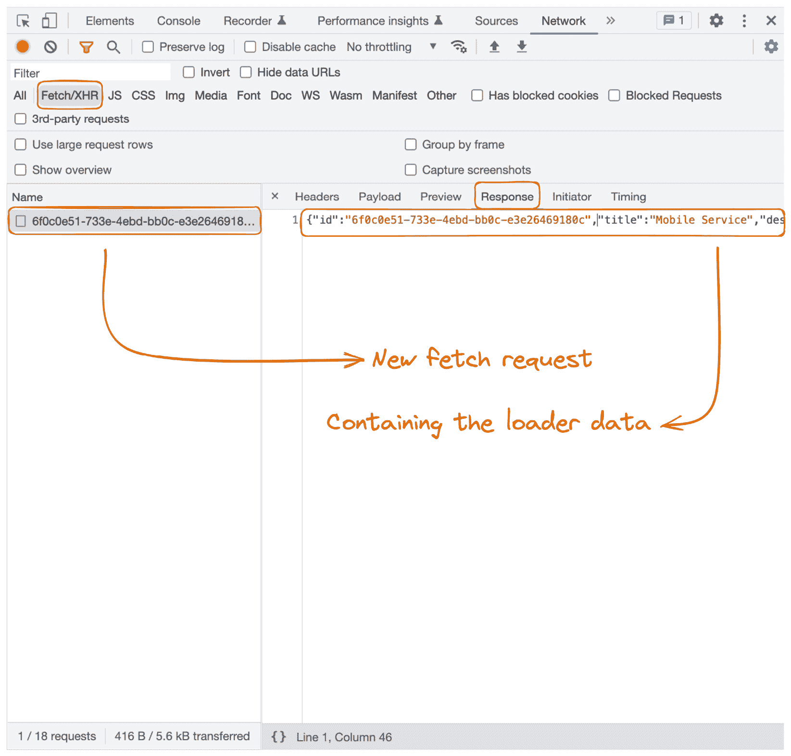
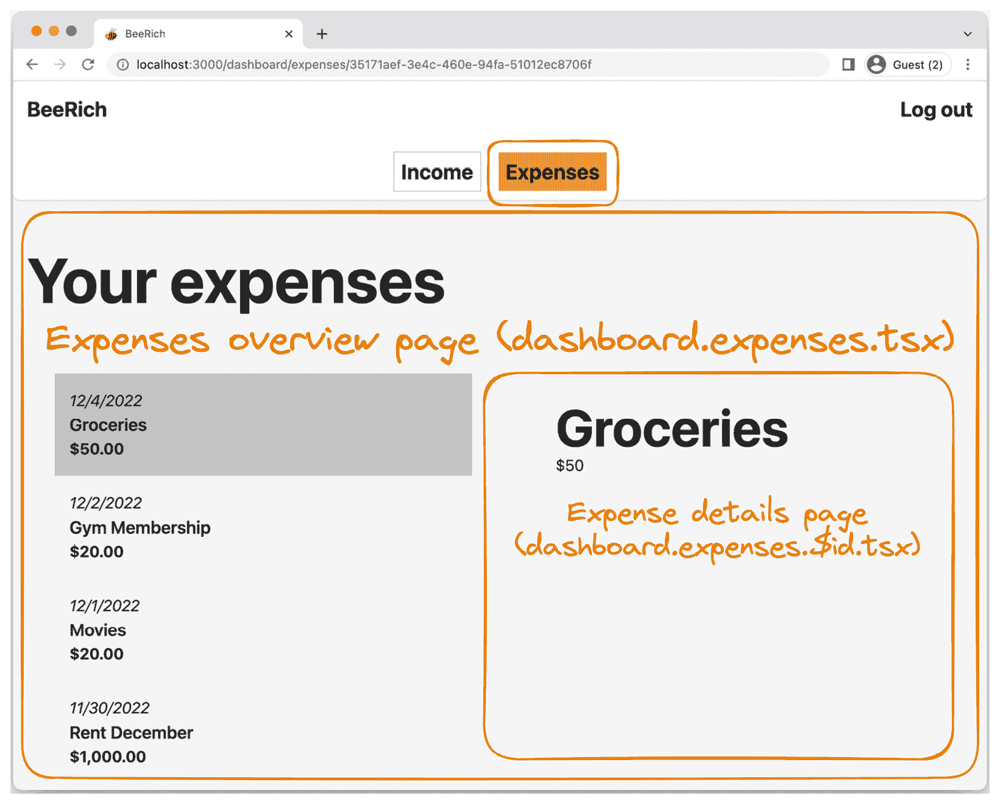
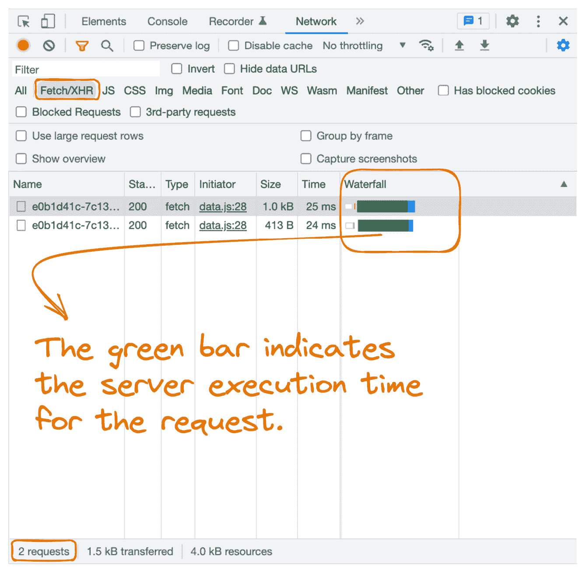

# 5

# 获取和修改数据

在当今的 Web 开发领域中，处理动态数据至关重要。大多数现代应用程序都与来自各种来源的数据进行交互。应用程序管理加载状态、错误和数据更新的方式在用户体验中起着重要作用。幸运的是，Remix 为获取和更新数据提供了全面的解决方案。

本章涵盖了以下主题：

+   获取数据

+   修改数据

在本章中，我们将实现 BeeRich 中的数据读取和写入。首先，我们将练习数据加载。然后，我们将学习 Remix 中的数据修改，并实现支出创建表单。

到本章结束时，你将了解如何在 Remix 中获取和修改数据。你还将理解 Remix 如何执行`loader`和`action`函数，以及如何在修改后重新验证 loader 数据。最后，你将练习以渐进增强为出发点构建应用程序，我们将在*第六章*，*渐进增强用户体验*中继续构建。

# 技术要求

你可以在此处找到本章的设置说明：[`github.com/PacktPublishing/Full-Stack-Web-Development-with-Remix/blob/main/05-fetching-and-mutating-data/bee-rich/README.md`](https://github.com/PacktPublishing/Full-Stack-Web-Development-with-Remix/blob/main/05-fetching-and-mutating-data/bee-rich/README.md)。

注意，本章`start`文件夹中的代码与我们在*第四章*，*Remix 中的路由*中的最终解决方案不同。在继续之前，请先阅读 GitHub 上本章文件夹的`README.md`文件中的说明。

# 获取数据

在深入本章之前，请确保你已经遵循了技术要求部分的步骤。一旦你完成了设置指南，让我们简要回顾一下关键步骤，以防止出现任何问题：

1.  运行`npm i`以安装所有依赖项。

1.  如果你项目根目录中缺少`.env`文件，请创建一个新的`.env`文件，并将其以下行添加到其中：

    ```js
    DATABASE_URL="file:./dev.db"
    ```

    Prisma –我们选择的数据工具包 – 使用`DATABASE_URL`环境变量连接到我们的数据库。

1.  接下来，运行`npm run build`以生成我们数据模式的数据客户端。Prisma 从`prisma/schema.prisma`文件读取我们的 Prisma 模式，并为我们生成类型和函数。

1.  运行`npm run update:db`以创建或更新 SQLite 数据库。我们使用 SQLite 和 Prisma 来持久化我们的开发数据。

1.  最后，运行`npm run seed`以使用模拟数据填充我们的本地数据库。你可以在`prisma/seed.tsx`中找到模拟脚本。

我们已经设置了数据库，现在我们可以使用 Prisma 来查询数据库。接下来，让我们添加从数据库获取数据的代码到 BeeRich 中。

## 在路由级别获取数据

让我们使用 Remix 的`loader`函数和路由级别数据获取来查询数据库以获取支出数据：

1.  在你的编辑器中打开`app/routes/dashboard.expenses.tsx`文件。

1.  向路由模块添加`loader`函数：

    ```js
    export async function loader() {  return {};}
    ```

    `loader` 函数是 Remix 的 HTTP `Request`–`Response` 接口。Remix 的 `loader` 函数仅在服务器上执行，并且必须返回一个 `Response` 对象 ([`developer.mozilla.org/en-US/docs/Web/API/Response`](https://developer.mozilla.org/en-US/docs/Web/API/Response)).

    目前，我们返回一个空的 JavaScript 对象。Remix 会为我们序列化对象（`JSON.stringify`）并创建一个带有 `Content-Type` `application/json` 的 `Response` 对象。

1.  接下来，导入我们新的数据库客户端：

    ```js
    import { db } from '~/modules/db.server';
    ```

重要提示

你可以在本地的 `README.md` 文件中找到更多关于我们 Prisma 客户端设置的信息：[`github.com/PacktPublishing/Full-Stack-Web-Development-with-Remix/blob/main/05-fetching-and-mutating-data/bee-rich/README.md`](https://github.com/PacktPublishing/Full-Stack-Web-Development-with-Remix/blob/main/05-fetching-and-mutating-data/bee-rich/README.md).

1.  使用数据库客户端查询所有费用，并从 `loader` 函数返回结果数组：

    ```js
    import { db } from '~/modules/db.server';export async function loader() {json helper function from Remix and pass the expenses array to it:

    ```

    json 辅助函数返回一个带有 Content-Type application/json 的 Response 对象。使用辅助函数允许我们将 init 对象作为第二个参数提供，以便向响应添加 HTTP 头部、状态文本和状态码。这一步是可选的，因为我们还没有在 `Response` 对象中返回任何 HTTP 头部或 cookies。我们将在本书的后面更详细地介绍这一点。

    ```js

    ```

1.  更新数据库查询以按日期排序数据：

    ```js
    const expenses = await db.expense.findMany({loader function. Performing as much logic as we can on the server minimizes the need for client-side state management. This is a best practice we should keep in mind.
    ```

尽可能地将逻辑移动到服务器

我们应该尝试将尽可能多的代码移动到服务器端的 `action` 和 `loader` 函数。

将代码移动到服务器确保发送到客户端的代码更少。它还增加了在客户端 JavaScript 完全加载之前可以工作的逻辑量。最后，我们通过将代码移动到快速且强大的服务器和数据库运行时，确保我们降低客户端应用程序的复杂性。

1.  此后，在 `loader` 函数中添加 `console.log` 以便我们可以在终端中跟踪其执行。

1.  运行应用程序（`npm run dev`）并在浏览器窗口中打开 BeeRich。

1.  最后，在不同页面之间导航并检查服务器终端中的 `console.log` 消息。注意当 `loader` 函数执行时。由于 `loader` 函数仅在服务器上运行，你将在终端而不是浏览器控制台中找到日志语句。

太棒了！每当将 `dashboard/expenses` 路径添加到 URL 中时，Remix 会调用 `dashboard.expenses.tsx` 路由模块的 `loader` 函数。

接下来，我们需要找出如何在 React 中访问数据。幸运的是，在 Remix 中这非常简单。

1.  再次，在你的编辑器中打开 `dashboard.expenses.tsx` 路由模块。

1.  从 `@remix-run/react` 中导入 `useLoaderData` 钩子。

1.  接下来，在路由模块组件中调用钩子：

    ```js
    const expenses = useLoaderData();
    ```

    我们使用`useLoaderData`钩子首先访问 loader 数据`loader`函数，然后在服务器上渲染 React 应用程序。在我们的 React 组件中，我们访问获取到的数据，而无需管理加载状态。这使我们能够消除许多 React 应用程序都遭受的大量样板代码。

1.  到目前为止，我们路由组件中的`expenses`变量被类型化为`any`。这并不理想。幸运的是，我们正在使用 TypeScript 来编写前端和后端代码。我们还在同一个`app`文件夹中集中存放客户端和服务器代码。这使我们能够做一些强大的事情，例如，在调用`useLoaderData`时推断 loader 数据的类型。

    将`loader`函数的类型传递给`useLoaderData`的泛型槽位：

    ```js
    const expenses = useLoaderData<expenses (that is, by hovering over the variable name in your editor). The variable is now typed as an expense object array that is wrapped by JsonifyObject<{…}>.Remix co-locates your client and server code in the same file. This allows us to infer the types of fetched data across the network (from server to client). However, since we work with `Response` objects in `loader` functions, the returned data is serialized as JSON. This changes the shape of the data. For instance, JSON cannot manage `Date` objects but serializes them to `string`.`JsonifyObject` is a helper type from Remix that ensures that the expense object is correctly typed after being serialized to JSON. We will return to that later; for now, we are happy that we can easily access the `loader` data and have it fully typed.
    ```

1.  让我们使用支出数组来替换硬编码的支出列表。遍历支出数据以渲染支出列表：

    ```js
    <ul className="flex flex-col">  {createdAt property is of the string type. We turn it into a Date object by calling new Date(expense.createdAt). In the loader function, the expenses array carries createdAt properties of the Date type. On the client, we need to deserialize the data as it was parsed to JSON.
    ```

1.  最后，运行应用程序并访问支出概览页面。你应该能够从种子数据中查看支出列表。

    太棒了！我们利用服务器端的`loader`函数来获取数据，然后在 React 中访问这些数据以渲染我们的页面。Remix 的`loader`函数允许我们将服务器端数据加载和数据渲染放在同一个文件中。

注意，在 Remix 中，数据获取发生在路由级别的`loader`函数中。通过放弃从组件中获取数据的部分灵活性，路由级别的数据获取提供了许多优势。

基于组件的数据加载容易受到阻塞请求的影响，这可能导致获取瀑布。一个经常获取数据的组件会推迟渲染其子组件，直到数据加载完成。这阻止了子组件启动它们自己的获取请求，实际上创建了一个获取请求的瀑布。

想象一个渲染页面布局的组件。首先，它获取用户对象，并在用户数据被获取之前显示一个大的加载指示器。在用户数据被获取后，页面被渲染。嵌套组件现在会获取它们自己的数据。用户获取请求阻塞了这些请求。这种行为可能在应用程序嵌套子树中重复多次。

Remix 促进路由级别的数据获取

在 Remix 中，我们的目标是路由模块中获取数据，而不是组件。通过避免在组件级别进行细粒度数据获取，我们旨在优化数据加载并防止获取瀑布。我们应该将此作为最佳实践记住。

注意，路由级别的数据获取并不意味着你只能在该路由级别访问数据。你可以在应用程序的任何自定义钩子或组件中使用`useLoaderData`、`useRouteLoaderData`和`useMatches`钩子来访问 loader 数据。

`useRouteLoaderData`和`useMatches`钩子用于访问任何当前活动路由中的数据——与返回钩子所在的路由模块数据的`useLoaderData`相比。有关更多信息，请参阅 Remix 文档：[`remix.run/docs/en/2/hooks/use-route-loader-data`](https://remix.run/docs/en/2/hooks/use-route-loader-data)。

如往常一样，确保为收入路由实现相同的功能。这确保你在继续之前重新审视本节中介绍的概念。

接下来，让我们看看如何根据动态路由参数获取数据。

## 在参数化路由中获取动态数据

现在我们已经更新了支出概览页面，你可能已经注意到这破坏了我们硬编码的支出详情路由。让我们修复它。

你可能还记得从*第四章*，*Remix 中的路由*，我们设计了支出详情页面作为一个嵌套路由，它在支出概览页面中渲染。它也是一个使用动态路由参数的参数化路由。

让我们更新代码，以便根据路由参数从数据库查询请求的支出：

1.  在你的编辑器中打开`/app/routes/dashboard.expenses.$id.tsx`文件。我们已经在其中使用`loader`函数来渲染模拟数据。

1.  从文件中删除模拟数据数组。

1.  接下来，更新`loader`函数以查询数据库并找到我们从 URL 访问的具有`id`参数的唯一支出对象：

    ```js
    404 Response if we cannot find an expense that matches the id parameter. This is a great way to stop further executions and show the user that something went wrong.
    ```

1.  通过在终端中执行`npm run dev`来运行 BeeRich。

1.  打开一个浏览器窗口并导航到[`localhost:3000/dashboard/expenses/`](http://localhost:3000/dashboard/expenses/)。

1.  点击列表中的任一支出。

    注意 URL 会改变以包含支出的`id`参数。Remix 执行客户端导航（当 JS 可用时）以更新 URL。

Remix 在我们导航到相关路由段时执行`loader`函数。在每次页面导航时，Remix 都会获取与请求的新页面匹配的每个新路由模块的`loader`数据。如果我们导航到`/login`，那么所有**新匹配的路由**的`loader`函数都会执行。这可能包括以下路由模块（从根到叶）：

+   `root.tsx`

+   `routes/_layout.tsx`

+   `routes/_layout.login.tsx`

如果我们进一步从`/login`导航到`/signup`，那么只有`_layout.signup.tsx`路由模块的`loader`函数会执行，因为它是我们之前尚未激活的唯一路由段。

让我们通过回顾浏览器窗口开发者工具中的**网络**选项卡来可视化正在发生的事情：

1.  在运行你的应用的浏览器窗口中打开开发者工具。

1.  打开开发者工具的**网络**选项卡。

1.  通过`Fetch/XHR`网络请求进行筛选。这是可选的，但有助于你找到所有发送到`loader`函数的 fetch 请求。

1.  现在，将 URL 栏中的 URL 更改为 [`localhost:3000/dashboard/expenses/`](http://localhost:3000/dashboard/expenses/) 并重新加载浏览器窗口。

1.  你应该看不到在 `dashboard.expenses.tsx` 路由模块的 `loader` 函数执行时出现的 fetch 请求，数据被用于在服务器上渲染 HTML。

1.  接下来，点击费用列表中的任何一项费用。

    Remix 现在在客户端运行。在 hydration 之后，客户端 Remix 应用接管了我们应用程序的路由。这允许我们避免全页请求，这需要更多的网络带宽并增加响应时间。

    由于我们正在使用 Remix 的 `Link` 组件，Remix 可以拦截页面转换。如果加载了 JavaScript，Remix 会阻止浏览器默认行为（全页刷新），而是通过向我们的 `loader` 函数发送 fetch 请求来模拟这种行为以获取所需数据。

1.  在 `/dashboard/expenses/$id` 路由中检查请求会调用 `dashboard.expenses.$id.tsx` 路由模块的 `loader` 函数，如 *图 5.1* 所示：



图 5.1 – 路由转换后获取的 loader 数据截图

如 *图 5.1* 所示，Remix 执行对 `loader` 函数的 fetch 请求，然后返回 JSON 格式的费用对象。

1.  点击另一项费用。注意，Remix 对每个导航到费用详情路由的行为进行重复。每次我们点击新的费用时，URL 都会改变，并且详情页的 `loader` 函数会再次调用下一个 `$id` 路由参数。

    注意，Remix 从不重新获取概述页的费用数组。这是因为我们仍然位于 `dashboard.expenses.tsx` 路由段。**Remix 只为新的匹配路由段加载数据。**

太好了！我们现在能够使用参数化路由获取动态数据。请注意，Remix 只为新匹配的路由段获取数据。这避免了不必要的请求。我们还了解到，Remix 在服务器端渲染和客户端导航期间从 `loader` 函数获取数据。Remix 在网络的两侧按路由级别处理数据加载。

Remix 是一个前端和后端框架

Remix 在服务器端渲染 React 之前，在服务器上对初始请求调用 `loader` 函数。在客户端，Remix 使用 AJAX 请求（fetch 请求）在客户端导航时获取 loader 数据。

通过更新 `dashboard.income.$id.tsx` 路由模块以匹配 `dashboard.expenses.$id.tsx`，回顾本节中介绍的概念。在继续之前，确保测试你的实现。通过使用 **网络** 选项卡检查在 `/income` 和 `/expenses` 路由之间切换时执行的 `loader` 函数。

接下来，让我们看看 `loader` 函数是如何并行调用的。为此，我们需要对我们的应用程序逻辑进行一些调整。

## 并行加载数据

如 *图 5**.2* 所示，费用概览页面有两个部分 – 所有费用的列表 (`dashboard.expenses.tsx`) 和当前选中费用的详细视图 (`dashboard.expenses.$id.tsx`)。当导航到 `/dashboard/expenses` 时，详细视图是空的，因为嵌套的 `$id` 路由模块不会出现在屏幕上：



图 5.2 – 费用路由的截图，包含嵌套的 $id 路由模块

让我们更新 `/dashboard/expenses`。我们将更新此链接，使其指向最近创建的费用：

1.  在您的编辑器中打开 `dashboard.tsx` 路由模块。

1.  将以下 `loader` 函数添加到路由模块中：

    ```js
    import { json } from '@remix-run/node';import { db } from '~/modules/db.server';export async function loader() {  const firstExpense = await db.expense.findFirst({    orderBy: { createdAt: 'desc' },  });  return json({ firstExpense });}
    ```

    `loader` 函数查询数据库以获取最近创建的费用。然后它返回查询到的 `firstExpense`。

    注意，如果数据库中没有费用条目，`firstExpense` 也可以是 `null`。

1.  接下来，使用 `useLoaderData` 钩子访问 `firstExpense` 对象：

    ```js
    const { firstExpense } = useLoaderData<typeof loader>();
    ```

    我们使用 `loader` 函数的类型来键入 `useLoaderData` 钩子。`firstExpense` 现在正确地键入为费用对象的序列化版本或 `null`。

1.  使用 `firstExpense` 更新 `NavLink` 的 `to` 属性。由于 `firstExpense` 可能是 `null`，我们必须确保我们条件性地进行此更改：

    ```js
    <li className="mr-auto">  <NavLink    to=NavLink component now navigates the user to the most recently created expense.
    ```

1.  通过执行 `npm run dev` 来运行 BeeRich，并在浏览器窗口中打开费用概览页面：[`localhost:3000/dashboard/expenses`](http://localhost:3000/dashboard/expenses)。

    注意，`NavLink` 组件丢失了其活动样式。这是因为链接现在指向一个嵌套路由，它不会在 Remix 的 `NavLink` 组件上触发 `isActive` 条件。幸运的是，我们的自定义 `NavLink` 组件提供了一个 `styleAsActive` 属性，我们可以在需要时使用它来应用活动样式。

1.  从 `@remix-run/react` 中导入 `useLocation` 钩子。

1.  接下来，在路由模块组件中调用钩子：

    ```js
    const location = useLocation();
    ```

    Remix 的 `useLocation` 钩子让我们能够访问一个全局位置对象，其中包含有关当前 URL 的信息。

1.  将 `styleAsActive` 属性添加到 `NavLink` 中。当用户位于 `/``expenses` 路由时，将属性设置为 `true`：

    ```js
    <NavLink  to={firstExpense ? `/dashboard/expenses/${firstExpense.id}` : '/dashboard/expenses'}  /dashboard/expenses route.With these changes in place, let’s learn about parallel data fetching.
    ```

1.  在浏览器窗口中访问 `/dashboard/income` 页面并清除 **网络** 选项卡。

1.  现在，通过点击 **费用** 导航菜单链接，导航到最近创建的费用详情页面。

1.  如 *图 5**.3* 所示，你现在应该在 `loader` 函数中看到两个 fetch 请求：

    +   `dashboard.expenses.tsx`

    +   `dashboard.expenses.$id.tsx`

    `dashboard.tsx` 中的 `loader` 函数在没有导航之前页面上的路由模块已经激活的情况下不会执行：



图 5.3 – 检查 fetch 请求瀑布图

如 *图 5**.3 所示，我们可以在 **网络** 选项卡中检查获取请求的水瀑布。绿色条表示请求的服务器执行时间。请注意，两个获取请求都是并行执行的。这平缓了请求水瀑布并提高了响应时间。

你可能已经注意到我们在 `dashboard.expenses.$id.tsx` 的 `loader` 函数中再次查询数据库。你可能已经问过自己为什么我们不重用来自 `dashboard.expenses.tsx` 的 `loader` 数据，因为我们已经从数据库中获取了所有费用。这是 `loader` 函数并行执行的一个权衡。由于所有 `loader` 都是在并行执行，因此几个 `loader` 不能相互依赖。

让我们总结一下我们的观察结果：

+   在初始请求时，Remix 在服务器上渲染我们的应用程序。

+   所有活跃的 `loader` 函数都并行执行，并在服务器端渲染期间传递给 React 应用程序。

+   使用加载器，我们在每个路由级别上获取应用程序数据。

+   Remix 使用 JavaScript 模拟浏览器的默认行为。所有后续的页面导航如果已加载 JavaScript，则执行客户端操作。

+   Remix 使用获取请求在导航时加载所有必需的 `loader` 数据。

+   所有新匹配的路由段 `loader` 函数都并行执行。

+   已经活跃的 `loader` 函数不再执行。

通过在 `/income` 路由上实现相同的功能来练习本节中学到的内容。在 `dashboard.tsx` 路由模块的 `loader` 函数中查询最近创建的发票。然后，更新 `NavLink` 组件。最后，使用 `useLocation` 钩子添加 `styleAsActive` 属性。

接下来，让我们看看我们是否可以稍微优化一下代码：

1.  在你的编辑器中打开 `app/routes/dashboard.tsx` 文件。

1.  在将发票查询添加到 `loader` 函数后，该函数可能看起来像这样：

    ```js
    export async function loader() {  const firstExpense = await db.expense.findFirst({    orderBy: { createdAt: 'desc' },  });loader function, we have the opportunity to execute the queries in parallel to reduce the response time.
    ```

1.  重构代码，使其并行执行两个查询：

    ```js
    export async function loader() {  const Promise.all to execute them in parallel.
    ```

在本节中，我们介绍了 Remix 中的数据获取。你学习了如何使用和类型化 `useLoaderData` 钩子以及如何根据动态路由参数查询数据。你现在知道 Remix 在路由模块级别上促进数据获取。这允许我们并行执行 `loader` 函数并避免请求瀑布。你进一步理解了尽可能将逻辑移动到服务器以减少客户端包的大小和复杂性的重要性。最后，你练习了优化 `loader` 函数以并行执行独立请求。接下来，我们将学习关于数据变更的内容。

# 数据变更

创建和更新数据与获取数据一样重要。在本节中，我们将添加一个费用创建表单并学习如何在 Remix 中变更数据。

## 无 JavaScript 的数据变更

记得我们之前讨论过的瑞安·弗洛伦斯（Ryan Florence）构建 Web UI 的三个步骤吗？第一章？第一步是让用户体验在没有 JavaScript 的情况下也能工作。之后，我们添加 JavaScript 来增强用户体验，但确保基本实现仍然有效。这个过程被称为**渐进增强**。

在本节中，我们使用 Remix 的`action`函数来处理服务器上的传入表单提交。在`action`函数中，我们将验证用户数据并将新的支出对象写入数据库。让我们看看我们如何使用原生的表单元素提交用户数据，而无需客户端 JavaScript：

1.  首先，为支出创建表单创建一个新的路由模块：`app/routes/dashboard.expenses._index.tsx`。

    我们将支出创建表单添加到`/dashboard/expenses/`路径的索引路由中。这导致以下路由层次结构：

    +   `/dashboard/expenses/`：显示支出列表和支出创建表单

    +   `/dashboard/expenses/$id`：显示支出列表和具有`id`标识符的支出详情

1.  向`dashboard.expenses._index.tsx`添加一个包含 HTML 表单元素的路由组件：

    ```js
    export default function Component() {  return (    <form method and action attributes. method defines the submission method (POST or GET), and action sets the path name for the submission.We set the method to `POST` as we are mutating data.
    ```

使用 POST 进行修改，使用 GET 进行加载

HTML 表单使用 HTTP 动词`POST`和`GET`进行提交。最好使用`POST`请求进行修改，使用`GET`请求从服务器读取数据。

我们希望将数据提交到`dashboard.expenses._index.tsx`路由模块（表单元素的路由模块）。请注意，这是默认行为，因此我们也可以省略属性声明。然而，出于教育目的，我们将`action`设置为`/dashboard/expenses?index`作为动作的路径名。

注意添加到动作路径名的`?index`搜索参数。索引路由模块及其父路由模块都匹配相同的 URL。在定义`action`函数时，该动作可以存在于`dashboard.expenses.tsx`或`dashboard.expenses._index.tsx`中。`?index`搜索参数告诉 Remix 提交到索引路由模块，而不是父模块。

1.  接下来，让我们添加支出数据的输入字段：

    ```js
    export default function Component() {  return (    <form method="post" action="/dashboard/expenses/?index">      <label className="w-full lg:max-w-md">        Title:        <input type="text" route module component now renders a simple HTML form with fields for the expense data. It doesn’t look pretty without CSS. We will solve this in the next step. For now, let’s focus on the content of the form.We add `name` attributes to the input and textarea elements. On form submission, the form data includes key-value pairs for every named input field. The `name` attributes are used as the keys of the form data. Finally, a button of the `submit` type is used to submit the form data on click.
    ```

1.  接下来，向路由模块添加一个`action`函数：

    ```js
    import type { loader functions to handle HTTP GET requests. Remix’s action function is called for all other HTTP requests to the route, including POST requests.Both functions receive a couple of parameters. You already know about the `params` parameter, which lets us access dynamic route segments. Now, we’re using the `request` parameter, which gives us access to the `Request` object ([`developer.mozilla.org/en-US/docs/Web/API/Request`](https://developer.mozilla.org/en-US/docs/Web/API/Request)).We type `loader` function parameters with the `LoaderFunctionArgs` type and `action` function parameters with the `ActionFunctionArgs` type.
    ```

1.  使用`request`参数将请求体解析为表单数据：

    ```js
    export async function action({ request }: ActionFunctionArgs) {  Request object.By calling the `formData` function, we parse the request body into a `FormData` object that provides us with access to the key-value pairs of the form input data. You can find more information about form data in the MDN Web Docs: [`developer.mozilla.org/en-US/docs/Web/API/FormData`](https://developer.mozilla.org/en-US/docs/Web/API/FormData).
    ```

1.  从 Remix 导入我们的数据库客户端和`redirect`函数：

    ```js
    import { redirect } from '@remix-run/node';import { db } from '~/modules/db.server';
    ```

1.  在使用之前验证表单数据以创建新的支出：

    ```js
    export async function action({ request }: ActionFunctionArgs) {  const formData = await request.formData();  const title = formData.get('title');  const description = formData.get('description');  const amount = formData.get('amount');zod library to help validate user input. For now, we keep it simple and manually validate the data using if stamtents.Note that, once again, we co-locate the server-side HTTP handler and the associated client-side UI together in one file.
    ```

1.  检查`action`函数的返回语句。我们将重定向到创建的支出的详情页面以传达成功：

    ```js
    redirect(`/dashboard/expenses/${expense.id}`);
    ```

    与`loader`函数一样，`action`函数必须返回一个`Response`对象或纯 JSON（Remix 为我们将其包装在`Response`对象中）。

    我们使用 Remix 的`redirect`辅助函数来创建重定向响应对象。

1.  在您的编辑器中打开`/dashboard/expenses.$id.tsx`路由模块，并添加一个快速链接到支出创建页面：

    ```js
    FloatingActionLink component wraps Remix’s Link component. The quick link from the expense details page to the creation form allows for a convenient workflow:*   Expense creation redirects to the created expense.*   The expense details page offers a quick link back to expense creation.
    ```

1.  执行`npm run dev`以启动开发服务器。

1.  导航到费用概览页面([`localhost:3000/dashboard/expenses/`](http://localhost:3000/dashboard/expenses/))并测试实现。创建你的第一个费用！

你注意到了什么？当提交原生的 HTML 表单元素时，浏览器执行了整个页面的重新加载。这是浏览器在表单提交时的默认行为。此外，你可能还会注意到，创建的费用在提交完成后出现在费用列表中。

整个页面的重新加载会触发整个页面的刷新。Remix 在服务器上渲染 HTML 并触发所有活动的加载器函数。费用概览在提交时重新加载。

表单元素提供了一个`FormData` API，并使用命名输入字段来声明应该发送到服务器的字段。表单提交会触发对`action`函数的`POST`请求。我们使用`Request`对象来解析提交的表单数据。这发生在服务器上。到目前为止，我们的实现没有使用任何客户端 JavaScript。

在 React 单页应用（SPA）中，我们通常在`onSubmit`处理程序中调用`event.preventDefault`来防止浏览器的默认行为。这里，我们发起一个客户端的 fetch 请求。这可能看起来像这样：

```js
function CreateExpenseForm() {  const [title, setTitle] = React.useState('');
  const [description, setDescription] = React.useState('');
  const [amount, setAmount] = React.useState(0);
  const [isSubmitting, setIsSubmitting] = React.useState(false);
  const handleSubmit = async (event: React.FormEvent<HTMLFormElement>) => {
    event.preventDefault();
    setIsSubmitting(true);
    await fetch('/dashboard/expenses/?index', {
      method: 'POST',
      body: JSON.stringify({ title, description, amount }),
    });
    setIsSubmitting(false);
  };
  return (
    <form onSubmit={handleSubmit}>
      <Input
        label="Title:"
        placeholder="Dinner for Two"
        required
        value={title}
        onChange={(event) => setTitle(event.target.value)}
      />
      <Textarea label="Description:" value={description}         onChange={(event) => setDescription(event.target.value)} />
      <Input
        label="Amount (in USD):"
        type="number"
        required
        value={amount}
        onChange={(e) => setAmount(e.target.valueAsNumber)}
      />
      <Button type="submit" isPrimary disabled={isSubmitting}>
        Create
      </Button>
    </form>
  );
}
```

通过这样做，我们避免了整个页面的重新加载，并能够控制哪些 React 状态应该通过修改来更新。然而，由于不支持原生的表单提交，我们失去了回退到浏览器默认行为的能力。更糟糕的是，自行实现这一功能迫使我们开发针对挂起状态、错误处理和修改后的状态重新验证的自定义解决方案。

在不使用 JavaScript 的情况下使其工作使我们能够支持在 JavaScript 加载之前或加载失败时的用户交互。这是使用 Remix 原语和约定时所获得的一个强大功能。然而，Remix 也具有向上扩展的能力。让我们添加 JavaScript 来增强体验。

## 使用 JavaScript 修改数据

Remix 提供了一个`Form`组件，它渐进地增强了体验。我们只需要通过 Remix 的`Form`组件替换原生的 HTML 表单元素：

1.  从 Remix 导入`Form`组件：

    ```js
    import { Form } from '@remix-run/react';
    ```

1.  使用它来替换原生的 HTML 表单元素：

    ```js
    export default function Component() {  return (Form component, Remix prevents the browser’s default behavior and executes a client-side fetch request to submit the form, avoiding the full-page reload. This works out of the box without us adding an onSubmit handler.
    ```

1.  我们的自定义页面加载指示器被触发，表明表单提交也会影响 Remix 的全局导航对象。

1.  提交后，应用仍然执行重定向并将用户过渡到费用详情页面。

1.  提交后，新的费用作为`/dashboard/expenses/`路由的加载器数据的一部分出现在费用概览列表中。Remix 模拟了浏览器在页面上刷新所有内容的默认行为。

记得 Remix 的`NavLink`和`Link`组件如何增强锚标签导航吗？通过用 Remix 的`Form`组件替换原生的表单元素，我们能够获得客户端数据获取、渐进增强和客户端状态重新验证的功能。

我们现在利用客户端的 JavaScript，但这个 JavaScript 是通过 Remix 的`Form`组件提供的，不需要任何自定义样板代码。Remix 的`Form`组件将全局导航对象的州设置为`submitting`和`loading`，以管理挂起的 UI。使用 Remix 的`Form`组件进一步确保在突变后重新获取所有活动的`loader`函数。

Remix 在每次操作后都会重新验证 loader 数据

Remix 在执行`action`函数后，通过从所有活动的`loader`函数重新获取来刷新所有 loader 数据，就像在 HTML 表单提交时进行完整页面重新加载一样。

数据重新验证是一个强大的功能，它让我们能够避免客户端上的过时数据，或者不必开发自定义逻辑来同步客户端和服务器状态。

太棒了！在本节中，我们实现了一个费用创建表单及其相关的`action`函数。你学习了 Remix 如何通过提供`Form`组件来移除样板代码，该组件在幕后完成繁重的工作。你练习了使用命名输入字段和 Remix 的`Form`组件声明获取请求。

在继续之前，让我们通过引入一些准备好的 UI 组件来美化我们的表单：

1.  从`components`文件夹中导入`Textarea`、`Input`和`Form`组件：

    ```js
    import { Form, Input, Textarea } from '~/components/forms';
    ```

1.  移除 Remix 的`Form`组件的导入，因为我们将使用我们自己的自定义包装组件。

1.  用我们的样式化替代品替换原生的标签、输入和文本区域元素：

    ```js
    export default function CreateExpensePage() {  return (    <Form method="post" action="/dashboard/expenses/?index">Button component from the components folder:

    ```

    `import { Button } from '~/components/buttons';`

    ```js

    ```

1.  用我们的包装组件替换原生的按钮元素，并添加`isPrimary`属性：

    ```js
    <Button type="submit" isPrimary>  Create</Button>
    ```

1.  在本地运行 BeeRich。现在表单看起来应该好多了。

确保你实现了发票创建表单，并复制我们在费用路由中做的事情。首先，在不使用 JavaScript 的情况下实现功能。然后，使用 Remix 的`Form`组件增强体验。我鼓励你保留`Fetch/XHR`网络请求，并检查 Remix 在每次表单提交后如何重新验证所有 loader 数据。如果你在处理收入路由时遇到困难，你可以在 GitHub 上找到本章的最终解决方案：[`github.com/PacktPublishing/Full-Stack-Web-Development-with-Remix/tree/main/05-fetching-and-mutating-data/bee-rich/solution`](https://github.com/PacktPublishing/Full-Stack-Web-Development-with-Remix/tree/main/05-fetching-and-mutating-data/bee-rich/solution)。

# 摘要

读取和写入数据是现代网络应用开发的重要方面。Remix 提供了原语、约定和杠杆，以支持这两者。

本章介绍了 Remix 的服务器端`loader`和`action`函数。你了解到`loader`和`action`函数是路由级别的 HTTP 请求处理器，用于获取和修改数据。Loaders 处理 HTTP `GET`请求，而`action`函数接收所有其他传入的 HTTP 请求。

最初，Remix 在服务器上渲染我们的应用程序。所有后续的页面转换都在客户端发生。在初始请求中，加载器数据在服务器端渲染期间使用。在所有后续导航中，Remix 通过 fetch 请求获取加载器数据，并且仅在客户端重新渲染路由层次结构中变化的部分。

接下来，您了解到路由级别的数据获取使我们能够——在其他方面——简化可能发生在组件级别获取中的请求瀑布。Remix 还并行执行 `loader` 函数以减少响应时间。

通过完成本章，您现在应该了解 Remix 如何使用 HTML 表单元素声明式地处理突变。Remix 提供了开箱即用的渐进式增强。默认情况下，Remix 执行客户端 fetch 请求以执行数据突变。然而，如果 JavaScript 不可用（尚未加载、加载失败或被禁用），那么 Remix 可以回退到浏览器的默认行为。

在本章中，我们添加了一个 `action` 函数来验证请求数据并创建一个新的支出对象。Remix 在每次突变后自动重新获取所有加载器数据。使用 Remix，我们能够开箱即用地获得数据重新验证。

Remix 的数据加载和突变可以在有和无 JavaScript 的情况下工作。这使我们能够逐步增强用户体验，并使我们的应用程序对更多用户可访问。在下一章中，我们将学习更多关于逐步增强用户体验的内容。我们将正式化本章所学内容，并学习更多用于增强 Remix 应用程序体验的工具。

# 进一步阅读

Remix 文档在这里概述了 Remix 中的全栈数据流：[`remix.run/docs/en/2/discussion/data-flow`](https://remix.run/docs/en/2/discussion/data-flow).

您可以在以下位置找到有关 Remix 数据加载的文档：[`remix.run/docs/en/2/guides/data-loading`](https://remix.run/docs/en/2/guides/data-loading).

您可以在以下位置找到有关 Remix 突变的文档：[`remix.run/docs/en/2/guides/data-writes`](https://remix.run/docs/en/2/guides/data-writes).

Remix 团队创建了一个名为 Remix Singles 的精彩视频系列，深入探讨了如何在 Remix 中处理数据。该系列从关于数据加载的视频开始，您可以在以下位置找到：[`www.youtube.com/watch?v=NXqEP_PsPNc`](https://www.youtube.com/watch?v=NXqEP_PsPNc).

MDN Web Docs 是一个学习 HTTP 协议的绝佳地方：[`developer.mozilla.org/en-US/docs/Web/HTTP/Basics_of_HTTP`](https://developer.mozilla.org/en-US/docs/Web/HTTP/Basics_of_HTTP).
