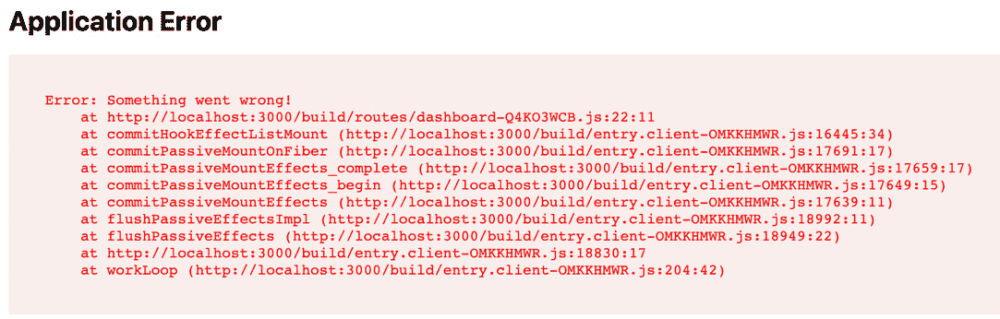
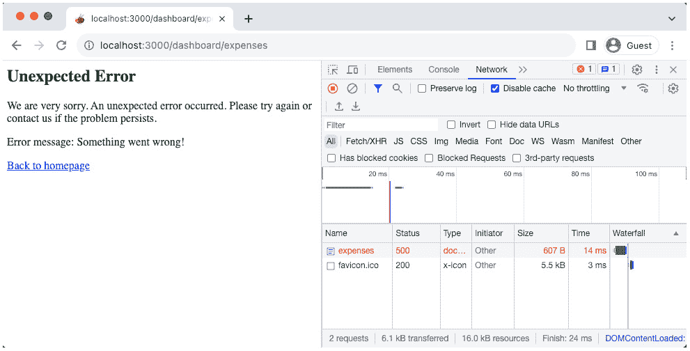
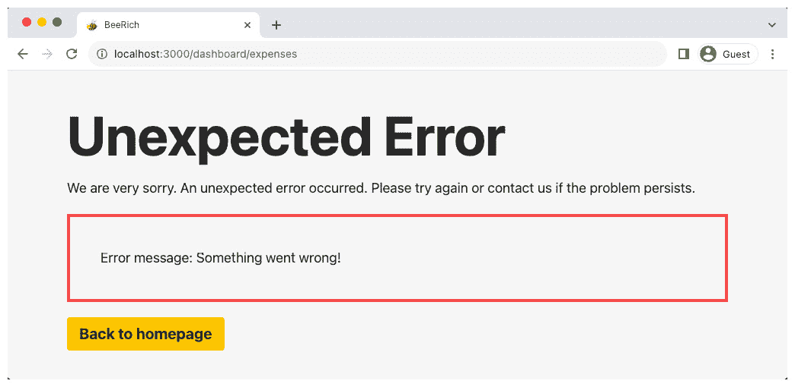
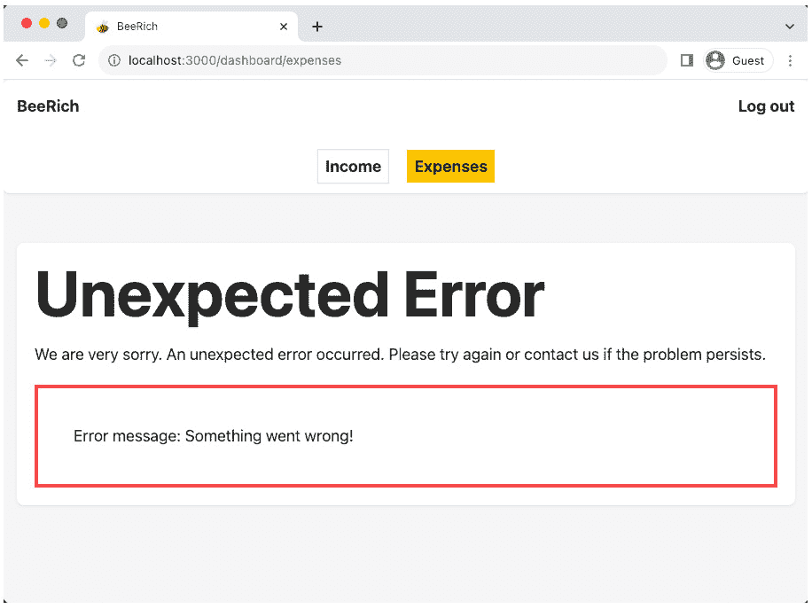
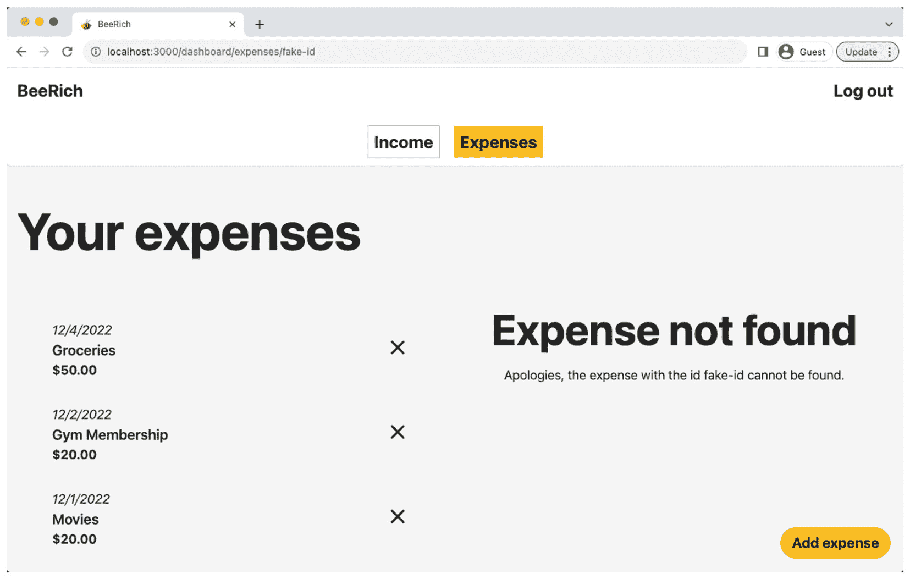

# 7

# Remix 的错误处理

错误处理是构建弹性用户体验的重要组成部分。我们可以区分两种错误：

+   意外错误，例如网络超时

+   故意抛出的预期失败（异常）

Remix 提供了处理意外和预期错误的原语和约定。本章涵盖了以下主题：

+   处理意外错误

+   处理抛出的响应

+   处理页面未找到（404）错误

首先，我们将制造一些意外错误并学习如何处理它们。接下来，我们将回顾在`loader`和`action`函数中返回和抛出`Response`对象之间的区别。我们将看到如何使用 Remix 的`ErrorBoundary`处理抛出的响应。最后，我们将向 BeeRich 添加未找到错误处理。

阅读本章后，您将了解如何使用 Remix 的`ErrorBoundary`组件声明式地管理意外和预期失败。您还将知道抛出响应如何融入 Remix 的异常处理故事，以及抛出和返回响应之间的区别。最后，您将了解如何使用 Remix 处理未找到错误。

# 技术要求

您可以继续使用上一章中的解决方案。本章不需要额外的设置步骤。如果您遇到困难，可以在此处找到本章的解决方案代码：https://github.com/PacktPublishing/Full-Stack-Web-Development-with-Remix/tree/main/07-error-handling-in-remix。

# 处理意外错误

在运行时，Remix 应用程序在浏览器和服务器上执行。可能会出错，客户端和服务器上可能会发生意外错误。考虑错误情况以提供弹性用户体验非常重要。在本节中，我们将研究如何在 Remix 的根级别和嵌套路由中处理意外错误。

## 调用客户端和服务器错误

在*第二章*《创建新的 Remix 应用程序》中，我们提供了一个故障排除指南，并调查了 Remix 如何统一处理客户端和服务器上的错误。让我们通过调用一些“意外”的错误来再次回顾 Remix 的默认错误处理：

1.  在编辑器中打开您的 BeeRich 应用程序。

1.  在`app/routes`文件夹中打开`dashboard.tsx`路由模块。

1.  在`loader`函数体中返回语句之前添加以下代码：

    ```js
    throw Error('Something went wrong!');
    ```

    通过在`loader`函数中抛出错误，我们阻止了应用程序处理传入的请求。这会在服务器上创建一个意外的失败。

1.  在终端中执行`npm run dev`以运行应用程序。

1.  在新浏览器窗口中打开[`localhost:3000/dashboard`](http://localhost:3000/dashboard)以访问 BeeRich 仪表板。

    在`loader`函数中抛出错误会渲染 Remix 的错误页面，如*图 7.1*所示：


**图 7.1** – 加载函数中的应用错误

**图 7**.1 展示了 Remix 处理意外错误时的默认行为。我们可以看到屏幕上显示的“出了点问题！”错误消息以及未能执行的 `loader` 函数的堆栈跟踪。

1.  现在，让我们在路由组件中抛出一个错误。将错误从 `loader` 函数移动到 `dashboard.tsx` 路由组件内部：

    ```js
    export default function Component() {  throw Error('Something went wrong!');
    ```

1.  刷新浏览器窗口。

    通过重新加载页面，我们触发整个页面的重新加载。Remix 在服务器上处理初始文档请求。因此，仪表板路由模块组件首先在服务器上被调用，我们再次在服务器上抛出错误。

    错误堆栈跟踪会改变，但 Remix 仍然在屏幕上显示“出了点问题！”。

1.  现在，将错误包裹在一个 `useEffect` 钩子中，以确保错误在客户端执行：

    ```js
    import { useEffect } from 'react';export default function Component() {  useEffect(() => {    throw Error('Something went wrong!');  }, []);
    ```

    React 的 `useEffect` 钩子仅在客户端执行，不在服务器上执行。这是因为钩子在初始渲染之后执行，而在服务器上我们只渲染一次。

1.  再次刷新浏览器窗口。你应该在页面上看到另一个堆栈跟踪。这次，堆栈跟踪来自客户端脚本。

    如**图 7**.2 所示，请注意堆栈跟踪中的文件名包含哈希值。这意味着文件已被打包，并且是客户端打包的一部分：



**图 7.2** – 客户端应用错误

这个实验告诉我们 Remix 为浏览器和服务器错误提供了相同的默认体验。接下来，让我们用自定义 UI 替换 Remix 的默认错误页面。

## 使用根错误边界处理错误

在 React 中，渲染过程中的失败可以通过错误边界来处理。错误边界是实现了错误边界生命周期方法的类组件。Remix 在 React 的错误边界之上构建，并扩展了其功能以处理服务器端错误。我们不是在组件树中嵌套 React 错误边界，而是通过在路由模块 API 中导出 `ErrorBoundary` 组件来声明它们。

`root.tsx` 路由模块中的 `ErrorBoundary` 组件是我们应用程序中最顶层的错误边界。为了替换 Remix 的默认错误页面，我们需要从 `root.tsx` 导出 `ErrorBoundary` 组件：

1.  在您的编辑器中打开 `app/root.tsx` 路由模块。

1.  从 Remix 导入 `useRouteError` 钩子：

    ```js
    import {  Links,  LiveReload,  Meta,  Outlet,  Scripts,  ScrollRestoration,  ErrorBoundary and add the following code to it:

    ```

    `import { H1 } from './components/headings';import { ButtonLink } from './components/links';export function ErrorBoundary() {  ErrorBoundary 组件是 Remix 路由 API 的一部分，并在发生错误时替换路由模块组件。我们可以通过调用 useRouteError 访问导致失败的错误。我们进一步使用错误对象来显示错误信息。`

    ```js

    ```

1.  制造一个意外的错误，并刷新浏览器窗口以检查更新的错误页面：



图 7.3 – 自定义根 ErrorBoundary 组件

如 *图 7.3* 所示，我们现在为我们的应用程序渲染了一个自定义错误页面。

1.  检查 `root.tsx` 中 `ErrorBoundary` 组件的代码。注意我们渲染了我们的样式化 `H1` 和 `ButtonLink` 组件。为什么我们的自定义样式没有应用到页面上？

1.  检查 `Meta`、`Links` 和 `Scripts` 组件，将我们的元数据和链接标签以及客户端 JavaScript 脚本附加到 HTML 文档中。这发生在 `root.tsx` 中的路由模块组件中。然而，在发生错误时，我们不渲染路由模块组件，而是渲染 `ErrorBoundary` 组件。

    Remix 默认将错误边界的内容包裹在一个 HTML body 标签中。然而，我们也可以提供一个自定义的 HTML 文档。让我们更新代码，以便在 `root.tsx` 文件中的 `ErrorBoundary` 组件中渲染 `Meta`、`Links` 和 `Scripts` 组件。

1.  在 `root.tsx` 中创建一个新的 `Document` 组件，以便我们可以在 `App` 和 `ErrorBoundary` 组件之间重用代码：

    ```js
    function Document(Document component renders the JSX from the App component. We just replaced Outlet with children.
    ```

1.  现在，更新 `App` 组件以便它使用 `Document`：

    ```js
    export default function App() {  return (    App component remains unchanged. We just moved the code into the reusable Document component.
    ```

1.  接下来，也将错误边界的内容包裹在 `Document` 组件内部：

    ```js
    export function ErrorBoundary() {  const error = useRouteError();  let errorMessage = error instanceof Error ? error.message :    null;  return (    Document component, the error boundary now includes our application’s scripts, stylesheets, and custom html and head elements:
    ```



图 7.4 – 样式化根 ErrorBoundary 组件

太棒了！现在，我们可以在根 `ErrorBoundary` 组件中利用客户端 JavaScript 和我们的自定义样式。当我们为 `ErrorBoundary` 组件重用组件时，我们必须记住的一件事是我们不能调用 `useLoaderData` 钩子。确保不要渲染访问 loader 数据的组件，因为在 `ErrorBoundary` 组件渲染时，loader 数据未定义。

错误边界无法访问 useLoaderData

如果路由模块的 `loader` 或 `action` 函数中发生错误，则会渲染错误边界。最终，错误边界中不可用 loader 数据。

BeeRich 中的顶级 `ErrorBoundary` 组件不渲染任何导航栏或其他布局组件。保持顶级 `ErrorBoundary` 组件简单可以确保即使在意外失败的情况下也能渲染。

接下来，让我们看看如何通过声明嵌套错误边界来进一步改进错误处理。

## 嵌套错误处理

错误边界可以嵌套。当抛出错误时，它会通过路由层次结构向上冒泡，直到 Remix 找到最近的错误边界。嵌套错误边界让我们能够包含错误。

让我们在仪表板路由模块中添加一个嵌套错误边界：

1.  打开 `app/routes` 文件夹内的 `dashboard.tsx` 路由模块。

1.  在页面中添加一个简单的 `ErrorBoundary` 导出：

    ```js
    export function ErrorBoundary() {  return <p>Error contained in dashboard.tsx</p>;}
    ```

1.  现在，在 `dashboard.tsx` 路由模块的 `loader` 函数中抛出一个错误：

    ```js
    throw Error('Something went wrong!');
    ```

1.  运行应用并在新浏览器窗口中打开 [`localhost:3000/dashboard`](http://localhost:3000/dashboard) 访问仪表板。

    注意，我们不是渲染根错误边界，而是在 `dashboard.tsx` 中嵌套的错误边界。Remix 使用最近的可用错误边界并在父路由组件的 `Outlet` 中渲染它。

1.  让我们让错误边界看起来更美观。就像我们在 `root.tsx` 中做的那样，我们希望在 `ErrorBoundary` 组件和路由组件之间共享标记。重构路由组件，使其成为一个可重用的 `Layout` 组件。首先，从函数定义中移除 `export default` 并添加一个 `LayoutProps` 类型来指定组件期望的属性：

    ```js
    import type { Layout component expects three props: React children, firstExpense, and firstInvoice. To type the props correctly, we wrap the Expense and Invoice types from Prisma with Remix’s SerializeFrom type.Prisma (our database ORM) generates the `Expense` and `Invoice` types based on our Prisma database schema. Remix’s `SerializeFrom` type transforms the `Expense` and `Invoice` types into their serialized versions. This is necessary as the data travels over the network, serialized as JSON. For instance, the `createdAt` field is of the `Date` type on the server but serialized as `string` once accessed via `useLoaderData`.
    ```

1.  从 `Layout` 函数体中移除 `useLoaderData` 调用。由于错误边界不能调用 `useLoaderData`，我们必须将加载数据作为可选属性传递。如 `LayoutProps` 所见，我们确保 `Layout` 组件也接受 `null` 作为 `firstExpense` 和 `firstInvoice` 的值。这可能是在我们的数据库中没有找到任何费用或发票时，或者当错误边界被渲染时的情况。

1.  将 `Outlet` 的渲染替换为 `children`：

    ```js
    <main className="p-4 w-full flex justify-center items-center">Layout:

    ```

    `export default function Component() {  const { firstExpense, firstInvoice } = useLoaderData<typeof loader>();  return (    <Layout firstExpense={firstExpense} firstInvoice={firstInvoice}>      <Outlet />    </Layout>  );}

    ```js

    The route component renders the same content as before. We just moved some code to the new `Layout` component.
    ```

1.  接下来，更新 `dashboard.tsx` 中的 `ErrorBoundary` 组件：

    ```js
    import { Link as RemixLink, Outlet, useLoaderData, useLocation, loader function for a moment.
    ```

1.  运行应用程序并访问 [`localhost:3000/dashboard`](http://localhost:3000/dashboard) 页面。

    如果没有抛出错误，我们应该看到费用概览页面。如果你不记得这是为什么，请查看 `dashboard._index.tsx` 路由模块内部。如果仪表板的索引路由是活动的，它将重定向到费用概览页面。

1.  接下来，在任何活动在仪表板内的 `loader` 函数或 React 组件中抛出错误：

    ```js
    throw Error('Something went wrong!');
    ```

    浏览器窗口现在应该渲染样式化的嵌套错误边界。如 *图 7**.5* 所见，将错误边界添加到仪表板路由中使我们能够隔离错误并正确渲染所有父路由：



图 7.5 – 嵌套仪表板 ErrorBoundary 组件

嵌套错误边界允许我们在路由层次结构的子集中包含错误。这确保了父路由按预期渲染。错误边界离发生的错误越近，错误就越被限制。

在本节中，你学习了如何使用 Remix 的 `ErrorBoundary` 组件来处理意外的错误。接下来，让我们看看如何使用 `ErrorBoundary` 组件来处理预期的异常。

# 处理抛出的响应

我们已经在 BeeRich 中利用了抛出 `Response` 对象的优势。例如，在 *第四章*，*Remix 中的路由*，我们在 `dashboard.expenses.$id.tsx` 路由模块中添加了以下 `loader` 函数：

```js
export function loader({ params }: LoaderFunctionArgs) {  const { id } = params;
  const expense = data.find((expense) => expense.id === Number(id));
  if (!expense) throw new Response('Not found', { status: 404 });
  return json(expense);
}
```

在 `loader` 函数中，如果我们找不到 `id` 路由参数对应的费用，我们将抛出一个 `Response` 对象。这将在 `loader` 函数执行期间创建一个预期的失败。让我们调查 Remix 在发生预期异常时的默认行为。

## 抛出响应

在 JavaScript 中，`throw` 语句用于抛出用户定义的异常。然后，`catch` 块可以捕获抛出的异常。我们可以抛出任何值，包括 `Response` 对象。Remix 利用这一点，提供了一个约定来使用异常响应提前停止 `action` 和 `loader` 函数。让我们调用在费用详情 `loader` 中抛出的未找到响应：

1.  通过执行 `npm run dev` 在本地主机上运行 BeeRich。

1.  在新浏览器窗口中打开 [`localhost:3000/dashboard/expenses`](http://localhost:3000/dashboard/expenses) 访问费用概览页面。

1.  现在，点击概览列表中的费用。这将将我们重定向到费用详情页面。

1.  将 URL 中的 `id` 路由参数替换为假的：[`localhost:3000/dashboard/expenses/fake-id`](http://localhost:3000/dashboard/expenses/fake-id)。然后，重新加载浏览器窗口。

这应该会将我们的仪表板错误边界渲染到页面上。

Remix 允许我们使用 `ErrorBoundary` 组件统一处理意外的错误和抛出的响应。在 `loader` 或 `action` 函数中抛出的任何 `Response` 对象都会触发 `ErrorBoundary` 组件。

抛出的响应允许我们检索额外的信息，例如 `ErrorBoundary` 组件中错误的状态码。为此，我们需要检查抛出的错误对象是否是 `Response` 对象或意外的错误。

## 使用错误边界处理异常

让我们添加第三个错误边界，这次是为嵌套费用详情页面：

1.  打开 `dashboard.expenses.$id.tsx` 路由模块。

1.  导入 Remix 的 `useRouteError` 和 `isRouteErrorResponse` 辅助函数：

    ```js
    import {  isRouteErrorResponse,  useActionData,  useLoaderData,  useNavigation,  useParams,  useRouteError,} from '@remix-run/react';
    ```

1.  创建一个新的 `ErrorBoundary` 导出，并添加以下代码：

    ```js
    export function ErrorBoundary() {  const error = useRouteError();  const { id } = useParams();  let heading = 'Something went wrong';  let message = `Apologies, something went wrong on our end, please try again.`;  if (useParams hook to access the expense id route parameter. Then, we use Remix’s isRouteErrorResponse helper to check whether the error object is a Response object. If yes, then we can read the status code and other fields of the Response object to provide a more specific error message.
    ```

1.  接下来，测试实现。导航到费用详情页面，并在 URL 中使用假的 `id` 路由参数。你现在应该能看到页面上的嵌套 `ErrorBoundary` 组件被渲染。

    注意我们仍然渲染了费用概览列表；这就是嵌套错误处理的力量！



图 7.6 – 嵌套费用详情 ErrorBoundary 组件

既然我们已经为费用详情页面实现了嵌套错误边界，那么接下来为收入详情页面实现相同的体验。

一旦你完成收入详情页面的工作，我们将重新审视来自 *第六章*，*增强用户体验* 的不愉快体验。

## 创建一个有弹性的体验

你还记得我们在*第六章*，“增强用户体验”中引入支出删除表单时创建了一个不愉快的体验吗？如果你在一个支出详情页（`dashboard/expenses/$id`）上，并且一次性快速删除所有支出，你可能会结束在一个未找到的页面上。这是因为我们在`dashboard/expenses/$id`的`deleteExpense`函数中的重定向逻辑：

```js
async function deleteExpense(request: Request, id: string): Promise<Response> {  const referer = request.headers.get('referer');
  const redirectPath = referer || '/dashboard/expenses';
  try {
    await db.expense.delete({ where: { id } });
  } catch (err) {
    throw new Response('Not found', { status: 404 });
  }
  if (redirectPath.includes(id)) {
    return redirect('/dashboard/expenses');
  }
  return redirect(redirectPath);
}
```

我们如果可用，会使用`referer`头将用户在删除后重定向回当前路由。这是为了提升用户体验。如果用户当前在详情页，`/dashboard/expenses/1`，并且删除了`id`为`2`的支出，我们不希望将用户从`/dashboard/expenses/1`重定向走。然而，在`deleteExpense`函数中我们也有一个`if`条件来确保如果用户当前在要删除的支出的详情页上，我们会重定向用户。

当我们快速删除多个支出时，这个逻辑会失败。同时触发多个支出删除操作会创建不同动作请求之间的竞争条件。最终决定用户将被重定向到哪里的将是最后触发的`action`的响应。然而，到那时，我们可能已经删除了当前在详情视图中查看的支出。

假设我们正在详情页，`/dashboard/expenses/1`，并且快速删除了`id`为`1`的支出，然后又删除了`id`为`2`的支出。在处理删除支出`1`的`deleteExpense`函数中，我们知道支出`1`已经被删除，因此我们返回重定向到`/dashboard/expenses`。然而，在处理删除支出`2`的`deleteExpense`函数中，我们将返回重定向到当前页`/dashboard/expenses/1`。Remix 会取最后用户动作的响应并提交重定向到`/dashboard/expenses/1`。我们在`loader`函数中抛出一个 404 未找到错误，因为`id`为`1`的支出找不到（它已经被删除了）。

如*图 7**.6 所示，我们通过引入嵌套的`ErrorBoundary`组件来增强支出详情的用户体验。太棒了！现在，如果出现 404 错误，用户将停留在支出概览页，错误被包含在嵌套的`ErrorBoundary`中。我们避免了向用户显示全屏的错误消息，而是优雅地将未找到错误作为仪表板 UI 的一部分显示。

声明式错误处理

Remix 的错误边界允许我们声明式地处理错误和异常。通过添加嵌套的错误边界，我们可以优雅地处理边缘情况，以提供弹性的用户体验。

现在我们已经通过嵌套错误边界确保了弹性的用户体验，让我们增强根错误边界，为常见的 HTTP 状态码添加自定义错误消息。在下一节中，我们将处理页面未找到错误（404）。

# 处理页面未找到（404）错误

我们还可以在根`ErrorBoundary`组件中处理抛出的响应。一个只能在根`ErrorBoundary`组件中处理的特殊情况是 Remix 抛出的页面未找到异常。让我们回顾根错误边界以在根级别处理抛出的响应：

1.  通过执行`npm run dev`在本地运行 BeeRich。

1.  在新浏览器窗口中访问一个不存在的页面，例如[`localhost:3000/cheesecake`](http://localhost:3000/cheesecake)。

    当访问一个不存在的路由时，Remix 会在根级别抛出一个带有 HTTP 状态码 404 的响应。我们可以使用`isRouteErrorResponse`来使用根错误边界渲染一个 404 页面。

1.  在编辑器中打开`root.tsx`文件。

1.  从 Remix 导入`isRouteErrorResponse`：

    ```js
    import {  ErrorBoundary export in root.tsx:

    ```

    const error = useRouteError();let heading = 'Unexpected Error';let message =  'We are very sorry. An unexpected error occurred. Please try again or contact us if the problem persists.';if (H1 and p texts with the heading and message values:

    ```js
    <H1>{heading}</H1><p>{message}</p>{errorMessage && (  <div className="border-4 border-red-500 p-10">    <p>Error message: {errorMessage}</p>  </div>)}
    ```

    ```js

    ```

1.  再次访问[`localhost:3000/cheesecake`](http://localhost:3000/cheesecake)。

    你现在应该能看到*图 7.7*中显示的 404 未找到页面。7*：


图 7.7 – BeeRich 的 404 页面截图

太好了！我们已经将根和嵌套错误边界添加到了 BeeRich 中。请注意，我们可以在`loader`和`action`函数中抛出自定义的 404 响应。嵌套错误边界可以处理这些抛出的异常。如果请求的 URL 不匹配任何路由，Remix 会抛出一个根级别的 404 响应。由于异常是在根级别抛出的，我们使用根错误边界来处理 Remix 中的全局 404 未找到页面。

# 摘要

在本章中，你学习了 Remix 让我们可以使用 Remix 的`ErrorBoundary`组件声明式地处理预期的和意外的失败。

根`ErrorBoundary`导出处理了抛出的响应和错误，如果还没有其他嵌套错误边界处理它们的话。错误和抛出的响应会通过路由层次结构向上冒泡。

然后，你学习了错误边界无法访问加载器数据。在边界中渲染任何访问`useLoaderData`钩子的组件是很重要的。

使用错误边界使应用程序对错误更加健壮。紧密的错误边界可以在意外错误仅影响嵌套路由模块时保持我们应用程序的部分功能。

在下一章中，我们将抛出更多的响应——更确切地说，是 401 响应——因为我们实现了一个身份验证流程，并学习了如何使用 Remix 进行状态管理。

# 进一步阅读

你可以在 MDN 上找到所有 HTTP 状态码的列表：[`developer.mozilla.org/en-US/docs/Web/HTTP/Status`](https://developer.mozilla.org/en-US/docs/Web/HTTP/Status)。

如果你想了解更多关于异常和错误处理的信息，我推荐你查看 Shawn Wang（`@swyx`）的博客文章 *错误不是异常*：[`www.swyx.io/errors-not-exceptions`](https://www.swyx.io/errors-not-exceptions)。

你可以在 Remix 文档中找到更多关于 `ErrorBoundary` 路由模块导出的信息：[`remix.run/docs/en/2/route/error-boundary`](https://remix.run/docs/en/2/route/error-boundary)。

Remix 文档还包含一个关于处理未找到错误的指南，你可以在这里找到：[`remix.run/docs/en/2/guides/not-found`](https://remix.run/docs/en/2/guides/not-found)。
