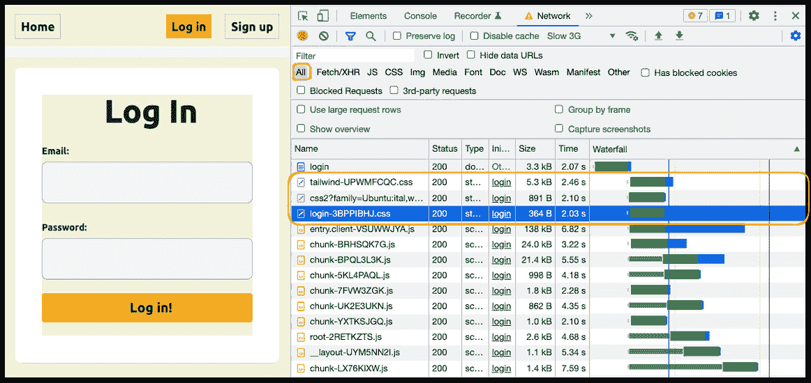
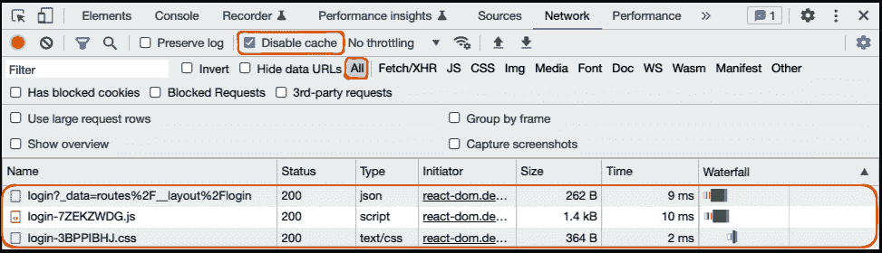

# 9

# 资产和元数据管理

到目前为止，我们已经练习了在 Remix 中处理路由、数据加载和变更、错误处理以及状态和会话管理。然而，构建 Web 应用还涉及到管理静态资产，以确保用户体验的流畅和高效。

在本章中，我们将学习如何在 Remix 中管理静态资产和元标签。本章分为三个部分：

+   在 Remix 中使用元标签

+   处理字体、图像、样式表和其他资产

+   使用加载函数暴露资产

首先，我们将使用 Remix 的`meta`导出功能，根据加载数据创建动态元标签。接下来，我们将研究如何在 Remix 中暴露静态资产。我们将创建一个`robots.txt`文件，添加自定义字体，并尝试嵌套样式表。之后，我们将讨论在 Remix 中管理图像。最后，我们将看到如何在`loader`函数中动态创建资产。

阅读本章后，您将了解如何在 Remix 中处理元标签。您还将知道如何暴露和访问静态资产以及如何链接外部资源。最后，您将了解如何通过`loader`函数暴露动态资产。

# 技术要求

您可以在此处找到本章的代码：[`github.com/PacktPublishing/Full-Stack-Web-Development-with-Remix/tree/main/09-assets-and-meta-data-handling`](https://github.com/PacktPublishing/Full-Stack-Web-Development-with-Remix/tree/main/09-assets-and-meta-data-handling)。您可以继续使用上一章的最终解决方案。本章不需要额外的设置步骤。

# 在 Remix 中使用元标签

元标签用于描述 HTML 文档的内容。它们对于**搜索引擎优化**（**SEO**）非常重要，并且被网络爬虫用来理解您网站的内容。元标签还用于配置浏览器行为、链接预览以及网站在书签列表和搜索结果中的外观。

例如，标题、描述和图像元标签用于链接预览和搜索页面，如 Google 的搜索结果。标题元标签还与 favicon 一起使用，以在书签列表中显示网站。

在本节中，您将学习如何向您的 Remix 应用程序添加元标签。

## 声明全局元标签

一个应用程序通常会在每个页面上包含一些全局元标签。由于 Remix 允许我们在 React 中管理完整的 HTML 文档，包括头部，我们可以在应用程序的根目录中内联全局元标签：

```js
<head>  <meta charSet="utf-8" />
  <meta name="viewport" content="width=device-width, initial-scale=1" />
  <Meta />
  <Links />
</head>
```

查看位于`root.tsx`中的`Document`组件。注意，我们导出了两个全局元标签来设置应用程序的`charSet`属性和`viewport`元标签。和往常一样，您可以在 MDN Web Docs 中找到有关浏览器 API 和 Web 平台的信息：

+   `viewport`元标签：[`developer.mozilla.org/en-US/docs/Web/HTML/Viewport_meta_tag`](https://developer.mozilla.org/en-US/docs/Web/HTML/Viewport_meta_tag)

+   `charSet`属性：[`developer.mozilla.org/en-US/docs/Web/HTML/Element/meta#attributes`](https://developer.mozilla.org/en-US/docs/Web/HTML/Element/meta#attributes)

内容感知元标签，如`title`和`description`，必须为每个页面动态设置。在 Remix 中，我们可以使用`meta`导出将元标签注入到我们应用程序的头部。让我们看看它是如何工作的。

## 导出元函数

Remix 中的每个路由模块都可以导出一个`meta`函数。Remix 遵循路由层次结构以找到最近的`meta`导出，并将其注入到 HTML 文档的头部。让我们跳入我们的 BeeRich 应用程序的代码，并调查如何使用`meta`导出定义元标签：

1.  打开`app/root.tsx`文件并查找`meta`导出：

    ```js
    export const meta: MetaFunction = () => {  meta function returns a list of metadata objects. Currently, we only return a title metadata object. 
    ```

1.  使用`npm` `run dev`命令在本地运行 BeeRich。

1.  通过导航到[`localhost:3000/`](http://localhost:3000/)在浏览器窗口中打开应用程序。

1.  使用您浏览器的开发者工具检查 HTML。头部元素的内容应如下所示：

    ```js
    <head>  <meta charset="utf-8">  <meta name="viewport" content="width=device-width, initial-scale=1">  title element made it into the head of the HTML document.
    ```

1.  在`root.tsx`中的`meta`函数返回值中添加一个描述元数据对象：

    ```js
    export const meta: MetaFunction = () => {  return [    { title: 'BeeRich' },    {      meta export into the head of our app? The answer can be found in the root.tsx file.
    ```

1.  检查`root.tsx`中的`Document`组件的 JSX：

    ```js
    <head>  <meta charSet="utf-8" />  <meta name="viewport" content="width=device-width, initial-scale=1" />  Meta component. Remix uses the Meta component to add the meta exports to our application. The Meta component receives the content of the closest meta export and injects its content into our React application.By default, the `Meta` component is rendered in the head of our Remix application. If we were to remove the `Meta` component, the `meta` exports would not end up in our document anymore.
    ```

接下来，让我们调查 Remix 如何管理嵌套的`meta`导出。

## 嵌套`meta`导出

在本节中，我们将向嵌套路由模块添加一些`meta`导出：

1.  打开`_layout.login.tsx`路由模块并添加以下代码：

    ```js
    import type { ActionFunctionArgs, LoaderFunctionArgs, npm run dev in your terminal.
    ```

1.  通过导航到[`localhost:3000/login`](http://localhost:3000/login)打开登录页面并检查头部元素的内容。

    注意，在`root.tsx`中定义的标题和描述被嵌套的`meta`导出覆盖。

在嵌套路由模块中使用`meta`导出来覆盖父级元标签

`meta`路由模块导出允许我们在路由层次结构的任何级别定义元标签。Remix 使用最近的`meta`函数返回值，并通过使用`Meta`组件将它们添加到文档的头部。嵌套`meta`导出替换父级`meta`导出。

Remix 最初在服务器上渲染。渲染的文档包括所有声明的元标签，并确保爬虫可以在不执行客户端 JavaScript 的情况下检查所有元标签。这对 SEO 非常有利。

通常，元标签的内容取决于动态数据。例如，您可能希望使用文章的标题和摘要作为标题和描述元标签。让我们看看我们如何在`meta`函数中访问加载器数据。

## 在元函数中使用加载器数据

`meta`函数在客户端和服务器上都会运行。在初始渲染时，`meta`函数在服务器端渲染期间被调用。对于所有后续的客户端导航，在从服务器获取加载器数据之后，`meta`函数在客户端执行。在这两种情况下，Remix 都将路由的加载器数据和所有父级加载器数据的哈希映射传递给`meta`函数。

在本节中，我们将向 BeeRich 仪表板的标题中添加当前用户的姓名，并探讨我们如何在 `meta` 函数中利用加载器数据：

1.  在您的编辑器中打开 `dashboard.tsx` 路由模块。

1.  更新 `dashboard.tsx` 中的 `loader` 函数以返回当前用户的姓名。

    ```js
    import { requireUserId helper function was used to get userId from the session cookie and authenticate the user.Now, we replace the usage of `requireUserId` with `getUser` and `logout`. We use the `getUser` helper functions to query for the user object. We then check whether the user object exists; otherwise, we call `logout` to clear the session. Finally, we return the user name as part of the loader data.
    ```

1.  接下来，将以下 `meta` 函数导出添加到路由模块中：

    ```js
    import type { LoaderFunctionArgs, data property. Then, we read the username property to dynamically create a title tag.We also set the `robots` meta tag to `noindex` as the dashboard is hidden behind a login page. Web crawlers should not attempt to index our dashboard pages. All nested routes will inherit the `noindex` value if they don’t export a `meta` function themselves.
    ```

太好了！就这样，我们可以使用动态数据来创建元标签。然而，一个问题仍然存在：为什么我们在访问 `username` 之前使用 `?` 操作符来检查（加载器）`data` 属性是否已定义？

注意，如果发生错误，`meta` 函数也会执行。这确保了即使在错误边界被渲染时，我们的元标签也会被添加。如果我们渲染错误边界，那么加载器数据将不可用。最终，在 `meta` 中，我们必须始终在访问其属性之前检查 `data` 属性是否已定义。

元函数在客户端、服务器和错误上运行

即使路由的 `loader` 函数抛出错误，`meta` 函数也会运行。因此，在访问它之前检查预期的加载器数据是否存在非常重要。此外，我们必须确保我们的 `meta` 函数可以在客户端和服务器上安全执行，因为它们在两个环境中都会运行。任何服务器端逻辑都必须在 `loader` 函数（在服务器上）中执行，并且任何所需的数据都应该通过加载器数据转发到 `meta` 函数。

网络爬虫使用元标签来理解您页面的内容。Remix 对嵌套路由模块中元标签管理的声明式方法确保了元标签和相关加载器数据的同位放置。然而，有时我们可以避免重新获取数据，如果该数据已经在另一个活动的 `loader` 中被获取。让我们看看那是什么样子。

## 在元函数中使用匹配数据

在 Remix 中，`meta` 函数会在所有加载器运行之后执行。这意味着我们可以访问所有当前活动的加载器数据。在本节中，我们将了解 Remix 的 `matches` 数组以及如何在 `meta` 中访问其他路由的加载器数据。

记住，我们已经在 `root.tsx` 的 `loader` 函数中获取了用户数据：

```js
export async function loader({ request }: LoaderFunctionArgs) {  const user = await getUser(request);
  return { user };
}
```

在 `dashboard.tsx` 中不需要重新获取用户对象。我们可以优化我们的代码，并从根加载器数据中访问用户对象。这样，我们就可以避免在 `dashboard.tsx` 路由模块的 `loader` 函数中再次查询数据库：

1.  首先，将 `root.tsx` 中的根 `loader` 函数作为类型导入导入：

    ```js
    import type { loader as rootLoader } from '~/root';
    ```

    我们将 `loader` 函数作为类型导入导入，因为我们只使用它进行类型推断。请注意，我们必须将 `loader` 导入重命名为 `rootLoader` 以避免与 `dashboard.tsx` 路由模块的 `loader` 函数发生命名冲突。

1.  接下来，更新 `dashboard.tsx` 中的元函数，如下所示：

    ```js
    export const meta: MetaFunction<typeof loader, root as the id parameter, of which the loader data is of the type returned by the rootLoader function.
    ```

    接下来，我们使用 `matches` 参数来找到与 `root` 的 `id` 参数匹配的路由，并检索其（加载器）数据。`matches` 数组包含当前匹配 URL 并在页面上处于活动状态的路线对象列表。

    Remix 为每个路由模块分配一个唯一的标识符。这些标识符基于路由模块的文件名，但最容易识别路由模块标识符的方法是在开发期间记录 `matches` 数组。

1.  现在我们正在使用另一个匹配路由的加载器数据，将 `dashboard.tsx` 路由模块的 `loader` 函数中的更改恢复。将 `getUser` 函数调用替换为 `requireUserId`。这样可以避免数据库查询并优化我们的代码。最后，从 `loader` 函数返回对象中移除我们添加的 `username` 参数。

在本节中，您学习了如何输入和使用 Remix 的 `matches` 数组，以及如何在 `meta` 函数中访问其他路由的加载器数据。接下来，让我们学习如何在 Remix 中处理静态资源。

# 处理字体、图像、样式表和其他资源

字体、图像和样式表是需要在构建网站时高效管理的静态资源示例。为了确保快速的用户体验，有必要优化、最小化和缓存这些资源。适当管理静态资源可以显著提高页面加载时间并提升整体用户体验。在本节中，您将学习如何在 Remix 中访问和管理静态资源。让我们首先回顾如何在 Remix 中访问一个简单的静态文件。

## 处理静态资源

我们可以在我们的网络服务器上托管静态资源，以便我们的客户端应用程序可以访问它们。正如我们之前所学的，Remix 不是一个网络服务器，而是一个 HTTP 请求处理器。因此，Remix 不提供内置的提供静态资产的方式。为公共资产设置访问权限是底层网络服务器的责任。

幸运的是，Remix 的入门模板遵循了提供 `public` 文件夹以通过网络公开静态资源的常见模式，并附带执行此操作所需的样板代码。例如，BeeRich – 通过使用 Express.js 适配器的 `create-remix` CLI 工具进行引导 – 包含一个引导的 `server.js` 文件，该文件设置 Express.js 以提供静态资源：

```js
app.use(express.static('public', { maxAge: '1h' }));
```

到目前为止，BeeRich 应用程序的 `public` 文件夹包含一个 `favicon.ico` 文件，它作为我们网站的 favicon。让我们也添加一个 `robots.txt` 文件：

1.  在 `/public` 文件夹中创建一个 `robots.txt` 文件，并添加以下内容：

    ```js
    User-agent: *Disallow: /dashboard/Allow: /loginAllow: /signupAllow: /$
    ```

    网络爬虫会从您的网站服务器请求 `/robots.txt` 文件，以找到关于在您的网站上爬取哪些内容的指令。

    我们指定网络爬虫可以爬取我们应用程序的登录、注册和索引页面。然而，由于仪表板位于登录页面之后，我们阻止爬虫尝试爬取我们的任何仪表板页面。

1.  现在，使用 `npm run dev` 运行 BeeRich。

1.  在您的浏览器中访问[`localhost:3000/robots.txt`](http://localhost:3000/robots.txt)。现在，您应该看到`robots.txt`文本文件的内容在您的浏览器中显示。

我们使用底层 Web 服务器来提供 Remix 应用程序的静态内容。同样，我们可以通过将字体、图片、样式表、第三方脚本和其他静态资产作为文件放置在`public`文件夹中来公开它们。

注意，一些资源，如图片，在您从浏览器访问它们之前应该进行优化。通常，图片和其他大型资源最好托管并优化在 CDN 和静态文件存储等专用服务中。

第三方资产，如第三方样式表和字体，也可以通过使用 HTML 链接标签来引用，这样我们就不必在`public`文件夹中自行管理它们。让我们学习如何在 Remix 中公开链接标签。

## 在 Remix 中管理链接

HTML `link`元素用于引用第三方资源，如样式表和字体。在 Remix 中，可以通过`links`路由模块导出声明链接。

Remix 提供了一个`Links`组件，可以将所有`links`返回值注入到 HTML 文档的头部。您可能已经在检查`root.tsx`中的`Document`组件时注意到了`Links`组件：

```js
<head>  <Meta />
  <Links />
</head>
```

到目前为止，我们在`root.tsx`路由模块中只有一个是 BeeRich 的`links`导出，用于链接到我们的全局 Tailwind CSS 样式表：

```js
import tailwindCSS from './styles/tailwind.css';export const links: LinksFunction = () => [{ rel: 'stylesheet', href: tailwindCSS }];
```

让我们添加一个来自 Google Fonts 的字体来练习使用`links`导出：

1.  访问[`fonts.google.com/specimen/Ubuntu`](https://fonts.google.com/specimen/Ubuntu)以检查`root.tsx`中的`links`函数：

    ```js
    export const links: LinksFunction = () =>   { rel: 'stylesheet', href: tailwindCSS },links function.
    ```

1.  接下来，更新项目根目录中的`tailwind.config.ts`文件，将**Ubuntu**设置为默认的无衬线字体：

    ```js
    npm run dev in your terminal.
    ```

1.  在浏览器窗口中打开 BeeRich。现在，新字体应该已经应用到页面上的所有文本。

1.  打开开发者工具以检查应用程序的网络活动。

1.  刷新页面以重置**网络**标签上显示的活动并查看显示的结果：

。对[fonts.googleapis](http://fonts.googleapis)的请求随后触发了所需字体资产的下载。

就这样，`links`导出让我们能够在嵌套路由层次结构内声明性地声明外部资源。

在 BeeRich 中，我们为我们的应用程序使用一个全局 Tailwind CSS 样式表。然而，Remix 的`links`导出在管理特定路由的样式表时也表现良好。让我们看看我们如何可以在 Remix 中使用`links`导出进行模块化样式表。

## Remix 中的样式

Remix 支持任何暴露样式表的样式解决方案。这包括流行的选择，如 PostCSS、Tailwind CSS 和 vanilla-extract。一旦我们有了样式表的路径，我们就可以使用`link`元素来引用它。

在 BeeRich 中，我们使用 Tailwind CSS。Tailwind 生成一个全局样式表，我们可以在应用的全球链接标签中引用它。Remix 还提供了内置支持来编译 Tailwind CSS 样式表。您可以在[`remix.run/docs/en/2/styling/tailwind`](https://remix.run/docs/en/2/styling/tailwind)了解更多关于 Remix 与 Tailwind CSS 集成的信息。

此外，Remix 还提供了对模块化 CSS 解决方案的支持。让我们回顾一下它是如何工作的。

### 路由范围样式表

让我们通过为我们的登录页面创建一个范围 CSS 样式表来实验嵌套`links`导出：

1.  在`app/styles`中创建一个名为`login.css`的样式表。

1.  将以下内容添加到文件中：

    ```js
    * {  background-color: beige;}
    ```

    我们使用这个全局 CSS 规则作为示例，展示一些我们只想应用于登录路由的定制样式。其他路由，如注册路由，不应受此 CSS 的影响。

1.  在`_layout.login.tsx`路由模块中导入样式表：

    ```js
    import loginCSS from '~/styles/login.css';
    ```

1.  创建一个新的`links`导出，并将样式表导入的内容添加到其中：

    ```js
    import type { ActionFunctionArgs, npm run dev.
    ```

1.  在浏览器窗口中访问登录路由，并打开开发者工具的**网络**标签来检查发生了什么（[`localhost:3000/login`](http://localhost:3000/login)）。

    确保您首先登出，然后再访问登录路由，否则您将被重定向到其他地方。



图 9.2 – 为登录路由加载嵌套样式表

注意嵌套样式表与我们的全局链接资源并行加载。Remix 将所有`links`函数的返回值合并在一起，并使用`Links`组件将内容注入 HTML 文档的头部。

我们的登录页面现在有了我们想要的令人质疑的外观。但如果我们导航到另一个 URL 会发生什么呢？

1.  点击右上角的**注册**按钮以触发客户端从登录路由的过渡。

    注意米色背景颜色消失了。

对于嵌套`links`导出，一旦我们离开相关的路由，Remix 就会卸载所有资源。这在处理嵌套样式表时特别有用。Remix 使得将样式表范围限定到特定的嵌套路由或路由子集变得容易。

由于 Remix 知道所有的`links`导出，它还可以在使用`Link`导出的`prefetch`属性时预取链接资源，我们将在下一节中对其进行回顾。

### 预取链接资源

让我们调查 Remix 如何预取链接资源：

1.  在您的编辑器中打开`_layout.tsx`路由模块。

1.  将`prefetch`属性添加到路由组件中渲染的所有`NavLink`组件，并将其值设置为`"intent"`：

    ```js
    <NavLink to="/" _layout.tsx route module component for readability.As discussed in *Chapter 6*, *Enhancing the User Experience*, we can add the `prefetch` property to Remix’s `Link` and `NavLink` components to prefetch the content of the new matching route modules. Setting `prefetch` to `intent` prefetches the content of all newly matching route modules on hover or focus.
    ```

1.  现在，请在您的浏览器窗口中访问注册页面 ([`localhost:3000/signup`](http://localhost:3000/signup))。

1.  打开 **网络** 选项卡并清除任何已记录的条目以获得更好的可见性。

1.  接下来，将鼠标悬停在或聚焦于导航栏中的 **登录** 锚点标签上，并检查 **网络** 选项卡：



图 9.3 – 预取链接资源

注意，Remix 会与加载器数据一起预取链接资源以及登录路由的 JavaScript 模块。根据请求瀑布图，我们可以看出 Remix 首先获取加载器数据和 JavaScript 模块，然后再预取链接资源。

Remix 必须首先获取新路由的加载器数据和 JavaScript 包，以便知道要获取哪些链接。一旦获取了这些信息，Remix 就会并行预取所有链接资源。

Remix 允许我们在嵌套路由模块中声明元标签和链接。当使用 `links` 导出时，Remix 通过 `prefetch` 属性使我们能够与加载器数据和路由的 JavaScript 模块一起预取链接资源。

在转换过程中，一旦卸载了相关路由，Remix 也会卸载所有外部资源。这确保了作用域样式表和其他资源不会影响其他路由。

接下来，让我们回顾一下在 Remix 中处理图像的一些技巧。

## 在 Remix 中处理图像

遵循最佳实践以向用户提供性能最优异的图像并非易事。我们需要使用 webp 等网络友好格式，但同时也需要为不支持它们的浏览器提供回退方案。除此之外，我们还需要为各种设备屏幕提供不同大小的图像。这就是为什么使用专门的服务来处理图像通常比在您自己的 Web 服务器上托管它们更好。

与其他一些框架不同，Remix 没有内置专门用于处理图像的工具或功能。您可以像其他任何静态文件一样将图像放在公共文件夹中。但由于图像需要优化，通常最好使用专门的服务来管理和交付它们。

虽然图像优化不是本书的重点，但它仍然是一个重要的考虑因素。为了帮助您在 Remix 中开始图像优化，我们建议查看开源的 `unpic-img` 项目。`unpic-img` 提供了一个可以与几个流行的 CDN 配置的最小 React 组件。要开始，请访问 GitHub 上的项目 [`github.com/ascorbic/unpic-img`](https://github.com/ascorbic/unpic-img)。

在本节中，您学习了如何在 Remix 中公开静态资产以及如何处理链接元素。您练习了使用 `links` 函数声明外部资源。我们还尝试了嵌套样式表，并讨论了图像优化的重要性。

Remix 还提供了一种通过资源路由中的`loader`函数提供资产的方法。在下一节中，我们将使用我们的`robots.txt`文件作为如何使用资源路由和`loader`函数来公开静态资产的示例。

# 使用加载器函数公开资产

在本章的早期部分，我们创建了一个`robots.txt`文件，并通过将其放入`public`文件夹来公开它。然而，我们也可以在资源路由中使用`loader`函数来公开资产。这在我们需要即时动态创建这些资产或管理用户访问时特别有用。要开始，请按照以下步骤操作：

1.  从公共文件夹中删除现有的`robots.txt`文件，否则它将覆盖我们的 API 路由。

1.  在路由文件夹中创建一个新的`robots[.txt].tsx`文件。

    方括号使我们能够避开路由名称的一部分。我们不是创建一个`.txt`文件，而是创建一个`.tsx`文件，但确保路由与`robots.txt`路径匹配。

1.  将以下内容添加到新创建的资源路由中：

    ```js
    const textContent = `User-agent: *Disallow: /dashboard/Allow: /loginAllow: /signupAllow: /$`;export function loader() {  return new Response(textContent, { headers: { 'Content-Type': 'text/plain' } });}
    ```

Remix 允许我们在`loader`函数中返回任何类型的 HTTP 响应。任何没有路由组件的路由都成为可以接收 HTTP GET 请求的资源路由。`robots[.txt].tsx`中的`loader`函数响应对`/robots.txt`的传入 GET 请求，并返回具有指定文本内容的文本文件。

资源路由和`Response` API 是强大的工具，允许我们即时生成 PDF、图像、文本内容或 JSON 数据。括号注释（例如，`[.txt]`）用于避开路由名称的一部分。

使用`loader`函数生成资产允许我们在传入的请求上运行动态计算。例如，我们可以验证用户会话或动态生成资产。我们的`robots.txt`文件目前是静态的，不需要额外的计算。在这种情况下，将文件存储在`public`文件夹中就足够了。

# 摘要

在本章中，您学习了如何在 Remix 中处理静态资产和元标签。

首先，我们向您介绍了`meta`路由模块导出。您了解到 Remix 通过使用`Meta`组件将`meta`函数的返回值注入 HTML 元素的头中。Remix 将始终使用路由层次结构中最接近的`meta`函数导出，并忽略所有其他更高层次的路由中的`meta`函数导出。

您还了解到 Remix 在客户端和服务器上都会运行`meta`函数。Remix 传递`meta`函数，一个可以用来访问路由加载器数据的`data`属性。在跟随本章之后，您应该理解如果`loader`函数抛出错误，`meta`函数的`data`属性可能未定义。因此，在`meta`函数中仅条件性地访问加载器数据是很重要的。

您还练习了输入`matches`参数，并学习了如何在`meta`函数中访问其他匹配的路由数据。

接下来，你学习了如何处理静态资源。现在你明白静态资源是由底层网络服务器提供的，而不是由 Remix 直接提供。Remix 的启动模板设置了一个 `public` 文件夹和必要的服务器代码。

你还了解到了 `links` 路由模块导出。现在你知道，当在 `Link` 和 `NavLink` 组件上使用预取属性时，Remix 会预取链接资源。你还练习了通过声明嵌套的 `links` 导出创建路由作用域的 CSS 样式表。

在阅读这一章后，你了解了图像优化的重要性以及你可以从哪里开始。你明白在提供之前必须对图像进行优化。你还知道可以使用 CDN 和其他服务来为我们处理图像优化。

最后，你了解到你可以使用资源路由来提供静态资源。我们使用了方括号符号来转义路由名称的部分（例如，`[.txt]`）。有了这个，我们创建了一个匹配 `/robots.txt` 路径的资源路由，并实现了一个返回文本文件响应的 `loader` 函数。

在下一章中，我们将向 BeeRich 添加文件上传功能，并使用资源路由来管理用户对用户文件的访问。这将结束本书的第二部分，并使我们能够启动第三部分的高级主题。

# 进一步阅读

你可以在 MDN Web Docs 中找到更多关于元标签的信息：[`developer.mozilla.org/en-US/docs/Web/HTML/Element/meta`](https://developer.mozilla.org/en-US/docs/Web/HTML/Element/meta)。

你可以在 Remix 文档中了解更多关于 Remix 的路由模块元导出的信息：[`remix.run/docs/en/2.0.0/route/meta`](https://remix.run/docs/en/2.0.0/route/meta)。

你可以在 Google 文档中了解更多关于 `robots.txt` 文件的信息：[`developers.google.com/search/docs/crawling-indexing/robots/intro`](https://developers.google.com/search/docs/crawling-indexing/robots/intro)。

如果你想要了解更多关于链接标签的信息，请查看 MDN Web Docs：[`developer.mozilla.org/en-US/docs/Web/HTML/Element/link`](https://developer.mozilla.org/en-US/docs/Web/HTML/Element/link)。

你可以在 Remix 文档中找到更多关于在 Remix 中处理样式的信息：[`remix.run/docs/en/2/styling/css`](https://remix.run/docs/en/2/styling/css)。

你可以在 Remix 文档中了解更多关于使用资源路由的信息：[`remix.run/docs/en/2/guides/resource-routes`](https://remix.run/docs/en/2/guides/resource-routes)。
