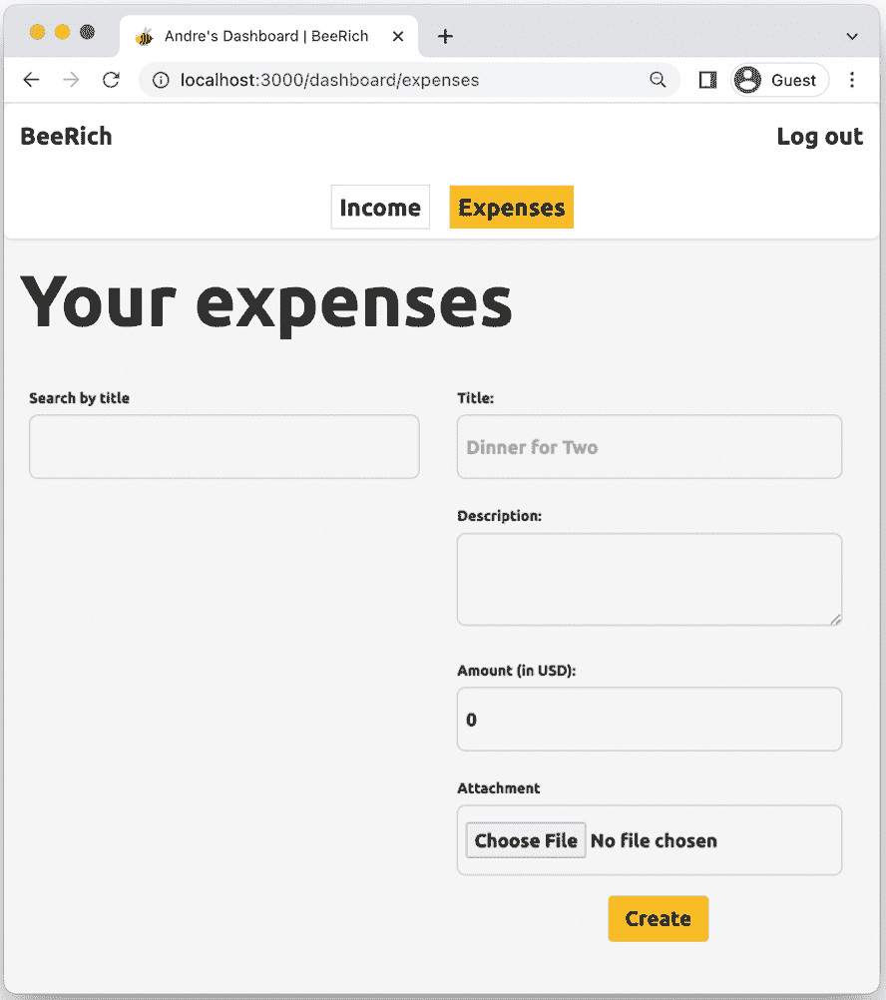
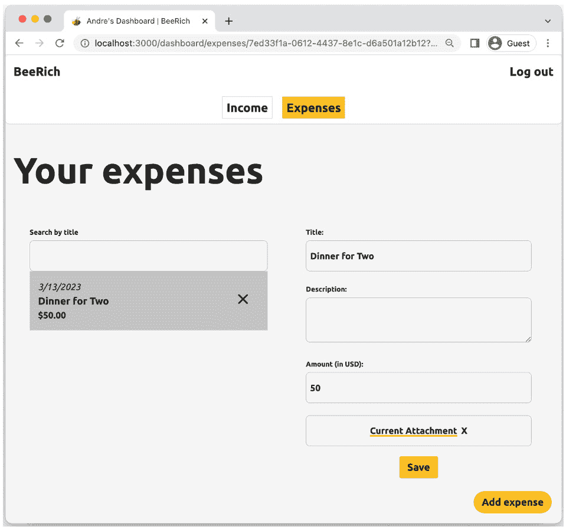

# 10

# 处理文件上传

在网络上上传文件是我们经常做的事情。网络提供了内置的文件上传支持。然而，将文件上传和处理作为表单提交的一部分仍然需要考虑一些额外的因素，我们将在本章中介绍。本章分为四个部分：

+   在 Remix 中使用多部分表单数据

+   在服务器上处理文件

+   使用资源路由授权访问资产

+   将文件转发到第三方服务

在本章中，我们将对 BeeRich 进行迭代以支持文件上传。首先，我们将更新创建和编辑表单以允许添加和删除附件。接下来，我们将重构`action`函数以在服务器上处理附加文件。进一步地，我们将研究如何授权访问上传的文件。最后，我们将了解文件大小考虑因素并讨论不同的文件存储解决方案。

阅读本章后，您将了解如何在 Remix 中处理多部分表单数据。您将知道如何使用 Remix 的文件上传助手以及如何使用资源路由授权访问上传的文件。您还将获得处理文件时需要考虑的理论知识以及如何将文件转发到第三方服务的理解。

# 技术要求

您可以在此处找到本章的代码：[`github.com/PacktPublishing/Full-Stack-Web-Development-with-Remix/blob/main/10-working-with-file-uploads/`](https://github.com/PacktPublishing/Full-Stack-Web-Development-with-Remix/blob/main/10-working-with-file-uploads/).

在开始本章之前，请按照 GitHub 上本章文件夹中`README.md`文件中的说明清理来自*第九章*、“资产和”*元数据处理*的实验。

# 在 Remix 中使用多部分表单数据

默认情况下，表单数据使用`application/x-www-form-urlencoded`编码类型。URL 编码的表单数据将表单数据作为键值对附加到请求 URL 作为查询参数。要向 HTML 表单附加文件，我们需要更改表单的编码类型。在传输如文件这样的二进制数据时，将表单数据附加到 URL 不是正确的方法。在本节中，您将学习如何使用多部分编码来支持文件上传。

HTML 表单元素有三种不同的编码类型：

+   `application/x-www-form-urlencoded`

+   `multipart/form-data`

+   `text/plain`

`text/plain`不是我们想要的。纯文本编码不用于客户端-服务器通信，因为它以人类可读的格式提交数据。相反，我们想要使用`multipart/form-data`编码，它将表单数据放入请求体中，使得包括和流式传输二进制文件成为可能。

让我们更新费用创建和编辑表单，允许用户附加文件。首先，让我们对费用创建表单进行更改：

1.  在编辑器中打开`dashboard.expenses._index.tsx`路由模块。

    路由组件当前渲染一个带有费用标题、描述和金额输入字段的表单。

1.  将表单编码类型更新为 `multipart/form-data` 并添加一个文件输入字段：

    ```js
    <Form method="POST" action="/dashboard/expenses/?index" encType property sets the encoding type for the HTML form element. The default value, application/x-www-form-urlencoded, is what we’ve used thus far in BeeRich. For file uploads, we must update encyType to multipart/form-data.Note that the input element’s `multiple` property can be used to attach several files to one input field. By default, the input element’s `multiple` property is set to `false`. This means the input field lets the user attach only one file.
    ```

1.  现在，运行本地应用 (`npm run dev`) 并检查更新的用户界面。

    如 *图 10**.1 所示，费用创建表单现在包含一个附件输入字段。

1.  填写并提交费用创建表单。

    注意，表单提交仍然有效。`request.formData` 函数可以解析 URL 编码和多部分表单数据。`request.formData` 的一个缺点是它会将所有表单数据加载到服务器内存中。我们将在本章后面看到我们有哪些替代方案：



图 10.1 – 带有附件输入字段的表单截图

太好了！就这样，我们向费用创建表单添加了一个附件。像往常一样，将相同的更改应用到发票创建表单。

费用创建表单现在可以包含一个可选的文件附件。在下一节中，我们将在服务器上读取上传的文件并将其持久化到文件系统中。然而，我们还需要将保存的附件与费用关联起来。让我们更新数据库模式以支持向费用和发票添加附件：

1.  首先，在你的编辑器中打开 `prisma/schema.prisma` 文件。

1.  将以下行添加到 `Expense` 和 `Invoice` 数据库模型：

    ```js
    attachment field is marked as optional since we added a question mark symbol after the data type.
    ```

1.  保存更改，并在项目的根目录下终端中运行 `npx prisma format` 以格式化 `schema.prisma` 文件。

1.  接下来，执行 `npm run build` 以更新 Prisma 客户端和类型。

    在底层，Prisma 根据的 `schema.prisma` 文件生成类型。在运行 `npm run build` 之后，费用和发票类型包括可选的 `attachment` 属性。

1.  最后，运行 `npm run update:db` 以将你的本地 SQLite 数据库模式与更新的 Prisma 模式同步。

一旦创建了一个费用，我们希望让用户查看和删除他们当前的附件。如果没有设置附件，我们还希望用户能够上传一个新的附件。接下来，让我们更新费用编辑表单以添加此功能：

1.  在你的编辑器中打开 `dashboard.expenses.$id.tsx` 路由模块。

1.  更新路由组件的表单编码类型，以便它支持文件上传：

    ```js
    <Form method="POST" action={`/dashboard/expenses/${expense.id}`} key={expense.id} loader function’s return value.We need to access the `expense.attachment` property on the client. Note that we already return the full expense object. This automatically includes the new `expense.attachment` property. We can go ahead and read the property in the route’s component without changing the `loader` function.
    ```

1.  在你的编辑器中打开 `app/components/forms.tsx` 文件并检查 `Attachment` 组件的实现。

    `Attachment` 组件期望一个 `label` 属性和一个 `attachmentUrl` 属性，并渲染一个链接到附件的锚标签。它还包括一个提交按钮和一个名为 `attachmentUrl` 的隐藏输入字段。

    让我们在编辑表单中使用 `Attachment` 组件，让用户查看和删除他们的费用和发票附件。

1.  在 `dashboard.expenses.$id.tsx` 中导入可重用的 `Attachment` 组件：

    ```js
    import { dashboard.expenses.$id.tsx, right before the submit button:

    ```

    {expense.attachment ? (  <Attachment    label="Current Attachment"  attachmentUrl={`/dashboard/expenses/${expense.id}/attachments/${expense.attachment}`}  />) : (  <Input label="New Attachment" type="file" name="attachment" />)}

    ```js

    If the expense object has an attachment, then we render the `Attachment` component, which displays a link to the attachment and a submit button to remove the attachment. Otherwise, we display the same input field as in the expense creation form so that users can add a new attachment.Notice that the `attachmentUrl` property value points to a new path: `dashboard/expenses/$id/attachments/$`.
    ```

1.  在本地运行应用程序并检查费用编辑表单上的新文件输入字段。

我们需要添加一个新的路由模块来处理对文件附件的访问。新的路由模块将是一个嵌套在`dashboard/expenses/$id`路径中的资源路由。让我们为新的路由模块创建必要的路由结构：

1.  将`dashboard.expenses.$id.tsx`文件重命名为`dashboard.expenses.$id._index.tsx`。

    路由模块仍然匹配之前的相同路径。作为一个索引路由，它现在作为`$id`路径段的默认子路由。

1.  更新所有提交到`dashboard.expenses.$id._index.tsx`的所有表单的`action`属性。

    我们将`dashboard.expenses.$id.tsx`中的`action`函数移动到了`dashboard.expenses.$id._index.tsx`。这改变了`action`函数的路径。

    1.  打开`dashboard.expenses.tsx`父级路由模块并更新`ListLinkItem`组件的`deleteProps`属性：

    ```js
    deleteProps={{  ariaLabel: `Delete expense ${expense.title}`,  action: `/dashboard/expenses/${expense.id}action function.
    ```

1.  接下来，创建一个新的通配符路由模块，命名为`dashboard.expenses.$id.attachments.$.tsx`。

    通配符是通配符路由参数，它匹配从其位置开始的 URL 路径的其余部分。无论跟随`/dashboard/expenses/$id/attachments/`的子路径是什么，通配符参数都会匹配并将子路径存储在`params['*']`中。

    例如，如果用户访问`/dashboard/expenses/$id/attachments/bees/cool-bees.png` URL 路径，那么`params['*']`通配符参数包含`bees/cool-bees.png`字符串。

1.  将以下代码添加到`dashboard.expenses.$id.attachments.$.tsx`通配符路由模块中：

    ```js
    import type { LoaderFunctionArgs } from '@remix-run/node';export async function loader({ request, params }: LoaderFunctionArgs) {  const { id } = params;  npm run dev) and open the application in a new browser window.
    ```

1.  在 BeeRich 上签名或登录并创建一个新的费用。

1.  通过点击仪表板上的费用概览列表中的费用来导航到费用详情页面。

1.  将`/attachments/bees/cool-bees.png`路径追加到浏览器窗口中的 URL。

    你应该看到`loader`函数，而不仅仅是我们的路由组件的数据。

1.  检查终端并审查`console.log({ id, slug })`的输出。更改浏览器窗口中的 URL 以查看输出如何变化。

太好了！我们已经为我们的文件上传功能创建了所需的路由模块结构。一如既往，确保更新收入路由文件以练习你在本节中学到的内容。在本地运行应用程序以调试你的实现。

在本节中，你学习了如何在 HTML 表单元素上设置编码类型并添加文件输入字段。你还进一步练习了使用通配符路由模块和资源路由。接下来，我们将利用 Remix 的服务器端文件上传辅助函数将传入的文件写入文件系统。

# 服务器端的文件处理

在服务器上处理文件上传时，有几个重要的考虑因素，最重要的是文件大小。在本节中，我们将学习如何在 Remix 的 `action` 函数中处理文件。我们将从一个简单的实现开始，然后重构代码并考虑更多的问题。

## 将文件加载到内存中

让我们从实现一些用于处理文件的实用程序开始：

1.  创建一个新的 `app/modules/attachments.server.ts` 文件。

1.  将以下代码添加到 `attachments.server.ts`：

    ```js
    import fs from 'fs';import path from 'path';export async function writeFile(file: File) {  const localPath = path.join(process.cwd(), 'public', file.name);  const arrayBufferView = new Uint8Array(await file.arrayBuffer());  fs.writeFileSync(localPath, arrayBufferView);}
    ```

    添加的 `writeFile` 函数接受一个文件并将其写入 `public` 文件夹。请注意，这并不是我们的最终解决方案，而是一个中间步骤。

    我们访问文件系统的方式取决于底层服务器运行时。BeeRich 在 Node.js 运行时上运行。因此，在 BeeRich 中，我们使用 Node.js 库来写入文件系统。

1.  打开 `dashboard.expenses._index.tsx` 路由模块。

1.  更新路由模块的 `action` 函数，如下所示：

    ```js
    attachment form data entry, check whether it is a file, and then pass it to the writeFile function. Currently, writeFile writes the uploaded file to the public folder for easy public access.
    ```

1.  在本地运行 BeeRich 以测试当前实现。

1.  填写费用创建表单，附加文件，并在您的编辑器中点击 `public` 文件夹。就这样，我们可以将文件上传到服务器并将其写入文件系统。

1.  您现在可以通过导航到 [`localhost:3000/$file-name`](http://localhost:3000/$file-name) 来访问文件。请注意，您还必须在路径中添加文件扩展名。

理论上，我们现在可以在服务器上读取文件名并将其保存到数据库中的费用对象中。由于 `public` 文件夹中的所有文件都已经可以通过网络访问，我们可以让用户通过链接到 `/$filename` 来访问他们的文件。

很遗憾，当前简单实现存在一些限制：

+   文件名冲突

+   文件大小限制

+   隐私问题

根据当前实现，我们没有管理文件名以避免冲突。如果两个用户上传了同名文件怎么办？我们也没有处理文件大小限制。大文件可以轻易地消耗服务器上的运行时内存。因此，限制用户可以上传的文件大小或更好地实现文件上传处理程序，使其作为数据流处理传入的文件，而不是一次性将整个文件加载到内存中，这一点非常重要。

此外，通过将文件存储在 `public` 文件夹中，我们使文件对公众可访问。任何人都可以尝试猜测文件名，直到他们幸运地能够访问另一个用户的文件——这是一个巨大的安全问题，尤其是当我们谈论像发票和费用这样的敏感数据时。

幸运的是，我们可以通过利用 Remix 的原语和约定来解决所有这些问题。让我们首先使用 Remix 的上传处理辅助函数来解决前两个问题。

## 使用 Remix 的上传处理辅助函数

Remix 提供了一套用于管理文件上传的辅助函数。我们将使用以下函数来改进当前的简单实现：

+   `unstable_composeUploadHandlers`

+   `unstable_createFileUploadHandler`

+   `unstable_createMemoryUploadHandler`

+   `unstable_parseMultipartFormData`

注意，当前函数包含 `unstable_` 前缀。这意味着它们的实现可能在未来的版本中发生变化。

让我们开始吧：

1.  首先，在项目的根目录下创建一个名为 `attachments` 的新文件夹。这是我们将在服务器上存储所有附加文件的地方。

1.  接下来，在您的编辑器中打开 `app/modules/attachments.server.ts` 文件。

1.  移除 `writeFile` 函数。

1.  相反，使用 `unstable_createFileUploadHandler` 函数创建一个新的文件上传处理程序：

    ```js
    import type { UploadHandler } from '@remix-run/node';import {  unstable_composeUploadHandlers,  unstable_createFileUploadHandler,  unstable_createMemoryUploadHandler,} from '@remix-run/node';const standardFileUploadHandler = unstable_createFileUploadHandler({  directory: './attachments',  avoidFileConflicts: true,});
    ```

    `unstable_createFileUploadHandler` 函数接受一个配置对象来指定上传文件的存储位置。它还允许我们设置 `avoidFileConflicts` 标志以创建唯一的文件名。

    `standardFileUploadHandler` 函数负责将上传的文件写入文件系统。有关可用的配置选项的更多信息，请参阅 Remix 文档：[`remix.run/docs/en/2.0.0/utils/unstable-create-file-upload-handler`](https://remix.run/docs/en/2.0.0/utils/unstable-create-file-upload-handler)。

1.  接下来，创建一个自定义文件上传处理程序函数：

    ```js
    const attachmentsUploadHandler: UploadHandler = async (args) => {  if (args.name !== 'attachment' || !args.filename) return null;  standardFileUploadHandler to add a bit of helper logic. First, we ensure that we only process file attachments with the attachment input name. Then, we make sure to return the filename or null if no file was attached.Notice that `attachmentsUploadHandler` implements Remix’s `UploadHandler` type. This allows us to compose it together with Remix’s file helper functions.
    ```

1.  使用 Remix 的 `unstable_composeUploadHandlers` 函数组合我们的 `attachmentsUploadHandler` 辅助函数和 Remix 的 `unstable_createMemoryUploadHandler`：

    ```js
    export const uploadHandler = unstable_composeUploadHandlers(  attachmentsUploadHandler,  unstable_createMemoryUploadHandler(),);
    ```

    有了这个，我们创建了一个高级的 `uploadHandler` 辅助函数，由两个上传处理程序组成。

    `uploadHandler` 为每个表单数据条目调用两个处理程序。首先，我们尝试使用 `attachmentsUploadHandler` 处理表单数据条目。如果 `attachmentsUploadHandler` 返回 `null`，那么我们也尝试使用 `unstable_createMemoryUploadHandler` 处理表单数据条目。

    如其名所示，Remix 的 `unstable_createMemoryUploadHandler` 将处理所有其他表单数据字段并将它们上传到服务器内存，这样我们就可以像往常一样使用 `FormData` 接口来访问它。

干得好！让我们更新我们的 `action` 函数，以便它们利用新的上传处理程序：

1.  打开 `dashboard.expenses._index.tsx` 路由模块。

1.  在路由模块的 `action` 函数中移除 `writeFile` 的导入和天真实现：

    ```js
    const file = formData.get('attachment');if (file && file instanceof File) {  writeFile(file);}
    ```

1.  从 Remix 导入 `unstable_parseMultipartFormData`：

    ```js
    import { redirect, uploadHandler from app/modules/attachments.server.tsx:

    ```

    `import { parseMultipartFormData } to replace request.formData()`：

    ```js
    const formData = await unstable_parseMultipartFormData(request, uploadHandler);
    ```

    在这里，我们让 `unstable_parseMultipartFormData` 使用我们的自定义 `uploadHandler` 处理多部分表单数据。`unstable_parseMultipartFormData` 为每个表单数据条目调用我们的高阶上传处理程序。组合上传处理程序遍历我们的上传处理程序，直到其中一个返回既不是 `null` 也不是 `undefined`。附件表单数据条目由文件上传处理程序处理，返回上传文件的文件名，如果没有提交文件则返回 `null`。`unstable_createMemoryUploadHandler` 为我们处理所有其他表单数据。

    ```js

    ```

1.  接下来，添加读取附件表单数据并更新数据库查询的代码：

    ```js
    export async function action({ request }: ActionFunctionArgs) {  const userId = await requireUserId(request);  attachments folder.Note that the file upload will fail if the file size exceeds 30 MB. This is Remix’s default maximum file size. The file size can be increased by updating the configuration options that are passed to `unstable_createFileUploadHandler`.
    ```

恭喜！您成功地将文件上传添加到支出创建表单中。确保在进入下一节之前将相同的更改应用到收入路由上。重用`attachments.server.ts`中的辅助函数来更新发票创建`action`函数。

防止服务器内存溢出

在处理文件上传时，我们必须注意内存限制。大文件大小很容易使我们的服务器不堪重负。这就是为什么处理传入的文件时，将其分块处理而不是完全加载到内存中很重要的原因。Remix 的文件上传辅助函数帮助我们避免文件名冲突，并允许我们流式传输文件数据以避免服务器内存溢出。

接下来，我们将更新支出编辑表单，使其也能处理文件上传：

1.  在您的编辑器中打开`dashboard.expenses.$id._index.tsx`文件。

1.  再次，导入`unstable_parseMultipartFormData`和`uploadHandler`：

    ```js
    import { json, redirect, action function with the following code:

    ```

    export async function action({ params, request }: ActionFunctionArgs) {  const userId = await requireUserId(request);  const { id } = params;  if (!id) throw Error('id 路由参数必须被定义');action 函数区分删除和更新表单提交。删除表单提交来自 ListLinkItem 组件，而更新提交来自 dashboard.expenses.$id._index.tsx 路由模块中的支出编辑表单。在本章早期，我们更新了支出编辑表单的编码为多部分编码，但没有对支出删除表单做同样的处理。因此，`action`函数必须能够支持多部分和 URL 编码的表单数据。为此，我们使用`content-type`头区分使用了哪种表单编码，并且只为`multipart/form-data`使用`parseMultipartFormData`。

    ```js

    ```

1.  接下来，更新`updateExpense`函数，使其读取`attachment`表单数据条目并将值添加到数据库更新查询中：

    ```js
    updateExpense function is called when the edit expense form is submitted. Here, we want to ensure that newly uploaded attachments are added to the expense update query.Note that we already persisted the file to the filesystem when calling `unstable_parseMultipartFormData(request, uploadHandler)`. The `updateExpense` function ensures that the expense entry in the database is updated accordingly.We must also make sure we clean up the filesystem whenever an attachment is removed or the associated expense is deleted.
    ```

1.  将以下函数添加到`attachments.server.ts`文件中：

    ```js
    import fs from 'fs';import path from 'path';export function deleteAttachment(fileName: string) {  const localPath = path.join(process.cwd(), 'attachments', fileName);  try {    fs.unlinkSync(localPath);  } catch (error) {    console.error(error);  }}
    ```

    `deleteAttachment`接收一个`fileName`并从`attachments`文件夹中删除相关文件。

1.  在`dashboard.expenses.$id._index.tsx`中导入`deleteAttachment`：

    ```js
    import { removeAttachment function, which we will call in the route module’s action function:

    ```

    async function removeAttachment(formData: FormData, id: string, userId: string): Promise<Response> {  const attachmentUrl = removeAttachment 是当提交按钮带有 remove-attachment 值时在路由模块的 action 函数中被调用的，该值在附件组件中实现。

    ```js

    ```

1.  更新路由模块的`action`函数，使其处理`remove-attachment`表单的动作意图：

    ```js
    const intent = formData.get('intent');if (intent === 'delete') {  return deleteExpense(request, id, userId);}if (intent === 'update') {  return updateExpense(formData, id, userId);}remove-attachment value originates from, investigate the Attachment component in app/components/forms.tsx. The Attachment component contains a hidden input field for attachmentUrl and a submit button with a value of remove-attachment. The component is nested in the dashboard.expenses.$id._index.tsx route module’s form and submits to the same action function.
    ```

1.  最后，在相同文件中更新`deleteExpense`函数，以便在删除支出时删除附件：

    ```js
    npm run dev and open a browser window to test the implementation.
    ```

1.  创建一个带有附件的支出。检查您的编辑器中的`attachments`文件夹。

1.  通过点击`attachments`文件夹来删除附件，查看文件是否成功删除。

1.  接下来，使用编辑表单向同一支出添加新的附件，并再次调查`attachments`文件夹。

1.  最后，通过在费用概览列表中点击**X**按钮来删除费用，并检查文件是否已删除：



图 10.2 – 更新后的费用编辑表单的截图

如*图 10**.2*所示，如果未设置附件，费用编辑表单现在应正确地在当前附件和附件输入字段之间切换。删除费用还应从`attachments`文件夹中删除相关的附件文件。

在继续之前，更新`income`路由以练习本节中学到的内容。一旦`income`路由被更新，你就可以进入下一节。

在本节中，你学习了如何使用 Remix 的文件上传辅助函数。你现在理解了在管理文件上传时需要考虑的因素，以及如何使用 Remix 的实用工具来避免内存和文件命名冲突。接下来，我们将实现 splat 路由，以让 BeeRich 用户安全地访问他们的附件。

## 使用资源路由授权对资产的访问

在*第九章*，“资产和元数据处理”中，你练习了通过资源路由公开资产。现在我们将在此基础上动态创建一个用于请求的费用附件的文件下载。我们将实现负责公开附件的 splat 路由，并确保只有授权用户才能访问他们的文件：

1.  首先，让我们向`attachments.server.ts`文件添加一个额外的辅助函数：

    ```js
    export function buildFileResponse(fileName: string): Response {  const localPath = path.join(process.cwd(), 'attachments', fileName);  try {    const file = fs.readFileSync(localPath);    return buildFileResponse function takes a fileName string and attempts to stream the associated file into a Response object. The content-disposition header ensures that the response is treated as a file download.Again, we avoid loading the full file into memory. Instead, we make sure to read the file into a buffer and manage it in chunks to avoid exceeding the server’s memory capabilities.
    ```

1.  接下来，打开`dashboard.expenses.$id.attachments.$.tsx` splat 路由模块，并用以下代码替换其内容：

    ```js
    import type { LoaderFunctionArgs } from '@remix-run/node';import { redirect } from '@remix-run/router';import { id parameter of the expense of the requested attachment.Notice that we query by a combination of expense `id` and user `id`. This ensures that a user can only access their own expenses.We then do some sanity checks before returning the response created by our new `buildFileResponse` helper function.
    ```

1.  是时候测试实现了。尝试下载当前附件。点击**当前附件**链接应启动文件下载。

干得好！你在 BeeRich 中实现了涵盖多个不同表单、路由和实用工具的全栈文件上传功能。

在继续之前，请确保你实现了收入 splat 路由。在收入路由上重复这项工作将帮助你练习所有新的概念。

限制对用户文件的访问

重要的是要记住，`public`文件夹中的文件可以通过互联网公开访问。我们必须确保通过授权代码保护私有用户数据。在 Remix 中，我们可以使用资源路由在授予用户文件访问权限之前动态检查访问权限。

在本节中，你学习了如何创建动态响应并通过资源路由公开资产。你现在理解了如何在资源路由中授权用户以限制访问。接下来，我们将讨论将文件转发到第三方服务。

# 将文件转发到第三方服务

到目前为止，我们已经在服务器的文件系统中托管用户文件。这对于 BeeRich 的教育范围来说是足够的。然而，当处理用户文件时，我们也应考虑在专用的文件存储服务上托管它们。本节简要概述了在处理用户文件时还需要考虑的其他事项。

直接在 Web 服务器上托管用户文件可能对于大多数用例来说可能不够。在本地托管文件可能难以扩展，需要你在系统中保护敏感用户文件和备份。此外，读取和写入磁盘可能会为 Web 服务器创建大量开销，这些开销可以通过将读取和写入委托给第三方服务来避免。

大多数流行的第三方存储服务提供 API 以流式传输文件。这使我们能够将文件上传作为数据流接收，以便我们可以将流转发到第三方服务。上传完成后，存储 API 通常提供一个指向已上传文件的 URL，我们可以在数据库中使用它来链接到新文件。

Remix 的上传处理程序原语允许你为不同的第三方服务创建自定义处理程序。我们不必写入本地文件系统，可以创建一个上传处理程序，将数据流式传输到云提供商。

流行的文件托管提供商包括 AWS S3、Cloudflare、Cloudinary、Firebase 和 Vercel。你可以在 *进一步* *阅读* 部分找到一个使用 Cloudinary 的示例实现。

# 摘要

在本章中，你学习了如何将文件添加到 HTML 表单中，以及如何在 Remix 中处理文件上传。

HTML 表单支持不同的编码类型。多部分表单编码将表单数据添加到响应体中。当附加二进制数据，如文件时，这是必需的。在服务器上，我们然后可以流式传输响应体，并分块处理上传的文件。

通过阅读本章，你现在理解 Remix 提供了一套文件上传实用工具来处理文件上传。Remix 实用工具帮助我们避免文件命名冲突，并允许我们配置文件大小限制和文件流。我们可以进一步组合几个文件上传处理程序，并通过实现 `UploadHandler` 类型来实现自定义包装器。

接下来，你学习了如何通过验证用户会话并确保授权的数据库查询来查询实体 `id` 和用户 `id` 的唯一组合，从而限制对资源路由的访问。我们不得将用户文件放在 `public` 文件夹中。相反，我们必须利用资源路由和自定义授权逻辑。

最后，我们讨论了第三方文件托管服务的使用。你现在理解使用第三方服务可能更具可扩展性，并允许我们将存储文件的许多复杂性卸载到第三方服务。

恭喜！就这样，你已经完成了这本书的第二部分。在下一章中，我们将开启本书的高级主题，并了解更多关于乐观用户界面的内容。继续前进，用 Remix 解锁 Web 平台的全部潜力。

# 进一步阅读

你可以通过 MDN Web 文档了解 HTML 表单元素的`enctype`属性：[`developer.mozilla.org/en-US/docs/Web/API/HTMLFormElement/enctype`](https://developer.mozilla.org/en-US/docs/Web/API/HTMLFormElement/enctype)。

你可以通过 MDN Web 文档了解 HTTP POST 请求的更多信息：[`developer.mozilla.org/en-US/docs/Web/HTTP/Methods/POST`](https://developer.mozilla.org/en-US/docs/Web/HTTP/Methods/POST)。

查看 Remix 示例仓库中的此示例实现，用于上传文件到 Cloudinary：[`github.com/remix-run/examples/tree/main/file-and-cloudinary-upload`](https://github.com/remix-run/examples/tree/main/file-and-cloudinary-upload)。

你可以通过阅读 Remix 文档了解更多关于 Remix 文件上传辅助工具的信息：

+   [`remix.run/docs/en/2.0.0/utils/parse-multipart-form-data`](https://remix.run/docs/en/2.0.0/utils/parse-multipart-form-data)

+   [`remix.run/docs/en/2.0.0/utils/unstable-create-file-upload-handler`](https://remix.run/docs/en/2.0.0/utils/unstable-create-file-upload-handler)

+   [`remix.run/docs/en/2.0.0/utils/unstable-create-memory-upload-handler`](https://remix.run/docs/en/2.0.0/utils/unstable-create-memory-upload-handler)

# 第三部分 - 使用 Remix 的全栈 Web 开发高级概念

在本最终部分，你将练习全栈 Web 开发的高级概念，如乐观用户界面、缓存策略、HTML 流和实时数据更新。你将再次迭代 BeeRich 以练习所学概念。你还将深入了解会话管理，并理解部署到边缘的含义。最后，你将了解迁移到 Remix 的策略，并学习如何保持 Remix 应用程序的更新。

本部分包含以下章节：

+   *第十一章*, *乐观用户界面*

+   *第十二章*, *缓存策略*

+   *第十三章*, *延迟加载器数据*

+   *第十四章*, *使用 Remix 进行实时操作*

+   *第十五章**,* *高级会话管理*

+   *第十六章*, *边缘开发*

+   *第十七章*, *迁移和升级策略*
