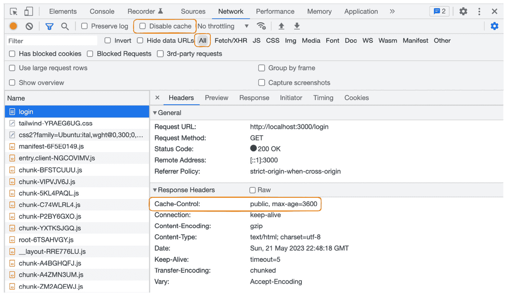
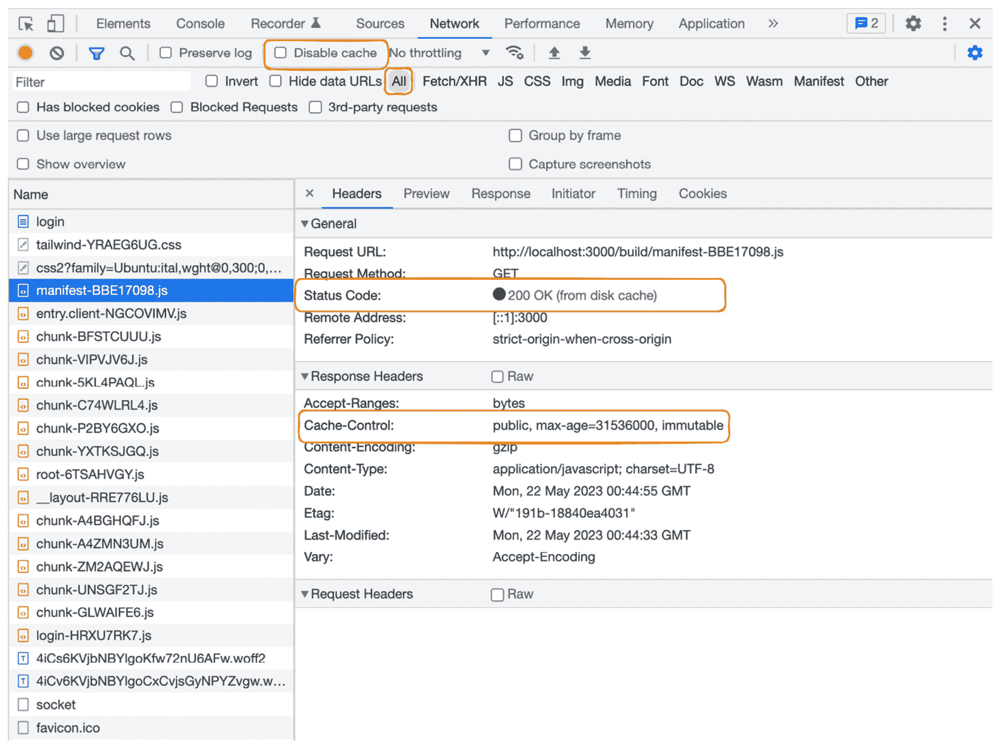
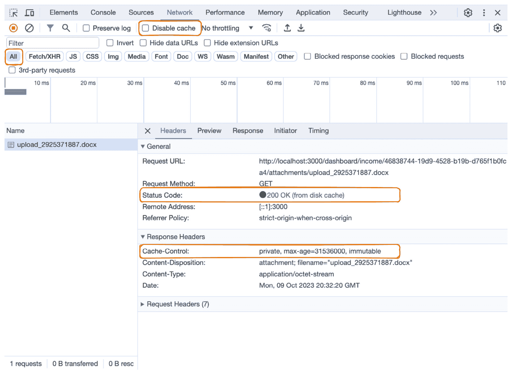
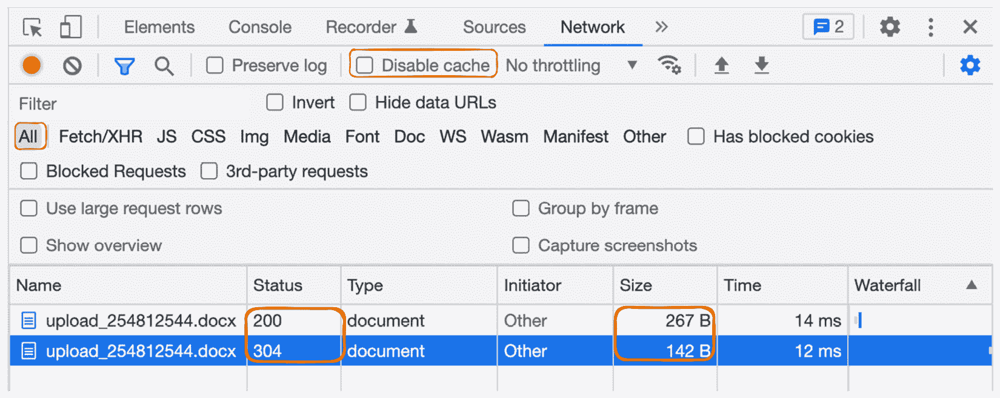

# 12

# 缓存策略

“*在计算机科学中，只有两件难事：缓存失效和命名事物。*” – Phil Karlton

缓存可以通过消除或缩短网络往返次数以及重用先前存储的数据和内容，显著提高网站的性能。然而，缓存也难以正确设置。通常，Remix 在 Web 平台之上提供了一个薄薄的抽象层，简化了 HTTP 缓存策略的使用。

在本章中，我们将了解不同的缓存策略以及如何利用 Remix 来使用它们。本章分为两个部分：

+   与 HTTP 缓存一起工作

+   探索内存缓存

首先，我们将了解 HTTP 缓存。我们将研究不同的 HTTP 缓存头部，并了解如何在浏览器和 CDN 中利用 HTTP 缓存。接下来，我们将关注内存缓存。我们将参考*第三章*，*部署目标、适配器和堆栈*，了解何时何地可以在内存中缓存数据。我们还将讨论使用 Redis 等服务来缓存数据。

阅读本章后，您将了解如何利用 Remix 进行缓存以改善用户体验。您还将练习使用 HTTP 头部，并了解何时使用不同的缓存策略，例如 CDN、浏览器、**实体标签**（**ETags**）和内存缓存。

# 技术要求

您可以在此处找到本章的代码：[`github.com/PacktPublishing/Full-Stack-Web-Development-with-Remix/tree/main/12-caching-strategies`](https://github.com/PacktPublishing/Full-Stack-Web-Development-with-Remix/tree/main/12-caching-strategies)。您可以继续使用上一章的最终解决方案。本章不需要额外的设置步骤。

# 与 HTTP 缓存一起工作

Web 平台使用 HTTP 头部来控制缓存行为。Web 客户端可以读取响应头部中指定的缓存指令，以重用先前获取的数据。这允许 Web 客户端避免不必要的网络请求并提高响应时间。在本节中，您将了解流行的 HTTP 缓存头部和策略，以及如何在 Remix 中使用它们。首先，我们将看到如何为文档响应定义 HTTP 头部。

## 在 Remix 中添加 HTTP 头部

Remix 的 route 模块 API 包括一个`headers`导出，我们可以用它来向路由的文档响应添加 HTTP 头部。像`links`函数一样，`headers`函数仅在服务器上执行。

`headers`函数在所有`loader`函数和所有父`headers`函数之后被调用。`headers`函数可以访问`parentsHeaders`、`errorHeaders`、`actionHeaders`和`loaderHeaders`对象，根据通过父`header`函数、loader 数据响应、action 数据响应和错误响应添加的头部来更新文档头部。Remix 利用可用的最深导出的`headers`函数，并允许您按需混合和合并头部。

基于加载器数据的缓存控制

Remix 的 `headers` 函数接收 `loaderHeaders` 参数，这允许我们根据加载器数据为每个路由指定缓存指令，以实现细粒度的缓存控制。

现在我们已经从理论上了解了如何使用 Remix 应用 HTTP 头部，让我们运行我们的 BeeRich 路由来调查如何利用缓存。

## 在共享缓存中缓存公共页面

没有特定于用户信息的公共页面可以存储在共享缓存中，如 CDN。在你的（Remix）网络服务器前添加 CDN 可以在全球范围内以及更接近用户的地方分发缓存内容。它减少了缓存内容的请求响应时间以及网络服务器需要处理的请求数量。

如果你不确定 CDN 是什么，MDN Web Docs 提供了一个很好的介绍：[`developer.mozilla.org/en-US/docs/Glossary/CDN`](https://developer.mozilla.org/en-US/docs/Glossary/CDN)。

在本节中，我们将使用 Remix 的 `headers` 路由模块 API 为 BeeRich 的公共页面添加 HTTP 缓存头部。

BeeRich 由公共和私有路由组成。公共页面嵌套在 `_layout` 段中，包括 BeeRich 主页 (`_layout._index.tsx`) 以及登录和注册页面。我们可以确定这些页面是静态的，并且不依赖于特定于用户的数据。如果用户偶尔看到过时的页面版本，我们是可以接受的。我们可以指定 HTTP 头部，以便在请求新版本之前，我们继续为页面提供缓存版本，时间为一个小时。

让我们看看这会是什么样子。将以下 `headers` 函数导出添加到 `_layout.tsx` 路径无布局路由模块中：

```js
import type { HeadersFunction } from '@remix-run/node';export const headers: HeadersFunction = () => {
  return {
    'Cache-Control': 'public, max-age=3600',
  };
};
```

通过这些更改，我们将缓存头应用于所有不自身导出 `headers` 函数的子路由。指定的缓存头包括 `public` 值和 `max-age` 指令。

`max-age` 指令定义了可用响应在必须重新生成之前可以重用的秒数。这意味着嵌套路由，如 `/`、`/login` 和 `/signup`，现在被缓存了 3,600 秒（1 小时）。

`public` 值表示响应数据可以存储在公共缓存中。我们可以区分公共（共享）和私有缓存。私有缓存存在于网络客户端（例如，浏览器）中，而共享缓存存在于代理服务和 CDN 上。通过指定文档可以公开缓存，我们也允许代理和 CDN 为所有未来的请求缓存文档。这意味着缓存不仅服务于一个浏览器（用户），还可能提高后续用户请求的响应时间。

让我们调查这种缓存行为：

1.  在项目的根目录中运行 `npm run dev`。

1.  接下来，在新的浏览器窗口中打开登录页面 ([`localhost:3000`](http://localhost:3000))。

1.  打开浏览器的开发者工具并导航到 **网络** 选项卡。

1.  如果已勾选，请确保取消勾选 **禁用缓存** 选项。

1.  现在，强制刷新页面以模拟初始页面加载：



图 12.1 – 登录页面初始加载

注意，指定的缓存头作为响应头的一部分返回。

1.  再次刷新页面；你可能看到文档是从磁盘缓存中恢复的。一些浏览器为了更好的开发者体验，禁用了 localhost 上的文档请求缓存头。所以，如果你在 localhost 上似乎无法使其工作，请不要担心。

谨慎不要公开缓存包含用户特定信息的文档。虽然 CDN 通常会自动删除`Set-Cookie`头，但当你希望服务器响应中包含用户会话 cookie 时，你很可能想完全避免缓存。如果你正在使用 CDN，请确保只为访客缓存，而不是已登录用户，以避免为已登录用户缓存条件渲染的 UI。例如，`_layout.tsx`中的导航栏在用户登录时会显示“注销”按钮。缓存这可能会导致 React 在客户端进行水合和重新渲染页面后，将“注销”按钮替换为“登录”和“注册”时布局发生变化。

让我们调查 Remix 如何为我们页面的公共资源使用 HTTP 缓存头。

## 理解 Remix 的内置缓存

Remix 默认优化了许多服务资源。在本节中，我们将回顾 Remix 如何利用静态资源的 HTTP 缓存头来优化我们应用程序的性能。

按照上一节的步骤，在浏览器窗口中打开 BeeRich 的登录页面。在**网络**标签中单击任何下载的 JavaScript 包，并检查响应头：



图 12.2 – Remix 的内置缓存行为

如*图 12.2*所示，`manifest-*.js`文件是从浏览器的内存或磁盘缓存中检索的。Remix 为每个 JavaScript 包添加了缓存控制头（`Cache-Control: public, max-age=31536000, immutable`）。每个 JavaScript 包被定义为公开缓存，最多可达一年——这是可能的`max-age`值的最大值。`immutable`指令进一步表明资源内容永远不会改变，这有助于我们避免潜在的重新验证请求。

接下来，检查`root.ts`文件中`links`导出的`tailwind.css`样式表。比较链接样式表和 JavaScript 包的缓存控制头。它们匹配！

最后，检查静态资源的名称。注意，所有 JavaScript 包和链接资源都包含一个哈希后缀。哈希是根据资源内容计算的。每次我们更新任何资源时，都会创建一个新的版本。哈希确保不会有两个名称相同但内容不同的资源。这允许 Remix 允许客户端无限期地缓存每个资源。

Remix 内置的 HTTP 缓存

静态资产的基于哈希的文件名确保新版本自动产生新资产。这允许 Remix 向 `links` 路由模块 API 返回的所有链接资产添加积极的缓存指令。Remix 将相同的指令添加到所有其 JavaScript 打包中。

Remix 使用的积极缓存指令允许浏览器和 CDN 缓存你的 Remix 应用程序的所有静态资产。这可以显著提高性能。

接下来，我们将讨论如何缓存个性化页面和内容。

## 在私有缓存中缓存个性化页面

控制 HTTP 缓存不仅关乎缓存响应，还关乎控制何时不缓存。Remix 通过提供对每个文档和数据请求的 `Response` 对象的访问，提供了对应该缓存什么的完全控制。

BeeRich 的 `dashboard` 路由是包含用户特定数据的个性化页面。用户特定数据不得存储在共享缓存中，以避免泄露私人用户信息。`dashboard` 路由上的内容高度动态，我们应该只短暂缓存它，以避免过时的 UI 状态。

让我们利用 `dashboard.tsx` 路由上的 `no-cache` 和 `private` 指令为所有 `dashboard` 路由应用默认设置：

```js
import type { HeadersFunction, LoaderFunctionArgs, MetaFunction, SerializeFrom } from '@remix-run/node';export const headers: HeadersFunction = () => {
  return {
    'Cache-Control': 'no-cache, private',
  };
};
```

添加的缓存控制头指定，`dashboard` 路由上的 HTML 文档只能缓存在私有缓存中（例如，浏览器），并且任何请求都应该发送到服务器进行重新验证。

注意，`no-cache` 指令仍然允许在浏览器使用后退和前进按钮时重用内容。这与 `no-store` 不同，后者即使在后退和前进导航期间也会强制浏览器获取新内容。

太好了 – 我们现在已经学会了如何将缓存头应用于文档响应。但关于 `loader` 和 `action` 数据响应呢？

## 缓存不可变数据响应

在 Remix 中，我们还可以控制来自 `loader` 和 `action` 函数的数据响应的 HTTP 头部。因此，我们不仅可以设置文档的缓存控制，还可以设置数据响应的缓存控制。

BeeRich 中的大部分数据都是高度动态的。发票和费用数据可以编辑，并且必须始终是最新的。然而，费用和发票附件的情况不同。每个附件都有一个唯一的文件名（标识符），它是请求 URL 的一部分。最终，两个附件永远不会通过相同的 URL 提供服务。

让我们更新 BeeRich 中的附件逻辑，以利用 HTTP 缓存：

1.  首先，更新 `app/modules/attachments.server.ts` 中的 `buildFileResponse` 函数，以便它支持传递自定义头部：

    ```js
    export function buildFileResponse(fileName: string, headers object to be passed in so that HTTP headers can be added to the file response object.
    ```

1.  接下来，更新 `dashboard.expenses.$id.attachments.$.tsx` 资源路由模块中的 `loader` 函数：

    ```js
    export async function loader({ request, params }: LoaderFunctionArgs) {  const userId = await requireUserId(request);  const { id } = params;  const slug = params['*'];  if (!id || !slug) throw Error('id and slug route parameters must be defined');  const expense = await db.expense.findUnique({ where: { id_userId: { id, userId } } });  if (!expense || !expense.attachment) throw new Response('Not found', { status: 404 });  if (slug !== expense.attachment) return redirect(`/dashboard/expenses/${id}/attachments/${expense.attachment}`);  buildFileResponse function, which returns the file download response.Since we know that the attachment never changes – a new attachment would create a new filename – we apply the `immutable` directive and cache the asset for a year. Because the attachments contain sensitive user information, we set the cache to `private` to avoid shared caching.
    ```

1.  通过执行 `npm run dev` 启动 BeeRich，并在浏览器中导航到费用详情页面。

1.  接下来，下载附件两次，并在 **网络** 选项卡中检查第二次网络有效载荷：



**图 12.3 – 附件已缓存到磁盘**

太棒了！如**图 12.3**.3 所示，我们避免了在第二次下载请求中对 Web 服务器的请求。相反，附件是从浏览器的磁盘缓存中下载的。

缓存很困难，尤其是当你试图缓存特定于用户的数据时。你能想到当前实现中任何潜在的安全问题吗？

想象一下，一个用户从公共电脑登录 BeeRich 以访问费用附件。用户下载其中一个附件以打印它。然后，用户从公共电脑删除附件并从 BeeRich 注销。现在，恶意行为者能否从浏览器缓存中检索附件？有可能。

将**请求 URL**属性从**Headers** **Network**选项卡复制并粘贴到你的附件中。现在，从 BeeRich 注销，将被重定向到登录页面。将复制的请求 URL 粘贴到地址栏并按*Enter*。由于我们允许浏览器将其文档缓存到其私有磁盘缓存中，请求将不会发送到我们会验证用户的资源路由。相反，浏览器从内存或磁盘缓存中检索文档并将其提供给用户，这是一个潜在的安全漏洞。

在本节中，你了解了使用私有和公共缓存控制指令泄露用户数据的潜在安全风险。我们可以使用不同的缓存策略，而不是在浏览器缓存中缓存私有数据。接下来，我们将探讨实体标签。

## 使用实体标签缓存动态数据响应

对文档的 HTTP 请求可能导致不同的 HTTP 响应。状态码为 200 的响应通常包含包含请求文档的 HTTP 主体 - 例如，HTML 文档、PDF 或图像。

HTTP 请求-响应流允许我们授权用户访问，并可能通过 401（未授权）响应拒绝请求。在上一个章节中，我们在私有和共享缓存中缓存了数据，这缩短了请求-响应流，使其在缓存命中时无法到达我们的服务器。

在本节中，我们将探讨如何利用`ETag`和`If-None-Match`头，这样我们就可以避免重新发送完整的响应，但仍然在服务器上执行授权功能。

`ETag`头可能携带一个用于响应的唯一标识符（实体标签），客户端可以使用它将带有`If-None-Match`头的后续请求附加到相同的 URL。然后，服务器可以计算新的响应并将新标签与请求的`If-None-Match`头进行比较。

让我们更新`dashboard.expenses.$id.attachments.$.tsx`资源路由模块中的`loader`函数，看看它在实际操作中的样子：

```js
export async function loader({ request, params }: LoaderFunctionArgs) {  const userId = await requireUserId(request);
  const { id } = params;
  const slug = params['*'];
  if (!id || !slug) throw Error('id and slug route parameters must be defined');
  const expense = await db.expense.findUnique({ where: { id_userId: { id, userId } } });
  if (!expense || !expense.attachment) throw new Response('Not found', { status: 404 });
  if (slug !== expense.attachment) return redirect(`/dashboard/expenses/${id}/attachments/${expense.attachment}`);
  const headers = new Headers();
  headers.set('ETag', expense.attachment);
  if (request.headers.get('If-None-Match') === expense.attachment) {
    return new Response(null, { status: 304, headers });
  }
  return buildFileResponse(expense.attachment, headers);
}
```

我们使用附件标识符作为实体标签并将其附加到响应头中。如果客户端两次请求相同的附件，我们可以通过`If-None-Match`请求头访问之前发送的`ETag`头。

在 `loader` 函数中授权用户后，我们可以检查请求是否包含 `If-None-Match` 标头。在这种情况下，我们可以通过使用 304 状态码通知客户端响应没有变化。然后客户端可以使用缓存的响应体而不是重新下载附件。

通过重复前几节中的步骤来调查新的实现，下载相同的附件两次。请注意，你的浏览器的访客和隐身模式会在每个会话中重置缓存，这使得它们成为测试初始页面加载时间的优秀工具：



图 12.4 – 基于 ETag 的附件缓存

如*图 12**.4*所示，任何后续的附件下载现在都会触发一个收到 304 响应的请求。当检查 `ETag`（响应）和 `If-None-Match`（请求）标头时。

最后，复制**请求 URL**属性并登出。现在，通过导航到请求 URL 来尝试访问附件。注意，BeeRich 会重定向到登录页面。这是因为基于 ETag 的缓存触发了对服务器的请求。服务器随后检查会话 cookie 并根据情况重定向。

ETags 带有一套不同的权衡。当使用 ETags 来重新验证内容时，我们无法避免往返于 Web 服务器，但我们仍然可以避免下载相同的响应体两次。这作为一个良好的折衷方案，因为我们可以在服务器上执行授权和身份验证功能，同时通过重用现有的响应体来提高性能。

太好了！我们在 BeeRich 中实现了三种 HTTP 缓存策略：公共页面的公共缓存、动态仪表板页面的无缓存，以及私有静态资产的 ETags。你还学习了 Remix 如何默认使用 HTTP 缓存静态资产。

确保你更新了 `dashboard.income.$id.attachments.$.tsx` 资源路由，以便利用基于 ETag 的缓存进行发票附件。

HTTP 缓存有很多优点。在本章中，你了解了一些常见的策略，但还有很多其他的策略，例如过时但可验证的缓存策略。有关 HTTP 缓存策略的更多信息，请参阅*进一步阅读*部分。

接下来，让我们讨论如何在 Remix 服务器上利用缓存。

# 探索内存缓存

缓存的有效性随着缓存与用户距离的接近而提高。浏览器内缓存可以完全避免网络请求。基于 CDN 的缓存可以显著缩短网络请求。然而，我们可能也会放弃更多对缓存的控制，如果它离我们的 Remix 服务器越远。

在本节中，我们将讨论内存缓存策略，并了解内存缓存选项的优缺点。

HTTP 缓存可能并不总是正确的策略。例如，我们已经讨论了在缓存用户指定信息时的隐私问题。在某些情况下，在 Web 服务器上实现自定义缓存层可能是有意义的。

最简单的方法是将计算结果或获取的响应存储在服务器本身的内存中。然而，正如我们在*第三章*，“部署目标、适配器和堆栈”中学习的那样，这并不总是可能的。运行时环境，如边缘和无服务器，可能在每个请求后关闭，并且可能无法在请求之间共享内存。

在 BeeRich 中，我们使用了一个长期运行的 Express.js 服务器。长期运行的环境能够在请求之间共享内存。因此，我们可以使用服务器的内存来缓存数据。在内存中缓存数据可以让我们避免数据库查询和下游的获取请求。在内存中缓存数据是提高性能的绝佳方式。然而，我们也必须考虑内存限制和溢出问题。

或者，我们可以利用像 Redis 这样的低延迟内存数据库服务来存储计算或获取结果。当在无服务器或边缘运行时使用 Redis 作为缓存也是一个很好的解决方案，在这些环境中，请求之间可能无法共享内存。

但对于 BeeRich 呢？BeeRich 使用 SQLite 数据库，它为简单的查询提供了非常快的响应（几毫秒）。使用 Redis 可能不会提高性能，因为它会引入对 Redis 服务器的网络请求。

不幸的是，在现实世界中，数据库和 API 请求可能要慢得多。在这些情况下，将结果缓存到 Redis 或服务器内存中以重用获取的结果并避免后续缓慢的请求可能是有意义的。

一个很好的例子是我们的用户对象。我们在`root.tsx loader`函数中为每个进入的请求获取用户对象。我们可以确定我们读取用户对象的频率远高于更新它。如果响应变得缓慢，这可能是一个很好的迹象，表明将用户对象存储在内存缓存中。

内存缓存需要我们实现自定义的缓存失效逻辑，但这也可能在 HTTP 缓存不是最佳工具时提高性能。总之，如果我们的响应变得缓慢，并且我们确定缓慢的数据库或 API 查询是根本原因，那么添加像 Redis 这样的服务可能是一个很好的考虑。

# 摘要

在本章中，你学习了不同的缓存策略以及如何使用 Remix 实现它们。

Remix 的`headers`路由模块 API 导出允许我们为 HTML 文档在每个路由级别指定 HTTP 头。我们还有权访问`loaderHeaders`和`parentHeaders`，这允许我们合并 HTTP 头并根据加载器数据指定头。

你还学习了如何在 Remix 中缓存文档和数据请求。你学习了如何使用`Cache-Control`头指定和防止缓存。

然后，你应用了`private`、`public`、`max-age`、`no-cache`和`immutable`指令。此外，你还回顾了 Remix 如何默认实现 HTTP 缓存以用于静态资源。

接下来，你学习了缓存用户特定数据时的隐私问题以及如何使用 ETags 在向服务器发送请求以检查用户授权时避免下载完整的响应。

最后，我们讨论了内存缓存以及使用 Redis 等服务来避免对缓慢的第三方服务或数据库的请求。

在下一章中，我们将学习关于延迟加载器数据的内容。与缓存一样，延迟加载器数据是提高 Web 应用程序用户体验和性能的强大杠杆。

# 进一步阅读

你可以在 MDN Web Docs 中了解更多关于 CDN 的信息：[`developer.mozilla.org/en-US/docs/Glossary/CDN`](https://developer.mozilla.org/en-US/docs/Glossary/CDN)。

你也可以在 MDN Web Docs 中找到 HTTP 缓存概念的概述：[`developer.mozilla.org/en-US/docs/Web/HTTP/Caching`](https://developer.mozilla.org/en-US/docs/Web/HTTP/Caching)。

MDN Web Docs 还提供了关于每个 HTTP 缓存头部的详细信息：

+   `ETag`：[`developer.mozilla.org/en-US/docs/Web/HTTP/Headers/ETag`](https://developer.mozilla.org/en-US/docs/Web/HTTP/Headers/ETag)

+   `Cache-Control`：[`developer.mozilla.org/en-US/docs/Web/HTTP/Headers/Cache-Control`](https://developer.mozilla.org/en-US/docs/Web/HTTP/Headers/Cache-Control)

请参考 Remix 文档以获取有关 Remix 的`headers`路由模块 API 的更多信息：[`remix.run/docs/en/2/route/headers`](https://remix.run/docs/en/2/route/headers)。

Ryan Florence 在 Remix YouTube 频道上录制了两段关于缓存的精彩视频。有趣的事实——它们是 Remix YouTube 频道上上传的第一批视频，值得一看：

+   *Remix Run – HTTP 缓存简介*：[`www.youtube.com/watch?v=3XkU_DXcgl0`](https://www.youtube.com/watch?v=3XkU_DXcgl0)

+   *CDN 缓存、静态站点生成和服务器端渲染*：[`www.youtube.com/watch?v=bfLFHp7Sbkg`](https://www.youtube.com/watch?v=bfLFHp7Sbkg)

你还可以在 Sergio 的博客上找到使用 Remix 的 ETags 的出色指南：[`sergiodxa.com/articles/use-etags-in-remix`](https://sergiodxa.com/articles/use-etags-in-remix)。
