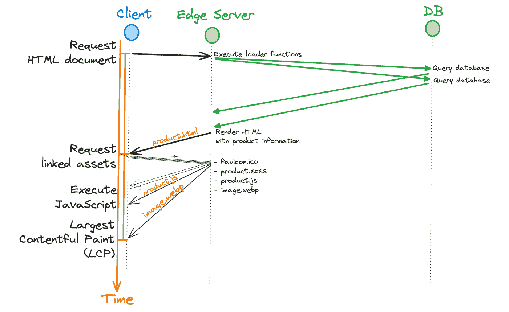

# 16

# 为边缘开发

**边缘**是一个多面性的术语，在不同的上下文中可能意味着不同的事物。它可能表示一个位置、一个运行时或一种计算范式。您可能还记得从*第三章*，*部署目标、适配器和堆栈*，中了解到 Remix 可以被部署到各种服务器环境，包括边缘环境。在本章中，我们将深入探讨为边缘开发，并探讨开发在边缘环境中运行的 Remix 应用程序的含义。

本章分为两个部分：

+   在边缘生活

+   理解边缘的优势和限制

首先，我们将讨论边缘计算并定义相关概念。接下来，我们将考虑在边缘托管 Remix 的好处和限制。

在阅读本章之后，您将了解部署到边缘的含义，并了解在与边缘环境中的 Remix 一起工作时需要考虑什么。此外，您还将了解流行的边缘提供商，并能够讨论边缘作为位置和运行时的优点、缺点和限制。

# 在边缘生活

边缘计算是一种已经存在多年的范式，但随着物联网（**IoT**）的兴起而备受关注。当 CDN 开始提供新的 JavaScript 运行时，以便在边缘托管 Web 应用程序时，该术语在 Web 开发中也找到了新的含义。在本节中，我们将定义在边缘运行网站的含义，并了解使用 Remix 进行边缘开发的样子。首先，让我们退一步，理解“边缘”一词的不同含义。

## 边缘计算

边缘计算是一种与云计算相对的计算机科学范式。它描述了一种系统架构，其中计算位于其利用点尽可能近的位置。虽然云计算发生在远程数据中心，但边缘计算旨在将计算定位在给定网络的边缘。这就是为什么我们经常使用“边缘”一词来描述与云的庞大数据中心形成对比的位置。

边缘计算的目标是通过将服务器移至用户附近来减少客户端到服务器的往返时间。除了其他方面，边缘计算得益于计算可用性的增加和成本的降低。如果计算能力可用，为什么不更靠近用户进行计算呢？

想象一下一款设计用来自动检测运动并在发现可疑活动时触发警报的安全摄像头。在基于云的设置中，摄像头将视频流发送到数据中心进行分析。如果检测到运动，中央系统会触发建筑物的警报。另一方面，使用基于边缘的架构，摄像头可能直接在设备上处理视频流。如果它检测到运动，摄像头本身会向建筑物的中央服务器发送警报，然后激活警报系统。

边缘计算需要在网络边缘有可用的计算能力，而云计算则利用了集中式数据中心的计算能力。通过边缘计算，我们可以通过避免往返云端的行程来减少响应时间和网络带宽。然而，所需的计算能力必须是可用的。有时，我们可能需要重新思考我们的应用程序及其运行时，使其更轻量级且适合边缘。这就是为什么我们可能会使用“边缘”一词来描述针对边缘优化的运行时环境。

为了明确，我们不会尝试在安全摄像头上部署和运行 Remix。边缘计算是一种分布式计算范式，可以应用于许多用例，例如物联网。物联网是边缘计算的一个例子，其中智能设备在边缘网络中通信，无需将收集到的数据直接流式传输到云端进行处理。

在网络开发中，边缘计算发生在高度地理分布的数据中心，与传统的云计算提供的集中式数据中心相比，大大增加了与用户的接近程度。接下来，让我们回顾一下今天针对 Web 应用的边缘服务。

## 在边缘运行 Web 应用

CDN 已经为互联网边缘提供了数十年的内容。总之，边缘计算在 Web 开发中不是一个新概念。真正前沿的（有意为之）是能够在边缘托管动态 Web 应用的能力。

传统上，CDN 用于交付静态内容，包括网页资源（HTML、CSS 和 JavaScript 文件）和媒体文件（图像和视频）。CDN 在尽可能多的地点维护地理分布式的数据中心，并针对可靠性、可扩展性和性能进行了优化。这使得 CDN 不仅适合缓存和提供静态内容，还适合作为边缘计算提供商。

近年来，CDN 已经扩大了其范围，以处理动态内容并提供 Web 应用托管服务。提供边缘运行时的流行 CDN 包括 Cloudflare 和 Fastly。此外，越来越多的托管提供商，如 Netlify 和 Vercel，与 CDN 合作，通过他们的托管平台提供边缘环境。

Remix 是第一个支持在边缘部署和运行的 Web 框架之一。正如您从本书的前几章所知，Remix 是在考虑到各种运行时环境需求的情况下开发的。在下一节中，我们将了解更多关于今天的边缘托管提供商。

## 边缘计算中的 Remix

理论上，Remix 可以在任何可以执行 JavaScript 的服务器上运行。这是可能的，因为 Remix 利用了适配器架构。Remix 使用适配器在本地服务器运行时和 Remix 之间转换请求和响应。这使得 Remix 可以与各种 Web 服务器库和运行时协同工作。在本节中，我们将回顾如何在边缘部署 Remix。

Remix 为许多流行的部署目标维护官方适配器，但适配器架构也允许社区为任何环境构建适配器。在撰写本文时，以下边缘和类似边缘的部署目标有 Remix 模板：

+   Cloudflare Pages

+   Cloudflare Workers

+   Deno Deploy

+   Fastly Compute@Edge

+   Netlify Edge Functions

+   Fly.io

+   Vercel Edge Functions

将 Remix 部署到边缘就像选择一个边缘模板并将其部署到相关服务提供商一样简单。通过运行以下命令尝试一下：

```js
npx create-remix@2 --template remix-run/remix/templates/cloudflare-workers
```

按照`create-remix`脚本的说明操作，然后打开引导的`README.md`文件。`README.md`将指导您将应用程序部署到 Cloudflare Workers。就像那样，您使用 Remix 将应用程序部署到了边缘。

注意，列出的边缘和类似边缘的部署目标之间存在差异。CDN 使用与 Node.js 不兼容的轻量级 JavaScript 运行时。类似边缘的部署目标，如 Deno Deploy 和 Fly.io 提供区域分布，但可能比它们的 CDN 对应物提供更少的邻近性。您可以参考*第三章*，*部署目标、适配器和堆栈*，了解更多关于 Remix 的不同部署目标及其运行时和环境。

在本节中，您学习了边缘计算是一种分布式计算范式，并了解了它与云计算的区别。您还回顾了 Remix 可用的边缘部署目标，并将 Remix 应用程序部署到了边缘。您还了解了从边缘提供服务如何提高响应时间。也许您想知道为什么我们没有构建 BeeRich 在边缘上运行。在下一节中，我们将考虑在边缘运行的局限性，并进一步讨论利弊。

# 理解边缘计算的优势和局限性

在上一节中，您了解到边缘计算关乎性能。通过将计算更靠近用户，我们可以减少响应时间，从而提高用户体验。让我们深入了解，了解更多关于边缘的优缺点。

边缘环境遵循无服务器编程模型。每个传入请求都会启动一个新的边缘函数。该函数运行 Web 应用程序（我们的 Remix 应用程序）以满足请求，然后关闭。

无服务器执行避免了在空闲应用程序上浪费计算能力。然而，无服务器也减少了 Web 应用程序的能力，将其缩短为处理传入请求后关闭的短期函数。例如，无服务器函数不能用于长时间运行的任务，如维护服务器发送事件端点或 WebSocket 服务器。

与大多数无服务器环境一样，边缘函数也无法访问文件系统，无法读写文件。这要求我们利用远程服务来存储文件。此外，边缘函数不提供可以在不同请求之间共享的长久应用状态。这阻止了我们缓存数据或在内存中管理用户会话。

边缘提供商使用轻量级运行时，使 Web 应用程序的计算密集度降低。今天的大多数基于 CDN 的边缘运行时都在 V8 隔离器上运行，这是 V8 引擎中的隔离上下文。启动 V8 隔离器比启动容器或虚拟机更快。这使得边缘应用程序能够在毫秒内处理请求。大多数传统无服务器函数在一段时间休眠后启动时，会遭受数百毫秒的冷启动时间。边缘函数则不会遇到同样的冷启动问题。

大多数边缘原生运行时，如 Cloudflare 的 workerd，都是考虑到 Web 标准设计的，但它们不支持执行 Node.js 标准库。这使得它们与 Node.js 不兼容。最终，我们只能使用不内部使用 Node.js 标准库的 npm 包。这可能会或可能不会成为问题，具体取决于应用程序的使用情况，但确实是一个需要考虑的点。

边缘相对于传统 Web 托管的一个大优势是全球分布。大多数服务器和无服务器环境不会自动在不同区域之间分发应用程序，至少不是没有额外的配置开销和成本。边缘计算使我们能够以最小的配置努力和显著降低的价格点在全球范围内分发 Web 应用程序。然而，地理分布也增加了相关系统架构的复杂性。

区域分布只有在减少请求背后的总往返时间时才会降低响应时间。请参考*第十三章*中的*图 13.2*，*延迟加载器数据*，其中我们说明了 Remix 如何通过移除客户端-服务器往返来减少响应时间。我们可以在文档请求上执行`loader`函数并查询附近数据库，而不是从客户端向服务器发起 fetch 请求。注意，在*图 13.2*中，从服务器到数据库的往返时间非常小。我们假设数据库靠近服务器 – 例如，在同一个云区域、数据中心，甚至同一地点。*图 16.1*说明了如果数据库远离服务器，响应时间可能会增加：



图 16.1 – 带远程数据库的边缘响应瀑布图

通过将服务器靠近用户，我们可能能够减少客户端-服务器往返次数。然而，每次客户端-服务器往返可能会触发几次服务器-数据库往返。如果这些往返由于服务器和数据库之间的距离而增加，我们可能会降低整体性能。

*图 16**.1* 假设我们进行两次独立的数据库查询以满足文档请求。正如我们所见，我们进一步假设我们可以并行执行这两个数据库请求。然而，有时我们可能需要执行后续请求。注意这些请求将如何进一步延迟响应时间。

今天网络应用程序的性能很大程度上取决于服务器和数据库之间的距离。在云数据中心和区域中，数据库通常靠近网络服务器。然而，为了在边缘环境中实现服务器和数据库的邻近性，我们必须分布我们的数据库。

地理上分布的数据库服务存在，CDN 也开始提供分布式键值和 SQL 数据库，但考虑全球分布式系统架构的成本和复杂性是很重要的。

你可能会注意到这里有一个模式。边缘函数提供了计算和地理上的可扩展性，但引入了额外的复杂性。在评估项目中的边缘时，你必须仔细权衡所讨论的利益和考虑因素。

让我们通过进行一个简短的思想实验来结束。BeeRich 需要哪些部分进行重新设计才能在边缘环境中运行？对于类似 Fly.io 或 Deno Deploy 这样的边缘环境，不多。然而，对于像 Cloudflare Workers 和 Pages 这样的真正边缘环境，我们需要进行重大的更改：

+   SQLite 数据库在同一台机器上运行并需要文件系统访问。SQLite 不被边缘运行时支持。我们需要使用不同的数据库。

+   费用和发票附件文件上传功能需要重新设计。我们目前使用服务器的文件系统。我们需要使用第三方文件存储服务或构建一个自定义的存储服务。

+   实时更新功能需要重新设计。我们目前使用服务器发送事件端点来更新客户端关于数据变化的信息。服务器发送事件需要长期运行的连接，而这些连接不被边缘运行时支持。我们必须将服务器发送事件端点部署到不同的长期运行服务器上。

这个例子说明了长期运行的服务器支持更简单的应用程序设计，而无服务器边缘运行时由于其可扩展性和性能驱动的特性而引入了限制。

在本节中，你了解了边缘的好处和局限性。我们还讨论了在边缘环境中不可能实现的事情。有了这些考虑，你现在可以评估将项目迁移到边缘是否值得。

# 摘要

在本章中，你了解了边缘作为一种计算范式、一个位置和运行时。你现在明白边缘计算与云计算形成对比，旨在将计算尽可能靠近用户以减少响应时间。

你进一步了解到 CDN 可以作为互联网的边缘。在边缘运行 Remix 将 Web 服务器移动到比云的区域集中数据中心更接近用户的位置。

Remix 为多个边缘部署目标提供了适配器，你通过使用 Remix 的`create-remix`脚本来练习部署到边缘。你现在明白在边缘设置 Remix 应用程序是多么容易。

我们讨论了边缘作为部署目标的好处和局限性。你现在明白边缘遵循无服务器编程模型，这使得它具有高度的可扩展性，但也引入了复杂性。边缘运行时使用轻量级容器技术来优化地理分布和性能。地理分布引入了额外的考虑因素，例如到数据库的距离。

最后，你学习了在边缘无法完成的事情，例如访问文件系统、在请求之间在内存中共享应用程序状态，以及处理长时间运行的任务和连接。

在下一章和最后一章中，我们将回顾我们已经学到的内容。我们将进一步涉及一些最终话题，例如迁移策略和 Remix 的版本控制。

# 进一步阅读

查阅 Remix 文档以获取官方和社区适配器的列表：[`remix.run/docs/en/2/other-api/adapter`](https://remix.run/docs/en/2/other-api/adapter)。

你可以在这里找到有关 Fastly 的 Remix 适配器的更多信息：[`www.fastly.com/blog/host-your-remix-app-on-fastly-compute-edge`](https://www.fastly.com/blog/host-your-remix-app-on-fastly-compute-edge)。

参考这篇文章了解如何将你的 Remix 应用程序部署到 Netlify 的边缘函数：[`www.netlify.com/blog/how-to-use-remix-framework-with-edge-functions/`](https://www.netlify.com/blog/how-to-use-remix-framework-with-edge-functions/)。

如果你想了解更多关于边缘环境的信息，请查看 Cloudflare 的学习资源：[`developers.cloudflare.com/workers/learning/how-workers-works/`](https://developers.cloudflare.com/workers/learning/how-workers-works/)。
