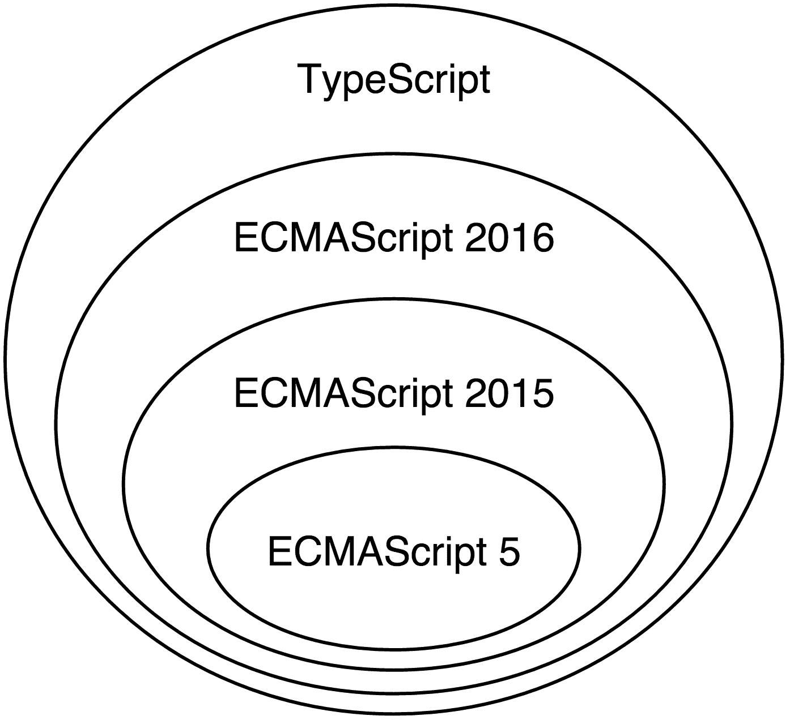

# 第一章。开始使用 Angular

2014 年 9 月 18 日，谷歌将第一个公开提交推送到包含新版本 Angular 的存储库。几周后，在 **ng-europe** 上，核心团队中的 Igor 和 Tobias 给出了一个关于新版本框架预期内容的简要概述。当时的愿景远未最终确定；然而，有一点是确定的：新版本的框架将完全不同于 AngularJS。

这一公告引发了许多问题和争议。这些重大变化背后的原因非常明显：AngularJS 已无法充分利用演进的 Web，以及大规模 JavaScript 应用程序的需求需要得到完全满足。一个新的框架将让 Angular 开发者以更简单、更高效、更富有成效的方式利用 Web 技术的发展。然而，人们对此表示担忧。对于开发者来说，向后不兼容的最大噩梦之一是将他们当前的代码库迁移到他们使用的第三方软件的新版本。在 Angular 的情况下，在那次第一次公告之后，迁移看起来令人畏惧，甚至不可能。后来，在 2015 年的 **ng-conf** 和 **ng-vegas** 上，介绍了不同的迁移策略。Angular 社区团结起来，分享了额外的想法，预计新版本的框架将带来好处，同时保留从 AngularJS 中学到的经验。

本书是该项目的一部分。现在将 Angular 升级到新版本变得平滑且值得。Angular 2 和其缺乏向后兼容性的巨大变化背后的主要推动力是 Web 的发展以及从 AngularJS 的实际使用中吸取的教训。《Angular 入门》将帮助你通过了解我们是如何到达这里的以及为什么 Angular 的新特性对现代 Web 来说在构建高性能、可扩展的单页应用程序方面具有直观的意义来学习新框架。本章我们将讨论的一些主题包括：

+   如何使用 TypeScript 以及它如何扩展 JavaScript。

+   使用基于组件架构构建 Angular 应用程序的用户界面。

+   使用 Angular 的依赖注入机制并将业务逻辑委托给服务。

+   我们将深入探讨 Angular 的路由和表单模块。

+   我们将探讨即时编译（Ahead-of-Time compilation）以构建闪电般快速的应用程序。

Angular 采用了语义版本控制，因此在继续之前，让我们先概述一下这实际上意味着什么。

# Angular 和 semver

AngularJS 从头开始重写，并替换为其继任者 Angular 2。我们中的许多人对此重大步骤感到烦恼，因为它不允许我们在这两个框架版本之间实现平滑过渡。在 Angular 2 稳定后，谷歌宣布他们希望遵循所谓的语义版本控制（也称为 semver）。

Semver 定义了给定软件项目的版本为**X.Y.Z**的三元组，其中 Z 被称为**修补版本**，Y 被称为**次要版本**，X 被称为**主版本**。修补版本的变化意味着同一项目的两个版本之间没有预期的破坏性变化，只有错误修复。当引入新功能且没有破坏性变化时，项目的次要版本将增加。最后，当 API 中引入不兼容的变化时，主版本将增加。

这意味着在 2.3.1 和 2.10.4 版本之间，没有引入破坏性变化，只有一些新增功能和错误修复。然而，如果我们有 2.10.4 版本，并且想要以向后不兼容的方式更改任何现有的公共 API（例如，更改方法接受的参数顺序），我们需要增加主版本号，并将修补版本和次要版本重置，这样我们将得到版本 3.0.0。

Angular 团队也遵循严格的计划。根据该计划，*每个星期需要引入一个新的修补版本；在每次主要版本发布后，应有三次每月的次要版本发布*，最后，*每六个月发布一次主要版本*。这意味着到 2018 年底，我们将至少拥有 Angular 6。然而，这并不意味着每六个月我们都必须经历像 AngularJS 和 Angular 2 之间的相同迁移路径。*并非每个主要版本都会引入影响我们项目的破坏性变化*。例如，对 TypeScript 新版本的支持或方法最后一个可选参数的改变将被视为破坏性变化。我们可以将这些破坏性变化视为类似于 AngularJS 1.2 和 AngularJS 1.3 之间发生的情况。

### 注意

由于本书中您将要阅读的内容将主要适用于不同的 Angular 版本，*我们将 Angular 2 称为 Angular 2 或仅称 Angular*。如果我们明确提到 Angular 2，这并不意味着给定的段落对于 Angular 4 或 Angular 5 将不适用；它很可能适用。如果您对框架不同版本之间的变化感兴趣，可以查看变更日志[`github.com/angular/angular/blob/master/CHANGELOG.md`](https://github.com/angular/angular/blob/master/CHANGELOG.md)。如果我们讨论的是 AngularJS（即框架的 1.x 版本），我们将通过提及版本号或使用 AngularJS 代替 Angular 来更加明确。

现在我们已经介绍了 Angular 的语义版本和引用框架不同版本的约定，我们可以正式开始我们的旅程了！

# 网络的演变 - 是时候引入新的框架了

在过去几年里，Web 经历了巨大的发展。在实施 ECMAScript 5 的过程中，ECMAScript 6 标准开始了其开发（现在被称为**ECMAScript 2015**或**ES2015**）。ES2015 在 JavaScript 中引入了许多变化，例如添加内置语言支持模块、块作用域变量定义以及许多语法糖，如类和结构赋值。

同时，**Web Components**被发明了。Web Components 允许我们定义自定义的 HTML 元素并将行为附加到它们上。由于很难通过添加新的元素（如对话框、图表、网格等）来扩展现有的 HTML 元素集，这主要是因为它们 API 的整合和标准化所需的时间，因此一个更好的解决方案是允许开发者以他们想要的方式扩展现有的元素。Web Components 为我们提供了许多好处，包括更好的封装、我们产生的标记的更好语义、更好的模块化，以及开发者和设计师之间更易沟通。

我们知道 JavaScript 是一种单线程语言。最初，它是为了简单的客户端脚本开发而开发的，但随时间推移，它的角色发生了很大变化。现在，有了 HTML5，我们有不同的 API 允许音频和视频处理、通过双向通信通道与外部服务进行通信、传输和处理大量原始数据等。所有这些在主线程中的重计算可能会创建一个糟糕的用户体验。它们可能会在执行耗时计算时导致用户界面冻结。这导致了**Web Workers**的发展，它允许在后台执行脚本并通过消息传递与主线程通信。这样，多线程编程被带到了浏览器中。

一些这些 API 是在 AngularJS 开发开始之后引入的；这就是为什么框架在构建时没有考虑到它们中的大多数。利用这些 API 为开发者带来了许多好处，例如以下这些：

+   显著的性能改进。

+   开发具有更好质量特性的软件。

现在，让我们简要讨论这些技术是如何成为新 Angular 核心的一部分以及为什么。

# ECMAScript 的演变

现在，浏览器厂商正在以短周期迭代的方式发布新功能，用户经常收到更新。这有助于开发者利用前沿的 Web 技术。ES2015 已经标准化。该语言最新版本的实现已经在主要浏览器中开始。学习新语法并利用它不仅会增加我们的开发效率，而且还会为我们为即将到来的所有浏览器都将完全支持它的近未来做好准备。这使得现在开始使用最新语法变得至关重要。

一些项目的需求可能迫使我们支持不支持任何 ES2015 特性的旧浏览器。在这种情况下，我们可以直接编写 ECMAScript 5，它具有不同的语法但与 ES2015 具有等效的语义。另一方面，更好的方法将是利用**转译**过程。在我们的构建过程中使用转译器允许我们通过编写 ES2015 并将其转换为浏览器支持的目标语言来利用新语法。

Angular 自 2009 年以来一直存在。当时，大多数网站的前端由 ECMAScript 3 提供支持，这是 ECMAScript 5 之前的最后一个主要版本。这自动意味着框架实现所使用的语言是 ECMAScript 3。利用语言的新版本需要将 AngularJS 的全部内容移植到 ES2015。

从一开始，Angular 2 就考虑了 Web 的当前状态，通过引入框架中的最新语法。虽然新的 Angular 是用 ES2016 的超集（TypeScript）编写的（我们将在第三章中查看 AngularJS 控制器的责任如何被新的组件和指令所取代。

## 范围

在 AngularJS 中，数据绑定是通过`scope`对象实现的。我们可以将其属性附加到它上，并在模板中显式声明我们想要绑定到这些属性（单向或双向）。尽管作用域的概念似乎很清晰，但它还有两个额外的职责，包括事件分发和与变更检测相关的行为。Angular 初学者很难理解作用域到底是什么以及应该如何使用它。AngularJS 1.2 引入了所谓的**控制器作为语法**。它允许我们在给定控制器内部添加属性到当前上下文（`this`），而不是显式注入`scope`对象并稍后添加属性。这种简化的语法可以通过以下代码片段进行演示：

```js
<div ng-controller="MainCtrl as main"> 
  <button ng-click="main.clicked()">Click</button> 
</div>
```

```js
function MainCtrl() { 
  this.name = 'Foobar'; 
} 
MainCtrl.prototype.clicked = function () { 
  alert('You clicked me!'); 
}; 

```

最新版本的 Angular 通过移除`scope`对象将这一概念进一步发扬光大。所有表达式都在给定的 UI 组件的上下文中进行评估。移除整个作用域 API 引入了更高的简洁性；我们不再需要显式地注入它，而是将属性添加到 UI 组件中，我们可以稍后将其绑定。这个 API 感觉更加简单和自然。

我们将在第四章*开始使用 Angular 组件和指令*中更详细地探讨 Angular 的组件和变更检测机制。

## 依赖注入

可能是市场上第一个在 JavaScript 世界中通过**依赖注入**（**DI**）实现**控制反转**（**IoC**）的框架是 AngularJS。DI 提供了一系列好处，例如更易于测试、更好的代码组织和模块化，以及简洁性。尽管该框架第一版本的 DI 功能强大，但 Angular 2 将这一概念进一步发扬光大。由于最新的 Angular 基于最新的 Web 标准，它使用 ECMAScript 2016 装饰器语法来注释使用 DI 的代码。装饰器与 Python 中的装饰器或 Java 中的注解非常相似。它们允许我们使用反射来**装饰**给定对象的行为，或为其添加元数据。由于装饰器尚未标准化且不被主流浏览器支持，其使用需要中间转译步骤；然而，如果您不想这样做，您可以直接使用 ECMAScript 5 语法编写更多冗长的代码，并达到相同的语义。

新的 DI 更加灵活且功能丰富。它还修复了 AngularJS 的一些缺陷，例如不同的 API；在框架的第一版本中，一些对象通过位置（例如指令的链接函数中的作用域、元素、属性和控制器）注入，而其他对象则通过名称（使用控制器、指令、服务和过滤器中的参数名称）注入。

我们将在第五章*Angular 中的依赖注入*中进一步探讨 Angular 的依赖注入 API。

## 服务器端渲染

网络需求越大，Web 应用就越复杂。构建一个真实的单页应用需要编写大量的 JavaScript，并且包含所有必需的外部库可能会使页面上的脚本大小增加到几兆字节。在移动设备上，直到从服务器获取所有资源、解析并执行 JavaScript、渲染页面以及应用所有样式，应用的初始化可能需要几秒钟甚至几十秒钟。在低端移动设备上，使用移动网络连接时，这个过程可能会让用户放弃访问我们的应用。尽管有一些做法可以加快这个过程，但在复杂的应用中，并没有一劳永逸的解决方案。

在尝试提升用户体验的过程中，开发者发现了一种称为**服务器端渲染**的技术。它允许我们在服务器上渲染单页应用的请求视图，并直接将页面的 HTML 提供给用户。一旦所有资源都处理完毕，脚本文件可以添加事件监听器和绑定。这听起来像是提升我们应用性能的好方法。在这方面，React 是一个先驱，它允许使用 Node.js DOM 实现来在服务器端预渲染用户界面。不幸的是，AngularJS 的架构不允许这样做。主要障碍是框架与浏览器 API 之间的强耦合，这正是我们在 Web Workers 中运行变更检测时遇到的问题。

服务器端渲染的另一个典型用例是构建**搜索引擎优化**（**SEO**）友好型应用。过去，为了使 AngularJS 应用可由搜索引擎索引，人们使用了一些技巧。例如，一种做法是使用无头浏览器遍历应用，在每个页面上执行脚本并将渲染输出缓存到 HTML 文件中，使其可被搜索引擎访问。

尽管构建 SEO 友好型应用的这种解决方案是可行的，但服务器端渲染解决了上述两个问题，提升了用户体验，并使我们能够更加轻松且优雅地构建 SEO 友好型应用。

将 Angular 与 DOM 解耦使我们能够在浏览器之外运行 Angular 应用。我们将在第八章*工具和开发体验*中进一步探讨这一点。

## 可扩展的应用

自从 Backbone.js 出现以来，MVW（Model-View-Whatever）一直是构建单页应用程序的默认选择。它通过将业务逻辑与视图隔离开来，使我们能够构建设计良好的应用程序。利用观察者模式，MVW 允许在视图中监听模型变化，并在检测到变化时更新它。然而，这些事件处理器之间存在一些显式和隐式的依赖关系，这使得我们应用程序中的数据流不明显，难以推理。在 AngularJS 中，我们允许不同观察者之间存在依赖关系，这要求消化循环迭代所有这些观察者几次，直到表达式的结果稳定。新的 Angular 使数据流单向；这带来了许多好处：

+   更明确的数据流。

+   绑定之间没有依赖关系，因此没有**生存时间**（**TTL**）。

+   框架性能更好：

    +   消化循环只运行一次。

    +   我们可以创建对不可变或可观察模型友好的应用程序，这使我们能够进行进一步的优化。

数据流的变化在 AngularJS 架构中引入了另一个根本性的变化。

当我们需要维护一个用 JavaScript 编写的庞大代码库时，我们可能会对这个问题的看法有所不同。尽管 JavaScript 的鸭子类型使语言非常灵活，但它也使得 IDE 和文本编辑器对其分析和支持变得更加困难。大型项目的重构变得非常困难且容易出错，因为在大多数情况下，静态分析和类型推断是不可能的。缺少编译器使得打字错误变得过于容易，直到我们运行测试套件或运行应用程序，我们才难以注意到这些错误。

由于 TypeScript 提供了更好的工具和编译时类型检查，Angular 核心团队决定使用 TypeScript，这有助于我们提高生产效率并减少错误。正如以下图表所示，TypeScript 是 ECMAScript 的超集；它引入了显式的类型注解和编译器：



图 1

TypeScript 语言编译成普通 JavaScript，被今天的浏览器支持。自 1.6 版本以来，TypeScript 实现了 ECMAScript 2016 装饰器，使其成为 Angular 的完美选择。

TypeScript 的使用允许 IDE 和文本编辑器提供更好的支持，包括静态代码分析和类型检查。所有这些通过减少我们犯的错误并简化重构过程，极大地提高了我们的生产效率。TypeScript 的另一个重要好处是通过静态类型隐式获得的性能提升，这使得 JavaScript 虚拟机可以进行运行时优化。

我们将在第三章*TypeScript 快速入门*中详细讨论 TypeScript。

## 模板

模板是 AngularJS 的关键特性之一。它们是简单的 HTML，不需要任何中间转换，与大多数模板引擎（如 mustache）不同。Angular 的模板通过允许我们在其中创建一个内部**领域特定语言**（**DSL**），结合了自定义元素和属性，将简单性与强大功能相结合。

这也是 Web Components 的主要目的之一。我们已经提到了 Angular 如何以及为什么利用这项新技术。尽管 AngularJS 模板很棒，但它们仍然可以变得更好！新的 Angular 模板吸收了框架先前版本中模板的精华，并通过修复其中一些令人困惑的部分来增强它们。

例如，假设我们有一个指令，并希望允许用户通过属性传递给它。在 AngularJS 中，我们可以用以下三种不同的方式来处理这个问题：

```js
<user name="literal"></user> 
<user name="expression"></user> 
<user name="{{interpolate}}"></user> 

```

在`user`指令中，我们通过三种不同的方法传递`name`属性。我们可以传递一个字面量（在这种情况下，字符串`"literal"`），一个字符串，它将被评估为一个表达式（在我们的案例中是`"expression"`），或者一个在`{{ }}`内的表达式。应该使用哪种语法完全取决于指令的实现，这使得它的 API 错综复杂，难以记忆。

每天处理大量具有不同设计决策的组件是一项令人沮丧的任务。通过引入一个共同约定，我们可以处理这些问题。然而，为了获得良好的结果和一致的 API，整个社区都需要达成一致。

新的 Angular 通过提供特殊语法来处理这个问题，这些属性的值需要在当前组件的上下文中进行评估，并且为传递字面量提供了不同的语法。

根据我们的 AngularJS 经验，我们还习惯于模板指令中的微语法，例如`ng-if`和`ng-for`。例如，如果我们想在 AngularJS 中遍历用户列表并显示他们的名字，我们可以使用：

```js
<div ng-for="user in users">{{user.name}}</div> 

```

虽然这种语法对我们来说看起来直观，但它只提供了有限的工具支持。然而，Angular 2 通过引入更多明确的语法和更丰富的语义来解决这个问题：

```js
<template ngFor let-user [ngForOf]="users"> 
  {{user.name}} 
</template> 

```

前面的代码片段明确定义了属性，这些属性必须在当前迭代（`user`）的上下文中创建，以及我们迭代的（`users`）。

由于这种语法在键入时过于冗长，开发者可以使用以下语法，它最终会被转换成更冗长的形式：

```js
<li *ngFor="let user of users"> 
  {{user.name}} 
</li> 

```

新模板的改进也将允许更好的工具支持高级功能，例如文本编辑器和 IDE。我们将在第四章*开始使用 Angular 组件和指令*中讨论 Angular 的模板。

## 变更检测

在 *Web Workers* 部分，我们已经提到了在作为 Web Worker 实例化的不同线程上下文中运行消化循环的机会。然而，AngularJS 中消化循环的实现并不那么内存高效，并阻止 JavaScript 虚拟机进行进一步的代码优化，这允许实现显著的性能提升。其中一种优化是内联缓存（[`mrale.ph/blog/2012/06/03/explaining-js-vms-in-js-inline-caches.html`](http://mrale.ph/blog/2012/06/03/explaining-js-vms-in-js-inline-caches.html)）。

Angular 团队进行了大量研究，以发现提高变更检测性能和效率的不同方法。这导致了全新的变更检测机制的诞生。

因此，Angular 在框架直接从组件模板生成的代码中执行变更检测。代码由 **Angular 编译器**生成。有两种内置的代码生成（也称为编译）策略：

+   **即时编译 (JiT)**：在运行时，Angular 生成代码以在整个应用程序上执行变更检测。生成的代码针对 JavaScript 虚拟机进行了优化，从而提供了显著的性能提升。

+   **提前编译 (AoT)**：与即时编译 (JiT) 类似，但不同之处在于代码作为应用程序构建过程的一部分被生成。它可以用于通过不在浏览器中执行编译来加速渲染，也可以用于不允许 `eval()` 的环境，例如 **内容安全策略 (CSP)** 和 Chrome 扩展。我们将在本书的下一节中进一步讨论。

我们将在第四章 “开始使用 Angular 组件和指令” 中查看新的变更检测机制以及如何配置它们。

# 摘要

在本章中，我们考虑了 Angular 核心团队做出决策的主要原因以及框架最后两个主要版本之间缺乏向后兼容性的原因。我们看到，这些决策是由两件事推动的——Web 的演变和前端开发的演变，以及从 AngularJS 应用程序开发中学到的经验教训。

在第一部分，我们学习了为什么需要使用 JavaScript 语言的最新版本，为什么应该利用 Web 组件和 Web Workers，以及为什么在版本 1 中集成所有这些强大的工具并不值得。

我们观察了前端开发的当前方向和过去几年中吸取的教训。我们描述了为什么控制器和作用域被从 Angular 2 中移除，以及为什么为了允许 SEO 友好、高性能的单页应用程序进行服务器端渲染，AngularJS 的架构发生了变化。我们审视的另一个基本主题是构建大规模应用程序，以及它是如何激励框架中的单向数据流和选择静态类型语言 TypeScript 的。

在下一章中，我们将探讨 Angular 应用程序的主要构建块，它们的使用方法以及它们之间的关系。新的 Angular 重用了 AngularJS 中引入的一些概念名称，但通常完全改变了我们的单页应用程序的构建块。我们将简要了解新概念，并将它们与框架的前一个版本中的概念进行比较。我们将快速介绍模块、指令、组件、路由器、管道和服务，并描述如何将它们组合起来构建优雅的单页应用程序。

### 小贴士

**下载示例代码**

您可以从 [`www.packtpub.com`](http://www.packtpub.com) 的账户下载本书的示例代码文件。如果您在其他地方购买了这本书，您可以访问 [`www.packtpub.com/support`](http://www.packtpub.com/support) 并注册，以便将文件直接通过电子邮件发送给您。
