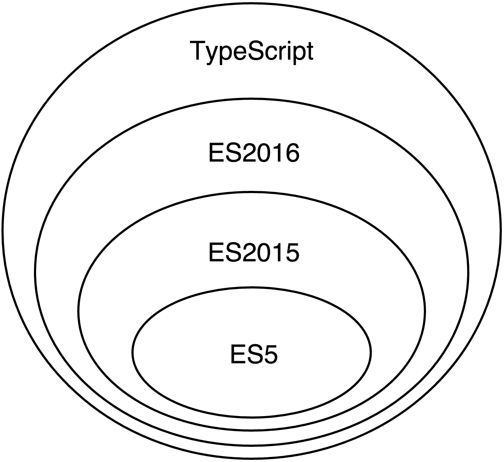
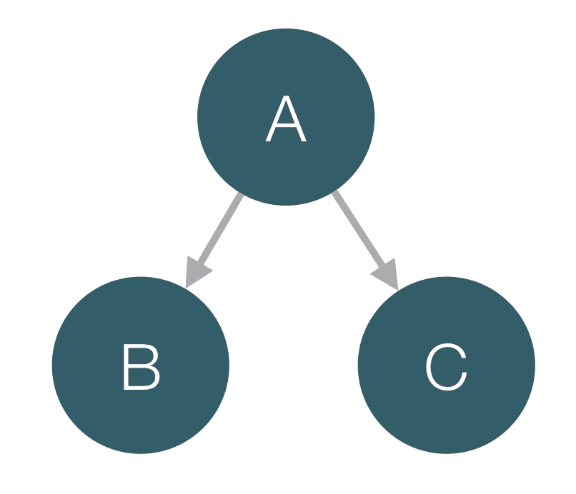

# 第三章 TypeScript 快速入门

在本章中，我们将开始使用 TypeScript，这是谷歌推荐与 Angular 一起使用的语言。所有 ECMAScript 2015 和 ECMAScript 2016 提供的功能，如函数、类、模块和装饰器，都已经实现或添加到 TypeScript 的路线图中。由于额外的类型注解，与 JavaScript 相比，有一些语法上的添加。

为了更平滑地从当时由现代浏览器完全支持的编程语言（即 ES5）过渡，我们将从 ES2016 和 TypeScript 之间的共同特性开始。当 ES2016 语法和 TypeScript 之间存在差异时，我们将明确指出。在本章的后半部分，我们将为到目前为止所学的所有内容添加类型注解。

在本章的后面部分，我们将解释 TypeScript 提供的额外功能，例如静态类型和额外语法。我们将讨论基于这些功能的不同后果，这将帮助我们提高生产效率并减少错误。让我们开始吧！

# TypeScript 简介

TypeScript 是由微软开发和维护的开源编程语言。它的首次公开发布是在 2012 年 10 月。TypeScript 是 ECMAScript 的超集，支持 JavaScript 的所有语法和语义，并在其基础上增加了额外的功能，例如静态类型和更丰富的语法。

*图 1* 展示了 ES5、ES2015、ES2016 和 TypeScript 之间的关系。



图 1

由于 TypeScript 是静态类型的，它可以为我们这些 JavaScript 开发者提供许多好处。现在让我们快速看一下这些好处。

## 编译时类型检查

在编写 JavaScript 代码时，我们最常见的错误之一是拼写属性或方法名错误。通常，当我们遇到运行时错误时，我们会发现这个错误。这可能在开发过程中发生，也可能在生产过程中发生。希望我们在将代码部署到生产环境之前就能知道这个错误，这并不是一个令人舒服的感觉！然而，这并不是 JavaScript 所特有的问题；这是所有动态语言的共同问题。即使有大量的单元测试，这些错误也可能被忽略。

TypeScript 提供了一个编译器，通过使用静态代码分析来处理这些错误。如果我们利用静态类型，TypeScript 将知道给定对象具有哪些现有属性，如果我们拼写错误，编译器将以编译时错误的形式警告我们。

TypeScript 的另一个巨大好处是，它允许大型团队协作，因为它提供了正式且可验证的命名。这样，它允许我们编写易于理解的代码。

## 更好的文本编辑器和 IDE 支持

有许多工具，如 Tern，试图在文本编辑器和 IDE 中为 JavaScript 提供更好的自动完成支持。然而，由于 JavaScript 是一种动态语言，IDE 和文本编辑器在没有元数据的情况下无法做出复杂的建议。例如，Google Closure Compiler 就使用 JSDoc 中提供的类型注解来为语言提供静态类型。

使用此类元数据注释代码是 TypeScript 中称为类型注解的内置功能。基于这些类型注解，文本编辑器和 IDE 可以对我们的代码进行更好的静态分析。这提供了更好的重构工具和自动完成功能，提高了我们的生产力，并允许我们在编写应用程序的源代码时犯更少的错误。

## TypeScript 还有更多内容

TypeScript 本身还有其他一些好处：

+   **它是 JavaScript 的超集**：所有 JavaScript 程序（例如，ES5 和 ES2015）已经是有效的 TypeScript 程序。本质上，您已经一直在编写 TypeScript 代码。由于它基于 ECMAScript 标准的最新版本，它允许我们利用语言提供的最新尖端语法。

+   **支持可选类型检查**：如果出于任何原因，我们决定不想显式地定义变量或方法的类型，我们可以直接跳过类型定义。然而，我们应该意识到这意味着我们不再利用静态类型的好处，因此我们放弃了之前提到的所有好处。

+   **由微软开发和维护**：该语言的实现质量非常高，不太可能意外地放弃支持。TypeScript 基于世界上一些最好的编程语言开发专家的工作。

+   **它是开源的**：这允许社区自由地为语言做出贡献，并提出功能建议，这些建议以开放的方式进行讨论。TypeScript 是开源的事实使得第三方扩展和工具的开发更加容易，这进一步扩展了其使用范围。

由于现代浏览器不支持 TypeScript 的原生支持，存在一个编译器，它将我们编写的 TypeScript 代码转换成预定义的 ECMAScript 目标版本的可读 JavaScript。一旦代码被编译，所有的类型注解都会被移除。

# 使用 TypeScript

让我们开始编写一些 TypeScript 代码！

在以下章节中，我们将查看不同的代码片段，展示 TypeScript 的一些特性。为了能够运行这些代码片段并自行尝试，您需要在您的计算机上安装 TypeScript 编译器。让我们看看如何进行这一操作。

TypeScript 最好使用**Node 包管理器**（**npm**）安装。我建议您使用 npm 的 3.0.0 或更高版本。如果您还没有安装 node.js 和 npm，您可以访问[`nodejs.org`](https://nodejs.org)并遵循那里的说明。

## 使用 npm 安装 TypeScript

一旦安装并运行了 npm，请通过打开终端窗口并运行以下命令来验证您是否拥有最新版本：

```js
$ npm -v 

```

使用以下命令来安装 TypeScript 2.1.0 或更高版本：

```js
$ npm install -g typescript@².1.0 

```

前面的命令将安装 TypeScript 编译器并将其可执行文件（`tsc`）添加为全局。

为了验证一切是否正常工作，您可以使用以下命令：

```js
$ tsc -v
Version 2.1.1 

```

输出应该与前面的类似，尽管版本可能不同。

### 注意

注意，我们通过在版本号前加 caret 符号来安装 TypeScript。这意味着`npm`将下载 2.x.x 范围内的任何版本，但低于 3.0.0。

## 运行我们的第一个 TypeScript 程序

现在，让我们编译我们的第一个 TypeScript 程序！创建一个名为`hello.ts`的文件，并输入以下内容：

```js
// ch3/hello-world/hello-world.ts

console.log('Hello world!'); 

```

由于我们已经安装了 TypeScript 编译器，您应该有一个名为`tsc`的全局可执行命令。您可以使用它来编译文件：

```js
$ tsc hello.ts 

```

现在，您应该能在与`hello.ts`相同的目录中看到文件`hello.js`。`hello.js`是 TypeScript 编译器的输出；它包含了与您所写的 TypeScript 等价的 JavaScript。您可以使用以下命令运行此文件：

```js
$ node hello.js 

```

现在，您将在屏幕上看到字符串**Hello world!**被打印出来。为了将编译和运行程序的过程结合起来，您可以使用`ts-node`包：

```js
$ npm install -g ts-node 

```

现在，您可以运行：

```js
$ ts-node hello.ts 

```

您应该看到相同的结果，但磁盘上没有存储`ts-node`文件。

### 提示

您可以在[`github.com/mgechev/getting-started-with-angular`](https://github.com/mgechev/getting-started-with-angular)找到这本书的代码。大多数代码片段的第一行都有一个注释，它显示了您可以在样本存储库的目录结构中找到完整示例的位置。请注意，路径是相对于`app`目录的。

# TypeScript 语法和 ES2015 及 ES2016 引入的特性

由于 TypeScript 是 JavaScript 的超集，在我们开始学习其语法之前，先介绍 ES2015 和 ES2016 的一些重大变化会更容易；为了理解 TypeScript，我们首先必须理解 ES2015 和 ES2016。在适当的时候，我们将对这些变化进行快速浏览，然后再深入 TypeScript。

ES2015 和 ES2016 的详细解释超出了本书的范围。为了熟悉所有新特性和语法，我强烈建议您阅读*Dr. Axel Rauschmayer*的*Exploring ES6: Upgrade to the next version of JavaScript*。

接下来的几页将介绍新的标准，并允许您在开发 Angular 应用程序时利用您将需要的几乎所有功能。

## ES2015 箭头函数

JavaScript 有第一类函数，这意味着它们可以像任何其他值一样传递：

```js
// ch3/arrow-functions/simple-reduce.ts

var result = [1, 2, 3].reduce(function (total, current) { 
  return total + current; 
}, 0); // 6 

```

这种语法很棒；然而，它有点太冗长了。ES2015 引入了一种新的语法来定义匿名函数，称为箭头函数语法。使用它，我们可以创建匿名函数，如下面的例子所示：

```js
// ch3/arrow-functions/arrow-functions.ts 

// example 1 
var result = [1, 2, 3] 
  .reduce((total, current) => total + current, 0); 

console.log(result); // 6

// example 2 
var even = [3, 1, 56, 7].filter(el => !(el % 2)); 

console.log(even); // [56]

// example 3 
var sorted = data.sort((a, b) => { 
  var diff = a.price - b.price; 
  if (diff !== 0) { 
    return diff; 
  } 
  return a.total - b.total; 
}); 

```

在第一个例子中，我们得到了数组`[1, 2, 3]`中元素的总和。在第二个例子中，我们得到了数组`[3, 1, 56, 7]`中的所有偶数。在第三个例子中，我们按属性`price`和`total`的升序排序了数组。

箭头函数有几个我们需要关注的特性。最重要的特性是它们保留了周围代码的上下文（`this`）：

```js
// ch3/arrow-functions/context-demo.ts

function MyComponent() { 
  this.age = 42; 
  setTimeout(() => { 
    this.age += 1; 
    console.log(this.age); 
  }, 100); 
}

new MyComponent(); // 43 in 100ms. 

```

例如，当我们用操作符`new`调用`MyComponent`函数时；这将指向由调用创建的新对象。箭头函数将保持上下文（`this`），在`setTimeout`的回调中，并在屏幕上打印**43**。

这在 Angular 中非常有用，因为给定组件的绑定上下文是其实例（即其`this`实例）。如果我们定义`MyComponent`为 Angular 组件，并且有一个绑定到`age`属性的绑定，前面的代码将是有效的，并且所有绑定都将工作（注意我们没有作用域，也没有对`$digest`循环的显式调用，尽管我们直接调用了`setTimeout`）。

## 使用 ES2015 和 ES2016 类

当新手 JavaScript 开发者听到这种语言支持**面向对象**（**OO**）范式时，当他们发现没有用于定义类的语法时通常会感到困惑。这种观念源于一些最流行的编程语言，如 Java、C#和 C++，它们都有用于构建对象的类的概念。然而，JavaScript 以不同的方式实现了 OO 范式。JavaScript 有一个基于原型的面向对象编程模型，我们可以使用对象字面量语法或函数（也称为构造函数）来实例化对象，并且我们可以利用所谓的原型链来利用继承。

虽然这是一种实现面向对象范式的有效方式，并且语义与经典面向对象模型相似，但对于不确定如何正确处理这些内容的经验不足的 JavaScript 开发者来说，这可能会令人困惑。这就是 TC39 决定提供一种替代语法来在语言中使用面向对象范式的原因之一。幕后，新语法具有与我们习惯相同的语义，例如使用构造函数和基于原型的继承。然而，它提供了一个更方便的语法，以更少的样板代码来启用面向对象范式的功能。

ES2016 为 ES2015 类添加了一些额外的语法，例如静态和实例属性声明。

下面是一个示例，演示了在 ES2016 中定义类的语法：

```js
// ch3/es6-classes/sample-classes.ts 

class Human { 
  static totalPeople = 0; 
  _name; // ES2016 property declaration syntax

  constructor(name) { 
    this._name = name; 
    Human.totalPeople += 1; 
  }

  get name() { 
    return this._name; 
  }

  set name(val) { 
    this._name = val; 
  }

  talk() { 
    return `Hi, I'm ${this.name}!`; 
  } 
} 

class Developer extends Human { 
  _languages; // ES2016 property declaration syntax

  constructor(name, languages) { 
    super(name); 
    this._languages = languages; 
  }

  get languages() { 
    return this._languages; 
  }

  talk() { 
    return `${super.talk()} And I know ${this.languages.join(',')}.`; 
  } 
} 

```

在 ES2015 中，显式声明`_name`属性不是必需的；然而，由于 TypeScript 编译器在编译时应该知道给定类的实例的现有属性，我们需要将属性的声明添加到类声明本身中。

前面的代码片段既是有效的 TypeScript 也是 JavaScript 代码。在其中，我们定义了一个名为`Human`的类，它为其实例化的对象添加了一个单个属性。它是通过将属性的值设置为传递给其构造函数的参数`name`的值来实现的。

现在，打开`ch3/es6-classes/sample-classes.ts`文件并尝试一下！你可以以创建构造函数对象相同的方式创建类的不同实例：

```js
var human = new Human('foobar'); 
var dev = new Developer('bar', ['JavaScript']); 
console.log(dev.talk()); 

```

为了执行代码，请运行以下命令：

```js
$ ts-node sample-classes.ts 

```

类在 Angular 中常用。你可以使用它们来定义你的组件、指令、服务和管道。然而，你也可以使用替代的 ES5 语法，它利用了构造函数。在底层，一旦 TypeScript 代码被编译，这两种语法之间就不会有显著的差异，因为 ES2015 类无论如何都会被转换为构造函数。

## 定义具有块作用域的变量

对于有不同背景的开发者来说，JavaScript 的另一个令人困惑的点是该语言的变量作用域。例如，在 Java 和 C++中，我们习惯于块作用域。这意味着在特定块内部定义的变量将仅在块内部及其嵌套的所有块内部可见。

然而，在 JavaScript 中，事情略有不同。ECMAScript 定义了一个具有类似块作用域语法的功能词法作用域，但它使用函数而不是块。让我们看一下以下代码片段：

```js
// ch3/let/var.ts 

var fns = []; 
for (var i = 0; i < 5; i += 1) { 
  fns.push(function() { 
    console.log(i); 
  });
} 
fns.forEach(fn => fn()); 

```

这有一些奇怪的含义。一旦代码执行，它将记录数字`5`的五倍。

ES2015 添加了一种新的语法来定义具有块作用域可见性的变量。语法与当前语法类似，但是，它使用关键字`let`而不是`var`：

```js
// ch3/let/let.ts 

var fns = []; 
for (let i = 0; i < 5; i += 1) { 
  fns.push(function() { 
    console.log(i); 
  });
} 
fns.forEach(fn => fn()); 

```

# 使用 ES2016 装饰器进行元编程

JavaScript 是一种动态语言，它允许我们轻松地修改和/或改变行为以适应我们编写的程序。装饰器是 ES2016 的一个提案，根据设计文档[`github.com/wycats/javascript-decorators`](https://github.com/wycats/javascript-decorators)：

> *“...使设计时对类和属性的注释和修改成为可能。”*

它们的语法与 Java 中的注释非常相似，甚至与 Python 中的装饰器更接近。ES2016 装饰器在 Angular 中常用以定义组件、指令和管道，并利用框架的依赖注入机制。装饰器的多数用例涉及改变行为以符合预定义逻辑或向不同的结构添加一些元数据。

ES2016 装饰器通过改变程序的行为，使我们能够执行许多复杂操作。典型的用例可能是注释给定方法或属性为已弃用或只读。可以在名为*Jay Phelps*的项目*core-decorators.js*中找到一组预定义的装饰器，这些装饰器可以提高我们生成的代码的可读性。另一个用例是利用基于代理的面向方面编程，使用声明性语法。提供此功能的库是*aspect.js*。

通常，ES2016 装饰器只是另一种语法糖，它转换为我们已经熟悉的来自语言先前版本的 JavaScript 代码。让我们看看提案草案中的一个简单示例：

```js
// ch3/decorators/nonenumerable.ts 

class Person { 
  @nonenumerable 
  get kidCount() { 
    return 42; 
  } 
} 

function nonenumerable(target, name, descriptor) { 
  descriptor.enumerable = false; 
  return descriptor; 
} 

var person = new Person(); 

for (let prop in person) { 
  console.log(prop); 
} 

```

在这种情况下，我们有一个名为`Person`的 ES2015 类，它有一个名为`kidCount`的单个 getter。在`kidCount` getter 上，我们应用了`@nonenumerable`装饰器。装饰器是一个接受目标（`Person`类）、我们打算装饰的目标属性名称（`kidCount`）以及目标属性描述符的函数。在更改描述符后，我们需要返回它以应用修改。基本上，装饰器的应用可以按以下方式转换为 ECMAScript 5：

```js
descriptor = nonenumerable(Person.prototype, 'kidCount', descriptor) || descriptor; 
Object.defineProperty(Person.prototype, 'kidCount', descriptor); 

```

## 使用可配置的装饰器

这里是一个使用 Angular 定义的装饰器的示例：

```js
@Component({ 
  selector: 'app', 
  providers: [NamesList], 
  templateUrl: './app.html', 
}) 
export class App {} 

```

当装饰器接受参数（就像前面示例中的`Component`一样）时，它们需要定义为接受参数并返回实际装饰器的函数：

```js
function Component(config) { 
  // validate properties 
  return (componentCtrl) => { 
    // apply decorator 
  }; 
} 

```

在这个例子中，我们定义了一个接受单个参数`config`并返回装饰器的函数`Component`。

# 使用 ES2015 编写模块化代码

多年来，JavaScript 专业人士一直面临的一个问题是语言中缺乏模块系统。最初，社区开发了不同的模式，旨在强制执行我们生产的软件的模块化和封装。这些模式包括模块模式，它利用了函数词法作用域和闭包的优势。另一个例子是命名空间模式，它将不同的命名空间表示为嵌套对象。AngularJS 引入了自己的模块系统，但遗憾的是，它不提供诸如懒加载模块等特性。然而，这些模式更像是一种权宜之计，而不是真正的解决方案。

**CommonJS**（用于 node.js）和**AMD**（**异步模块定义**）后来被发明。它们至今仍被广泛使用，并提供诸如处理循环依赖、异步模块加载（在 AMD 中）等功能。

TC39 从现有的模块系统中吸取了最好的部分，并在语言层面上引入了这个概念。ES2015 提供了两个 API 来定义和消费模块。它们如下所示：

+   声明式 API。

+   使用模块加载器的命令式 API。

Angular 充分利用了 ES2015 模块系统，所以让我们深入探讨！在本节中，我们将查看用于声明性定义和消费模块的语法。我们还将窥视模块加载器的 API，以了解我们如何以显式异步的方式编程加载模块。

## 使用 ES2015 模块语法

让我们看看一个例子：

```js
// ch3/modules/math.ts 

export function square(x) { 
  return Math.pow(x, 2); 
};

export function log10(x) { 
  return Math.log10(x); 
};

export const PI = Math.PI; 

```

在前面的代码片段中，我们在`math.ts`文件中定义了一个简单的 ES2015 模块。我们可以将其视为一个示例数学 Angular 实用模块。在其中，我们定义并导出`square`和`log10`函数以及常量`PI`。`const`关键字是 ES2015 带来的另一个关键字，用于定义常量。正如你所见，我们所做的就是用关键字`export`来前缀函数的定义。如果我们想在最后导出整个功能并跳过重复的显式`export`使用，我们可以使用以下方法：

```js
// ch3/modules/math2.ts 

function square(x) { 
  return Math.pow(x, 2); 
};

function log10(x) { 
  return Math.log10(x); 
};

const PI = Math.PI;

export { square, log10, PI }; 

```

最后那一行的语法不过是增强的对象字面量语法，由 ES2015 引入。现在，让我们看看我们如何使用这个模块：

```js
// ch3/modules/app.ts 

import {square, log10} from './math';

console.log(square(2)); // 4 
console.log(log10(10)); // 1 

```

作为模块的标识符，我们使用其相对于当前文件的相对路径。使用解构，我们导入所需的函数——在这种情况下，`square`和`log10`。

## 利用模块的隐式异步行为

需要注意的是，ES2015 模块语法具有隐式的异步行为。



图 2

在前面的图中，我们有模块 `A`、`B` 和 `C`。模块 `A` 使用模块 `B` 和 `C`，因此它依赖于它们。一旦用户需要模块 `A`，JavaScript 模块加载器就需要在能够调用模块 `A` 中驻留的任何逻辑之前加载模块 `B` 和 `C`，因为这些模块有依赖关系。模块 `B` 和 `C` 将异步加载。一旦它们完全加载，JavaScript 虚拟机将能够执行模块 `A`。

## 使用别名

另一个典型的情况是我们想为给定的导出使用别名。例如，如果我们使用第三方库，我们可能想要重命名其任何导出，以避免名称冲突或仅仅为了更方便的命名：

```js
import {
  platformBrowserDynamic as platform
} from '@angular/platform-browser-dynamic';
```

## 导入所有模块导出

我们可以使用以下语法导入整个 `math` 模块：

```js
// ch3/modules/app2.ts 

import * as math from './math';

console.log(math.square(2)); // 4 
console.log(math.log10(10)); // 1 
console.log(math.PI); // 3.141592653589793 

```

这个语法的语义与 CommonJS 非常相似，尽管在浏览器中，我们有隐式的异步行为。

## 默认导出

如果一个给定的模块定义了一个导出，这很可能会被其任何消费者模块使用，我们可以利用默认导出语法：

```js
// ch3/modules/math3.ts 

export default function cube(x) { 
  return Math.pow(x, 3); 
};

export function square(x) { 
  return Math.pow(x, 2); 
}; 

```

为了使用此模块，我们可以使用以下 `app.ts` 文件：

```js
// ch3/modules/app3.ts 

import cube from './math3';

console.log(cube(3)); // 27 

```

或者，如果我们想导入默认导出并执行其他导出，我们可以使用：

```js
// ch3/modules/app4.ts 

import cube, { square } from './math3';

console.log(square(2)); // 4 
console.log(cube(3)); // 27 

```

通常，默认导出不过是一个用保留字 `default` 命名的命名导出：

```js
// ch3/modules/app5.ts 

import { default as cube } from './math3';

console.log(cube(3)); // 27 

```

# ES2015 模块加载器

标准的新版本定义了一个程序化 API 来处理模块。这就是所谓的模块加载器 API。它允许我们定义和导入模块，或者配置模块加载。

假设我们在文件 `app.js` 中有以下模块定义：

```js
import { square } from './math';

export function main() { 
  console.log(square(2)); // 4 
} 

```

从 `init.js` 文件中，我们可以使用以下方式程序化地加载 `app` 模块并调用其 `main` 函数：

```js
System.import('./app') 
  .then(app => { 
    app.main(); 
  }) 
  .catch(error => { 
    console.log('Terrible error happened', error); 
  }); 

```

全局对象 `System` 有一个名为 `import` 的方法，允许我们使用它们的标识符导入模块。在上面的代码片段中，我们导入了在 `app.js` 中定义的模块 `app`。`System.import` 返回一个承诺，它可以在成功时解析或因错误而拒绝。一旦承诺在传递给 `then` 的回调函数的第一个参数上解析，我们将得到模块实例。在拒绝的情况下注册的回调函数的第一个参数是一个表示发生错误的对象的错误。

上一个代码片段中的代码不存在于 GitHub 仓库中，因为它需要一些额外的配置。我们将在本书的后续章节中更明确地应用模块加载器，在 Angular 示例中。

# ES2015 和 ES2016 回顾

恭喜！我们学习 TypeScript 已经超过了一半。我们刚才看到的所有功能都是 TypeScript 的一部分，因为 TypeScript 实现了 JavaScript 的超集；由于所有这些功能都是在当前语法之上的升级，所以对于经验丰富的 JavaScript 开发者来说很容易掌握。

在接下来的章节中，我们将描述 TypeScript 的所有令人惊叹的功能，这些功能与 ECMAScript 的交集之外。

# 利用静态类型定义的优势

静态类型定义可以为我们提供更好的开发工具。在编写 JavaScript 时，IDE 和文本编辑器能做的最多只是语法高亮，并基于对代码的复杂静态分析提供一些基本的自动补全建议。这意味着我们只能通过运行代码来验证我们没有犯任何错误。

在前面的章节中，我们只描述了 ECMAScript 预期将在不久的将来由浏览器实现的新的功能。在本节中，我们将探讨 TypeScript 提供的内容，以帮助我们减少错误并提高生产力。在撰写本书时，没有计划在浏览器中实现内置的静态类型支持。

TypeScript 代码会经过中间预处理，执行类型检查并丢弃所有类型注解，以便提供现代浏览器支持的合法 JavaScript。

## 使用显式类型定义

就像 Java 和 C++一样，TypeScript 允许我们显式地声明给定变量的类型：

```js
let foo: number = 42; 

```

上述行使用`let`语法在当前块中定义变量`foo`。我们明确声明我们希望`foo`是`number`类型，并将`foo`的值设置为`42`。

现在，让我们尝试改变`foo`的值：

```js
let foo: number = 42; 
foo = '42'; 

```

在这里，在声明`foo`之后，我们将将其值设置为字符串`'42'`。这是一段完全有效的 JavaScript 代码；然而，如果我们使用 TypeScript 编译器编译它，我们将得到：

```js
$ tsc basic.ts 
basic.ts(2,1): error TS2322: Type 'string' is not assignable to type 'number'.

```

一旦`foo`与给定的类型相关联，我们就不能将其分配给不同类型的值。这是我们可以在给定的变量赋值时跳过显式类型定义的一个原因：

```js
let foo = 42; 
foo = '42'; 

```

由于 TypeScript 的类型推断，这段代码的语义将与显式类型定义的代码相同。我们将在本章末尾进一步探讨它。

### `any`类型

TypeScript 中的所有类型都是称为`any`的类型的一个子类型。我们可以使用`any`关键字声明属于`any`类型的变量。这样的变量可以持有任何类型的值：

```js
let foo: any; 
foo = {}; 
foo = 'bar '; 
foo += 42; 
console.log(foo); // "bar 42" 

```

上述代码是有效的 TypeScript，编译或运行时不会抛出任何错误。如果我们为所有变量使用`any`类型，我们基本上就是在使用动态类型编写代码，这会丢弃 TypeScript 编译器的所有好处。这就是为什么我们必须小心使用`any`，并且只在必要时使用它。

TypeScript 中的其他类型属于以下类别之一：

+   **原始类型**：这些包括 Number、String、Boolean、Void、Null、Undefined 和 Enum 类型。

+   **联合类型**：这些类型超出了本书的范围。您可以在 TypeScript 的规范中查看它们。

+   **对象类型**：这些包括函数类型、类和接口类型引用、数组类型、元组类型、函数类型和构造函数类型。

+   **类型参数**：这些包括将在 *使用类型参数编写泛型代码* 部分中描述的泛型。

## 理解原始类型

TypeScript 中的大多数原始类型都是我们在 JavaScript 中已经熟悉的：Number（数字）、String（字符串）、Boolean（布尔）、Null（空值）和 Undefined（未定义）。因此，我们在这里将跳过它们的正式解释。在开发 Angular 应用程序时，用户定义的 Enum 类型也是非常有用的类型集。

### 枚举类型

枚举类型是原始用户定义类型，根据规范，它们是 Number 的子类。枚举的概念存在于 Java、C++ 和 C# 语言中，在 TypeScript 中，用户定义的类型由称为元素的命名值集组成，具有相同的语义。在 TypeScript 中，我们可以使用以下语法定义枚举：

```js
enum STATES { 
  CONNECTING, 
  CONNECTED, 
  DISCONNECTING, 
  WAITING, 
  DISCONNECTED  
}; 

```

这将被翻译成以下 JavaScript：

```js
var STATES; 
(function (STATES) { 
    STATES[STATES["CONNECTING"] = 0] = "CONNECTING"; 
    STATES[STATES["CONNECTED"] = 1] = "CONNECTED"; 
    STATES[STATES["DISCONNECTING"] = 2] = "DISCONNECTING"; 
    STATES[STATES["WAITING"] = 3] = "WAITING"; 
    STATES[STATES["DISCONNECTED"] = 4] = "DISCONNECTED"; 
})(STATES || (STATES = {})); 

```

我们可以使用如下方式使用枚举类型：

```js
if (this.state === STATES.CONNECTING) { 
  console.log('The system is connecting'); 
} 

```

## 理解对象类型

在本节中，我们将探讨数组类型和函数类型，它们属于更通用的对象类型类别。我们还将探讨如何定义类和接口。元组类型是在 TypeScript 1.3 中引入的，其主要目的是允许语言开始对 ES2015 引入的新功能进行类型化，例如解构。我们不会在本书中描述它们。有关进一步阅读，您可以查看语言的规范[`www.typescriptlang.org`](http://www.typescriptlang.org)。

### 数组类型

在 TypeScript 中，数组是具有公共元素类型的 JavaScript 数组。这意味着我们无法在给定的数组中包含不同类型的元素。我们为 TypeScript 中的所有内置类型以及我们定义的所有自定义类型提供了不同的数组类型。

我们可以这样定义一个数字数组：

```js
let primes: number[] = []; 
primes.push(2); 
primes.push(3); 

```

如果我们想要一个看起来异构的数组，类似于 JavaScript 中的数组，我们可以使用对 `any` 类型的类型引用：

```js
let randomItems: any[] = []; 
randomItems.push(1); 
randomItems.push('foo'); 
randomItems.push([]); 
randomItems.push({}); 

```

这是因为我们推送到数组中的所有值的类型都是 `any` 类型的子类型，并且我们声明的数组包含 `any` 类型的值。

我们可以使用在 JavaScript 中熟悉的数组方法与所有 TypeScript 数组类型一起使用：

```js
let randomItems: any[] = []; 
randomItems.push('foo'); 
randomItems.push('bar'); 
randomItems.join(''); // foobar 
randomItems.splice(1, 0, 'baz'); 
randomItems.join(''); // foobazbar 

```

我们还有一个方括号运算符，它允许我们随机访问数组的元素：

```js
let randomItems: any[] = []; 
randomItems.push('foo'); 
randomItems.push('bar'); 
randomItems[0] === 'foo' 
randomItems[1] === 'bar' 

```

### 函数类型

我们已经熟悉如何在 JavaScript 中定义一个新函数。我们可以使用函数表达式或函数声明：

```js
// function expression 
var isPrime = function (n) { 
  // body 
};

// function declaration 
function isPrime(n) { 
  // body 
}; 

```

或者，我们可以使用新的箭头函数语法：

```js
var isPrime = n => { 
  // body 
}; 

```

TypeScript 改变的只是定义函数参数类型和返回结果类型（即函数签名）的功能。在语言编译器执行类型检查和转译之后，所有的类型注解都将被移除。如果我们使用函数表达式并将函数赋值给变量，我们可以按以下方式定义变量类型：

```js
let variable: (arg1: type1, arg2: type2, ..., argn: typen) => returnType 

```

考虑以下示例：

```js
let isPrime: (n: number) => boolean = n => { 
  // body 
}; 

```

如果我们想在对象字面量中定义一个方法，我们可以按以下方式操作：

```js
let math = { 
  squareRoot(n: number): number { 
    // ... 
  } 
}; 

```

在前面的示例中，我们使用 ES2015 语法定义了一个名为 `squareRoot` 的方法的对象字面量。

如果我们想要定义一个产生一些副作用而不是返回结果的函数，我们可以将其返回类型声明为 `void`：

```js
let person = { 
  _name: null, 
  setName(name: string): void { 
    this._name = name; 
  } 
}; 

```

## 定义类

TypeScript 类与 ES2015 提供的类似。然而，它改变了类型声明并添加了更多语法糖。例如，让我们以我们之前定义的 `Human` 类为例，将其转换为有效的 TypeScript 类：

```js
class Human { 
  static totalPeople = 0; 
  _name: string;

  constructor(name) { 
    this._name = name; 
    Human.totalPeople += 1; 
  }

  get name() { 
    return this._name; 
  }

  set name(val) { 
    this._name = val; 
  }

  talk() { 
    return `Hi, I'm ${this.name}!`; 
  } 
} 

```

当前 TypeScript 的定义与我们之前介绍的定义之间没有区别；然而，在这种情况下， `_name` 属性的声明是强制性的。以下是我们可以如何使用这个类的方法：

```js
let human = new Human('foo'); 
console.log(human._name); 

```

## 使用访问修饰符

类似地，对于大多数支持类的传统面向对象语言，TypeScript 允许定义访问修饰符。为了防止在定义该属性的类外部直接访问 `_name` 属性，我们可以将其声明为私有：

```js
class Human { 
  static totalPeople = 0; 
  private _name: string; 
  // ... 
} 

```

TypeScript 支持的访问修饰符如下：

+   **公共的**：所有声明为公共的属性和方法可以从任何地方访问。

+   **私有的**：所有声明为私有的属性和方法只能从定义该类本身的定义内部访问。

+   **受保护的**：所有声明为受保护的属性和方法都可以从类定义内部或任何扩展拥有该属性或方法的类的定义内部访问。

访问修饰符是实现具有良好封装性和明确接口的 Angular 服务的绝佳方式。为了更好地理解它，让我们看看一个使用之前定义的类层次结构的示例，并将其移植到 TypeScript 中：

```js
class Human { 
  static totalPeople = 0;

  constructor(protected name: string, private age: number) { 
    Human.totalPeople += 1; 
  }

  talk() { 
    return `Hi, I'm ${this.name}!`; 
  } 
} 

class Developer extends Human { 
  constructor(name: string, private languages: string[], age: number) { 
    super(name, age); 
  }

  talk() { 
    return `${super.talk()} And I know ${this.languages.join(', ')}.`; 
  } 
} 

```

就像 ES2015 一样，TypeScript 支持使用 `extends` 关键字，并将其转换为原型 JavaScript 继承。

在前面的例子中，我们在构造函数内部直接设置了`name`和`age`属性的访问修饰符。这个语法背后的语义与上一个例子中使用的不同。它的含义如下：定义一个名为`name`的受保护属性，类型为`string`，并将构造函数调用传递的第一个值分配给它。对于私有的`age`属性也是如此。这使我们免去了在构造函数中显式设置值的麻烦。如果我们查看`Developer`类的构造函数，我们可以看到我们可以使用这些语法的混合。我们可以在构造函数的签名中显式定义属性，或者我们只定义构造函数接受给定类型的参数。

现在，让我们创建一个`Developer`类的新实例：

```js
let dev = new Developer('foo', ['JavaScript', 'Go'], 42); 
dev.languages = ['Java']; 

```

在编译期间，TypeScript 会抛出一个错误，告诉我们：**属性 languages 是私有的，并且只能在类"Developer"内部访问**。现在，让我们看看如果我们创建一个新的`Human`类并尝试从其定义外部访问其属性会发生什么：

```js
let human = new Human('foo', 42); 
human.age = 42; 
human.name = 'bar'; 

```

在这种情况下，我们会得到以下两个错误：

**属性 age 是私有的，并且只能在类"Human"内部访问**，而**属性 name 是受保护的，并且只能在类"Human"及其子类内部访问**。

然而，如果我们尝试在`Developer`的定义内部访问`_name`属性，编译器不会抛出任何错误。

为了更好地理解 TypeScript 编译器将从一个类型注解的类中生成什么，让我们看看以下定义生成的 JavaScript 代码：

```js
class Human { 
  constructor(private name: string) {} 
} 

```

生成的 ECMAScript 5 代码如下：

```js
var Human = (function () { 
    function Human(name) { 
        this.name = name; 
    } 
    return Human; 
})(); 

```

定义属性是直接添加到通过使用`new`运算符调用构造函数实例化的对象中的。这意味着一旦代码编译完成，我们就可以直接访问创建的对象的私有成员。为了总结这一点，语言中添加了访问修饰符，以便帮助我们强制更好的封装，并在违反封装时在编译时得到错误。

## 定义接口

在编程语言中，**子类型化**允许我们根据观察它们是通用对象的特殊版本，以相同的方式处理对象。这并不意味着它们必须是同一类对象的实例，或者它们在接口之间有完全的交集。这些对象可能只有几个共同的属性，但在特定上下文中仍然可以以相同的方式处理。在 JavaScript 中，我们通常使用鸭子类型。我们可能会根据假设这些方法存在，为传递给函数的所有对象调用特定的方法。然而，我们所有人都经历过 JavaScript 解释器抛出的***undefined is not a function***错误。

面向对象编程和 TypeScript 提供了一个解决方案。它们允许我们确保如果我们的对象实现了声明它们拥有的属性子集的接口，它们将具有相似的行为。

例如，我们可以定义我们的接口 `Accountable`：

```js
interface Accountable { 
  getIncome(): number; 
} 

```

现在，我们可以通过执行以下操作来确保 `Individual` 和 `Firm` 都实现了这个接口：

```js
class Firm implements Accountable { 
  getIncome(): number { 
    // ... 
  } 
}

class Individual implements Accountable { 
  getIncome(): number { 
    // ... 
  } 
} 

```

如果我们实现了一个给定的接口，我们需要为其中定义的所有方法提供实现，否则 TypeScript 编译器将抛出错误。我们实现的方法必须与接口定义中声明的签名相同。

TypeScript 接口也支持属性。在 `Accountable` 接口中，我们可以包含一个名为 `accountNumber` 的字段，其类型为字符串：

```js
interface Accountable { 
  accountNumber: string; 
  getIncome(): number; 
} 

```

我们可以在我们的类中将其定义为字段或获取器。

### 接口继承

接口也可以相互扩展。例如，我们可以将我们的 `Individual` 类转换为一个具有社会保险号的接口：

```js
interface Accountable { 
  accountNumber: string; 
  getIncome(): number; 
}

interface Individual extends Accountable { 
  ssn: string; 
} 

```

由于接口支持多重继承，`Individual` 类也可以扩展具有 `name` 和 `age` 属性的接口 `Human`：

```js
interface Accountable { 
  accountNumber: string; 
  getIncome(): number; 
}

interface Human { 
  age: number; 
  name: number; 
}

interface Individual extends Accountable, Human { 
  ssn: string; 
} 

```

### 实现多个接口

如果类的行为是几个接口中定义的属性的并集，它可能实现所有这些接口：

```js
class Person implements Human, Accountable { 
  age: number; 
  name: string; 
  accountNumber: string;

  getIncome(): number { 
    // ... 
  } 
} 

```

在这种情况下，我们需要提供实现接口中声明的所有方法的实现，否则编译器将抛出编译时错误。

# 使用 TypeScript 装饰器进一步增强表达性

在 ES2015 中，我们只能装饰类、属性、方法、获取器和设置器。TypeScript 进一步允许我们装饰函数或方法参数：

```js
class Http { 
  // ... 
}

class GitHubApi { 
  constructor(@Inject(Http) http) { 
    // ... 
  } 
} 

```

请记住，参数装饰器不应该改变任何额外的行为。相反，它们用于生成元数据。这些装饰器的最典型用例是 Angular 的依赖注入机制。

# 通过使用类型参数编写泛型代码

在本节关于使用静态类型的内容的开头，我们提到了类型参数。为了更好地理解它们，让我们从一个例子开始。假设我们想要实现经典的数据结构 `BinarySearchTree`。让我们使用一个没有应用任何方法实现的类来定义它的接口：

```js
class Node { 
  value: any; 
  left: Node; 
  right: Node; 
} 

class BinarySearchTree { 
  private root: Node; 
  insert(any: value): void { /* ... */ } 
  remove(any: value): void { /* ... */ } 
  exists(any: value): boolean { /* ... */ } 
  inorder(callback: {(value: any): void}): void { /* ... */ } 
} 

```

在前面的代码片段中，我们定义了一个名为 `Node` 的类。这个类的实例代表我们树中的单个节点。每个 `node` 都有一个左子节点和一个右子节点，以及一个 `any` 类型的值；我们使用 `any` 以便能够在我们的节点和 `BinarySearchTree` 中存储任何类型的数据。

虽然早期的实现看起来合理，但我们放弃了 TypeScript 提供的最重要特性之一，那就是静态类型。在 `Node` 类的值字段中使用 `any` 作为类型，我们无法充分利用编译时类型检查。这也限制了 IDE 和文本编辑器在我们访问 `Node` 类实例的 `value` 属性时提供的功能。

TypeScript 提供了一个优雅的解决方案，这种解决方案在静态类型的世界中已经非常流行——那就是类型参数。通过使用泛型，我们可以使用类型参数来参数化我们创建的类。例如，我们可以将我们的 `Node` 类转换为以下形式：

```js
class Node<T> { 
  value: T; 
  left: Node<T>; 
  right: Node<T>; 
} 

```

`Node<T>` 表示这个类有一个名为 `T` 的单个类型参数，它在类的定义中被使用。我们可以通过以下代码片段使用 `Node`：

```js
let numberNode = new Node<number>(); 
let stringNode = new Node<string>(); 
numberNode.right = new Node<number>(); 
numberNode.value = 42; 
numberNode.value = '42'; // Type "string" is not assignable to type "number" 
numberNode.left = stringNode; // Type Node<string> is not assignable to type Node<number> 

```

在前面的代码片段中，我们创建了三个节点：`numberNode`、`stringNode` 和另一个类型为 `Node<number>` 的节点，将其值赋给 `numberNode` 的右子节点。请注意，由于 `numberNode` 的类型是 `Node<number>`，我们可以将其值设置为 `42`，但不能使用字符串 `'42'`。同样的规则也适用于其左子节点。在定义中，我们明确声明了左子和右子节点的类型应该是 `Node<number>`。这意味着我们不能将 `Node<string>` 类型的值赋给它们；这就是为什么我们得到了第二个编译时错误。

## 使用泛型函数

泛型的另一个典型用途是定义在一系列类型上操作的功能。例如，我们可能定义一个接受类型 `T` 参数并返回它的 `identity` 函数：

```js
function identity<T>(arg: T) { 
  return arg; 
} 

```

然而，在某些情况下，我们可能只想使用具有某些特定属性的类型实例。为了实现这一点，我们可以使用一个扩展语法，允许我们声明用作类型参数的类型应该是给定类型的子类型：

```js
interface Comparable { 
  compare(a: Comparable): number; 
}

function sort<T extends Comparable>(arr: Comparable[]): Comparable[] { 
  // ... 
} 

```

例如，在这里，我们定义了一个名为 `Comparable` 的接口。它有一个名为 `compare` 的单个操作。实现 `Comparable` 接口的类需要实现 `compare` 操作。当 `compare` 被给定参数调用时，如果目标对象大于传递的参数，则返回 `1`；如果它们相等，则返回 `0`；如果目标对象小于传递的参数，则返回 `-1`。

## 具有多个类型参数

TypeScript 允许我们使用多个类型参数：

```js
class Pair<K, V> { 
  key: K; 
  value: V; 
} 

```

在这种情况下，我们可以使用以下语法创建 `Pair<K, V>` 类的实例：

```js
let pair = new Pair<string, number>(); 
pair.key = 'foo'; 
pair.value = 42; 

```

# 使用 TypeScript 的类型推断编写更简洁的代码

静态类型有许多好处；然而，它通过添加所有类型注解，使我们编写的代码更加冗长。

在某些情况下，TypeScript 编译器能够猜测我们代码中表达式的类型；让我们考虑这个例子，例如：

```js
let answer = 42; 
answer = '42'; // Type "string" is not assignable to type "number" 

```

在前面的例子中，我们定义了一个变量`answer`并将其值`42`赋给它。由于 TypeScript 是静态类型的，变量的类型一旦声明就不能改变，因此编译器足够智能，可以猜测`answer`的类型是`number`。

如果我们不在其定义内为变量赋值，编译器将将其类型设置为`any`：

```js
let answer; 
answer = 42; 
answer = '42'; 

```

前面的代码片段将编译而不会出现任何编译时错误。

## 最佳公共类型

有时，类型推断可能是几个表达式的结果。这种情况发生在我们将异构数组赋值给一个变量时：

```js
let x = ['42', 42]; 

```

在这种情况下，`x`的类型将是`any[]`。然而，假设我们有以下情况：

```js
let x = [42, null, 32]; 

```

由于`Number`类型是`Null`的子类型，因此`x`的类型将是`number[]`。

## 上下文类型推断

当表达式的类型从其位置暗示时发生上下文类型；让我们以这个例子为例：

```js
document.body.addEventListener('mousedown', e => { 
  e.foo(); // Property "foo" does not exists on a type "MouseEvent" 
}, false); 

```

在这种情况下，回调函数`e`的参数类型是由编译器根据其使用的上下文来*猜测*的。编译器理解`e`的类型是基于`addEventListener`的调用和传递给方法的参数。如果我们使用键盘事件（例如`keydown`），TypeScript 就会知道`e`的类型是`KeyboardEvent`。

类型推断是一种机制，通过利用 TypeScript 执行的静态分析，我们可以编写更简洁的代码。根据上下文，TypeScript 的编译器能够猜测给定表达式的类型，而无需显式定义。

# 使用环境类型定义

虽然静态类型很神奇，但我们使用的多数前端库都是用 JavaScript 编写的，它是动态类型的。由于我们想在 Angular 中使用 TypeScript，没有在代码中使用外部 JavaScript 库的类型定义是一个大问题；它阻止了我们利用编译时类型检查的优势。

TypeScript 正是考虑到这些点而构建的。为了允许 TypeScript 编译器处理它最擅长的事情，我们可以使用所谓的环境类型定义。它们允许我们提供现有 JavaScript 库的外部类型定义。这样，它们为编译器提供提示。

## 使用预定义的环境类型定义

幸运的是，我们不必为我们使用的所有 JavaScript 库和框架创建环境类型定义。这些库的社区和/或作者已经在线发布了这样的定义；最大的存储库位于[`github.com/DefinitelyTyped/DefinitelyTyped`](https://github.com/DefinitelyTyped/DefinitelyTyped)。在过去的几个月里，社区开发了一些用于管理环境类型定义的工具，例如`tsd`和`typings`。

后来，微软引入了一种官方的方式来管理它们，通过在`tsconfig.json`中提供额外的配置来使用**`npm`**。现在，类型定义作为命名空间`@types`下的范围包进行分发，并安装到`node_modules`中。

让我们创建一个目录并向其中添加一个`package.json`文件：

```js
$ mkdir types-test && cd types-test && npm init

```

在我们为`npm`询问的问题提供默认值后，位于`types-test`目录下的`package.json`应该看起来像这样：

```js
{
  "name": "types-test",
  "version": "1.0.0",
  "description": "",
  "main": "index.js",
  "scripts": {
    "test": "echo "Error: no test specified" && exit 1"
  },
  "author": "",
  "license": "ISC"
}
```

我们可以使用以下方式安装新的类型定义：

```js
$ npm install @types/angular --save-dev

```

上述命令将下载 AngularJS 的类型定义并将它们保存到`node_modules/@types/angular`中。注意，我们向`npm`提供了`--save-dev`标志，以便将类型定义保存到`package.json`的`devDependencies`下。

### 小贴士

当安装环境类型定义时，我们通常会使用`--save-dev`而不是`--save`，因为定义主要在开发中使用。

运行上述命令后，您的`package.json`文件应类似于以下内容：

```js
{
  "name": "types-test",
  "version": "1.0.0",
  "description": "",
  "main": "index.js",
  "scripts": {
    "test": "echo "Error: no test specified" && exit 1"
  },
  "author": "",
  "license": "ISC",
  "devDependencies": {
    "@types/angular": "¹.5.20"
  }
}

```

现在，为了使用 TypeScript 中的 AngularJS，创建`app.ts`并输入以下内容：

```js
/// <reference path="./node_modules/@types/angular/index.d.ts"/> 

var module = angular.module('module', []); 
module.controller('MainCtrl', 
  function MainCtrl($scope: angular.IScope) { 

  }); 

```

要编译`app.ts`，请使用：

```js
$ tsc app.ts

```

TypeScript 编译器会将编译后的内容输出到`app.js`。为了添加额外的自动化并每次您更改项目中的任何文件时都调用 TypeScript 编译器，您可以使用任务运行器，如 gulp 或 grunt，或者将`-w`选项传递给`tsc`。

### 注意

由于使用`reference`元素来包含类型定义被认为是不良实践，我们可以使用`tsconfig.json`文件代替。在那里，我们可以通过`tsc`配置需要包含在编译过程中的目录。有关更多信息，请访问[`www.typescriptlang.org/docs/handbook/tsconfig-json.html`](http://www.typescriptlang.org/docs/handbook/tsconfig-json.html)。

现在，让我们在同一目录下创建一个名为`tsconfig.json`的文件，内容如下：

```js
{
  "compilerOptions": {
    "target": "es5",
    "module": "commonjs",
    "experimentalDecorators": true,
    "outDir": "./dist"
  },
  "files": [
    "./app.ts"
  ]
}
```

在此配置文件中，我们提供了`compilerOptions`属性，这样我们就不必将`outDir`和`module`格式等参数作为标志传递给`tsc`。注意，在`files`属性中，我们也列出了我们想要编译的文件。TypeScript 将编译所有这些文件以及它们的传递依赖项！

现在，让我们修改我们前面的简单片段：

```js
var module = angular.module('module', []); 
module.controller('MainCtrl', 
  function MainCtrl($scope: angular.IScope) { 
 const set = new Set<any>();
  });
```

我们所做的唯一改变是在声明和初始化一个新常量时添加一行，该常量是通过调用`Set`构造函数函数并使用`any`作为类型参数返回的结果。通过在`app.ts`文件和`node_modules`相同的目录下有`tsconfig.json`，我们可以通过运行以下命令来编译项目：

```js
$ tsc

```

然而，我们会得到以下错误：

**demo.ts(4,22): error TS2304: Cannot find name 'Set'.**

`Set` 实现了集合数据结构，并作为 ES2015 标准的一部分。由于在所有 TypeScript 项目中使用 ES2015 的环境类型定义是一种非常常见的做法，因此 Microsoft 将其作为 TypeScript 本身的一部分添加。在 `tsconfig.json` 中的 `compilerOptions` 属性内，添加以下 `lib` 属性：

```js
{
 "compilerOptions": {
   "target": "es5",
   "module": "commonjs",
   "experimentalDecorators": true,
   "outDir": "./dist",
 "lib": ["es2015", "dom"]
 },
 "files": [
   "./demo.ts"
 ]
}
```

`lib` 包含一个数组，其中包含 `"es2015"` 和 `"dom"`，因为我们需要 ES2015 Set，Angular 的类型定义需要 **文档对象模型**（**DOM**）的类型定义。现在，当你在你 `tsconfig.json` 文件所在的目录中运行 `tsc` 时，编译过程应该成功通过，输出文件应位于 `./dist/demo.js`。

## 自定义环境类型定义

为了理解所有这些是如何协同工作的，让我们看一个例子。假设我们有一个 JavaScript 库的以下接口：

```js
var DOM = { 
  // Returns a set of elements which match the passed selector 
  selectElements: function (selector) { 
    // ... 
  }, 
  hide: function (element) { 
    // ... 
  }, 
  show: function (element) { 
    // ... 
  } 
}; 

```

我们将一个对象字面量赋值给名为 `DOM` 的变量。该对象具有以下方法：

+   `selectElements`：这个方法接受一个类型为字符串的单个参数，并返回一个 `DOM` 元素集合。

+   `hide`：这个方法接受一个 `DOM` 节点作为参数，并返回空值。

+   `show`：这个方法接受一个 `DOM` 节点作为参数，并返回空值。

在 TypeScript 中，前面的定义如下所示：

```js
var DOM = { 
  // Returns a set of elements which match the passed selector 
  selectElements: function (selector: string): HTMLElement[] { 
    //...
    return []; 
  }, 
  hide: function (element: HTMLElement): void { 
    element.hidden = true; 
  }, 
  show: function (element: HTMLElement): void { 
    element.hidden = false; 
  } 
}; 

```

这意味着我们可以定义我们库的接口如下：

```js
interface LibraryInterface { 
  selectElements(selector: string): HTMLElement[] 
  hide(element: HTMLElement): void 
  show(element: HTMLElement): void 
} 

```

在我们有了库的接口之后，创建环境类型定义将变得容易；我们只需创建一个扩展名为 `d.ts` 的名为 `dom` 的文件，并输入以下内容：

```js
// inside "dom.d.ts" 

interface DOMLibraryInterface { 
  selectElements(selector: string): HTMLElement[] 
  hide(element: HTMLElement): void 
  show(element: HTMLElement): void 
} 

declare var DOM: DOMLibraryInterface; 

```

在前面的代码片段中，我们定义了一个名为 `DOMLibraryInterface` 的接口，并声明了类型为 `DOMLibraryInterface` 的 `DOM` 变量。

在能够使用静态类型与我们的 JavaScript 库一起使用之前，我们唯一要做的就是将外部类型定义包含在我们想要使用库的脚本文件中。我们可以这样做：

```js
/// <reference path="dom.d.ts"/> 

```

前面的代码片段提示编译器在哪里找到环境类型定义。一种替代的、更好的方法是通过使用上面描述的 `tsconfig.json` 来提供对 `d.ts` 文件的引用。

# 摘要

在本章中，我们简要介绍了用于 Angular 实现的 TypeScript 语言。虽然我们可以使用 ECMAScript 5 开发我们的 Angular 应用程序，但 Google 的建议是使用 TypeScript 以利用它提供的静态类型。

在探索语言的过程中，我们查看了一些 ES2015 和 ES2016 的核心特性。我们解释了 ES2015 和 ES2016 的类、箭头函数、块作用域变量定义、解构和模块。由于 Angular 利用 ES2016 装饰器，以及更准确地说 TypeScript 对它们的扩展，因此我们专门用一节来介绍它们。

在此之后，我们探讨了如何利用静态类型通过显式类型定义来提高效率。我们描述了 TypeScript 中的一些内置类型，以及如何通过指定成员的访问修饰符来在语言中定义类。我们的下一站是接口。我们通过解释类型参数和全局类型定义来结束我们在 TypeScript 中的冒险之旅。

在下一章中，我们将开始深入探索 Angular，使用框架的组件和指令。
