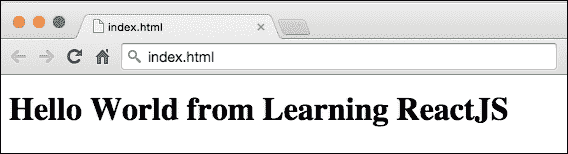
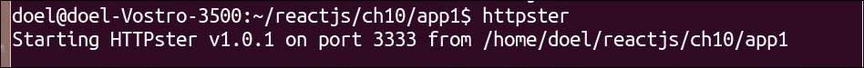

# 第一章：ReactJS 入门

在本章中，我们将探讨 ReactJS 的概述——它是什么以及这个强大且灵活的库的一些亮点。我们还将学习如何下载并在小型应用程序中使用它。本章将涵盖以下主题：

+   介绍 ReactJS

+   下载 ReactJS

+   工具

+   尝试 ReactJS

# 介绍 ReactJS

**ReactJS** 是一个由 Facebook 和 Instagram 创建的 JavaScript 库，旨在构建能够响应用户输入事件的用户界面（UI），同时创建和维护状态。状态用于维护组件的变化，这将在后续章节中详细说明。页面通过仅比较网页的更改和更新部分来加快加载速度（我们将在第四章“有状态组件和事件”中更详细地介绍虚拟 **DOM**（**文档对象模型**））。与传统的数据绑定系统相比，React 提供了一向数据流，这降低了复杂性，有助于创建可重用和封装的组件。我们还将探索 React 数据流在第七章“使你的组件可重用”中，以及如何使你的 UI 组件更具可重用性。在第七章“使你的组件可重用”中。

尽管许多开发者认为 ReactJS 只是 MVC 应用程序的 V，但它驱使你构建可重用组件，重新思考你的 UI 和最佳实践。如今，性能和可移植性对于构建用户界面至关重要，这主要归因于大量使用互联网可访问设备和项目快速的开发阶段。这可能导致前端代码复杂。使用一个有助于你的代码在性能和质量上增长的库的需求真的很重要；否则，你只会写出包含 UI 逻辑的大 HTML 文件，修改起来耗时且可能降低代码质量。ReactJS 鼓励以下最佳实践：

+   跟随一个模式

+   分离关注点

+   将 UI 分解为组件

+   组件之间的一向数据流通信

+   正确使用属性和状态

ReactJS 是一个库，它以与框架不同的方式处理 UI（视图）。假设我们正在构建一个**单页应用**（SPA），并希望处理路由系统，我们可以使用任何我们想要的处理路由的库。这适用于构建 SPA 所需的技术堆栈的每个其他部分，除了 UI 或，如一些人所说，当在 MVC/MV*架构上工作时，视图。在 ReactJS 的世界里，当你谈论视图时，实际上你是在谈论一个组件。它们之间有一点不同。React 组件持有视图的逻辑和行为。一般来说，一个组件代表视图的一个小部分，而许多这样的组件一起代表应用的整体视图。

我们将在第六章*使用 FLUX 反应*中更详细地讨论 MVC/MV*和 FLUX 架构。

### 注意

MVC 代表模型-视图-控制器，而 MV*代表模型-视图-任何东西。

构建或更改您 Web 应用的一个小部分非常简单。Facebook 就是用他们的评论界面做到了这一点。他们用 ReactJS 制作的一个新界面替换了它。有关如何在 Facebook 上使用 ReactJS 显示评论的详细代码，请参阅[`facebook.github.io/react/docs/tutorial.html`](https://facebook.github.io/react/docs/tutorial.html)。

这个由 Facebook 开发团队解释的评论界面为我们提供了实时更新和*乐观评论*，其中评论在服务器上保存之前就显示在列表中。还有一个 Facebook 开发者插件，允许用户使用他们的 Facebook 账户在您的网站上添加评论（[`developers.facebook.com/docs/plugins/comments`](https://developers.facebook.com/docs/plugins/comments)）。

我的一个经验是在 ReactJS 中构建一个调查应用，并将其放置在生产中的某个 Web 应用中。ReactJS 提供了一组生命周期事件，这有助于与其他库、插件甚至框架的集成。在第五章*组件生命周期*中，我们将讨论 React 组件的所有生命周期阶段，而在第七章*使您的组件可重用*中，我们将引入验证并使用 Mixins 来组织我们的代码。

ReactJS 将 UI 元素视为对象。在构建 React 组件时，我们将通过封装视图逻辑和视图表示来模块化代码。这是支持组件化的另一个特性，也是虚拟 DOM 能够工作的原因之一。React 代码也可以用另一种语法编写，即 JSX（ECMASCRIPT 的扩展），而不是 JavaScript。尽管使用 JSX 不是强制性的，但它易于使用，并提高了代码的可读性。我们将在 第二章 *探索 JSX* 中深入了解 JSX 并了解它是如何工作的以及为什么它是必要的。

## 谁使用 ReactJS？

ReactJS 是用于构建 Web UI 组件的兴起 JavaScript 库之一，一些大型公司已经在生产中使用它。它们如下：

+   Instagram 网站

+   Facebook 评论、页面洞察、商业管理工具、Netflix、Yahoo、Atlassian 以及大多数新的 JS 开发

+   新的 JS 开发用于 Khan Academy、PayPal、AirBnb、Discovery Digital Networks 以及更多

+   一些在 *《纽约时报》* 内的项目

# 下载 ReactJS

在我们开始编写一些 ReactJS 代码之前，我们需要下载它。你可以通过他们的网站下载 ReactJS，[`facebook.github.io/react/downloads.html`](http://facebook.github.io/react/downloads.html)。

在撰写这本书的时候，ReactJS 目前处于版本 0.14.7。提供了两种 ReactJS 脚本版本——一个是用于开发的，如果你想要调试或者甚至贡献代码，它包含了所有核心代码和注释。另一个是用于生产的，它包含了额外的性能优化。以下是脚本版本的下载链接：

+   [`fb.me/react-0.14.7.js`](http://fb.me/react-0.14.7.js)（开发版）

+   [`fb.me/react-0.14.7.min.js`](http://fb.me/react-0.14.7.min.js)（生产版）

0.13.0 版本及更高版本包含了一组巨大的增强功能。它支持 ES6 类语法，并移除了混合模式，这些内容在 第五章 *组件生命周期和 ReactJS 中的新 ECMAScript* 中有所介绍。

在 ReactJS 下载页面中，还有其他带有附加功能的 ReactJS 脚本版本。这个脚本扩展了 ReactJS 库以支持动画和过渡，并提供了一些不属于核心 React 的其他实用工具。目前我们不需要下载这个版本，因为我们不会在接下来的示例中使用这些功能。

此外，还有一个 JSX 转换器脚本的下载链接。你可以在 [`cdnjs.cloudflare.com/ajax/libs/react/0.13.3/JSXTransformer.js`](https://cdnjs.cloudflare.com/ajax/libs/react/0.13.3/JSXTransformer.js) 下载它。

它仅应在开发环境中使用，而不应在生产环境中使用。JSX 将在第二章，*探索 JSX 和 ReactJS 结构* 中更详细地介绍。

如果您正在使用工具来控制您的依赖项，例如 **Node 包管理器** (**NPM**) 或 **Bower**，您也可以通过这些工具下载 ReactJS。详细信息请参阅 [`facebook.github.io/react/downloads.html`](https://facebook.github.io/react/downloads.html)。

## 使用 NPM 安装 ReactJS

使用 `node -v` 检查您的机器上是否已安装 `node`。

否则，根据您的操作系统，从其网站 ([`nodejs.org/en/`](https://nodejs.org/en/)) 安装节点包。

我们在第八章，*测试 React 组件* 和第九章，*准备代码以进行部署* 中介绍了通过 NPM 安装包。

如果您的机器上已配置 `Node` 和 NPM，请从任何控制台工具中在您的应用程序文件夹内执行以下命令以安装 `react-tools`：

```js
npm install react-tools

```

安装完成后，您可以按以下方式引用 React 依赖项：

```js
Var React = require('react');
```

从现在开始，您可以使用 `React` 变量和其方法，例如 `React.createClass({…});`。请记住，因为您使用 NPM 安装了它，所以在测试您的应用程序之前，您需要打包您的代码或将其转换为静态资源。在 第二章，*探索 JSX* 中，我们将介绍一些您可能使用的转换工具。您可以在 第八章，*准备代码以进行部署* 中查看更多关于部署的详细信息。

## 使用 Bower 安装 ReactJS

与 NPM 不同，Bower 控制浏览器就绪的包，因此也是相同的。除了使用 NPM 包外，我们还可以使用 Bower 就绪的包 ([`facebook.github.io/react/downloads.html`](https://facebook.github.io/react/downloads.html))。Bower 通过安装和维护所需包的正确版本来帮助维护所有包 ([`bower.io/`](http://bower.io/))。

首先，请确保您已安装并配置了 Bower。之后，执行以下命令：

```js
bower install --save react

```

这将在您的 Bower 配置文件中将 ReactJS 作为依赖项保存。现在您只需在您的 HTML 代码中引用它即可。默认情况下，它位于 `./bower_components/react/react.js`。同一文件夹中还提供了压缩版本 `react.min.js`。

# 工具

社区已经开发了许多工具来提高我们的编码体验和生产力。在本节中，我们将介绍一些文本编辑器、它们的包以及一个用于提高 ReactJS 应用程序调试的浏览器扩展。

## 文本编辑器

当今大多数文本编辑器都提供了 JSX 的语法高亮以及 ReactJS 的有用片段和辅助工具。以下是我建议使用的文本编辑器：

+   Vim—[`www.vim.org/download.php`](http://www.vim.org/download.php)

+   Emacs 编辑器—[`www.gnu.org/software/emacs/`](https://www.gnu.org/software/emacs/)

+   Sublime Text—[`www.sublimetext.com/`](http://www.sublimetext.com/)

+   Atom—[`atom.io/`](https://atom.io/)

+   Brackets—[`brackets.io/`](http://brackets.io/)

**Sublime Text** 虽然在免费模式下工作，但需要付费许可证，并且会不时显示可能打扰你的弹出窗口。此外，你还需要单独安装其包管理器。你可以在 [`packagecontrol.io/`](https://packagecontrol.io/) 上找到 Sublime Text 包以及如何安装其包管理器的更多信息。一旦安装了 Sublime 编辑器，前往安装目录，你可以在终端中运行 `subl` 来从当前目录打开 Sublime，这样你就可以在 Sublime 中打开当前目录的文件。

**Atom** 是一款新推出的免费编辑器，由 GitHub 开发。它包含内置的包管理器，无需单独安装。你只需前往设置并安装 React 包。它包含语法高亮、片段等功能。我在使用 Atom 在 MacOS X Yosemite 上时遇到的问题仅是字体质量看起来比 Sublime Text 差。如果你遇到这种情况，只需在 Atom 的设置中取消选择 **使用硬件加速** 选项即可。

**Brackets** 也是免费的，并且具有许多出色的功能，例如实时预览；例如，你可以编辑你的代码文件，并在浏览器中看到应用的变化。Brackets 内置了扩展管理器，你也可以安装 ReactJS JSX 语法高亮。然而，在撰写本书时，一些高亮功能表现不佳。

所有这些文本编辑器都相当不错，功能丰富，但本书的目的不是展示它们。如果你还没有偏好的文本编辑器，请随意选择。

## Chrome 扩展

ReactJS 团队为 Google Chrome 创建了一个浏览器扩展程序。它允许你检查组件层次结构，当你需要调试应用程序时非常有帮助。你可以打开 **Chrome Web Store**，搜索 **React Developer Tools** 并安装它。你需要打开 **Chrome 开发者工具**（Windows 和 Linux 上按 *F12*，Mac 上按 ⌘-*Option-I*）来使用此扩展程序。我们将在后续章节中使用此扩展程序来理解 ReactJS 组件层次结构。为了使 React 扩展/附加组件在 Chrome/Firefox 中工作，我们需要在网页上全局提供 React 组件。

# 尝试 ReactJS

是时候编写一些代码并使用 ReactJS 创建我们的第一个应用程序了。我们将通过添加 ReactJS 脚本依赖项来在简单的网页中配置 React。然后，我们将创建一个 JavaScript 文件来保存我们的 ReactJS 组件代码，并在 HTML 元素中渲染它。

然后，我们将使用 JSX 语法重建相同的示例，并学习如何在页面中配置它。现在不用担心 JSX，因为它将在第二章 Exploring JSX and the ReactJS Anatomy 中详细介绍。

这将是一个简单的学习用途的应用程序。在接下来的章节中，我们将创建一个完整的网络应用程序，该应用程序将消费 Facebook Open Graph API，使用你的 Facebook 账户登录，渲染你的朋友列表等。所以，让我们动手吧！

## 在网页中配置 ReactJS

在下载 ReactJS 脚本依赖项后，我们需要创建一个包含简单元素的 HTML 文件，并将其命名为 `root.html`。它将负责渲染我们的 ReactJS 组件。

这就是你的 HTML 文件应该看起来像什么样子：

```js
<!DOCTYPE html>
<html>
<head>
  <script src="img/react-0.12.2.js"></script>
</head>
<body>
  <div id="root"></div>
</body>
</html>
```

它引用了 Facebook CDN 脚本，但你也可以引用我们下载的本地脚本（`fb-react-0.12.2.js`）。

如果使用本地下载的 ReactJS 文件而不是 CDN，你的 HTML 文件将看起来如下：

```js
<!DOCTYPE html>
<html>
<head>
  <script src="img/fb-react-0.12.2.js"></script>
</head>
<body>
  <div id="root"></div>
</body>
</html>
```

## 创建你的第一个 React 组件

现在创建一个名为 `hello-world.js` 的 JavaScript 文件，并在 HTML 文件中将此代码放置在 `root` div 元素之后来引用它：

```js
<div id="root"></div>
<script src="img/hello-world.js"></script>
```

我们将使用 React.createElement 来创建 React 元素。`React.createElement` 的格式是：

```js
ReactElement createElement(
  string/ReactClass type,
  [object props],
  [children ...]
)
```

将以下代码粘贴到 `hello-world.js` 中：

```js
var HelloWorld = React.createClass({
  render: function () {
    return React.createElement('h1', null, "Hello World from Learning ReactJS");
  }
});

React.render(
  React.createElement(HelloWorld, null),
  document.getElementById('root')
);

In the above code
return React.createElement('h1', null, "Hello World from Learning ReactJS");
h1 → Is the type of HTML element to be created
null → means there is no object properties presentation
Third argument → the content of the h1 tag
```

以下章节将更详细地介绍此代码的细节。

现在，在任何浏览器中打开页面，检查它是否创建了一个 `h1` HTML 元素并将文本放在其中。你应该看到如下内容：



## 配置 JSX

现在，我们将使用 JSX 语法创建相同的应用程序。首先，我们需要在 HTML 页面中配置它，通过在 `head` 元素中添加 JSX 转换器脚本文件 `JSXTransformer-0.12.2.js` 来在 ReactJS 脚本 `react-0.12.2.js` 之后：

```js
<head>
  <script src="img/react-0.12.2.js"></script>
  <script src="img/JSXTransformer-0.12.2.js"></script>
</head>
```

你还需要在 HTML 页面中将 `hello-world.js` 的类型引用更改为 `text/jsx`。它必须是这样的：

```js
<script type="text/jsx" src="img/hello-world.js"></script>
```

## 通过网络服务器提供文件

Google Chrome 不接受对类型为 `text/jsx` 的本地文件的请求，它会抛出一个跨源请求错误（通常称为 CORS 错误）。CORS 是在不同于当前域的域上共享资源。Chrome 安全默认不允许这样做；然而，你可以在 Firefox 和 Safari 上访问它。你也可以通过启动本地服务器（如 Python、Node 或任何其他你想要的网络服务器）来绕过 CORS 错误。

另一种方法是安装 node 包 `httpster`：

```js
npm install -g httpster

```

安装完成后，从 react 应用程序目录中运行`httpster`命令。应用程序将在你的浏览器中加载（默认端口`3333`）：



另一种方法是安装简单的 Python 服务器。安装它，然后在您想要提供服务的文件夹内运行其命令，然后您就可以开始了。您可以在[`www.python.org/`](https://www.python.org/)上找到如何安装 Python 的说明。安装 Python 后，您可以在项目文件夹内运行以下命令：

```js
python -m SimpleHTTPServer

```

它将输出一条消息，说明正在运行的服务端口，例如`Serving HTTP` `on 0.0.0.0 port 8000`。你现在可以导航到`http://localhost:8000/`。如果此端口已被其他应用程序使用，请考虑在相同命令中将期望的端口号作为最后一个参数传递，如下所示：

```js
python -m SimpleHTTPServer 8080

```

如果你不想使用 Python，ReactJS 提供了一个包含其他语言脚本的教程页面，用于运行简单的 Web 服务器，你应该能够测试它。你可以在[`github.com/reactjs/react-tutorial/`](https://github.com/reactjs/react-tutorial/)上查看。

## 使用 JSX 语法创建 React 组件

在配置好我们的 HTML 页面后，我们现在可以将`hello-world.js`脚本文件更改为遵循 JSX 语法。你的脚本文件应该看起来像这样：

```js
var HelloWorld = React.createClass({
  render: function () {
    return <h1>Hello World from Learning ReactJS</h1>;
  }
});

React.render(
  <HelloWorld />,
  document.getElementById('root')
);
```

它将生成与上一个`Hello World`示例相同的结果。正如你所看到的，没有必要显式调用`createElement`方法。

因此，JSX 将产生与 JavaScript 相同的输出，但不需要额外的花括号和分号。

在下一章中，第二章，你将学习 JSX 是如何工作的，以及为什么它被高度推荐。

# 摘要

在本章中，你学习了 ReactJS 是什么，下载了它，并在一个小应用程序中使用了它。我们已经创建了我们的第一个 React 组件，并回顾了此强大库的关键优势。

在下一章中，我们将深入探讨 JSX，学习如何构建一些展示此强大扩展语法的实用组件。我们还将学习一些“陷阱”和最佳实践，并了解为什么 JSX 在开发 React 组件展示时满足我们的需求。
