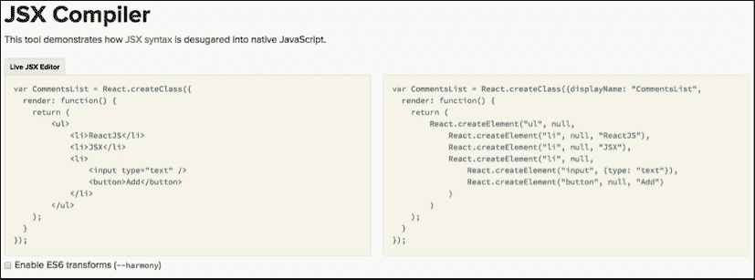

# 第二章：探索 JSX 和 ReactJS 结构

在本章中，你将探索 JSX 语法，了解它是什么以及为什么它使我们更容易理解 UI 组件。你将了解 ReactJS 的结构，并编写一些常见场景的代码，以展示这种高效的语法，以便我们可以在下一章中前进并构建一个完整的应用程序。本章将带你了解以下主题：

+   JSX 是什么？

+   ReactJS 的结构

+   JSX 的陷阱

# JSX 是什么？

**JSX** 是一种类似于 XML 的 JavaScript 语法扩展。它用于在 ReactJS 中构建 UI 组件。它与 HTML 非常相似，但有细微的差别。JSX 以一种方式扩展了 JavaScript，使得你可以用与构建 HTML 页面相同的方式轻松构建 ReactJS 组件。它通常与你的 JavaScript 代码混合使用，因为 ReactJS 以不同的方式考虑 UI。这个范式将在本章后面解释。

说你把 HTML 和 JavaScript 混在一起是错误的。如前所述，JSX 扩展了 JavaScript。实际上，你并不是在写 HTML 标签，而是在 JSX 语法中写 JavaScript 对象。当然，它必须首先转换为纯 JavaScript。

当你编写这个示例时：

```js
var HelloWorld = React.createClass({
  render: function () {
    return <h1>Hello World from Learning ReactJS</h1>;
  }
});
```

它被转换成这样：

```js
var HelloWorld = React.createClass({
  render: function () {
    return React.createElement('h1', null, "Hello World from Learning ReactJS");  }
});
```

这个转换器脚本文件检测 JSX 语法并将其转换为纯 JavaScript 语法。这些脚本和工具绝不应该放在生产环境中，因为每次请求都要转换脚本对服务器来说都是痛苦的。对于生产环境，我们应该提供转换后的文件。我们将在本章后面介绍这个过程。

如 第一章 中所述，*ReactJS 入门*，请注意以下内容：

+   `ReactElement` 是 React 的主要 API。ReactElement 有四个属性：`type`、`props`、`key` 和 `ref`。

+   ReactElement 没有自己的方法，原型上也没有定义任何内容。

+   可以通过调用 `React.createElement` 方法来创建 ReactElement 对象。

+   在前面提到的突出显示的代码中，我们可以看到 `React.createElement` 方法的第一个参数是创建一个 `h1` 元素，属性被传递为 null，而 `h1` 元素的实际内容是字符串 `Hello World from Learning ReactJS`。

+   ReactElements 被传递到 DOM 中，以在 DOM 中创建一个新的树。

+   ReactElements 被称为虚拟 DOM，并且与 DOM 元素不同。虚拟 DOM 的细节将在后面的章节中讨论。

+   根据官方 React 文档（[`facebook.github.io/react/docs/glossary.html`](https://facebook.github.io/react/docs/glossary.html)），"ReactElement 是 DOM 元素的一个轻量级、无状态、不可变、虚拟表示"。

让我们再次检查我们之前的示例，当时我们没有使用 JSX 语法：

```js
React.createElement('h1', null, "Hello World from Learning ReactJS");
```

这段代码正在创建一个`h1`元素。想想看，这就像通过 JavaScript 的`document.createElement()`函数创建一个元素，这使得代码非常易于阅读。

JSX 不是强制性的，但强烈推荐。使用 JavaScript 创建大型和复杂的组件是非常痛苦的。例如，如果我们想使用 JSX 创建嵌套元素，我们需要做以下操作：

```js
var CommentList = React.createClass({
  render: function() {
    return (
        <ul>
            <li>ReactJS</li>
            <li>JSX</li>
            <li>
                <input type="text" />
                <button>Add</button>
            </li>
        </ul>
    );
  }
});
```

然而，使用纯 JavaScript ReactJS 对象，它看起来会是这样：

```js
var CommentList = React.createClass({displayName: "CommentList",
  render: function() {
    return (
        React.createElement("ul", null, 
            React.createElement("li", null, "ReactJS"), 
            React.createElement("li", null, "JSX"), 
            React.createElement("li", null, 
                React.createElement("input", {type: "text"}), 
                React.createElement("button", null, "Add")
            )
        )
    );
  }
});
```

我们可以看到一个可能随着更复杂逻辑而增长的大而可怕的组件。这样的复杂组件难以维护和理解。

# 为什么使用 JSX？

通常，在框架中通过定义 UI 或视图来表示它们可变的数据，这通常是一个模板语言和/或显示逻辑解释器。以下是一些 jQuery 代码：

```js
<html>
  <head>
    <title>Just an example</title>
  </head>
  <body>
    <div id="my-awesome-app">
      <!-- Here go my rendered template -->
    </div>

    <script id="my-list" type="text/html">
      <ul>
        {{each items}}
          <li>
            ${name}
          </li>
        {{/each}}
      </ul>
    </script>
  </body>
</html>
```

`script`元素代表一个将在`my-awesome-app div`元素中渲染的模板组件。这里的代码是一个 JavaScript 文件，它将数据推送到模板，并要求 jQuery 完成工作并渲染 UI：

```js
$("#my-list").tmpl(serverData).appendTo("#my-my-awesome-app");
```

无论何时你想在代码上添加一些显示逻辑，你都需要依赖于 JavaScript 和 HTML 文件。换句话说，一个组件是文件的混合体——通常，一个控制视图的 JavaScript 文件，一个代表视图的模板/标记文件，以及一个从服务器获取数据并发送到视图的模型/服务。在 MVC 应用程序中，M（模型）、V（视图）和 C（控制器）的逻辑通常是分离的，以便提供关注点的分离，以及代码的更好可读性和维护性。

假设我们现在必须更改这个视图，并在用户未登录时隐藏列表。考虑到模型/服务代码已经带来了这个信息，我们将不得不更改控制视图的代码和标记代码，以应用这些更改。更改越困难，应用这些更改就越痛苦。我们的代码最终变成了大型的 JavaScript 和 HTML 文件，混合了显示逻辑、模板表达式和业务代码。

尽管你是一位经验丰富的前端开发者，但应用一些关注点的分离，并将你的 UI 拆分成更小的视图，最终你会拥有数百个文件来表示单个 UI 元素：视图控制器、HTML 模板、样式表以及你的模型。这么多文件会让一个小应用看起来很复杂，你肯定会感到混乱，不知道哪个文件是特定视图或组件的一部分。

我们想在这里展示的是，我们一直在混合标记和逻辑代码，但除此之外，我们还把它们分到了其他文件中，这使得它们更难找到和修改。

ReactJS 与 JSX 将你引向另一个方向。ReactJS 官方页面中有一个非常有趣的段落，坦率地解释了这个强大的库及其范式：

> *"我们坚信，组件是分离关注点的正确方式，而不是“模板”和“显示逻辑”。我们认为标记和生成它的代码紧密相连。此外，显示逻辑通常非常复杂，使用模板语言来表示它变得繁琐。([`facebook.github.io/react/docs/displaying-data.html#jsx-syntax`](http://facebook.github.io/react/docs/displaying-data.html#jsx-syntax))*"

我们喜欢将 ReactJS 组件视为单一的真实来源。所有其他使用您组件的位置都只是引用。您对原始组件所做的任何更改都将传播到所有引用它的其他地方。可以通过属性和子组件化轻松进行定制。JSX 就像是一个中间件，将您的标记代码转换为 ReactJS 可以处理的对象。

JSX 加速了 ReactJS 的前端开发。您不是创建代表您 UI 的字面量对象，而是创建类似于 XML 的元素，非常类似于 HTML，您甚至可以引用您创建的其他组件。此外，重用第三方组件或甚至发布您自己的组件非常简单。在企业环境中，您可能有一个常用的组件仓库，其他项目可以从该仓库导入。

## 转换 JSX 的工具

如前所述，JSX 转换器文件和其他工具负责将您的 JSX 语法转换为纯 JavaScript。ReactJS 团队和社区为此提供了一些工具。这些工具可以处理任何类型的文件，因为它们包含 JavaScript 代码和 JSX 语法。在 React 的旧版本中，需要在 `.js` 文件的第一行添加注释，例如 `/** @jsx React.DOM */`。幸运的是，在版本 0.12 之后，这一要求被移除了。

JSX 转换器现在已被弃用。相反，我们可以使用 [`babeljs.io/repl/`](https://babeljs.io/repl/) 将 JSX 语法编译成 JavaScript。要在脚本标签中包含 JSX，可以使用 `<script type="text/jsx">` 或在转换时使用 `babel`

```js
<script type="text/babel">.
```

以前有一个在线工具 [`facebook.github.io/react/jsx-compiler.html`](http://facebook.github.io/react/jsx-compiler.html)。然而，React 开发团队已经停止了它，JSX 转换器也已弃用。

由于这种 JSX 转换将在客户端进行大量的计算，因此我们**不应该**在生产环境中进行这些转换。相反，我们应该使用：

```js
npm install -g bab
el-cli

```



我们还可以使用 ReactJS 团队构建的 node `npm` 包来转换您的 JSX 文件。首先，您需要使用以下命令安装 `react-tools` NPM 包：

```js
npm install react-tools –g

```

这将全局安装 `react-tools`。现在您只需要从您的项目文件夹中运行以下命令：

```js
jsx --watch src/ build/

```

此命令将`src`文件夹中的每个脚本转换，并将其放入`build`文件夹。`watch`参数使得每次`src`文件夹中的文件发生变化时，此工具都会运行相同的命令。这是一个非常有用的工具，因为您正在使用 node 来打包您的前端代码。

如果您熟悉 Grunt 或 Gulp 等任务运行器工具，它们也有 JSX 转换器包，可以使用`npm`安装。在这种情况下，它们提供了更多选项，可以更好地适应我们的部署/构建过程，尤其是如果您已经使用其中之一。本书的目的不是深入探讨 Grunt 或 Gulp。为了配置和安装它们，您可以遵循以下链接中的指南：这些细节将在第九章，*准备代码以部署*中介绍。

+   Grunt – [`www.gruntjs.com`](https://www.gruntjs.com)

+   Gulp – [`www.gulpjs.com`](https://www.gulpjs.com)

这两个网站都有一个[/plugins](http:///plugins)页面，您可以在其中搜索可用的插件。以下是一些下载工具的链接：

+   Grunt React 任务—[`www.npmjs.com/package/grunt-react`](https://www.npmjs.com/package/grunt-react)

+   Gulp React 任务—[`www.npmjs.com/package/gulp-react/`](https://www.npmjs.com/package/gulp-react/)

它们的工作方式与 React 工具非常相似。在接下来的示例中，我们将使用放置在我们 HTML 页面`head`元素中的`transformer`脚本文件，因为这更容易操作。在第九章，*准备代码以部署*中，我们将使用`webpack`和`gulp`作为`npm`包来转换我们的 JSX 代码，并为其部署做准备。

# ReactJS 的解剖结构

在进一步探讨 JSX 之前，我们需要了解一些基本规则来构建 ReactJS 组件。首先，我们将详细介绍您已经用来创建和渲染组件的基本方法。然后，我们将转向创建它们的规则，最后，我们将讨论子组件。

## 创建一个组件

为了创建一个组件，我们需要使用`React.createClass`函数。ReactJS 组件基本上是类。此方法返回一个具有名为`render`的方法的 ReactJS 组件定义，这是必须实现的。本书将介绍许多其他方法来配置您的组件并改变其行为。

这是一个如何使用`createClass`和`render`方法的示例：

```js
var HelloMessage = React.createClass({
  render: function() {
    return (
      <h1>Have a good day!</h1>
    );
  }
});
```

### 注意

将所有类和组件命名为 PascalCase 是一个好的做法。除了在 JavaScript 中是一个常见的模式外，它还有助于将它们与其他变量区分开来。

## 渲染一个组件

一旦你有了组件定义，就像我们在最后一个例子中看到的`HelloMessage`组件，我们就可以使用`ReactJS`的`render`方法来渲染它。它需要组件定义和目标位置，即组件将被渲染的位置。让我们用以下示例来演示这一点：

```js
React.render(<HelloMessage />, document.body);
```

在前面提到的代码中，你可以用你页面上的任何其他元素替换`document.body`。例如，你可以使用`document`对象的方法`document.getElementById('id')`通过 ID 找到元素，或者使用任何其他返回 DOM 元素的辅助方法。在特定的 DOM ID（在这种情况下是`id`），React 组件将被渲染。

## 根的最大数量

在`render`方法中返回超过一个元素是不可能的。至少现在还不行，正如官方 ReactJS 文档[`facebook.github.io/react/tips/maximum-number-of-jsx-root-nodes.html`](http://facebook.github.io/react/tips/maximum-number-of-jsx-root-nodes.html)中所说：

```js
var HelloMessage = React.createClass({
  render: function() {
    return (
      <h1>Have a good day!</h1>
      <h2>This is going to BREAK!</h2>

    );
  }
});
```

ReactJS 库将抛出一个奇怪的错误，这个错误并没有清楚地指出你正在渲染多个元素。因此，请注意不要这样做；否则，你可能会陷入寻找问题的困境。

当一个 ReactJS 组件代表多个元素时，你必须将它们包裹在一个单一父元素中。下一个示例将演示这一点：

```js
var HelloMessage = React.createClass({
  render: function() {
    return (
      <div>
        <h1>Have a good day!</h1>
        <h2>This is NOT going to BREAK!</h2>
      </div>
    );
  }
});
```

你可以使用任何支持子元素的有效的 HTML 元素。也可以渲染一个具有子支持的自定义 ReactJS 组件（更多内容将在下一节中介绍）。

这就是选择一个好的文本编辑器和好的 lint/lint 包的原因之一，它可以监视你的代码，并在你犯错时提醒你。

## 子组件

当你谈论创建可重用用户界面时，如果真的有必要的因素，那一定与组件嵌套有关。这样你可以更好地组织并分离你应用程序的各个部分。在 Web 世界中，这也是一个相当常见的事情，因为 HTML 内置了这一功能。正如你在本书的上一节和前面的示例中看到的那样，ReactJS 也支持这一功能，JSX 语法使得它非常直接。

假设你有一个`Header`组件，并且你想要在其中放置其他组件。ReactJS 允许这样做，并且包括对放置其他 ReactJS 组件的支持：

```js
var Header = React.createClass({
  render: function () {
    return (
      <nav>
        <h1>This is my awesome app</h1>
        {this.props.children}
      </nav>
    );
  }
});

var Clock = React.createClass({
  render: function () {
    return <span>{new Date().toLocaleTimeString()}</span>;
  }
});

var ComponentThatHasHeader = React.createClass({
  render: function () {
    return(
      <Header>
        <h2>This is my another component</h2>
        <Clock />
      </Header>
    );
  }
});

React.render(<ComponentThatHasHeader />, document.body);
```

你可以使用内置组件，如`h2`，或者自定义组件，如这里描述的`Clock`组件。在这个例子中，表达式`{this.props.children}`将被视为一个 JavaScript 数组。如果有单个组件，就像后面提到的那个，它将被视为一个 JavaScript 对象而不是数组。这节省了数组分配，但我们应该小心，不要尝试迭代它或检查它的长度：

```js
<Header>
  <Clock />
</Header>
```

## 支持的属性

一些 HTML 属性与 JavaScript 保留字冲突，由于 ReactJS 元素基本上是 JavaScript 对象，因此这些属性在 ReactJS 中具有不同的名称，以匹配 DOM API 规范：

+   类是`className`

+   `for`是`htmlFor`

+   支持自定义属性，如`data-*`和`aria-*`，ReactJS。有一个官方支持的 HTML 属性列表，如下所示：

    | `accept` `acceptCharset` `accessKey` `action` `allowFullScreen` `allowTransparency` `alt` `async` `autoComplete` `autoPlay` `cellPadding` `cellSpacing` `charSet` `checked` `classID` `className` `cols` `colSpan` `content` `contentEditable` `contextMenu` `controls` `coords` `crossOrigin` `data` `dateTime` `defer` `dir` `disabled` `download` `draggable` `encType` `form` `formAction` `formEncType` `formMethod` `formNoValidate` `formTarget` `frameBorder` `height` |
    | --- |
    | `hidden` `href` `hrefLang` `htmlFor` `httpEquiv` `icon` `id` `label` `lang` `list` `loop` `manifest` `marginHeight` `marginWidth` `max` `maxLength` `media` `mediaGroup` `method` `min` `multiple` `muted` `name` `noValidate` `open` `pattern` `placeholder` `poster` `preload` `radioGroup` `readOnly` `rel` `required` `role` `rows` `rowSpan` `sandbox` `scope` `scrolling` `seamless` `selected` `shape` `size` `sizes` `span` `spellCheck` `src` `srcDoc` `srcSet` `start` `step` `style` `tabIndex` `target` `title` `type` `useMap` `value` `width` `wmode` |

在撰写本书时，此信息可在[`facebook.github.io/react/docs/tags-and-attributes.html`](http://facebook.github.io/react/docs/tags-and-attributes.html)找到。

## 支持的元素

官方的 ReactJS 网站还提供了一个支持的元素列表。ReactJS 支持大多数 HTML 元素。所有支持的元素的综合列表可以在其网站上找到，[`facebook.github.io/react/docs/tags-and-attributes.html`](https://facebook.github.io/react/docs/tags-and-attributes.html)。

### HTML 元素

以下是一些支持的元素。还有更多元素在列表中：

| `a` | `abbr` | `address` | `area` |
| --- | --- | --- | --- |
| `article` | `aside` | `audio` | `b` |
| `base` | `bdi` | `bdo` | `big` |
| `blockquote` | `body` | `br` | `button` |
| `canvas` | `caption` | `cite` | `code` |
| `col` | `colgroup` | `data` | `datalist` |
| `dd` | `del` | `details` | `dfn` |
| `dialog` | `div` | `dl` | `dt` |
| `em` | `embed` | `footer` | `fieldset` |
| `figcaption` | `figure` | `form` | `h4` |
| `h1` | `h2` | `h3` | `h5` |
| `h6` | `head` | `header` | `hr` |
| `html` | `i` | `iframe` | `img` |
| `input` | `ins` | `kbd` | `keygen` |
| `label` | `legend` | `li` | `link` |
| `main` | `map` | `mark` | `menu` |
| `menuitem` | `meta` | `meter` | `nav` |
| `noscript` | `object` | `ol` | `optgroup` |
| `option` | `output` | `p` | `param` |
| `picture` | `pre` | `progress` | `q` |
| `rp` | `rt` | `ruby` | `s` |
| `samp` | `script` | `section` | `select` |
| `small` | `source` | `span` | `strong` |
| `style` | `sub` | `summary` | `sup` |
| `table` | `tbody` | `td` | `textarea` |
| `tfoot` | `thead` | `time` | `tr` |
| `track` | `u` | `ul` | `video` |
| `wbr` |   |   |   |

### SVG 元素

以下是一些支持的 SVG 元素：

| `circle` `defs` `ellipse` `g` `line` `linearGradient` `mask` `path` `pattern` `polygon` `polyline` `radialGradient` `rect` `stop` `svg` `text` `tspan` |
| --- |

# 学习 JSX 和注意事项

现在是时候掌握 JSX 并学习一些注意事项了。你将学习一些基本概念，使用 JSX 构建 ReactJS UI 组件。这包括编写表达式、条件和创建组件列表的实践。它还将向您介绍 JSX 在某些方面如何与 HTML（因为它不是 HTML）不同。

## 表达式

考虑以下代码：

```js
var Clock = React.createClass({
  render: function () {
    var today = new Date();
    return <h1>The time is { today.toLocaleTimeString() }</h1>;
  }
});

React.render(<Clock />, document.body);
```

JSX 在你想在演示代码中嵌入 JavaScript 代码时理解花括号`{}`。

在下一个示例中，让我们通过支持根据时间不同的问候语来改进我们的`Clock`组件。

在后面提到的突出显示的代码中，如果当前小时数小于`4`，则应返回`day`，如果小时数大于`4`但小于`18`，则应返回`night`：

```js
var GreetingsClock = React.createClass({
  render: function () {
    var today = new Date();
 return <h1>Hey! Have a good { today.getHours() > 4 && today.getHours() < 18 ? 'day' : 'night' }!</h1>;
  }
});

React.render(<GreetingsClock />, document.body);
```

如您所见，在花括号内可以创建三元表达式。您可以在其中放置任何有效的 JavaScript 代码。在渲染组件之前创建一个变量并将其分配给此表达式的结果更为常见。这使得您的代码更干净、更易于阅读。

在下一个示例中，我们将演示如何根据条件渲染组件。有两个组件，一个用于登录，另一个用于用户详情。这取决于用户是否已登录；如果用户已登录，则显示用户详情组件；否则，将渲染登录组件。检测用户是否登录的代码将被跳过，因为这只是为了演示如何使用 JSX 语法在 ReactJS 组件中放置渲染逻辑：

```js
var loginPane;
if (IsUserLoggedIn) {
  loginPane = <UserDetails />
} else {
  loginPane = <LoginButton />
}

React.render(loginPane, document.getElementById('login-div'));
```

您可以将此代码放入一个包含所有其他组件作为子组件的组件中，如下一个示例所示：

```js
var App = React.createClass({
  render: function () {
    var loginPane;
    if (isUserLoggedIn) {
      loginPane = <UserDetails />
    } else {
      loginPane = <LoginButton />
    }

    return (
      <nav>
        <Home />
        {loginPane}
      </nav>
    )
  }
});

React.render(<App />, document.body);
```

## 属性/属性

属性允许您自定义组件，JSX 以与 HTML 元素非常相似的方式支持它们。您可以将属性传递给 ReactJS 元素，并在渲染组件之前获取它们。这是 ReactJS 的一个非常关键的基本概念，你将学习如何使用 JSX 与它们一起工作。在下一章中，我们将深入了解属性的工作原理，并讨论如何使用它们的良好实践。

考虑以下示例：

```js
var HelloMessage = React.createClass({
  render: function() {
    return (
        <h1>Have a good day {this.props.name}</h1>
    );
  }
});
```

为了渲染此组件，您必须向其传递属性，就像我们在 HTML 元素中所做的那样：

```js
React.render(<HelloMessage name="reader" />, document.body);
```

您也可以在属性中使用表达式：

```js
React.render(<HelloMessage name={1 + 1} />, document.body);
```

如果我们没有设置组件所需的属性（名称），在我们的上一个示例中，它将被渲染为空字符串。因此，如果有表达式试图访问该属性，那么它将抛出错误。

### 转移属性

在 ReactJS 中，在整个组件层次结构中传递属性是一个非常常见的做法。你可以把属性看作是一种使你的组件动态化的方式，因为你将组件拆分成更小的部分，你需要一种高效的方法来传递传入的配置和数据。

考虑以下嵌套组件：

```js
var UserInfo = React.createClass({
  render: function () {
    return (
      <section id="user-section">
        <h2>{this.props.firstName} {this.props.lastName}</h2>
        <h3>{this.props.cityName} / {this.props.stateName}</h3>
      </section>
    );
  }
});

var App = React.createClass({
  render: function () {
    return (
      <div>
        <h1>My Awesome app!</h1>
        <UserInfo firstName={this.props.firstName}
                  lastName={this.props.lastName}
                  cityName={this.props.cityName}
                  stateName={this.props.stateName} />
      </div>
    );
  }
});

React.render(<App firstName="Learning" 
                  lastName="ReactJS" 
                  cityName="Florianopolis" 
                  stateName="Santa Catarina" />, document.body);
```

如我们所见，向子组件传递属性是可能的。如果你有很多属性需要传递，那么这变成了一项繁琐的任务，你的代码也会变得非常混乱。

幸运的是，你可以使用 JSX 提供的优雅方式来传递它们。你所要做的就是更改你的 `App` 组件，使其能够传递通过 `React.render` 函数接收到的所有属性。这是通过 JSX 理解的展开运算符 `{...this.props}` 表达式来实现的。以下是一个解释这个的例子：

```js
var App = React.createClass({
  render: function () {
    return (
      <div>
        <h1>My Awesome app!</h1>
        <UserInfo {...this.props} />
      </div>
    );
  }
});
```

清晰多了！然而，这个解决方案仍然存在一个问题。它可以覆盖子组件上的属性。让我们再举一个例子，假设你有一个名为 `name` 的属性，并且你想传递它。一些元素，基本上是 HTML 输入元素，有这个属性来定义它们在表单中的名称。如果你改变它，可能会导致意外的后果。另一个例子是输入复选框或单选按钮。两者都有一个名为 `checked` 的属性，它定义了控件是否会被视觉上选中。如果你传递一个名为 `checked` 的属性，它肯定会引起不良行为。为了避免这种情况，你可以使用相同的表示法跳过一些属性。你只需要指定它们为：

```js
var App = React.createClass({
  render: function () {
    var {name} = this.props;

    return (
      <div>
        <h1>My Awesome app! {name}</h1>

      </div>
    );
  }
});
```

在三个点 `...` 之前的所有内容都将被视为独立的变量，而在三个点之后的内容，`...`，将被分配到一个包含所有剩余属性的数组中。这是一个实验性的 ES6（ECMA Script）语法，有一些方法可以将这段代码转换为普通的 JavaScript。ES6 的详细信息将在第五章 *组件生命周期和 React 中的新 ECMAScript* 中介绍。

通过查看 [`www.npmjs.com/package/react-tools`](https://www.npmjs.com/package/react-tools)，你可以找到你可以通过 JSX 转换器传递的不同选项的详细信息。

`--harmony`：开启 JS 转换，如 ES6 类等。

因此，ES6 语法将被转换为 ES5 兼容的语法。

第一种方法是在你的 HTML `script` 元素上添加一个名为 `harmony` 的额外参数，这样转换器就会知道它需要理解 ECMAScript 的新版本才能进行转换。这是你的脚本标签应该看起来像的样子：

```js
<script type="text/jsx;harmony=true" src="img/properties.js"></script>
```

### 注意

ES6（也称为 Harmony）是 ECMAScript 的一个版本（实际上是 ES5），它是一种标准化的脚本语言。这个标准的最知名实现是 JavaScript 语言，但还有许多其他语言。

您还可以使用`react-tools`节点包。它暴露了一个名为`jsx`的命令，可以离线转换您的文件。为了使用它，您需要从应用程序文件夹中的任何控制台工具运行此命令：

```js
jsx -x jsx --harmony . .

```

`-x`选项允许您指定要搜索的语法。在我们的示例中，我们正在创建`.jsx`文件，但您也可以使用包含 JSX 代码的`.js`文件来完成此操作。`--harmony`选项与上一个示例相同。它告诉转换器理解 JavaScript 语言的 ES6/ES7 特性。

您可以在本章前面讨论的*转换 JSX 的工具*部分中找到如何安装`react-tools`的说明。

使用`.jsx`文件的原因是它使文本编辑器能够匹配已安装的语法高亮，而无需进行配置。

### 修改属性

一旦您的 React 组件被渲染，不建议修改其属性。这被认为是一种反模式。属性是不可变的，它们大致代表了渲染后的表示。考虑以下代码：

```js
var HelloMessage = React.createClass({
  render: function () {
    return <h1>Hello {this.props.name}</h1>;
  }
});

var component = <HelloMessage />;
component.props.name = 'Testing';

React.render(component, document.body);
```

虽然这项工作有很大可能产生意外结果。在 ReactJS 组件中，组件的状态是唯一修改数据的方式。接下来的两章将涵盖 props 和状态的详细信息以及它们何时何地应该被使用。状态和属性都是 ReactJS 核心工作方式的关键。

## 注释

JSX 允许您在代码中放置注释；它们的语法取决于您是将它们放置在嵌套组件内部还是外部。请参考以下示例：

```js
var Header = React.createClass({
  render: function () {
    return (
      //this is the nav
      <nav>
        {/* this is the nav */}
        <h1>This is my awesome app</h1>
        {this.props.children}
      </nav>
    );
  }
});
```

在嵌套组件内部时，您只需将注释用大括号（如表达式）括起来。

## 组件样式

您可以使用`className`或`style`属性来设置组件样式。`className`属性与 HTML 类的作用方式相同，而`style`属性则将内联样式应用于组件，这与 HTML 类似。您可以选择您更喜欢的其中一个；在 ReactJS 中，它们都有简单的方式来处理，尤其是在您需要它们动态时。

### 样式

每当您想为组件应用样式时，您可以使用一个 JavaScript 对象来实现。此对象的属性必须与 DOM 样式规范匹配，例如`height`、`width`等。请参见以下示例：

```js
var StyledComponent = React.createClass({
  render: function () {
    return (
      <div style={{height: 50, width: 50, backgroundColor: 'red'}}>
        I have style!
      </div>
    );
  }
});

React.render(<StyledComponent />, document.body);
```

这将渲染一个带有文本的红色小正方形`div`。您可以将此样式对象移动到变量中，并根据组件属性或状态动态设置它。属性和状态将在第三章、*将 UI 拆分为组件*和第四章、*有状态组件和事件*中详细讨论。为了演示目的，这是将此样式对象从组件标记中移出的方法：

```js
render: function () {
  var style = { height: 50, width: 50, backgroundColor: 'red' };

  return (
    <div style={style}>
      I have style!
    </div>
  );
}
```

当你的样式名称由破折号 `-` 分隔时，你需要将它们写成驼峰式，就像你可以在我们之前示例中的 `backgroundColor` 样式属性中看到的那样。除了 `ms` 之外的其他供应商前缀应该以大写字母开头；例如，`WebkitTransition` 将被转换为 `webkit-transition`，而 `msTransition` 将被转换为 `ms-transition`。所有其他供应商名称都必须以大写字母开头。

### CSS 类

为了向你的组件添加 CSS 类，你需要为它们指定 `className` 属性：`<component className="class1 class2" />`。不幸的是，`className` 不支持像 `style` 那样的对象字面量。如果我们想动态地改变它们，我们需要连接字符串或使用来自 [`github.com/JedWatson/classnames`](https://github.com/JedWatson/classnames) 的类名。考虑以下示例：

```js
var ClassedComponent = React.createClass({
  render: function ()   {
    var className = 'initial-class';
    if (this.props.isUrgent) {
      className += ' urgent';
    }

    return (
      <div className={className}>
        I have class!
      </div>
    );
  }
});

React.render(<ClassedComponent isUrgent={true} />, document.body);
```

在这个例子中，我们正在连接字符串，但这是一项非常繁琐的任务，可能会导致错误和错误。ReactJS 插件提供了一个类操作实用工具。如果我们使用 ReactJS 库脚本文件，我们应该获取带有插件内嵌的那个，如第一章中提到的下载 ReactJS 部分*ReactJS 入门*：

```js
<script src="img/react-with-addons-0.12.2.js"></script>
```

如果你使用 node 或其他 CommonJS/AMD 包来要求 ReactJS 依赖项，你可以通过 `require('react/addons')` 来引用插件，而不是仅仅要求 React。

现在，让我们检查我们的代码使用这个实用工具代码是如何工作的：

```js
var Button = React.createClass({
  // ...
  render () {
    var btnClass = 'btn';
    if (this.state.isPressed) btnClass += ' btn-pressed';
    else if (this.state.isHovered) btnClass += ' btn-over';
    return <button className={btnClass}>{this.props.label}</button>;
  }
});
```

尝试更改 `isUrgent` 属性，并查看当你重新加载页面时类属性是如何改变的。

# 摘要

在本章中，你学习了 JSX 是什么，它的语法，以及为什么它是必要的。我们查看了一些示例，并了解了如何使用 JSX 构建。我们涵盖了 ReactJS 的非常基本的原则，以及 JSX 如何帮助你更快、更容易阅读和合理地构建组件。

在下一章中，我们将深入探讨 ReactJS 属性以及如何将 UI 分解成更小的组件。你将通过创建一个小型应用程序来学习，该应用程序将消耗 Facebook Open Graph API 并列出你喜欢的页面。
