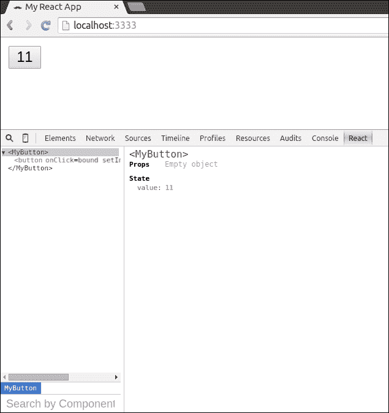
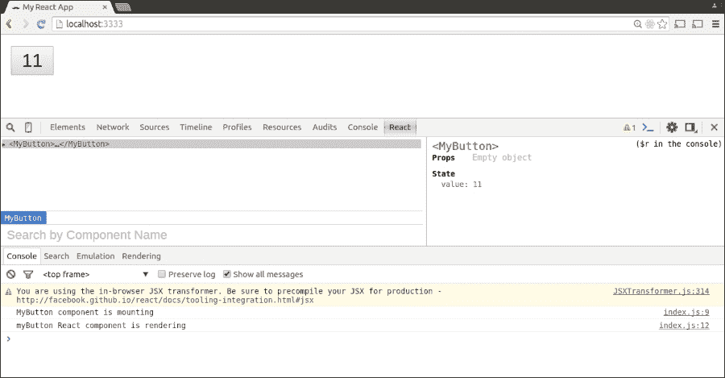
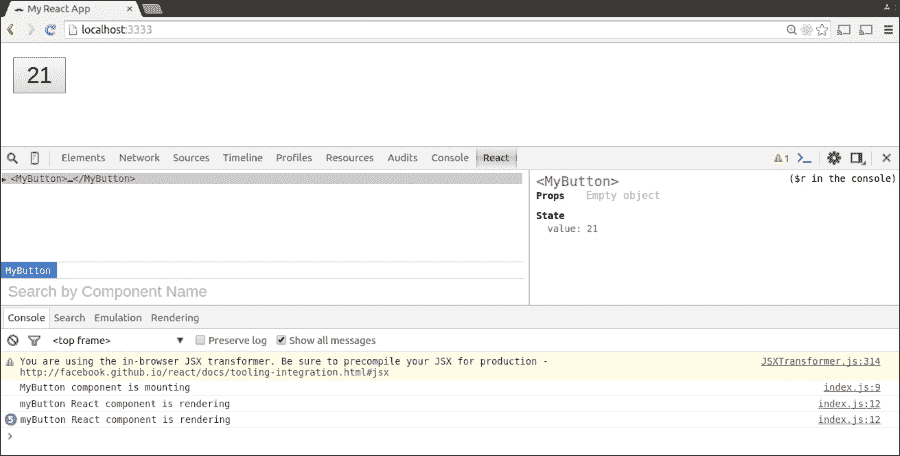
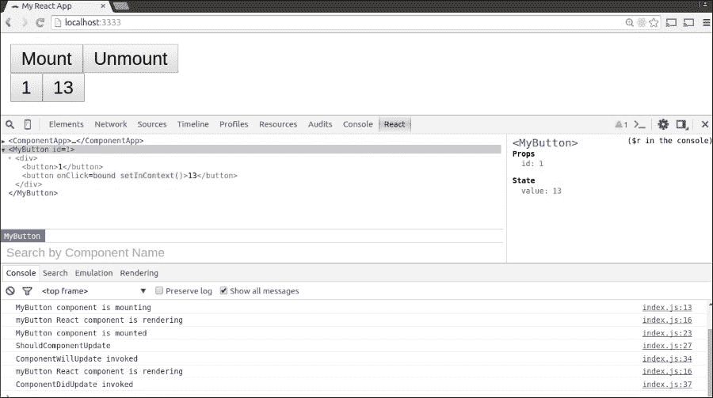
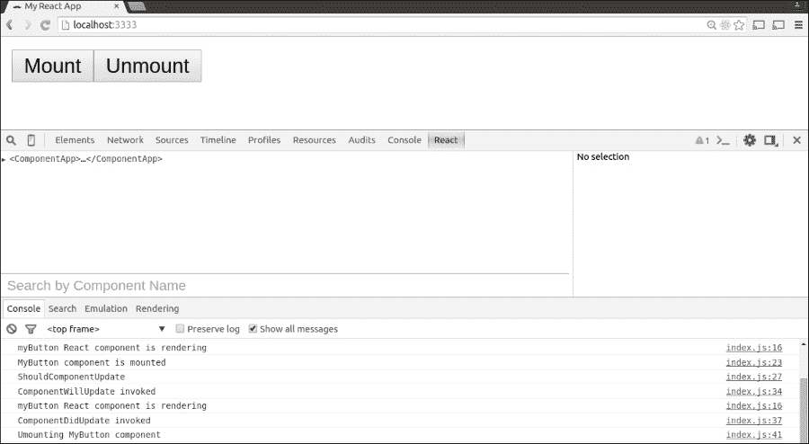
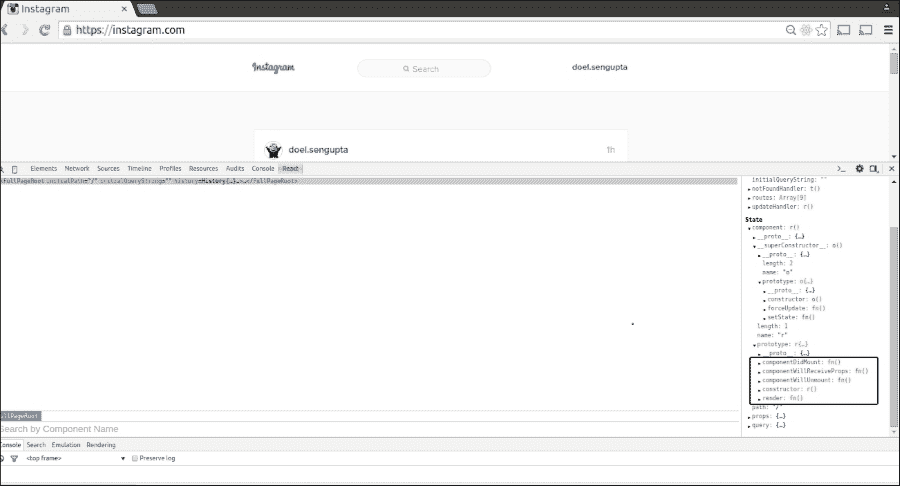
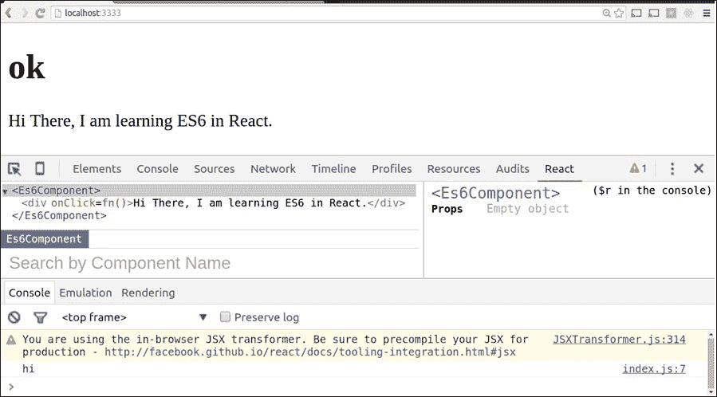
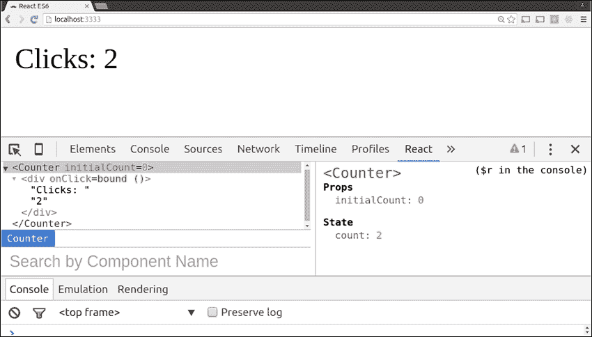
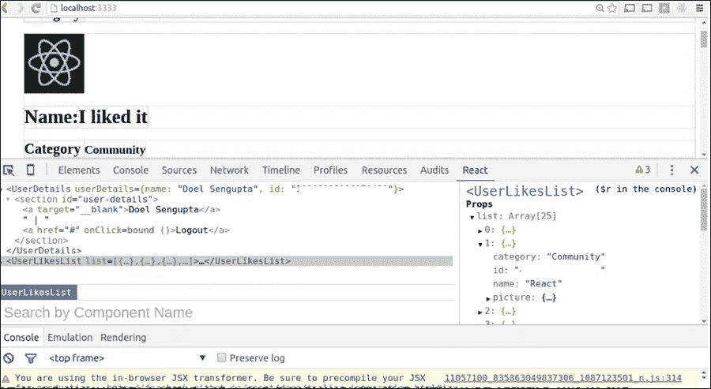

# 第五章：组件生命周期和 React 中的新 ECMAScript

到目前为止，我们已经探讨了 React 组件属性以及我们需要如何初始化、更新和更改组件的状态（s）以实现交互式应用程序。现在让我们在本章中探索此类 React 组件的生命周期。我们还将深入研究未来的 ECMAScript 语法以及 React 社区从 0.13.0 版本开始使用的一些更改。为此，我们将回顾 React 库中的一些 ES6 和 ES7 功能。

当通过调用 `React.createClass()` 创建任何 React 组件时，我们始终需要有一个渲染方法。此渲染方法返回 DOM 的描述。React 在我们的应用程序中具有性能优势，因为 React 维护一个快速的内存表示形式的 DOM，并且从不直接与实际的 DOM 交互。因此，当渲染方法返回 DOM 的描述时，React 可以比较实际 DOM 和内存表示之间的差异，并根据差异重新渲染视图。

在本章中，我们将涵盖以下主题：

+   React 组件生命周期

+   在 ECMAScript 中使用 React

# React 组件生命周期

根据 Facebook 的 React 文档 [`facebook.github.io/react/docs/working-with-the-browser.html`](http://facebook.github.io/react/docs/working-with-the-browser.html)，React 组件生命周期可以大致分为以下三个类别：

> *"**挂载**：组件正在被插入到 DOM 中。*"
> 
> **更新**：组件正在重新渲染以确定是否应该更新 DOM。*
> 
> **卸载**：组件正在从 DOM 中移除。**"***"

React 提供了生命周期方法，您可以在其中指定以挂钩到这个过程。我们提供了 `will` 方法，这些方法在某个事件发生之前被调用，以及 `did` 方法，这些方法在某个事件发生后被调用。

## 挂载类别

**挂载** 是将组件的虚拟表示发布到最终 UI 表示（例如，DOM 或原生组件）的过程。在浏览器中，这意味着将 React 元素发布到 DOM 树中的实际 DOM 元素。

| 方法名称 | 方法功能 |
| --- | --- |
| `getInitialState()` | 此方法在组件挂载之前被调用。对于有状态组件，此方法返回初始状态数据。 |
| `componentWillMount()` | 此方法在 React 将组件挂载到 DOM 之前被调用。 |
| `componentDidMount()` | 此方法在组件挂载后立即调用。DOM 节点所需的初始化过程应在此方法中进行。 |

与前几章一样，`index.html` 中的大部分代码都是相同的。我们只需替换 JavaScript 文件的全部内容。

`index.html` 的代码将变为以下内容：

```js
<!DOCTYPE html>
<html>
<head>
<script src="img/react.min.js"></script>
<script src="img/JSXTransformer.js"></script>
  <script src="img/react-dom.js"></script>
  <meta charset="utf-8">
  <title>My React App</title>
</head>
<body>
  <div id="app"></div>
    <script type="text/jsx", src="img/index.js"></script>
</body>
</html>
```

```js
index.js file:
```

```js
var MyButton = React.createClass({
        getInitialState: function(){
            return {value: 11} 
        },
        addOnClick: function(){
            this.setState({value: this.state.value +  2}); 
        },
        render: function(){
            console.log("myButton React component is rendering"); 
        return <button onClick={this.addOnClick}>{this.state.value}</button> 
        } 
}); 
ReactDOM.render(<MyButton />, document.getElementById('myComponent'));
```

初始时，我们可以看到 `myButton` 的值设置为 **11**：



当`onClick(addOnClick)`事件发生时，`myButton`的值增加两个。因此，状态的值发生了变化。


当`onClick`事件发生时，`myButton`的值增加两个

如果我们将`componentWillMount`方法添加到前面的代码中，我们将能够看到 React 组件在 DOM 中只挂载一次，但每次我们点击按钮时都会进行渲染。

```js
 componentWillMount: function(){
 console.log('MyButton component is mounting');
 },

```

在控制台中显示的应用组件挂载到 DOM 的截图，**MyButton 组件正在挂载**。



应用组件挂载到 DOM 的截图

让我们实现最后一个挂载方法，`componentDidMount`，它在组件挂载后被调用。正如您在下一张截图中所见，控制台显示组件已挂载一次，但组件被渲染的次数与我们点击按钮的次数相同：`11 + (2*4) =19`。

```js
 componentDidMount: function(){
 console.log('MyButton component is mounted');
 },

```

该截图显示挂载和挂载到 DOM 只调用一次的方法，尽管发生了渲染。因此，在`componentDidMount`方法执行后，在控制台中我们可以看到输出**MyButton 组件已挂载**。



方法的截图显示挂载和挂载到 DOM 只调用一次，尽管发生了渲染

## 更新类别

React 组件的生命周期允许在运行时更新组件。这可以通过以下方法完成：

| 方法名称 | 方法功能 |
| --- | --- |
| `componentWillReceiveProps(object nextProps)` | 当挂载的 React 组件接收到新属性（props）时，此方法会被调用。这意味着您可以使用它来比较`this.props`，当前属性集，和`nextProps`，新的属性值。没有类似`componentWillReceiveState`的方法。因此，传入的属性转换可能会引起状态变化，但传入的状态可能不会引起属性变化。如果我们想对状态变化执行某些操作，我们需要使用`componentWillUpdate`方法。因此，组件的属性变化将在更新的视图中渲染，而无需重新渲染视图。 |
| `shouldComponentUpdate(object nextProps, object nextState)` | 当组件需要在 DOM 中更新时，此方法会被调用。返回类型是布尔值（`true`/`false`）。如果没有 props 和/或状态的变化，它将返回`false`，这将阻止`componentWillUpdate`和`componentDidUpdate`被调用。 |
| `componentWillUpdate(object nextProps, object nextState)` | 如其名所示，此方法在更新发生之前立即被调用，但不在第一次渲染调用中。在此生命周期方法中不能调用`this.setState()`。要响应属性变化更新状态，请使用`componentWillReceiveProps`代替。 |
| `componentDidUpdate(object prevProps, object prevState)` | 这是在 DOM 更新后立即调用的，而不是在初始 `render()` 调用期间。 |

让我们在代码中添加前面的方法：

```js
//Updating lifecycle methods 
 shouldComponentUpdate: function() {
        console.log('ShouldComponentUpdate');
            return true;
          },
 componentWillReceiveProps: function(nextProps) {
            console.log('ComponentWillRecieveProps invoked');
         },
 componentWillUpdate: function() {
            console.log('ComponentWillUpdate invoked');
        },
 componentDidUpdate: function() {
            console.log('ComponentDidUpdate invoked');
        },
```

执行前面的代码以查看以下输出。我们可以看到 React 组件的各种生命周期事件以及它们在控制台输出的对应内容。



组件更新的截图

## 卸载分类

在组件卸载和销毁之前立即调用 `componentWillUnmount()`。你应该在这里执行任何必要的清理工作。

```js
        componentWillUnmount: function(){
 console.log('Umounting MyButton component');
 }

```

下面是一个包含 React 组件所有生命周期方法的完整示例。`index.html` 与前面相同。

`index.html` 的代码：

```js
<!DOCTYPE html>
<html>
<head>
<script src="img/react.min.js"></script>
<script src="img/JSXTransformer.js"></script>
  <script src="img/react-dom.js"></script>
  <meta charset="utf-8">
  <title>My React App</title>
</head>
<body>
  <div id="app"></div>
    <script type="text/jsx", src="img/index.js"></script>
</body>
</html>
```

下面是相应的 `index.js` 代码：

```js
var MyButton = React.createClass({
    getDefaultProps: function() {
        console.log('GetDefaultProps is invoked');
        return {id: 1};
    },
    getInitialState: function(){
        return {value: 11}
    },
    addOnClick: function(){
        this.setState({value: this.state.value +  2});
    },
    componentWillMount: function(){
        console.log('MyButton component is mounting');
    },
    render: function(){
        console.log("myButton React component is rendering");
        return ( <div>
        <button>{this.props.id}</button>
        <button onClick={this.addOnClick}>{this.state.value}</button>
        </div>);
        },
        componentDidMount: function(){
        console.log('MyButton component is mounted');
        },

//Updating lifecycle methods
    shouldComponentUpdate: function() {
        console.log('ShouldComponentUpdate');
        return true;
    },
    componentWillReceiveProps: function(nextProps) {
        console.log('ComponentWillRecieveProps invoked');
    },  
    componentWillUpdate: function() {
        console.log('ComponentWillUpdate invoked');
    },  
    componentDidUpdate: function() {
        console.log('ComponentDidUpdate invoked');
    },

//Unmounting Lifecycle Methods
    componentWillUnmount: function(){
        console.log('Umounting MyButton component');
    }

});

var ComponentApp = React.createClass({
    mount: function(){
        ReactDOM.render(<MyButton />, document.getElementById('myApp'));
    },
    unmount: function(){
          ReactDOM.unmountComponentAtNode(document.getElementById('myApp'));
        },
    render: function(){
        return (
        <div>
        <button onClick={this.mount}>Mount</button>
        <button onClick={this.unmount}>Unmount</button>
        <div id="myApp"></div>
        </div>
        );
    }
});

ReactDOM.render(<ComponentApp />, document.getElementById('app'));
```

注意以下内容：

+   执行上述代码后，我们将能够看到两个按钮，分别是 **挂载** 和 **卸载**

+   组件的初始值设置为 **11**

+   React 组件上的 `onClick`；其值增加两个

+   当点击 **挂载** 时，React 组件的生命周期方法被调用

+   对于这些生命周期方法中的每一个，我们都可以在控制台中看到输出

    从 DOM 中卸载组件的截图

### 注意

注意：已挂载的复合组件支持 `component.forceUpdate()` 方法。如果组件的深层方面发生某些更改，可以在不使用 `this.setState()` 的情况下调用此方法。

我们将在下面展示我们的 React 组件的生命周期。生命周期在开发工具的右侧部分被突出显示：



展示 React 组件生命周期的截图，如图形开发工具右侧所示

# React 中的其他 ES (ECMAScript) 版本

在本章的后半部分，我们将探讨 React 如何支持 ECMAScript 的新版本。到目前为止，我们已经探讨了 React 组件中的不同生命周期方法。在本章的这一部分，我们将深入了解不同内容：ECMAScript 新版本中的变化是如何被 React 采纳的。

## ES6

**ES6** 是 ECMAScript 语言规范标准的当前版本。关于更改和新增内容的更多详细信息，可以在 Mozilla 开发者网络网站上找到：[`developer.mozilla.org/en-US/docs/Web/JavaScript/New_in_JavaScript/ECMAScript_6_support_in_Mozilla`](https://developer.mozilla.org/en-US/docs/Web/JavaScript/New_in_JavaScript/ECMAScript_6_support_in_Mozilla)

本书的范围超出了 ES6 的完整文档。

根据 Facebook 文档：

从 React 0.13.0 版本开始，一个转换器允许我们使用 ES6 类。JavaScript 最初没有内置的类系统。开发团队希望使用惯用的 JavaScript 风格创建类。因此，开发团队引入了组件，而不是 `React.createClass`。您可以通过使用 `react-tools` 中的转换器并利用和谐选项将其设置为 `true` 来使用他们提供的转换器，如下所示：

```js
jsx –harmony
```

通过查看 [`www.npmjs.com/package/react-tools`](https://www.npmjs.com/package/react-tools)，您可以找到有关可以传递给 JSX 转换器的不同选项的详细信息。`--harmony` 启用诸如 ES6 类等 JS 转换。

因此，ES6 语法将被转换为与 ES5 兼容的语法。

### 注意

**转换** 是一种将一种语言编写的源代码转换为具有相似抽象级别的另一种语言的方法。

当 TypeScript 编译并由编译器转换为 JavaScript 时，它具有非常相似的抽象级别。因此，它被称为转换。

在这里，React 类被定义为普通的 JavaScript 类。让我们通过以下代码（经过一些修改和解释）来了解他们的文档。

`index.html` 中的代码：

```js
<!DOCTYPE html>
<html>
<head>
<script src="img/react.js"></script>
<script src="img/react-dom.js"></script>
<script src="img/JSXTransformer.js"></script>
  <meta charset="utf-8">
  <title>React ES6</title>
  <h1>ok</h1>
  </style>
</head>
<body>
<div id="react-content"></div>
 <script type="text/jsx;harmony=true" src="img/index.js"></script>
</html>
```

带有 `harmony=true` 参数的突出显示行确保 JSX 语法与 ES6 代码一起使用时应使用 ES5 语法进行转换。

`index.js` 中的代码：

```js
//line 1
class Es6Component extends React.Component {

//line 2
render() {

  return <div onClick={this._handleClick}>Hi There, I am learning ES6 in React.</div>;

}

_handleClick() {

  console.log("hi");

}

}

ReactDOM.render(<Es6Component />, document.getElementById('react-content '));
```

说明：

+   第 1 行：声明 React 组件 `ES6Component`，它扩展自 `React.Component` 而不是 `React.createClass`

+   第 2 行：渲染函数调用语法不同。之前是

    ```js
    render: function()
    ```

下面是一个演示截图：



使用 ES6 的 React 组件截图

在 `React.createClass` 中不再使用 `getInitialState`，使用 ES6 的新构造函数在 `React.Component` 中具有新的自有状态属性，该属性被导出。

```js
export class Counter extends React.Component

/* The constructor of the newly created React class, Counter. There are the following things to be noted:call to super(props)And instead of calling getInitialState() ifecycle method, React team used the instance property called this.state() */

constructor(props) {super(props);
    this.state = {count: props.initialCount};
  }

  tick() {
    this.setState({count: this.state.count + 1});
  }

  render() {
    return (
      <div onClick={this.tick.bind(this)}>
        Clicks: {this.state.count}
      </div>
    );
  }
}

/* For validation and default values purposes propTypes and defaultProps are inbuilt within React's component. Here the propTypes and defaultProps are defined as properties on the constructor instead within the the class body. */

// Declares the React's class Counter property types as number
Counter.propTypes = { initialCount: React.PropTypes.number };

/* sets the defaultProps for the Counter React class as initialCount being 0\. These values are passed as super(props)*/
Counter.defaultProps = { initialCount: 0 };
```



使用 ES6 的 React 组件截图

React 使用 ES6 的另一个特性是自动绑定。

与 ES6 类一样，由于它们不会自动绑定到实例，我们需要使用 `bind.(this)` **或者** 在 ES6 中显式使用箭头符号 (`=>`)。

按照这些 ES6 语法，我们可以重写第 XX 章的示例应用，该应用列出用户的 Facebook 喜欢的内容。就像之前一样，如果用户点击喜欢的页面名称，页面上的字符串 **我喜欢它** 将被更新。

根据新的 ES6 语法所做的更改将在下面突出显示：

```js
use 'strict';
function checkLoginStatusAndLoadUserLikes() {

  FB.getLoginStatus(function(response) {
    if (response.status === 'connected') {
      loadUserAndLikes();
    } else {
      loginAndLoadUserLikes();
    }
  });
}

function loginAndLoadUserLikes() {
  FB.login(function(response) {
    loadUserAndLikes();
  }, {scope: 'user_likes'});
}

//var UserDetails = React.createClass({

class UserDetails extends React.component {
  render() {
    return (
      <section id="user-details">
        <a href={this.props.userDetails.link} target="__blank">
          {this.props.userDetails.name}
        </a>
        {' | '}
        <a href="#" onClick={this.handleLogout}>Logout</a>
      </section>
    )
  },

 handleLogout: function () {
 FB.logout(function () {
 alert("You're logged out, refresh the page in order to login again.");
 });
 }
});

function loadUserAndLikes () {
  FB.api('/me', function (userResponse) {
    ReactDOM.render(<UserDetails userDetails={userResponse} />, document.getElementById('user'));

    var fields = { fields: 'category,name,picture.type(normal)' };
    FB.api('/me/likes', fields, function (likesResponse) {
      React.render(<UserLikesList list={likesResponse.data} />, document.getElementById('main'));
    });
  });
}

//var UserLikesList = React.createClass({
class UserLikesList extends React.Component {
 render() {
 let items = this.props.list.map(function (likeObject) {
 return <UserLikeItem data={likeObject} />;
 });

    return (
      <ul id="user-likes-list">
        {items}
      </ul>
    );
  }
//});

}

//var UserLikeItem = React.createClass({

class UserLikeItem extends React.createComponent {

 //getInitialState: function() {
   // return {data_name: this.props.data.name};
  //},
 handleClick(){
 this.setState({
 data_name: 'I liked it'})
 },

  render() {
    let props_data = this.props.data;

    return (
      <div onClick={this.handleClick}>
        

        <h1> Name:{this.state.data_name} </h1>
	<h2>Category <small>{props_data.category}</small></h2>
      </div>
    );
  }
}
```

### 注意

使用 `let` 而不是 `var` 在局部作用域中声明变量。

输出与下一个截图相同：



使用 ES6 语法获取用户喜欢的页面的 React 应用截图

### 注意

注意：ES6 不支持混入。混入将在本书的 第七章 中更详细地介绍，*使组件可重用*。混入用于在 React 应用程序中编写可重用代码。

## ES7

ECMAScript7 是 ES6 的下一步。甚至在 ES6 最终确定之前，新的功能已经开始被提出。请查看以下 URL 的实验性和稳定特性列表：

[`developer.mozilla.org/en-US/docs/Web/JavaScript/New_in_JavaScript/ECMAScript_7_support_in_Mozilla`](https://developer.mozilla.org/en-US/docs/Web/JavaScript/New_in_JavaScript/ECMAScript_7_support_in_Mozilla)

考虑到 ES7，React 开发者社区为我们提供了一些现有的 React 类代码的语法糖。在 JavaScript 的未来版本（ES7）中，可能会有更多用于属性初始化的声明式语法，因为这会是一种更符合习惯的表达方式。以下是一个快速示例：

```js
// Future Version
export class Counter extends React.Component {
 static propTypes = { initialCount: React.PropTypes.number };
 static defaultProps = { initialCount: 0 };
 state = { count: this.props.initialCount };
  //constructor
// render method
    );
  }
}
```

# 摘要

在本章中，我们探讨了典型 React 组件的生命周期，它经历的各个阶段，以及 React 如何根据 diff 算法（即计算虚拟 DOM 和实际 DOM 之间的差异）来渲染视图。

在本章的第二部分，我们探讨了 ECMAScript 的未来以及 React.js 如何支持它。为此，我们使用了 Facebook 文档中的示例代码。

在下一章中，我们将讨论 React 的可重用组件，即 mixins。我们还将探讨如何在基于 React 的应用程序中添加验证。对于接受用户输入的应用程序，验证是必需的。在将用户输入发送到服务器之前，应该对其进行验证，以防止恶意或无效内容被发送。
