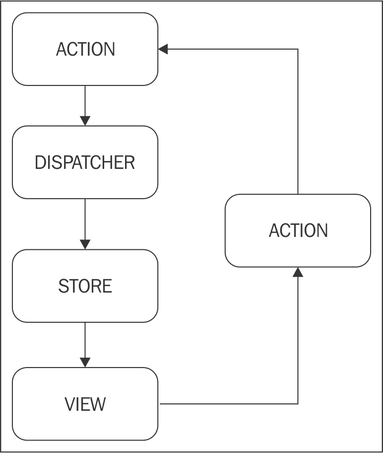
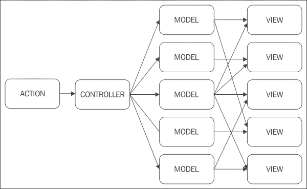
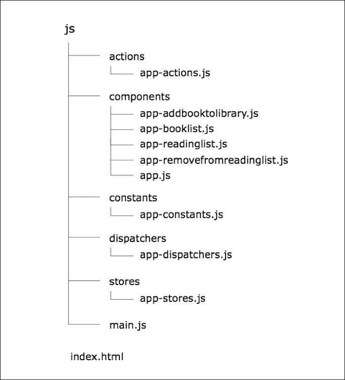
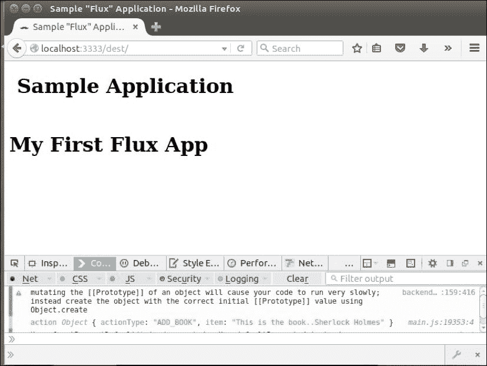
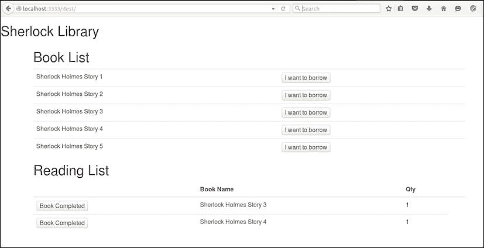
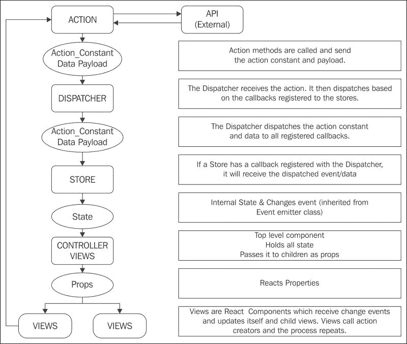

# 第六章. 使用 Flux 进行响应

到目前为止，在前面的章节中，我们已经深入探讨了 React 世界。现在让我们探索 React 世界的另一个维度，Flux，它实际上只是一个单向数据流架构。Flux 是由 Facebook 内部开发团队开发的，用于在 Facebook 构建客户端 Web 应用程序。

随着我们的进展，我们将涵盖以下主题：

+   Flux 与 MVC 架构的概述

+   动作

+   调度器

+   存储

+   控制器-视图和视图

# Flux 概述

**Flux**不应与基于 ReactJS 的框架混淆。Flux 是一种架构，旨在减少使用**模型-视图-控制器**（**MVC**）架构构建的大型应用程序的复杂性，并且被设计为 MVC 的替代方案。

以下是一些不同的 Flux 组件：

+   视图—这就像任何 Web 应用程序一样，视图（基本上是 React 组件）接收事件并将其传递给动作。

+   动作—它们是辅助方法（`actionCreators`），将来自外部 API/视图的数据（有效载荷）和`actionType`传递给调度器。

+   调度器—这些是所有注册回调的中心枢纽。它接收动作，并在将其传递给存储之前充当“交通控制器”。

+   Store—它是一个数据层，存储所有计算和业务逻辑。它还负责存储应用程序状态和应用程序状态的单一真相来源。它根据注册的回调从调度器接收动作。

+   控制器-视图—它根据`changeEvents`从存储中接收状态，并通过属性将状态传递给 React 视图组件。

以下图表说明了这一点：



典型的 Flux 数据流架构

# Flux 与 MVC 架构

在基于 MVC 架构的典型应用程序中，视图从数据更新，这些数据通常存储在模型中。随着应用程序的增长，模型和视图的数量也增加，各种模型之间的相互依赖性也随之增加。因此，视图也变得依赖于多个模型，从而增加了应用程序的复杂性。

视图和模型之间的相互依赖性可能导致真相来源的扩散，导致应用程序复杂性和不可预测性的增加。因此，需要有一种解决方案，通过将所有控制移入各个部分来内部化控制。



使用 MVC 构建的日益增长的应用程序的问题

## Flux 优势

根据 Facebook Flux 开发团队的说法，Flux 应用程序中的对象高度解耦，并且非常严格地遵循德米特法则的第一部分：系统中的每个对象应尽可能少地了解系统中的其他对象。这导致软件更加。

+   可维护性

+   可适应性

+   可测试性

+   对于新工程团队成员来说更容易理解且更可预测

以下是我们 `library_app` 应用程序的 Flux 应用程序结构。



我们的图书馆应用程序结构

## 流量组件

让我们深入一个使用 React 视图构建的 Flux 架构的应用程序。在这里，我们将构建一个名为 `library_app` 的应用程序。这是一个基本的基于 Flux 的 ReactJS 应用程序，我们可以从 `library_app` 存储库借阅书籍到我们的阅读列表。一旦我们完成阅读书籍，我们可以将其从阅读列表中删除。

### 注意

在命令行执行：

```js
sudo npm install flux

```

上述操作将安装 flux 包作为节点模块，并且你的 library_app 应用程序将有一个名为 node_modules 的目录，其中包含安装的 flux 库。

# 动作

**动作**通常是进入应用程序的数据，无论是直接来自视图还是来自外部 Web API。每个动作不过是一个 JavaScript 方法，它包含两部分：`actionType` 和实际数据。`actionCreators` 方法仅仅是离散的、语义化的辅助函数，它简化了将数据以 `action` 的形式传递给 *dispatcher* 的过程。不同类型的动作被声明为一个 JavaScript 对象，在一个名为 `App-Constants.js` 的文件中。根据 Flux 应用程序层次结构，`App-Constants.js` 文件位于 `src/js/constants` 目录下。此类文件的典型示例如下：

```js
module.exports = {
 ADD_BOOK: 'ADD_BOOK',
 DELETE_BOOK: 'DELETE_BOOK',
 INC_BOOK_COUNT: 'INC_BOOK_COUNT',

DEC_BOOK_COUNT: 'DEC_BOOK_COUNT'
}
```

在这里，`ADD_BOOK`、`DELETE_BOOK` 是动作。

### 注意

动作本身不包含任何功能。动作通常由 stores 执行，并且可用于触发视图。在 React 中，我们有少量名为 `actionCreators` 的辅助方法，理想情况下，这些方法创建动作对象并将动作传递给 Flux 分发器（`AppDispatcher`）。

在 `AppConstants` 中定义的所有动作都在 `AppActions` 中声明。

在 `AppConstants` 中使用常量来声明动作名称，有助于开发者理解应用程序的功能。正如我们的案例，它处理书籍。

在以下示例中，在向 `library_app` 存储库添加书籍时，我们处理了四个 `actionTypes`：

+   `ADD_BOOK`

+   `DELETE_BOOK`

+   `INC_BOOK_COUNT`

+   `DEC_BOOK_COUNT`

动作（如 `addBook`、`removeBook`、`incBookCount` 和 `decBookCount`）根据它们的 `actionType` 属性是唯一的。因此，当这些动作由 dispatchers 分发到 stores 时，stores 会根据与 dispatchers 注册的特定回调进行自我更新。

典型的动作文件位于 `library_app/src/js/actions/app-actions.js`：

```js
var AppConstants = require('../constants/app-constants');
var AppDispatcher = require('../dispatchers/app-dispatchers');

var AppActions = {
  addBook:function(item){
        AppDispatcher.handleViewAction({
          actionType: AppConstants.ADD_BOOK,
          item: item
        })
  },
  removeBook:function(index){
        AppDispatcher.handleViewAction({
          actionType: AppConstants.REMOVE_BOOK,
          index: index
        })
  },
  incBookCount:function(index){
        AppDispatcher.handleViewAction({
          actionType: AppConstants.INC_BOOK_COUNT,
          item: index
        })
  },
  decBookCount:function(index){
        AppDispatcher.handleViewAction({
          actionType: AppConstants.DEC_BOOK_COUNT,
          item: index
        })
  }
}

module.exports =  AppActions;
```

# 分发器

正如其名所定义的，**Flux 分发器**将动作分发到后续的 stores。分发器可以被视为回调的注册表。所有 stores 都注册在分发器上。

分发器的一些关键点如下：

+   每个应用程序只有一个分发器。

+   Dispatchers 被用作所有注册回调的中心。

+   它充当所有动作到商店的广播器。调度器作为一个队列，依次广播动作。这与通用的 pub-sub 系统在以下两个方面不同：

    1.  回调没有订阅特定的事件。每个有效负载都会分发到每个已注册的回调。

    1.  回调可以全部或部分地延迟，直到其他回调已执行。

+   调度器具有按指定顺序调用回调的能力，并且它等待其他更新（`waitFor()` 方法就是这样做的）。

+   在 flux 库（`npm install flux`）的 `node_module` 中，定义了 `register()` 和 `dispatch()` 方法，在 flux `library_app` 中的调度器类中。

查看位于 `library_app/node_modules/Flux/lib/Dispatcher.js` 的文件：

```js
   // Registers a callback to be invoked with every dispatched payload. Returns
   // a token that can be used with `waitFor()`.   

  Dispatcher.prototype.register = function register(callback) {
    var id = _prefix + this._lastID++;
    this._callbacks[id] = callback;
    return id;
  };
```

因此，当调度器从 Actions 接收触发（动作）时，它会逐个将所有动作分发到已注册的商店。这种分发流程是通过 `dispatch()` 方法启动的，该方法将有效负载（数据）传递到已注册的商店，并注册了回调。

以下代码是从 `node_modules` 中的 `Flux.js` 库的调度器摘录：

```js
  /**
   * Dispatches a payload to all registered callbacks. The highlighted code below ensures the fact that dispatches cannot be triggered in the middle of another dispatch.

   */

 Dispatcher.prototype.dispatch = function dispatch(payload) {
 !!this._isDispatching ? process.env.NODE_ENV !== 'production' ? invariant(false, 'Dispatch.dispatch(...): Cannot dispatch in the middle of a dispatch.') : invariant(false) : undefined;
    this._startDispatching(payload);
    try {
      for (var id in this._callbacks) {
        if (this._isPending[id]) {
          continue;
        }
        this._invokeCallback(id);
      }
    } finally {
      this._stopDispatching();
    }
  };
```

```js
app-dispatcher class.
```

文件位置在 `library_app/src/js/dispatchers/app-dispatchers.js`：

```js
var Dispatcher = require('flux').Dispatcher;
var assign = require('react/lib/Object.assign');

var AppDispatcher = assign(new Dispatcher(),{
        handleViewAction: function(action){
          console.log('action',action);
          this.dispatch ({
            source: 'VIEW_ACTION',
            action: action
          })
        }
});

module.exports = AppDispatcher;
```

在实现 `library_app` 商店之前，让我们检查我们的有效负载（数据）是否在控制台中打印出来。为此，在 React `component app.js` 中创建了一个处理函数，当点击标题 **My First Flux App** 的任何部分时会被调用。

文件位置是 `library_app/src/js/components/app.js`：

```js
var React = require('react');
var ReactDOM = require('react-dom');

//call the AppActions directly, before creation of the Store
var AppActions = require('../actions/app-actions');

//create a App component
var App = React.createClass({
        handler: function(){
          AppActions.addBook('This is the book..Sherlock Holmes')
        },
        render:function(){
          return <h1 onClick={this.handler}>My First Flux App </h1>
        }

});
module.exports = App;
```

### 注意

从应用程序的根目录运行 httpster：

```js
doel@doel-Vostro:~/reactjs/ch6_flux_library$httpster
Starting HTTPster v1.0.1 on port3333 from /home/doel/reactjs/ch6_flux_library

```

打开浏览器并检查控制台，点击标题后：



library_app 的截图

为了快速回顾我们书店应用到目前为止的流程：

默认的 `index.html` 页面在 `localhost:3333` 上提供静态内容（示例应用）。

`index.html` 页面内部调用 `main.js`，然后内部创建 React 类并在 `<App />` React 组件（来自 `src/js/components/app.js`）中渲染内容。React 组件在具有 ID `main` 的 `div` 标签中渲染。

一旦我们点击 `<App />` 组件（**My First Flux App**）的任何部分，一个 `onClick` 事件处理程序会触发 `handler()` 函数，该函数调用 `AppActions.addBook` (`This is the book..Sherlock Holmes`)，在这里，`AppActions` 在 `AppConstant` 中。`AddBook` 是要调用的特定动作，带有 `payload / item/ data` (`This is the book..Sherlock Holmes`)。

一旦调用 `AppActions.addBook` 方法，它就会被分配给调度器的回调 `handleViewAction`，如下所示：

+   `actionType`: `AppConstants.ADD_BOOK`

+   `item`: `This is the book..Sherlock Holmes`

+   调度器的 `handleViewAction` 方法传递动作（带有 `action_type` 和 `item`）并在控制台记录输出，然后分发它。

+   在点击**我的第一个 Flux 应用程序**后，我们在`console.log`中看到以下输出：

    `action Object { actionType: "ADD_BOOK", item: "This is the book..Sherlock Holmes" }`

+   这只是以统一和预期的方式将 JS 对象（`item: "This is the book..Sherlock Holmes"`）传递给商店处理的一种方式。它简化了应用程序的数据流，并使得跟踪和调试更容易。

# 商店

Flux 商店可以与 MVC 中的模型相比较，尽管本质上它们并不相同。从类似的角度来看，它们与所有业务逻辑和计算都在 Flux 商店中发生是一样的。根据 Facebook 团队的说法，“商店管理许多对象的状态——它们不表示 ORM 模型那样的单个数据记录。它们也不与 Backbone 的集合相同。商店不仅管理 ORM 风格的集合，还管理应用程序中特定**领域**的应用状态。”

来源 [`en.wikipedia.org/wiki/Object-relational_mapping`](https://en.wikipedia.org/wiki/Object-relational_mapping).

> *在计算机科学中，对象关系映射（ORM）是一种编程技术，用于在面向对象编程语言中将数据在不可兼容的类型系统之间进行转换。实际上，它创建了一个“虚拟对象数据库”，可以在编程语言中使用。在面向对象编程中，数据管理任务作用于面向对象（OO）对象，这些对象几乎总是非标量值。例如，考虑一个代表一个人以及零个或多个电话号码和零个或多个地址的地址簿条目。这可以通过面向对象的实现来建模，通过“Person 对象”具有属性/字段来保存条目包含的每个数据项：人的名字、电话号码列表和地址列表。电话号码列表本身将包含“PhoneNumber 对象”，依此类推。编程语言将地址簿条目视为单个对象（例如，可以通过包含指向对象的指针的单个变量来引用它）。可以与对象关联各种方法，例如返回首选电话号码、家庭地址等方法。*

商店从调度器接收动作。根据注册的回调（与调度器相关），商店决定是否应该响应调度器分发的动作。应用程序外部的任何对象都不负责更改商店或视图内的值。因此，任何由动作带来的更改，都是基于注册的回调导致的数据更改，而不是任何设置方法。

由于 Flux 存储可以在没有任何外部干预的情况下自行更新，因此它减少了在 MVC 应用中通常发现的复杂性。Flux 存储控制其内部发生的事情，只有输入是通过调度器进行的。在 MVC 应用中，各种模型与各种视图之间的相互依赖可能导致不稳定和复杂的测试用例。

一个应用可以根据其功能拥有多个存储，但每个存储只处理一个域。存储既表现出模型集合的特征，也表现出逻辑域的单例模型特征。

以下是对存储功能的快速回顾：

+   存储注册自身到调度器中，通过回调函数。

+   业务逻辑的计算位于存储中，作为 JS 函数。

+   在调度器将操作从调度器发送到存储后，它们通过已注册的回调函数被识别。

+   通过状态更新在存储中执行操作。

+   JS 数组：`_library`和`_readingItems`存储可用的书籍和读者想要阅读的内容。

+   `EventEmitter`是事件模块的一个类，它是 Node.js 核心库的一部分。在这个例子中，事件发射器功能是通过`eventEmitter.on()`方法完成的，其中第一个参数是事件，第二个参数是要添加的函数。因此，`eventEmitter.on()`方法只是注册函数。当调用`emit()`方法时，它将执行通过 on 方法注册的所有函数。

+   公共方法`getReadingList()`和`getLibrary()`允许我们从`_readingItems`和`_readingList`JS 数组中获取计算后的数据。

+   `app-stores.js`代码中的`dispatcherIndex`用于存储调度器注册方法的返回值。

+   在调度器广播的情况下，switch 语句是决定要执行哪些操作的确定因素。如果采取了相关操作，则发出一个变更事件，并更新监听此事件的视图的状态。

以下是我们`library_app`的`app_stores.js`代码的代码，它包含了我们应用的所有业务逻辑和计算：

```js
var AppDispatcher = require('../dispatchers/app-dispatchers');
var AppConstants = require('../constants/app-constants');
var assign = require('react/lib/Object.assign');

//eventEmitter allows the Stores to listen/broadcast changes to the 
//Controller-Views/React-Components
var EventEmitter = require('events').EventEmitter;

var CHANGE_EVENT = 'change';

var _library = [];

for(var i=1; i<6; i++){
  _library.push({
    'id': 'Book_' + i,
    'title':'Sherlock Holmes Story ' + i,
    'description': 'Sherlock Series by Sir Arthur Conan Doyle'
  });
}

var _readingItems = [];

function _removeItem(index){
  _readingItems[index].inReadingList = false;
  _readingItems.splice(index, 1);
}

function _increaseItem(index){
  _readingItems[index].qty++;
}

function _decreaseItem(index){
  if(_readingItems[index].qty>1){
    _readingItems[index].qty--;
  }
  else {
    _removeItem(index);
  }
}

function _addItem(item){
  if(!item.inReadingList){
    item['qty'] = 1;
    item['inReadingList'] = true;
    _readingItems.push(item);
  }
  else {
    _readingItems.forEach(function(cartItem, i){
      if(cartItem.id===item.id){
        _increaseItem(i);
      }
    });
  }
}
var AppStore = assign(EventEmitter.prototype, {
  emitChange: function(){
    this.emit(CHANGE_EVENT)
  },
  addChangeListener: function(callback){
    this.on(CHANGE_EVENT, callback)
  },
  removeChangeListener: function(callback){
    this.removeListener(CHANGE_EVENT, callback)
  },
  getReadingList: function(){
    return _readingItems
  },
  getLibrary: function(){
    return _library
  }
```

### 注意

`dispatcherIndex`用于存储调度器注册方法的返回值。在`waitFor()`方法的情况下使用`dispatcherIndex`，即当应用的一部分需要等待应用的其他部分更新时。

以下代码展示了`dispatcherIndex`：

```js
dispatcherIndex: AppDispatcher.register(function(payload){
    var action = payload.action; 
    switch(action.actionType){
      case AppConstants.ADD_BOOK:
        _addItem(payload.action.item);
        break;

      case AppConstants.DELETE_BOOK:
        _removeItem(payload.action.index);
        break;

      case AppConstants.INC_BOOK_COUNT:
        _increaseItem(payload.action.index);
        break;

      case AppConstants.DEC_BOOK:
        _decreaseItem(payload.action.index);
        break;
    }

    AppStore.emitChange();

    return true;
  })
})
module.exports = AppStore;
```

# 控制器-视图和视图

视图主要是 React 视图，它们本质上生成操作。控制器-视图监听我们的存储，以获取任何已广播的`changeEvent`。`emitChange`事件让我们的控制器-视图知道是否需要在视图的状态中执行任何更改。它们本质上都是 React 组件。在我们的代码中，我们有五个这样的 React 组件，如下所示：

+   `app-addbooktoreadinglist.js`

+   `app-booklist.js`

+   `app.js`

+   `app-readinglist.js`

+   `app-removefromreadinglist.js`

以下为`app-booklist.js`的代码：

```js
var React = require('react');
var AppStore = require('../stores/app-stores');
var AddBookToReadingList = require('./app-addbooktoreadinglist')

function getLibrary(){
  return {items: AppStore.getLibrary()}
}

var BookList = React.createClass({
  getInitialState:function(){
    return getLibrary()
  },
  render:function(){
    var items = this.state.items.map(function(item){
      return (
        <tr key={item.id}>
          <td>{item.title}</td>
          <td><AddBookToReadingList item={item} /></td>
        </tr>
      );
    })
    return (
      <table className="table table-hover">
        {items}
      </table>
    )
  }
});

module.exports = BookList;
```

以下是在`AddBookToReadingList` React 组件内部调用的代码：

```js
var React = require('react');
var AppActions = require('../actions/app-actions');

//create a AddBookToLibrary component
var AddBookToReadingList = React.createClass({
        handleClick: function(){
          AppActions.addBook(this.props.item)
        },
        render:function(){
          return <button onClick={this.handleClick}>I want to borrow </button>
        }

});
module.exports = AddBookToReadingList;
```

最后，在`app.js`中添加了以下组件`<Booklist \>`。这主要是为了用户可以在`ReadingList`列表部分看到他们拥有的书籍：

```js
var React = require('react');
var AppStore = require('../stores/app-stores.js');
var RemoveFromReadingList = require('./app-removefromreadinglist');

function readingItems(){
  return {items: AppStore.getReadingList()}
}

var ReadingList = React.createClass({
  getInitialState:function(){
    return readingItems()
  },
  componentWillMount:function(){
    AppStore.addChangeListener(this._onChange)
  },
  _onChange: function(){
    this.setState(readingItems())
  },
  render:function(){
    var total = 0;
    var items = this.state.items.map(function(item, i){
      return (
          <tr key={i}>
            <td><RemoveFromReadingList index={i} /></td>
            <td>{item.title}</td>
            <td>{item.qty}</td>
          </tr>
      );
    })
    return (
      <table className="table table-hover">
          <thead>
              <tr>
                <th></th>
                <th>Book Name</th>
                <th>Qty</th>
                <th></th>
              </tr>
            </thead>
            <tbody>
          </table>
    )
  }
});
module.exports = ReadingList
```

# 重新审视代码

在每个 React 组件（`readingList`和`bookList`）中，`getInitialState()`分别使用存储的公共方法`getReadingList()`和`getLibrary()`初始化。

在组件的生命周期中，各种方法在精确的点被执行。

+   `componentWillMount()`是 React 的生命周期方法。它在客户端和服务器上都会被调用一次，在初始渲染发生之前立即执行。如果你在这个方法中调用`setState`，`render()`将看到更新的状态，并且即使状态发生变化，也只会执行一次：

    ```js
    componentWillMount:function(){
        AppStore.addChangeListener(this._onChange)
      },
      _onChange: function(){
        this.setState(readingItems())
      }
    ```

+   因此，`componentWillMount()`正在监听`addChangeListener`（在`AppStore`存储中定义）。如果传递了`_onChange`参数，则当前对象（`_this`）会更新（`setState`）为新/更新的数据/有效载荷（`readingItems`）。

+   为了从阅读列表中删除项目，事件监听器（`handleClick`）被卸载。

以下为`app-`removebookfromreadinglist.js`的代码：

```js
var React = require('react');
var AppActions = require('../actions/app-actions');

//create a DeleteBookFromLibrary component
var DeleteBookFromReadingList = React.createClass({
        handleClicr: function(){
          AppActions.deleteBook(this.props.index)
        },
        render:function(){
          return <button onClick={this.handleClicr}>Book Completed</button>
        }
});
module.exports = DeleteBookFromReadingList;
```

以下为`app.js`的代码：

```js
var React = require('react');
var BookList = require('./app-booklist');
var ReadingList = require('./app-readinglist');
//create a App component
var App = React.createClass({
        render:function(){
          return <div><h1>Book List</h1><BookList /><h1>Reading List</h1><ReadingList /></div>
        }
});
module.exports = App
```

我们`library_app` Flux 应用程序的最终视图

点击按钮**我想借阅**时，相应的书籍将出现在我的阅读列表中。一旦我完成这本书，点击按钮**书籍完成**，从阅读列表中删除这本书。

以下是我们`library_app`应用程序的截图。



如何运行这个 Flux 应用将在构建和部署结构中稍后介绍。

以下是基于 Flux 的应用程序组件的详细信息：

+   动作

+   派发器（回调注册的注册表）

+   存储（与派发器注册的回调）

+   视图

+   控制器 视图

    Flux 应用中的数据流

# 摘要

通过我们的`libary_app`应用程序，我们探讨了简单 Flux 应用中单向数据流的工作方式。用户可以在视图中看到书单。他们可以在阅读列表中添加书籍，因此动作（添加书籍）被传递到派发器。内部，派发器有与存储注册的回调。然后存储根据用户的动作添加/删除书籍，并计算业务逻辑，相应地重新渲染视图。

在下一章中，我们将介绍 React 的良好实践和模式。这包括开发可重用组件的实践，如何以更好的数据流结构化组件层次结构，以及如何验证组件的行为。在我们的应用中，我们将改进到目前为止开发的组件。
