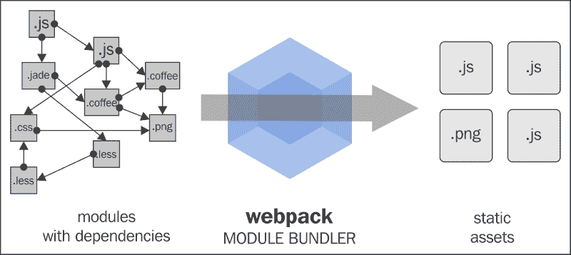
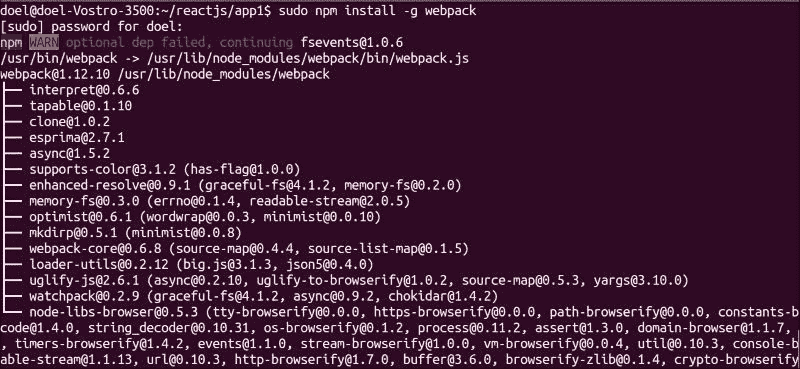
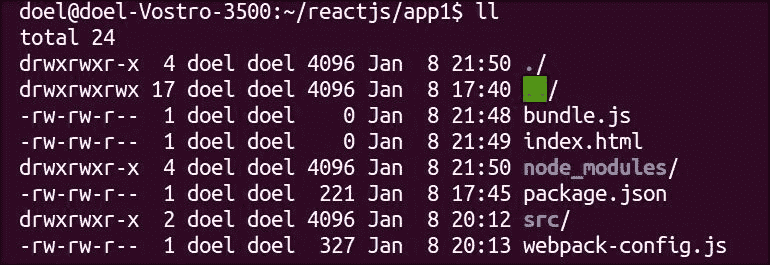
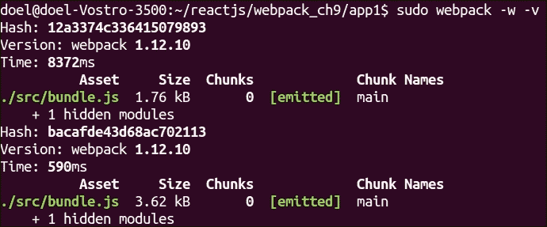
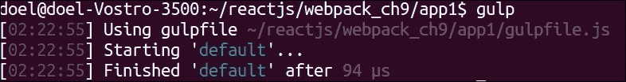
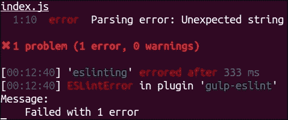

# 第九章.为部署准备代码

在学习 ReactJS 基础和 flux 之后，我们几乎接近了这本书的结尾。在开发任何应用程序后，我们面临的最关键部分是将应用程序提供给外部世界，即部署应用程序。将代码保存在源代码控制仓库（如 GitHub 或 Bitbucket）中，并使用 Git 进行代码版本控制是一个好习惯。这些在团队合作和必要时检索任何代码时都有帮助。如何设置前面提到的内容的解释超出了本书的范围，但有许多资源可供参考。

在本章中，我们将探讨以下主题：

+   Webpack 简介

+   使用 Webpack 和 Gulp 部署 React 应用程序的方法

+   用于 browserify 的配置选项

+   安装简单的 Web 服务器

# Webpack 简介

**Webpack**是一个模块打包器，用于部署基于 JavaScript 的应用程序。它将输入作为具有依赖关系的模块，然后将其输出为静态资源。

从 Webpack 文档网站([`webpack.github.io/docs/what-is-webpack.html#how-is-webpack-different`](https://webpack.github.io/docs/what-is-webpack.html#how-is-webpack-different))，以下图像解释了相同的内容。



## 构建简单的 React 应用程序

如前几章所述，让我们构建一个简单的基于 React 的应用程序，我们将集成 Webpack 并在之后部署它。

从终端安装`vis npm`包，如下所示：

```js
sudo npm install babel-loader babel-preset-es2015 babel-preset-react babel-preset-stage-2
npm -g install httpster

```

### 注意

`httpster`: 这是一个简单的 http 服务器，用于运行静态内容。在 Chrome 浏览器中，由于 X-origin 错误，`index.html`文件有时无法渲染。因此，从您的应用程序目录运行此 Web 服务器将更容易测试您的应用程序。只需运行命令`httpster`。

默认情况下，服务器在端口`3333`上运行，因此浏览器中的`localhost:3333`应该渲染您的应用程序的`index.html`页面。

我们创建了以下文件：

+   `src/bundle.js`: 这是在 Webpack 将代码转换为普通 JS 并执行任何其他文件转换后，Webpack 将其输出到的地方。该文件的详细信息将在后面的部分讨论。

+   `index.html`: 应用程序着陆页。

+   `index.js`: 基于 React 的组件。

+   `.babelrc`: 在这里声明了 babel 的预设和环境。

+   `node_modules`: 存储已安装的`npm`包。

+   `Webpack.config.js`: 在这里存在 Webpack 相关的配置。

以下是一个控制台截图，显示了使用 Webpack 的应用程序目录结构：



查看简单的 React 应用代码示例：

**index.html:**

```js
<!DOCTYPE html>
<html lang="en">
<head>
  <meta charset="UTF-8">
  <script src="img/react.js"></script>
<script src="img/react-dom.js"></script>
<script src="img/JSXTransformer.js"></script>

  <title>React App with Webpack</title>
</head>
<body>
  <div id="app"></div>
  <script type = "text/jsx" src="img/index.js"></script>
</body>
</html>
```

**index.js:**

```js
"use strict";
class App extends React.Component {
  render() {
    return <div>Hello </div>;
  }

}
ReactDOM.render(<App />, document.getElementById('app'));

.babelrc:
{
  "presets": ["es2015",  "react"]
}
```

## 设置 Webpack

现在我们已经了解了 Webpack 是什么，让我们安装和配置它，以便我们可以在 React 应用程序中使用它，如后面所述。

在你的终端中，输入以下内容：

```js
 sudo npm install -g webpack

```

### 注意

`-g` 选项将 Webpack 库全局安装到你的计算机上。

如你所见，在下面的截图中，有许多依赖包，这些包在安装 Webpack 时也会被安装：



显示 webpack 包安装及其所有依赖项的控制台截图

在安装 Webpack 之后，我们将创建一个 `webpack-config.js` 文件，其中包含以下条目：

```js
// The declaration of the object having all the Webpack-related 
configuration details.
module.exports = { 

//entry point of the application
  entry: "./app/components/index.js",

/* In this bundle.js file,Webpack will have the output  after transpilation of the code from index.js (ES6 to ES5) & combining all the components' and it's children js files are present.
*/
  output: { 
    filename: "src/bundle.js" 
  }, 
  module: { 
// Loading the test loader, it is used to transform any JSX code in the tests into plain JavaScript code.

    loaders: [ 
      { 
// All the packages which are installed within the node_modules directories are to be excluded.
        test: /\.jsx?$/, 
        exclude: /(node_modules)/,
//specifying which one to use
        loader: 'babel', 
        query: { 
          presets: ['react', 'es2015'] 
        } 
      } 
    ] 
  } 
}
```

**让我们解释前面的代码。**

我们从应用程序的入口点开始。由于基于 React 的应用程序通常有很多组件，为所有这些组件有一个共同的入口点将更容易管理，并且对于结构良好的模块化应用来说很重要。

然后我们将输出指向一个名为 `bundle.js` 的文件，并将所有组件及其子组件合并。

在加载测试加载器后，我们说明在 `node_modules` 目录中要排除哪些包。

然后我们使用加载器，指定使用哪一个。预设加载器在将 ES6 代码转换为当前浏览器兼容代码时执行 Babel 所做的所有转换。

现在我们将在我们的终端中运行 Webpack 命令，

```js
sudo webpack -w -v

```

+   使用 `sudo`，因为我们需要 sudo/root 权限来执行 Webpack 命令，或者我们需要更改特定目录的所有权/权限。

    `-w` 选项确保监视任何发生变化的文件。它将监视源文件的变化，当发生变化时，捆绑包将被重新编译。（来源：[`webpack.github.io/docs/webpack-dev-server.html`](https://webpack.github.io/docs/webpack-dev-server.html)）。

    `-v` 选项给出详细输出。

+   `webpack --help`：此命令给出所有选项及其对应含义的输出，这些选项可以作为参数传递。



在终端上执行 Webpack 后的控制台截图

因此，所有代码的转换和转换都在 `src/bundle.js` 输出文件中。

从前面提到的应用中典型的 `bundle.js` 文件输出：

```js
/******/ (function(modules) { // webpackBootstrap

/******/    // The module cache

/******/        var installedModules = {};

/******/    // The require function

/******/    function __webpack_require__(moduleId) {

/******/ 	      // Check if module is in cache

/******/ 	      if(installedModules[moduleId])

/******/             return installedModules[moduleId].exports;

/******/        // Create a new module (and put it into the cache)

/******/        var module = installedModules[moduleId] = {

/******/            exports: {},

/******/            id: moduleId,

/******/            loaded: false

/******/        };

/******/        // Execute the module function

/******/        modules[moduleId].call(module.exports, module, module.exports, __webpack_require__);

/******/        // Flag the module as loaded

/******/        module.loaded = true;

/******/        // Return the exports of the module

/******/        return module.exports;

/******/    }

/******/    // expose the modules object (__webpack_modules__)

/******/    __webpack_require__.m = modules;

/******/    // expose the module cache

/******/    __webpack_require__.c = installedModules;

/******/    // __webpack_public_path__

/******/    __webpack_require__.p = "";

/******/    // Load entry module and return exports

/******/    return __webpack_require__(0);

/******/ })

/************************************************************************/

/******/ ([

/* 0 */

/***/ function(module, exports) {

	"use strict";

    var _createClass = function () { function defineProperties(target, props) { for (var i = 0; i < props.length; i++) { var descriptor = props[i]; descriptor.enumerable = descriptor.enumerable || false; descriptor.configurable = true; if ("value" in descriptor) descriptor.writable = true; Object.defineProperty(target, descriptor.key, descriptor); } } return function (Constructor, protoProps, staticProps) { if (protoProps) defineProperties(Constructor.prototype, protoProps); if (staticProps) defineProperties(Constructor, staticProps); return Constructor; }; }();

    function _classCallCheck(instance, Constructor) { if (!(instance instanceof Constructor)) { throw new TypeError("Cannot call a class as a function"); } }

    function _possibleConstructorReturn(self, call) { if (!self) { throw new ReferenceError("this hasn't been initialised - super() hasn't been called"); } return call && (typeof call === "object" || typeof call === "function") ? call : self; }

    function _inherits(subClass, superClass) { if (typeof superClass !== "function" && superClass !== null) { throw new TypeError("Super expression must either be null or a function, not " + typeof superClass); } subClass.prototype = Object.create(superClass && superClass.prototype, { constructor: { value: subClass, enumerable: false, writable: true, configurable: true } }); if (superClass) Object.setPrototypeOf ? Object.setPrototypeOf(subClass, superClass) : subClass.__proto__ = superClass; }
    var App = function (_React$Component) {
          _inherits(App, _React$Component);

        function App() {
        _classCallCheck(this, App);

        return _possibleConstructorReturn(this, Object.getPrototypeOf(App).apply(this, arguments));
        }
    _createClass(App, [{
        key: "render",
        value: function render() {
            return React.createElement(
            "div",
            null,
            "Hello "
        );
        }
    }]);
    return App;
    }(React.Component);

    ReactDOM.render(React.createElement(App, null), document.getElementById('app'));
/***/ }
/******/ ]);
```

请参阅 Webpack 文档[`webpack.github.io/docs/webpack-dev-server.html`](https://webpack.github.io/docs/webpack-dev-server.html)。

新生成的 `bundle.js` 存储在内存中，位置是 publicPath 中指定的相对路径。

例如，使用前面的配置，捆绑包将在 `localhost:8080/assets/bundle.js` 可用。

为了加载捆绑文件，我们在 `build` 文件夹中创建一个 html 文件（通常命名为 `index.html` 文件），从该文件夹提供静态文件：

```js
<!DOCTYPE html>
<html lang="en">
<head>
  <meta charset="UTF-8">
  <title>Document</title>
</head>
<body>
  <script src="img/bundle.js"></script>
</body>
</html>
```

默认情况下，应用程序在 `localhost:8080/` 运行以启动你的应用。例如，使用前面提到的配置（带有 publicPath），访问 `localhost:8080/assets/`。

# Webpack 的优势

在使用 Webpack 作为另一个打包器时，以下是一些重要的优势：

1.  **代码拆分**：基于代码大小，它有助于模块化代码块，并在需要时加载这些模块。你可以在你的代码中定义拆分点，根据这些拆分点，将使用代码块。因此，它有助于加快页面加载速度和性能提升。

1.  **加载器**：如前所述的图片所示，在左侧，你可以看到除了 JavaScript 和`.less`代替`.css`之外，还有各种其他格式，如`coffescripts`/`jsx`。因此，这些加载器（`npm`包）被用来将这些其他格式转换为接受的标准化格式，这使得开发者能够更容易地将代码编码成他们想要的任何格式。在我们之前看到的基于 React 的应用程序中，JSX 格式被广泛使用。因此，这些加载器将非常有用。

1.  **聪明的解析**：它有助于解析大多数第三方库，并处理 CommonJS 和 AMD 中广泛使用的样式。

1.  **插件系统**：如果你想扩展 Webpack 以在构建过程中创建一个步骤，你可以创建一个使用回调到 Webpack 引用点的插件，在那里你想调用它。

# Gulp 简介

现在我们已经看到了一个模块打包器，让我们看看 Gulp 能为我们做什么。Gulp 是一个用于编译和压缩 JS/资源的构建工具，并且它可以在浏览器上执行实时重新加载。Gulp 文件基本上是一个包含 Gulp 应该执行的一组指令的文件。该文件可以有一个默认任务或几个其他任务，可以从一个任务调用另一个任务。

## 安装 Gulp 和创建 Gulp 文件

让我们安装`gulp`并配置它与我们的现有应用程序：

```js
npm install -g gulp (for globally installing gulp)
npm install gulp –save-dev (as a developer dependancy)

```

接下来，在应用程序目录的根目录下创建一个简单的`gulpfile.js`文件：

```js
var gulp = require('gulp');

gulp.task('default', function() {
  // tasks goes here
});
```

让我们从终端执行命令：



执行 gulp 命令后的控制台截图

然后，我们为 Gulp 相关的任务安装了一些其他包。我们在`package.json`文件中添加这些包，并运行`npm install`来安装这些包：

```js
Package.json
{
  "name": "app1",
  "version": "1.0.0",
  "description": "ReactApp",
  "main": "index.js",
  "scripts": {
    "test": "echo \"Error: no test specified\" && exit 1"
  },
  "author": "Doel Sengupta",
  "license": "ISC",
  "dependencies": {
    "react": "⁰.14.3",
    "react-dom": "⁰.14.3"
  },
  "devDependencies": {
    "babel-core": "⁶.3.13",
    "babel-loader": "⁶.2.0",
    "babel-preset-es2015": "⁶.3.13",
    "babel-preset-react": "⁶.3.13",
    "browser-sync": "².9.6",
    "gulp": "³.9.0",
    "gulp-babel": "⁶.1.1",
    "gulp-concat": "².6.0",
    "gulp-eslint": "¹.1.1",
    "gulp-filter": "³.0.1",
    "gulp-notify": "².2.0",
 }
}
```

### 注意

Gulp 中的一些关键事项：

+   初始时，我们需要引入所有在执行任务时所需的 gulp 和相关 gulp 插件/包。

+   使用`gulp.task`声明 gulp 任务。

+   `.pipe`命令用于流式传输需要处理的数据。这个命令用于连接，结果是得到输出。

现在如果我们向 Gulp 文件添加一些任务，它将看起来像以下这样：

```js
var gulp         = require('gulp');
var babel        = require('gulp-babel');
var browserSync  = require('browser-sync');
var concat       = require('gulp-concat');
var eslinting    = require('gulp-eslint');
var notify       = require('gulp-notify');
var reload       = browserSync.reload;

var jsFiles = {
  vendor: [

  ],
  source: [
    '*.js',
    '*.jsx',
  ]
};

// Lint JS/JSX files
gulp.task('eslinting', function() {
  return gulp.src(jsFiles.source)
    .pipe(eslinting({
      baseConfig: {
        "ecmaFeatures": {
           "jsx": true
         }
      }
    }))
    .pipe(eslinting.format())
    .pipe(eslinting.failAfterError());
});

// Watch JS/JSX  files
gulp.task('watch', function() {
   gulp.watch('*.{js,jsx,html}').on("change",reload);
});

// BrowserSync
gulp.task('browsersync', function() {
  browserSync({
    server: {
      baseDir: './'
    },
    open: false,
    online: false,
    notify: false,
  });
});
gulp.task('default', ['eslinting', 'browsersync', 'watch']);

```

**让我们分析** **前面的代码**：

+   之前声明了四个 gulp 任务，并已突出显示。**默认**强制任务在最后一行突出显示时内部调用三个任务。在 Gulp 术语中，调用其他任务的任何任务都被提及为父任务的数组元素。

+   `gulp.task ('eslinting', function)`: 这个任务用于检查`js` & `jsx`文件中的任何代码问题。为了使用`gulp-eslint`插件检查`jsx`，设置了`ecmaFeature: {"jsx": true}`选项。

+   `gulp.watch`：正如其名所示，这个任务会监视 JS 文件中的任何变化，并在之后重新编译这些文件。如果不需要监视任何文件，我们需要将 `read: false` 传递给 `options` 对象。在 `js`/`jsx` 文件发生变化后，我们可以调用 `browserSync.reload` 或添加任务以重新加载您的 HTML 页面。

+   `browsersync`：这个插件不是官方为 gulp 设计的；尽管它可以与任何 gulp 任务一起工作。`js`/`jsx` 文件中的任何变化都会同步到浏览器。

在终端中从应用程序的根目录执行 gulp 命令后，我们应该能够在终端中看到这样的输出。请参阅以下图片：


执行带有任务 gulp 命令后的控制台截图

让我们检查一下 `gulp-eslint` 的工作方式。在 `index.js` 文件的开始处添加一行，例如 `require 'react'`。

```js
require "react";
var ReactApp1 = React.createClass({
  render: function(){
    return (
      <div>
        Hello World
      </div>
    )
  }
});

ReactDOM.render(<ReactApp1 />, document.getElementById('app'));
```



执行带有包含错误 eslint 任务的 gulp 命令后的控制台截图

正如我们所知，`var React = require("react")` 应该是正确引入 React 包的方式。

对于 Gulp 插件来说，有很多，除了在前面提到的示例中提到的那些，它们在我们的日常应用开发中也非常有帮助。请随意查看 Gulp 文档以及他们网站上的相关插件 [`gulpjs.com/`](http://gulpjs.com/)。

# 摘要

在本章中，我们了解到如何使用 Webpack 部署我们的 React 应用程序，以及 Gulp 如何通过自动化任务、压缩我们的资源（JS、JSX、CSS、SASS、图片等）、监视这些文件的变化以及内置在浏览器中的实时重新加载来简化我们的生活。在 第十章，*接下来是什么*，我们将探讨一些 ReactJS 的高级概念。
