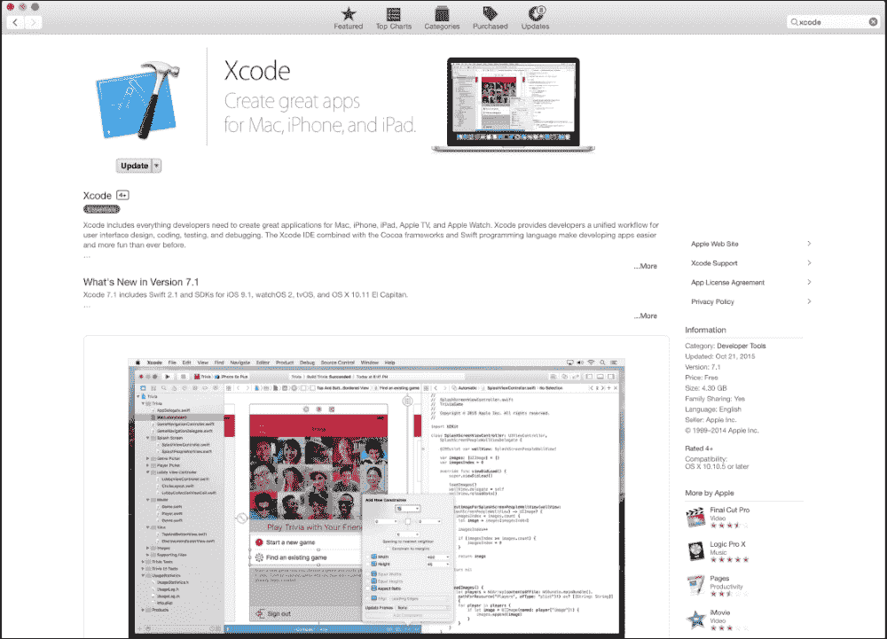
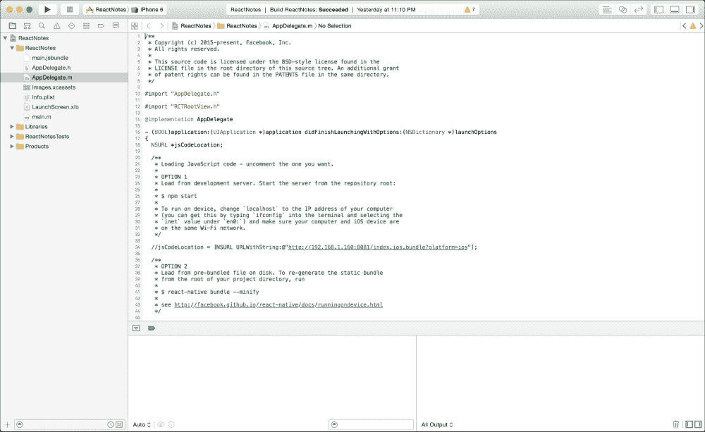
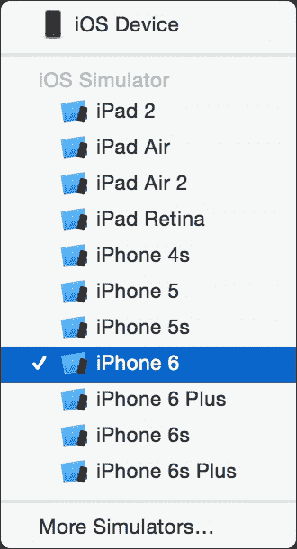
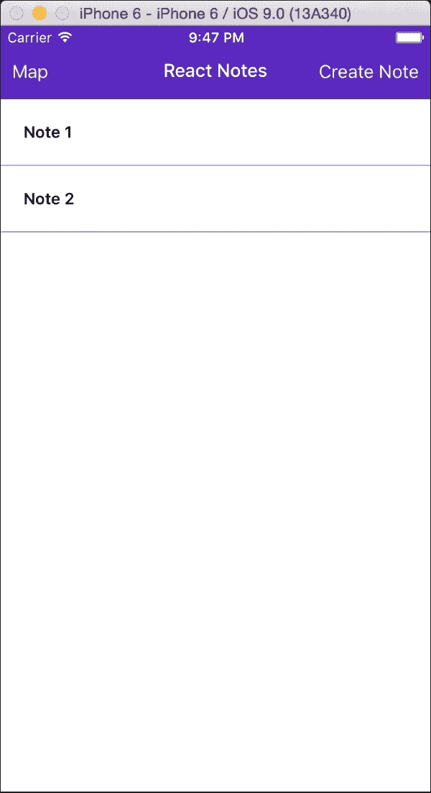
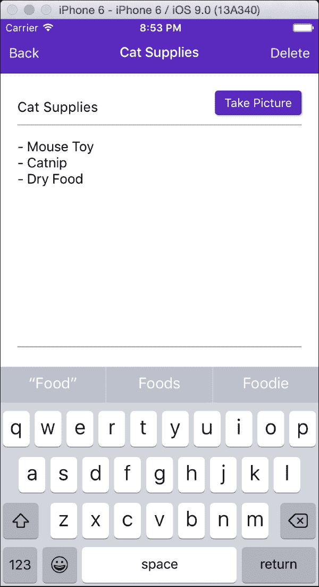
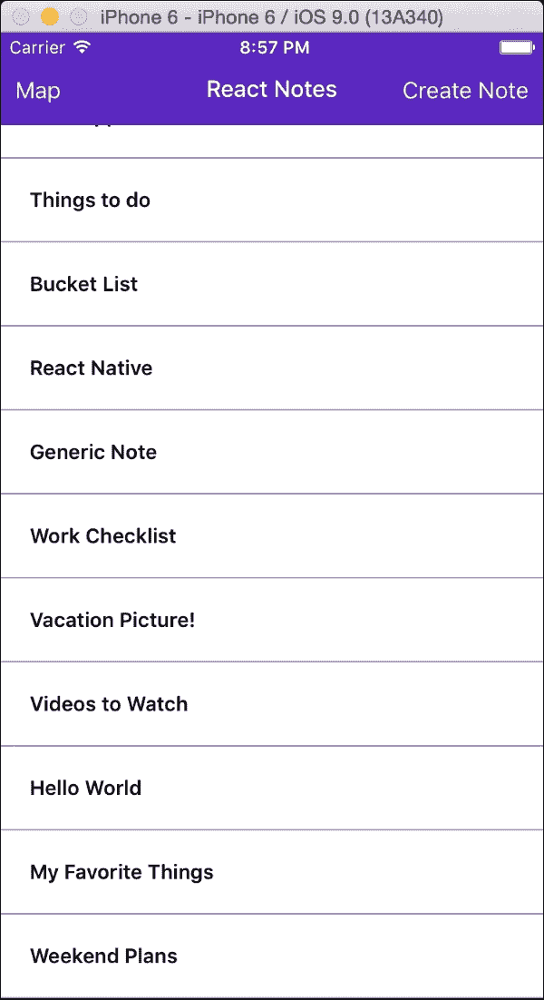
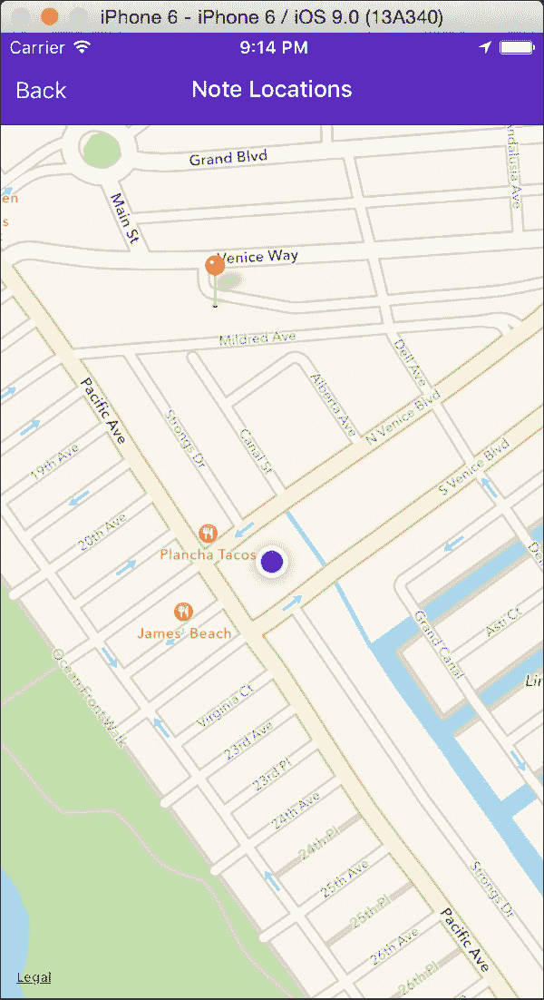
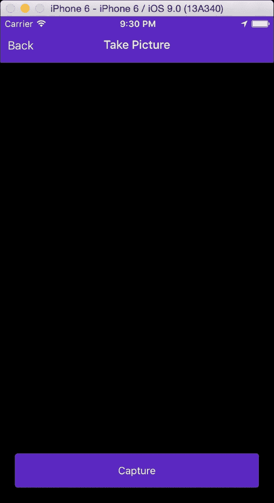
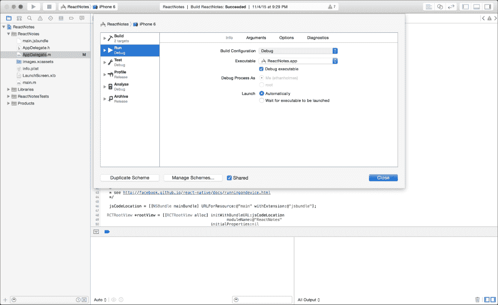

# 第一章. 探索示例应用程序

React Native 正在开始改变移动开发世界。作为网页开发者，您可以使用您已有的技能，获得一套熟悉的方法来为移动设备构建用户界面。在本书中，我们将通过开发一个名为**React Notes**的**笔记**应用程序，向您介绍许多 React Native 的功能。在构建基本功能，如创建笔记、将笔记保存到设备、查看已保存笔记列表以及在不同屏幕间导航时，您将学习到开发您自己的应用程序所需的基本技能。您还将有机会通过添加将图片和地理位置数据与笔记一起存储的功能来超越基础。功能只是构成优秀应用程序的一部分——它还必须看起来很棒，所以我们确保您对布局和样式有全面的理解。到本书结束时，您将从头到尾开发一个功能齐全的应用程序，并拥有分享您的 React Native 应用程序所需的所有技能！

在本章中，我们将向您介绍 React Notes，这是您将学习如何构建的示例应用程序。如果您急于开始尝试示例应用程序以查看会发生什么，我们甚至会为您指明正确的方向。

本章将重点介绍以下内容：

+   在 Mac OS X 上安装 Xcode

+   在 iOS 模拟器中运行示例应用程序

+   查看示例应用程序的功能

+   修改示例应用程序

# 安装 Xcode

在 OS X 中获取运行示例应用程序的工具很简单。安装 Xcode 最简单的方法是通过 App Store。在右上角的栏中，搜索术语**Xcode**，然后从结果列表中导航到 Xcode 商店页面，如下面的截图所示：



通过点击按钮安装或更新到 Xcode 的最新版本。

### 注意

您需要注册 Apple ID 才能从 App Store 下载 Xcode。

您还需要 Xcode 的**命令行工具**（**CLT**）。当需要安装时，会显示提示。您也可以直接从苹果开发者的[`developer.apple.com/downloads/`](https://developer.apple.com/downloads/)的**下载**部分下载命令行工具。

# 运行示例应用程序

源代码包含我们将全书构建的应用程序。我们将从运行应用程序开始。源代码已经配置好，可以在 iOS 模拟器中运行：

1.  在 Xcode 中打开`ios/`文件夹中的`ReactNotes.xcodeproj`，或从命令行打开：

    ```js
    ReactNotes$ open ios/ReactNotes.xcodeproj/

    ```

    

    ### 小贴士

    **下载示例代码**

    您可以从[`www.packtpub.com`](http://www.packtpub.com)下载您购买的所有 Packt Publishing 书籍的示例代码文件。如果您在其他地方购买了这本书，您可以访问[`www.packtpub.com/support`](http://www.packtpub.com/support)并注册，以便将文件直接通过电子邮件发送给您。

1.  本书针对 iPhone 6 进行开发；尽管它也适用于其他 iOS 版本，但我们建议使用这个版本。确保在 iOS 模拟器设备下拉菜单中选择 iPhone 6。如果您拥有 iPhone 6，您可以选择**iOS 设备**：

1.  按下**运行**按钮（*F5*）以启动 iOS 模拟器：

## 样本应用程序的预览

本书的目标是向您介绍 React Native 如何快速帮助您搭建用户界面。无论您构建什么类型的移动应用程序，您都极有可能需要某些功能。您的 UI 可能包含多个屏幕，因此您需要能够在它们之间导航的能力。在第三章*从示例应用程序开始*中，我们将开始为导航和笔记屏幕打下基础：



在您看到裸机应用程序不久之后，您可能想要开始让它看起来更好。让我们深入到第四章*处理样式和布局*中，并将这些课程贯穿到本书的其余部分。

很难想象一个没有数据列表的应用程序，React Notes 也不例外。我们将在第五章*显示和保存数据*中介绍如何处理列表：



区分移动应用程序和 Web 应用程序的能力之一是访问 GPS 数据的能力。我们在第六章*处理地理位置和地图*中展示了如何使用地图捕获地理位置数据：



在移动设备上捕捉照片是非常常见的。相机屏幕将允许用户将照片附加到他们的笔记中，并保存下来以便稍后查看。你将在第七章*使用原生模块*中学习如何为你的应用程序添加相机支持：



### 注意

注意，在 iOS 模拟器中相机屏幕将是黑色的。这也在第七章*使用原生模块*中稍后进行了解释。

# 在样本应用程序中进行实验

如果你是个喜欢冒险的人，那么请随意开始尝试和修改示例应用程序代码。将 iOS 应用程序切换到开发模式有两个步骤：

1.  在 Xcode 中打开`AppDelegate.m`文件，取消注释`OPTION 1`中的`jsCodeLocation`赋值，并注释掉`OPTION 2`中的语句：

    ```js
    NSURL *jsCodeLocation;

    /**
    * Loading JavaScript code - uncomment the one you want.
    *
    * OPTION 1
    * Load from development server. Start the server from the repository root:
    *
    * $ npm start
    *
    * To run on device, change `localhost` to the IP address of your computer
    * (you can get this by typing `ifconfig` into the terminal and selecting the
    * `inet` value under `en0:`) and make sure your computer and iOS device are
    * on the same Wi-Fi network.
    */

    jsCodeLocation = [NSURL URLWithString:@"http://localhost:8081/index.ios.bundle?platform=ios"];

    /**
    * OPTION 2
    * Load from pre-bundled file on disk. To re-generate the static bundle
    * from the root of your project directory, run
    *
    * $ react-native bundle --minify
    *
    * see http://facebook.github.io/react-native/docs/runningondevice.html
    */

    //jsCodeLocation = [[NSBundle mainBundle] URLForResource:@"main" withExtension:@"jsbundle"];
    ```

1.  然后，转到**产品** | **方案** | **编辑方案…**。选择**运行**，在**信息**选项卡下将**构建配置**从**发布**更改为**调试**，如图所示：

1.  从 Xcode 中**运行**（*F5*）以在开发模式下启动应用程序。使用 iOS 模拟器的`Shake`手势（**硬件** | **摇动** | **手势**）将显示开发菜单。可能需要从命令行运行`react-native start`来加载 JavaScript 包。

就这样！从这里你可以自由地修改`index.ios.js`中的任何源代码或在`Components`文件夹中的代码。稍后我们将解释如何在模拟器中快速重新加载你的代码，而无需从 Xcode 重新编译。

# 摘要

本章为我们简要概述了本书其余部分我们将介绍的功能类型和用户界面。我们将深入探讨导航、列表、用户输入等功能。在 Xcode 已经设置好的情况下，你将能够直接开始 iOS 开发，对于 Android 开发者，我们将在第三章，*从示例应用程序开始*中开始设置。接下来，我们将展示 React Native 如何利用你作为网络开发者所学的技能，在快速移动开发中提供价值。

让我们开始吧！
