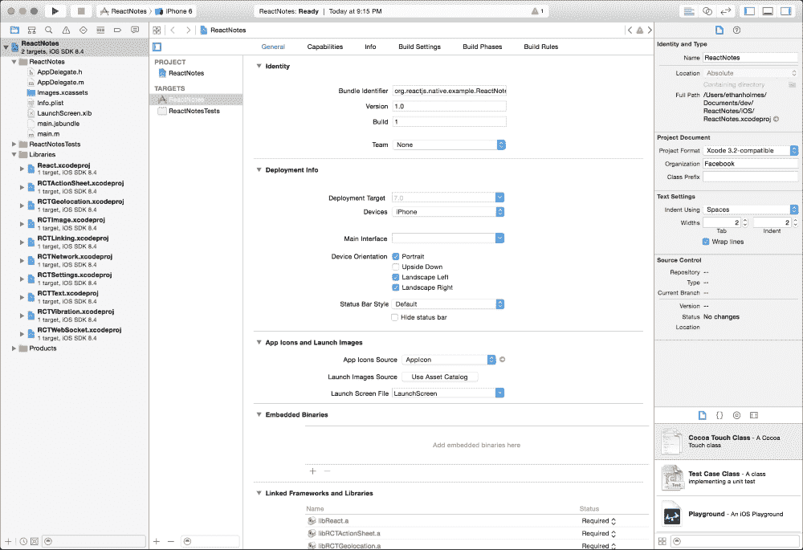
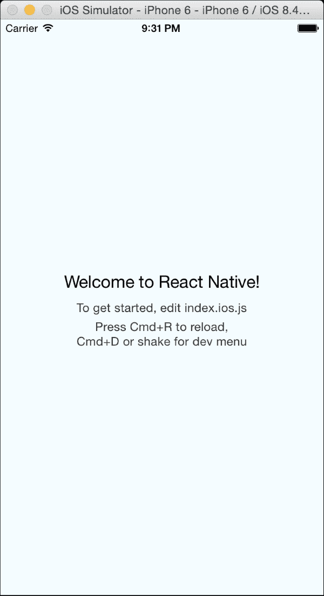
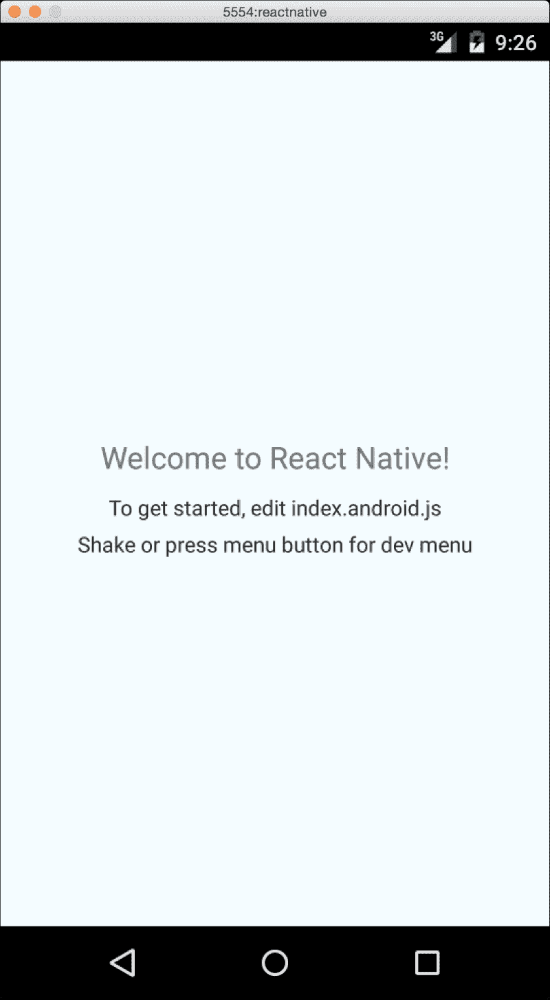
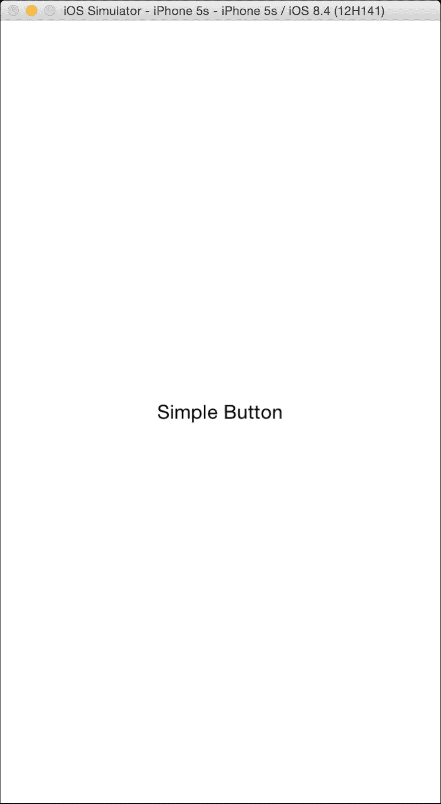
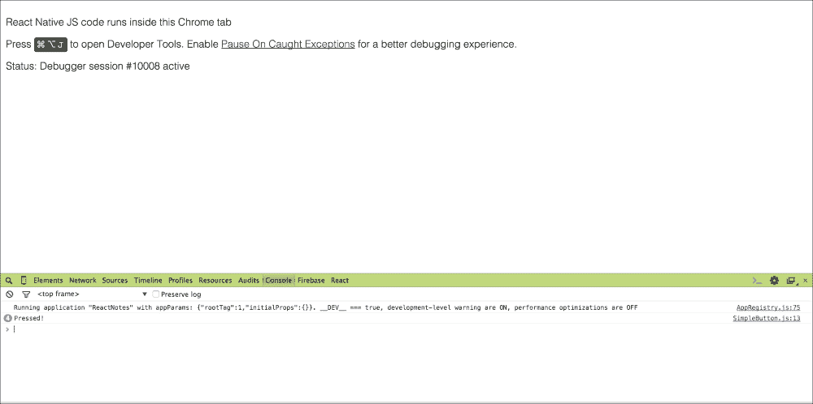
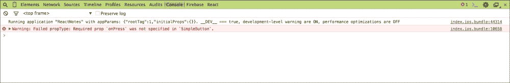
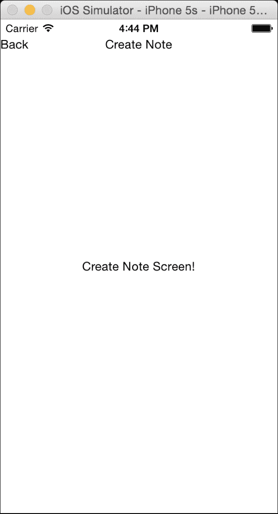
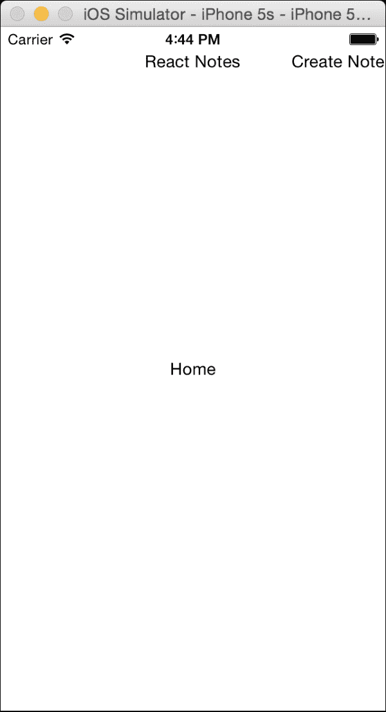
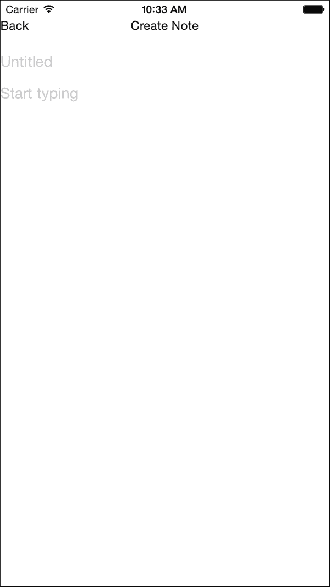

# 第三章。从示例应用程序开始

现在你已经了解了 React Native 的工作原理以及如何创建组件，让我们创建你的第一个 React Native 应用程序。在整个书中，我们将开发一个记事应用，我们将其称为 **ReactNotes**。到书末，你将拥有一个功能齐全的应用程序，允许你创建笔记、将它们保存到设备上、查看已保存的笔记列表、使用设备拍照并将照片附加到笔记中，等等。

在本章中，我们将构建应用程序的框架，创建 `HomeScreen` 和 `NoteScreen`。我们还将添加导航，允许你在屏幕之间切换，在这个过程中，你将学习如何创建自己的组件和处理事件。

本章我们将涵盖的主题包括：

+   如何生成 iOS 和 Android 项目文件

+   检查 React Native 入门模板

+   创建第一个组件，`SimpleButton`

+   使用 Chrome 开发者工具进行调试

+   探索导航和屏幕间切换

+   开发创建笔记的 UI

# 生成项目

要开始构建我们的 iOS 记事应用，我们需要一些命令行工具。

+   React Native 0.14.2 需要 **Node.js v4+**，我们将使用 v5.0.0；访问 [`nodejs.org`](https://nodejs.org) 获取更多信息（我们建议使用 NVM [`github.com/creationix/nvm`](https://github.com/creationix/nvm) 管理不同的 node 版本）

+   从 [`www.npmjs.com/`](https://www.npmjs.com/) 安装最新版本的 NPM

太好了，现在我们有了这些工具，我们可以安装 `react-native-cli`。`react-native-cli` 提供了一个接口，为我们设置新的 React Native 项目：

1.  要安装 `react-native-cli`，请使用 `npm` 命令：

    ```js
    npm install -g react-native-cli

    ```

1.  接下来，我们将使用 `cli` 和 `react-native init` 命令生成一个名为 `ReactNotes` 的新 React Native 项目。命令的输出类似于以下内容：

    ```js
    $ react-native init ReactNotes

    ```

    这将指导你创建一个位于 `/Users/ethanholmes/ReactNotes` 的新 React Native 项目。

1.  在 `/Users/ethanholmes/ReactNotes` 中设置一个新的 React Native 应用：

    ```js
      create .flowconfig
      create .gitignore
      create .watchmanconfig
      create index.ios.js
      create index.android.js
      create ios/main.jsbundle
      create ios/ReactNotes/AppDelegate.h
      create ios/ReactNotes/AppDelegate.m
      create ios/ReactNotes/Base.lproj/LaunchScreen.xib
      create ios/ReactNotes/Images.xcassets/AppIcon.appiconset/Contents json
      create ios/ReactNotes/Info.plist
      create ios/ReactNotes/main.m
      create ios/ReactNotesTests/ReactNotesTests.m
      create ios/ReactNotesTests/Info.plist
      create ios/ReactNotes.xcodeproj/project.pbxproj
      create ios/ReactNotes.xcodeproj/xcshareddata/xcschemes/ReactNotes.xcscheme
      create android/app/build.gradle
      create android/app/proguard-rules.pro
      create android/app/src/main/AndroidManifest.xml
      create android/app/src/main/res/values/strings.xml
      create android/app/src/main/res/values/styles.xml
      create android/build.gradle
      create android/gradle.properties
      create android/settings.gradle
      create android/app/src/main/res/mipmap-hdpi/ic_launcher.png
      create android/app/src/main/res/mipmap-mdpi/ic_launcher.png
      create android/app/src/main/res/mipmap-xhdpi/ic_launcher.png
      create android/app/src/main/res/mipmap-xxhdpi/ic_launcher.png
      create android/gradle/wrapper/gradle-wrapper.jar
      create android/gradle/wrapper/gradle-wrapper.properties
      create android/gradlew
      create android/gradlew.bat
      create android/app/src/main/java/com/reactnotes/MainActivity.java
    ```

    要在 iOS 上运行你的应用：

    ```js
       Open /Users/ethanholmes/ReactNotes/ios/ReactNotes.xcodeproj in Xcode
       Hit Run button
    ```

    要在 Android 上运行你的应用：

    ```js
       Have an Android emulator running, or a device connected
       cd /Users/ethanholmes/ReactNotes
       react-native run-android
    ```

    `Xcode` 项目的 `root` 目录在 `ReactNotes` 文件夹中生成，其名称与我们运行 `react-native-cli` 命令时给出的名称相同。查看 React Native 设置步骤的末尾，以了解它产生的结果。

## Xcode 和 iOS 模拟器

我们将首先通过 Xcode 在 iOS 模拟器中运行入门模板：

1.  在 Xcode 中，选择 `文件` | `打开` 并导航到 `ReactNotes` 文件夹。

1.  打开 `ReactNotes.xcodeproj` 文件，如图所示：

1.  点击 **运行**（或 *Cmd* + *R*）在 iOS 模拟器中运行应用程序，以下截图将显示：

    就这样，我们已经在 iOS 模拟器上成功运行了 React Native 模板！

## Android SDK 和模拟器

Facebook 在 Android SDK 和模拟器上有一个详细的分步指南。您可以在 [`facebook.github.io/react-native/docs/android-setup.html`](https://facebook.github.io/react-native/docs/android-setup.html) 访问 React Native 文档。在本节中，我们只介绍在 Android 模拟器上运行应用程序的基本知识。

当在 iOS 模拟器中运行项目时，我们可以从 Xcode IDE 中运行它。另一方面，Android 不需要特定的 IDE，可以直接从命令行启动。

要将 `android apk` 安装到模拟器，请使用以下命令：

```js
$ react-native run-android

```

下面的截图将生成：



让我们从修改启动模板的内容并显示不同的消息开始。

## 修改 React Native 启动模板

在文本编辑器中打开位于根目录中的 `index.ios.js`。以下是 `react-native-cli` 生成的代码：

```js
/**
 * Sample React Native App
 * https://github.com/facebook/react-native
 */
'use strict';

var React = require('react-native');
var {
  AppRegistry,
  StyleSheet,
  Text,
  View,
} = React;

var ReactNotes = React.createClass({
  render: function() {
    return (
      <View style={styles.container}>
        <Text style={styles.welcome}>
          Welcome to React Native!
        </Text>
        <Text style={styles.instructions}>
          To get started, edit index.ios.js
        </Text>
        <Text style={styles.instructions}>
          Press Cmd+R to reload,{'\n'}
          Cmd+D or shake for dev menu
        </Text>
      </View>
    );
  }
});

var styles = StyleSheet.create({
  container: {
    flex: 1,
    justifyContent: 'center',
    alignItems: 'center',
    backgroundColor: '#F5FCFF',
  },
  welcome: {
    fontSize: 20,
    textAlign: 'center',
    margin: 10,
  },
  instructions: {
    textAlign: 'center',
    color: '#333333',
    marginBottom: 5,
  },
});

AppRegistry.registerComponent('ReactNotes', () => ReactNotes);
```

### 注意

虽然 `react-native-cli` 使用 ES5 的 `createClass` 生成启动模板，但我们将使用 ES6 类来创建我们的组件。

这里包含了很多内容，但请耐心等待，我们将为您逐一解释。如果我们仔细查看渲染方法，我们可以看到我们在上一章中遇到的熟悉的 `View` 和 `Text` 组件。注意索引文件本身就是一个组件（`ReactNotes`）。将第 30 行的值更改为 `Welcome to React Notes!`。保存后，然后从模拟器中按 *Cmd* + *R*，或者在顶部菜单中导航到 **硬件** | **摇动手势**，并从弹出操作表中选择 **重新加载**。屏幕上的文本重新渲染以显示我们刚刚修改的文本！我们不再受限于等待 Xcode 重新编译才能看到我们的更改，因为我们可以直接从模拟器中重新加载。继续进行更改，并在模拟器中重新加载以获得工作流程的感觉。

# 应用程序的架构

是时候给我们的应用程序添加一点交互性了。您可以从向屏幕添加一个可触摸的简单按钮组件开始。在根目录中创建一个名为 `App` 的文件夹，并在 `App` 文件夹内创建一个名为 `Components` 的文件夹。在 `Components` 目录中添加一个名为 `SimpleButton.js` 的文件。这将是我们存储和引用创建的组件的目录。

### 注意

注意，本章中创建的 React Native 代码将适用于 iOS 和 Android。如果您只对 Android 感兴趣，只需将 `index.ios.js` 替换为 `index.android.js`。截图和说明将主要针对 iOS 模拟器。

## 创建 SimpleButton 组件

让我们从将一些文本渲染到屏幕并将它导入到我们的 `index.ios.js` 文件开始。在 `SimpleButton.js` 中添加：

```js
import React, {
    Text,
    View
} from 'react-native';

export default class SimpleButton extends React.Component {
  render () {
    return (
      <View>
        <Text>Simple Button</Text>
      </View>
    );
  }
}
```

### 注意

ES6 解构赋值 `var [a, b] = [1, 2];` 用于从 React Native 模块中提取 `Text` 和 `View`。

我们将把新创建的组件包含到 `index.ios.js` 中，并将其简化为 ES6 语法：

```js
import React, {
  AppRegistry,
  StyleSheet,
  View
} from 'react-native';

import SimpleButton from './App/Components/SimpleButton';

class ReactNotes extends React.Component {
  render () {
    return (
      <View style={styles.container}>
        <SimpleButton />
      </View>
    );
  }
}

var styles = StyleSheet.create({
  container: {
    flex: 1,
    justifyContent: 'center',
    alignItems: 'center',
  }
});
AppRegistry.registerComponent('ReactNotes', () => ReactNotes);
```

上一段代码的输出结果为：



我们已经取得了良好的开端；现在是时候给我们的按钮添加一些交互性了。在 `SimpleButton.js` 中，将 `TouchableOpacity` 组件添加到解构赋值中。`TouchableHighlight`、`TouchableOpacity` 和 `TouchableWithoutFeedback` 是响应触摸的类似组件，它们需要一个 `onPress` 属性来执行触摸时的响应。将现有代码包裹在渲染函数中的 `TouchableOpacity` 组件内：

```js
  import React, {
  Text,
  TouchableOpacity,
  View
} from 'react-native';

export default class SimpleButton extends React.Component {
  render () {
    return (
      <TouchableOpacity onPress={() => console.log('Pressed!')}>
        <View>
          <Text>Simple Button</Text>
        </View>
      </TouchableOpacity>
    );
  }
}
```

现在尝试点击（或单击）文本，你应该能够看到当你按下它时文本的透明度降低。但我们的 `console.log(…)` 输出到哪里去了？打开 **开发者** 菜单（**硬件** | **摇动手势**）并在 Chrome 中选择 **调试**。这将打开一个 Chrome 窗口，地址为 `localhost:8081/debugger-ui`，用于调试，如下面的截图所示：



嘿，看这里，这是我们 `SimpleButton` 组件中指定的控制台日志。幕后，JavaScript 代码在 Chrome 标签页中运行，并在启动或重新加载时加载到移动设备上。从这里，你可以访问你通常使用的所有 Chrome 开发者工具，包括添加断点。

# 导航

现在，是时候让我们的应用程序更具行动力了。让我们首先将 `SimpleButton` 转换为“创建笔记”按钮。当用户点击“创建笔记”按钮时，它会将用户过渡到另一个屏幕来创建笔记。为此，我们需要我们的按钮能够通过 `index.ios.js` 的 props 接受一个函数来激活过渡。我们还将添加一些自定义文本以增加额外的魅力：

```js
  import React, {
  Text,
  TouchableOpacity,
  View
} from 'react-native';

export default class SimpleButton extends React.Component {
  render () {
    return (
      <TouchableOpacity onPress={this.props.onPress}>
        <View>
          <Text>{this.props.customText || 'Simple Button'}</Text>
        </View>
      </TouchableOpacity>
    );
  }
}

SimpleButton.propTypes = {
  onPress: React.PropTypes.func.isRequired,
  customText: React.PropTypes.string
};
```

现在，我们已经将我们的 `SimpleButton` 组件扩展为可重用，只需进行最小改动。我们总是可以通过 `onPress` 属性传递不同的函数，并且如果我们选择的话，还可以添加自定义文本。这就是我们需要修改 `SimpleButton` 的全部内容；现在要将过渡功能包含到我们的 `index.io.js` 文件中。

以下图像显示了重新访问验证 props 的页面：



### 小贴士

记得上一章中的 `propTypes` 吗？如果我们忘记传递 `onPress` 属性，控制台将记录一个警告，提醒我们传递它。注意，对于 `customText` 没有警告，因为它没有被设置为 `isRequired`。

## 导航组件

**Navigator**组件是 React Native 提供的`UINavigationController`的重实现，用于管理各种屏幕。类似于堆栈，你可以在导航器上推送、弹出和替换路由。它在 iOS 和 Android 上都是完全可定制的，我们将在下一章中介绍。将导航器导入到`index.ios.js`中，并用以下内容替换`render`方法的内容：

```js
import React, {
  AppRegistry,
  Navigator,
  StyleSheet,
  View
} from 'react-native';

render () {
  return (
    <Navigator
      initialRoute={{name: 'home'}}
      renderScene={this.renderScene}
    />
  );
}
```

导航器接收一个名为`initialRoute`的属性，它接受一个对象，作为第一个要放入堆栈的路由。路由对象可以包含你需要传递给屏幕组件的任何属性。我们现在只需要过渡到我们想要屏幕的名称。接下来，我们需要创建传递给`renderScene`属性的`function`。在`ReactNotes`组件中，我们将创建一个接受`route`和`navigator`作为参数的`function`，如下所示：

```js
class ReactNotes extends React.Component {
  renderScene (route, navigator) {
     ...
  }
  render () {
    ...
  }
}
```

当我们首次加载应用程序时，参数`route`将是传递到`initialRoute`的对象。使用`switch`语句并查看`route.name`的值，我们可以选择我们想要渲染的组件：

```js
renderScene (route, navigator) {
  switch (route.name) {
    case 'home':
      return (
        <View style={styles.container}>
          <SimpleButton
            onPress={() => console.log('Pressed!')}
            customText='Create Note'
          />
        </View>
      );
    case 'createNote':
  }
}
```

在这里，在`home`情况下，你可以看到我们从`ReactNotes`中的原始`render`方法稍作修改的代码；我们包含了之前创建的`onPress`和`customText`属性。你可以在`App/Componets/`下添加另一个名为`NoteScreen.js`的组件；这个屏幕将包含创建新笔记的功能：

```js
import React, {
  StyleSheet,
  Text,
  View
} from 'react-native';

export default class NoteScreen extends React.Component {
  render () {
    return (
      <View style={styles.container}>
        <Text>Create Note Screen!</Text>
      </View>
    );
  }
}

var styles = StyleSheet.create({
  container: {
    flex: 1,
    justifyContent: 'center',
    alignItems: 'center',
  }
});
```

目前，我们只会在点击**创建笔记**按钮时使用这个屏幕。在`onPress`属性的箭头函数中，我们将使用`navigator.push`将一个新的路由推送到堆栈：

```js
import NoteScreen from './App/Components/NoteScreen';

class ReactNotes extends React.Component {
  renderScene (route, navigator) {
    switch (route.name) {
      case 'home':
        return (
          <View style={styles.container}>
            <SimpleButton
              onPress={() => {
                navigator.push({
                  name: 'createNote'
                });
              }}
              customText='Create Note'
            />
          </View>
        );
      case 'createNote':
        return (
            <NoteScreen />
        );
    }
  }
```

注意，`push`也接受一个常规的 JavaScript 对象，因此我们需要为我们的`NoteScreen`包含名称属性；在模拟器中重新加载应用程序并点击**创建笔记**按钮。两个屏幕之间将发生平滑的动画过渡，而无需添加任何额外的代码。

### Navigator.NavigationBar

到目前为止，你可能正在想*按钮是可以的，但是有没有更好的、更原生的方式来处理导航？*当然，作为导航组件的一部分，你可以传递一个`navigationBar`属性来在每一个屏幕上添加一个持久的顶部导航栏。`Navigator.NavigationBar`是一个子组件，它接受一个定义左侧和右侧按钮、标题和样式的对象（尽管我们将在下一章将其设置为`unstyled`）。修改`ReactNotes`的`render`函数以包含`navigationBar`，如下所示：

```js
render () {
  return (
    <Navigator
      initialRoute={{name: 'home'}}
      renderScene={this.renderScene}
      navigationBar={
        <Navigator.NavigationBar
          routeMapper={NavigationBarRouteMapper}
        />
      }
    />
  );
}
```

`routeMapper`属性接受一个包含`LeftButton`、`RightButton`和`Title`属性函数的对象。让我们在`index.ios.js`顶部的导入之后插入这个对象：

```js
var NavigationBarRouteMapper = {
  LeftButton: function(route, navigator, index, navState) {
    ...
  },

  RightButton: function(route, navigator, index, navState) {
    ...
  },

  Title: function(route, navigator, index, navState) {
    ...
  }
};
```

将我们的应用程序流程推进到`CreateNote`屏幕将需要显示导航栏中的右侧按钮。幸运的是，我们已经有了一个简单的按钮设置，可以将状态推送到导航器。在`RightButton`函数中添加：

```js
var NavigationBarRouteMapper = {
  ...

  RightButton: function(route, navigator, index, navState) {
    switch (route.name) {
      case 'home':
        return (
          <SimpleButton
            onPress={() => {
              navigator.push({
                name: 'createNote'
              });
            }}
            customText='Create Note'
          />
        );
      default:
         return null;
    }
  },

  ...
};
```

与我们之前的`renderScene`方法类似，我们可以根据`route.name`的值进行切换。`switch`语句中的默认表达式是为了确保除非我们包含它们，否则不同的屏幕不会返回按钮。让我们还添加一个`LeftButton`到`NavigationBar`，当它在`NoteScreen`上时，以便返回主页。

```js
var NavigationBarRouteMapper = {
  LeftButton: function(route, navigator, index, navState) {
    switch (route.name) {
      case 'createNote':
        return (
          <SimpleButton
            onPress={() => navigator.pop()}
            customText='Back'
           />
        );
      default:
        return null;
    }
  },

  ...
};
```

`navigator.pop()`将移除栈顶的路由；因此，返回到我们的原始视图。最后，为了添加标题，我们在`Title`属性函数中做完全相同的事情：

```js
var NavigationBarRouteMapper = {
  ...

  Title: function(route, navigator, index, navState) {
    switch (route.name) {
      case 'home':
        return (
          <Text>React Notes</Text>
        );
      case 'createNote':
        return (
          <Text>Create Note</Text>
        );
    }
  }
};
```

现在，让我们更新原始的`renderScene`函数，以移除按钮并包含主页作为组件。创建一个新的组件叫做`HomeScreen`；这个屏幕的内容现在不会很重要，因为我们稍后会回到它：

```js
import React, {
  StyleSheet,
  Text,
  View
  } from 'react-native';
export default class HomeScreen extends React.Component {
  render () {
    return (
      <View style={styles.container}>
        <Text>Home</Text>
      </View>
    );
  }
}
var styles = StyleSheet.create({
  container: {
    flex: 1,
    justifyContent: 'center',
    alignItems: 'center',
  }
});
```

然后将其导入到`index.ios.js`或`index.android.js`：

```js
import HomeScreen from './App/Components/HomeScreen';

...

class ReactNotes extends React.Component {
  renderScene (route, navigator) {
    switch (route.name) {
      case 'home':
        return (
          <HomeScreen />
        );
      case 'createNote':
        return (
          <NoteScreen />
        );
    }
  }

  ...

}
```

现在，让我们看看导航栏是如何在每个路由中保持一致的：



就这样！重新加载并查看静态导航栏是如何在每个路由中保持一致的：



要获取关于 Navigator 的更详细指南，请查看 React Native 文档[`facebook.github.io/react-native/docs/navigator.html`](https://facebook.github.io/react-native/docs/navigator.html)。我们现在有了适当的基础设施，可以开始向我们的应用程序添加创建笔记的功能。

## NoteScreen – 第一次尝试

现在我们有了`NoteScreen`并且可以导航到它，让我们开始让它变得有用。我们需要添加一些`TextInput`组件，一个用于笔记的标题，一个用于捕获正文。我们希望自动将焦点设置在标题的`TextInput`上，以便用户可以立即开始输入。我们需要监听`TextInput`组件上的事件，以便通过更新状态来跟踪用户输入的内容。我们还希望知道用户何时完成了笔记标题的编辑，这样我们就可以自动将焦点设置在正文的`TextInput`上。

首先，让我们将`TextInput`组件添加到我们的依赖列表中，并移除不再需要的`Text`组件：

```js
import React, {
  StyleSheet,
  TextInput,
  View
}from 'react-native';
```

在我们将`TextInput`组件添加到`View`之前，让我们先处理一些样式更新：

```js
var styles = StyleSheet.create({
  container: {
    flex: 1,
    justifyContent: 'center',
    alignItems: 'center',
    marginTop: 64
  },
  title: {
    height: 40
  },
  body: {
    flex: 1
  }
});
```

注意，我们在容器中添加了`marginTop: 64`。这很重要，因为我们想确保`NavigationBar`不会意外地拦截我们希望`TextInput`接收的`onPress`事件。我们还为即将添加的每个`TextInput`添加了样式。我们将在第四章中更详细地讨论样式，*使用样式和布局*。

现在，在我们的渲染函数中，让我们将`Text`组件替换为两个`TextInput`组件，例如：

```js
render () {
  return (
    <View style={styles.container}>
      <TextInput placeholder="Untitled"
        style={styles.title}/>
      <TextInput multiline={true}placeholder="Start typing" style={styles.body}/></View>
  );
}
```

在我们尝试之前，请注意 `TextInput` 组件有一个占位符属性，它允许我们告诉用户 `TextInput` 的用途，而无需通过标签我们的表单字段来占用额外的屏幕空间。我还在第二个 `TextInput` 上指定了 `multiline={true}`，以便用户可以添加他们想要的任意多的文本。

现在，让我们在模拟器中刷新应用程序，你应该会看到类似这样的内容：



您应该能够点击进入 `TextInput` 并开始输入。如果您想在模拟器中使用可用的屏幕键盘，可以按 *Cmd*+*K* / *Ctrl*+*K*。

让我们通过使标题 `TextInput` 自动聚焦并显示键盘，当用户导航到 `NoteScreen` 时来稍微提升用户体验：

```js
<TextInput
  ref="title"
  autoFocus={true}
  placeholder="Untitled"
 style={styles.title}
/>
```

为了更加用户友好，让我们监听一个事件，告诉我们用户已经完成了标题的编辑，并自动将焦点设置在主体 `TextInput` 上。为此，我们需要对主体 `TextInput` 进行一些小的修改，以便我们可以在事件处理器中引用它：

```js
<TextInput
  ref="body"
  multiline={true}
  placeholder="Start typing"
  style={styles.body}
/>
```

注意 `ref="body"`。任何 React 组件都可以被赋予一个 `ref`，以便在您的 `javascript` 代码中引用。现在，在标题 `TextInput` 中，我们可以添加一个 `onEndEditing` 事件处理器，以便将焦点设置在 `TextInput` 的主体上：

```js
<TextInput
  autoFocus={true}
  placeholder="Untitled"
  style={styles.title}
  onEndEditing={(text) => {this.refs.body.focus()}}
  />
```

### 注意

避免在组件上使用 `refs` 来设置和获取值！那是 `state` 的用途，我们将在第五章 显示和保存数据中学习所有关于 `state` 的内容。

现在，当您在模拟器中刷新应用程序并导航到 `NoteScreen` 时，您将看到标题 `TextInput` 有焦点，并且您应该能够输入一些内容。按 *Enter* 键，您会看到焦点自动切换到主体，并开始在那里输入。如果您在尝试此操作时没有看到屏幕键盘，请按 *Cmd* + *K* / *Ctrl* + *K* 并再次尝试。

# 摘要

在本章中，我们创建了 `ReactNotes` 应用程序的骨架，向您介绍了如何创建新项目，创建了 `Views` 和自定义组件，在 `HomeScreen` 和 `NoteScreen` 之间导航，并调试了您的应用程序。

您现在已经为我们将在本书的其余部分介绍的所有主题打下了坚实的基础。然而，这个应用程序有两个大问题，它不够美观，而且没有任何功能！在接下来的两个章节中，我们将解决这两个问题，您将朝着掌握 React Native 的道路迈进！
