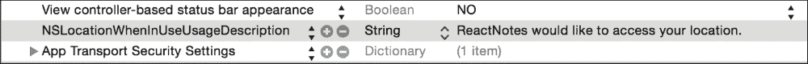
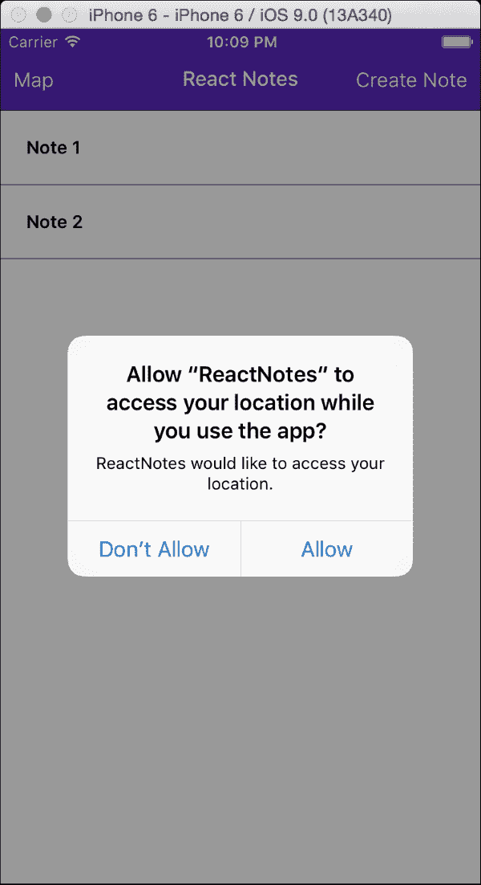
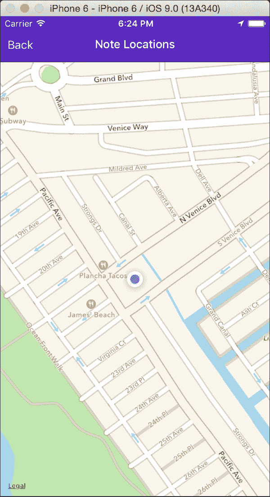
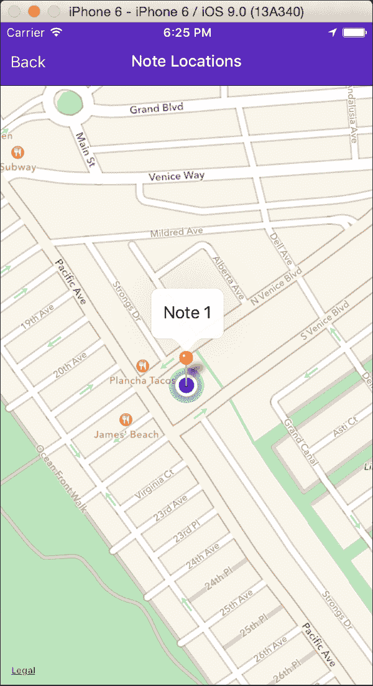
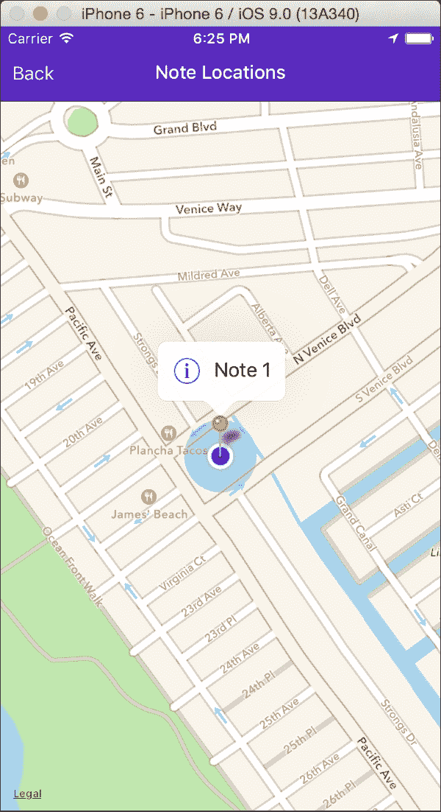

# 第六章：使用地理位置和地图

到目前为止，你已经看到 React Native 简化了原生 UI 组件的创建，例如列表、文本字段和按钮，并且它提供了简单的抽象，例如 AsyncStorage，以便与底层原生 API 一起工作。很快，你将看到你还可以访问更高级的组件，例如使用`MapView`组件的地图，以及你可以访问更高级的原生功能，例如使用 React Native 的地理位置 API 进行地理位置定位。我们将通过添加捕获和保存每个新笔记的当前 GPS 坐标的能力来展示这些功能。请注意，接下来的两个章节将专注于 iOS 开发，因为 Android 的功能集尚不完整。

在本章中，我们将涵盖以下主题：

+   学习如何获取当前地理位置

+   监听用户位置的变化

+   确保我们的应用程序需要适当的权限

+   将位置数据与每个笔记一起保存

+   在`MapView`上显示所有笔记的原始位置

让我们开始吧！

# 介绍地理位置 API

React Native 在原生地理位置 API 上提供了一个易于使用的抽象。它遵循**MDN**（**Mozilla 开发者网络**）规范，该规范建议以下地理位置接口：

```js
navigator.geolocation.getCurrentPosition(success, error, options)
```

此方法`异步`请求设备的当前位置，如果成功，将使用`Position`对象调用`success`回调，如果失败（通常是由于您的应用程序中权限配置不当或用户明确拒绝允许您的应用程序知道他们的位置），将调用`error`回调。`options`参数允许您请求更高的位置精度，定义您愿意等待响应的时间长度，并指定您愿意接受的缓存数据的最大年龄：

```js
navigator.geolocation.watchPosition(success, error, options)
```

此功能允许您注册一个函数，每次位置变化时都会调用该函数。此函数返回一个整数，表示您注册的回调的`id`。这允许您通过调用以下代码来停止监听更新：

```js
navigator.geolocation.clearWatch(id);
```

## iOS 中的位置权限

在我们将地理位置集成到我们的笔记之前，我们需要配置一个权限来请求用户的位置。从 Xcode 中打开`info.plist`，确保`NSLocationWhenInUseUsageDescription`键位于文件中（默认情况下应该已启用）：



一旦应用程序启动，你应该会在屏幕中央自动弹出一个权限模态：



# 使用地理位置标记笔记

让我们尝试地理位置，并在用户保存新笔记时开始捕获用户的位置。由于我们将在保存笔记时使用位置数据，我们将把我们的代码添加到`index.ios.js`或`index.android.js`中的`ReactNotes`组件中。让我们首先添加一个名为`trackLocation()`的函数：

```js
class ReactNotes extends React.Component {
  trackLocation() {
    navigator.geolocation.getCurrentPosition(
      (initialPosition) => this.setState({initialPosition}),
      (error) => alert(error.message)
    );
    this.watchID = navigator.geolocation.watchPosition((lastPosition) => {
      this.setState({lastPosition});
    });
  }

 …
}
```

在这里，我们调用`getCurrentPosition`并提供一个回调，该回调将使用设备返回的位置信息更新当前状态。如果出现问题，我们还提供了一个错误处理器。

接下来，我们使用`watchPosition()`来注册一个事件处理器，当用户的位置发生变化时将被调用。我们还保存从这次调用返回的`watchId`，这样我们就可以在组件卸载时停止监听。通常，在`componentWillUnmount`函数中清除您在构造函数或`componentDidMount`方法中最初设置的任何监听器是良好的实践：

```js
class ReactNotes extends React.Component {
  componentWillUnmount() {
    navigator.geolocation.clearWatch(this.watchID);
  }
  trackLocation() {
    …
  }
 …
}
```

然后，我们将从构造函数中调用我们的`trackLocation()`函数，并添加一些带有位置数据的笔记到我们的初始状态中：

```js
class ReactNotes extends React.Component {
  constructor (props) {
    super(props);
    StatusBarIOS.setStyle('light-content');

    this.state = {
      notes: {
        1: {
          title: "Note 1",
          body: "body",
          id: 1,
          location: {
            coords: {
              latitude: 33.987,
              longitude: -118.47
            }
          }
        },
        2: {
          title: "Note 2",
          body: "body",
          id: 2,
          location: {
            coords: {
              latitude: 33.986,
              longitude: -118.46
            }
          }
        }
      }
    };

    this.loadNotes();
    this.trackLocation();
  }
```

将位置数据与笔记一起保存需要对我们的`updateNote()`函数进行一些小的调整：

```js
  updateNote(note) {
    var newNotes = Object.assign({}, this.state.notes);

    if (!note.isSaved) {
      note.location = this.state.lastPosition;
    }

    note.isSaved = true;
    newNotes[note.id] = note;
    this.setState({notes:newNotes});
    this.saveNotes(newNotes);
  }
```

这就是全部内容！重新加载应用，创建一个新的笔记，当笔记第一次保存时，GPS 坐标将被存储。但是，我们如何可视化与每个笔记关联的位置数据呢？让我们创建一个`MapView`来显示每个笔记的标记！

地理定位的完整文档可以在 React Native 文档中找到，网址为[`facebook.github.io/react-native/docs/geolocation.html`](https://facebook.github.io/react-native/docs/geolocation.html)。

# NoteLocationScreen

现在，由于我们在创建笔记时捕获了用户的位置，我们希望以有用的方式显示此信息。位置数据与在地图 UI 上显示笔记完美匹配。这样用户可以直观地看到他们创建的所有笔记。我们将创建一个新的组件`NoteLocationScreen`来存放我们的笔记位置，但在编写此屏幕的代码之前，让我们先添加导航。

在主页面上，我们希望在`navbar`中有一个**地图**按钮以过渡到`NoteLocationScreen`。更新`NavigationBarRouteMapper`中的`LeftButton`和`Title`如下：

```js
var NavigationBarRouteMapper = {
  LeftButton: function(route, navigator, index, navState) {
    switch (route.name) {
      case 'home':
        return (
          <SimpleButton
            onPress={() => navigator.push({name: 'noteLocations'})}
            customText='Map'
            style={styles.navBarLeftButton}
            textStyle={styles.navBarButtonText}
           />
        );
      case 'createNote':
      case 'noteLocations':
        return (
          <SimpleButton
            onPress={() => navigator.pop()}
            customText='Back'
            style={styles.navBarLeftButton}
            textStyle={styles.navBarButtonText}
           />
        );
      default:
        return null;
    }
  },
  ...

  Title: function(route, navigator, index, navState) {
    switch (route.name) {
      case 'home':
        return (
          <Text style={styles.navBarTitleText}>React Notes</Text>
        );
      case 'createNote':
        return (
          <Text style={styles.navBarTitleText}>{route.note ? route.note.title : 'Create Note'}</Text>
        );
      case 'noteLocations':
        return (
          <Text style={styles.navBarTitleText}>Note Locations</Text>
        );
    }
  }
}
```

在这里，我们正在定义一个新的路由，称为`noteLocations`。请注意，我们还想在`noteLocation`路由上显示`返回`按钮，因此我们包括与`createNote`路由相同的案例。

如果您还没有这样做，请向`App/Components/`添加一个新的`NoteLocationScreen.js`文件，并将其导入到`ReactNotes`中。我们最后需要做的是将其包含在我们的`renderScene`函数中。我们将将其传递给`NoteLocationScreen`的笔记列表和相同的`onSelectNote`函数：

```js
import NoteLocationScreen from './App/Components/NoteLocationScreen';

...

class ReactNotes extends React.Component {
  ...

  renderScene(route, navigator) {
    switch (route.name) {
      case 'home':
        return (
          <HomeScreen navigator={navigator} notes={_(this.state.notes).toArray()} onSelectNote={(note) => navigator.push({name:"createNote", note: note})} />
        );
      case 'createNote':
        return (
          <NoteScreen note={route.note} onChangeNote={(note) => this.updateNote(note)} />
        );
      case 'noteLocations':
        return (
          <NoteLocationScreen notes={this.state.notes} onSelectNote={(note) => navigator.push({name:"createNote", note: note})} />
        );
    }
  }

  ...

}
```

## MapView

MapView 是 React Native 提供的另一个组件，用于显示每个平台对应的地图：iOS 上的 Apple Maps 和 Android 上的 Google Maps。您可以从将`MapView`添加到`NoteLocationScreen`开始：

```js
import React, {
  MapView,
  StyleSheet
} from 'react-native';

export default class NoteLocationScreen extends React.Component {
  render () {
    return (
      <MapView
        showsUserLocation={true}
        style={styles.map}
      />
    );
  }
}

var styles = StyleSheet.create({
  map: {
    flex: 1,
    marginTop: 64
  }
});
```



### Note

如果在 iOS 上地图没有显示您的位置，您可能需要在模拟器中启用位置。通过导航到**调试** | **位置** | **自定义位置**来设置自定义位置。

`showsUserLocation`函数将放大并显示用户在地图上的位置；默认情况下，此值是`false`。接下来，我们想要收集所有笔记的位置，以便使用注释在地图上显示它们。注释格式接受一个包含`longitude`、`latitude`、一些`title`信息以及`on` `press`属性的对象。我们将遍历通过 props 传入的笔记列表并提取位置数据。然后，将注释列表传递给 MapView 的`annotations`属性：

```js
export default class NoteLocationScreen extends React.Component {
  render () {
    var locations = _.values(this.props.notes).map((note) => {
      return {
        latitude: note.location.coords.latitude,
        longitude: note.location.coords.longitude,
        title: note.title
      };
    });

    return (
      <MapView
        annotations={locations}
        showsUserLocation={true}
        style={styles.map}
      />
    );
  }
}
```



我们还可以通过向注释中添加一个`按下时调用`函数来添加查看笔记的功能。`按下时调用`方法将调用我们传入的`onNoteSelect`函数，并过渡到`NoteScreen`。在这里，我们添加一个`左侧调用`：

```js
export default class NoteLocationScreen extends React.Component {
  render () {
    var locations = _.values(this.props.notes).map((note) => {
      return {
        latitude: note.location.coords.latitude,
        longitude: note.location.coords.longitude,
        hasLeftCallout: true,
        onLeftCalloutPress: this.props.onSelectNote.bind(this, note),
        title: note.title
      };
    });

  ...

}
```



查阅 React Native 文档以获取有关`MapView`的更多详细信息，请访问[`facebook.github.io/react-native/docs/mapview.html`](https://facebook.github.io/react-native/docs/mapview.html)。

# 摘要

在本章中，我们探索了更多 React Native 的内置组件和模块，以捕获特定于设备的地理位置数据。地理位置 API 为我们提供了机制，该机制挂钩到现有的组件生命周期以跟踪用户位置。通过将其纳入我们现有的保存数据中，我们可以使用经纬度值来显示所有笔记记录的位置地图。
