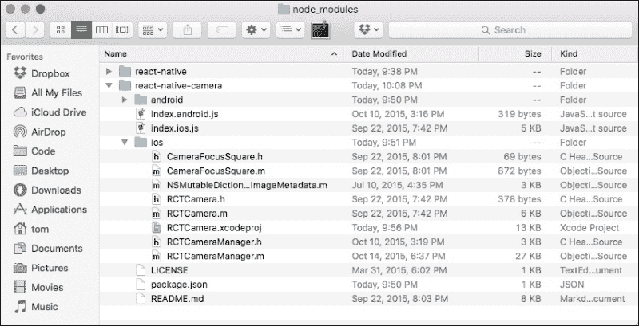
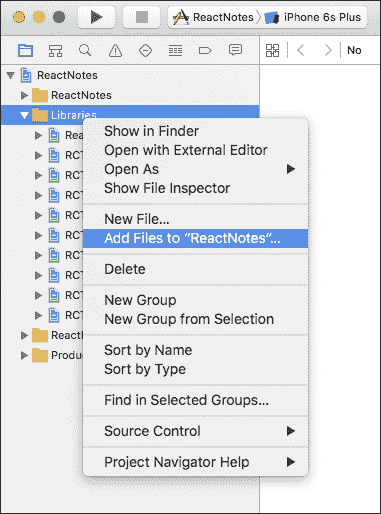
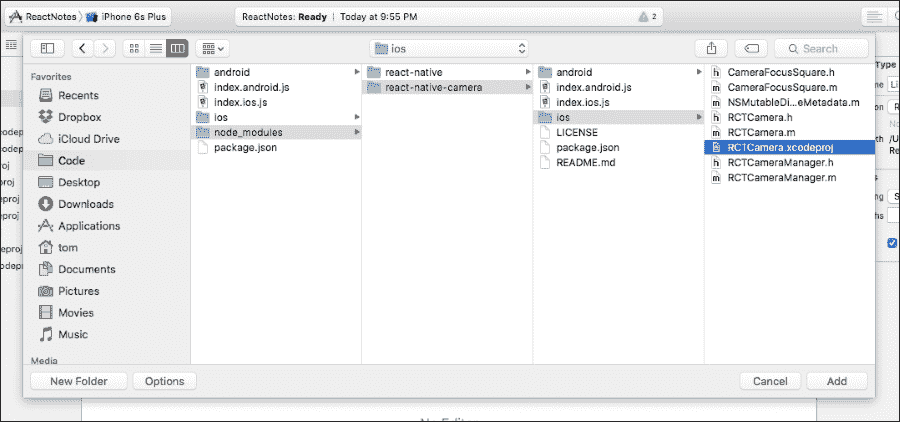
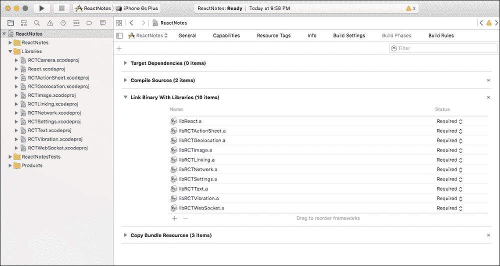
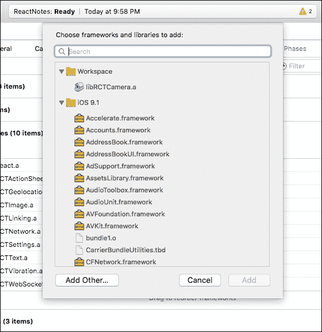
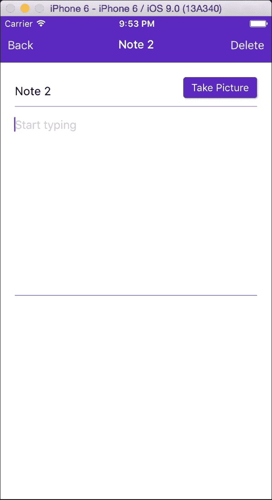

# 第七章。集成原生模块

到目前为止，你已经看到了 React Native 提供了大量开箱即用的功能。它通过 JavaScript 为你提供了一种简单的方法来使用各种原生功能，但有时你可能需要一些内置 React Native 组件尚未覆盖的功能。幸运的是，React Native 通过原生模块完全可扩展。多亏了一个非常活跃的社区，有一长串自定义组件正在填补这些空白。在本章中，我们将使用这些第三方原生模块之一来为我们的 React Notes 应用程序添加相机支持。

在本章中，我们将涵盖以下主题：

+   使用 `npm` 安装自定义 React Native 相机模块

+   添加 `CameraScreen` 和相机组件

+   将捕获的图像保存到磁盘

+   在 `NoteImageScreen` 中显示捕获的图像

# 将图像添加到笔记

我们的笔记应用正在逐步完善，但一张图片胜过千言万语，所以如果我们能拍照并和笔记一起保存，那岂不是很好？由于 React Native 没有内置相机组件，我们需要使用由 *Lochlan Wansbrough* 创建的一个非常流行的组件。源代码可以在以下位置找到：[`github.com/lwansbrough/react-native-camera`](https://github.com/lwansbrough/react-native-camera)。

到目前为止，你很可能已经熟悉了向我们的导航中添加新屏幕。在我们包含原生模块之前，让我们快速编写 `CameraScreen` 的导航代码。在 `NavigationBarRouteMapper` 中，将 `camera` 路由添加到 `LeftButton` 和 `Title` 属性：

```js
var NavigationBarRouteMapper = {
  LeftButton: function(route, navigator, index, navState) {
    switch (route.name) {
      case 'home':
        return (
          <SimpleButton
            onPress={() => navigator.push({name: 'noteLocations'})}
            customText='Map'
            style={styles.navBarLeftButton}
            textStyle={styles.navBarButtonText}
           />
        );
      case 'createNote':
      case 'noteLocations':
      case 'camera':
        return (
          <SimpleButton
            onPress={() => navigator.pop()}
            customText='Back'
            style={styles.navBarLeftButton}
            textStyle={styles.navBarButtonText}
           />
        );
      default:
        return null;
    }
  },

  ...

  Title: function(route, navigator, index, navState) {
    switch (route.name) {
      case 'home':
        return (
          <Text style={styles.navBarTitleText}>React Notes</Text>
        );
      case 'createNote':
        return (
          <Text style={styles.navBarTitleText}>{route.note ? route.note.title : 'Create Note'}</Text>
        );
      case 'noteLocations':
        return (
          <Text style={styles.navBarTitleText}>Note Locations</Text>
        );
      case 'camera':
        return (
          <Text style={styles.navBarTitleText}>Take Picture</Text>
        );
    }
  }
};
```

然后，在 `ReactNotes` 组件中更新 `renderScene` 方法：

```js
class ReactNotes extends React.Component {
  ...

  renderScene(route, navigator) {
    switch (route.name) {
      ...

      case 'createNote':
        return (
          <NoteScreen navigator={navigator} note={route.note} onChangeNote={(note) => this.updateNote(note)} showCameraButton={true} />
        );

      case 'camera':
        return (
          <CameraScreen />
        );
    }
  }

  ...

}
```

我们传递另一个名为 `showCameraButton` 的属性到 `NoteScreen`，我们将在稍后使用它来隐藏 Android 版本的相机按钮。

### 注意

与 Android 版本的 ReactNotes 中的 `showCameraButton` 属性相同，除了值为 `false`，应从 `renderScene` 方法传递给 Android 版本：`showCameraButton={false}`。

# 在 iOS 上安装 react-native-camera

安装 react-native-camera 并将其包含在 `CameraScreen` 中有三个步骤。从命令行导航到 `ReactNotes` 目录，并运行以下命令：

```js
npm install react-native-camera@0.3.8 --save

```

如果你查看 `ReactNotes` 项目的 `node_modules` 目录，你会看到一个名为 `react-native-camera` 的新目录，其中包含模块的 JavaScript 和原生源代码。在 `ios` 子目录中，你会注意到一个名为 `RCTCamera.xcodeproj` 的文件，如下面的截图所示：



我们需要将此文件添加到我们的 Xcode 项目的库中。在 Xcode 项目导航器中，右键单击 **库** 并选择 **将文件添加到 ReactNotes**：



在出现的 Finder 窗口中，导航到**ReactNotes** | **node_modules** | **react-native-camera** | **ios**，选择**RCTCamera.xcodeproj**并点击**Add**：



查看项目导航器中的**库**文件夹，您应该在列表中看到**RCTCamera.xcodeproj**。

接下来，在项目导航器中选择**ReactNotes**，点击**构建阶段**并展开**链接二进制库**部分：



点击**链接二进制库**部分底部的加号，从列表中选择**libRCTCamera.a**，然后点击**Add**：



我们现在可以开始在应用程序中使用相机组件了。

## 搜索原生模块

在我们开始使用相机组件之前，简要说明一下如何自己找到这些模块。寻找开源原生模块的两个最佳位置是 GitHub ([`github.com`](https://github.com)) 或 NPM ([`www.npmjs.com`](https://www.npmjs.com))。在这两个网站上的搜索将为您提供大量由 React Native 社区创建的第三方模块，您可以在项目中使用。

## 使用相机组件

困难的部分已经结束！导入相机模块就像包含任何其他 React 组件一样简单：

```js
import Camera from 'react-native-camera';

```

使用相机组件相当简单。以下是`CameraScreen`的`render`函数：

```js
  render () {
    return (
      <Camera
        captureTarget={Camera.constants.CaptureTarget.disk}
        ref="cam"
        style={styles.container}
      >
        <View style={styles.cameraButtonContainer}>
          <SimpleButton
            onPress={this._takePicture.bind(this)}
            customText="Capture"
            style={styles.cameraButton}
            textStyle={styles.cameraButtonText}
          />
        </View>
      </Camera>
    );
  }
```

相机模块公开了一些 props，您可以使用它们来自定义其行为，但大多数默认值对我们的目的来说都很适用。然而，您会注意到我们设置了`captureTarget`属性为`Camera.constants.CaptureTarget.disk`。此设置将保存的图像放置在设备上的一个目录中，只有我们的`ReactNotes`应用程序可以访问。`captureTarget`属性的默认值是`Camera.constants.CaptureTarget.cameraRoll`，这将图像放置在您拍照时原生相机使用的共享位置。虽然这通常是可以接受的，但在撰写本文时，存在一个阻止 ReactNative 从该位置加载图像的 bug。

看看上面的代码列表。注意我们已经向相机组件添加了子组件。它表现得就像一个`View`组件；你现在熟悉使用`Flexbox`属性来布局子组件。在我们的例子中，我们添加了一个`View`和一个带有`onPress`处理器的`SimpleButton`，该处理器将捕获图像：

```js
_takePicture () {
  this.refs.cam.capture((err, data) => {
    if (err) return;
    this.props.onPicture(data);
  });
}
```

请记住，我们在相机组件声明中添加了`ref="cam"`；因此，我们可以通过处理器来引用它。当我们调用`capture()`函数时，我们传递一个回调函数，该函数接受两个参数，`err`（除非用户不允许`ReactNotes`使用相机，否则应为 null）和数据，其中将包括图像保存到磁盘后的完整路径。

为了将图片路径与笔记一起保存，我们需要使用`this.props.onPicture(data)`将数据向上传递。我们需要更新我们的顶级`ReactNotes`组件，但在我们这样做之前，这里是`CameraScreen`的完整代码：

```js
import React, {
  StyleSheet,
  Text,
  View
} from 'react-native';

import Camera from 'react-native-camera';
import SimpleButton from './SimpleButton';

export default class CameraScreen extends React.Component {
  _takePicture () {
    this.refs.cam.capture((err, data) => {
      if (err) return;
      this.props.onPicture(data);
    });
  }

  render () {
    return (
      <Camera
        captureTarget={Camera.constants.CaptureTarget.disk}
        ref="cam"
        style={styles.container}
      >
        <View style={styles.cameraButtonContainer}>
          <SimpleButton
            onPress={this._takePicture.bind(this)}
            customText="Capture"
            style={styles.cameraButton}
            textStyle={styles.cameraButtonText}
          />
        </View>
      </Camera>
    );
  }
}

var styles = StyleSheet.create({
  container: {
    flex: 1,
    marginTop: 64
  },
  cameraButtonContainer: {
    position: 'absolute',
    bottom: 20,
    left: 20,
    right: 20
  },
  cameraButton: {
    backgroundColor: '#5B29C1',
    borderRadius: 4,
    paddingHorizontal: 20,
    paddingVertical: 15
  },
  cameraButtonText: {
    color: 'white',
    textAlign: 'center'
  }
});
```

返回到`index.ios.js`并在`CameraScreen`的 props 中添加`onPicture`回调：

```js
renderScene(route, navigator) {
    switch (route.name) {
      case 'home':
        return (
      …
      case 'camera':
        return (
          <CameraScreen onPicture={(imagePath) => this.saveNoteImage(imagePath, route.note)}/>
        );    
   …
    }
  }
}
```

我们传递一个回调函数，该函数接受一个`imagePath`并调用`this.saveNoteImage(imagePath, route.note)`。让我们在`renderScene`上方添加该函数：

```js
saveNoteImage(imagePath, note) {
  note.imagePath = imagePath;
  this.updateNote(note);
}
```

此函数只是接受`imagePath`，将其添加到笔记对象中，并将修改后的笔记传递给我们的`updateNote()`函数。

现在，你可以在模拟器中运行应用程序，点击**拍照**按钮，屏幕会变黑！别担心，你的代码没有问题；iOS 模拟器无法访问相机，因此显示一个黑色屏幕。然而，如果你点击**捕获**按钮，图片将被保存到你的文件系统中，当你返回查看图片时，你实际上会看到一个白色屏幕。

为了验证这行是否有效，你可以使用`console.log`输出`imagePath`，导航到图片，修改图片，然后返回到`NoteImageScreen`查看你的更改。

# 查看图片

使用图片时，重要的是它们被正确地保存到`imagePath`属性中，我们希望能够再次查看它们。我们将添加另一个名为`NoteImageScreen`的屏幕，用于显示相机组件捕获的图片。在`App/Components/`目录中创建`NoteImageScreen.js`文件。和之前一样，我们将将其包含在导航中，如下所示：

```js
import NoteImageScreen from './App/Components/NoteImageScreen';

var NavigationBarRouteMapper = {
  LeftButton: function(route, navigator, index, navState) {
    switch (route.name) {

      ...

      case 'createNote':
      case 'noteLocations':
      case 'camera':
      case 'noteImage':
        ...
    }
  },

  ...

  Title: function(route, navigator, index, navState) {
    switch (route.name) {

      ...

      case 'noteImage':
        return (
          <Text style={styles.navBarTitleText}>{`Image: ${route.note.title}`}</Text>
        );
    }
  }
};

class ReactNotes extends React.Component {

  ...

  renderScene(route, navigator) {
    switch (route.name) {

      ...

      case 'noteImage':
        return (
          <NoteImageScreen note={route.note} />
        );
    }
  }

  ...

}
```

你可能会注意到，在`noteImage`路由的标题代码中，我们使用了另一个 ES6 特性，称为字符串插值。这允许我们在反引号`` `${variable}` ``之间直接格式化字符串，其中变量的值是`route.note.title`。

## 图片组件

Image 组件由 React Native 提供，用于显示来自各种来源的图片，如本地磁盘或通过网络。要渲染我们的图片，我们只需将笔记中的`imagePath`传递给 source 属性。在`ImageNoteScreen`中添加：

```js
import React, {
  Image,
  View,
  StyleSheet
} from 'react-native';

export default class NoteImageScreen extends React.Component {
  render () {
    return (
      <View style={styles.container}>
        <Image
          source={{uri: this.props.note.imagePath}}
          style={styles.image}
        />
      </View>
    );
  }
}

var styles = StyleSheet.create({
  container: {
    flex: 1,
    marginTop: 64
  },
  image: {
    flex: 1
  }
});
```

在这里，我们指定一个带有`uri`属性的对象来传递路径。你也可以使用互联网上的`url`以这种方式渲染图片：

```js
source={{uri: https://example.com/example.png}}
```

要在本地要求图片，只需指定图片的路径：

```js
source={require('./example.png')} 
```

关于 Image 组件的更多信息，请参阅 React Native 文档[`facebook.github.io/react-native/docs/image.html`](https://facebook.github.io/react-native/docs/image.html)。

## 删除图片

如果用户拍错了照片，我们需要一种方法来从笔记中删除图片。类似于`NoteScreen`的导航，我们将在右侧添加一个`delete`按钮。在`ReactNotes`组件中，我们将添加`deleteNoteImage`方法来从笔记中移除`imagePath`属性：

```js
class ReactNotes extends React.Component {

  ...

  deleteNoteImage (note) {
    note.imagePath = null;
    this.updateNote(note);
  }

  saveNoteImage(imagePath, note) {
    note.imagePath = imagePath;
    this.updateNote(note);
  }

  ...

}
```

这看起来与我们的 `saveNoteImage` 函数类似，除了我们将值设置为 `null`。接下来，为了添加按钮，我们再次将 `noteImage` 属性添加到 `NavigationBarRouteMapper` 中的 `RightButton` 函数，并将 `deleteNoteImage` 函数传递给 Navigator 组件：

```js
var NavigationBarRouteMapper = {

  ...

  RightButton: function(route, navigator, index, navState) {
    switch (route.name) {

      ...

      case 'noteImage':
        return (
            <SimpleButton
              onPress={() => {
                navigator.props.onDeleteNoteImage(route.note);
                navigator.pop();
              }}
              customText='Delete'
              style={styles.navBarRightButton}
              textStyle={styles.navBarButtonText}
            />
          );
      default:
         return null;
    }
  },

  ...

}

class ReactNotes extends React.Component {

  ...

   render () {
    return (
      <Navigator
        initialRoute={{name: 'home'}}
        renderScene={this.renderScene.bind(this)}
        navigationBar={
          <Navigator.NavigationBar
            routeMapper={NavigationBarRouteMapper}
            style={styles.navBar}
          />
        }
        onDeleteNote={(note) => this.deleteNote(note)}
        onDeleteNoteImage={(note) => this.deleteNoteImage(note)}
      />
    );
  }
}
```

# 连接最终部分

现在我们有了 `CameraScreen` 和 `ImageScreen`，我们需要能够通过 `NoteScreen` 导航到它们。我们将添加一个按钮，该按钮将根据笔记的 `imagePath` 更改状态。如果它不存在，则希望用户在它存在时过渡到 `CameraScreen` 和 `ImageScreen`。在视觉上，我们将按钮放置在标题输入旁边：

```js
import SimpleButton = from './SimpleButton';

export default class NoteScreen extends React.Component {

  ...

  blurInputs () {
    this.refs.body.blur();
    this.refs.title.blur();
  }

  render () {
    var pictureButton = null;
    if (this.props.showCameraButton) {
      pictureButton = (this.state.note.imagePath) ? (
        <SimpleButton
          onPress={() => {
            this.blurInputs();
            this.props.navigator.push({
              name: 'noteImage',
              note: this.state.note
            });
          }}
          customText="View Picture"
          style={styles.takePictureButton}
          textStyle={styles.takePictureButtonText}
        />
      ) : (
        <SimpleButton
          onPress={() => {
            this.blurInputs();
            this.props.navigator.push({
              name: 'camera',
              note: this.state.note
            });
          }}
          customText="Take Picture"
          style={styles.takePictureButton}
          textStyle={styles.takePictureButtonText}
        />
      );
    }

    return (
      <View style={styles.container}>
        <View style={styles.inputContainer}>
          <TextInput
            ref="title"
            autoFocus={true}
            autoCapitalize="sentences"
            placeholder="Untitled"
            style={[styles.textInput, styles.title]}
            onEndEditing={(text) => {this.refs.body.focus()}}
            underlineColorAndroid="transparent"
            value={this.state.note.title}
            onChangeText={(title) => this.updateNote(title, this.state.note.body)}
          />

          {pictureButton}
        </View>
        ...

      </View>
    );
  }
}
```

注意，如果 `showCameraButton` 属性被启用，我们将根据 `imagePath` 的存在渲染不同的按钮，以向用户指示下一步。`SimpleButtons` 上的每个相应函数都将将相机或 `noteImage` 路由推送到导航器堆栈。

### 备注

`blurInputs` 是我们定义的一个函数，用于在切换到下一屏幕时禁用 `TextInputs` 的焦点并隐藏键盘。

按钮的样式与我们之前使用的类似。主要区别在于文本周围的填充：

```js
var styles = StyleSheet.create({

  ...

  takePictureButton: {
    backgroundColor: '#5B29C1',
    borderColor: '#48209A',
    borderWidth: 1,
    borderRadius: 4,
    paddingHorizontal: 10,
    paddingVertical: 5,
    shadowColor: 'darkgrey',
    shadowOffset: {
        width: 1,
        height: 1
    },
    shadowOpacity: 0.8,
    shadowRadius: 1
  },
  takePictureButtonText: {
    color: 'white'
  }
});
```

由于我们之前定义的 `inputContainer` 样式具有 `flexDirection` 为 row，因此我们可以将按钮放置在与 `TextInput` 相同的行上，如下所示：



# 摘要

在本章中，你了解到即使 React Native 缺少你需要的功能，你也能找到适合你需求的 Native Module。在我们的案例中，我们需要为我们的笔记应用提供相机支持，我们展示了如何通过 `npm` 安装一个出色的第三方模块。我们为我们的相机组件创建了一个新屏幕，并将其连接到我们的笔记保存机制以存储捕获的图像路径。然后我们创建了一个 `NoteImage` 屏幕来查看捕获的图像，并添加了一种删除我们捕获的图像的方法。

Facebook 以与 react-native-camera 完全相同的方式公开原生设备功能。如果你好奇，可以查看随 React Native 一起提供的非常简单的振动模块：[`github.com/facebook/react-native/tree/master/Libraries/Vibration`](https://github.com/facebook/react-native/tree/master/Libraries/Vibration)。即使你不认为自己是一位 Objective-C、Swift 或 Java 程序员，也不要害怕尝试自己创建 Native Module——你可能会惊讶于它是多么简单！
