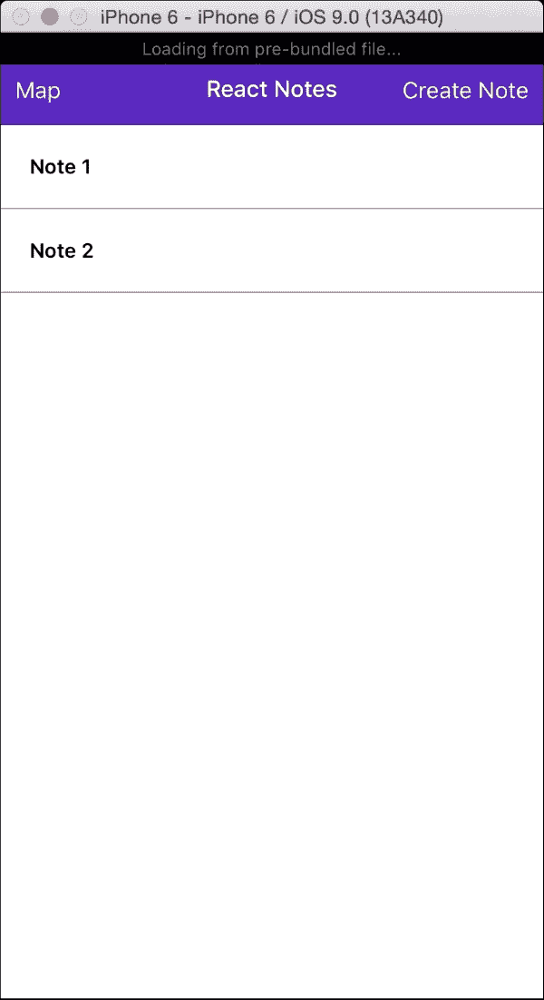
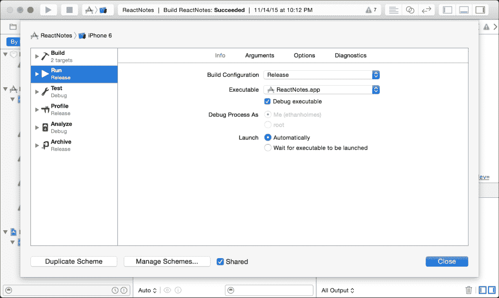
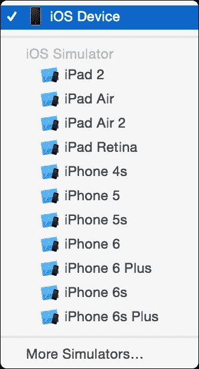
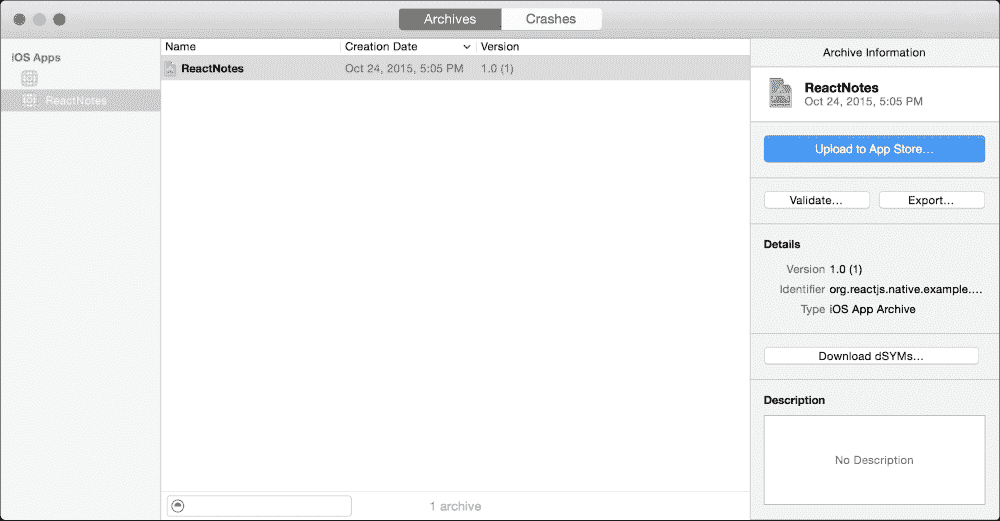
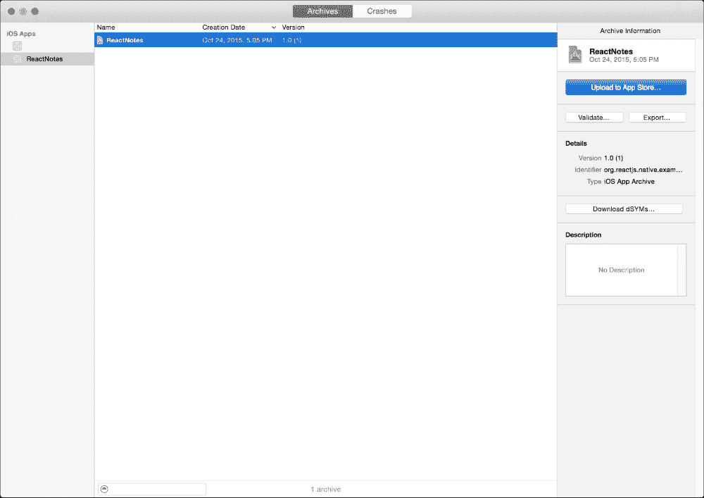

# 第八章。发布应用程序

我们应用程序的第一个版本已完成，这意味着我们已准备好通过创建生产构建的过程。在本章中，我们将首先向您展示如何从静态 JavaScript 包生成和运行应用程序。然后，为了准备 App Store，我们将使用 Xcode 构建我们的 iOS 版本。最后，对于 Android，我们将介绍 React Native 提供的命令行工具和脚本来构建最终的 APK。

在本章中，我们将涵盖以下内容：

+   为 iOS 生成静态包

+   使用`静态包`代替`react-native start`

+   在 Xcode 中构建发布版本

+   签名和构建 Android 版本 APK

# 在 iOS 中生成静态包

到目前为止，我们一直在从由 Xcode 或终端使用`react-native start`启动的节点服务器上提供应用程序的静态包（其中包含所有我们的 JavaScript 代码）。在我们为 iOS 和 Android 创建发布版本之前，我们需要生成应用程序将加载的静态 JS 包。我们将首先在 iOS 中创建发布版本；对于 Android，请跳转到`生成 Android APK`部分。

再次使用`react-native-cli`并执行`bundle`命令。`bundle`命令需要三个标志：`c`、`platform`和`bundle-output`。`entry-file`指定根组件的路径，平台是 iOS 或 Android，而`bundle-output`是放置生成的包的路径。

在根目录的终端中，运行`react-native bundle`，指定`entry-file`为`index.ios.js`，平台为`iOS`，并将`bundle-output`路径指向`ios/main.jsbundle`：

```js
$ react-native bundle --entry-file index.ios.js --platform ios --bundle-output ios/main.jsbundle
bundle: Created ReactPackager
bundle: Closing client
bundle: start
bundle: finish
bundle: Writing bundle output to: ios/main.jsbundle
bundle: Done writing bundle output
```

资产目标文件夹未设置，跳过...

关于 iOS 中`react-native bundle`的更多详细信息，可以在 React Native 文档中找到，网址为[`facebook.github.io/react-native/docs/running-on-device-ios.html#using-offline-bundle`](https://facebook.github.io/react-native/docs/running-on-device-ios.html#using-offline-bundle)。

# 测试 iOS 中的静态包

首先，我们需要测试静态包是否可以在模拟器中由我们的 iOS 应用程序加载。在 Xcode 中打开`AppDelegate.m`，查看以下代码和注释：

```js
   * Loading JavaScript code - uncomment the one you want.
   *
   * OPTION 1
   * Load from development server. Start the server from the repository root:
   *
   * $ npm start
   *
   * To run on device, change `localhost` to the IP address of your computer
   * (you can get this by typing `ifconfig` into the terminal and selecting the
   * `inet` value under `en0:`) and make sure your computer and iOS device are
   * on the same Wi-Fi network.
   */

  jsCodeLocation = [NSURL URLWithString:@"http://localhost:8081/index.ios.bundle?platform=ios&dev=true"];

  /**
   * OPTION 2
   * Load from pre-bundled file on disk. To re-generate the static bundle
   * from the root of your project directory, run
   *
   * $ react-native bundle --minify
   *
   * see http://facebook.github.io/react-native/docs/runningondevice.html
   */

//   jsCodeLocation = [[NSBundle mainBundle] URLForResource:@"main" withExtension:@"jsbundle"];
```

这里概述了加载 JavaScript 包的多种方法。我们感兴趣的是`选项 2`，从磁盘加载预打包的文件。从`选项 1`中注释掉`jsCodeLocation`语句，并在`选项 2`中取消注释第二个：

```js
// jsCodeLocation = [NSURL URLWithString:@"http://localhost:8081/index.ios.bundle?platform=ios&dev=true"];
...

jsCodeLocation = [[NSBundle mainBundle] URLForResource:@"main" withExtension:@"jsbundle"];
```

确保没有正在运行的`react-native start`终端会话，然后从 Xcode 中构建并运行应用程序（*Cmd* + *R*）。你应该位于模拟器的顶部，以表明它正在从预打包的文件加载：



# 在 Xcode 中创建 iOS 版本

为了提交到 AppStore，我们需要为分发构建我们的应用程序。幸运的是，我们最初使用 `react-native init` 创建的 Xcode 项目已经为我们预配置了一些内容。首先，我们想要将 **构建配置** 改为 **禁用** 功能，例如我们在调试时获得的开发者菜单。

让我们配置 iOS 发布：

1.  在 Xcode 中，导航到 **产品** | **方案** | **编辑方案…** 并选择 **运行**，然后在 **信息** 选项卡下将 **构建配置** 从 **调试** 更改为 **发布**：

1.  将目标设置为 **iOS 设备** 而不是模拟器：

1.  最后，从 **产品** | **存档** 运行构建。**组织者** 窗口将打开一个包含您项目存档的列表。您可以通过从顶部菜单选择 **窗口** | **组织者** 来稍后返回此屏幕：

1.  在未来，当您创建多个发布版本时，您应该在 **目标** | **ReactNotes** | **常规** 中增加版本号。对于我们的第一个发布版本，这可以忽略：

    一旦您的构建被存档，它就准备好提交到苹果应用商店。本书不涵盖应用商店的申请，但下一步将在苹果开发者网站上提供，网址为 [`developer.apple.com`](https://developer.apple.com)。

# 生成 Android APK

构建 **Android 应用程序包（APK**）比 iOS 发布要复杂一些。在生成静态包之前，我们需要遵循一些步骤，就像我们在 iOS 中做的那样：

1.  首先，我们需要生成一个密钥，我们可以使用 `keytool` 来签署我们的应用程序。在终端中导航到 `android/app` 文件夹并运行以下命令：

    ```js
    $ keytool -genkey -v -keystore my-release-key.keystore -alias my-key-alias -keyalg RSA -keysize 2048 -validity 10000
    [Storing my-release-key.keystore]

    ```

    ### 注意

    注意这是一个私有文件，永远不应该与任何人共享。请将其保存在安全的地方！

1.  接下来，我们需要更新几个配置文件。在 `android/` 目录中向上一个级别打开 `gradle.properties` 并添加以下四行，将 `YOUR_KEY_PASSWORD` 替换为您为 `keytool` 使用的密码：

    ```js
    MYAPP_RELEASE_STORE_FILE=my-release-key.keystore MYAPP_RELEASE_KEY_ALIAS=my-key-alias MYAPP_RELEASE_STORE_PASSWORD=YOUR_KEY_PASSWORD
    MYAPP_RELEASE_KEY_PASSWORD= YOUR_KEY_PASSWORD
    ```

1.  在 `android/app/build.gradle` 中添加以下内容：

    ```js
    android {
        ...

        signingConfigs {
            release {
                storeFile file(MYAPP_RELEASE_STORE_FILE)
                storePassword MYAPP_RELEASE_STORE_PASSWORD
                keyAlias MYAPP_RELEASE_KEY_ALIAS
                keyPassword MYAPP_RELEASE_KEY_PASSWORD
            }
        }
        buildTypes {
            release {
                ...
                signingConfig signingConfigs.release
            }
        }
    }
    ```

1.  现在，我们可以为 Android 生成静态包。创建一个新的目录 `android/app/src/main/assets/` 并运行以下修改后的 `react-native bundle` 命令：

    ```js
    react-native bundle --platform android --dev false --entry-file index.android.js --bundle-output android/app/src/main/assets/index.android.bundle --assets-dest android/app/src/main/res/

    ```

    这将产生以下输出：

    ```js
    $ react-native bundle --platform android --dev false --entry-file index.android.js --bundle-output android/app/src/main/assets/index.android.bundle --assets-dest android/app/src/main/res/
    Building package...
    transforming [========================================] 100% 326/326
    Build complete
    Successfully saved bundle to android/app/src/main/assets/index.android.bundle

    ```

1.  使用 `gradle` 命令在 `android/` 目录下构建最终的 APK：

    ```js
    ./gradlew assembleRelease

    ```

    如果您已正确设置密钥签名，您可以使用以下方式在模拟器或设备上测试您的发布版本：

    ```js
    ./gradlew installRelease

    ```

1.  有了这个，我们就有了最终的发布 APK（可以在`android/app/build/outputs/apk/app-release.apk`中找到）。查看 Android 开发者上的启动清单，了解更多关于 Play Store 提交流程的信息，请访问[`developer.android.com/distribute/tools/launch-checklist.html`](https://developer.android.com/distribute/tools/launch-checklist.html)。

# 摘要

在本章中，你学习了如何构建我们的应用程序的发布版本，以便提交到 App Store 或 Google Play Store。iOS 在 Xcode 中有一个预配置方案来禁用开发者功能。然后，我们通过针对 iOS 设备创建了一个存档。在 Android 上，我们使用**keytool**创建了一个私有发布密钥，并通过命令行和`gradle`构建了发布 APK。在提交之前，跟进并测试这两个发布构建是否都能正常工作，以降低被拒绝的可能性。

我们希望这本书能给你提供开始使用 React Native 创建移动应用所需的基础知识。尽管 React 和 React Native 在开发方面还非常早期，但你可以期待这本书中讨论的核心概念在未来一段时间内仍然适用。当 Android 最终达到与 iOS 的功能对等时，两个平台之间将开启更多快速发展的机会。祝你好运，我们迫不及待地想看到你的应用在 App 和 Google Play Stores 上发布！
