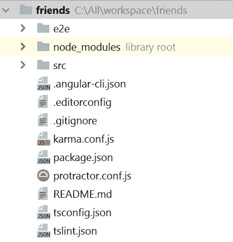
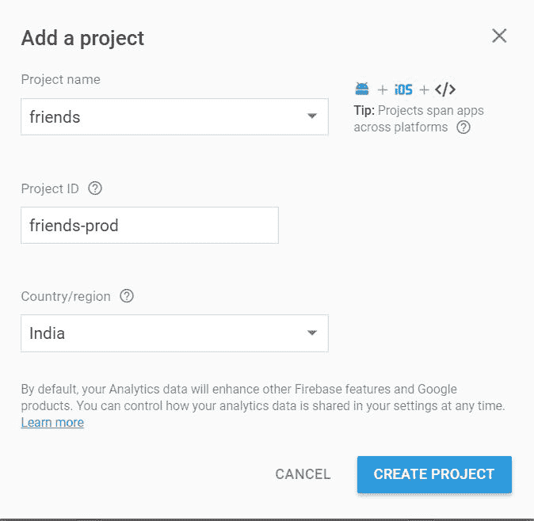
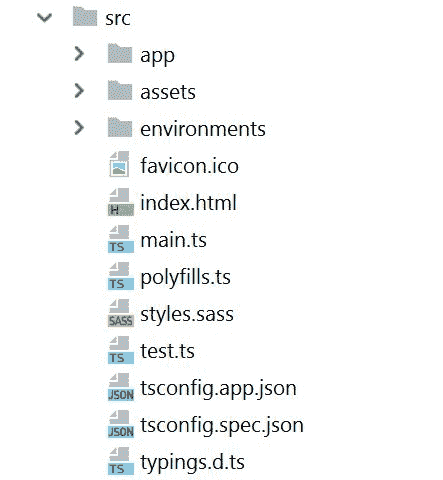
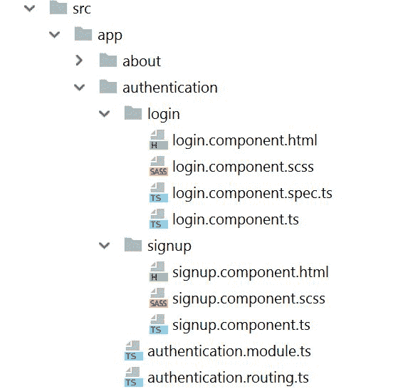

# 组织您的 Angular 项目结构

在本章中，我们将使用 `@angular/cli` 命令创建项目结构。我们将使用 **npm**（**Node 包管理器**）下载所有必要的库。然后，我们将启动项目，查看在浏览器上运行的第一个 Angular 应用程序。我们将介绍开发高质量 Angular 应用程序所需的所有重要文件。

npm 是 JavaScript 的包管理器。它还帮助安装开发应用程序所需的包。

我们还将运行设置测试框架的过程，并为我们的社交应用的一些重要组件编写测试用例。我们的目标是通过对测试、开发和数据分析的开发，创建一个生产就绪的应用程序。

最后，我们将介绍编码风格的推荐指南，因为这是开发中最被忽视的部分。我们觉得在团队开发任何应用程序时，这是必需的，以确保在整个开发团队中遵循通用术语和术语。

本章将涵盖以下主题：

+   创建项目大纲

+   项目结构

+   设置 Firebase

+   Angular 术语

+   应用程序项目结构

+   常见原则

+   编码标准指南

# 创建项目大纲

**Angular CLI**（**命令行界面**）使创建项目变得容易。它还通过简单的命令帮助创建组件、路由、服务和管道。我们将使用 Angular CLI 创建一个示例项目大纲。这提供了开始构建您的应用程序所需的所有必要文件。

我们需要以下四个步骤来运行我们的第一个 Angular 应用程序，而无需编写任何代码，并获取我们的第一个欢迎页面。我们还需要 npm 来安装重要的库；您可以从 [`nodejs.org/en/download/`](https://nodejs.org/en/download/) 下载 npm：

1.  让我们使用 `npm` 安装 Angular CLI：

```js
$npm install -g @angular/cli
```

请注意，`-g` 标志全局安装 angular CLI，以便在任何项目中都可以访问。

1.  使用 `ng new` 命令创建 friends 项目的结构。由于我们使用 SASS 创建样式表，因此我们还将提供 `--style=sass` 选项，这将配置我们的应用程序中的 SASS。请查看以下命令：

```js
$ng new friends --style=sass
```

不要忘记在最后给出您的项目名称，否则它将创建一个默认的项目名称。

1.  进入新创建的 `friends` 文件夹并执行 `npm install`。这安装了构建我们的应用程序所需的所有包，并创建了 `node_modules` 文件夹。请查看以下命令：

```js
$npm install
```

1.  最后，使用 `npm start` 部署新创建的 friends 项目，并查看在浏览器中运行的第一个 Angular 应用程序。请参考以下命令。默认端口是 4200，您可以在浏览器中输入 `http://localhost:4200` 来查看您的示例应用程序：

```js
$npm start                            
```

恭喜您完成了您的第一个 Angular 应用程序！

# 项目结构

下一步是将新创建的项目映射到一个编辑器。我们使用 WebStorm 作为我们的编辑器，这是一个付费版本。您可以使用免费的 Visual Studio Code 或 Sublime 作为您的编辑器，您可以从以下 URL 下载它们：

+   Visual Studio Code: [`code.visualstudio.com/download`](https://code.visualstudio.com/download)

+   Sublime Text: [`www.sublimetext.com/download`](https://www.sublimetext.com/download)

我们将项目映射到我们的 WebStorm 编辑器，并使用 `npm install` 安装依赖库，它创建了一个 `node_modules` 文件夹。这个文件夹包含所有依赖库。在编辑器中的项目结构如下截图所示：



# package.json 概述

`package.json` 文件指定了运行应用的起始包。我们也可以在此文件中添加包，随着应用的演变。

`package.json` 文件包含以下两组依赖：

+   `dependencies`**: **"dependencies" 中的包包含运行 Angular 应用所需的所有基本库：

```js
    "dependencies": {
        "@angular/animations": "⁵.2.0",
        "@angular/common": "⁵.2.0",
        "@angular/compiler": "⁵.2.0",
        "@angular/core": "⁵.2.0",
        "@angular/forms": "⁵.2.0",
        "@angular/http": "⁵.2.0",
        "@angular/platform-browser": "⁵.2.0",
        "@angular/platform-browser-dynamic": "⁵.2.0",
        "@angular/router": "⁵.2.0",
        "core-js": "².4.1",
        "rxjs": "⁵.5.6",
        "zone.js": "⁰.8.19"
    },
```

依赖包括以下库。以下列表中我们只解释了重要的库：

+   +   `@angular/common`: 它提供了常用功能，如管道、服务和指令。

    +   `@angular/compiler`: 它理解模板，并将它们转换为浏览器可以理解的格式，以便我们的应用可以运行和渲染。我们不直接与此库交互。

    +   `@angular/core`: 它提供了所有常用元数据，例如组件、指令、依赖注入和组件生命周期钩子。

    +   `@angular/forms`: 它提供了一个基本的输入布局。这用于登录、注册或反馈。

    +   `@angular/http`: 它是一个 Angular 服务，提供了一个用于 HTTP REST 调用的实用函数。

    +   `@angular/platform-browser`: 它提供了用于生产构建启动应用的 `bootstrapStatic()` 方法。

    +   `@angular/platform-browser-dynamic`***:*** 它主要在开发过程中的启动阶段使用。

    +   `@angular/router`: 它提供了一个组件路由器，用于组件之间的导航。

    +   `core-js`: 它将 ES2015（ES6）的基本功能修补到全局上下文 window 中。

    +   `rxjs`: 它是一个用于使用观察者进行响应式编程的库，有助于编写 HTTP 的异步代码。

    +   `zone.js`: 它提供了一个在异步任务之间持续存在的执行上下文。

+   `devDependencies`**:** `devDependencies` 中的包主要在开发过程中需要。您可以使用以下 `npm` 命令在生产构建中排除 `devDependencies`：

```js
$npm install my-application --production
```

# 设置 Firebase

在我们的项目中，我们使用 Firebase 作为后端服务，一个移动和网页应用平台。它提供了一整套集成到一个平台的产品，使得开发过程更加快速，主要部分由平台处理。其产品主要围绕两个主要主题：

+   **开发和测试你的应用**：这些套件提供了开发可扩展应用所需的所有服务

+   **增长并吸引你的受众**：这对于我们应用的增长是必需的

你可以参考以下链接获取有关 Firebase 的更多信息：[`firebase.google.com/`](https://firebase.google.com/)。

# 设置 Firebase 账户

创建新 Firebase 项目的第一步是创建你的新 Google 账户或使用当前账户。

现在，打开 Firebase 门户，按照以下四个步骤开始你的 Firebase 项目：

1.  点击右上角的“GO TO CONSOLE”。

1.  点击带有加号（+）的“添加项目”。

1.  在弹出的窗口中，输入项目名称和国家/地区。项目 ID 是可选字段，它将采用默认值。

1.  点击 CREATE PROJECT。

以下截图显示了朋友项目：



最后，你在 Firebase 的欢迎页面上获取配置详情，然后点击将 Firebase 添加到你的 web 应用。你可以将此配置复制到 `environments.ts` 中，如下所示：

```js
export const environment = {
    production: false,
    firebase: {
        apiKey: 'XXXX',
        authDomain: 'friends-4d4fa.firebaseapp.com',
        databaseURL: 'https://friends-4d4fa.firebaseio.com',
        projectId: 'friends-4d4fa',
        storageBucket: '',
        messagingSenderId: '321535044959'
    }
};
```

# Angular 术语

在本节中，我们将讨论 Angular 中的重要术语。你可能对其中大部分都很熟悉，但这将帮助你巩固知识：

+   **模块**：Angular 通过模块支持模块化。所有 Angular 项目至少有一个名为 `AppModule` 的模块。当我们构建大型应用时，我们可以将应用划分为具有共同相关能力的多个功能模块。我们可以使用 `@NgModule` 注解创建模块。

+   **组件**：组件是一个控制器，它具有视图和逻辑来管理视图事件和组件之间的导航。它通过各种数据绑定技术与视图交互。你可以使用以下 CLI 命令生成 `component`：

```js
$ng g component <component-name>
```

+   **模板**：模板代表网页的视图，它使用 HTML 标签创建。它还包含许多自定义标签，如 Angular 指令以及原生 HTML 标签。

+   **元数据**：它为任何类分配行为。这是位于类之上的元数据，它告诉 Angular 类的行为。例如，组件是通过 `@Component` 注解创建的。

+   **数据绑定**：这是一个模板与组件交互的过程。数据通过各种数据绑定技术来回传递。Angular 支持以下三种类型的数据绑定：

    +   **插值**：在这个绑定中，我们使用两个大括号来访问组件成员的属性值。例如，如果我们有一个组件中的类成员属性 `name`，那么我们可以在模板中定义 `{{name}}` 来访问名称值。

    +   **属性绑定**：这种数据绑定技术有助于将值从父组件传递到子组件。例如，如果我们有一个父组件中的 `name` 作为类成员属性，以及子组件中的 `userName`，那么我们可以使用 `[userName] = "name"` 将父组件的值分配给子组件。

    +   **事件绑定**：这种事件驱动的数据绑定有助于将值从模板传递到组件。例如，我们显示列表中的名称；当用户点击列表项时，我们使用事件绑定 `(click)="clickName(name)"` 传递点击值。

+   **指令**：它是注入到模板中的行为，它修改了 DOM（文档对象模型）的渲染方式。基本上有两种类型的指令：

    +   **结构**：它通过添加、删除或替换 DOM 元素来改变 DOM 布局。这类指令的示例有 `ngFor` 和 `ngIf`。

    +   **属性**：它改变现有 DOM 元素的外观和行为。`ngModel` 指令是属性指令的示例，它通过响应事件来改变现有元素的行为。

+   **服务**：它是一个可用的实体，被任何 Angular 组件消费，有助于将视图逻辑与业务逻辑分离。我们通常在服务中为特定模块编写 HTTP 特定的调用，因为它有助于代码的可读性和可维护性。流行的服务示例包括日志服务或数据服务。您可以使用以下 CLI 命令创建 `service`：

```js
$ng g service <service-name>
```

+   **管道**：它是 Angular 中最简单但最有用的功能之一。它提供了一种编写可跨应用程序重用实用功能的方法。Angular 提供了内置管道，如日期和货币。您可以使用以下 CLI 命令创建 `pipe`：

```js
$ng g pipe <pipe-name>
```

# 应用程序的项目结构

当我们浏览我们的示例朋友应用程序时，我们会遇到 `src` 文件夹，它包含所有具有视图、业务逻辑和导航功能的应用程序核心文件。开发者的大部分时间都花在这个文件夹中：



我们组织文件夹时遵循的主要思想是功能模块。每个类似的功能都被组织到功能模块中。为了更好地理解它，我们将查看我们朋友应用程序中的一个认证功能示例，以及本书后续章节中的一些文件引用。

在我们的应用程序中，所有与认证相关的功能，如登录和注册，都被组合到一个名为 `authentication` 的模块中。这种相同的模式将应用于我们应用程序的所有功能。这使得我们的应用程序更加模块化和可测试。我们以一个认证功能模块为例，在以下章节中对其进行了更详细的解释。

我们的认证功能模块如下截图所示；认证功能具有登录和注册功能，所有组件都在模块中声明——它还有一个用于内部导航的自己的路由模块：



# 应用模块

应用模块是我们整个项目的根模块。所有 Angular 项目至少有一个应用模块，这是强制性的，它用于启动项目以启动应用程序。应用模块使用`@NgModule`装饰器声明。`NgModule`注解中的元数据如下：

+   `imports`：在`imports`标签中，我们声明所有依赖的功能模块。以下代码示例中，我们声明了`BrowserModule`、`AuthenticationModule`和`AppRouting`模块。

+   `declarations`：在`declarations`标签中，我们声明此根模块的所有组件。以下示例中，我们在`AppModule`中声明了`AppComponent`。

+   `providers`：在`providers`标签中，我们声明所有服务或管道。以下示例中，我们声明了`AngularFireAuth`和`AngularFireDatabase`。

+   `bootstrap`：在`bootstrap`标签中，我们声明根组件，这在`index.html`中是必需的。

以下示例`app.module.ts`是使用`ng new`命令创建的，如下所示：

```js
    import {BrowserModule} from '@angular/platform-browser';
    import {NgModule} from '@angular/core';
    import {AppComponent} from './app.component';

    @NgModule({
        declarations: [
            AppComponent
        ],
        imports: [
            BrowserModule
        ],
        providers: [],
        bootstrap: [AppComponent]
    })
    export class AppModule {
    }
```

# 应用路由

根路由模块用于在不同的功能模块之间导航。我们将创建一个包含主应用程序导航流程的路由。以下示例包含路由的样本，展示了在应用程序中常见组件之间的导航，例如`AboutComponent`和`PageNotFoundComponent`。路径中的通配符`'**'`指定任何错误的 URL 都将重定向到页面未找到组件。应用路由使用`@NgModule`装饰器创建，并使用`RouterModule`配置路由。

以下示例`app.routing.ts`如下：

```js
import {RouterModule, Routes} from '@angular/router';
import {NgModule} from '@angular/core';
import {PageNotFoundComponent} from './notfound/not-found.component';
import {AboutComponent} from './about/about.component';

export const ROUTES: Routes = [
   {path: 'app-about', component: AboutComponent, pathMatch: 'full'},
   {path: '**', component: PageNotFoundComponent},
];

@NgModule({
   imports: [
      RouterModule.forRoot(
         ROUTES
      )],
   exports: [
      RouterModule
   ]
})
export class AppRouting {
}
```

# 认证模块

`authentication`模块是一个功能模块，它包含登录和注册功能集。所有与认证相关的功能都包含在这个文件夹中。我们在声明元数据中包含了`LoginComponent`和`SignupComponent`。

```js
import {NgModule} from '@angular/core';
import {AuthenticationRouting} from './authentication.routing';
import {LoginComponent} from './login/login.component';
import {SignupComponent} from './signup/signup.component';
import {FormsModule} from '@angular/forms';
import {AuthenticationService} from '../services/authentication.service';

/**
 * Authentication Module
 */
@NgModule({
   imports: [
      FormsModule,
      AuthenticationRouting
   ],
   declarations: [
      LoginComponent,
      SignupComponent
   ],
   providers: [
      AuthenticationService
   ]
})
export class AuthenticationModule {
}
```

# 认证路由

此路由有助于在子组件内进行导航，因此我们为登录和注册组件创建路由。随着我们在后续章节中开始实现登录和注册组件，这些路由将逐步发展。

以下示例`authentication.routing.ts`如下：

```js
import {NgModule} from '@angular/core';
import {RouterModule, Routes} from '@angular/router';
import {LoginComponent} from './login/login.component';
import {SignupComponent} from './signup/signup.component';

export const ROUTES: Routes = [
   {path: 'app-friends-login', component: LoginComponent},
   {path: 'app-friends-signup', component: SignupComponent}
];

/**
 * Authentication Routing Module
 */
@NgModule({
   imports: [
      RouterModule.forChild(ROUTES)
   ],
   exports: [
      RouterModule
   ]
})
export class AuthenticationRouting {
}
```

# 登录组件

组件是 Angular 应用程序中 UI（用户界面）的基本构建块。`@Component`装饰器用于将类标记为 Angular 组件。以下示例展示了使用`@Component`定义的登录组件，它包含**SCSS**（**Sassy CSS**）和模板文件：

```js
import {Component} from '@angular/core';

@Component({
  selector: 'friends-login',
  styleUrls: ['./login.component.scss'],
  templateUrl: './login.component.html'
})
export class LoginComponent {
}
```

# 登录组件 HTML

登录组件 HTML 是一个视图，包含登录表单数据。以下示例展示了包含两个标签的简单 HTML；Angular 中的模板遵循与 HTML 相同的语法：

```js
<h3>Login Component</h3>
<p>This is the Login component!</p>
```

# 登录组件 scss

在我们的项目中，我们使用 **SASS**（**语法优美的样式表**），这是一个预处理器，将我们的 SCSS 文件转换为 CSS 文件。这有助于以简单和可读的格式组织我们的 CSS 元素。它提供了许多功能，如变量、嵌套、混合和继承，这些功能有助于以可重用的方式编写复杂的 CSS。我们将在创建功能模块时介绍这些功能。以下 SCSS 文件是一个简单的示例，其中黑色变量被外部化到变量 `:black` 中：此变量可以与其他 CSS 元素一起使用：

```js
$black: #000;

h1.title {
    color: $black;
}
```

# 登录组件规范

我们使用 **Jasmine** 测试框架来编写我们的单元测试用例。从开发初期开始编写测试用例是一个非常好的习惯。测试用例应该是我们开发过程的一部分。不幸的是，我们通常在生产后或在生产过程中看到大量问题时才编写测试用例。我们知道在开发初期编写测试用例需要时间，但它在后期可以节省大量时间。以前，软件行业交付新产品的基础是 **市场时间**，但现在焦点已经转移到 **有质量的市场时间**。因此，当编写测试用例成为开发的一部分时，我们就可以更快地编写测试用例，并按时交付高质量的产品。我们希望这解释了在开发过程中这一过程的重要性。

```js
Chapter 10, *Unit Testing Our Application*: 
```

```js
describe('LoginComponent tests', () => {
 });
```

当我们的测试用例准备就绪后，我们可以使用 `npm` 执行测试用例：

```js
$npm test
```

# 认证服务

在 Angular 中，将 UI 逻辑与业务逻辑分离的最佳方式是使用服务。它提供了一个执行特定逻辑的类。在我们的项目中，我们通过服务中的 HTTP 与 Firebase 数据库交互，以便将重负载转移到服务上。在认证服务中，我们执行登录、注册和注销等操作。

当我们在一个定义良好的类中明确分离责任时，我们遵循 **SRP**（**单一责任原则**）。SRP 在下一节中将有更详细的解释。我们在服务上使用 `Injectable` 装饰器，以便 Angular 框架可以将此服务注入到任何组件或服务中，我们不需要创建对象。这种模式被称为依赖注入。

以下是一个 `authentication.service.ts` 的示例：

```js
import { Injectable } from '@angular/core';

/**
 * Authentication service
 *
 */
@Injectable()
export class AuthenticationService {
}
```

# 日期管道

管道有助于在 Angular 应用程序中编写实用函数。

我们将通过扩展 `PipeTransform` 并重写超类中的 `transform` 方法来创建一个管道，以提供我们的功能。我们的应用程序的日期管道被装饰了管道元数据。我们将使用 `name` 标签为我们的管道提供一个名称，该标签用于在模板中转换数据。

以下是一个 `friendsdate.pipe.ts` 的示例：

```js
import {Pipe, PipeTransform} from '@angular/core';

/**
 * It is used to format the date
 */
@Pipe({
   name: 'friendsdate'
})
export class FriendsDatePipe implements PipeTransform {

   transform(dateInMillis: string) {
   }
}
```

以下是在模板中使用管道的方式：

```js
<div>{{<timeInMillis>: friendsdate}} </div>
```

# 常见原则

原则帮助我们以更好的方式设计我们的应用程序，并且这些原则并不特定于任何编程语言或平台。在本节中，我们将介绍 Angular 应用程序中最常用的几个原则：

+   **单一职责原则**：此原则指出，一个类应该只有一个改变的理由，并且责任应该封装在类中。我们将此原则应用于所有我们的组件、服务或路由器。这有助于代码的可维护性和可测试性。例如，组件负责管理与视图相关的逻辑。其他复杂的服务器逻辑委托给服务。我们主要在管道中实现实用函数。

+   **单文件**：将组件或服务定义在每个文件中是一种良好的实践。这使得我们的代码更容易阅读、维护和跨模块导出。

+   **小函数**：始终编写具有明确目的的小函数是很好的。这确实使使用您代码的其他开发者的生活变得更简单，因为新开发者可以轻松阅读和理解代码。

+   **LIFT 原则**：始终遵循*提升*原则，以便您可以快速*定位*代码，*识别*代码，保持结构*扁平*，并*尝试*保持简洁。这确保了应用程序中结构的一致性。这极大地提高了开发者的效率。

+   **按功能划分文件夹**：在应用程序的开发过程中，我们遵循了这一原则，并将所有功能分组到功能模块中。

+   **共享功能**：我们创建一个共享文件夹来声明所有可重用组件、指令和管道，并且这些在其他文件夹之间共享。创建`SharedModules`以便在整个应用程序中引用。

# 编程标准指南

编程标准是我们编写应用程序时遵循的共同模式。这使得我们的代码在应用程序中保持一致。当多个开发者共同开发同一应用程序时，这非常有用。以下是一些编程标准：

+   **命名约定**：对于我们的文件名、类名等，保持一致的命名约定非常重要。从可维护性和可读性的角度来看，这是必不可少的。这也有助于更快地理解代码，并使调试变得更容易。

    +   **文件名**：在 Angular 中，建议的文件名模式为 feature.type.ts。例如，认证组件文件的名称为`authentication.component.ts`。

    +   **类名**：类名遵循驼峰命名法，并从文件名中获取名称。例如，认证组件文件的类名为`AuthenticationComponent`。

    +   **方法和属性名称**：我们遵循驼峰命名法来命名类方法和属性。我们不使用下划线作为私有变量的前缀。

    +   **选择器名称**：组件中的选择器名称是连字符分隔的，并且所有字符都是小写。我们的登录组件的名称如下所示：

        ```js
        selector: 'app-friends-login'
        ```

        **管道名称**：管道以其功能命名。例如，货币管道的名称是 `'currency'`，如下所示：

        ```js
        name: 'currency'
        ```

+   **常量**：常量是使用 const 关键字声明的最终变量，其值只赋值一次。常量变量以大写形式声明，如下所示：

    ```js
    export const USER_DETAILS_CHILD = 'user-details';
    ```

+   **成员序列**：所有成员变量首先声明，然后是方法。私有成员变量以公共成员变量命名。

# 摘要

在本章中，我们使用 Angular CLI 命令创建了我们的第一个 Angular 应用程序。我们浏览了 Angular 应用程序中的重要文件。我们学习了常见的 Angular 术语，然后了解了我们的应用程序项目结构和内部结构。最后，我们涵盖了常见的原则和编码指南，这些我们将作为我们开发过程的一部分来遵循。

在下一章中，我们将创建我们的第一个注册页面。我们将应用本章中的许多概念来创建我们的注册组件。
