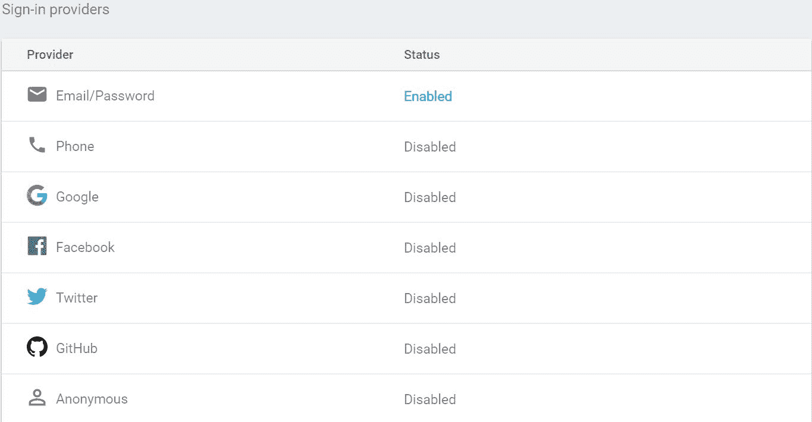
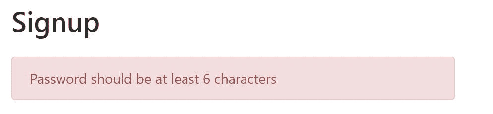
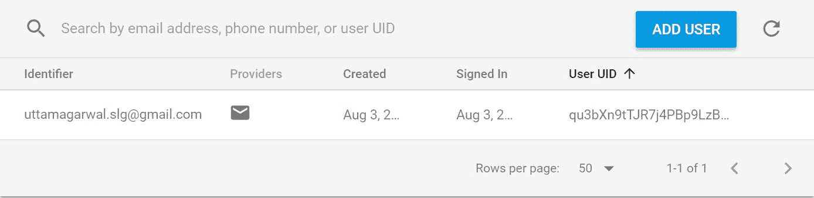
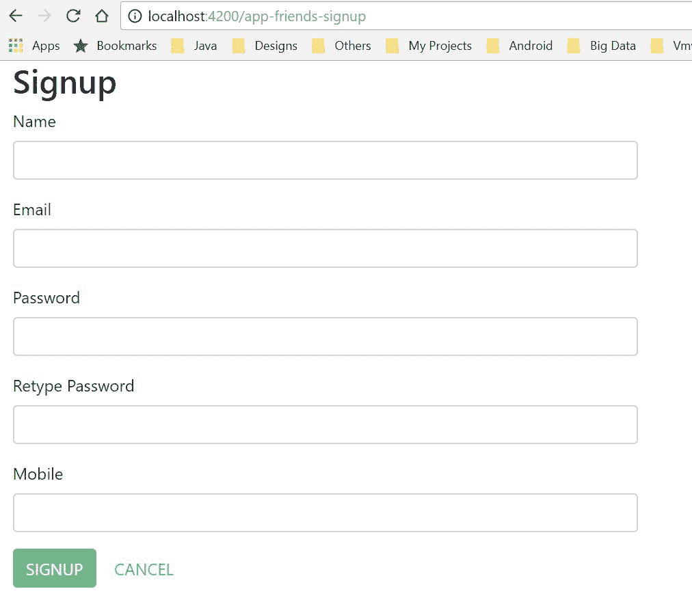

# 创建注册组件

在本章中，我们将开始我们的应用程序开发之旅。我们将构建一个注册页面。在这个过程中，我们还将探索 Firebase 的不同功能。我们将查看如何在控制台中启用 Firebase 身份验证，这是与身份验证功能模块交互所必需的。Firebase 支持许多身份验证机制，但在这个项目中，我们将启用电子邮件/密码身份验证。然后，我们将继续构建注册表单模板。我们将在注册组件中添加一个功能。在这个过程中，我们还将处理错误场景。这将使我们的应用程序更加健壮，减少错误的可能性。

在本章中，我们将涵盖以下主题：

+   在 Firebase 中启用身份验证

+   AngularFire2 简介

+   创建身份验证模块

+   创建服务

+   定义领域模型

+   创建注册模板

+   错误处理

+   创建自定义警报对话框

+   创建注册组件

# 在 Firebase 中启用身份验证

在我们的应用程序开发中，第一步是在 Firebase 门户中启用身份验证。我们已经在上一章中创建了我们的 Firebase 项目。按照以下步骤启用 Firebase 身份验证：

1.  在 Firebase 控制台中打开你朋友的工程。

1.  在左侧面板上展开 “开发”。

1.  点击 “身份验证”。

1.  点击右侧面板上的 “登录方法” 选项卡。

1.  点击 “电子邮件/密码” 项并启用它。

Firebase 中启用的电子邮件/密码身份验证将如下截图所示：



这就是我们启用 “电子邮件/密码” 身份验证模式所需做的所有事情。Firebase 还支持其他身份验证模式。在这本书中，我们将仅实现电子邮件/密码身份验证。你可以作为练习与其他身份验证一起工作。

针对不同用户集需要不同的身份验证模式。了解其他身份验证模式是很好的。其他支持的模式如下：

+   **电话**：这是一种简单的身份验证形式，不需要从用户那里获取太多信息。只需用户的手机号码就足以进行用户身份验证。这种模式在移动应用程序中变得很受欢迎。

+   **Google**：启用 Google 身份验证是很好的，因为大多数目标用户都有 Google 账户。在这种模式下，身份验证是通过 Google 凭据进行的。

+   **Facebook**：这与 Google 身份验证类似。唯一的不同之处在于，身份验证是通过 Facebook 凭据而不是 Google 凭据进行的。

+   **Twitter**：这与前面的身份验证类似，但身份验证是通过你的 Twitter 账户进行的。

+   **GitHub**：这对开发者社区非常有帮助。他们有 GitHub 账户，你不需要提供任何个人账户信息。

+   **匿名**：这种认证对于用户不想注册的应用程序很有用。这主要用在电子商务应用程序上，用户可以使用这种认证浏览产品。

在所有前面的认证中，Firebase 生成一个唯一的 ID，称为用户 UID，用户使用 UID、标识符等在 Firebase 认证中注册。相同的 UID 也用于在 Firebase 数据库中注册用户，包含更多信息，如电子邮件、UID、姓名和电话号码。

# 介绍 angularfire2

`angularfire2` 是 Angular 和 Firebase 的官方库。我们将在我们的应用程序中使用这个库。这个库提供了以下功能：

+   它利用了 RxJS、Angular 和 Firebase 的力量

+   它提供了与 Firebase 数据库和认证交互的 API

+   它实时同步数据

+   它提供了与 `AngularFirestore` 交互的 API

更多详情，请参阅 [`github.com/angular/angularfire2`](https://github.com/angular/angularfire2)。

# 创建认证模块

在本节中，我们将使用 Angular CLI 命令创建我们的第一个模块。按照以下步骤创建认证模块：

1.  导航到您的项目 `src` 文件夹并执行模块 CLI 命令，如下所示：

```js
$ cd <your directory>\friends\src\app
$ ng g module authentication --routing`
```

前面的命令创建了 `authentication.module.ts` 和 `authentication.routing.ts` 文件的骨架。您可以根据 Angular CLI 命令创建其他组件。

1.  在应用程序模块中添加认证模块，并配置 Angular 和 Firebase 相关组件，如下所示；查看 `app.module.ts` 文件：

```js
import {NgModule} from '@angular/core';
import {AppComponent} from './app.component';
import {FormsModule} from '@angular/forms';
import {BrowserModule} from '@angular/platform-browser';

import {AuthenticationModule} from './authentication/authentication.module';
import {AngularFireModule} from 'angularfire2';
import {environment} from './environments/environment';
import {BrowserAnimationsModule} from '@angular/platform-browser/animations';
import {AngularFireAuth} from 'angularfire2/auth';
import {AngularFireDatabase} from 'angularfire2/database';
import {CommonModule} from '@angular/common';
import {RouterModule} from '@angular/router';

@NgModule({
  declarations: [
    AppComponent
  ],
  imports: [
    CommonModule,
    BrowserModule,
    FormsModule,
    AngularFireModule.initializeApp(environment.firebase),
    BrowserAnimationsModule,
    RouterModule.forRoot([]),
    AuthenticationModule
  ],
  providers: [
    AngularFireAuth,
    AngularFireDatabase,
  ],
  bootstrap: [AppComponent]
})
export class AppModule {
}
```

1.  在应用程序组件模板中添加占位符，如下所示的 `app.component.html` 文件：

```js
<router-outlet></router-outlet>
```

# 创建服务

Angular 应用程序中的服务包含核心业务逻辑。作为注册组件的一部分，我们创建了两个服务：

+   认证服务

+   用户服务

# 认证服务

我们在前一章中介绍了认证服务，所以我们将向认证服务中添加更多方法。在创建 Angular 服务时，请记住以下步骤。

1.  **编写服务**：AngularFire2 有一个 `AngularFireAuth` 类。这个类提供了对 `firebase.auth.Auth` 的访问，它有 `createUserWithEmailAndPassword` API 用于在 Firebase 中注册。

```js
import {Injectable} from '@angular/core';
import {AngularFireAuth} from 'angularfire2/auth';

/**
 * Authentication service
 *
 */
@Injectable()
export class AuthenticationService {

  /**
   * Constructor
   *
   * @param {AngularFireAuth} angularFireAuth provides the 
     functionality related to authentication
   */
  constructor(private angularFireAuth: AngularFireAuth) {
  }

  public signup(email: string, password: string): Promise<any> {
    return 
    this.angularFireAuth.auth.createUserWithEmailAndPassword(email, 
    password);
  }
}
```

1.  **注册服务**：在使用 API 之前，我们需要在认证模块中包含此服务。查看以下详细信息。

```js
providers tag to include the AuthenticationService.
```

```js
@NgModule({
    imports: [
       ...    
    ],
    declarations: [
        ...
    ],
    providers: [
        AuthenticationService
    ]
})
...
```

1.  **注入和使用服务**：一旦服务注册，我们将在构造函数中声明它。实例将由 Angular 框架注入。最后，注册组件使用 `AuthenticationService` 的 `signup()` API 对 Firebase 进行用户认证。

以下示例显示了在注册组件中声明 `AuthenticationService`：

```js
constructor(private authService:  AuthenticationService) {}
```

# 用户服务

除了将新用户注册到 Firebase 身份验证之外，我们还需要在 Firebase 数据库中存储更多关于用户的信息，例如手机、电子邮件等。

用户服务用于在 Firebase 数据库中输入用户信息。我们使用`angularfire2`中的`AngularFireDatabase`将用户信息设置到 Firebase 数据库中。此类在`UserService`类的构造函数中注入：

```js
constructor(private fireDb: AngularFireDatabase) {}
```

`AngularFireDatabase`提供了一个对象方法，它接受 Firebase 数据库中数据的路径；这返回`AngularFireObject`以将数据设置到 Firebase：

```js
public addUser(user: User): void {
    this.fireDb.object(`${USERS_CHILD}/${user.uid}`).set(user);
}
```

到目前为止，完整的`user.service.ts`文件如下所示：

```js
import {Injectable} from '@angular/core';
import {AngularFireDatabase} from 'angularfire2/database';
import {User} from './user';
import 'firebase/storage';
import {USERS_CHILD} from './database-constants';

/**
 * User service
 *
 */
@Injectable()
export class UserService {

  /**
   * Constructor
   *
   * @param {AngularFireDatabase} fireDb provides the functionality for 
     Firebase Database
   */
  constructor(private fireDb: AngularFireDatabase) {
  }

  public addUser(user: User): void {
    this.fireDb.object(`${USERS_CHILD}/${user.uid}`).set(user);
  }
}
```

如前所述，我们需要在`authentication.module.ts`中注册该服务：

```js
@NgModule({
    imports: [
       ...    
    ],
    declarations: [
        ...
    ],
    providers: [
        AuthenticationService,
        UserService
    ]
})
```

# 定义域模型

对象模型包含有关我们应用程序关键域的信息。这有助于以更可读和结构化的方式存储我们的非结构化数据。在我们的应用程序中，我们将介绍许多对象模型来存储我们的域信息。

当我们注册新用户时，我们将用户详细信息存储在 Firebase 数据库中，并创建了一个具有与用户相关的属性的用户模型来存储用户数据。所有属性都声明为具有类型的成员变量，因为 TypeScript 支持变量的类型，如下面的`user.ts`所示：

```js
export class User {

   email: string;

   name: string;

   mobile: string;

   uid: string;

   friendcount: number;

   image: string;
}
```

TypeScript 是 JavaScript 的类型版本，并编译成 JavaScript。在 TypeScript 中编程更容易、更快。您可以在[`www.typescriptlang.org/docs/home.html`](https://www.typescriptlang.org/docs/home.html)了解更多信息。

# 创建注册模板

注册模板表示网页视图。它提供了用于输入用户输入的表单元素。它还处理模板中的用户错误。在本节中，我们将介绍模板中使用的所有标签。模板中使用的错误处理将在下一节中介绍。

# FormModule

我们使用`FormModule`中的`<form>`来创建注册模板。`ngForm`包含注册表单数据。这是检索用户填写数据所必需的。我们将此表单数据传递给注册组件中的`onSignup()`方法。此用户填写的数据可以通过例如`signupFormData.value.email`来检索，如下所示：

```js
<form name="form" (ngSubmit)="onSignup(signupFormData)" #signupFormData='ngForm'></form>
```

# Bootstrap 元素

我们使用 bootstrap 元素来设计我们的注册表单。我们在`index.html`文件中包含了 bootstrap 和其他依赖库，如 tether 和 jQuery，如下所示：

```js
<!DOCTYPE html>
<html>
<head>
  <meta charset=UTF-8>
  <meta name="viewport" content="width=device-width, initial-scale=1">
  <script src="img/tether.min.js"></script>
  <link rel="stylesheet" 
  href="https://maxcdn.bootstrapcdn.com/bootstrap/4.0.0/
  css/bootstrap.min.css">
  <script src="img/
  jquery.min.js"></script>
  <script src="img/
  js/bootstrap.min.js"></script>
  <title>Friends - A Social App</title>
  <base href="/">
</head>
<body>
<app-friends>
  Loading...
</app-friends>
</body>
</html>
```

Bootstrap 是一个用于开发 HTML、CSS 和 JavaScript 的开源工具包。有关更多详细信息，请参阅[`getbootstrap.com/docs/4.0/getting-started/introduction/`](https://getbootstrap.com/docs/4.0/getting-started/introduction/)。

使用的元素如下：

+   **网格样式**：我们使用 bootstrap 网格样式将表单对齐到中间，如下所示：

```js
<div class="col-md-6 col-md-offset-3"></div>
```

+   **警告**：此元素用于在用户对元素执行任何操作时提供上下文消息，如下所示：

```js
<div class="alert alert-danger"></div>
```

更多关于 Bootstrap 的详细信息，请参阅[`getbootstrap.com/docs/4.0/components/alerts/`](https://getbootstrap.com/docs/4.0/components/alerts/)。

# Angular 数据绑定

如前一章所述，Angular 支持多种数据绑定方式。在这种情况下，我们将支持单向绑定使用 `(ngModel)='name'`。

现在看看完整的 `signup.component.html` 文件：

```js
<div class="col-md-6 col-md-offset-3">
    <h2>Signup</h2>
 <app-error-alert *ngIf="showError" [errorMessage]="errorMessage">  
 </app-error-alert>
    <form name="form" (ngSubmit)="onSignup(signupFormData)" 
     #signupFormData='ngForm'>
        <div class="form-group">
            <label for="name">Name</label>
            <input type="text" class="form-control" name="name" 
             (ngModel)="name" #name="ngModel" required id="name"/>
            <div [hidden]="name.valid || name.pristine"
                 class="alert alert-danger">
                Name is required
            </div>
        </div>
        <div class="form-group">
            <label for="email">Email</label>
            <input type="text" class="form-control" name="email" 
             (ngModel)="email" #email="ngModel"
                   required
                   pattern="^\w+([\.-]?\w+)*@\w+([\.-]?\w+)*
                   (\.\w{2,3})+$"
                   id="email"/>
            <div [hidden]="email.valid || email.pristine"
                 class="alert alert-danger">
                <div [hidden]="!email.hasError('required')">Email is 
                 required</div>
                <div [hidden]="!email.hasError('pattern')">Email format 
                 should be
                    <small><b>codingchum@gmail.com</b></small>
                </div>
            </div>
        </div>
        <div class="form-group">
            <label for="password">Password</label>
            <input type="password" class="form-control" name="password" 
            (ngModel)="password" #password="ngModel" required 
             id="password"/>
            <div [hidden]="password.valid || password.pristine"
                 class="alert alert-danger">
                Password is required
            </div>
        </div>
        <div class="form-group">
            <label for="name">Retype Password</label>
            <input type="password" class="form-control" 
             id="confirmPassword"
                   required
                   passwordEqual="password"
                   (ngModel)="confirmPassword" name="confirmPassword"
                   #confirmPassword="ngModel">
            <div [hidden]="confirmPassword.valid || 
            confirmPassword.pristine"
                 class="alert alert-danger">
                Passwords did not match
            </div>
        </div>
        <div class="form-group">
            <label for="mobile">Mobile</label>
            <input type="text" class="form-control" name="mobile" 
             (ngModel)="mobile" #mobile="ngModel"
                   required
                   pattern="[0-9]*"
                   minlength="10"
                   maxlength="10"
                   id="mobile"/>
            <div [hidden]="mobile.valid || mobile.pristine"
                 class="alert alert-danger">
                <div [hidden]="!mobile.hasError('minlength')">Mobile 
                 should be 10 digit</div>
                <div [hidden]="!mobile.hasError('required')">Mobile is 
                 required</div>
                <div [hidden]="!mobile.hasError('pattern')">Mobile  
                 number should be only numbers</div>
            </div>
        </div>
        <div class="form-group">
            <button type="submit" class="btn btn-success" 
            [disabled]="!signupFormData.form.valid">SIGNUP</button>
            <a [routerLink]="['/app-friends-login']" class="btn btn-
            link">CANCEL</a>
        </div>
    </form>
</div>
```

# 错误处理

错误处理是创建良好应用程序的重要步骤。它使我们的产品更加健壮和抗错误。

我们使用 Angular 验证器来验证用户输入的准确性和完整性。对于用户输入，我们可以使用一个常见的内置验证器或创建我们自己的自定义验证器。

请注意，这些验证器是内置在 HTML 中，而不是 Angular 本身。

以下是一些使用的内置验证器：

+   **必需**：这使得输入字段成为必填项。

+   **最小长度**：这定义了用户输入的下限。例如，我们可以将手机号码的最小长度限制为 10 位数字。

+   **最大长度**。这定义了用户输入的上限。例如，我们可以将手机号码的最大长度限制为 10 位数字。

+   **模式**：我们可以为用户输入创建一个模式。例如，手机号码只接受数字作为输入。

内置验证器可以在注册模板中使用，如下所示：

```js
<div class="form-group">
    <label for="mobile">Mobile</label>
    <input type="text" class="form-control" name="mobile" 
     [(ngModel)]="model.mobile" #mobile="ngModel"
           required
           pattern="[0-9]*"
           minlength="10"
           maxlength="10"
           id="mobile"/>
    <div [hidden]="mobile.valid || mobile.pristine"
         class="alert alert-danger">
        <div [hidden]="!mobile.hasError('minlength')">Mobile should be 
         10 digit</div>
        <div [hidden]="!mobile.hasError('required')">Mobile is 
         required</div>
        <div [hidden]="!mobile.hasError('pattern')">Mobile number 
         should be only numbers</div>
    </div>
</div>
```

自定义验证器是我们应用程序用例的定制验证器。在我们的应用程序中，我们将获取一个密码并让用户重新输入密码以进行确认，为了验证这两个密码，我们将创建一个自定义密码验证器。

要创建我们的验证器，我们将从我们的表单模块扩展 `Validator`，这提供了一个 `validate` 方法来编写我们的自定义实现：

```js
import {Directive, forwardRef, Attribute} from '@angular/core';
import {Validator, AbstractControl, NG_VALIDATORS} from '@angular/forms';

@Directive({
    selector: '[passwordEqual][formControlName],[passwordEqual]
    [formControl],[passwordEqual][ngModel]',
    providers: [
        {provide: NG_VALIDATORS, useExisting: forwardRef(() => 
         PasswordEqualValidator), multi: true}
    ]
})
export class PasswordEqualValidator implements Validator {
    constructor(@Attribute('passwordEqual') public passwordEqual: 
    string) {
    }

    validate(control: AbstractControl): { [key: string]: any } {
        let retypePassword = control.value;

        let originalPassword = control.root.get(this.passwordEqual);

        // original & retype password is egual
        return (originalPassword && retypePassword !== 
        originalPassword.value)
            ? {passwordEqual: false} : null;
    }
}
```

我们将验证器包含在我们的模块中，我们的`authentication.module.ts`看起来如下：

```js
@NgModule({
    imports: [
       ...    
    ],
    declarations: [
        PasswordEqualValidator
    ],
    providers: [
        ...
    ]
})
...
```

最后，我们在注册模板中使用`PasswordEqualValidator`和`passwordEqual`选择器来确认密码，如下面的代码所示：

```js
<input type="password" class="form-control" id="confirmPassword"
       required
       passwordEqual="password"
       [(ngModel)]="model.confirmPassword" name="confirmPassword"
       #confirmPassword="ngModel">
```

# Firebase 错误

一旦用户提供了正确的输入并点击了 SIGNUP 按钮，我们就可以调用 `signup()` 方法，并将用户导向其个人资料页面。如果任何用户输入有误，Firebase API 会将错误抛给应用程序，我们需要在我们的应用程序中处理它。

`createUserWithEmailAndPassword` of `AngularFireAuth` 会抛出以下错误：

+   **auth/email-already-in-use**：当用户在注册时提供了一个已使用的电子邮件地址时，会抛出此错误。

+   **auth/invalid-email**：当电子邮件地址无效时，会抛出此错误。

+   **auth/operation-not-allowed**：当我们为用户创建注册时，如果未启用 Firebase 身份验证，则会抛出此错误。大多数情况下，这发生在开发期间。

+   **auth/weak-password**：当提供的密码较弱时，会抛出此错误。

当我们调用注册 API 时，`auth` 返回 `Promise<any>`。这个类有 `then` 和 `catch` 方法用于成功和失败场景。在 `catch` 块中，我们读取错误信息并在警报对话框中显示错误。Firebase 错误信息有一个可读的错误消息，所以我们不需要将错误代码与消息映射。我们还可以创建自定义的警报对话框并显示错误消息。在下一节中，我们将创建自定义错误警报并将其集成到注册模板中。

```js
onSignup(signupFormData): void {   this.authService.signup(signupFormData.value.email, signupFormData.value.password).then((userInfo) => {
        ...
    }).catch((error) => {
        this.showError = true;
        this.errorMessage = error.message;
    });
}
```

# 创建自定义警报对话框

在本节中，我们将创建一个警报对话框组件。这个组件用于显示错误消息。它是一个可重用的组件，这意味着它可以在应用程序的任何地方使用。我们需要遵循以下步骤来创建和配置我们独立的警报对话框：

+   **创建组件**：这与创建任何其他组件相同。我们提供了 `@Input errorMessage:any` 绑定以从其他集成组件接收错误消息。此消息将在注册页面上显示。

这里是完整的 `error-alert.component.ts`:

```js
import {Component, Input} from '@angular/core';

@Component({
   selector: 'app-error-alert',
   templateUrl: './error-alert.component.html',
   styleUrls: ['./error-alert.component.scss']
})
export class ErrorAlertComponent {

   @Input() errorMessage: any;

}
```

+   **创建模板**：我们使用了来自 bootstrap 组件的警报。花括号中的 `errorMessage` 变量接受文本并在注册页面上显示错误消息。

这里是完整的 `error-alert.component.html`:

```js
<div class="error-alert-container">
   <div class="alert alert-danger fade show" role="alert">
      {{errorMessage}}
   </div>
</div>
```

+   **创建样式表**：我们设置了 `top` 和 `bottom` 边距以正确对齐警报。

这里是完整的 `error-alert.component.scss`:

```js
.error-alert-container {
    margin-top: 24px;
    margin-bottom: 8px;
}
```

+   **在注册模板中配置**：一旦我们的错误警报准备就绪，我们就可以将其与其他组件集成。在本章中，我们将错误警报与我们的注册组件集成。这包含 `*ngIf` 指令以启用错误警报，并将错误消息绑定到显示来自注册组件的文本。

这里是包含错误警报的修改后的 `signup.component.html` 文件，如下所示：

```js
<div class="col-md-6 col-md-offset-3">
    <h2>Signup</h2>
   <app-error-alert *ngIf="showError" [errorMessage]="errorMessage">  
   </app-error-alert>
 ...
</div>
```

+   **分配错误消息**：我们创建了两个成员变量：`errorMessage` 和 `showError`。这些变量在 `onSignup()` 方法中启用，当发生错误时。`errorMessage` 从 `error.message` 分配。

这里是包含错误信息的完整 `signup.component.ts`:

```js
export class SignupComponent {

   errorMessage: string;

   showError: boolean;

   onSignup(signupFormData): void {    
   this.authService.signup(signupFormData.value.email, 
   signupFormData.value.password).then((userInfo) => {
         // Register the new user
         ...
      }).catch((error) => {
         this.showError = true;
         this.errorMessage = error.message;
      });
   }
}
```

在新用户注册过程中，如果您仅输入一个字符的密码，注册页面中的错误如下所示：



# 创建注册组件

注册组件是一个控制器，它用于响应用户的操作，例如注册或取消。它注入以下两个服务：

+   **身份验证服务**：它提供与身份验证相关的功能，例如登录、注册和注销

+   **用户服务**：它与 Firebase 数据库交互以存储额外的用户信息，例如手机号码和姓名。

注册组件的构造函数接受身份验证和用户服务，如下所示：

```js
constructor(private authService: AuthenticationService, private userService: UserService) {
}
```

当用户点击“注册”按钮时，将调用`onSignup`方法。它接受表单数据作为参数，其中包含用户输入的信息。将检索电子邮件和密码，并将它们传递给身份验证服务的`signup`方法。在成功注册后，我们将从表单数据中检索其他信息，并将其存储在用户域模型中。最后，我们将这个新创建的`User`对象传递给用户服务，并在 Firebase 数据库中注册：

在成功注册后，用户信息包含 UID。这是特定用户的唯一标识符。它用作在 Firebase 数据库中存储数据的指示器。这也用于从数据库中检索用户信息。

```js
onSignup(signupFormData): void {
   this.authService.signup(signupFormData.value.email, 
   signupFormData.value.password).then((userInfo) => {
      // Register the new user
      const user: User = new User(signupFormData.value.email,
         signupFormData.value.name, signupFormData.value.mobile, 
         userInfo.uid, 0, '');
      this.writeNewUser(user);
   }).catch((error) => {
      this.showError = true;
      this.errorMessage = error.message;
   });
}

private writeNewUser(user: User): void {
   this.userService.addUser(user);
}
```

在成功注册后，Firebase 身份验证将具有以下条目：



Firebase 数据库将具有以下条目：


这是到目前为止完整的`signup.component.ts`文件：

```js
import {Component} from '@angular/core';
import {User} from '../../services/user';
import {AuthenticationService} from '../../services/authentication.service';
import {UserService} from '../../services/user.service';

@Component({
   selector: 'app-friends-signup',
   styleUrls: ['signup.component.scss'],
   templateUrl: 'signup.component.html'
})
export class SignupComponent {

   errorMessage: string;

   showError: boolean;

   constructor(private authService: AuthenticationService,
            private userService: UserService) {
   }

   onSignup(signupFormData): void {
      this.authService.signup(signupFormData.value.email, 
      signupFormData.value.password).then((userInfo) => {
         // Register the new user
         const user: User = new User(signupFormData.value.email,
            signupFormData.value.name, signupFormData.value.mobile, 
            userInfo.uid, 0, '');
         this.writeNewUser(user);
      }).catch((error) => {
         this.showError = true;
         this.errorMessage = error.message;
      });
   }

   private writeNewUser(user: User): void {
      this.userService.addUser(user);
   }
```

最后，按照以下方式在身份验证路由模块中注册`signupComponent`：

```js
import {NgModule} from '@angular/core';
import {RouterModule, Routes} from '@angular/router';
import {SignupComponent} from './signup/signup.component';

export const ROUTES: Routes = [
  {path: 'app-friends-signup', component: SignupComponent}
];

/**
 * Authentication Routing Module
 */
@NgModule({
  imports: [RouterModule.forChild(ROUTES)],
  exports: [RouterModule]
})
export class AuthenticationRouting {
}
```

现在，使用`http://localhost:4200/app-friends-signup`在浏览器中查看您的组件，组件如下所示：



# 摘要

最后，我们构建我们的注册组件。本章的关键学习点是可注入的服务。我们创建了身份验证和用户服务。这些服务使用 Angular fire 库与 Firebase 身份验证和数据库服务进行交互。这些新服务通过依赖注入添加到注册组件中。该组件使用这些服务注册新用户并将他们添加到 Firebase 数据库中。我们内置并自定义了消息警报。

在下一章中，我们将创建一个登录组件并登录新注册的用户账户。在成功登录后，用户将被导向用户个人资料页面。
