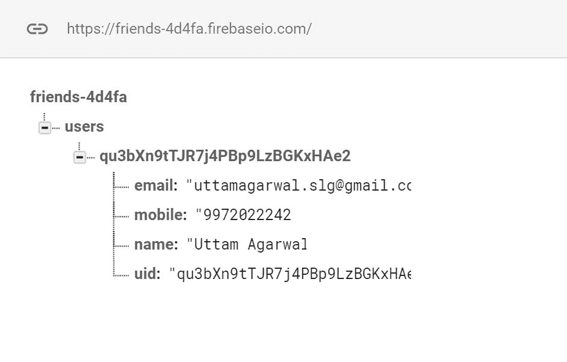
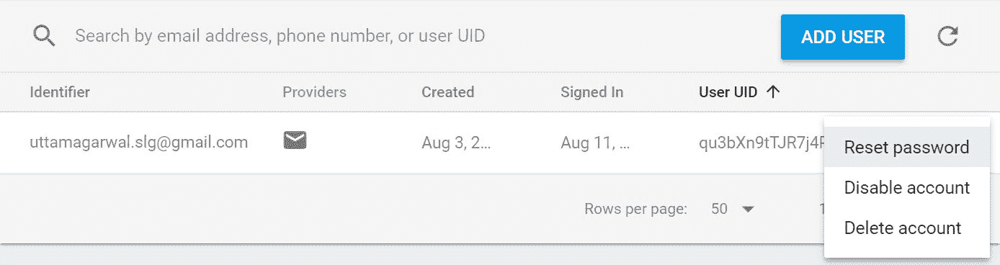
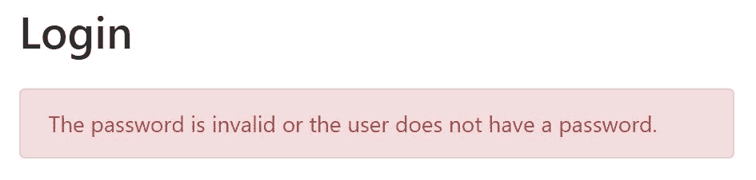
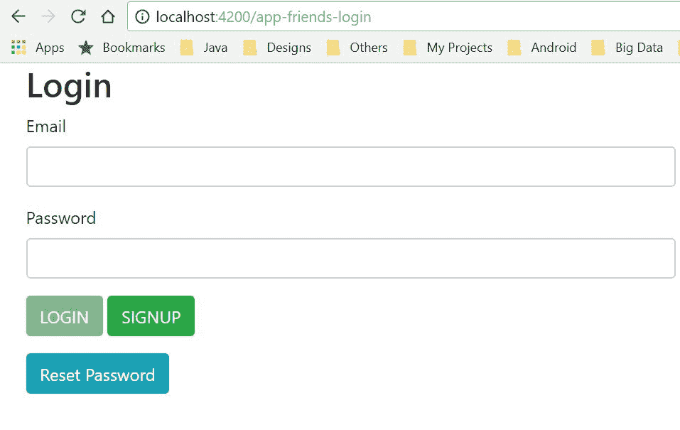
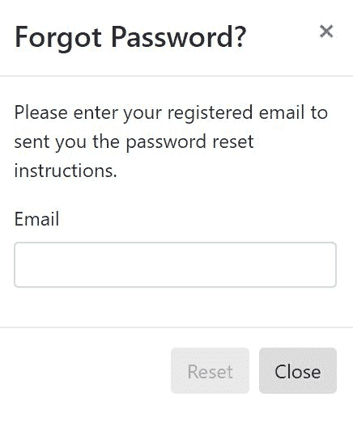
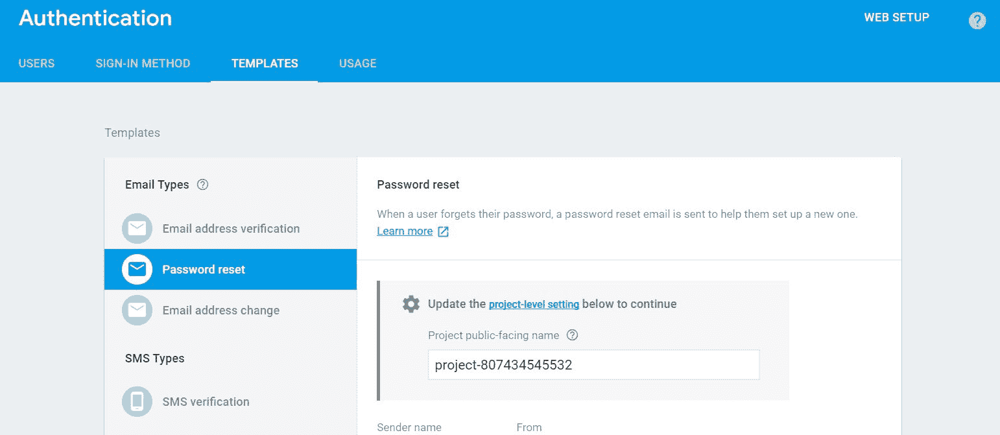

# 创建登录组件

在本章中，我们将构建我们的第二个组件。我们将创建一个登录页面，该页面将与注册页面类似。我们还将向服务中添加更多功能。我们将使用电子邮件/密码身份验证来登录用户。用户详情已在注册过程中添加到 Firebase 数据库中。我们将从 Firebase 检索用户详情并将它们传递到用户个人资料页面。我们还将处理常见的错误场景，因为这将加强这一概念。

本章将涵盖以下主题：

+   将登录功能添加到现有服务中

+   重复使用域模型

+   创建登录模板

+   登录错误处理

+   创建登录组件

+   重置密码

# 将登录功能添加到现有服务中

在上一章中，我们使用了电子邮件/密码身份验证并将我们的用户添加到 Firebase 数据库中。我们获得了将数据推送到 Firebase 的基本知识。在本节中，我们将登录用户并从 Firebase 检索用户详情。我们将在身份验证和用户服务中添加登录功能。

# 身份验证服务

在注册过程中，用户注册到 Firebase。`AngularFireAuth`有`signInWithEmailAndPassword`方法来登录用户。此方法返回`firebase.Promise<any>`。此类有`then`和`catch`方法来处理成功和失败场景。成功时，我们将用户重定向到用户个人资料页面，并在失败时显示错误消息。

考虑以下方法：

+   **登录**：此方法验证用户并在登录成功时传递用户信息，如下所示：

```js
public login(email: string, password: string): Promise<any> {
  return this.angularFireAuth.auth.signInWithEmailAndPassword(email, password);
}
```

+   **重置**：`AngularFireAuth`提供了一个重置密码的 API。Firebase 提供了密码重置的基础设施，例如密码电子邮件通知。我们只需在身份验证服务中调用`resetPassword`API，如下所示：

```js
public resetPassword(email: string): Promise<any> {
  return this.angularFireAuth.auth.sendPasswordResetEmail(email);
}
```

现在这是完整的`authentication.service.ts`：

```js
import {Injectable} from '@angular/core';
import {AngularFireAuth} from 'angularfire2/auth';

/**
 * Authentication service
 *
 */
@Injectable()
export class AuthenticationService {

  /**
   * Constructor
   *
   * @param {AngularFireAuth} angularFireAuth provides the 
     functionality related to authentication
   */
  constructor(private angularFireAuth: AngularFireAuth) {
  }

  public signup(email: string, password: string): Promise<any> {
    return 
    this.angularFireAuth.auth.createUserWithEmailAndPassword(email, 
    password);
  }

  public login(email: string, password: string): Promise<any> {
    return this.angularFireAuth.auth.signInWithEmailAndPassword(email, 
    password);
  }

  public resetPassword(email: string): Promise<any> {
    return this.angularFireAuth.auth.sendPasswordResetEmail(email);
  }

}
```

# 用户服务

在这里，我们介绍如何通过执行读取操作从 Firebase 检索值。`AngularFire2`有`AngularFireDatabase`类，该类提供了以下两种方法从 Firebase 读取数据：

+   `object`：此方法检索 JSON 对象。它返回`AngularFireObject<T>`，该对象提供了`valueChanges`方法以返回 Observable。例如，如果我们想从 Firebase 获取用户对象，则使用此方法。

+   `list`：此方法检索 JSON 对象的数组。它返回`AngularFireList<T>`，该对象提供了`valueChanges`方法以返回包含对象的 Observable。例如，如果我们想获取在我们应用程序中注册的所有用户，则此方法非常有用。

一旦用户输入正确的凭据，我们就使用`AngularFireDatabase`的`object`方法检索用户详情。

`AngularFireDatabase`类中的方法列表如下：

```js
export declare class AngularFireDatabase {
    app: FirebaseApp;
    database: database.Database;
    constructor(app: FirebaseApp);
    list<T>(pathOrRef: PathReference, queryFn?: QueryFn): 
    AngularFireList<T>;
    object<T>(pathOrRef: PathReference): AngularFireObject<T>;
    createPushId(): string | null;
}
```

在我们的应用程序中，我们主要使用`AngularFireDatabase`的`list`和`object`方法。这些方法接受`pathOrRef`参数。`list`方法接受一个额外的`QueryFn`参数。这些参数的目的是如下：

+   `pathOrRef`：此参数接受 Firebase 数据库中数据的路径。如下例所示，要访问用户数据，我们提供直到用户`uid`的路径。

```js
public getUser(uid: string): Observable<User> {
   return this.fireDb.object<User>(`${USERS_CHILD}/${uid}`).valueChanges();
}
```

例如，如果我们想检索用户 ID 为`qu3bXn9tTJR7j4PBp9LzBGKxHAe2`的用户信息，那么在这种情况下路径是`/users/qu3bXn9tTJR7j4PBp9LzBGKxHAe2`：



+   `QueryFn`：这是`list`方法中的可选参数，根据过滤条件过滤列表。例如，如果我们想获取前三个注册的用户，那么我们使用`limitToFirst`查询。

现在是完整的`user.service.ts`：

```js
import {Injectable} from '@angular/core';
import {AngularFireDatabase} from 'angularfire2/database';
import {User} from './user';
import 'firebase/storage';
import {USERS_CHILD} from './database-constants';
import {Observable} from 'rxjs/Observable';

/**
 * User service
 *
 */
@Injectable()
export class UserService {

  /**
   * Constructor
   *
   * @param {AngularFireDatabase} fireDb provides the functionality for 
     Firebase Database
   */
  constructor(private fireDb: AngularFireDatabase) {
  }

  public addUser(user: User): void {
    this.fireDb.object(`${USERS_CHILD}/${user.uid}`).set(user);
  }

  public getUser(uid: string): Observable<User> {
    return this.fireDb.object<User>
    (`${USERS_CHILD}/${uid}`).valueChanges();
  }
}
```

# 重新使用域模型

一旦用户成功登录，我们将从我们的 Firebase 数据库中检索用户对象。在成功登录后，我们获取用户的字符串`uid`，并使用这个`uid`从 Firebase 数据库中用户节点检索用户详细信息。正如前文所述，我们以以下 JSON 格式获取数据：

```js
{
  "email": "uttamagarwal.slg@gmail.com",
  "mobile": "9972022242",
  "name": "Uttam Agarwal",
  "uid": "qu3bXn9tTJR7j4PBp9LzBGKxHAe2"
}
```

此 JSON 对象需要映射到用户对象。当我们使用`AngularFireDatabase`从 Firebase 检索 JSON 对象时，我们在尖括号中提供类型对象`<User>`，这会将 JSON 映射到用户对象：

```js
public getUser(uid: string): Observable<User> {
  return this.fireDb.object<User>(`${USERS_CHILD}/${uid}`).valueChanges();
}
```

构造函数接受分配给其成员变量的所有参数，如下所示；以下是完整的`user.ts`：

```js
export class User {

   email: string;

   name: string;

   mobile: string;

   uid: string;

   constructor(email: string,
            name: string,
            mobile: string,
            uid: string) {
      this.email = email;
      this.name = name;
      this.mobile = mobile;
      this.uid = uid;
   }
}
```

# 创建登录模板

登录模板是视图，这部分与注册模板相似。我们重用了注册中的电子邮件和密码元素。它包含以下三个部分：

1.  **输入表单**：这是一个文本框，接受用户输入的值

1.  **提交操作**：它触发带有登录表单数据的`onLogin()`方法到组件

1.  **导航**：这部分将在第四章中详细说明，即组件之间的路由和导航，因此在这里我不会涉及这部分内容。

以下为完整的`login.component.html`：

```js
<div class="col-md-6 col-md-offset-3 container">
    <h2>Login</h2>
 <app-error-alert *ngIf="showError" [errorMessage]="errorMessage"></app-error-alert>
    <form name="form" (ngSubmit)="onLogin(loginFormData)" 
    #loginFormData='ngForm'>
        <div class="form-group">
            <label for="email">Email</label>
            <input type="text" class="form-control" name="email" 
            (ngModel)="email" #email="ngModel"
                   required
                   pattern="^\w+([\.-]?\w+)*@\w+([\.-]?\w+)*
                           (\.\w{2,3})+$"
                   id="email"/>
                 <div [hidden]="email.valid || email.pristine"
                 class="alert alert-danger">
                <div [hidden]="!email.hasError('required')">Email is 
                 required</div>
                <div [hidden]="!email.hasError('pattern')">Email format 
                 should be
                    <small><b>codingchum@gmail.com</b></small>
                </div>
            </div>
        </div>
        <div class="form-group">
            <label for="password">Password</label>
            <input type="password" class="form-control" name="password" 
             (ngModel)="password" #password="ngModel"
                   required id="password"/>
            <div [hidden]="password.valid || password.pristine"
                 class="alert alert-danger">
                Password is required
            </div>
        </div>
        <div class="form-group">
            <button type="submit" id="login-btn" class="btn btn-
            success" [disabled]="!loginFormData.form.valid">
            LOGIN</button>
            <button routerLink="/app-friends-signup" data-tag="signup-
             tag" routerLinkActive="active" 
             class="btn btn-success">
                SIGNUP
            </button>
        </div>
    </form>
</div>
```

# 登录错误处理

如前一章所述，我们将处理用户输入和服务器错误。在登录组件中，用户输入错误与注册组件中的相同。在这个组件中，我们使用了相同的内置 Angular 错误。此错误消息有助于用户输入正确信息。

# Firebase 错误

当用户登录到朋友的应用程序时，登录 Firebase API 会抛出错误。我们使用`AngularFireAuth`的`signInWithEmailAndPassword()`方法来注册用户。此 API 会抛出以下错误：

+   `auth/invalid-email`：正如其名所示，当用户提供一个无效的电子邮件地址时，会发生此错误。

+   `auth/user-disabled`：当注册用户账户在 Firebase 中被禁用时，将发生此错误。当注册用户不遵守应用程序的条款和条件时，需要此功能。然后，我们可以向用户显示有意义的消息。

您可以通过以下三个步骤禁用用户账户：

1.  前往 Firebase。

1.  在左侧面板转到 DEVELOP|认证。

1.  在右侧面板上突出显示用户。点击溢出图标，然后选择禁用账户选项。

查看以下 Firebase 中的禁用账户选项：



+   `auth/user-not-found`：当用户未在我们的应用程序中注册时，将发生此错误。在这种情况下，我们可以将用户直接导向注册页面。

+   `auth/wrong-password`：当密码不正确时，将发生此错误。在这种情况下，用户有两个选择：提供正确的密码或重置密码。

认证服务中的登录方法返回`Promise<any>`。我们在`catch`块中处理错误。

Promise 是任何异步操作的结果。在成功或失败操作之后，我们使用 Promise 对象检索存储的数据。

然后，我们将重用第二章中创建的“创建注册组件”错误警报，并显示错误：

```js
onLogin(loginFormData): void {
   this.authService.login(loginFormData.value.email, 
   loginFormData.value.password).then((userInfo) => {
      ...
   }).catch((error) => {
      this.errorMessage = error.message;
      this.showError = true;
   });
}
```

当用户输入错误密码时，将显示以下自定义错误消息：



# 创建登录组件

登录组件处理用户与 UI 的交互。它注入了三个服务以执行各种操作：

+   **认证服务**：它提供登录 API 以供注册用户登录。

+   **用户服务**：它提供了一种从 Firebase 数据库中检索用户详细信息的方法。

+   **路由器**：此服务用于在应用程序的不同页面之间进行路由。在登录组件中，我们将使用此服务将用户路由到注册页面。这将在下一章中详细介绍。

服务被注入到登录组件的`constructor`中，如下所示：

```js
constructor(
    private userService: UserService,
    private router: Router,
    private authService: AuthenticationService
) {}
```

登录组件也处理用户点击事件。当用户点击登录按钮时，将调用`onLogin`方法。此方法接受登录表单数据作为参数，包含用户输入的数据。我们通过`loginFormData.value.email`和`loginFormData.value.password`检索电子邮件和密码。这些数据被传递给认证服务进行登录。登录成功后，我们获取用户的`uid`，然后使用此`uid`从我们的 Firebase 数据库中检索用户详细信息。我们还在用户服务中缓存这些用户详细信息，以便在其他页面中将来参考：

```js
onLogin(loginFormData): void {
   this.authService.login(loginFormData.value.email, 
   loginFormData.value.password).then((userInfo) => {
      // Login user
      const uid: string = userInfo.uid;
      this.getUserInfo(uid);
   }).catch((error) => {
      ...
   });
}

private getUserInfo(uid: string) {
   this.userService.getUser(uid).subscribe(snapshot => {
      this.user = snapshot;
   });
}

```

最后，我们看到了如何以注册用户身份登录。现在，唯一缺少的部分是密码恢复，我们将在下一节中介绍。

现在的完整`login.component.ts`如下所示：

```js
import {Component} from '@angular/core';
import {User} from '../../services/user';
import {Router} from '@angular/router';
import {AuthenticationService} from '../../services/authentication.service';
import {UserService} from '../../services/user.service';
import {AngularFireAuth} from 'angularfire2/auth';

@Component({
  selector: 'app-friends-login',
  styleUrls: ['login.component.scss'],
  templateUrl: 'login.component.html',
})
export class LoginComponent {

  errorMessage: string;

  showError: boolean;

  private user: User;

  constructor(private userService: UserService,
              private router: Router,
              private authService: AuthenticationService,
              private angularFireAuth: AngularFireAuth) {
    this.angularFireAuth.auth.onAuthStateChanged(user => {
      if (user) {
        this.getUserInfo(user.uid);
      }
    });
  }

  onLogin(loginFormData): void {
    this.authService.login(loginFormData.value.email, 
    loginFormData.value.password).then((user) => {
      // Login user
      const uid: string = user.uid;
      this.getUserInfo(uid);
    }).catch((error) => {
      this.errorMessage = error.message;
      this.showError = true;
    });
  }

  private getUserInfo(uid: string) {
    this.userService.getUser(uid).subscribe(snapshot => {
      this.user = snapshot;
    });
  }
}
```

最后，我们在认证路由模块中注册`LoginComponent`：

```js
{path: 'app-friends-login', component: LoginComponent}
```

因此，将 URL `http://localhost:4200/app-friends-login` 粘贴到浏览器中，我们的登录组件看起来如下：



# 重置密码

在我们的应用程序中提供密码恢复选项是个好主意，这个过程提高了我们应用程序的可用性。令人兴奋的是，Firebase 提供了执行此操作所需的所有基础设施。我们将逐步在我们的应用程序中添加此功能。

# 添加模态模板

密码重置动作的第一步是获取用户电子邮件地址，我们将在此场景中使用模态框。模态框是一个出现在当前页面视图之上的弹出窗口/对话框。我们将使用模态框来显示弹出窗口以获取用户的电子邮件地址。

**在登录 html 中添加模态模板**：我们已经修改了 `login.component.html` 文件以添加重置密码按钮，如下面的代码所示：

```js
<div id="password_reset" class="modal fade" role="dialog">
    <div class="modal-dialog modal-sm">
        <form name="form" (ngSubmit)="onReset(resetFormData)" 
         #resetFormData='ngForm'>
            <div class="modal-content">
                <div class="modal-header">
                  <h4 class="modal-title">Forgot Password?</h4>
                  <button type="button" class="close" data-
                   dismiss="modal">&times;</button>
                </div>
                <div class="modal-body">
                    <p>Please enter your registered email to sent you  
                      the password reset instructions.</p>

                    <div class="form-group">
                        <label for="reset_email">Email</label>
                        <input type="text" class="form-control" 
                         name="email" (ngModel)="email"              
                         #email="ngModel"
                               required
                               pattern="^\w+([\.-]?\w+)*@\w+([\.-]?
                               \w+)*(\.\w{2,3})+$"
                               id="reset_email"/>
                    </div>
                </div>
                <div class="modal-footer form-group">
                    <button type="submit" class="btn btn-default" 
                     [disabled]="!resetFormData.form.valid"
                    >Reset
                    </button>
                    <button type="button" class="btn btn-default" data-
                     dismiss="modal">Close</button>
                </div>
            </div>
        </form>
    </div>
</div>
```

当用户点击重置密码时，以下模态框会出现：



到目前为止，这是完整的 `login.component.html`：

```js
<div class="col-md-6 col-md-offset-3 container">
    <h2>Login</h2>
 <app-error-alert *ngIf="showError" [errorMessage]="errorMessage"></app-error-alert>
    <form name="form" (ngSubmit)="onLogin(loginFormData)" 
     #loginFormData='ngForm'>
        <div class="form-group">
            <label for="email">Email</label>
            <input type="text" class="form-control" name="email" 
             (ngModel)="email" #email="ngModel"
                   required
                   pattern="^\w+([\.-]?\w+)*@\w+([\.-]?\w+)*
                   (\.\w{2,3})+$"
                   id="email"/>
            <div [hidden]="email.valid || email.pristine"
                 class="alert alert-danger">
                <div [hidden]="!email.hasError('required')">Email is 
                 required</div>
                <div [hidden]="!email.hasError('pattern')">Email format 
                should be
                    <small><b>codingchum@gmail.com</b></small>
                </div>
            </div>
        </div>
        <div class="form-group">
            <label for="password">Password</label>
            <input type="password" class="form-control" name="password" 
             (ngModel)="password" #password="ngModel"
                   required id="password"/>
            <div [hidden]="password.valid || password.pristine"
                 class="alert alert-danger">
                Password is required
            </div>
        </div>
        <div class="form-group">
            <button type="submit" id="login-btn" class="btn btn-
             success" [disabled]="!loginFormData.form.valid">
             LOGIN</button>
            <button routerLink="/app-friends-signup" data-tag="signup-
             tag" routerLinkActive="active" class="btn btn-success">
                SIGNUP
            </button>
        </div>
    </form>
    <button type="button" data-tag="password-reset-tag" class="btn btn-
     info" data-toggle="modal" data-target="#password_reset">
     Reset Password
    </button>
</div>
<div id="password_reset" class="modal fade" role="dialog">
    <div class="modal-dialog modal-sm">
        <form name="form" (ngSubmit)="onReset(resetFormData)" 
         #resetFormData='ngForm'>
            <div class="modal-content">
                <div class="modal-header">
                  <h4 class="modal-title">Forgot Password?</h4>
                  <button type="button" class="close" data-
                   dismiss="modal">&times;</button>
                </div>
                <div class="modal-body">
                    <p>Please enter your registered email to sent you 
                      the password reset instructions.</p>

                    <div class="form-group">
                        <label for="reset_email">Email</label>
                        <input type="text" class="form-control" 
                         name="email" (ngModel)="email" 
                         #email="ngModel"
                               required
                               pattern="^\w+([\.-]?\w+)*@\w+([\.-]?
                               \w+)*(\.\w{2,3})+$"
                               id="reset_email"/>
                    </div>
                </div>
                <div class="modal-footer form-group">
                    <button type="submit" class="btn btn-default" 
                     [disabled]="!resetFormData.form.valid"
                    >Reset
                    </button>
                    <button type="button" class="btn btn-default" data-
                     dismiss="modal">Close</button>
                </div>
            </div>
        </form>
    </div>
</div>
```

# 添加 onReset() 功能

下一步是在登录组件中添加重置方法。登录组件中的 `onReset()` 方法重置密码并将重置指令发送到注册的电子邮件。此电子邮件包含重置链接；当我们点击链接时，它会在另一个浏览器标签页中打开一个警报对话框以提供新密码。

我们在登录组件中添加了 `onReset()` 方法，如下所示：

```js
onReset(resetFormData): void {
  this.authService.resetPassword(resetFormData.value.email).then(() =>   
  {
    alert('Reset instruction sent to your mail');
  }).catch((error) => {
    this.errorMessage = error.message;
    this.showError = true;
  });
}
```

# 在 Firebase 中编辑密码重置模板

Firebase 提供了更改电子邮件模板的选项。我们可以自定义电子邮件正文。在此应用程序中，我们使用默认模板，尽管您可以通过此过程进行更改：

1.  前往 Firebase 身份验证

1.  在右侧面板上，点击 TEMPLATES 选项卡

1.  点击左侧面板上的密码重置选项

1.  点击铅笔图标进行编辑

考虑以下 Firebase 中的密码重置模板：



# 摘要

在本章中，我们实现了登录组件并增强了身份验证和用户服务。登录模板和组件看起来与登录模板和组件相似。然后我们在应用程序中实现了密码重置功能。Firebase 为实现重置密码功能提供了必要的元素。我们还实现了我们应用程序中的第一个模态框。

在下一章中，我们将介绍不同组件之间的导航流程。我们还将添加 Angular 守卫以根据守卫条件限制或启用对组件的导航。
