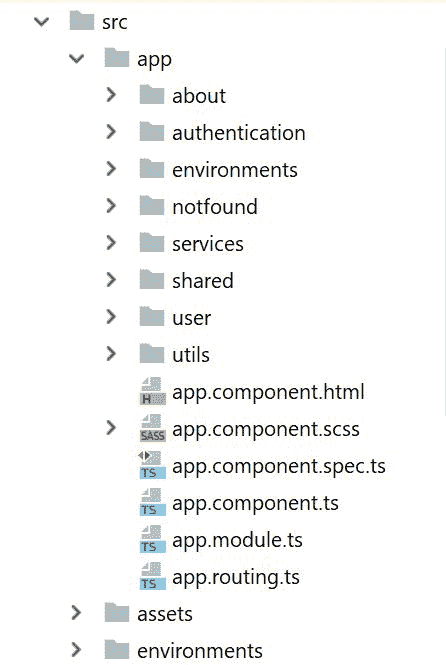

# 组件之间的路由和导航

在本章中，我们将涵盖 Angular 应用程序中的导航。我们将为我们的应用程序组件和认证实现路由器。我们还将涵盖组件视图的路由出口，并为认证创建一个路由模块。这将使我们的认证功能完全独立于其他模块。认证模块中的组件导航将由子路由模块处理。我们还将讨论 Angular 守卫，它将根据组件的条件限制导航。这增强了我们应用程序的安全性。最后，我们将深入探讨 Firebase 会话生命周期，并将用户重定向到登录或我的个人资料页面。

在本章中，我们将涵盖以下主题：

+   在应用程序组件中启用路由

+   为认证创建一个路由模块

+   添加路由链接

+   使用认证守卫

+   Firebase 会话生命周期

+   到目前为止，我们的项目结构如下：

# 在应用程序组件中启用路由

在本节中，我们启用路由并创建应用程序的主要导航栏。启用路由的步骤如下：

+   **添加基本参考 URL**：我们需要在`index.html`中添加一个基本元素，以告诉 Angular 路由器如何组合导航 URL。

我们在`index.html`的头部标签中添加了`href`：

```js
<base href="/">
```

+   **创建主要导航栏**：大多数 Web 应用程序在页面顶部都有一个导航栏，用于在应用程序的不同页面之间导航。我们使用 Bootstrap 的`nav bar`组件为我们的朋友应用程序添加了一个主要导航栏。

1.  第一步是在`app.component.html`中包含`nav`标签，如下所示：

```js
<nav class="navbar navbar-expand-lg navbar-light bg-color"></nav>
```

1.  第二步是使用`ul`标签创建项目列表：

```js
<ul class="navbar-nav"></ul>
```

1.  第三步是使用`li`标签创建项目。在我们的应用程序中，我们必须根据用户登录条件激活标签页，例如，当用户登录时，将显示用户个人资料标签页。我们遵循以下条件来激活导航栏中的标签页：

    +   **用户未登录**：我们只激活了关于和登录标签页。用户可以通过点击 SIGNUP 按钮导航到注册页面。

    +   **用户已登录**：我们停用了登录页面并激活了用户个人资料页面。

为了实现这些场景，我们将访问认证服务对象，检查用户登录状态，并激活标签页。我们使用`ngIf`指令进行条件检查：

```js
<li class="nav-item" *ngIf="authenticationService?.isAuthenticated()"><a class="nav-link" routerLink="/app-friends-userprofile" routerLinkActive="active">My Profile</a></li>
```

模板中`AuthenticationService`的`authenticationService?`中的问号确保对象不为空。该对象在`app.component.ts`中定义，如下所示：

```js
authenticationService: AuthenticationService;

constructor(private authService: AuthenticationService) {
   this.authenticationService = authService;
}
```

到目前为止的完整`app.component.html`如下所示：

```js
<h1 class="title">Friends - A Social App</h1>
<div class="nav-container">
<nav class="navbar navbar-expand-lg navbar-light bg-color">
  <div class="collapse navbar-collapse" id="navbarNav">
    <ul class="navbar-nav">
      <li class="nav-item"
      *ngIf="authenticationService?.isAuthenticated()"><a 
      class="nav-link" routerLink="/app-friends-userprofile" 
      routerLinkActive="active">My Profile</a></li>
      <li class="nav-item" 
     *ngIf="authenticationService?.isAuthenticated()">
      <a class="nav-link" routerLink="/app-friends-userfriends" 
      routerLinkActive="active">Friends</a></li>
      <li class="nav-item" ><a class="nav-link" routerLink="/app-
      friends-about" routerLinkActive="active">About</a></li>
      <li class="nav-item" active 
     *ngIf="!authenticationService?.isAuthenticated()">
      <a class="nav-link" routerLink="/app-friends-login" 
      routerLinkActive="active">Login</a></li>
    </ul>
    <div class="form-container">
    <form class="form-inline my-2 my-lg-0">
      <input class="form-control mr-sm-2" type="text" 
      placeholder="Search friends..." aria-label="Search">
      <button class="btn btn-success my-2 my-sm-0" 
      type="submit">Search</button>
    </form>
    </div>
  </div>
</nav>
</div>
<router-outlet></router-outlet>
```

+   **创建页面未找到和关于组件**：`PageNotFoundComponent`组件用于显示错误 URL 的视图，而`AboutComponent`用于显示有关网站的信息。

这两个组件看起来很相似，都有一个带有 `h2` 标签的消息标题。在这些组件中，我们在组件注释中定义了模板和样式表。这是创建组件的一种简单方法。

以下为完整的 `page-not-found.component.ts`:

```js
import {Component} from '@angular/core';

@Component({
  selector: 'app-friends-page-not-found',
  template: '<h2>Page not found</h2>'
})
export class PageNotFoundComponent {}
```

以下为完整的 `about.component.ts`：

```js
import {Component} from '@angular/core';

@Component({
  selector: 'app-friends-about',
  template: '<h2>Friends is a social app</h2>'
})
export class AboutComponent {}
```

+   **为应用组件创建路由**：我们为主应用模块创建关于和页面未找到组件的路由。

我们使用以下路径为两个组件创建路由；双星号（**）是一个通配符，因此当用户提供任何错误的 URL 时，路由器将导航到“页面未找到”组件：

```js
export const ROUTES: Routes = [
  {path: 'app-friends-about', component: AboutComponent, 
   pathMatch: 'full'},
  {path: '**', redirectTo: 'app-friends-page-not-found'},
];
```

我们在 Angular 的 `RouterModule` 中注入应用模块的路由；现在完整的 `app.routing.ts` 如下所示：

```js
import {RouterModule, Routes} from '@angular/router';
import {NgModule} from '@angular/core';
import {PageNotFoundComponent} from './notfound/page-not-found.component';
import {AboutComponent} from './about/about.component';

export const ROUTES: Routes = [
  {path: 'app-friends-about', component: AboutComponent,
   pathMatch: 'full'},
  {path: '**', redirectTo: 'app-friends-page-not-found'},
];

@NgModule({
  imports: [
    RouterModule.forRoot(
      ROUTES
    )],
  exports: [
    RouterModule
  ]
})
export class AppRouting {
}
```

最后，我们将应用路由模块集成到我们的主应用模块中。我们在导入标签中添加 `AppRouting`，如下所示：

```js
@NgModule({
    declarations: [
        AppComponent,
        PageNotFoundComponent,
        AboutComponent
    ],
    imports: [
        ...
        AuthenticationModule,
        AppRouting
    ],
    bootstrap: [AppComponent]
})
export class AppModule {}
```

当用户未登录时，导航栏将显示“关于”和“登录”标签页：


当用户登录时，导航栏将显示“我的资料”、“朋友”和“关于”标签页：


# 创建认证的路由模块

如前所述，我们将为每个功能模块构建单独的路由。在认证方面，我们有两个组件：

+   登录组件

+   注册组件

为了定义路由模块，我们需要创建导航路由常量：

```js
export const ROUTES: Routes = [
   {path: 'app-friends-login', component: LoginComponent},
   {path: 'app-friends-signup', component: SignupComponent}
];
```

由于这些路由是主应用组件的子组件，我们将路由注入到子路由模块中：

```js
RouterModule.forChild( ROUTES )
```

现在是完整的 `authentication.routing.ts`：

```js
import {NgModule} from '@angular/core';
import {RouterModule, Routes} from '@angular/router';
import {LoginComponent} from './login/login.component';
import {SignupComponent} from './signup/signup.component';

export const ROUTES: Routes = [
   {path: 'app-friends-login', component: LoginComponent},
   {path: 'app-friends-signup', component: SignupComponent}
];

/**
 * Authentication Routing Module
 */
@NgModule({
   imports: [
      RouterModule.forChild(ROUTES)
   ],
   exports: [
      RouterModule
   ]
})
export class AuthenticationRouting {}
```

创建路由模块后，我们将 `AuthenticationRouting` 模块包含在主认证模块中；这使得我们的认证模块独立于主应用模块。

下面是一个示例 `authentication.module.ts`：

```js
import { NgModule } from '@angular/core';
import { AuthenticationRouting } from './authentication.routing';

/**
 * Authentication Module
 */
@NgModule({
    imports: [
        ...
        AuthenticationRouting
    ],
    declarations: [
        ...
    ],
    providers: [
        ...
    ]
})
export class AuthenticationModule {
}
```

# 探索更多路由技术

在本节中，我们将探索我们应用程序中的两种导航方法：

+   **静态路由**：在静态路由中，我们将在 HTML 模板中提供导航。Angular 路由器提供了一个指令来执行导航操作。我们将包含 `routerLink` 指令，并将路由注入到子路由模块中：导航路径。如以下代码所示，当您点击“注册”按钮时，Angular 框架使用 `Router` 导航到注册组件：

```js
<button routerLink="/app-friends-signup" data-tag="signup-tag" routerLinkActive="active" class="btn btn-success">
SIGNUP
</button>
```

+   **动态路由**：在动态路由中，我们使用 Angular 框架的 `Router` 组件。该实例在构造函数中使用依赖注入：

```js
constructor(
    ...
    private router: Router,
){}
```

路由器提供了 `navigateByUrl()` 方法来导航到不同的组件；在以下场景中，登录成功后，我们导航到用户资料页面：

```js
private navigateToUserProfile() {
  this.router.navigateByUrl('/app-friends-userprofile');
}
```

现在我们已经为我们的应用程序添加了导航；因此，在下一节中，我们将添加基于条件的导航守卫。

# 添加认证守卫

守卫是 Angular 中一个非常有用的功能，用于保护路由。它们提供了用于限制我们应用程序中资源的安全功能，这样用户就不能在没有适当权限的情况下消费资源。

在 Angular 中有不同类型的守卫：

+   `CanActivate`：这个用于决定路由是否可以被激活

+   `CanActivateChild`：这个用于决定子路由是否可以被激活

+   `CanDeactivate`：这个用于决定路由是否可以被停用

+   `CanLoad`：这个用于决定模块是否可以懒加载

我们将查看 `CanActivate` 守卫在认证中的示例。我们将在用户认证成功后允许用户访问用户资料和好友页面。这意味着用户在没有认证的情况下将不允许访问 `http://localhost:4200/app-friends-userprofile`，并将被重定向到登录页面。激活守卫涉及的步骤如下：

1.  **守卫条件**：我们需要为激活守卫提供条件。在这个场景中，我们正在检查当前用户的状态。这个条件也用于应用程序组件中，根据条件显示各种标签页：

```js
public isAuthenticated(): boolean {
    let user = this.angularFireAuth.auth.currentUser;
    return user ? true : false;
}
```

现在的完整 `authentication.service.ts` 如下所示：

```js
import {Injectable} from '@angular/core';
import {AngularFireAuth} from 'angularfire2/auth';

/**
 * Authentication service
 *
 */
@Injectable()
export class AuthenticationService {

  /**
   * Constructor
   *
   * @param {AngularFireAuth} angularFireAuth provides the  
     functionality related to authentication
   */
  constructor(private angularFireAuth: AngularFireAuth) {
  }

  public signup(email: string, password: string): Promise<any> {
    return 
    this.angularFireAuth.auth.createUserWithEmailAndPassword(email, 
    password);
  }

  public login(email: string, password: string): Promise<any> {
    return 
    this.angularFireAuth.auth.signInWithEmailAndPassword(email, 
    password);
  }

  public resetPassword(email: string): Promise<any> {
    return this.angularFireAuth.auth.sendPasswordResetEmail(email);
  }

  public isAuthenticated(): boolean {
    const user = this.angularFireAuth.auth.currentUser;
    return user ? true : false;
  }

  public signout() {
    return this.angularFireAuth.auth.signOut();
  }
}
```

1.  **守卫实现**：我们通过扩展 `CanActivate` 接口并重写 `canActivate` 方法来实现守卫。在这个方法中，当用户认证无效时，我们将导航到登录页面，这有助于根据守卫条件将路由导航到登录页面。

现在的完整 `authentication.guard.ts` 如下所示：

```js
import {Injectable} from '@angular/core';
import {ActivatedRouteSnapshot, CanActivate, Router, RouterStateSnapshot} from '@angular/router';
import {AuthenticationService} from './authentication.service';

@Injectable()
export class AuthenticationGuard implements CanActivate {

  constructor(private authService: AuthenticationService,
              private router: Router) {
  }

  canActivate(route: ActivatedRouteSnapshot, state: 
  RouterStateSnapshot): boolean {
    const isLoggedIn: boolean = this.authService.isAuthenticated();
    if (!isLoggedIn) {
      this.router.navigateByUrl('/app-friends-login');
    }
    return isLoggedIn;
  }
}
```

1.  **向用户模块添加守卫**：这个守卫是在用户模块中添加的。用户模块将在下一章中更详细地介绍。在这里，我们配置了用户路由模块中的守卫，以限制用户访问用户资料和好友页面：

```js
import {AuthenticationGuard} from '../services/authentication.guard';

/**
 * User Module
 */
@NgModule({
    imports: [
        ...
    ],
    declarations: [
        ...
    ],
    providers: [
        AuthenticationGuard
    ]
})
export class UserModule {
}
```

1.  **添加守卫以保护组件**：如以下代码所示，我们可以将这个守卫添加到任何需要此条件检查的组件中。我们将守卫添加到用户资料和用户好友列表组件中。这意味着这些页面受到非法访问的保护。

这是完整的 `user-routing.module.ts`：

```js
import { NgModule } from '@angular/core';
import { Routes, RouterModule } from '@angular/router';
import {UserProfileComponent} from './user-profile/user-profile.component';
import {AuthenticationGuard} from '../services/authentication.guard';

const ROUTES: Routes = [
  {path: '', redirectTo: '/app-friends-userprofile', pathMatch: 
  'full' , canActivate: [AuthenticationGuard]},
  {path: 'app-friends-userprofile', component: UserProfileComponent 
   , canActivate: [AuthenticationGuard]}

];

@NgModule({
  imports: [
    RouterModule.forChild(ROUTES)
  ],
  exports: [
    RouterModule
  ],
  providers: [
    AuthenticationGuard
  ]
})
export class UserRoutingModule { }
```

1.  **测试守卫**：您可以通过将用户资料 URL (`http://localhost:4200/app-friends-userprofile`) 粘贴到浏览器中来测试这个守卫，用户将被重定向到登录页面进行认证。

# Firebase 会话生命周期

Firebase 会持久化用户状态，因此即使用户刷新或重新启动页面，用户也始终处于登录状态，页面将被重定向到主页而不是登录页面。我们将涵盖 Firebase 会话生命周期的两种导航场景：

+   **用户令牌存在**：在这种情况下，用户令牌仍然有效，用户将被重定向到用户资料页面。

`AngularFireAuth.auth` 提供了 `onAuthStateChanged` 方法来了解用户状态信息。我们订阅此方法，检查我们的用户，并将他们重定向到个人资料页面。

下面是 `login.component.ts` 的示例：

```js
import {Component} from '@angular/core';
import {User} from '../../services/user';
import {Router} from '@angular/router';
import {AuthenticationService} from '../../services/authentication.service';
import {UserService} from '../../services/user.service';
import {AngularFireAuth} from 'angularfire2/auth';

@Component({
  selector: 'app-friends-login',
  styleUrls: ['login.component.scss'],
  templateUrl: 'login.component.html',
})
export class LoginComponent {

  ...

  private user: User;

  constructor(private userService: UserService,
              private router: Router,
              private authService: AuthenticationService,
              private angularFireAuth: AngularFireAuth) {
    this.angularFireAuth.auth.onAuthStateChanged(user => {
      if (user) {
        this.getUserInfo(user.uid);
      }
    });
  }

  private navigateToUserProfile() {
    this.router.navigateByUrl('/app-friends-userprofile');
  }

  private getUserInfo(uid: string) {
    this.userService.getUser(uid).subscribe(snapshot => {
      this.user = snapshot;
      this.navigateToUserProfile();
    });
  }
}
```

+   **用户令牌过期**：在这种情况下，用户令牌过期，用户被重定向到登录页面。通常，用户令牌在以下条件下过期：

    +   **用户清除浏览历史**：用户令牌可以通过清除浏览器历史记录而过期。这将清除令牌，并将用户重定向到登录页面。

    +   **用户更改密码**：当用户更改密码时，用户令牌过期，并将他们重定向到登录页面。此场景将在下一章中介绍。

    +   **用户注销**：当用户注销时，用户令牌过期，并将他们重定向到登录页面。我们将在本节中介绍此场景。

我们已在用户资料页面实现了注销功能。用户资料组件将在下一章中更详细地介绍。在本节中，我们仅添加注销功能。

我们在用户资料模板中创建了一个按钮。当用户点击 LOGOUT 按钮时，用户会话将被清除，并将用户重定向到登录页面。

下面是 `user-profile.component.html` 的示例：

```js
<div class="user-profile">
    <div class="user-profile-btn">
        <button type="button" (click)='onLogout()' class="btn btn-
         info">LOGOUT</button>
    </div>
</div>
```

当用户点击 LOGOUT 按钮时，`UserProfileComponent` 的 `onLogout()` 方法被调用，我们在认证服务中调用 `signout()`。

下面是目前 `user-profile.component.ts` 的示例：

```js
import {Component, OnInit} from '@angular/core';
import {AuthenticationService} from '../../services/authentication.service';
import {Router} from '@angular/router';

@Component({
  selector: 'app-friends-userprofile',
  styleUrls: ['user-profile.component.scss'],
  templateUrl: 'user-profile.component.html'
})
export class UserProfileComponent {

  constructor(private authService: AuthenticationService,
              private router: Router) {
  }

  onLogout(): void {
    this.authService.signout().then(() => {
      this.navigateToLogin();
    });
  }

  navigateToLogin() {
    this.router.navigateByUrl('/app-friends-login');
  }
}
```

认证服务在 `authentication.service.ts` 中具有注销功能：

```js
public signout(): Promise<any> {
    return this.angularFireAuth.auth.signOut();
}
```

# 目前我们的项目结构如下：

因此，我们来到了第一个认证模块的结尾。我们的认证模块将如下所示：



# 摘要

在本章中，我们学习了页面视图之间的导航。我们在基础模块中启用了导航。我们使用路由链接指令创建我们的主要导航栏。我们看到了如何在模板中访问组件变量，并基于条件启用了导航项。我们构建了第一个守卫来限制用户导航到我们的用户资料页面，以便只有经过身份验证的用户才能查看页面。最后，我们介绍了 Firebase 会话生命周期，并基于用户令牌实现了导航。最后，我们探讨了认证模块的项目结构。

在下一章中，我们将构建更复杂的模块，并探索 Firebase 和 Angular 的更多功能。
