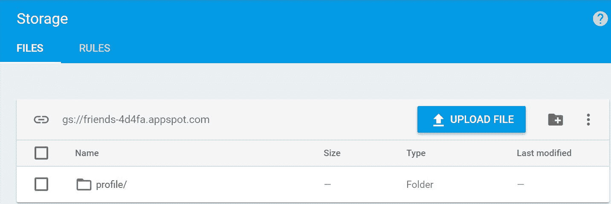

# 第七章：探索 Firebase 存储

在本章中，我们将继续探索 Firebase 的其他功能。如今，图像、音频和视频已成为任何网站开发的必要组成部分。考虑到这一点，Firebase 引入了存储功能。

我们将查看如何使用 Firebase 存储 API 上传个人资料图片。我们将使用 Firebase 门户上传一些随机图片，并使用 API 下载上传的图片以显示在我们的朋友列表中。然后，我们将查看如何在 Firebase 存储中删除文件。最后，我们将介绍错误处理。

在本章中，我们将涵盖以下主题：

+   介绍 Firebase 存储

+   配置 Firebase 存储

+   上传个人资料图片

+   下载朋友的照片

+   删除个人资料图片

+   Firebase 存储中的错误处理

# 介绍 Firebase 存储

Firebase 存储为应用程序开发者提供了在存储中存储各种内容类型的灵活性。它存储图像、视频和音频。内容存储在 Google Cloud 存储桶中，并且可以从 Firebase 和 Google Cloud 访问。

Firebase 存储与 Firebase 身份验证集成，并提供了强大的安全性。我们还可以应用声明式安全模型来控制对内容访问的控制。我们将在稍后的部分中更详细地研究这一点。

Firebase 存储提供了以下关键特性：

+   **缩放**：它由 Google Cloud Storage 支持，可以扩展到 PB 级别的容量。您可以在[`cloud.google.com/storage/`](https://cloud.google.com/storage/)了解更多关于 Google Cloud Storage 的信息。

+   **安全性**：每个上传的文件都可以使用存储安全规则进行保护。

Firebase 存储的默认安全规则如下：

```js
service firebase.storage {
  match /b/{bucket}/o {
    match /{allPaths=**} {
      allow read, write: if request.auth!=null;
    }
  }
}
```

+   **网络**：Firebase 存储在文件的上传和下载过程中自动处理网络问题。

# 配置 Firebase 存储

要在我们的应用程序中配置 Firebase 存储，我们需要存储桶 URL。这可以在标题下的“存储”选项卡中的“文件”标签内找到，如下面的截图所示；在我们的案例中，应用程序朋友的存储桶 URL 为`gs://friends.4d4fa.appspot.com`：



这是修改后的`environment.ts`文件，其中包含存储桶 URL：

```js
export const environment = {
    production: false,
    firebase: {
        apiKey: 'XXXX',
        authDomain: 'friends-4d4fa.firebaseapp.com',
        databaseURL: 'https://friends-4d4fa.firebaseio.com',
        projectId: 'friends-4d4fa',
        storageBucket: 'friends-4d4fa.appspot.com',
        messagingSenderId: '321535044959'
    }
};
```

# 上传个人资料图片

在本节中，我们将介绍如何将文件上传到 Firebase 存储。在用户资料页面上，我们将在页面顶部添加用户个人资料图片。

上传和显示用户个人资料图片的步骤如下：

1.  **在用户资料模板中添加 HTML 属性**：我们提供了一个`input`标签，用于从文件选择器中获取用户选择的图片。通常，在具有文件类型的`input`标签中，我们有一个按钮来选择文件；然而，在这种情况下，我们需要用户点击默认图片。我们使用内置样式隐藏了`input`标签中的按钮，如下所示：

```js
<div class="person-icon">
  
  <input (change)="onPersonEdit($event)" required accept=".jpg" 
   type="file" style="opacity: 0.0; position: absolute; top:120px; 
   left: 30px; bottom: 0; right:0; width: 200px; height:200px;" />
</div>
```

1.  **在样式表中添加默认图片**：最初，我们通过在 `user-profile.component.ts` 文件中声明默认图片路径来显示默认图片，如下所示：

```js
export class UserProfileComponent implements OnInit {

    profileImage: any = '../../../assets/images/person_edit.png';
 ...
}
```

以下是对 `user-profile.component.html` 文件进行的修改：

```js
<div class="user-profile" *ngIf="user">
    <div class="person-icon">
      
      <input (change)="onPersonEdit($event)" required accept=".jpg"  
        type="file" style="opacity: 0.0; position: absolute;  
        top:120px; left: 30px; bottom: 0; right:0; width: 200px; 
        height:200px;" />
    </div>
...
</div>
<app-edit-dialog></app-edit-dialog>
```

下面是修改后的 `user-profile.component.scss` 文件：

```js
.user-profile{
    width: 50%;
    margin-left: 24px;
    margin-top: 10px;
    .person-icon{
        width: 200px;
        height: 200px;
    }
    ...
}
```

1.  **在用户个人资料组件中处理点击事件**：我们将实现 `onPersonEdit()` 方法，它接受 `event` 作为其参数。如以下代码所示，我们需要从事件对象中检索选定的文件并将它们传递给 `UserService`：

```js
onPersonEdit(event) {
   const selectedFiles: FileList = event.target.files;
   const file = selectedFiles.item(0);
   this.userService.addProfileImage(this.user, file);
}
```

1.  **在用户服务中添加方法**：在 `user.service.ts` 中，我们在构造函数中初始化 Firebase 存储实例，如下所示：

```js
@Injectable()
export class UserService {

   private fbStorage: any;

   private basePath = '/profile';

   /**
    * Constructor
    *
    * @param {AngularFireDatabase} fireDb provides the functionality 
      related to authentication
    */
   constructor(private fireDb: AngularFireDatabase) {
      this.fbStorage = fireDb.app.storage();
   }
  ...
}
```

现在我们实现用户服务中的 `addProfileImage()` 方法。

1.  首先，我们为 Firebase 存储中的图片存储创建路径：

```js
`${this.basePath}/${file.name}`
```

1.  其次，我们调用 Firebase 存储引用的 `put()` 方法，如下所示：

```js
this.fbStorage.ref(`${this.basePath}/${file.name}`).put(file)
```

在成功上传后，我们在 Firebase 的用户节点中保存下载 URL 并刷新缓存的用户对象：

```js
public addProfileImage(user: User, file: File) {
  this.fbStorage.ref(`${this.basePath}/${file.name}`).
  put(file).then(
    snapshot => {
      const imageUrl: string = snapshot.downloadURL;
      this.fireDb.object(`${USERS_CHILD}/${user.uid}`).
      update({image: imageUrl});
      user.image = imageUrl;
      this.saveUser(user);

    }).catch((error) => {
      ...
  });
}
```

1.  **刷新用户个人资料图片**：在成功上传后，我们需要更新我们用户个人资料页面中的图片。我们在用户个人资料组件中订阅 `user` 可观察对象并更新个人资料图片，如下所示：

```js
ngOnInit() {
    this.user = this.userService.getSavedUser().getValue();
    this.userService.getSavedUser().subscribe(
        (user) => {
            if (this.user.image) {
                this.profileImage = this.user.image;
            }
        }
    );
}
```

在刷新成功后，用户个人资料页面将如下所示：


# 下载好友图片

在用户个人资料页面，我们在 Firebase 存储中上传了个人资料图片。我们还在 Firebase 的用户节点中存储了一个可下载的 URL，好友可以通过 UID 访问。在获取好友列表后，我们必须调用另一个 Firebase API 从我们的用户节点获取可下载的 URL。以下是可以下载的 URL：

```js
https://firebasestorage.googleapis.com/v0/b/friends-4d4fa.appspot.com/o/profile%2Fclaire.jpg?alt=media&token=e00012af-c71c-48eb-92bc-4a0c9f989cbd
```

在 HTML 中，图片通过 `` 标签定义。`src` 属性指定了图片的 URL 地址，如下所示：

```js

```

在 `user-friends.component.html` 文件中，我们添加了带有可下载 URL 的默认图片：

```js

```

在 `user-friends.component.scss` 文件中，我们使用了 `background-image` 并添加了 `width` 和 `height` 以确保图片能够适应卡片布局，如下所示：

```js
.main_container {
    margin-top: 10px;
    margin-left: 80px;
    .content_container {
        display: inline;
        .list {
            float: left;
            .card-img-top {
                height: 180px;
                width: 260px;
                background-image: 
                url('../../../assets/images/person.png');
            }
        }

        .left {
            float: left;
            margin-top: 140px;
        }

        .right {
            float: left;
            margin-top: 140px;
        }
    }
}
```

Firebase 提供了一个 API，可以通过 Firebase 存储获取可下载的 URL：

```js
public getDownloadURL(user: User, file: File) {    this.fbStorage.child('images/claire.jpg').getDownloadURL().then((url) => {
        // assign to the img src
    }).catch((error) => {
        // Handle any errors
    });
}
```

# 删除个人资料图片

Firebase 存储提供了一个 API 用于从 Firebase 删除文件。`delete` 操作与其他 Firebase 存储 API 类似。我们尚未在我们的应用程序中实现此用例；然而，您可能在您的应用程序中需要此概念：

```js
public deleteFile() {
    this.fbStorage.child('images/claire.jpg').delete().then(function()  
{
        // File deleted successfully
    }).catch((error) => {
        // Handle any errors
    });
}
```

# 处理 Firebase 存储中的错误

Firebase 存储根据不同的条件抛出错误，如下所示：

+   **storage/unknown**：这可能是因为任何未知错误。这与 `switch...case` 语句中的默认条件类似。

+   **storage/object_not_found**：当文件/图片引用在 Firebase 存储位置不可用时发生。

+   **storage/bucket_not_found**：当 Firebase 存储桶未配置时，此错误发生。

+   **storage/project_not_found**: 当 Firebase 项目未配置 Firebase 存储时，此错误发生。

+   **storage/quota_exceeded**: 当免费套餐计划到期并被要求升级到付费计划时，此错误发生。

+   **storage/unauthenticated**: 当用户未认证但仍然能够访问 Firebase 存储中的文件和图片时，此错误发生。

+   **storage/unauthorized**: 当未经授权的用户访问 Firebase 存储中的文件/图片时，此错误发生。

+   **storage/retry_limit_exceeded**: 当由于网络缓慢或无网络而导致用户超过重试限制时，此错误发生。

+   **storage/invalid_checksum**: 当客户端的校验和与服务器的不匹配时，此错误发生。

+   **storage/canceled**: 当用户干预上传或下载操作时，此错误发生。

+   **storage/invalid_event_name**: 当提供给 Firebase 存储 API 的无效事件名称时，此错误发生。正确的事件是 *running*，*progress* 和 *pause*。

+   **storage/invalid-argument**: Firebase 存储 `put()` 方法接受文件、`Blob` 和 `UInt8` 作为参数。当我们传递错误参数时，此错误发生。

当我们在应用程序中遇到错误时，我们实现 Promise 的`then()`方法，检索错误消息并在警告对话框中显示它。

这里是`user.service.ts`类中修改后的`addProfileImage()`方法：

```js
public addProfileImage(user: User, file: File) {
  this.fbStorage.ref(`${this.basePath}/${file.name}`).put(file).then(
    snapshot => {
      ...

    }).catch((error) => {
    const errorMessage = error.message;
    alert(errorMessage);
  });
}
```

# 摘要

在本章中，我们讨论了 Firebase 存储。我们将个人资料图片上传到 Firebase 存储，并将可下载的 URL 存储在我们的数据库中的用户节点中。我们在 HTML 的`img`标签中显示了图片，因为这有助于从 Firebase 存储中下载图片。我们介绍了 Firebase 安全，用户需要正确认证才能访问 Firebase 存储中的图片/文件。最后，我们讨论了 Firebase 存储的错误处理。

在下一章中，我们将介绍我们应用程序更有趣和令人兴奋的部分。我们将创建一个聊天应用程序，并介绍 Firebase 如何支持实时更新。
