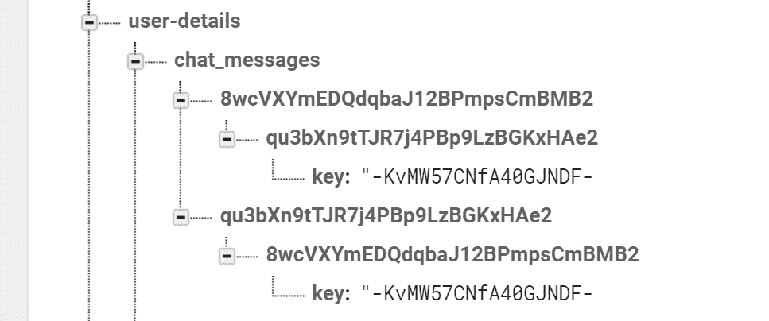
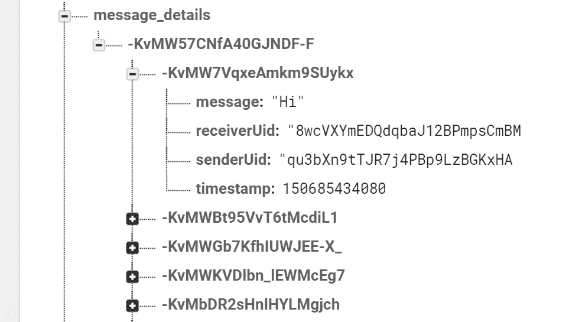

# 将聊天组件与 Firebase 数据库连接

在本章中，我们将集成我们的聊天组件与新的消息服务。我们将讨论一种新的方法，使用路由参数将我们的数据传递到聊天模块。一旦从用户朋友列表组件传递了朋友的 UID，然后我们将这个朋友的 UID 传递给不同的聊天组件，因为消息列表和消息表单组件需要这些数据。我们还将为我们的聊天应用设计数据库，因为良好的设计可以避免数据重复。一旦数据库准备就绪，我们将从消息服务查询数据，并将消息服务与聊天组件集成。

在本章中，我们将涵盖以下主题：

+   使用路由参数传递数据

+   将朋友数据传递到不同的聊天组件

+   设计聊天应用的 Firebase 数据库

+   创建消息服务

+   将服务集成到聊天组件中

# 使用路由参数传递数据

当用户点击“聊天”按钮时，我们使用路由参数将朋友 UID 传递给聊天组件。

在第五章，“创建用户个人资料页面”中，我们使用 RxJS 库中的`BehaviorSubject`传递用户数据。在本节中，我们将使用路由链接的参数来传递朋友的 UID。我们执行以下三个步骤来使用路由参数传递数据：

1.  添加路由参数 ID

1.  将路由链接到参数

1.  读取参数

# 添加路由参数 ID

在前面列表中提到的第一步，我们需要将朋友的 UID 参数添加到路由链接中。我们在此处将 ID 参数添加到路径元素中，如下所示：

```js
export const ROUTES: Routes = [
    { path: 'app-friends-chat/:id', component: ChatComponent }
];
```

当用户点击“聊天”按钮时，此 ID 将作为`http://localhost:4200/friends-chat/8wcVXYmEDQdqbaJ12BPmpsCmBMB2`添加到 URL 中。

# 将路由链接到参数

在前面列表中提到的第二步，我们需要将朋友的 UID 链接到路由链接。以下是有两种方法来实现这一点：

+   **路由链接指令**：我们可以直接使用`routerLink`指令来链接参数 ID，如下所示：

```js
<div *ngFor="let friend of friends" class="card" [routerLink]="['/app-friends-chat' , friend.getUid()]"></div>
```

+   **程序化使用路由**：当用户点击“聊天”按钮时，我们将 UID 传递给方法参数，并使用路由传递数据。

我们在我们的用户朋友列表中添加一个聊天按钮。我们修改用户朋友的模板，如下所示：

```js
<div *ngFor="let friend of friends" class="card">
    ...
        <button (click)="onChat(friend.uid)" class="btn btn-outline-
         success my-2 my-sm-0" type="submit">Chat</button>
    </div>
    ...
</div>
```

当用户点击“聊天”按钮时，将 UID 作为参数调用`onChat()`方法。最后，我们调用`router`方法将`id`作为路由参数传递：

```js
onChat(id: string): void {
    this.router.navigate(['/app-friends-chat' , id]);
}
```

# 读取参数

我们使用`ActivatedRoute`来读取参数 ID。该组件提供了一组参数来读取 ID。我们订阅路由参数，并将订阅对象存储在成员变量中，并在 Angular 的生命周期`ngOnDestroy()`方法中取消订阅。

`OnDestroy` 是一个 Angular 生命周期钩子接口。它有一个 `ngOnDestroy()` 方法，当组件被销毁时调用，用于清理逻辑。

以下是到目前为止的完整 `chat.component.ts` 文件：

```js
import {Component} from '@angular/core';
import {ActivatedRoute} from '@angular/router';

@Component({
    selector: 'friends-chat',
    styleUrls: ['chat.component.scss'],
    templateUrl: 'chat.component.html',
})
export class ChatComponent {

    uid: string;

    private sub: any;

    constructor(private route: ActivatedRoute) {

    }

    ngOnInit() {
        this.sub = this.route.params.subscribe(params => {
            this.uid = params['id'];
        });
    }

    ngOnDestroy() {
        this.sub.unsubscribe();
    }
}
```

我们将在下一节中介绍如何将 UID 数据传递给其他聊天组件。

# 将朋友数据传递给不同的聊天组件

一旦我们在聊天模块中有了朋友的 UID，我们可以使用 Angular 数据绑定将朋友的 UID 传递给我们的消息列表和消息表单组件。我们执行以下两个步骤来将数据传递给两个聊天组件：

1.  **声明输入变量**：我们使用 Angular 的 `@Input` 注解在两个聊天组件中声明输入变量。以下代码片段显示了消息列表和消息表单组件的更改。

```js
chat-message-list.component.ts:
```

```js
export class ChatMessageListComponent implements OnInit , AfterViewChecked{
    @Input() friendUid: string;

}
chat-message-form.component.ts file:
```

```js
export class ChatMessageFormComponent implements OnInit {
  @Input() friendUid: string;
```

1.  **将数据绑定到输入**：我们可以将输入变量 `friendUid` 绑定到从用户模块传递来的 `uid`：

```js
<div class="col-md-8 col-md-offset-2">
    <app-chat-message-list [friendUid]="uid">
    </app-chat-message-list>
    <app-chat-message-form [friendUid]="uid">
    </app-chat-message-form>
</div>
```

我们将使用这个朋友的 UID 来读取或更新 Firebase 数据库。

# 设计用于聊天的 Firebase 数据库

设计 Firebase 数据库是编写聊天功能中最关键的部分。

聊天涉及两个人之间的交流。它有一个发送者和接收者，两人都可以看到相同的文本消息。我们必须将两个用户与相同的消息关联起来，这主要涉及两个步骤：

1.  **创建新的聊天 ID**：第一步是为两个人关联唯一的消息 ID。我们创建一个唯一的消息 ID，并使用他们的 UID 将两个用户关联起来。如图所示，我们将 "-KvMW57CNfA40GJNDF-F" 密钥与两个 UID 关联起来。



当用户点击他们朋友页面上的聊天按钮时，我们将检查密钥并创建新的 ID，如下所示：

```js
const key = this.fireDb.createPushId();
```

`AngularFireDatabase` 有一个 `createPushId()` 方法来创建唯一的 ID。

这里是来自 `messaging.service.ts` 的示例代码：

```js
freshlyCreateChatIDEntry(uid: string, friendUid: string): string {
  const key = this.fireDb.createPushId();
  this.fireDb.object(`${USER_DETAILS_CHILD}/${CHAT_MESSAGES_CHILD}/${uid}/${friendUid}`).set({key: key});
  this.fireDb.object(`${USER_DETAILS_CHILD}/${CHAT_MESSAGES_CHILD}/${friendUid}/${uid}`).set({key: key});
  return key;
}
```

1.  **将消息与密钥关联**：一旦我们为用户创建了密钥，我们就在 Firebase 数据库中创建新的节点，将此密钥作为节点关联，并将消息推送到此节点，以便两个用户都能访问。在数据库模式中，我们将创建具有 UIDs 的接收者和发送者节点，以便我们知道谁发送了消息，并根据此条件在聊天窗口中排列消息。



我们将密钥存储在服务的成员变量中，以便我们使用这个密钥向我们的 Firebase 数据库推送一条新消息。

以下是从 `messaging.service.ts` 的示例代码：

```js
createNewMessage(newMessage: Message) {
  const messageKey = this.fireDb.createPushId();
  this.fireDb.object(`${MESSAGE_DETAILS_CHILD}/${this.key}/
  ${messageKey}`).set(newMessage).catch(error => {
    console.log(error);
  });
}
```

# 创建消息服务

创建消息服务的第一步是定义数据模型。我们创建一个消息模型，具有属性；消息模型由以下四个属性组成：

+   **消息**：这包含一个字符串类型的消息。

+   **发送者 UID**：发送者 UID 用于知道特定消息的发送者身份，并编写逻辑在聊天窗口的左侧面板上显示文本消息。

+   **接收者 UID**：接收者 UID 用于识别特定消息的接收者，并编写逻辑在聊天窗口的右侧面板上显示文本消息。

+   **时间戳**：此属性用于显示发送消息的日期和时间。

目前为止的`message.ts`文件如下：

```js
export class Message {

   message: string;

   senderUid: string;

   receiverUid: string;

   timestamp: number;

   constructor(message: string,
            senderUid: string,
            receiverUid: string,
            timestamp: number) {
      this.message = message;
      this.senderUid = senderUid;
      this.receiverUid = receiverUid;
      this.timestamp = timestamp;
   }

}
```

作为聊天功能的一部分，我们声明一个常量以了解 Firebase 数据库的节点，如下所示。

目前为止的`database-constants.ts`文件如下：

```js
export const USER_DETAILS_CHILD = 'user-details';
export const CHAT_MESSAGES_CHILD = "chat_messages";
export const MESSAGE_DETAILS_CHILD = "message_details";
```

我们消息功能的核心部分是服务。此服务负责创建聊天 ID、推送新消息和获取消息。作为此应用程序的一部分，我们引入了以下四个 API：

+   **`isMessagePresent()`**：当用户点击聊天按钮时，我们检查是否存在消息键，并将键存储在此服务的成员变量中。我们使用此键将任何新消息推送到 Firebase 数据库。

+   `freshlyCreateChatIdEntry()`：当用户开始与朋友进行新的沟通时，我们调用此 API 创建键并将其存储在 Firebase 数据库中。

+   `getMessages()`：此 API 用于订阅对话中的所有消息，并且当收到新消息时，我们也会收到更新。

+   `createNewMessage()`：当用户点击发送按钮时，我们调用此 API 将新消息存储在 Firebase 数据库中。新消息包括消息文本、发送者 UID、接收者 UID 和时间戳。

目前为止的`messaging.service.ts`文件如下：

```js
import {Injectable} from '@angular/core';
import {AngularFireDatabase} from 'angularfire2/database';
import {CHAT_MESSAGES_CHILD, MESSAGE_DETAILS_CHILD, USER_DETAILS_CHILD} from './database-constants';
import {FirebaseApp} from 'angularfire2';
import 'firebase/storage';
import {Observable} from 'rxjs/Observable';
import {Message} from './message';

/**
 * Messaging service
 *
 */
@Injectable()
export class MessagingService {

  key: string;

  /**
   * Constructor
   *
   * @param {AngularFireDatabase} fireDb provides the functionality 
     related to authentication
   */
  constructor(private fireDb: AngularFireDatabase) {
  }

  isMessagePresent(uid: string, friendUid: string): Observable<any> {
    return  
    this.fireDb.object(`${USER_DETAILS_CHILD}/${CHAT_MESSAGES_CHILD}/
    ${uid}/${friendUid}`).valueChanges();
  }

  createNewMessage(newMessage: Message) {
    const messageKey = this.fireDb.createPushId();
    this.fireDb.object(`${MESSAGE_DETAILS_CHILD}/${this.key}/
    ${messageKey}`).set(newMessage).catch(error => {
      console.log(error);
    });
  }

  freshlyCreateChatIDEntry(uid: string, friendUid: string): string {
    const key = this.fireDb.createPushId();
    this.fireDb.object(`${USER_DETAILS_CHILD}/
    ${CHAT_MESSAGES_CHILD}/${uid}/${friendUid}`).set({key: key});
    this.fireDb.object(`${USER_DETAILS_CHILD}/
    ${CHAT_MESSAGES_CHILD}/${friendUid}/${uid}`).set({key: key});
    return key;
  }

  getMessages(key: string): Observable<Message[]> {
    return this.fireDb.list<Message> 
    (`${MESSAGE_DETAILS_CHILD}/${key}`).valueChanges();
  }

  setKey(key: string) {
    this.key = key;
  }
}
```

在下一节中，我们将此服务集成到我们的聊天组件中。

# 将我们的服务集成到聊天组件中

最后，我们将消息服务集成到组件中。我们将涵盖以下三个用例：

+   **检查新聊天的消息键**：当用户与朋友开始对话时，我们调用消息服务的`isMessagePresent()` API。对于新的对话，此聊天键将不存在，我们需要创建新的键并使用相同的键进行后续沟通：

```js
ngOnInit() {
    this.user = this.userService.getSavedUser().getValue();
    this.messageService.isMessagePresent(this.user.getUid(),  
    this.friendUid).subscribe(snapshot => {
        let snapshotValue = snapshot.val();
        let friend: Friend;
        if (snapshotValue == null) {
            console.log("Message is empty");
            this.key = 
            this.messageService.freshlyCreateChatIDEntry
            (this.user.getUid(), this.friendUid);
        } else {
            this.key = snapshotValue.key;
        }
        this.messageService.setKey(this.key);
        this.subscribeMessages();
    });
}
```

+   **订阅消息列表**：我们将调用`getMessages()`方法来获取消息列表的可观察对象。然后我们将订阅这个可观察对象以获取消息列表，并将其分配给`messages`成员变量：

```js
subscribeMessages() {
    this.messageService.getMessages(this.key)
        .subscribe(
            messages => {
                this.messages = messages;
            });

}
```

目前为止的`chat-message-list.component.ts`文件如下：

```js
import {AfterViewChecked, ChangeDetectorRef, Component, ElementRef, Input, OnInit, ViewChild} from '@angular/core';
import {MessagingService} from '../../services/messaging.service';
import {Message} from '../../services/message';
import {UserService} from '../../services/user.service';
import {User} from '../../services/user';

@Component({
   selector: 'app-chat-message-list',
   styleUrls: ['chat-message-list.component.scss'],
   templateUrl: 'chat-message-list.component.html'
})
export class ChatMessageListComponent implements OnInit, AfterViewChecked {
   @Input() friendUid: string;
   private user: User;
   messages: Message[];
   key: string;
   @ViewChild('scrollContainer') private scrollContainer: 
   ElementRef;

   constructor(private messageService: MessagingService,
            private userService: UserService,
            private cdRef: ChangeDetectorRef) {
   }

   ngOnInit() {
      this.user = this.userService.getSavedUser().getValue();
      this.messageService.isMessagePresent(this.user.uid , 
      this.friendUid).subscribe(snapshot => {
         if (snapshot == null) {
            console.log('Message is empty');
            this.key = 
            this.messageService.freshlyCreateChatIDEntry
            (this.user.uid, this.friendUid);
         } else {
            this.key = snapshot.key;
         }
         this.messageService.setKey(this.key);
         this.subscribeMessages();
      });
   }

   ngAfterViewChecked() {
      this.scrollToBottom();
      this.cdRef.detectChanges();
   }

   scrollToBottom(): void {
      try {
         this.scrollContainer.nativeElement.scrollTop = 
         this.scrollContainer.nativeElement.scrollHeight;
      } catch (err) {
         console.log('Error');
      }
   }

   subscribeMessages() {
      this.messageService.getMessages(this.key)
         .subscribe(
            messages => {
               this.messages = messages;
            });

   }

}
```

+   **向 Firebase 数据库发送消息**：当用户输入消息并点击发送按钮时，我们创建新的消息对象，并在消息服务中调用`createNewMessage()`方法，这将负责将消息发送到 Firebase 数据库。

```js
sendMessage() {
   const message: Message = new Message(this.newMessage, 
   this.uid, this.friendUid, Date.now());
   this.messageService.createNewMessage(message);
}
```

目前为止的`chat-message-form.component.ts`文件如下：

```js
import {Component, Input, OnInit} from '@angular/core';
import {MessagingService} from '../../services/messaging.service';
import {Message} from '../../services/message';
import {UserService} from '../../services/user.service';

@Component({
   selector: 'app-chat-message-form',
   styleUrls: ['chat-message-form.component.scss'],
   templateUrl: 'chat-message-form.component.html'
})
export class ChatMessageFormComponent implements OnInit {
   @Input() friendUid: string;

   uid: string;

   newMessage: string;

   constructor(private messageService: MessagingService,
            private userService: UserService) {
   }

   ngOnInit() {
      this.uid = this.userService.getSavedUser().getValue().uid;
   }

   sendMessage() {
      const message: Message = new Message(this.newMessage, 
      this.uid, this.friendUid, Date.now());
      this.messageService.createNewMessage(message);
   }

}
```

最后，我们为我们的朋友应用程序创建了一个完全功能的聊天功能。

# 摘要

现在我们已经到达了朋友应用中聊天功能的结尾。在这一章中，我们涵盖了路由参数，并使用它将朋友的 UID 传递给我们的聊天模块。我们通过使用 `@Input` 绑定将这个 UID 传递给不同的聊天组件。然后，我们讨论了如何为我们的聊天功能设计 Firebase 数据库。我们在服务中使用了 Firebase 数据库 API，并创建了四个 API 来在我们的聊天功能中执行不同的操作。最后，我们将这个服务与聊天组件集成。

在下一章中，我们将讨论 Angular 中的单元测试。我们还将讨论 Jasmine 框架，并使用这个框架来对我们的应用程序进行单元测试。
