# 第十一章：调试技巧

调试被认为是软件开发最重要的部分。这个过程提高了效率并减少了开发时间。在本章中，我们将讨论不同的方法，并涵盖调试应用程序所需的所有方面。我们将从使用 Chrome 的开发者工具进行 Angular 和 HTML 调试开始，并简要介绍 Augury 用于调试 Angular 组件。我们将继续进行 TypeScript 调试，因为这有助于检查我们的 TypeScript 代码中的错误。我们将涵盖 CSS，这样我们就可以从工具本身设计许多样式元素。最后，我们将查看使用 **Postman** 和开发者工具的网络 API 调用。作为本章的一部分，我们将介绍 Chrome 的浏览器工具。

在本章中，我们将介绍以下主题：

+   Angular 调试

+   调试网络应用程序

+   TypeScript 调试

+   CSS 调试

+   调试网络

# Angular 调试

在本节中，我们将从 Chrome 的 Augury 开始。这个工具以非常棒的方式展示了各种 Angular 组件及其依赖关系。它为我们提供了对应用程序以及不同构建块之间关系的洞察。

# 安装 Augury

安装 Augury 的最佳方式是使用 Chrome 的网络商店。另外，您也可以从 Augury 网站安装它。按照以下步骤安装 Augury：

1.  在您的 Chrome 浏览器中打开 `chrome://apps/`。

1.  在右下角点击“网络商店”。

1.  在网络商店页面，将 `augury` 输入搜索框并按 *Enter* 键，Augury 将出现在右侧面板上，如下所示；在我的情况下，这显示为 ADDED，但对于新安装，将出现一个“添加到 Chrome”按钮，您需要点击：

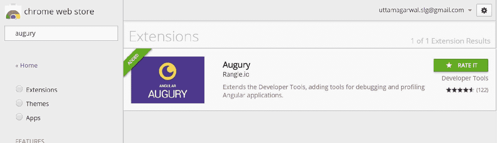

最后，当 Augury 安装完成后，一个带有黄色背景的黑色月亮将出现在 Chrome 浏览器右上角，如下所示：

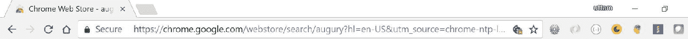

# 使用 Augury 的功能

Augury 提供了良好的功能，有助于我们一眼预览数据和组件。在本章中，我们将介绍以下功能：

+   组件树

+   路由树

+   NgModules

# 组件树

当您启动 Augury 控制台时，您可以看到的第一个视图是组件树。以下截图显示了我们的朋友应用程序的用户配置文件视图：

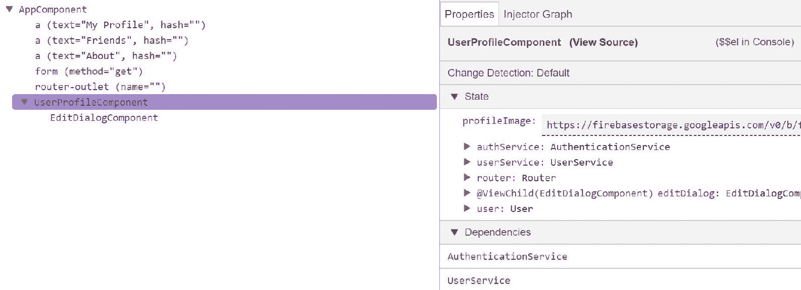

上述组件树显示了 `AppComponent` 和 `UserProfileComponent` 的层次视图。在右侧面板上，我们有“属性”选项卡，其中包含以下内容：

+   查看源代码：这显示了组件的实际源代码

+   变更检测：这显示了我们在组件中是否使用了变更检测

+   状态：这显示了类的所有实例成员变量

+   依赖关系：这显示了组件与其他组件或提供者的依赖关系

另一个视图是注入器图，它显示了特定组件或提供者被注入的位置：

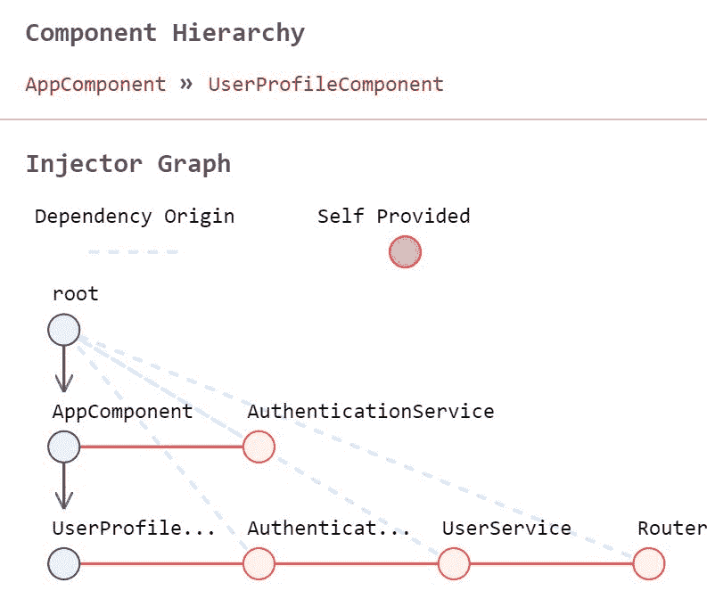

# 路由树

Augury 为应用程序提供路由信息。这有助于查看应用程序中使用的所有路由。此选项位于组件树选项旁边，如图所示：

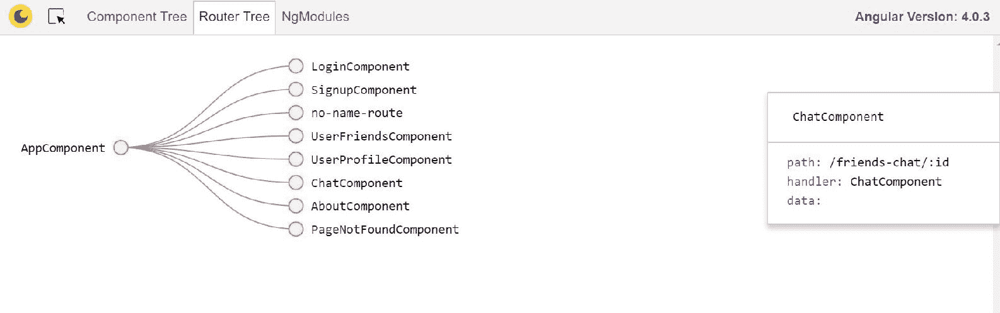

# NgModule

NgModule 是 Augury 中添加的另一个有用功能。它位于路由树旁边。它提供了有关特定应用程序模块中配置的所有导入、导出、提供者、声明和提供 InDeclarations 的信息，如下所示：

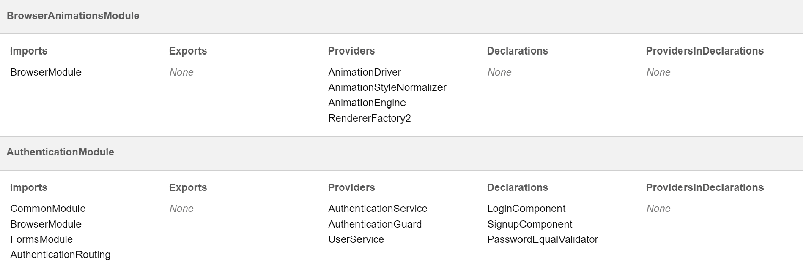

# 调试 Web 应用程序

在本节中，我们将介绍 Chrome 开发者工具。这些工具为我们提供了分析应用程序的许多功能。我们将介绍以下主题：

+   HTML DOM

+   布局预览

# HTML DOM

您可以通过在浏览器页面上右键单击鼠标并选择“检查”或按*F12*来打开 Chrome 开发者工具。Chrome 开发者工具将以多个标签页打开。

您可以点击“元素”标签页，它显示以`<html>`标签为根的 DOM 元素。您可以通过每个元素上的右箭头图标进一步展开它，如下所示：

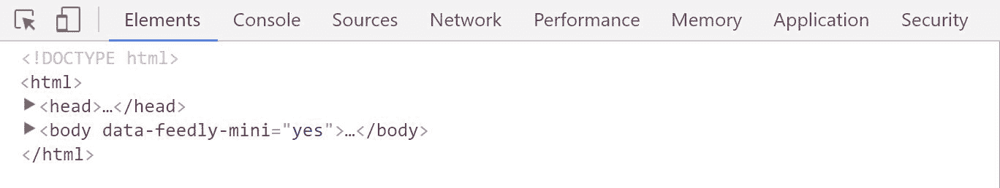

上述预览有助于调试 HTML 元素。

# 布局预览

布局预览是一个很好的功能，可以预览与实际浏览器视图相同的布局。此工具提供双向视图，您可以使用鼠标箭头键在浏览器中的网页上悬停，并显示您的开发者工具中的实际 HTML 元素。您还可以在开发者工具中悬停在 HTML 元素上，并在浏览器中查看高亮视图，如图所示的后继截图。当您悬停在浏览器上时，您将看到实际使用的`.user-profile`样式的`<div>`标签，并且当您点击该元素时，开发者工具中的元素将展开。


此布局预览有助于调试我们的实时应用程序。

# 调试 TypeScript

这又是调试实时 TypeScript 代码的一个重要方面。Chrome 工具提供了良好的机制来调试代码。在本节中，我们将介绍 Chrome 开发者工具中“源”标签页的以下功能：

+   查看和搜索源文件

+   设置断点和监视实时值

+   在控制台窗口中添加代码

# 查看和搜索源文件

我们可以在开发者工具的“源”标签页中看到我们的 TypeScript 文件。所有文件都显示在左侧面板下的`webpack://`文件夹中。文件夹将如下所示：

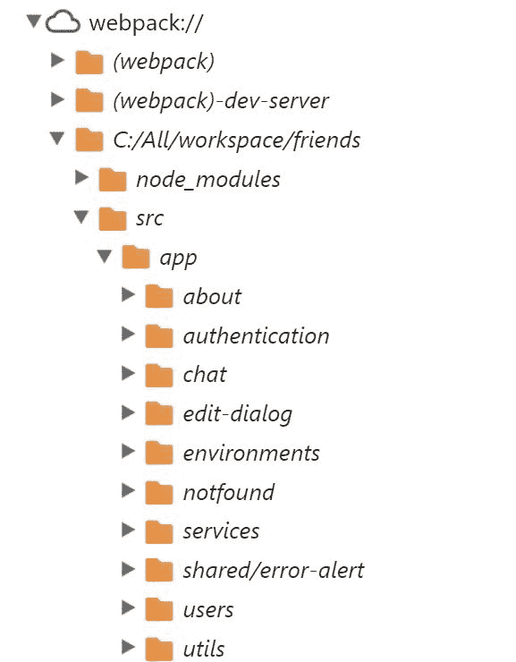

您也可以使用 *Ctrl* + *P* 命令搜索文件。源代码将显示在中间面板中：

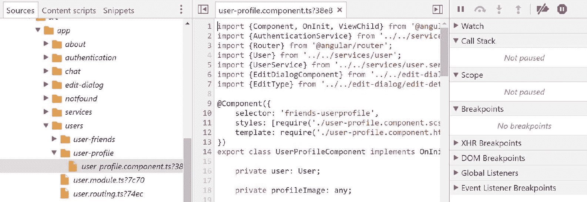

# 设置断点和监视实时值

实时调试是调试中最有趣的部分，并且对于调试遗留代码非常有帮助，因为它通过在代码中设置断点来帮助了解代码流。

您可以通过单击代码行中的数字来启用断点，如下所示：

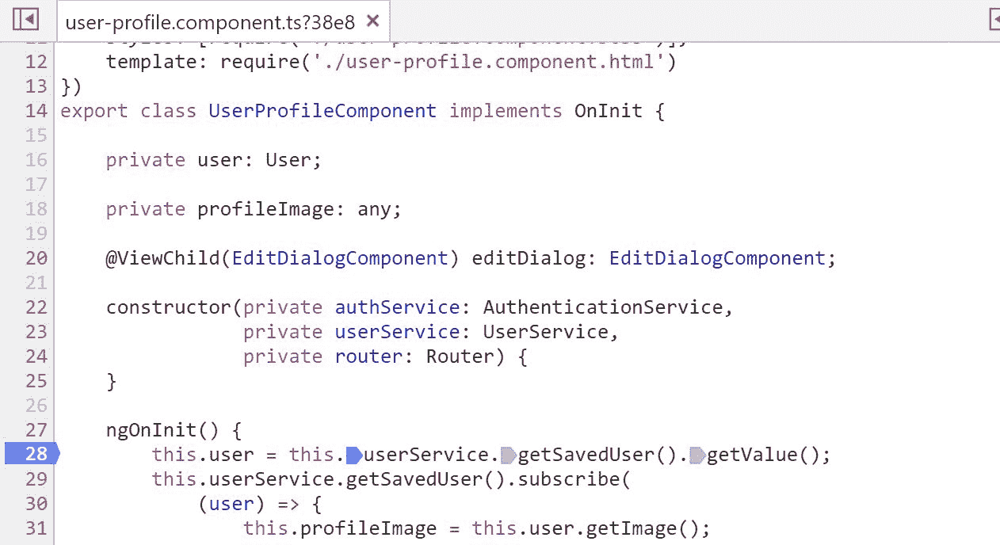

当你刷新页面时，应用程序会停在断点行。你可以使用右上角的面板遍历代码，该面板有跳过、进入、退出和恢复应用程序的命令。你还可以使用“观察”面板右下角的加号图标添加观察值；如下所示，我们在右侧的“观察”面板上添加了一个用户对象：

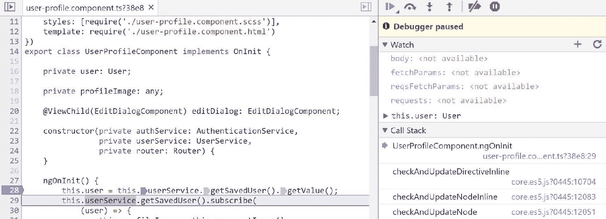

这是一个快速调试问题或了解应用程序流程的方法。

# 在控制台窗口中添加代码

开发者工具提供了一种在部署的代码上添加代码并实时编码的功能。我们可以打开一个文件，然后点击行来向现有文件添加实现。

在以下屏幕截图中，我们在控制台窗口中添加了`console.log`以记录日志：

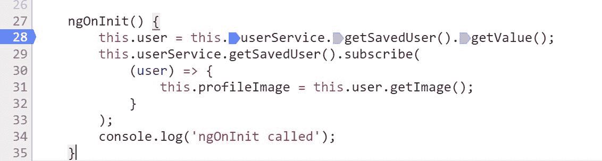

此编辑器还提供内容辅助，这是根据用户请求的上下文敏感内容补全。

当我们将以下命令输入代码的任何一行时，会出现内容辅助；一个窗口会出现所有引用选项，你可以通过输入特定的字母键进一步筛选选项：

```js
$Ctrl + Space bar
```

查看 HTML 页面的内容辅助：

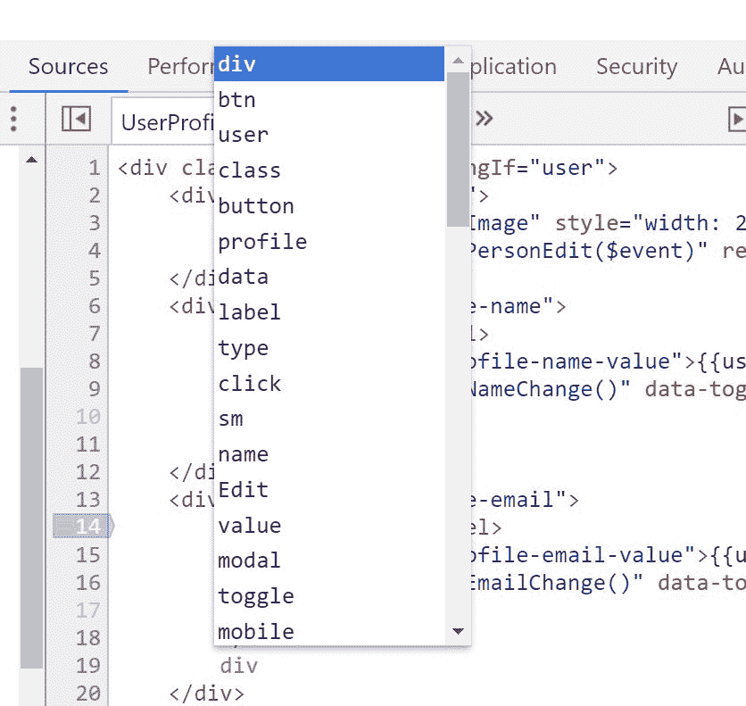

此功能有助于向现有文件添加代码，并更快地调试代码。

# 调试 CSS

调试 CSS 是 Web 开发的另一个方面。在本节中，我们将介绍调试和设计实时 CSS 元素。Chrome 开发者工具提供了一个更改样式元素和添加新元素的选择。我们将介绍以下功能：

+   探索样式面板

+   发现和修改样式

# 探索样式面板

一旦你打开了 Chrome 的开发者工具，打开“元素”选项卡并点击任何 HTML `<div>` 标签；你应该在右侧看到样式面板出现。此面板由三个标签组成：

+   **样式**：这显示了应用于特定 HTML 元素的所有样式：

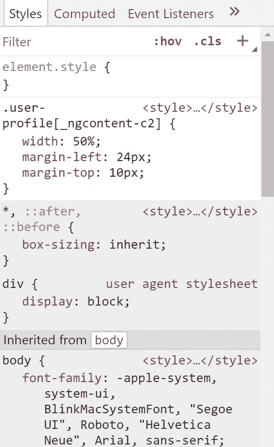

+   **计算值**：这显示了应用于特定 HTML 元素的所有计算值；这还显示了包含内容、填充、边框和边距信息的盒模型，关于所选 HTML 元素：

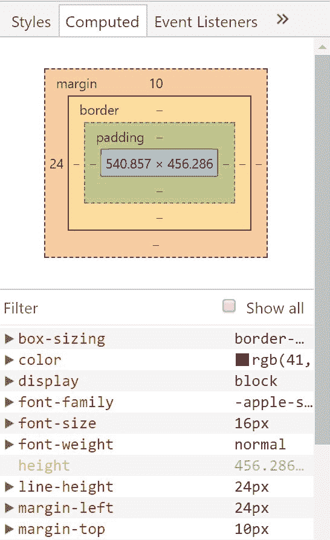

+   **事件监听器**：这显示了特定 HTML 元素可用的所有点击事件：

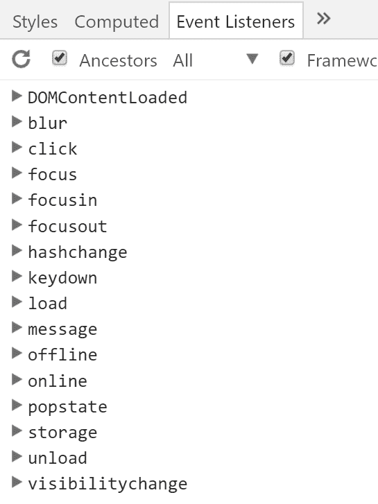

# 发现和修改样式

在本节中，我们将修改 HTML 元素的样式，作为练习的一部分，我们将修改现有的用户个人资料页。我们执行以下步骤：

1.  打开朋友应用程序。

1.  前往用户个人资料页。

1.  将鼠标悬停在用户个人资料页上，如下所示：


1.  在浏览器页面上单击用户个人资料页；它打开 Chrome 开发者工具，突出显示 HTML 元素，在右侧面板中你可以看到`.user-profile`样式。

1.  当你悬停在样式元素上时，会出现所有样式规则的复选框，我们可以取消选中复选框来禁用特定的样式并查看用户个人资料页上的效果。在以下示例中，我们禁用了宽度样式规则：

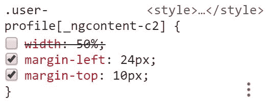

1.  我们可以向现有的样式规则中添加新的样式。当我们悬停在溢出图标上时，会出现一个工具提示，其中包含添加新样式的选项，并且，随着我们添加样式，它还支持内容辅助：

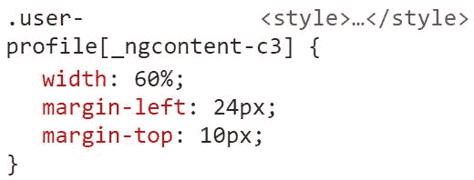

1.  最后，我们可以通过点击现有项来编辑现有的样式。在以下示例中，我们将宽度从 50%更改为 60%：


工具中的此选项有助于调试我们网页中的样式。

# 网络调试

网络调试在理解 API 调用及其响应方面非常有用。在 Firebase API 调用中，我们不会发现它有很大用处，因为 Firebase 数据库门户提供了 JSON 响应的视图。当我们探索网络调用的实时调试时，网络调试工具非常方便。在本节中，我们将讨论以下两个工具：

+   **Postman**：这与 Augury 扩展类似；您可以从 Chrome 扩展程序安装 Postman，或者您可以从[`www.getpostman.com/`](https://www.getpostman.com/)下载特定操作系统的安装程序。这个工具在开发初期阶段非常有用，因为它有助于理解 API 和响应，并相应地集成 API。您可以使用授权、头和正文创建 HTTP 方法，如 GET、POST、PUT 或 DELETE：

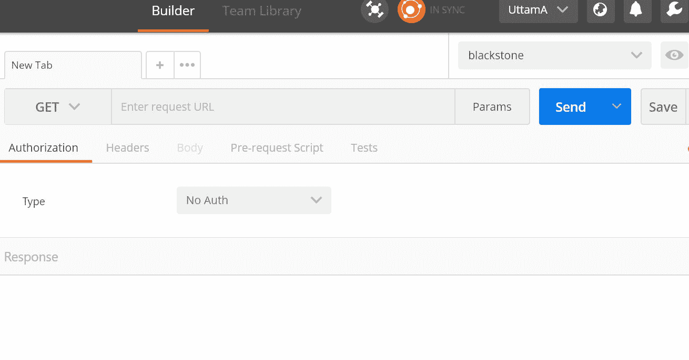

+   **Chrome 开发者工具中的网络标签页**：这在 Chrome 开发者工具中实时调试网络调用时非常有用。这显示了页面加载时的所有网络调用。您还可以应用过滤器以查看特定网络调用类型：

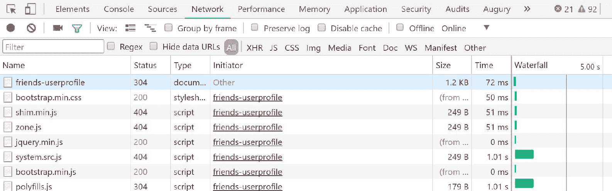

网络调试有助于确认来自服务器的预期响应。

# 摘要

在本章中，我们涵盖了调试技术的不同方面。我们从与浏览器相关的调试技术开始，这有助于分析和预览 HTML 元素。我们涵盖了 TypeScript 调试，并在部署的应用程序文件上设置了断点。我们还涵盖了 CSS 调试。我们在 CSS 面板中禁用并添加了样式。最后，我们涵盖了网络调试，其中我们讨论了 Postman 工具和 Chrome 开发者网络标签页。调试技术对于成为一名高效的 Web 开发者有很大帮助。

在下一章中，我们将把我们的应用程序部署到 Firebase 服务器。我们还将启用 Firebase 安全，因为这使我们的应用程序更加安全。
