# Firebase 安全和托管

Firebase 提供灵活的安全规则，语法类似于 JavaScript，这有助于我们结构化数据和索引常用数据。安全规则与 Firebase 身份验证集成，有助于根据用户定义读取和写入访问权限。在本章中，我们将为 Firebase 数据库中的用户和聊天节点添加安全规则。Firebase 安全规则提供了一个很好的模拟器，在将新规则发布到生产环境之前进行检查。我们还将索引用户及其朋友的数据，以便更快地进行查询。最后，我们将应用程序部署到 Firebase 服务器。我们将设置不同的部署环境，以便我们可以在预发布服务器上测试我们的应用程序，然后将应用程序部署到生产服务器。

在本章中，我们将介绍以下主题：

+   介绍 Firebase 安全

+   为用户添加安全规则

+   为聊天消息添加安全规则

+   索引用户及其朋友

+   设置多个部署环境

+   在 Firebase 托管朋友应用

# 介绍 Firebase 安全

Firebase 提供了管理我们应用程序安全性的工具，因为我们可以在 Firebase 数据库中添加规则并验证数据输入。Firebase 为我们应用程序提供了以下安全：

+   **身份验证**：确保我们的应用程序安全的第一步是识别用户。Firebase 身份验证支持多种身份验证机制，例如 Google、Facebook、电子邮件和密码身份验证。

+   **授权**：一旦用户经过身份验证，我们就需要控制对数据库中数据的访问。Firebase 安全规则具有内置的变量和函数，例如`auth`对象，它有助于控制用户的读取和写入操作。

前往 Firebase 门户并导航到数据库|规则选项卡。默认的 Firebase 安全规则如下；`auth!= null`条件表示只有经过身份验证的用户才能访问 Firebase 数据库中的数据。

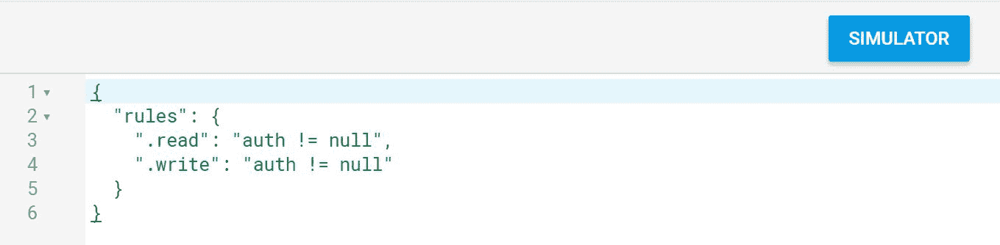

Firebase 安全规则提供了以下四种类型的函数：

+   `.read`：我们可以为数据定义此函数，以控制用户的读取操作。

以下示例显示，只有已登录的用户才能读取自己的用户数据：

```js
{
    "rules":{
        "users":{
            "$uid":{
                ".read": "auth != null && $uid === auth.uid"
            }
        }
    }
}
```

+   `.write`：我们为此数据定义此函数，以控制用户的写入操作。

以下示例显示，只有已登录的用户才能在其自己的用户数据节点上写入：

```js
{
    "rules":{
        "users":{
            "$uid":{
                ".write": "auth != null && $uid === auth.uid"
            }
        }
    }
}
```

+   `.validate`：此函数维护数据的完整性，此变量提供数据验证。

以下示例验证`name`字段为字符串：

```js
{
  "rules":{
     "users":{
        "$uid":{
           "name": {
              ".validate":"newData.isString()"                  
            }
          }
        }
     }
}
```

+   `.indexOn`：这为查询和排序数据提供了子索引。

在以下示例中，我们索引了用户数据的`name`字段。

```js
{
  "rules":{
     "users":{
        ".indexOn": ["name"],
        "$uid":{
           "name": {
              ".validate":"newData.isString()"                  
            }
          }
        }
     }
}
```

Firebase 安全规则还提供了以下预定义变量，用于定义安全规则：

+   `root`：此变量提供了一个`RuleDataSnapshot`实例，用于从 Firebase 数据库的根访问数据。

以下根变量用于从根用户节点遍历 Firebase 数据库路径：

```js
{
  "rules":{
     "users":{
        "$uid":{
           "image": {               
             ".read":"root.child('users').
             child(auth.uid).child('image').val() === ''"                  
            }
          }
        }
     }
}
```

+   `newData`：此变量提供了一个表示插入操作后存在的新的`RuleDataSnapshot`实例。

以下示例验证新的数据是否为字符串：

```js
"name": {
    ".validate":"newData.isString()"                  
}
```

+   `data`：此变量提供了一个表示插入操作之前存在的数据的`RuleDataSnapshot`实例。

以下示例显示当前`name`字段中的数据不为空：

```js
"user": {
   "$uid":{
      ".read":"data.child('name').val() != null"
   }
}
```

+   `$variables`：此变量代表动态 ID 和键。

在以下示例中，唯一 ID 被分配给`$uid`变量：

```js
"user": {
   "$uid":{
   }
}
```

+   `auth`：这代表`auth`对象，它提供了用户的 UID。

在以下示例中，我们访问`auth`对象以获取用户的 UID：

```js
"$uid":{
    ".write": "auth != null && $uid === auth.uid"
 }
```

+   `now`：此变量提供当前时间的毫秒数，有助于验证时间戳。

在以下示例中，我们得出结论，时间戳大于当前时间：

```js
"$uid":{
    ".write": "newData.child('timestamp').val() >   now"
 }
```

# 为用户添加安全规则

在我们的应用程序中，用户详情起着至关重要的作用，因此我们需要为用户详情提供安全规则。我们已经看到了默认的安全设置。默认情况下，只有认证用户可以访问我们 Firebase 数据库的任何部分。我们将修改用户节点的安全规则，而暂时保留其他节点的默认安全规则。

如您从以下截图中所见，对于`users`节点，对于具有相同唯一用户 ID 的认证用户，允许进行`read`和`write`操作；我们还需要验证用户节点中的数据类型以保持数据完整性：

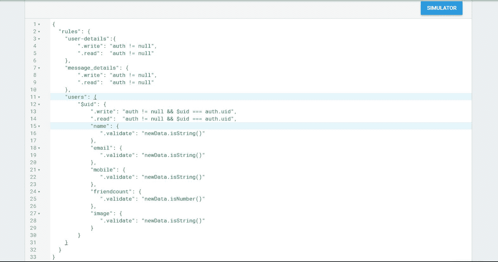

为了验证我们的安全规则的变化，Firebase 提供了一个模拟器来测试我们的更改，在将其部署到生产环境之前。您将在“RULES”标签页的右上角看到一个“SIMULATOR”选项。此工具提供了模拟操作，而实际上并不在数据库中执行任何 CRUD 操作。我们将在模拟器上测试以下场景：

+   **认证用户的成功读取操作**：打开模拟器并启用“Authenticated”开关按钮；它会在“Auth token”文本框中提供一个模拟的 uid。在“Location”文本框中，我们输入路径为`/users/6e115890-7802-4f56-87ed-4e6ac359c2e0`并点击“RUN”按钮。当出现“Simulated read allowed”消息时，此操作将成功，如以下截图所示：

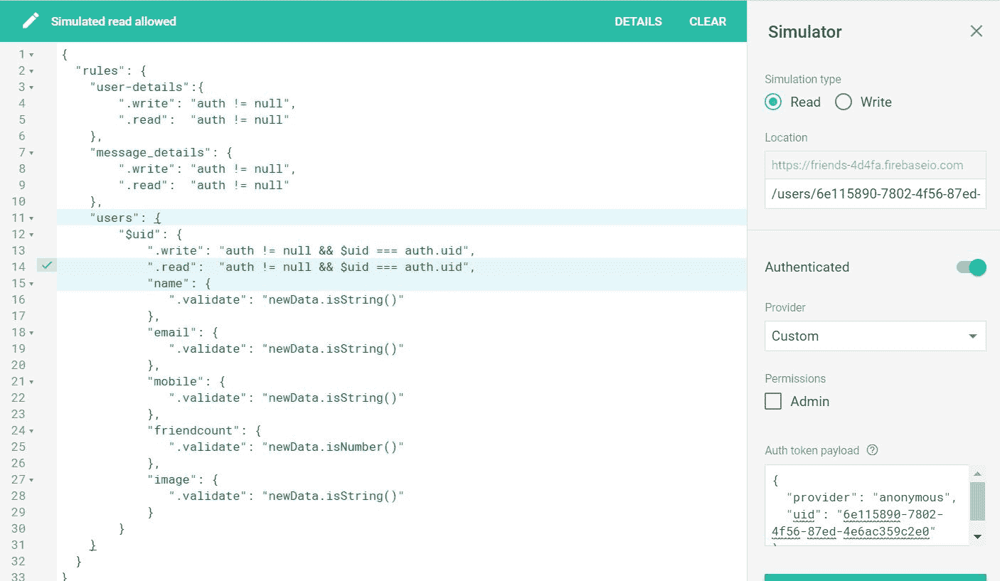

+   **具有认证用户和正确数据的成功写入操作**：在这种情况下，我们将提供包含用户 UID 的路径，字符串名称数据作为 JSON 有效载荷在模拟器中。当我们点击“运行”时，当出现“模拟写入允许”的消息时，这个操作被认为是成功的，如下面的截图所示。接下来的截图显示两个勾号，这表明我们的授权和数据验证已经成功。

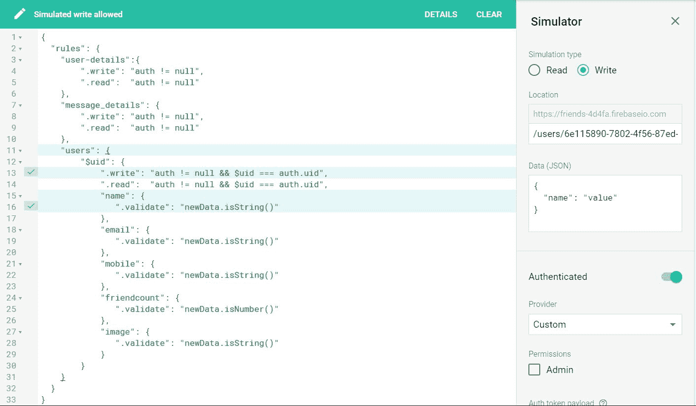

+   **使用不同 UID 的失败写入操作**：在这种情况下，我们在用户路径位置提供了一个错误的 UID，然后执行相同的写入操作。这个操作失败了，导致出现“模拟写入被拒绝”的消息和写入标签上的一个叉号，如下所示；你可以通过点击“详情”按钮查看更多错误详情：

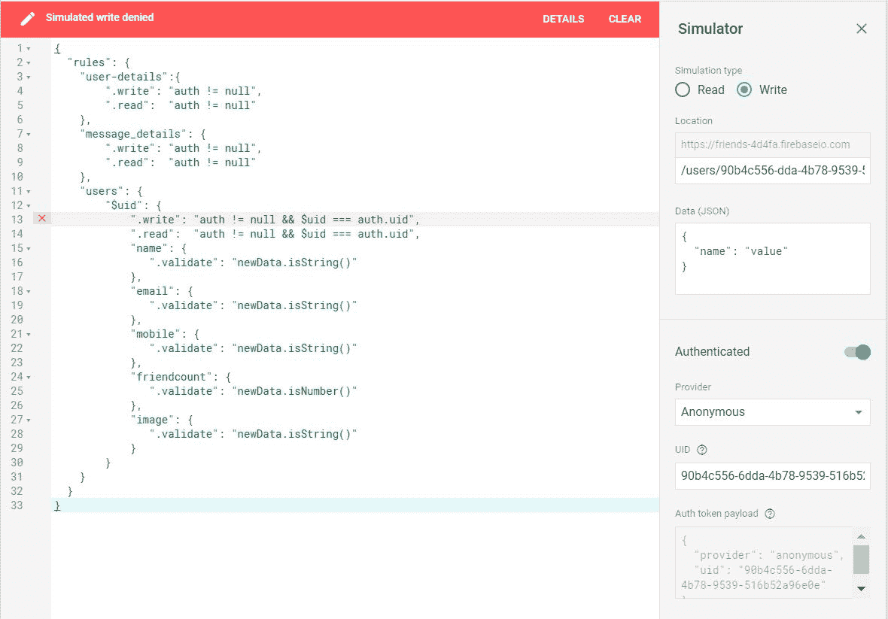

+   **数据验证失败的写入操作**：在这种情况下，我们在位置中提供了正确的用户 UID 路径，但在有效载荷中提供了错误的数据类型。例如，我们将为字符串名称数据提供数字数据类型。这个操作在数据验证标签中失败，如下所示：


# 为聊天消息添加安全规则

在本节中，我们将启用聊天消息的安全规则。消息详情节点包含两个标识符，如下所示：

+   `$identifierKey`：第一个是标识符键，用于会话中的用户，并且这个键也存储在用户详情节点中。在以下示例中，`"-L-0uxNuc6gC95iQytu9"`是标识符键。

+   `$messageKey`：第二个是消息键，在我们向节点推送新消息时生成。在以下示例中，`"-L-125Am3LVQQQiN_xlG"`是消息键：

```js
"message_details" : {
  "-L-0uxNuc6gC95iQytu9" : {
   "-L-125Am3LVQQQiN_xlG" : {
     "message" : "Hello",
     "receiverUid" :"2HIvnEJvN0O03PtByU2ACBhSMDe2",
     "senderUid" : "YnmOB5rTAwVErXcmMuJkHDEb4i92",
     "timestamp" : 1511862854520
   }
  }
 }
```

我们将为消息详情节点定义以下安全规则：

+   **读取权限**：我们只授予认证用户读取权限

+   **写入权限**：我们授予认证用户写入权限，并在数据推送发生之前检查是否存在任何新数据

+   **验证**：我们验证消息中的所有字段，以确保在插入任何新数据时数据完整性得到保持，如下所示：

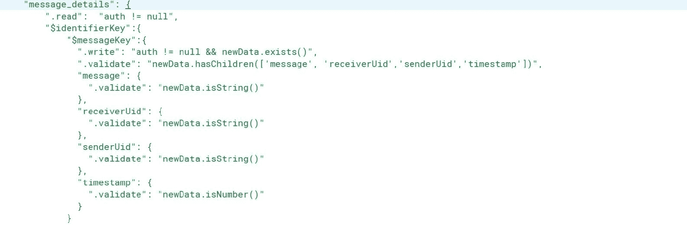

最后，我们将在模拟器中验证新规则，以检查它们是否有效：

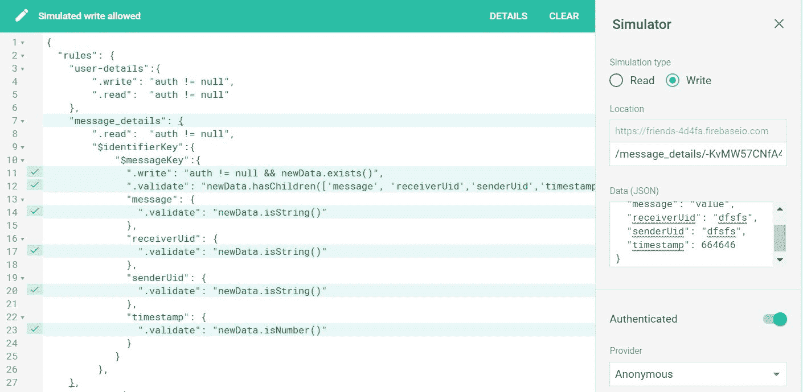

# 索引用户和好友

Firebase 通过使用任何常见的子键收集节点来提供数据的查询和排序。当数据增长时，这个查询会变慢。为了提高性能，Firebase 建议你在特定的子字段内进行索引。Firebase 将键索引到服务器以提高查询性能。

作为本节的一部分，我们将对我们的用户数据进行索引，以便搜索或找到好友，这在任何社交应用中都很常见。为了实现这一点，我们将执行以下任务：

+   **在用户数据的名称字段中创建索引**：我们在用户数据的名称字段中提供了一个索引。我们将使用`.indexOn`标签为名称字段，如下所示：

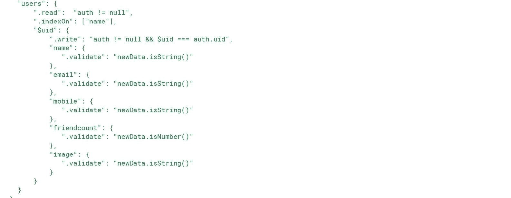

+   **创建基于文本查询数据的服务**：在这个任务中，我们将根据搜索文本查询用户数据。我们将提供`orderByChild`作为用户的名称字段。

这是`friends-search.service.ts`：

```js
import {Injectable} from '@angular/core';
import {AngularFireDatabase} from 'angularfire2/database';
import {Observable} from 'rxjs/Observable';
import {User} from './user';
import {FRIENDS_CHILD, USER_DETAILS_CHILD} from './database-constants';

/**
 * Friends search service
 *
 */
@Injectable()
export class FriendsSearchService {

  constructor(private db: AngularFireDatabase) {
  }

  getSearchFriends(start, end): Observable<User[]> {
    return this.db.list<User>('/users',
      ref => ref.orderByChild('name').limitToFirst(10).
      startAt(start).endAt(end)
    ).valueChanges();
  }

}
```

+   **修改模板**：我们修改应用模板，以便在搜索文本下方显示搜索结果的下拉菜单。

这是修改后的`app.component.html`文件：

```js
<h1 class="title">Friends - A Social App</h1>
<div class="nav-container">
<nav class="navbar navbar-expand-lg navbar-light bg-color">
  <div class="collapse navbar-collapse" id="navbarNav">
    ...
    <div class="form-container">
    <form class="form-inline my-2 my-lg-0">
      <div class="dropdown">
        <input class="form-control mr-sm-2" type="text" 
         (keyup)="onSearch($event)" name="searchText"
         data-toggle="dropdown" placeholder="Search friends..." 
         aria-label="Search">
        <div class="dropdown-menu" aria-
         labelledby="dropdownMenuButton">
          <div class="list-group" *ngFor="let user of users">
            <div class="list-group-item list-group-item-action 
             flex-column align-items-start">
              <div class="d-flex w-100 justify-content-between">
                <label>{{user?.name}}</label>
                <button type="button" class="btn btn-light" 
                 (click)="onAddFriend(user)">ADD</button>
              </div>
            </div>
          </div>
        </div>
      </div>
      <button class="btn btn-success my-2 my-sm-0" 
       type="submit">Search</button>
    </form>
    </div>
  </div>
</nav>
</div>
<router-outlet></router-outlet>
```

+   **修改组件**：当应用程序组件加载时，我们在`ngOnInit()`方法中查询所有用户，当用户点击搜索文本框时，用户列表会显示所有名称。我们还通过用户类型在文本框中过滤列表，然后调用`onSearch()`方法，并使用查询范围查询 Firebase 数据库。

这是到目前为止完整的`app.component.ts`文件：

```js
import {Component, OnInit} from '@angular/core';
import {AuthenticationService} from './services/authentication.service';
import {User} from './services/user';
import {FriendsSearchService} from './services/friends-search.service';

@Component({
  selector: 'app-friends',
  styleUrls: ['app.component.scss'],
  templateUrl: './app.component.html',
})
export class AppComponent implements OnInit {

  startAt: string;

  endAt: string;

  users: User[];

  searchText: string;

  authenticationService: AuthenticationService;

  constructor(private authService: AuthenticationService,
              private friendsSearchService: FriendsSearchService) {
    this.authenticationService = authService;

  }

  ngOnInit() {
    console.log(this.currentLoginUser);
    this.searchText = '';
    this.onSearchFriends(this.searchText);
  }

  onSearch(event) {
    const text = event.target.value;
    this.onSearchFriends(text);
  }

  onSearchFriends(searchText) {
    const text = searchText;
    this.startAt = text;
    this.endAt = text + '\uf8ff';
    this.friendsSearchService.getSearchFriends(this.startAt, 
    this.endAt)
      .subscribe(users => this.users = users);
  }
}
```

`\uf8ff`字符是 Unicode 范围内的一个非常高的代码点，它允许您匹配以您的搜索文本开头的所有值。

# 设置多个环境

当我们的应用程序准备部署时，我们需要为开发和生产环境分别分离 Firebase 项目，以便在部署到生产环境之前在开发环境中测试我们的代码更改。我们将遵循以下步骤来设置一个单独的环境：

+   **在 Firebase 中创建新的预发布项目**：因为我们不能使用相同的 Firebase 功能，例如数据库和存储，所以我们需要分别设置生产和预发布环境。然后我们将创建一个名为`friends-staging`的新项目；该项目具有新的 Firebase 环境变量：

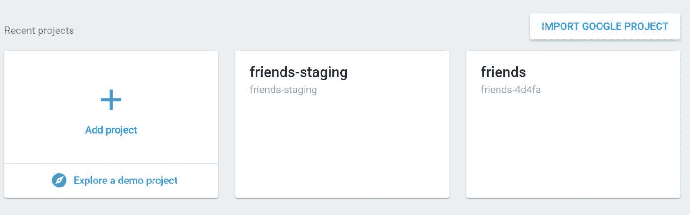

+   **创建新的环境变量**：新的 Firebase 项目有一个新的环境变量，您可以从 Firebase 项目中获取配置。因此，导航到项目概览 | 项目设置 | 将 Firebase 添加到您的 Web 应用。

将以下代码复制到新的环境文件中，如下所示；我们有两个环境文件用于预发布和生产：

+   `environment.prod.ts`文件将生产环境设置为`true`，这用于生产环境：

```js
export const environment = {
   production: true,
   firebase: {
      apiKey: 'XXXX',
      authDomain: 'friends-4d4fa.firebaseapp.com',
      databaseURL: 'https://friends-4d4fa.firebaseio.com',
      projectId: 'friends-4d4fa',
      storageBucket: 'friends-4d4fa.appspot.com',
      messagingSenderId: '321535044959'
   }
};
```

+   `environment.ts`文件将生产环境设置为`false`；这将用于预发布环境：

```js
export const environment = {
   production: false,
   firebase: {
      apiKey: 'XXXX',
      authDomain: 'friends-4d4fa.firebaseapp.com',
      databaseURL: 'https://friends-4d4fa.firebaseio.com',
      projectId: 'friends-4d4fa',
      storageBucket: 'friends-4d4fa.appspot.com',
      messagingSenderId: '321535044959'
   }
};
```

+   **安装 Firebase 工具**：一旦创建了一个新的 Firebase 项目，您将需要安装 Firebase 工具并使用以下命令登录 Firebase 门户：

```js
$ npm install -g firebase-tools
$ firebase login
```

上述命令将打开您的 Gmail 权限页面；点击 ALLOW 将允许列出所有可用的项目：

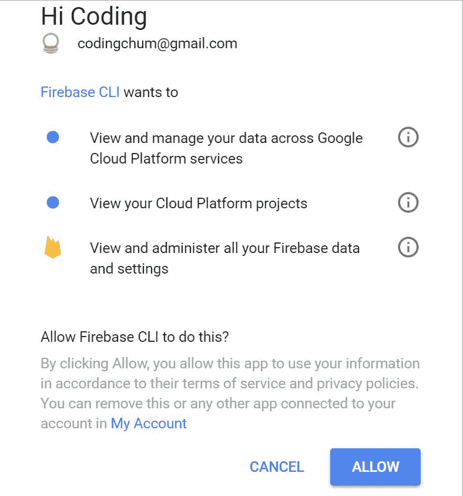

+   **使用新的 Firebase 项目**：一旦我们给予权限，我们需要根据当前使用的环境添加可用的项目。假设我们需要在开发中的新功能下进行测试，我们可以选择一个测试环境，并为测试环境提供一个别名名称以供将来使用。我们可以使用别名名称切换环境，如下所示：

```js
$ firebase use --add
$ firebase use staging
```

这将在基本项目目录中创建`.firebaserc`文件，其外观如下：

```js
{
  "projects": {
    "default": "friends-4d4fa",
    "staging": "friends-staging"
  }
}
```

# 在 Firebase 上托管朋友应用程序

Firebase 支持作为服务提供托管，在 Firebase 上部署应用程序很容易。大多数应用程序采用两阶段部署，即首先进行测试，然后是生产。一旦我们在测试环境中测试了应用程序，我们就可以将其部署到生产环境中。部署应用程序的步骤如下：

1.  第一步是构建应用程序，这会创建一个包含`index.html`和其他所需文件的`dist`文件夹。您只需添加一个`--prod`选项即可用于生产构建：

```js
$ ng build
```

1.  下一步是初始化应用程序项目。我们将执行 init 命令，并在命令提示符中使用空格键选择 Firebase 功能；对于我们的朋友应用程序，我们将使用 Firebase 的数据库、存储和托管功能，当我们选择相应的功能时，它将创建默认的数据库和存储规则：

```js
$ firebase init
```

它还会创建一个`firebase.json`文件，其外观如下：

```js
{
  "hosting": {
    "public": "src",
    "ignore": [
      "firebase.json",
      "**/.*",
      "**/node_modules/**"
    ]
  },
  "database": {
    "rules": "database.rules.json"
  },
  "storage": {
    "rules": "storage.rules"
  }
}
```

1.  最后，我们使用以下命令部署我们的应用程序；一旦我们的应用程序部署完成，我们就可以在 Firebase 托管的项目中查看已部署的应用程序：

```js
$ firebase deploy
```

已部署的应用程序将出现在 Firebase 门户中。您可以通过导航到 DEVELOP | Hosting，在右侧面板中查看已部署的应用程序，如下所示：

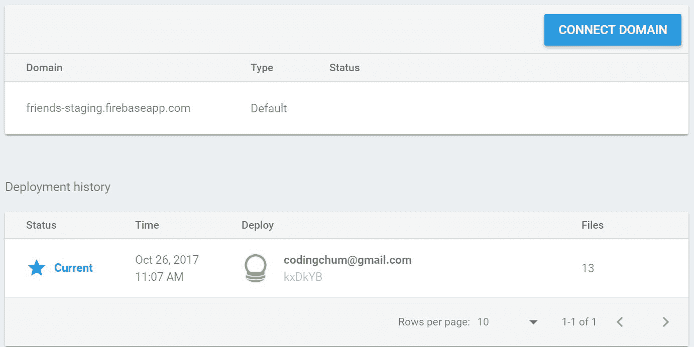

1.  最后，您可以使用以下命令或通过粘贴 URL 作为[`friends-staging.firebaseapp.com`](https://friends-staging.firebaseapp.com)打开您的实时应用程序：

```js
$ firebase open
```

# 摘要

在本章中，我们介绍了 Firebase 的安全机制。我们为我们的朋友应用程序数据库添加了安全规则，使我们的应用程序更加安全。我们为数据库中的用户节点`name`字段建立了索引，以便搜索查询更快。然后我们在朋友应用程序中使用了搜索 API。最后，我们为我们的应用程序创建了多个环境，以便我们能够将测试和生产分离。然后我们在 Firebase 上部署了我们的应用程序。

在下一章中，我们将学习 Firebase 云消息、Google 分析以及广告。
