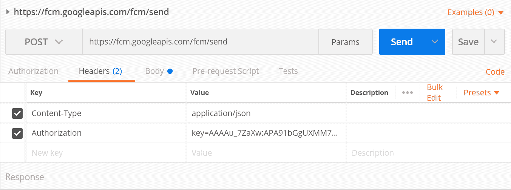
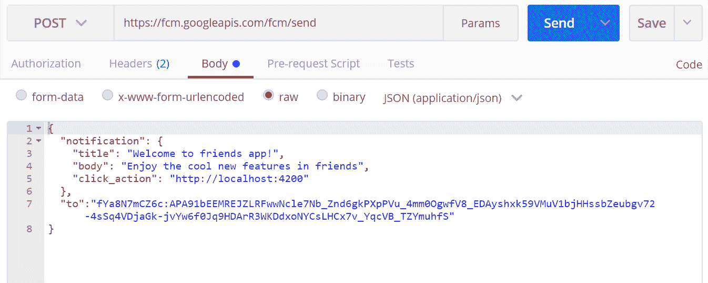
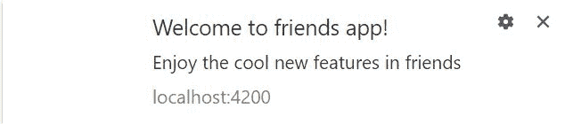
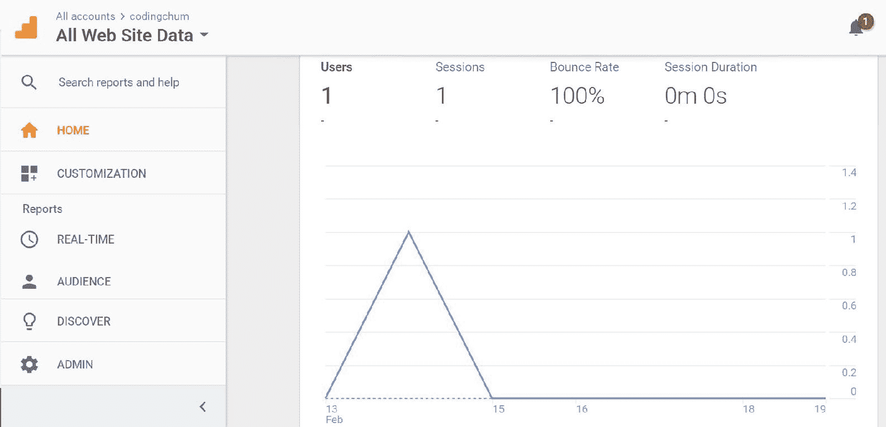
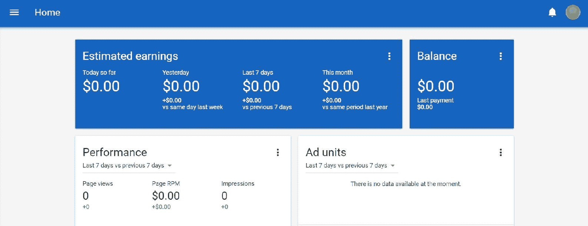

# 第十三章：使用 Firebase 扩展我们的应用程序

在本章中，我们将探讨 Firebase 如何提供云消息以吸引我们的用户。我们将向我们的应用程序添加 Firebase 云消息功能。我们将介绍 Google 分析，它提供了一个良好的仪表板来分析我们的应用程序并相应地采取行动，因为这有助于进一步改进我们的应用程序。最后，我们将讨论 Google 广告，它有助于使我们的应用程序货币化。

在本章中，我们将涵盖以下主题：

+   Firebase 云消息简介

+   将 FCM 添加到我们的应用程序

+   Google 数据分析

+   了解 Google 广告

# Firebase 云消息简介

**Firebase 云消息** (**FCM**) 是一个跨平台服务，用于在不同平台之间可靠地传递消息。它使用推送方法发送消息，我们可以向客户端发送多达 4 KB 的数据。它支持许多用例，例如通过促销消息与用户互动，并在用户处于后台时发送消息。

它有两个主要模块：

+   **受信任的服务器**：此服务器用于向客户端发送消息，可以是 Firebase 控制台或服务器 SDK 实现。

+   **客户端应用程序**：这包括 Web、Android 或 iOS 中的客户端应用程序。它从受信任的服务器接收消息。

# 将 FCM 添加到我们的应用程序

在本节中，我们将配置我们的应用程序中的 FCM。我们将执行以下步骤来配置 FCM：

1.  **创建一个** **manifest.json** **文件**：我们的第一步是在`src`文件夹内创建一个`manifest.json`文件。此文件包含`gcm_sender_id`，它授权客户端访问受信任的 FCM 服务器，并使 FCM 能够向我们的应用程序发送消息。对于桌面浏览器，客户端 ID——`103953800507`——对于 Web 应用程序是固定的，因此您不需要更改它。

网页清单文件是一个简单的 JSON 文件，在其中我们可以指定应用程序的配置，例如其名称、显示和方向。

这是`manifest.json`的代码：

```js
{
   "name": "Friends",
   "short_name": "Friends",
   "start_url": "/index.html",
   "display": "standalone",
   "orientation": "portrait",
   "gcm_sender_id": "103953800507"
}
```

1.  **在** **index.html** **中配置** **manifest.json**：一旦我们创建了 manifest 文件，我们就将文件引用包含在`index.html`中。

然后我们包含修改后的`index.html`：

```js
<!DOCTYPE html>
<html>
   <link rel="manifest" href="/manifest.json">
</head>
<body>
<app-friends>
   Loading...
</app-friends>
</body>
</html>
```

1.  **创建服务工作者**：在我们创建 manifest 文件之后，我们创建一个 Firebase 服务工作者来处理来自受信任服务器的传入推送消息，并将我们的 Firebase 应用程序与消息发送者`ID`注册，我们可以通过导航到项目概览 > 项目设置 > 云消息获取此`ID`。

服务工作者是一种在后台运行的 Web 工作者，它有助于推送通知。

现在的`firebase-messaging-sw.js`文件如下：

```js
importScripts('https://www.gstatic.com/firebasejs/3.9.0/firebase-app.js');
importScripts('https://www.gstatic.com/firebasejs/3.9.0/firebase-messaging.js');

firebase.initializeApp({
   'messagingSenderId': '807434545532'
});

const messaging = firebase.messaging();
```

1.  **在** **angular-cli.json** **中引用 manifest 和 service worker**：接下来，我们在`angular-cli.json`中提及服务工作者和 manifest 文件的引用；以下是被修改的`angular-cli.json`：

```js
...
"apps": [
   {
      "assets": [
         "assets",
         "favicon.ico",
         "firebase-messaging-sw.js",
         "manifest.json"
      ],
      ...
   }
]
```

1.  **创建 FCM 服务**：此服务类用于接收客户端令牌并将令牌插入 Firebase 数据库。它还用于在令牌过期时注册令牌刷新。创建此服务类的步骤如下：

第一个步骤是通过警报对话框获取用户通知权限，一旦用户点击**允许**按钮，我们就从 Firebase 消息对象调用`getToken()`来获取令牌。我们将此令牌发送到 Firebase 数据库，以便我们可以在将来使用此令牌向所有用户发送促销消息。我们还创建了一个`onTokenRefresh()`方法，以便在令牌过期时刷新我们的令牌。

第二个步骤是在应用处于前台时调用`onMessage()`来注册推送通知消息。

现在的`fcm-messaging.service.ts`文件如下：

```js
import {Injectable} from '@angular/core';
import {AngularFireDatabase} from 'angularfire2/database';
import {AngularFireAuth} from 'angularfire2/auth';
import 'firebase/messaging';

@Injectable()
export class FcmMessagingService {

   messaging = null;

   constructor(private angularFireDatabase: AngularFireDatabase, 
   private afAuth: AngularFireAuth) {
      this.messaging = angularFireDatabase.app.messaging();
   }

   getPermission() {
      this.messaging.requestPermission()
         .then(() => {
            console.log('Permission granted.');
            this.getToken();
         })
         .catch((err) => {
            console.log('Permission denied', err);
         });
   }

   getToken() {
      this.messaging.getToken()
         .then((currentToken) => {
            if (currentToken) {
               console.log(currentToken);
               this.sendTokenToServer(currentToken);
            } else {
               console.log('No token available');
            }
         })
         .catch((err) => {
            console.log('An error occurred while retrieving token. 
            ', err);
         });
   }

   onMessage() {
      this.messaging.onMessage((payload) => {
         console.log('Message received. ', payload);
      });
   }

   onTokenRefresh() {
      this.messaging.onTokenRefresh(function () {
         this.messaging.getToken()
            .then(function (refreshedToken) {
               console.log('Token refreshed.');
               this.sendTokenToServer(refreshedToken);
            })
            .catch(function (err) {
               console.log('Unable to retrieve refreshed token ', 
               err);
            });
      });

   }

   sendTokenToServer(token) {
      this.afAuth.authState.subscribe(user => {
         if (user) {
            const data = {[user.uid]: token};
            this.angularFireDatabase.object('fcm-
            tokens/').update(data);
         }
      });
   }
}
```

1.  **在应用组件中注册 Firebase 消息以更新**：一旦我们创建了服务方法，我们就调用用户权限、令牌并在我们的应用组件中注册消息更新，如下面的`app.component.ts`所示：

```js
import {Component, OnInit} from '@angular/core';
import {AuthenticationService} from './services/authentication.service';
import {FcmMessagingService} from './services/fcm-messaging.service';

@Component({
   selector: 'app-friends',
   styleUrls: ['app.component.scss'],
   templateUrl: './app.component.html',
})
export class AppComponent implements OnInit {

   ...
   authenticationService: AuthenticationService;

   constructor(private authService: AuthenticationService,
            private friendsSearchService: FriendsSearchService,
            private fcmService: FcmMessagingService) {
      this.authenticationService = authService;
   }

   ngOnInit() {
      this.fcmService.getPermission();
      this.fcmService.onMessage();
      this.fcmService.onTokenRefresh();
   }
    ...
}
```

最后，我们的应用程序现在已准备好发送推送通知消息。您可以通过 curl 命令或 Postman 请求发送消息。

要从 Postman 发送推送通知，我们需要以下详细信息：

+   **URL**：这是一个已在我们可信服务器上注册的 FCM 端点。其唯一的 URL 是[`fcm.googleapis.com/fcm/send`](https://fcm.googleapis.com/fcm/send)。

+   **内容类型**：这是发送到服务器的内容类型，在我们的案例中是 JSON 类型，作为`application/json`。

+   **授权**：这是我们的 Firebase 项目的服务器密钥。您可以通过导航到 Firebase 门户中的项目概览|项目设置|CLOUD MESSAGING|服务器密钥来找到此密钥。

+   **正文**：这包含标题、正文、操作和目标发送者`ID`。发送者令牌 ID 已保存在我们的 Firebase 数据库中。

这是一个 Postman 请求的 Headers 标签的示例：



Postman 的 Body 标签将如下所示：



出现在您屏幕右下角的提示应该如下所示：



# Google 数据分析

Google 分析是 Google 提供的一项免费服务，它提供了关于我们网站访问者和流量的统计数据。它提供了关于访问者和地理的更有价值的信息。它还提供了关于访问者在使用我们的网站时的行为信息。以下是将 Google 分析注册到您的应用程序的步骤。

**创建 Google 分析账户**：我们可以通过执行以下步骤使用现有的 Gmail 账户或新 Gmail 账户创建 Google 分析账户：

1.  打开浏览器并粘贴分析 URL ([`analytics.google.com/analytics`](https://analytics.google.com/analytics))

1.  点击**注册**按钮

1.  填写您的实时应用程序 URL 和表单信息

1.  点击**获取跟踪 ID**按钮

**将跟踪代码集成到我们的应用程序中**：在成功注册后，我们可以将生成的全局站点标签集成到我们的应用程序中。请查看以下 `index.html` 中的示例全局站点代码：

```js
<head>
...
<script async src="img/js?id=UA-108905892-1"></script>
<script>
  window.dataLayer = window.dataLayer || [];
  function gtag(){dataLayer.push(arguments);}
  gtag('js', new Date());

  gtag('config', 'UA-108905892-1');
</script>
...
</head>
```

在成功注册后，我们的 Google 分析控制台应该看起来像这样：



# 了解 Google Adsense

Google Adsense 为我们的网络应用程序提供了一个盈利平台。Firebase 广告不支持此网络应用程序，因此我们将与 Google Adsense 合作以使我们的应用程序盈利。在本节中，我们将探讨如何将广告添加到我们的应用程序中。

**创建 Adsense 账户**：我们可以使用现有的 Gmail 账户创建 Adsense 账户，或者通过以下步骤创建一个新的 Gmail 账户：

1.  打开浏览器并粘贴 Adsense URL ([`www.google.com/adsense`](http://adsense) )

1.  点击**注册**按钮

1.  填写您的实时应用程序 URL 和地址详情

1.  点击**提交**按钮

**将 Adsense 脚本添加到我们的应用程序中**：当您点击提交按钮时，Google Adsense 将提供步骤以将您的网站注册为广告。它提供了代码，需要粘贴到我们的应用程序的 `index.html` 中。请查看以下示例脚本，以粘贴到 `index.html` 中：

```js
<head>
...
<script async src="img/adsbygoogle.js"></script>
<script>
  (adsbygoogle = window.adsbygoogle || []).push({
    google_ad_client: "ca-pub-6342144115183345",
    enable_page_level_ads: true
  });
</script>
...
</head>
```

在成功注册后，我们的 Google Adsense 控制台看起来如下：



# 摘要

在本章中，我们介绍了 Firebase 云消息传递。我们将 FCM 集成到我们的应用程序中，这有助于吸引我们的用户。我们还介绍了 Google 分析，并展示了如何在我们的应用程序中启用分析。这为我们提供了关于应用程序使用的良好视角。最后，我们讨论了 Google Adsense，它有助于使我们的应用程序盈利。

在下一章中，我们将讨论**渐进式网络应用**（**PWA**）并添加一些功能以使我们的应用程序符合 PWA 规范。
