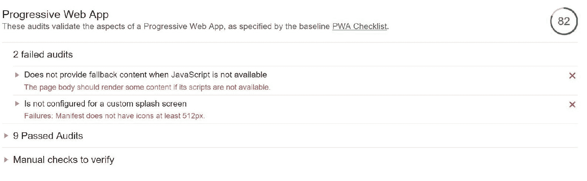

# 第十四章：将我们的应用转化为 PWA

**渐进式 Web 应用**（**PWA**）是开发 Web 应用的一种新方式。作为本章的一部分，你将了解 PWA 并探索使应用符合 PWA 规范的功能。作为其中的一部分，我们将把我们的朋友应用添加到移动主屏幕上，这样我们的朋友应用就成为了其他原生移动应用的组成部分。我们还将涵盖我们应用的离线模式，以便我们可以向用户展示可浏览的数据。最后，我们将使用**Lighthouse**工具对我们的应用进行审计，该工具为我们提供了关于我们渐进式 Web 应用的宝贵见解。

在本章中，我们将涵盖以下主题：

+   PWA 简介

+   服务工人简介

+   将我们的应用添加到手机主屏幕

+   启用离线模式

+   使用 Lighthouse 进行合规性测试

# PWA 简介

PWA 是一种使用增强功能为用户提供类似移动应用体验的 Web 应用。这种 Web 应用满足某些要求，并部署到 Firebase 服务器上，通过 URL 可访问并由 Google 搜索引擎索引。近年来，渐进式 Web 应用开发是一种范式转变，使您的 Web 应用能够普遍可用。

以下是一些使应用符合 PWA 规范的功能：

+   **网站和应用的强大功能**：该应用针对移动设备和浏览器进行了优化，可以完美地工作。它具有移动应用的所有功能，例如离线模式和推送通知。

+   **无需应用商店**：类似于网站，我们不需要应用商店，并且可以通过最新的软件更新立即使用。

+   **类似应用**：Web 应用看起来像移动应用。它与其他移动应用一起出现，并以正常应用的方式占据整个屏幕。

+   **连接无关性**：这些应用不依赖于网络类型。它们在弱网络环境下也能很好地工作，为用户提供无缝的使用体验。

+   **主屏幕添加**：这允许用户将我们的网站添加到他们的主屏幕上，使其成为应用家族的一部分。用户可以频繁启动应用而无需打开浏览器。

+   **安全**：此应用在 HTTPS 上运行，因此它们免受攻击或黑客攻击。

+   **推送通知**：随着服务工人的出现，可以向 Web 应用发送推送通知。这对与我们的应用吸引用户非常有帮助。

+   **可搜索**：类似于网站，此应用可以通过 Google 搜索进行搜索。我们可以通过关键词优化我们的网站，以便 PWA 应用可被用户识别并轻松搜索。

+   **可链接**：这种应用可以通过链接轻松分享，就像普通 Web 应用一样。

# 服务工人简介

服务工作者（service worker）是一个在后台运行的脚本。此后台脚本不与 DOM 元素交互。这有助于支持推送通知和离线模式等功能，并且服务工作者将在未来得到大幅增强以支持其他新功能。

以下是为服务工作者（service worker）的先决条件：

+   **浏览器支持**: 服务工作者在 Chrome、Firefox 和 Opera 浏览器中得到支持，并且对其他浏览器的支持也将很快扩展。

+   **HTTPS 支持**: **超文本传输协议安全**（HTTPS）是 HTTP 的安全版本，也是 PWA 的先决条件之一。这确保了浏览器和服务器之间所有通信都是加密的。

# 将我们的应用程序添加到手机主屏幕

这是渐进式 Web 应用程序（Progressive Web Apps）最重要的功能之一，提供了许多优势，如下所示：

+   **更易访问**: 用户通常将最常用的应用程序放在主屏幕上，因为这提供了更方便的应用程序访问。

+   **参与度**: 用户可以更频繁地与我们的应用程序互动。

使我们的 Web 应用程序出现在主屏幕上的步骤如下：

1.  为了使我们的 Web 应用程序具有移动应用的外观，我们将按照以下代码修改 `manifest.json` 文件。

1.  使用从 Firebase 门户提供的已部署应用程序 URL 在您的手机 Chrome 浏览器中打开朋友应用。页面会提示您将应用程序添加到主屏幕。

这是 `manifest.json` 文件：

```js
{
   "name": "Friends",
   "short_name": "Friends",
   "icons": [
      {
         "src": "/assets/images/android-chrome-192x192.png",
         "sizes": "192x192",
         "type": "image/png"
      }
   ],
   "theme_color": "#689f38",
   "background_color": "#689f38",
   "start_url": "/index.html",
   "display": "standalone",
   "orientation": "portrait",
   "gcm_sender_id": "103953800507"
}
```

查看以下属性的详细描述：

+   `name`: 当添加到主屏幕的横幅出现，并且 Chrome 提供修改名称的选项时，此名称将显示。

+   `short_name`: 这将出现在手机主屏幕中的应用程序图标下方。在我们的应用程序中，`name` 和 `short_name` 是相同的。

+   `icons`: 根据 PWA 标准，推荐的图标大小为 192 x 192，此图标将出现在手机主屏幕上。

+   `background_color`: 指定的背景颜色将作为图标的背景颜色显示。

+   `theme_color`: 当用户点击主屏幕上的朋友应用时，此颜色将出现在您的移动应用启动屏幕上。

+   `display`: 当页面打开时，Android Chrome 会提供原生样式，因为它移除了导航栏并将标签页切换到任务切换器。

+   `start_url`: 此页面是 Web 应用程序中的 `index.html`，通常这是我们主页。

+   `orientation`: 这强制执行纵向或横向方向。

我们的应用程序在手机主屏幕上的外观如下所示：


我们应用程序的启动屏幕如下所示：


# 启用离线模式

在本节中，我们将介绍如何为我们的应用程序启用离线模式，这有助于用户在没有互联网连接的情况下打开我们的 Web 应用程序。

为了支持离线模式，我们必须在客户端浏览器中缓存资源，为此，我们使用 precache 插件通过服务工作者来缓存我们的资源。它使用 **sw-precache** 创建服务工作者文件。涉及的步骤如下：

1.  **安装插件**：第一步是在我们的当前项目中使用以下命令安装 precache 插件：

```js
$npm install --save-dev sw-precache-webpack-plugin
```

1.  **创建预缓存 JavaScript**：precache 插件使用 precache 配置文件来定义客户端浏览器中要缓存的资源。有关 precache 插件的更多详细信息，请参阅 [`github.com/goldhand/sw-precache-webpack-plugin`](https://github.com/goldhand/sw-precache-webpack-plugin)。

这是完整的 `precache.config.js`：

```js
var SWPrecacheWebpackPlugin = require('sw-precache-webpack-plugin');
module.exports = {
 navigateFallback: '/index.html',
 navigateFallbackWhitelist: [/^(?!\/__)/],
 stripPrefix: 'dist',
 root: 'dist/',
 plugins: [
  new SWPrecacheWebpackPlugin({
   cacheId: 'friend-cache',
   filename: 'service-worker.js',
   staticFileGlobs: [
    'dist/index.html',
    'dist/**.js',
    'dist/**.css'
   ],
   stripPrefix: 'dist/assets/',
   mergeStaticsConfig: true
  }),
 ]
};
```

1.  **配置 package.json**：一旦我们创建了配置文件，我们需要创建一个新的构建标签称为 `pwa` 并在 `package.json` 中引用缓存文件。

这是修改后的 `package.json`：

```js
...
"scripts": {
  "ng": "ng",
  "start": "ng serve",
  "build": "ng build",
  "test": "ng test --sourcemaps false",
  "coverage": "ng test --sourcemaps false --watch=false --code-coverage",
  "lint": "ng lint",
  "e2e": "ng e2e",
  "pwa": "ng build --prod && sw-precache --root=dist --config=precache-config.js"
}
...
```

1.  **注册服务工作者**：一旦我们创建了新的构建，我们需要在 `index.html` 中注册由 precache 插件创建的服务工作者，如下所示。这是修改后的 `index.html`：

```js
...
body>
  <app-root></app-root>

  <script>
    if ('serviceWorker' in navigator) {
      console.log("Will the service worker register?");
      navigator.serviceWorker.register('/service-worker.js')
        .then(function(reg){
          console.log("Service Worker Registered");
        }).catch(function(err) {
        console.log("Service Worker Not Registered: ", err)
      });
    }
  </script>
</body>
...
```

1.  **运行新的构建脚本**：一旦我们配置了服务工作者，我们可以使用以下命令运行生产构建；这将创建所有包含服务工作者的文件到它们的分发文件夹中：

```js
$ng pwa
```

1.  **部署**：最后，我们将新创建的文件部署到 Firebase。一旦部署，我们可以在手机的首页上打开应用程序，并且它将在客户端浏览器中缓存所有必需的资源。

# 使用 Lighthouse 进行合规性测试

Lighthouse 是一个开源的自动化工具。它审计应用程序的性能、可访问性、渐进式网络应用程序等。这可以通过 Chrome 开发者工具中的“审计”标签获得。因此，前往 Chrome 开发者工具，然后打开“审计”标签，并点击“执行审计...”按钮

为了在我们的应用程序中看到改进，我们可以在这个工具的两个阶段中使用它：

+   **无需任何 PWA 变更**：我们可以在我们的应用程序中不进行任何前面的更改运行此工具，并查看性能。由于我们的应用程序不符合 PWA 标准，我们的分数将不会很好。

查看以下截图，显示我们运行 Lighthouse 时的分数——它在五个审计中失败，分数以红色显示：


+   **应用 PWA 变更**：现在，在我们的朋友应用程序中应用本章中讨论的所有 PWA 变更，然后运行此工具并查看我们的审计性能。如图所示，我们的 PWA 分数为 82，并以绿色显示：



# 摘要

在本章中，我们讨论了渐进式网络应用。我们涵盖了 PWAs 及其所有关键特性。我们讨论了支持推送通知、离线模式等服务工作者。我们增强了我们的网络应用的 `manifest.json`，并将我们的应用程序添加到手机主屏幕。我们使用 `sw-precache` 插件启用了离线缓存。最后，我们使用 Lighthouse 工具评估了我们的应用程序的 PWA 合规性。

最后，我们来到了本书的结尾，但这并不是网络应用开发的终点。本书向您介绍了一种实用的 Angular 和 Firebase 方法。您需要将这一知识传承下去，开发另一个实时应用程序；这将给您带来极大的信心。

祝您使用 Angular 和 Firebase 的下一个应用程序一切顺利！
