# 第一章：构建您的第一个 Angular 应用程序

在过去十年中，网络开发经历了巨大的增长。出现了框架、库和工具，使开发者能够构建出色的网络应用程序。Angular 通过创建一个专注于应用性能、开发人体工程学和现代网络技术的框架，开辟了道路。

在开发 Angular 应用程序之前，我们需要学习一些基本但至关重要的东西，以便在 Angular 框架中获得良好的体验。我们应该知道的首要事情之一是 Angular 是什么以及为什么我们应该用它来进行网络开发。我们还将在本章中游览 Angular 的历史，以了解框架是如何演变的。

另一个重要但有时具有挑战性的入门主题是设置我们的开发环境。这必须在项目开始时完成，并且尽早正确设置可以减少随着应用程序的增长而产生的摩擦。因此，本章的大部分内容都致力于 **Angular CLI**，这是 Angular 团队开发的一个工具，它为 Angular 应用程序提供脚手架和自动化任务，消除配置样板，使开发者能够专注于编码过程。我们将使用 Angular CLI 从头开始创建我们的第一个应用程序，了解 Angular 应用程序的解剖结构，并一窥 Angular 内部的工作原理。

在没有开发工具（如集成开发环境 **IDE**）的帮助下进行 Angular 项目的开发可能会很痛苦。我们最喜欢的代码编辑器可以提供敏捷的开发工作流程，包括运行时编译、静态类型检查、内省、代码补全以及调试和构建我们的应用程序的视觉辅助。在本章中，我们将突出介绍 Angular 生态系统中最受欢迎的一些工具，例如 **Angular DevTools** 和 **Visual Studio Code** ( **VSCode** )。

总结，以下是本章我们将探讨的主要主题：

+   什么是 Angular？

+   为什么选择 Angular？

+   设置 Angular CLI 工作空间

+   Angular 应用程序的结构

+   Angular 工具

# 技术要求

+   **GitHub** : [`github.com/PacktPublishing/Learning-Angular-Fifth-Edition/tree/main/ch01`](https://github.com/PacktPublishing/Learning-Angular-Fifth-Edition/tree/main/ch01)

+   **Node.js** : [`nodejs.org`](https://nodejs.org)

+   **Git** : [`git-scm.com`](https://git-scm.com)

+   **VSCode** : [`code.visualstudio.com`](https://code.visualstudio.com)

+   **Angular DevTools** : [`angular.dev/tools/devtools`](https://angular.dev/tools/devtools)

# 什么是 Angular？

Angular 是用 **TypeScript** 语言编写的网络框架，包括 CLI、语言服务、调试工具和丰富的第一方库集合。

包含在 Angular 框架中提供的开箱即用的库被称为第一方库。

Angular 使开发者能够使用 TypeScript 构建可扩展的 Web 应用程序，TypeScript 是 JavaScript 的严格超集，我们将在*第二章*，*TypeScript 简介*中学习它。

官方的 Angular 文档可以在[`angular.dev`](https://angular.dev)找到。

官方的 Angular 文档是 Angular 开发的最新资源。在用 Angular 开发时，优先使用它而不是其他外部资源。

Google 创建了 Angular。第一个版本，1.0，于 2012 年发布，被称为**AngularJS**。AngularJS 是一个 JavaScript 框架，用其构建的 Web 应用程序是用 JavaScript 编写的。

在 2016 年，Angular 团队决定在 AngularJS 中实施一次革命性的变革。他们与微软的 TypeScript 团队合作，将 TypeScript 语言引入到框架中。框架的下一个版本，2.0，是用 TypeScript 编写的，并重新命名为**Angular**，其标志与 AngularJS 不同。

2022 年，Angular 进入了一个名为*Angular 复兴*的新的进化进步时代。在那个时期，框架通过引入专注于增强**开发者体验**（**DX**）和优化应用程序性能的重大创新，在 Web 开发中获得了动力，例如：

+   一种简单现代的方法来编写 Angular 应用程序

+   改进的响应式模式以有效地管理应用程序状态

+   集成**服务器端渲染**（**SSR**）技术以提高性能

在 Angular 复兴时代的一个重大里程碑是**Angular 17**，当时 Angular 团队决定用新的标志和颜色重新命名框架，反映了最近的变化，并为未来的进步设定了愿景。

在这本书中，我们将介绍**Angular 19**，Angular 框架的最新主要*稳定*版本。AngularJS 在 2022 年走到了生命的尽头，它不再由 Angular 团队支持和维护。

Angular 基于最现代的 Web 标准，支持所有长期有效的浏览器。您可以在[`angular.dev/reference/versions#browser-support`](https://angular.dev/reference/versions#browser-support)找到有关每个浏览器特定版本支持的更多详细信息。

在下一节中，我们将学习选择 Angular 进行 Web 开发的益处。

# 为什么选择 Angular？

Angular 框架的力量基于以下特性的结合：

+   框架的主要支柱：

    +   跨平台

    +   令人难以置信的工具

    +   易于上手

+   全球范围内 Angular 的使用：

    +   一个令人惊叹的社区

    +   与 Google 产品进行了实战测试

在接下来的章节中，我们将更详细地考察每个特性。

## 跨平台

Angular 应用程序可以在不同的平台上运行：Web、服务器、桌面和移动。Angular 只能在 Web 上本地运行，因为它是一个 Web 框架；然而，它是开源的，并拥有令人难以置信的工具支持，使得框架可以通过以下工具在剩余的三个平台上运行：

+   **Angular SSR**：在服务器端渲染 Angular 应用程序

+   **Angular 服务工作者**：使 Angular 应用程序可以作为**渐进式网络应用程序**（**PWAs**）运行，能够在桌面和原生移动环境中执行

+   **Ionic**/**NativeScript**：允许我们使用 Angular 构建移动应用程序

框架的下一个支柱描述了 Angular 生态系统中的工具。

## 工具

Angular 团队构建了两个出色的工具，使 Angular 开发变得简单且有趣：

+   **Angular CLI**：一个命令行界面，允许我们处理 Angular 项目，从搭建到测试和部署

+   **Angular DevTools**：一个浏览器扩展，使我们能够从浏览器中检查和配置 Angular 应用程序

Angular CLI 是处理 Angular 应用程序的既定解决方案。它允许开发者专注于编写应用程序代码，消除了配置任务（如搭建、构建、测试和部署 Angular 应用程序）的样板代码。

## 入门

使用 Angular 开发非常简单且容易入门，因为当我们安装 Angular 时，我们也会获得一套丰富的第一方库，包括：

+   一个 Angular HTTP 客户端用于通过 HTTP 与外部资源通信

+   使用 Angular 创建 HTML 表单以收集用户输入和数据

+   一个 Angular 路由器用于执行应用程序内的导航

当我们使用 Angular CLI 创建新的 Angular 应用程序时，这些库默认安装。然而，只有当我们明确将它们导入到我们的项目中时，它们才会在我们的应用程序中使用。

## Angular 在全球的使用情况

许多公司使用 Angular 来构建他们的网站和 Web 应用程序。网站 [`www.madewithangular.com`](https://www.madewithangular.com) 包含了这些公司的详尽列表，其中包括一些流行的公司。

此外，Angular 被谷歌和全球数百万开发者用于成千上万个项目中。Angular 已经在谷歌内部使用的事实是框架可靠性的关键因素。Angular 的每个新版本在公开发布之前都会在这些项目中经过彻底测试。测试过程帮助 Angular 团队尽早发现错误，并向整个开发者社区交付高质量的框架。

Angular 得到了一个繁荣的开发者社区的支持。开发者可以访问全球许多可用的社区，无论是线上还是线下，以获得关于 Angular 框架的帮助和指导。另一方面，社区通过分享对新特性的反馈、测试新想法和报告问题来帮助 Angular 框架进步。一些最受欢迎的在线社区包括：

+   **Tech Stack Nation**：世界上友好的 Angular 学习小组，将热衷于提高构建出色 Angular 应用程序信心的 Angular 开发者聚集在一起。Tech Stack Nation 是一个 Angular 开发者可以协作、从彼此的专业知识中学习并推动 Angular 所能实现边界的社区。您可以通过[`techstacknation.com`](https://techstacknation.com)加入 Tech Stack Nation。

+   **Angular Community Discord**：Angular 的官方 Discord 服务器，将令人难以置信的 Angular 社区聚集在一起。每个人都可以通过点击按钮加入社区。这是连接 Angular 团队成员、**Google 开发者专家**（**GDEs**）、库作者、聚会小组以及任何对学习框架感兴趣的人的中心位置。您可以通过[`discord.gg/angular`](https://discord.gg/angular)加入 Angular Community Discord 服务器。

+   **Angular.love**：一个由*House of Angular*支持的 Angular 爱好者社区平台，通过知识共享活动促进 Angular 开发者成长。它最初是一个博客，专家在这里发布关于 Angular 新闻、特性和最佳实践的文章。现在，Angular.love 还组织线下和线上的聚会，经常邀请 GDEs 参加。您可以通过[`angular.love`](https://angular.love)加入 Angular.love。

现在我们已经了解了 Angular 是什么以及为什么有人会选择它进行 Web 开发，我们将学习如何使用它来构建优秀的 Web 应用程序。

# 设置 Angular CLI 工作区

使用 Angular 设置项目可能会很棘手。您需要知道要导入哪些库，并确保文件以正确的顺序处理，这使我们来到了脚手架（scaffolding）这一主题。脚手架是一个自动化任务的工具，例如从头开始生成项目，随着复杂性的增加和每小时都关系到产生商业价值而不是花费在解决配置问题上，它变得必要。

创建 Angular CLI 的主要动机是帮助开发者专注于应用程序构建，消除配置模板。本质上，通过一个简单的命令，您应该能够初始化应用程序、添加新工件、运行测试、更新应用程序以及创建生产级别的捆绑包。Angular CLI 使用称为**schematics**的特殊命令来实现所有这些。

## 前提条件

在我们开始之前，我们必须确保我们的开发环境包括对 Angular 开发工作流程至关重要的软件工具。

### Node.js

Node.js 是建立在 Chrome v8 JavaScript 引擎之上的 JavaScript 运行时。Angular 需要一个活跃或维护的**长期支持**（**LTS**）版本。如果您已经安装了它，您可以在命令行上运行`node -v`来检查您正在运行哪个版本。

如果您需要处理使用不同 Node.js 版本的应用程序或由于权限限制而无法安装运行时，请使用**nvm**，这是一个为 Node.js 设计的版本管理器，旨在按用户安装。您可以在[`github.com/nvm-sh/nvm`](https://github.com/nvm-sh/nvm)上了解更多信息。

### npm

npm 是 Node.js 默认包含的软件包管理器。您可以在命令行中运行`npm -v`来查看它。Angular 应用程序由各种库组成，称为*包*，它们存在于一个称为*npm 注册处*的中心位置。npm 客户端从 npm 注册处下载并安装运行应用程序所需的库到您的本地计算机。

### Git

Git 是一个客户端，允许我们连接到分布式版本控制系统，如 GitHub、Bitbucket 和 GitLab。从 Angular CLI 的角度来看，它是可选的。如果您想将 Angular 项目上传到 Git 仓库，您可能需要这样做，那么您应该安装它。

## 安装 Angular CLI

Angular CLI 是 Angular 生态系统的一部分，可以从 npm 包注册处下载。由于它用于创建 Angular 项目，我们必须在系统中全局安装它。打开一个终端窗口并运行以下命令：

```js
npm install -g @angular/cli 
```

您可能在某些 Windows 系统上需要提升权限，因此您应该以管理员身份运行您的终端。在 Linux/macOS 系统上运行前面的命令时，请添加`sudo`关键字作为前缀以具有管理权限执行。

我们用来安装 Angular CLI 的命令使用了`npm`客户端，后面跟着一系列运行时参数：

+   `install`或`i`：表示安装一个包

+   `-g`或`--global`：表示包将在系统上全局安装

+   `@angular/cli`：要安装的包的名称

Angular CLI 遵循与 Angular 框架相同的版本，本书中为 19 版本。前面的命令将安装 Angular CLI 的最新*稳定*版本。您可以通过在命令行中运行`ng version`或`ng v`来检查您已安装的版本。如果您安装后版本不是 19，可以运行以下命令：

```js
npm install -g @angular/cli@19 
```

前面的命令将检索并安装 Angular CLI 19 的最新版本。

## CLI 命令

Angular CLI 是一个命令行界面工具，在开发过程中自动化特定任务，例如提供、构建、打包、更新和测试 Angular 项目。正如其名所示，它使用命令行来调用`ng`可执行文件，并使用以下语法运行命令：

```js
ng [command] [options] 
```

这里，`[command]` 是要执行的命令的名称，而 `[options]` 表示可以传递给每个命令的附加参数。要查看所有可用的命令，你可以运行以下命令：

```js
ng help 
```

一些命令可以使用别名而不是名称来调用。在这本书中，我们涵盖了最常见的命令（每个命令的别名显示在括号内）：

+   `new` (`n`): 从头创建一个新的 Angular CLI 工作空间

+   `build` (`b`): 编译一个 Angular 应用程序，并在预定义的文件夹中输出生成的文件

+   `generate` (`g`): 创建构成 Angular 应用程序的新文件

+   `serve` (`dev`): 使用预配置的 web 服务器构建 Angular 应用程序并提供服务

+   `test` (`t`): 运行 Angular 应用程序的单元测试

+   `add` : 在 Angular 应用程序中安装 Angular 库

+   `update` : 将 Angular 应用程序更新到最新的 Angular 版本

你可以在 [`angular.dev/cli`](https://angular.dev/cli) 找到更多 Angular CLI 命令。

更新 Angular 应用程序是上述列表中最关键的任务之一。它通过将我们的 Angular 应用程序升级到最新版本来帮助我们保持最新。

尽量保持你的 Angular 项目更新，因为每个新的 Angular 版本都包含了许多令人兴奋的新功能、性能改进和错误修复。

此外，你还可以使用 Angular 升级指南，其中包含有关更新应用程序的提示和分步说明，请访问 [`angular.dev/update-guide`](https://angular.dev/update-guide)。

## 创建新项目

现在我们已经准备好了我们的开发环境，我们可以开始创建我们的第一个 Angular 应用程序。我们将使用 Angular CLI 的 `ng new` 命令，并将我们想要创建的应用程序的名称作为选项传递：

1.  打开一个终端窗口，导航到你选择的文件夹，并运行命令 `ng new my-app`。创建一个新的 Angular 应用程序是一个简单的过程。Angular CLI 将询问我们想要创建的应用程序的详细信息，以便它能够尽可能好地构建 Angular 项目。

1.  初始时，它将询问我们是否想要启用 Angular 分析：

    ```js
    Would you like to share pseudonymous usage data about this project with the Angular Team at Google under Google's Privacy Policy at https://policies.google.com/privacy. For more details and how to change this setting, see https://angular.dev/cli/analytics. (y/N) 
    ```

Angular CLI 将在创建第一个 Angular 项目时询问这个问题一次，并将其全局应用于我们的系统。然而，我们可以在特定的 Angular 工作空间中稍后更改设置。

1.  下一个问题与我们应用程序的样式有关：

    ```js
    Which stylesheet format would you like to use? 
    ```

使用 CSS 来样式化 Angular 应用程序是很常见的。然而，我们可以使用预处理程序如 **SCSS** 或 **Less** 来增加我们的开发工作流程的价值。在这本书中，我们直接使用 CSS，所以接受默认选择 `CSS` 并按 *Enter*。

1.  最后，Angular CLI 将提示我们是否想要在我们的应用程序中启用 SSR 和 **静态站点生成** ( **SSG** )：

    ```js
    Do you want to enable Server-Side Rendering (SSR) and Static Site Generation (SSG/Prerendering)? (y/N) 
    ```

SSR 和 SSG 与提高 Angular 应用程序的启动和加载性能有关。我们将在第十五章 *优化应用程序性能* 中了解更多关于它们的内容。现在，通过按 *Enter* 键接受默认选择 `No`。

该过程可能需要一些时间，具体取决于您的互联网连接。在此期间，Angular CLI 将下载并安装所有必要的包，并为您的 Angular 应用程序创建默认文件。完成后，它将创建一个名为 `my-app` 的文件夹。该文件夹代表一个 Angular CLI 工作区，其中包含一个名为 `my-app` 的 Angular 应用程序，位于根级别。

工作区包含各种文件夹和配置文件，Angular CLI 需要这些文件来构建和测试 Angular 应用程序：

+   `.vscode`：包含 VSCode 配置文件

+   `node_modules`：包含开发并运行 Angular 应用程序所需的已安装 npm 包

+   `public`：包含字体、图像和图标等静态资产

+   `src`：包含应用程序的源文件

+   `.editorconfig`：定义默认编辑器的编码风格

+   `.gitignore`：指定 Git 应该不跟踪的文件和文件夹

+   `angular.json`：Angular CLI 工作区的主要配置文件

+   `package.json` 和 `package-lock.json`：提供 npm 包的定义，包括它们的精确版本，这些版本对于开发、测试和运行 Angular 应用程序是必需的

+   `README.md`：由 Angular CLI 自动生成的 README 文件

+   `tsconfig.app.json`：针对 Angular 应用程序特定的 TypeScript 配置

+   `tsconfig.json`：针对 Angular CLI 工作区的 TypeScript 配置

+   `tsconfig.spec.json`：针对 Angular 应用程序单元测试的 TypeScript 配置

作为开发者，我们只应该关心编写实现我们应用程序功能的源代码。然而，了解应用程序是如何编排和配置的基本知识有助于我们更好地理解其机制，并在必要时进行干预。

导航到新创建的文件夹，并使用以下命令启动您的应用程序：

```js
ng serve 
```

请记住，任何 Angular CLI 命令都必须在 Angular CLI 工作区文件夹内运行。

Angular CLI 编译 Angular 项目并启动一个监视项目文件变化的 Web 服务器。这样，每当您更改应用程序代码时，Web 服务器都会重新构建项目以反映新的更改。

编译成功完成后，您可以通过打开浏览器并导航到 `http://localhost:4200` 来预览应用程序：

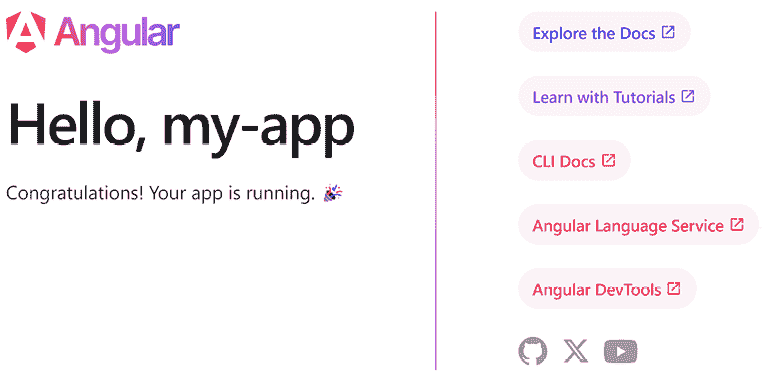

图 1.1：Angular 应用程序登录页面

恭喜！您已经创建了您的第一个 Angular CLI 工作空间。Angular CLI 创建了一个示例网页，我们可以将其用作构建项目的参考。在下一节中，我们将探索应用程序的主要部分，并学习如何修改此页面。

# Angular 应用程序的结构

我们将勇敢地迈出第一步来检查我们的 Angular 应用程序。Angular CLI 已经为我们搭建了项目并完成了大部分繁重的工作。我们所需做的就是启动我们最喜欢的 IDE 并开始与 Angular 项目一起工作。本书中我们将使用 VSCode，但请随意选择您熟悉的任何编辑器：

1.  打开 VSCode 并从主菜单中选择 **文件** | **打开文件夹…**。

1.  导航到 `my-app` 文件夹并选择它。VSCode 将加载相关的 Angular CLI 工作空间。

1.  展开文件夹 `src`。

当我们开发 Angular 应用程序时，我们可能会与 `src` 文件夹进行交互。这是我们编写应用程序代码和测试的地方。它包含以下内容：

+   `app`：应用程序的所有 Angular 相关文件。在开发过程中，您大部分时间都会与此文件夹进行交互。

+   `index.html`：Angular 应用程序的主 HTML 页面。

+   `main.ts`：Angular 应用程序的主入口点。

+   `styles.css`：适用于 Angular 应用程序的全局 CSS 样式。此文件的扩展名取决于创建应用程序时选择的样式表格式。

`app` 文件夹包含我们为应用程序编写的实际源代码。开发者大部分时间都在这个文件夹内工作。由 Angular CLI 自动创建的 Angular 应用程序包含以下文件：

+   `app.component.css`：包含针对示例页面的特定 CSS 样式。此文件的扩展名取决于创建应用程序时选择的样式表格式。

+   `app.component.html`：包含示例页面的 HTML 内容。

+   `app.component.spec.ts`：包含示例页面的单元测试。

+   `app.component.ts`：定义示例页面的**展示逻辑**。

+   `app.config.ts`：定义 Angular 应用程序的配置。

+   `app.routes.ts`：定义 Angular 应用程序的路由配置。

文件名扩展名 `.ts` 指的是 TypeScript 文件。

在以下章节中，我们将学习 Angular 如何编排一些文件以显示应用程序的示例页面。

## 组件

以 `app.component` 开头的文件名构成一个**Angular 组件**。在 Angular 中，组件通过编排展示逻辑与页面 HTML 内容（称为**模板**）的交互来控制网页的一部分。

每个 Angular 应用程序都有一个主要的 HTML 文件，名为 `index.html`，它位于 `src` 文件夹中，并包含以下 `<body>` HTML 元素：

```js
<body>
  <app-root></app-root>
</body> 
```

`<app-root>` 标签用于识别应用程序的主要组件，并作为显示其 HTML 内容的容器。它指示 Angular 在该标签内渲染主要组件的模板。我们将在 *第三章*，*使用组件构建用户界面* 中学习它是如何工作的。

当 Angular CLI 构建一个 Angular 应用程序时，它会解析 `index.html` 文件并识别 `<body>` 元素内的 HTML 标签。Angular 应用程序始终在 `<body>` 元素内渲染，并包含一个组件树。当 Angular CLI 发现一个不是已知 HTML 元素的标签，例如 `<app-root>`，它就会开始搜索应用程序树中的组件。但它是如何知道从哪里开始的呢？

## 引导启动

Angular 应用程序的启动方法称为 **引导启动**，它在 `src` 文件夹内的 `main.ts` 文件中定义：

```js
import { bootstrapApplication } from '@angular/platform-browser';
import { appConfig } from './app/app.config';
import { AppComponent } from './app/app.component';

bootstrapApplication(AppComponent, appConfig)
  .catch((err) => console.error(err)); 
```

引导启动文件的 主要任务是定义在应用程序启动时将加载的组件。它调用 `bootstrapApplication` 方法，传递 `AppComponent` 作为参数以指定应用程序的起始组件。它还传递 `appConfig` 对象作为第二个参数以指定在应用程序启动时将使用的配置。应用程序配置在 `app.config.ts` 文件中描述：

```js
import { ApplicationConfig, provideZoneChangeDetection } from '@angular/core';
import { provideRouter } from '@angular/router';
import { routes } from './app.routes';
export const appConfig: ApplicationConfig = {
  providers: [provideZoneChangeDetection({ eventCoalescing: true }), provideRouter(routes)]
}; 
```

`appConfig` 对象包含一个 `providers` 属性，用于定义在 Angular 应用程序中提供的所有服务。我们将在 *第五章*，*使用服务管理复杂任务* 中了解更多关于服务的内容。

默认情况下，新的 Angular CLI 应用程序提供了路由服务。路由与使用浏览器 URL 在不同组件之间进行的应用内导航相关。它通过 `provideRouter` 方法激活，传递一个 `routes` 对象，称为 **路由配置**，作为参数。应用程序的路由配置在 `app.routes.ts` 文件中定义：

```js
import { Routes } from '@angular/router';
export const routes: Routes = []; 
```

我们的应用程序还没有路由配置，如空的 `routes` 数组所示。我们将在 *第九章*，*使用路由导航应用程序* 中学习如何设置路由并对其进行配置。

## 模板语法

现在我们已经简要概述了我们的示例应用程序，是时候开始与源代码进行交互了：

1.  在终端窗口中运行以下命令以启动应用程序（如果尚未运行）：

    ```js
    ng serve 
    ```

如果你正在使用 VSCode，最好使用其集成的终端，它可以通过主菜单中的 **Terminal** | **New Terminal** 选项访问。

1.  使用浏览器打开应用程序 `http://localhost:4200`，注意 Angular 标志下方的文本，显示为 **Hello, my-app**。单词 **my-app**，与应用程序名称相对应，来自主组件 TypeScript 文件中声明的变量。打开 `app.component.ts` 文件并找到 `title` 变量：

    ```js
    import { Component } from '@angular/core';
    import { RouterOutlet } from '@angular/router';
    @Component({
      selector: 'app-root',
      imports: [RouterOutlet],
      templateUrl: './app.component.html',
      styleUrl: './app.component.css'
    })
    export class AppComponent {
      **title = 'my-app';**
    } 
    ```

`title` 变量是一个 **组件属性**，它在组件模板中使用。

1.  打开 `app.component.html` 文件并跳转到第 228 行：

    ```js
    <h1>Hello, {{ title }}</h1> 
    ```

`title` 属性被双大括号语法包围，称为 **插值**，它是 Angular 模板语法的组成部分。简而言之，插值将 `title` 属性的值转换为文本并在页面上打印出来。

Angular 使用特定的模板语法来扩展和丰富应用程序模板中的标准 HTML 语法。我们将在 *第三章* 中学习更多关于 Angular 模板语法的知识，*使用组件构建用户界面*。

1.  将 `AppComponent` 类中 `title` 属性的值更改为 `World`，保存更改，等待应用程序重新加载，并在浏览器中检查输出：


图 1.2：着陆页标题

恭喜！您已成功与您应用程序的源代码进行了交互。

到目前为止，您应该已经对 Angular 的工作原理以及 Angular 应用程序的基本组成部分有了基本的了解。作为读者，您到目前为止已经吸收了大量的信息。然而，您将在接下来的章节中有机会更熟悉组件。目前，重点是让您能够快速上手，通过提供像 Angular CLI 这样强大的工具，并展示如何仅通过几个步骤就能在屏幕上显示应用程序。

# Angular 工具

Angular 框架在开发者中受欢迎的原因之一是丰富的可用工具生态系统。Angular 社区已经构建了惊人的工具来完成和自动化各种任务，例如调试、检查和编写 Angular 应用程序：

+   Angular DevTools

+   VSCode 调试器

+   VSCode 配置文件

我们将在接下来的章节中学习如何使用每个工具，首先是 Angular DevTools。

## Angular DevTools

Angular DevTools 是由 Angular 团队创建和维护的浏览器扩展。它允许我们在浏览器中直接检查和配置 Angular 应用程序。它目前支持 Google Chrome 和 Mozilla Firefox，可以从以下浏览器商店下载：

+   Google Chrome: [`chrome.google.com/webstore/detail/angular-developer-tools/ienfalfjdbdpebioblfackkekamfmbnh`](https://chrome.google.com/webstore/detail/angular-developer-tools/ienfalfjdbdpebioblfackkekamfmbnh)

+   Mozilla Firefox: [`addons.mozilla.org/firefox/addon/angular-devtools`](https://addons.mozilla.org/firefox/addon/angular-devtools)

要打开扩展，请打开浏览器开发者工具并选择 **Angular** 选项卡。它包含三个附加选项卡：

+   **组件**：显示 Angular 应用程序的组件树

+   **分析器**：允许我们分析和检查 Angular 应用程序

+   **注入器树**：显示 Angular 应用程序提供的服务

在本章中，我们将探讨如何使用**组件**标签页。我们将在*第三章*，*使用组件构建用户界面*中学习如何使用**分析器**标签页，以及在*第五章*，*使用服务管理复杂任务*中使用**注入器树**标签页。

**组件**标签页允许我们预览 Angular 应用的组件和指令，并与它们交互。如果我们从树表示中选择一个组件，我们可以查看其属性和元数据：

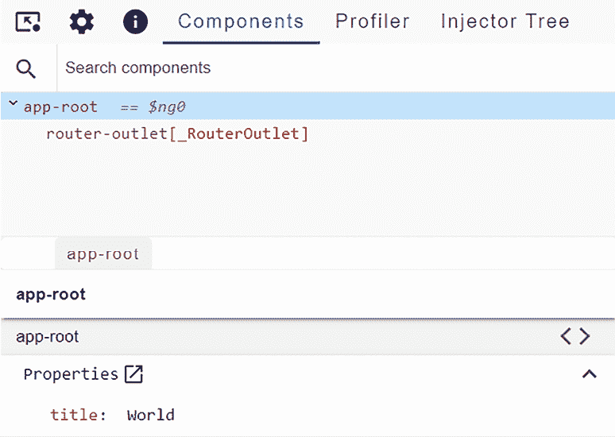

图 1.3：组件预览

从**组件**标签页，我们还可以在 DOM 中查找相应的 HTML 元素或导航到组件或指令的实际源代码。点击**< >**按钮将带我们到当前组件的 TypeScript 文件：

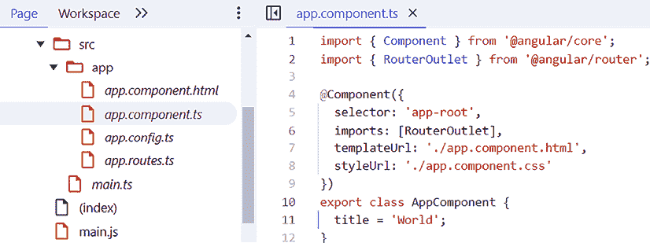

图 1.4：TypeScript 源文件

双击**组件**标签页的树表示中的选择器将带我们导航到主页的 DOM 并突出显示单个 HTML 元素：

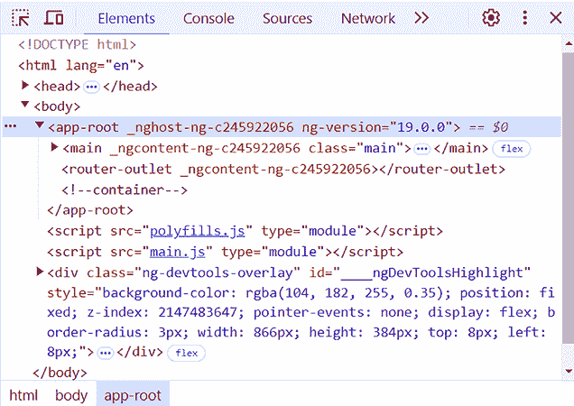

图 1.5：主页 DOM

最后，组件树最有用的功能之一是我们可以更改组件属性的值并检查组件模板的行为：

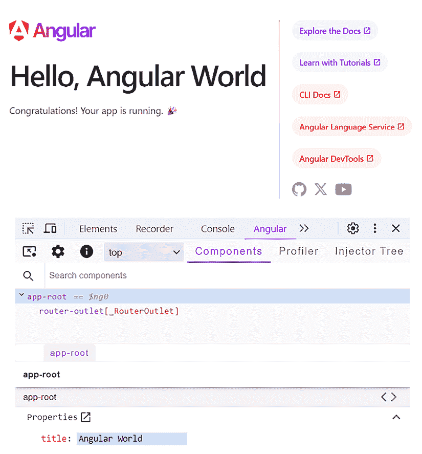

图 1.6：更改组件状态

在前面的图像中，您可以看到当我们将**title**属性的值更改为`Angular World`时，更改也反映在组件模板中。

## VSCode 调试器

我们可以使用标准 Web 应用调试技术或 VSCode 提供的工具来调试 Angular 应用。

`console`对象是调试中最常用的 Web API。它是一种快速打印数据并在浏览器控制台中检查值的方法。要检查 Angular 组件中对象的值，我们可以使用`debug`或`log`方法，将我们要检查的对象作为参数传递。然而，这被认为是一种过时的方法，包含许多`console.log`方法的代码库难以阅读。另一种方法是使用 VSCode 调试菜单中的源代码内的**断点**。

VSCode 是由微软支持的开放源代码代码编辑器。它在 Angular 社区中非常受欢迎，主要是因为它对 TypeScript 的强大支持。TypeScript 在很大程度上是由微软推动的项目，因此，其流行的编辑器被构思为内置对该语言的支持是有意义的。它包含丰富的实用功能，包括语法、错误突出显示、自动构建和调试。

VSCode 内置了一个调试工具，它使用断点来调试 Angular 应用程序。我们可以在 VSCode 中的源代码内添加断点，并检查 Angular 应用程序的状态。当 Angular 应用程序运行并遇到断点时，它会暂停并等待。在这段时间内，我们可以调查并检查当前执行上下文中涉及的几个值。

让我们看看如何向我们的示例应用程序添加断点：

1.  打开`app.component.ts`文件，并在第 11 行的左侧添加断点。红色圆点表示断点：

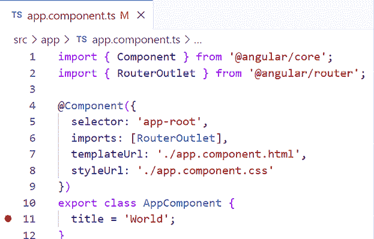

图 1.7：添加断点

1.  在 VSCode 左侧侧边栏中点击**运行和调试**按钮。

1.  点击播放按钮，使用**ng serve**命令启动应用程序：

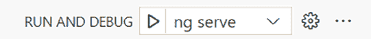

图 1.8：运行和调试菜单

VSCode 将构建我们的应用程序，打开默认的网页浏览器，并在编辑器内设置断点：

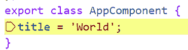

图 1.9：遇到断点

我们现在可以检查组件的各个方面，并使用调试工具栏中的按钮来控制调试会话。

VSCode 的另一个强大功能是**VSCode 配置文件**，它帮助开发者根据他们的开发需求自定义 VSCode。

## VSCode 配置文件

VSCode 配置文件允许我们自定义 VSCode 编辑器的以下方面：

+   **设置**：VSCode 的配置设置

+   **键盘快捷键**：使用键盘执行 VSCode 命令的快捷方式

+   **代码片段**：可重用的模板代码片段

+   **任务**：直接从 VSCode 自动化执行脚本和工具的任务

+   **扩展**：使我们能够在 VSCode 中添加新功能的工具，例如语言、调试器和代码检查器

配置文件也可以共享，这有助于我们在团队中保持一致的开发设置和工作流程。VSCode 包含一组内置配置文件，包括一个用于 Angular 的配置文件，我们可以根据我们的开发需求进一步自定义。要安装 Angular 配置文件：

1.  在 VSCode 左侧侧边栏底部点击代表齿轮的**管理**按钮，并选择**配置文件**选项。

1.  点击**新建配置文件**按钮的箭头，并选择**从模板** | **Angular**选项。

1.  如果您想为您的配置文件选择自定义图标，请点击齿轮按钮。

1.  点击**创建**按钮来创建您的配置文件。

VSCode 将在成功创建配置文件后自动应用新配置。

在以下章节中，我们将探索 VSCode Angular 配置文件中的某些扩展。

### Angular 语言服务

**Angular 语言服务**扩展由 Angular 团队开发并维护，它提供了 Angular 模板中的代码补全、导航和错误检测。它为 VSCode 增加了以下功能：

+   代码补全

+   跳转到定义

+   快速信息

+   诊断消息

为了一窥其强大的功能，让我们看看代码补全功能。假设我们想在主组件的模板中显示一个名为 `description` 的新属性。我们可以通过以下步骤来设置：

1.  在 `app.component.ts` 文件中定义新属性：

    ```js
    export class AppComponent {
      title = 'my-app';
      **description = 'Hello World';**
    } 
    ```

1.  打开 `app.component.html` 文件，并使用 Angular 插值语法在模板中添加属性名称。Angular 语言服务会自动找到它并为我们建议：

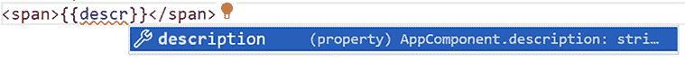

图 1.10：Angular 语言服务

`description` 属性是一个 *公共* 属性。当我们使用公共属性和方法时，可以省略关键字 `public`。代码补全不适用于私有属性和方法。如果属性被声明为 `private`，那么 Angular 语言服务和模板将无法识别它。

您可能已经注意到，当您输入时，HTML 元素下方立即出现了一条红线。Angular 语言服务直到您正确输入并给出了适当的指示，才识别出该属性，并显示了对这种识别不足的适当指示。如果您将鼠标悬停在红色指示上，它会显示关于出错原因的完整信息消息：

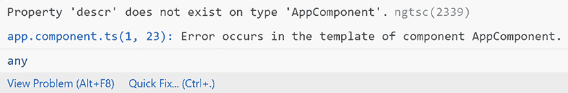

图 1.11：模板中的错误处理

前面的信息消息来自诊断消息功能。Angular 语言服务根据使用情况支持各种消息。随着您与 Angular 的工作越来越多，您将遇到更多此类消息。

### Material Icon Theme

VSCode 内置了一套图标，用于在项目中显示不同类型的文件。Material Icon Theme 扩展提供了符合 Google 的 Material Design 指南的额外图标；该集合的子集针对基于 Angular 的工件：

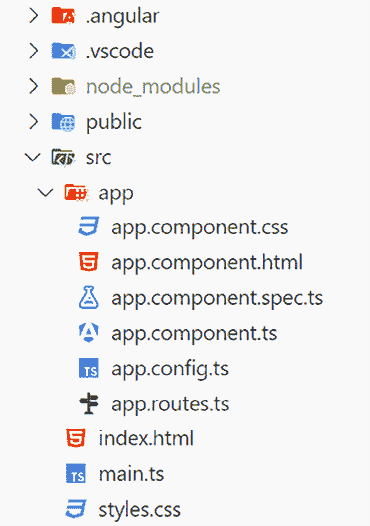

图 1.12：Material Icon Theme

使用此扩展，您可以轻松地识别项目中的 Angular 文件类型，如组件，并提高开发者的生产力，尤其是在文件众多的大型项目中。

### EditorConfig

VSCode 编辑器设置，如缩进或间距，可以在用户或项目级别设置。**EditorConfig** 可以使用 `.editorconfig` 配置文件覆盖这些设置，该文件位于 Angular CLI 项目的根目录中：

```js
# Editor configuration, see https://editorconfig.org
root = true
[*]
charset = utf-8
indent_style = space
indent_size = 2
insert_final_newline = true
trim_trailing_whitespace = true
[*.ts]
quote_type = single
ij_typescript_use_double_quotes = false
[*.md]
max_line_length = off
trim_trailing_whitespace = false 
```

您可以在该文件中定义独特的设置，以确保团队中编码风格的一致性。

# 摘要

就这样！您进入 Angular 世界的旅程才刚刚开始。让我们回顾一下您迄今为止所学的特性。我们学习了 Angular 是什么，回顾了该框架的简要历史，并探讨了使用它进行 Web 开发的优势。

我们看到了如何设置我们的开发工作空间并找到将 TypeScript 带入游戏所需的工具。我们介绍了 Angular CLI 工具，这是 Angular 的瑞士军刀，它可以自动化特定的开发任务。我们使用了一些最常用的命令来搭建我们的第一个 Angular 应用程序。我们还检查了应用程序的结构，并学习了如何与之交互。

我们的第一款应用程序让我们对 Angular 如何在网页上渲染我们的应用程序有了基本的了解。我们开始了我们的旅程，从 Angular 应用程序的主 HTML 文件开始。我们看到了 Angular 如何解析该文件并开始搜索组件树以加载主组件。我们学习了 Angular 启动过程以及它是如何用于加载应用程序配置的。

最后，我们遇到了一些最重要的 Angular 工具，这些工具可以赋予你作为软件开发者的力量。我们探讨了如何使用 Angular DevTools 检查 Angular 应用程序和 VSCode Debugger 进行调试。我们还检查了 VSCode Profiles 以及它如何帮助我们保持团队内的一致开发环境。

在下一章中，你将学习 TypeScript 语言的一些基础知识。本章将涵盖通过引入类型和语言本身可以解决的问题。TypeScript 作为 JavaScript 的超集，包含了许多强大的概念，并且与 Angular 框架配合得很好，正如你即将发现的那样。

# 加入我们的 Discord

加入我们社区的 Discord 空间，与作者和其他读者进行讨论：

[`packt.link/LearningAngular5e`](https://packt.link/LearningAngular5e)


