# 第三章：使用组件构建用户界面

到目前为止，我们有机会从宏观的角度了解 Angular 框架。我们学习了如何使用 Angular CLI 创建新的 Angular 应用程序，以及如何使用模板语法与 Angular 组件进行交互。我们还探讨了 TypeScript，这将帮助我们理解如何编写 Angular 代码。我们已经拥有了探索 Angular 带来的更多可能性的所有工具，包括创建交互式组件以及它们如何相互通信。

在本章中，我们将学习以下概念：

+   创建我们的第一个组件

+   与模板交互

+   组件间通信

+   封装 CSS 样式

+   决定变更检测策略

+   介绍组件生命周期

# 技术要求

本章包含各种代码示例，以引导您了解 Angular 组件。您可以在以下 GitHub 仓库的 `ch03` 文件夹中找到相关源代码：

[`www.github.com/PacktPublishing/Learning-Angular-Fifth-Edition`](https://www.github.com/PacktPublishing/Learning-Angular-Fifth-Edition)

# 创建我们的第一个组件

组件是 Angular 应用程序的基本构建块。它们控制不同的网页部分，称为 **视图**，例如产品列表或订单结账表单。它们负责 Angular 应用程序的展示逻辑，并且它们组织在一个可以相互交互的组件分层树中：

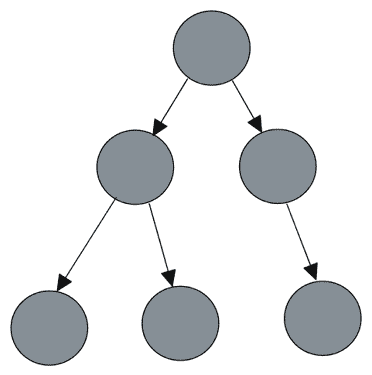

图 3.1：组件架构

Angular 应用程序的架构基于 Angular 组件。每个 Angular 组件都可以与组件树中的一个或多个组件进行通信和交互。如图 3.1 所示，一个组件可以同时是某些子组件的父组件，也是另一个父组件的子组件。

在本节中，我们将探讨以下关于 Angular 组件的主题：

+   Angular 组件的结构

+   使用 Angular CLI 创建组件

我们将从调查 Angular 组件的内部结构开始我们的旅程。

## Angular 组件的结构

正如我们在 *第一章*，*构建您的第一个 Angular 应用程序* 中所学，一个典型的 Angular 应用程序至少包含一个主组件，该组件由多个文件组成。组件的 TypeScript 类定义在 `app.component.ts` 文件中：

```js
import { Component } from '@angular/core';
import { RouterOutlet } from '@angular/router';
@Component({
  selector: 'app-root',
  imports: [RouterOutlet],
  templateUrl: './app.component.html',
  styleUrl: './app.component.css'
})
export class AppComponent {
  title = 'World';
} 
```

`@Component` 是一个 **Angular 装饰器**，用于定义 Angular 组件的属性。Angular 装饰器是一个接受包含元数据对象作为参数的方法。元数据用于使用以下属性将 TypeScript 类配置为 Angular 组件：

+   `selector`：一个 CSS 选择器，指示 Angular 在 HTML 模板中找到相应标签的位置加载组件。Angular CLI 默认添加 `app` 前缀，但您可以在创建 Angular 项目时使用 `--prefix` 选项来自定义它。

+   `imports`：定义组件需要正确加载的 Angular 艺术品列表，例如其他 Angular 组件。Angular CLI 默认在主应用程序组件中添加 `RouterOutlet`。当我们在 Angular 应用程序中需要路由功能时，会使用 `RouterOutlet`。我们将在 *第九章* 中学习如何配置路由，即 *使用路由在应用程序中导航*。

+   `templateUrl`：定义包含组件 HTML 模板的外部 HTML 文件的路径。或者，您可以使用 `template` 属性在行内提供模板。

+   `styleUrl`：定义包含组件 CSS 样式的外部 CSS 样式表文件的路径。或者，您可以使用 `styles` 属性在行内提供样式。

    在使用较旧版本的 Angular 构建的应用程序中，您可能会注意到 `@Component` 装饰器中缺少 `imports` 属性。这是因为此类组件依赖于 Angular 模块来提供必要的功能。

    然而，从 Angular v16 版本开始，引入了 `standalone` 属性作为 Angular 模块的一个替代方案。在 Angular v19 版本中，**独立组件** 现在成为默认选项，并在整个项目结构中强制执行。这种转变意味着使用 Angular v19 创建的应用程序将默认使用独立组件中的 `imports` 数组，这标志着与早期版本基于模块的架构有显著的不同。

现在，我们已经探讨了 Angular 组件的结构，我们将学习如何使用 Angular CLI 并自行创建组件。

## 使用 Angular CLI 创建组件

除了主应用程序组件外，我们还可以创建其他 Angular 组件，为应用程序提供特定的功能。

您需要有一个 Angular 应用程序才能跟随本章的其余部分。一个选择是运行您在 *第一章* 中学到的 `ng new` 命令来创建一个新的 Angular 应用程序。或者，您可以从本章 *技术要求* 部分提到的 GitHub 仓库中获取源代码。

要在 Angular 应用程序中创建一个新的组件，我们使用 Angular CLI 的 `ng generate` 命令，并将组件名称作为参数传递。请在当前 Angular CLI 工作区的根目录中运行以下命令：

```js
ng generate component product-list 
```

上述命令为组件创建了一个名为 `product-list` 的专用文件夹，其中包含所有必要的文件：

+   `product-list.component.css` 文件，目前还没有包含任何 CSS 样式。

+   包含显示静态文本的段落元素的 `product-list.component.html` 文件：

    ```js
    <p>product-list works!</p> 
    ```

+   包含一个单元测试的 `product-list.component.spec.ts` 文件，该测试检查组件是否可以成功创建：

    ```js
    import { ComponentFixture, TestBed } from '@angular/core/testing';
    import { ProductListComponent } from './product-list.component';
    describe('ProductListComponent', () => {
      let component: ProductListComponent;
      let fixture: ComponentFixture<ProductListComponent>;
      beforeEach(async () => {
        await TestBed.configureTestingModule({
          imports: [ProductListComponent]
        })
        .compileComponents();

        fixture = TestBed.createComponent(ProductListComponent);
        component = fixture.componentInstance;
        fixture.detectChanges();
      });
      it('should create', () => {
        expect(component).toBeTruthy();
      });
    }); 
    ```

我们将在 *第十三章* 中学习更多关于单元测试及其语法的知识，即 *单元测试 Angular 应用程序*。

+   包含我们组件展示逻辑的 `product-list.component.ts` 文件：

    ```js
    import { Component } from '@angular/core';
    @Component({
      selector: 'app-product-list',
      imports: [],
      templateUrl: './product-list.component.html',
      styleUrl: './product-list.component.css'
    })
    export class ProductListComponent {
    } 
    ```

在本节中，我们专注于 Angular 组件的 TypeScript 类，但它们是如何与它们的 HTML 模板交互的呢？

在以下部分，我们将学习如何在页面上显示 Angular 组件的 HTML 模板。我们还将了解如何使用 Angular 模板语法在组件的 TypeScript 类和其 HTML 模板之间进行交互。

# 与模板交互

正如我们所学的，使用 Angular CLI 创建 Angular 组件涉及生成一系列配套文件。其中之一是包含在页面中显示的 HTML 内容的组件模板。在本节中，我们将通过以下主题探索如何显示和与模板交互：

+   加载组件模板

+   显示组件类中的数据

+   组件样式化

+   从模板获取数据

我们将在组件模板中开始我们的旅程，探索如何在网页上渲染组件。

## 加载组件模板

我们了解到 Angular 使用 `selector` 属性在 HTML 模板中加载组件。典型的 Angular 应用程序在应用程序启动时加载主组件的模板。我们在 *第一章* 中看到的 `<app-root>` 标签是主应用程序组件的 `selector`。

要加载我们创建的组件，例如产品列表组件，我们必须在 HTML 模板中添加其 `selector`。对于此场景，我们将在主应用程序组件的模板中加载它：

1.  打开 `app.component.html` 文件并将 `app.component.css` 文件中 `<style>` 标签的内容移动过来。

将所有 CSS 样式放在一个单独的文件中，这样做更易于维护，并且被认为是最佳实践。

1.  通过在具有 `content` 类的 `<div>` 标签内添加 `<app-product-list>` 标签来修改 `app.component.html` 文件：

    ```js
    <div class="content">
      **<app-product-list></app-product-list>**
    </div> 
    ```

我们还可以使用自闭合标签，类似于 `<input>` 和 `` HTML 元素，将产品列表组件添加为 `<app-product-list />` 。

1.  在终端窗口中运行 `ng serve` 命令以启动 Angular 应用程序。该命令将失败，并显示以下错误：

    ```js
    [ERROR] NG8001: 'app-product-list' is not a known element 
    ```

此错误是由于主应用程序组件尚未识别产品列表组件。

1.  打开 `app.component.ts` 文件并导入 `ProductListComponent` 类：

    ```js
    import { Component } from '@angular/core';
    import { RouterOutlet } from '@angular/router';
    **import { ProductListComponent } from './product-list/product-list.component';**
    @Component({
      selector: 'app-root',
      imports: [RouterOutlet, **ProductListComponent**],
      templateUrl: './app.component.html',
      styleUrl: './app.component.css'
    })
    export class AppComponent {
      title = 'World';
    } 
    ```

应用程序构建成功后，导航到 `http://localhost:4200` 预览它。网页显示产品列表组件模板中的静态文本。

在接下来的章节中，我们将看到如何使用 Angular 模板语法，并通过 TypeScript 类与模板交互。我们将开始探索如何显示在组件 TypeScript 类中定义的动态数据。

## 从组件类显示数据

我们已经遇到了插值来显示从组件类到模板的属性值作为文本：

```js
<h1>Hello, {{ title }}</h1> 
```

Angular 将`title`组件属性转换为文本并在屏幕上显示。

执行插值的另一种方法是绑定`title`属性到`<h1>`HTML 元素的`innerText`属性，这种方法称为**属性绑定**：

```js
<h1 [innerText]="title"></h1> 
```

在前面的代码片段中，我们绑定到元素的 DOM 属性，而不是其 HTML 属性，乍一看是这样的。方括号内的属性称为**目标属性**，是我们想要绑定到其中的 DOM 元素的属性。右侧的变量称为**模板表达式**，对应于组件的`title`属性。

当我们打开一个网页时，浏览器解析页面的 HTML 内容并将其转换为树结构，即 DOM。页面上的每个 HTML 元素都转换为称为**节点**的对象，它代表 DOM 的一部分。节点定义了一组属性和方法，代表对象 API。`innerText`是这样一个属性，用于设置 HTML 元素内的文本。

为了更好地理解 Angular 模板机制的工作原理，我们首先需要了解 Angular 如何与属性和属性交互。它定义 HTML 属性以初始化 DOM 属性，然后使用数据绑定直接与属性交互。

要设置 HTML 元素的属性，我们使用属性绑定后的`attr.`语法，后跟属性名称。例如，要设置 HTML 元素的`aria-label`无障碍属性，我们会写如下：

```js
<p [attr.aria-label]="myText"></p> 
```

在前面的代码片段中，`myText`是 Angular 组件的一个属性。记住，属性绑定与 Angular 组件的属性交互。因此，如果我们想直接将`innerText`属性的值设置到 HTML 中，我们会写上单引号包围的文本值：

```js
<h1 [innerText]="'My title'"></h1> 
```

在这种情况下，传递给`innerText`属性的值是静态文本，而不是组件属性。

在 Angular 框架中，属性绑定将组件 TypeScript 类中的属性值绑定到模板中。正如我们接下来将要看到的，**控制流语法**适合协调这些值如何在模板中显示。

### 控制数据表示

Angular 框架最新版本中引入的新控制流语法允许我们操作数据在组件模板中的表示方式。它提供了一套内置块，为 Angular 模板语法添加了以下功能：

+   条件显示数据

+   遍历数据

+   切换模板

在接下来的章节中，我们将探索先前的功能，从基于条件语句显示组件数据开始。

#### 有条件地显示数据

`@if`块根据评估表达式来添加或删除 DOM 中的 HTML 元素。如果表达式评估为`true`，则元素被插入到 DOM 中。否则，元素将从 DOM 中删除。我们将通过一个示例来说明`@if`块的使用：

1.  运行以下命令来为产品创建一个接口：

    ```js
    ng generate interface product 
    ```

1.  打开`product.ts`文件并添加以下属性：

    ```js
    export interface Product {
      **id: number;**
      **title: string;**
    } 
    ```

`Product`接口定义了`Product`对象的结构。

1.  打开`app.component.css`文件并将包含`h1`和`p`选择器的 CSS 样式从`product-list.component.css`文件中移动出来。

1.  打开`product-list.component.ts`文件并创建一个空的`products`数组：

    ```js
    import { Component } from '@angular/core';
    **import { Product } from '../product';**
    @Component({
      selector: 'app-product-list',
      imports: [],
      templateUrl: './product-list.component.html',
      styleUrl: './product-list.component.css'
    })
    export class ProductListComponent {
      **products: Product[] = [];**
    } 
    ```

`products`数组将用于存储`Product`对象列表。

1.  打开`product-list.component.html`文件并用以下片段替换其内容：

    ```js
    @if (products.length > 0) {
      <h1>Products ({{products.length}})</h1>
    } 
    ```

在先前的 HTML 模板中，当`products`数组不为空时，`<h1>`元素会在屏幕上渲染。否则，它将被完全删除。

1.  `@if`块的行为类似于 JavaScript 的`if`语句。因此，我们可以在组件模板中添加一个`@else`部分，以便在没有产品时执行自定义逻辑：

    ```js
    @if (products.length > 0) {
      <h1>Products ({{products.length}})</h1>
    } **@else {**
    **<p>No products found!</p>**
    **}** 
    ```

    如果我们有一个额外的条件想要评估，我们可以使用`@else if`部分：

    ```js
    @if (products.length > 0) {
      <h1>Products ({{products.length}})</h1>
    } **@else if (products.length === 100) {**
    **<span>**
    **Click <a>Load More</a> to see more products**
    **</span>**
    `}` @else {
      <p>No products found!</p>
    } 
    ```

1.  运行`ng serve`命令来预览到目前为止的应用程序：


图 3.2：应用程序输出

在使用较旧版本的 Angular 构建的应用程序中，由于控制流语法不可用，你可能注意到使用了`*ngIf`语法来显示条件数据：

```js
<h1 *ngIf="products.length > 0">
  Products ({{products.length}})
</h1> 
```

`*ngIf`是一个与`@if`块具有相同行为的**Angular 指令**。我们将在下一章学习如何创建自定义 Angular 指令。

然而，强烈建议使用`@if`块，以下是一些原因：

+   使得模板更加易于阅读

+   语法更接近 JavaScript，更容易记住

+   它内置在框架中并且立即可用，这导致包的大小更小

你可以在[`angular.dev/guide/directives#adding-or-removing-an-element-with-ngif`](https://angular.dev/guide/directives#adding-or-removing-an-element-with-ngif)找到更多关于`*ngIf`的信息。

我们构建的应用程序没有显示任何数据，因为`products`数组是空的。在接下来的部分，我们将学习如何在产品列表组件中添加和显示产品数据。

#### 遍历数据

`@for` 块允许我们遍历一组项目并为每个项目渲染一个模板，其中我们可以定义方便的占位符来插值项目数据。每个渲染的模板都限定在放置循环指令的外部上下文中，这样我们就可以访问其他绑定。我们可以将 `@for` 块视为 JavaScript `for` 循环，但用于 HTML 模板。

我们可以使用 `@for` 块在组件中显示产品列表，如下所示：

1.  打开 `app.component.css` 文件，并将 `product-list.component.css` 文件中包含 `.pill-group`、`.pill` 和 `.pill:hover` 选择器的 CSS 样式移动到 `app.component.css` 文件中。

1.  修改 `product-list.component.ts` 文件中 `ProductListComponent` 类的 `products` 数组，使其包含以下数据：

    ```js
    export class ProductListComponent {
      products: Product[] = [
        **{ id: 1, title: 'Keyboard' },**
        **{ id: 2, title: 'Microphone' },**
        **{ id: 3, title: 'Web camera' },**
        **{ id: 4, title: 'Tablet' }**
      ];
    } 
    ```

1.  打开 `product-list.component.html` 文件，并在 `@if` 块之后添加以下片段：

    ```js
    <ul class="pill-group">
      @for (product of products; track product.id) {
        <li class="pill">{{product.title}}</li>
      }
    </ul> 
    ```

在前面的代码中，我们使用 `@for` 块并将从 `products` 数组中获取的每个元素转换为名为 **模板输入变量** 的 `product` 变量。我们通过使用 Angular 插值语法绑定其 `title` 属性来在 HTML 中引用模板变量。

在 `@for` 块的执行过程中，数据可能会改变，HTML 元素可能会被添加、移动或删除，整个列表甚至可能被替换。Angular 必须通过连接迭代的数组和相应的 DOM 元素来同步数据更改与 DOM 树。这是一个可能变得非常缓慢和昂贵的进程，并可能导致性能不佳。为此，Angular 依赖于 `track` 属性，该属性跟踪数据更改。在我们的例子中，`track` 属性定义了 `product` 变量的属性名称，该属性将用于跟踪 `products` 数组中的每个项目。

1.  运行 `ng serve` 命令以预览应用程序：

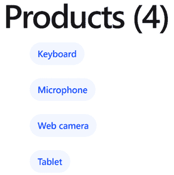

图 3.3：产品列表

1.  `@for` 块支持添加一个 `@empty` 部分，当项目数组为空时执行。我们可以通过删除 `@if` 块的 `@else` 部分并添加以下 `@empty` 部分来重构我们的代码：

    ```js
    @if (products.length > 0) {
      <h1>Products ({{products.length}})</h1>
    }
    <ul class="pill-group">
      @for (product of products; track product.id) {
        <li class="pill">{{product.title}}</li>
      } @empty {
        <p>No products found!</p>
      }
    </ul> 
    ```

`@for` 块可以观察底层集合的变化，并在集合中的项目添加、删除或重新排序时添加、删除或排序渲染的模板。还可以跟踪其他有用的属性。我们可以使用以下语法使用 `@for` 块的扩展版本：

```js
@for (product of products; track product.id; **let variable=property**) {} 
```

`variable` 是一个模板输入变量，我们可以在模板中稍后引用。`property` 可以有以下值：

+   `$count` : 表示数组中元素的数量

+   `$index` : 表示数组中元素的索引

+   `$first` / `$last` : 表示当前元素是否是数组中的第一个或最后一个

+   `$even` / `$odd` : 表示数组中元素的索引是偶数还是奇数

我们可以直接使用前面的属性，或者通过声明一个别名来使用，如下面的示例所示。

在下面的代码片段中，Angular 将 `$index` 属性的值赋给 `i` 输入变量。该 `i` 变量随后在模板中使用，以显示每个产品作为编号列表：

```js
@for (product of products; track product.id; let i = $index) {
  <li class="pill">{{i+1}}. {{product.title}}</li>
} 
```

当不确定应该从对象数据中选择哪一个时，在 `track` 变量中使用 `$index` 属性。此外，当你没有在对象中任何独特的属性，并且你不会通过删除、添加或移动元素来修改列表的顺序时，建议使用它。

在使用较旧版本的 Angular 构建的应用程序中，你可能注意到底下的集合迭代语法：

```js
<ul class="pill-group">
  <li class="pill" *ngFor="let product of products">
    {{product.title}}
  </li>
</ul> 
```

`*ngFor` 是一个与 `@for` 块类似工作的 Angular 指令。然而，强烈建议出于与上一节中提到的 `@if` 块相同的原因使用 `@for`。

你可以在 [`angular.dev/guide/directives#listing-items-with-ngfor`](https://angular.dev/guide/directives#listing-items-with-ngfor) 找到更多关于 `*ngFor` 的信息。

我们将在下一节中介绍控制流语法的最后一个块，即 `@switch` 块。

#### 模板切换

`@switch` 块在组件模板的部分之间切换，并根据定义的值显示每个部分。

你可以将 `@switch` 想象成 JavaScript 的 `switch` 语句。它由以下部分组成：

+   `@switch`：定义在应用该块时要检查的属性

+   `@case`：根据在 `@switch` 块中定义的属性的值，向 DOM 树中添加或删除模板

+   `@default`：如果 `@switch` 块中定义的属性的值不满足任何 `@case` 语句，则向 DOM 树中添加模板

我们将通过根据产品标题显示不同的表情符号来学习如何使用 `@switch` 块。打开 `product-list.component.html` 文件，并修改 `@for` 块，使其包含以下 `@switch` 块：

```js
<ul class="pill-group">
  @for (product of products; track product.id) {
    <li class="pill">
      **@switch (product.title) {**
**@case ('Keyboard') {** **** **}**
**@case ('Microphone') {** `` **}**
**@default {** `` **}**
**}**
      {{product.title}}
    </li>
  } @empty {
    <p>No products found!</p>
  }
</ul> 
```

`@switch` 块评估每个产品的 `title` 属性。当它找到一个匹配项时，它激活相应的 `@case` 部分。如果 `title` 属性的值与任何 `@case` 部分不匹配，则激活 `@default` 部分。

在使用较旧版本的 Angular 构建的应用程序中，你可能注意到底下的模板切换语法：

```js
<div [ngSwitch]="product.title">
  <p *ngSwitchCase="'Keyboard'"></p>
  <p *ngSwitchCase="'Microphone'"></p>
  <p *ngSwitchDefault></p>
</div> 
```

`[ngSwitch]` 是一个具有与 `@switch` 块相同行为的 Angular 指令。然而，强烈建议出于与上一节中提到的 `@if` 块相同的原因使用 `@switch`。

你可以在 [`angular.dev/guide/directives#switching-cases-with-ngswitch`](https://angular.dev/guide/directives#switching-cases-with-ngswitch) 找到更多关于 `[ngSwitch]` 的信息。

控制流语法的简洁性和改进的人体工程学使得在 Angular 框架中引入`@defer`块成为可能。`@defer`块通过异步加载组件模板的部分来帮助增强用户体验和提高应用程序性能。我们将在第十五章*优化应用程序性能*中了解更多内容。

在本节中，我们学习了如何利用控制流语法并协调如何在组件模板上显示数据。

如果您想在已经使用旧指令方法的现有应用程序中使用此语法，可以执行 Angular CLI 迁移，详情请参阅[`angular.dev/reference/migrations/control-flow`](https://angular.dev/reference/migrations/control-flow)。

正如我们将在下一节中学习的，Angular 框架中的属性绑定在 Angular 模板中应用 CSS 样式和类。

组件样式化

在 Web 应用程序中，可以使用 HTML 元素的`class`或`style`属性，或同时使用两者来应用样式：

```js
<p class="star"></p> 
<p style="color: greenyellow"></p> 
```

Angular 框架提供两种类型的属性绑定：

+   类绑定

+   样式绑定

让我们在下一节开始我们的组件样式之旅，使用类绑定。

### 类绑定

我们可以使用以下语法将单个类应用到 HTML 元素上：

```js
<p [class.star]="isLiked"></p> 
```

在前面的代码片段中，当`isLiked`表达式为`true`时，`star`类将被添加到段落元素中。否则，它将从元素中移除。如果我们想同时应用多个 CSS 类，可以使用以下语法：

```js
<p [class]="currentClasses"></p> 
```

`currentClasses`变量是一个组件属性。在类绑定中使用的表达式的值可以是以下之一：

+   类名由空格分隔的字符串，例如`'star active'`。

+   一个对象，键是类名，值是每个键的布尔条件。当键的值（带有其名称）评估为`true`时，将向元素添加类。否则，将从元素中移除该类：

    ```js
    currentClasses = { 
      star: true, 
      active: false 
    }; 
    ```

我们可以使用样式绑定直接设置元素的样式，而不是使用 CSS 类来样式化我们的元素。

### 样式绑定

与类绑定类似，我们可以使用样式绑定同时应用单个或多个样式。可以使用以下语法将单个样式设置为 HTML 元素：

```js
<p [style.color]="'greenyellow'"></p> 
```

在前面的代码片段中，段落元素将具有`greenyellow`颜色。一些样式可以在绑定中进一步展开，例如段落元素的`width`，我们可以定义它以及度量单位：

```js
<p [style.width.px]="100"></p> 
```

段落元素将长`100`像素。如果我们需要同时切换多个样式，可以使用对象语法：

```js
<p [style]="currentStyles"></p> 
```

`currentStyles`变量是一个组件属性。在样式绑定中使用的表达式的值可以是以下之一：

+   一个由分号分隔的样式字符串，例如`'color: greenyellow; width: 100px'`

+   一个对象，其键是样式的名称，值是实际的样式值：

    ```js
    currentStyles = { 
      color: 'greenyellow', 
      width: '100px' 
    }; 
    ```

类和样式绑定是 Angular 提供的强大功能，无需额外配置。结合我们可以在 `@Component` 装饰器中定义的 CSS 样式配置，它为 Angular 组件的样式化提供了无限的机会。同样引人注目的功能是能够从模板读取数据到组件类，我们将在下一节中探讨这一点。

## 从模板获取数据

在上一节中，我们学习了如何使用属性绑定来显示来自组件类的数据。现实场景通常涉及组件之间的双向数据流。要从模板获取数据返回到组件类，我们使用一种称为**事件绑定**的技术。我们将通过在从列表中选择产品时通知组件类来学习如何使用事件绑定：

1.  打开 `product-list.component.ts` 文件并添加一个 `selectedProduct` 属性：

    ```js
    selectedProduct: Product | undefined; 
    ```

1.  打开 `product-list.component.html` 文件，并使用插值语法来显示所选产品（如果存在）：

    ```js
    @if (selectedProduct) {
      <p>You selected:
        <strong>{{selectedProduct.title}}</strong>
      </p>
    } 
    ```

1.  在 `<li>` 标签中添加一个 `click` 事件绑定，将 `selectedProduct` 设置为 `@for` 块的当前 `product` 变量：

    ```js
    @for (product of products; track product.id) {
      <li class="pill" **(click)="selectedProduct = product"**>
        @switch (product.title) {
          @case ('Keyboard') {  }
          @case ('Microphone') {  }
          @default {  }
        }
        {{product.title}}
      </li>
    } 
    ```

1.  运行 `ng serve` 以启动应用程序并从列表中选择一个产品：

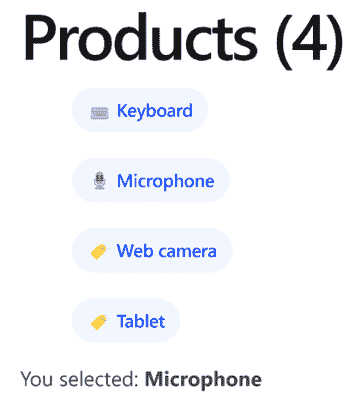

图 3.4：产品选择

事件绑定监听目标 HTML 元素上的 DOM 事件，并通过与组件类的成员交互来响应这些事件。括号内的事件称为**目标事件**，是我们当前正在监听的事件。右侧的表达式称为**模板语句**，它与组件类交互。Angular 的事件绑定支持在 [`developer.mozilla.org/docs/Web/Events`](https://developer.mozilla.org/docs/Web/Events) 找到的所有原生 DOM 事件。

组件模板与其相应的 TypeScript 类的交互总结在下述图中：

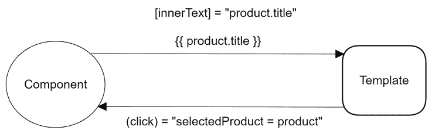

图 3.5：组件模板交互

我们用于与组件模板和类交互的相同原则也可以用于组件之间的通信。

# 组件间通信

Angular 组件公开一个公共 API，允许它们与其他组件进行通信。此 API 包含输入属性，我们使用这些属性向组件提供数据。它还公开了我们可以绑定事件监听器的输出属性，从而及时获取有关组件状态变化的详细信息。

在本节中，我们将通过快速简单的示例学习 Angular 如何通过组件注入和提取数据解决问题。

## 使用输入绑定传递数据

当前应用程序在同一组件中显示产品列表和所选产品详情。为了学习如何在不同的组件之间传递数据，我们将创建一个新的 Angular 组件，该组件将显示所选产品的详情。表示特定产品详情的数据将从产品列表组件动态传递。

我们将首先创建和配置组件以显示产品详情：

1.  运行以下 Angular CLI 命令以创建新的 Angular 组件：

    ```js
    ng generate component product-detail 
    ```

1.  打开`product-detail.component.ts`文件并相应地修改`import`语句：

    ```js
    import { Component, **input** } from '@angular/core';
    **import { Product } from '../product';** 
    ```

`input`函数是信号 API 的一部分，当我们想要将数据从一个组件向下传递到另一个组件时使用。

我们将在*第七章*中了解更多关于信号 API 的内容，即使用信号跟踪应用程序状态。

1.  在`ProductDetailComponent`类中定义一个`product`属性，使用`input`函数：

    ```js
    export class ProductDetailComponent {
      **product = input<Product>();**
    } 
    ```

在 Angular 的旧版本中，我们使用`@Input`装饰器在组件之间传递数据。您可以在[`angular.dev/guide/components/inputs`](https://angular.dev/guide/components/inputs)了解更多信息。

1.  打开`product-detail.component.html`文件并添加以下内容：

    ```js
    @if (product()) {
      <p>You selected:
        <strong>{{product()!.title}}</strong>
      </p>
    } 
    ```

在前面的代码片段中，我们使用`@if`块检查`product`输入属性是否已设置，然后再显示其`title`。

1.  打开`product-list.component.ts`文件并导入`ProductDetailComponent`类：

    ```js
    import { Component } from '@angular/core';
    import { Product } from '../product';
    **import { ProductDetailComponent } from '../product-detail/product-detail.component';**
    @Component({
      selector: 'app-product-list',
      imports: [**ProductDetailComponent**],
      templateUrl: './product-list.component.html',
      styleUrl: './product-list.component.css'
    }) 
    ```

1.  最后，将`product-list.component.html`文件中的最后一个`@if`块替换为以下代码片段：

    ```js
    <app-product-detail [product]="selectedProduct"></app-product-detail> 
    ```

在前面的代码片段中，我们使用属性绑定将`selectedProduct`属性的值绑定到产品详情组件的`product`输入属性。这种方法称为**输入绑定**。

如果我们运行应用程序并点击列表中的产品，我们会看到产品选择仍然按预期工作。

产品详情组件模板中的`@if`块意味着`product`输入属性是必需的；否则，它不会显示其`title`。Angular 在构建时不知道产品列表组件是否为`product`输入绑定传递了值。如果我们想在编译时强制执行此规则，我们可以相应地定义一个必需的输入属性：

```js
product = input.required<Product>(); 
```

根据前面的代码片段，如果产品列表组件没有为`product`输入属性传递值，Angular 编译器将抛出以下错误：

```js
[ERROR] NG8008: Required input 'product' from component ProductDetailComponent must be specified. 
```

就这样！我们已经成功地将数据从一个组件传递到另一个组件。在下一节中，我们将学习如何在组件中监听事件并对其做出响应。

## 使用输出绑定监听事件

我们了解到，当我们需要在组件之间传递数据时，会使用输入绑定。这种方法适用于有两个组件的场景，一个作为父组件，另一个作为子组件。如果我们想从子组件向父组件进行通信呢？我们如何通知父组件关于子组件中的特定操作？

考虑一个场景，其中产品详情组件应该有一个按钮，可以将当前产品添加到购物车中。购物车将是产品列表组件的一个属性。产品详情组件如何通知产品列表组件按钮已被点击？让我们看看我们如何在应用程序中实现这个功能：

1.  打开 `product-detail.component.ts` 文件，并从 `@angular/core` npm 包中导入 `output` 函数：

    ```js
    import { Component, input, **output** } from '@angular/core'; 
    ```

当我们想要创建从组件 *向上* 触发的事件时，会使用 `output` 函数。

1.  在 `ProductDetailComponent` 类中定义一个新的组件属性，该属性使用 `output` 函数：

    ```js
    added = output(); 
    ```

在 Angular 的旧版本中，我们使用 `@Output` 装饰器在组件之间触发事件。您可以在 [`angular.dev/guide/components/outputs`](https://angular.dev/guide/components/outputs) 上了解更多信息。

1.  在同一个 TypeScript 类中，创建以下方法：

    ```js
    addToCart() {
      this.added.emit();
    } 
    ```

`addToCart` 方法在之前步骤中创建的 `added` 输出事件上调用 `emit` 方法。`emit` 方法触发一个事件，并通知任何当前监听该事件的组件。

1.  现在，在组件模板中添加一个 `<button>` 元素，并将其 `click` 事件绑定到 `addToCart` 方法：

    ```js
    @if (product()) {
      <p>You selected:
        <strong>{{product()!.title}}</strong>
      </p>
      **<button (click)="addToCart()">Add to cart</button>**
    } 
    ```

1.  打开 `product-detail.component.css` 文件，并添加以下将应用于 `<button>` 元素的 CSS 样式：

    ```js
    button {
      display: flex;
      align-items: center;
      --button-accent: var(--bright-blue);
      background: color-mix(in srgb, var(--button-accent) 65%, transparent);
      color: white;
      padding-inline: 0.75rem;
      padding-block: 0.375rem;
      border-radius: 0.5rem;
      border: 0;
      transition: background 0.3s ease;
      font-family: var(--inter-font);
      font-size: 0.875rem;
      font-style: normal;
      font-weight: 500;
      line-height: 1.4rem;
      letter-spacing: -0.00875rem;
      cursor: pointer;
    }
    button:hover {
      background: color-mix(in srgb, var(--button-accent) 50%, transparent);
    } 
    ```

1.  我们几乎完成了！现在，我们需要在产品列表组件中设置绑定，以便两个组件可以通信。打开 `product-list.component.ts` 文件，并创建以下方法：

    ```js
    onAdded() {
      alert(`${this.selectedProduct?.title} added to the cart!`);
    } 
    ```

在前面的代码片段中，我们使用浏览器的原生 `alert` 方法向用户显示一个对话框。

1.  最后，按照以下方式修改 `product-list.component.html` 文件中的 `<app-product-detail>` 标签：

    ```js
    <app-product-detail
      [product]="selectedProduct"
      **(added)="onAdded()"**
    ></app-product-detail> 
    ```

在前面的代码片段中，我们使用事件绑定将 `onAdded` 方法绑定到产品详情组件的 `added` 输出属性。这种方法被称为 **输出绑定**。

如果我们从列表中选择一个产品并点击 **添加到购物车** 按钮，对话框将显示如下消息：

**已将网络摄像头添加到购物车！**

您可以在以下图中看到我们讨论的组件通信机制的概述：

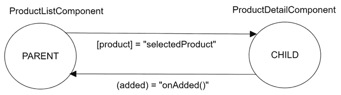

图 3.6：组件间通信

产品详情组件的输出事件除了向父组件发出事件之外，没有做更多或更少的事情。然而，我们可以通过`emit`方法使用它来传递任意数据，正如我们将在下一节中学习的那样。

### 通过自定义事件发送数据

输出事件的`emit`方法可以接受任何数据以传递给父组件。最好定义可以传递的数据类型以强制进行静态类型检查。

目前，产品列表组件已经知道选定的产品。让我们假设产品列表组件只能在用户点击**添加到购物车**按钮后实现这一点：

1.  打开`product-detail.component.ts`文件，并使用泛型声明将传递到产品列表组件的数据类型：

    ```js
    added = output**<Product>**(); 
    ```

1.  修改`addToCart`方法，以便`emit`方法传递当前选定的产品：

    ```js
    addToCart() {
      this.added.emit(**this.product()!**);
    } 
    ```

1.  打开`product-list.component.html`文件，并在`onAdded`方法中传递`$event`变量：

    ```js
    <app-product-detail
      [product]="selectedProduct"
      (added)="onAdded(**$event**)"
    ></app-product-detail> 
    ```

`$event`对象是 Angular 中的一个保留关键字，它包含来自输出绑定的事件发射器的有效负载数据，在我们的例子中是一个`Product`对象。

1.  打开`product-list.component.ts`文件，并相应地更改`onAdded`方法的签名：

    ```js
    onAdded(**product: Product**) {
      alert(`${**product**.title} added to the cart!`);
    } 
    ```

正如我们所见，输出事件绑定是一种通知父组件组件状态变化或发送任何数据的好方法。

除了使用输入和输出绑定与组件进行通信外，我们还可以直接使用局部**模板引用变量**访问它们的属性和方法。

## 模板中的局部引用变量

我们已经看到了如何使用双大括号语法进行插值将数据绑定到我们的模板中。除此之外，我们经常在我们的组件元素或甚至是常规 HTML 元素中看到以井号符号（`#`）为前缀的命名标识符。这些引用标识符，即模板引用变量，指的是我们在模板视图中标记的组件，然后通过编程方式访问它们。组件也可以使用它们来引用 DOM 中的其他元素并访问它们的属性。

我们已经学习了组件如何通过监听使用输出绑定的发出事件或通过输入绑定传递数据来进行通信。但如果我们能够深入检查组件，或者至少是其公开的属性和方法，并且无需通过输入和输出绑定来访问它们怎么办？在组件上设置局部引用为访问其公共 API 打开了大门。

组件的公共 API 由 TypeScript 类的所有`public`成员组成。

我们可以在`product-list.component.html`文件中为产品详情组件声明一个模板引用变量，如下所示：

```js
<app-product-detail
  **#productDetail**
  [product]="selectedProduct"
  (added)="onAdded()"
></app-product-detail> 
```

从那一刻起，我们可以直接访问组件成员，甚至可以在模板的其他位置绑定它们，例如显示产品标题：

```js
<span>{{productDetail.product()!.title}}</span> 
```

这样，我们就不需要依赖于输入和输出属性，并且可以操作这些属性的值。

当我们使用无法控制子组件添加输入或输出绑定属性库时，局部引用变量方法特别有用。

我们主要解释了组件类如何与其模板或其他组件交互，但几乎没有关注它们的样式。我们将在下一部分更详细地探讨这一点。

# 封装 CSS 样式

我们可以在组件内部定义 CSS 样式，以更好地封装我们的代码并使其更具可重用性。在*创建我们的第一个组件*部分，我们学习了如何使用`styleUrl`属性通过外部 CSS 文件定义组件的 CSS 样式，或者通过 TypeScript 组件文件中的`styles`属性在文件内部定义 CSS 样式。

CSS 特定性的常规规则同时适用于这两种方式：[`developer.mozilla.org/docs/Web/CSS/Specificity`](https://developer.mozilla.org/docs/Web/CSS/Specificity)。

感谢作用域样式的存在，在支持**阴影 DOM**的浏览器上，CSS 管理和特定性变得非常简单。CSS 样式应用于组件内的元素，但不会超出它们的边界。

你可以在[`developer.mozilla.org/docs/Web/API/Web_components/Using_shadow_DOM`](https://developer.mozilla.org/docs/Web/API/Web_components/Using_shadow_DOM)上找到更多关于阴影 DOM 的详细信息。

此外，Angular 将样式表嵌入网页的`<head>`元素中，以便它们可以影响我们应用的其他元素。我们可以设置不同级别的**视图封装**来防止这种情况发生。

视图封装是 Angular 需要在组件内部管理 CSS 作用域的方式。我们可以通过设置`@Component`装饰器的`encapsulation`属性来改变它，以下是一些`ViewEncapsulation`枚举值：

+   `Emulated`：通过在指向组件的特定选择器下沙盒 CSS 规则来模拟阴影 DOM 中的本地作用域。此选项被首选以确保组件样式不会泄漏到组件外部，并且不受其他外部样式的影响。它是 Angular CLI 项目的默认行为。

+   `Native`：使用渲染器的本地阴影 DOM 封装机制，仅在支持阴影 DOM 的浏览器上工作。

+   `None`：不提供模板或样式封装。样式按添加到文档`<head>`元素中的顺序注入。如果未涉及阴影 DOM 启用浏览器，则这是唯一选项。

我们将通过一个示例来探索`Emulated`和`None`选项，因为它们具有扩展的支持：

1.  打开`product-detail.component.html`文件，并将`@if`块的内容包裹在一个`<div>`元素中：

    ```js
    @if (product()) {
      `<div>`
        <p>You selected:
          <strong>{{product()!.title}}</strong>
        </p>
        <button (click)="addToCart()">Add to cart</button>
      `</div>`
    } 
    ```

1.  打开`product-detail.component.css`文件，并添加一个 CSS 样式来改变`<div>`元素的边框：

    ```js
    div {
      padding-inline: 0.75rem;
      padding-block: 0.375rem;
      border: 2px dashed;
    } 
    ```

1.  使用`ng serve`命令运行应用程序，并注意当你选择一个产品时，产品详情组件周围有一个虚线边框：

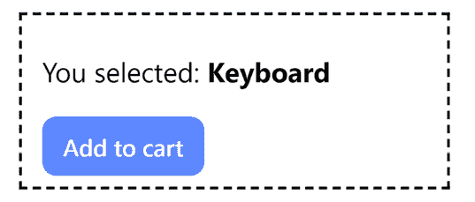

图 3.7：产品详情

样式不会影响`app.component.html`文件中的`<div>`元素，因为默认的封装作用域将所有 CSS 样式定义到特定的组件中。

如果我们没有明确指定，默认视图封装是`Emulated`。

1.  打开`product-detail.component.ts`文件，并将组件封装设置为`ViewEncapsulation.None`：

    ```js
    import { Component, input, output, **ViewEncapsulation** } from '@angular/core';
    import { Product } from '../product';
    @Component({
      selector: 'app-product-detail',
      imports: [],
      templateUrl: './product-detail.component.html',
      styleUrl: './product-detail.component.css',
      **encapsulation: ViewEncapsulation.None**
    }) 
    ```

应用程序输出应如下所示：

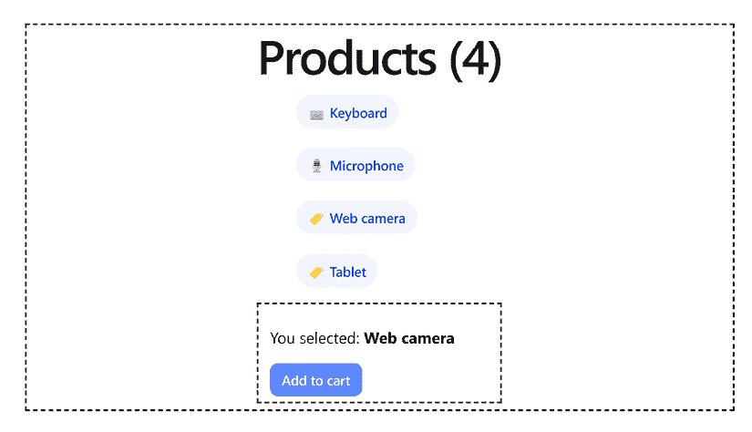

图 3.8：无视图封装

在前面的图像中，CSS 样式泄漏到组件树中，影响了主应用程序组件的`<div>`元素。

视图封装可以在我们为组件设置样式时解决许多问题。然而，应该谨慎使用，因为我们已经了解到，CSS 样式可能会泄漏到应用程序的某些部分并产生不受欢迎的效果。

变更检测策略是`@Component`装饰器的另一个非常强大的属性。让我们接下来看看这个。

# 决定变更检测策略

变更检测是 Angular 内部用来检测组件属性变化并将其反映到视图中的机制。它在特定事件上触发，例如当用户点击按钮、异步请求完成或执行`setTimeout`和`setInterval`方法时。Angular 使用称为**monkey patching**的过程，通过使用名为**Zone.js**的库来覆盖这些事件的默认行为来修改这些事件。

每个组件都有一个变更检测器，通过比较属性的当前值和上一个值来检测其属性是否发生变化。如果有差异，它将更改应用到组件模板中。在产品详情组件中，当`product`输入属性由于我们之前提到的事件而发生变化时，变更检测机制会为此组件运行并相应地更新模板。

然而，有些情况下我们不希望这种行为，例如渲染大量数据的组件。在这种情况下，默认的变更检测机制是不够的，因为它可能会在应用程序中引入性能瓶颈。我们可以使用`@Component`装饰器的`changeDetection`属性作为替代，它决定了组件将遵循的变更检测策略。

我们将通过使用 Angular DevTools 分析我们的 Angular 应用程序来学习如何使用变更检测机制：

1.  打开 `product-detail.component.ts` 文件，创建一个返回当前产品标题的 getter 属性：

    ```js
    get productTitle() {
      return this.product()!.title;
    } 
    ```

1.  打开 `product-detail.component.html` 文件，并将 `<strong>` 标签内的 `product.title` 表达式替换为 `productTitle`：

    ```js
    @if (product()) {
      <p>You selected:
        <strong>{{**productTitle**}}</strong>
      </p>
      <button (click)="addToCart()">Add to cart</button>
    } 
    ```

1.  使用 `ng serve` 命令运行应用程序，并在 `http://localhost:4200` 预览它。

1.  启动 Angular DevTools，选择 **Profiler** 选项卡，并点击 **开始录制** 按钮以开始分析 Angular 应用程序。

1.  从产品列表中点击 **键盘** 产品，并在柱状图中选择第一个条形来审查变更检测：

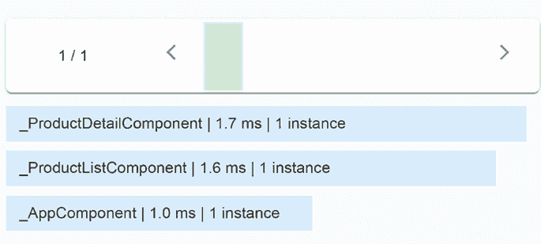

图 3.9：变更检测柱状图

在前面的图像中，我们可以看到变更检测触发了应用程序组件树中的每个组件。

1.  点击 **添加到购物车** 按钮，并在柱状图中选择第二个条形：

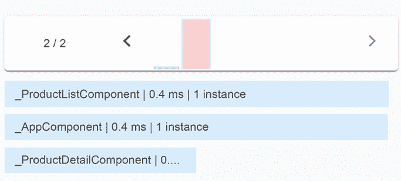

图 3.10：变更检测柱状图

即使没有更改其属性，Angular 也在产品详情组件中执行了变更检测。

1.  通过将 `product-detail.component.ts` 文件的 `@Component` 装饰器的 `changeDetection` 属性设置为 `ChangeDetectionStrategy.OnPush` 来修改它：

    ```js
    import { **ChangeDetectionStrategy**, Component, input, output } from '@angular/core';
    import { Product } from '../product';
    @Component({
      selector: 'app-product-detail',
      imports: [],
      templateUrl: './product-detail.component.html',
      styleUrl: './product-detail.component.css',
      **changeDetection: ChangeDetectionStrategy.OnPush**
    }) 
    ```

1.  重复步骤 4 到 6，并观察变更检测柱状图的第二个条形输出：

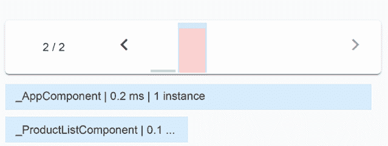

图 3.11：变更检测柱状图

这次没有为产品详情组件运行变更检测。

1.  从列表中点击 **麦克风** 产品，并观察柱状图中的新条形：

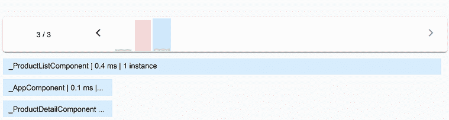

图 3.12：变更检测柱状图

这次运行了变更检测，因为我们更改了 `product` 输入属性的引用。如果我们只是使用 `OnPush` 变更检测策略更改了一个属性，变更检测机制就不会被触发。您可以在 [`angular.dev/best-practices/skipping-subtrees`](https://angular.dev/best-practices/skipping-subtrees) 了解更多变更检测场景。

变更检测策略是一种机制，允许我们修改组件检测其数据变化的方式，这在大型应用程序中可以显著提高性能。它结束了配置组件的旅程，但 Angular 框架并未止步于此。正如我们将在下一节中学习的，我们可以在组件生命周期的特定时间点进行挂钩。

# 介绍组件生命周期

生命周期事件是钩子，允许我们在组件生命周期的特定阶段跳入并应用自定义逻辑。它们的使用是可选的，但如果你了解如何使用它们，可能会很有价值。

一些钩子被认为是最佳实践，而其他钩子有助于调试和理解 Angular 应用程序中发生的事情。钩子有一个定义我们需要实现的方法的接口。Angular 框架确保钩子被调用，前提是我们已在组件中实现了该方法。

在组件中定义接口不是强制性的，但被认为是良好的实践。Angular 只关心我们是否实现了实际的方法，而不关心我们是否定义了接口。

Angular 组件最基本的生命周期钩子包括：

+   `ngOnInit`：当组件初始化时调用此方法

+   `ngOnDestroy`：当组件被销毁时调用此方法

+   `ngOnChanges`：当组件中输入绑定属性的值发生变化时调用此方法

+   `ngAfterViewInit`：当 Angular 初始化当前组件及其子组件的视图时调用此方法

所有这些生命周期钩子都可在 Angular 框架的 `@angular/core` npm 包中找到。

所有支持的生命周期钩子的完整列表可在官方 Angular 文档中找到，网址为 [`angular.dev/guide/components/lifecycle`](https://angular.dev/guide/components/lifecycle)。

我们将在接下来的章节中通过示例逐一探索这些方法。让我们从最基本的组件生命周期事件 `ngOnInit` 开始。

## 执行组件初始化

`ngOnInit` 生命周期钩子是在组件初始化期间调用的一个方法。在这个阶段，所有输入绑定和数据绑定属性都已适当地设置，我们可以安全地使用它们。使用组件的 `constructor` 来访问它们可能很有吸引力，但那时的值尚未设置。我们将通过以下示例学习如何使用 `ngOnInit` 生命周期钩子：

1.  打开 `product-detail.component.ts` 文件，并添加一个 `constructor` 方法，用于在浏览器控制台中记录 `product` 属性的值：

    ```js
    constructor() {
      console.log('Product:', this.product());
    } 
    ```

1.  从 `@angular/core` npm 包中导入 `OnInit` 接口：

    ```js
    import { Component, input, **OnInit**, output } from '@angular/core'; 
    ```

1.  将 `OnInit` 接口添加到 `ProductDetailComponent` 类实现的接口列表中：

    ```js
    export class ProductDetailComponent **implements OnInit** 
    ```

1.  在 `ProductDetailComponent` 类中添加以下方法，以记录与步骤 1 相同的信息：

    ```js
    ngOnInit(): void {
      console.log('Product:', this.product());
    } 
    ```

1.  打开 `product-list.component.ts` 文件，并为 `selectedProduct` 属性设置一个初始值：

    ```js
    selectedProduct: Product | undefined = **this.products[0];** 
    ```

1.  使用 `ng serve` 命令运行应用程序，并检查浏览器控制台输出：

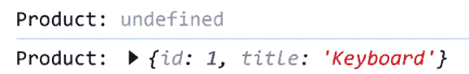

图 3.13：控制台输出

`constructor` 的第一条消息包含一个 `undefined` 值，但在第二条消息中，`product` 属性的值显示正确。

构造函数应该相对为空，并且除了设置初始变量之外不应包含其他逻辑。在构造函数中添加业务逻辑会使它在测试场景中难以模拟。

`ngOnInit`钩子的另一个良好用途是在我们需要使用来自外部源的数据初始化组件时，例如 Angular 服务，正如我们将在第五章“使用服务管理复杂任务”中学习到的那样。

Angular 框架为组件生命周期的所有阶段提供了钩子，从初始化到销毁。

## 清理组件资源

我们用于挂钩组件销毁事件的接口是`ngOnDestroy`生命周期钩子。我们需要导入`OnDestroy`接口并实现`ngOnDestroy`方法，然后才能开始使用它：

```js
import { Component, input, **OnDestroy**, output } from '@angular/core';
import { Product } from '../product';
@Component({
  selector: 'app-product-detail',
  imports: [],
  templateUrl: './product-detail.component.html',
  styleUrl: './product-detail.component.css'
})
export class ProductDetailComponent **implements OnDestroy** {
  product = input<Product>();
  added = output();
  addToCart() {
    this.added.emit();
  }
  **ngOnDestroy(): void {**

**}**
} 
```

在前面的代码片段中，我们已经添加了`OnDestroy`接口并实现了其`ngOnDestroy`方法。然后我们可以在`ngOnDestroy`方法中添加任何自定义逻辑，以便在组件销毁时运行代码。

当组件因以下原因从网页的 DOM 树中移除时，它将被销毁：

+   使用控制流语法中的`@if`块

+   使用 Angular 路由离开组件，我们将在第九章“使用路由导航应用程序”中学习到这一点，*导航通过应用程序的配置*

我们通常在`ngOnDestroy`方法中执行组件资源的清理，例如以下操作：

+   重置计时器和间隔

+   从可观察流中取消订阅，我们将在第六章“Angular 中的响应式模式”中学习到这一点。

`ngOnDestroy`生命周期钩子的另一种方法是使用内置的 Angular 服务，例如`DestroyRef`：

```js
import { Component, **DestroyRef**, input, output } from '@angular/core';
import { Product } from '../product';
@Component({
  selector: 'app-product-detail',
  imports: [],
  templateUrl: './product-detail.component.html',
  styleUrl: './product-detail.component.css'
})
export class ProductDetailComponent {
  product = input<Product>();
  added = output();
  **constructor(destroyRef: DestroyRef) {**
**destroyRef.onDestroy(() => {**
**});**
**}**
  addToCart() {
    this.added.emit();
  }
} 
```

正如我们将在第五章“使用服务管理复杂任务”中学习到的那样，使用`constructor`是将 Angular 服务注入到其他 Angular 组件的一种方法。在这种情况下，`destroyRef`服务公开了`onDestroy`方法，它接受一个回调函数作为参数。当组件销毁时，将调用回调函数。

我们已经学习了如何使用输入绑定将数据传递到组件。Angular 框架提供了`ngOnChanges`生命周期钩子，我们可以使用它来检查此类绑定的值何时已更改。

## 检测输入绑定更改

当 Angular 检测到输入数据绑定的值已更改时，会调用`ngOnChanges`生命周期钩子。我们将在产品详情组件中使用它来了解当我们从列表中选择不同的产品时，它的行为如何：

1.  在`product-detail.component.ts`文件中导入`OnChanges`和`SimpleChanges`接口：

    ```js
    import {
      Component,
      input,
      **OnChanges**,
      output,
      **SimpleChanges**
    } from '@angular/core'; 
    ```

1.  修改`ProductDetailComponent`类的定义，使其实现`OnChanges`接口：

    ```js
    export class ProductDetailComponent **implements OnChanges** 
    ```

1.  实现定义在`OnChanges`接口中的`ngOnChanges`方法。它接受一个`SimpleChanges`类型的对象作为参数，该对象包含每个更改的输入属性的键。每个键指向另一个对象，该对象具有`currentValue`和`previousValue`属性，分别表示输入属性的新旧值：

    ```js
    ngOnChanges(changes: SimpleChanges): void {
      const product = changes['product']; 
      const oldValue = product.previousValue; 
      const newValue = product.currentValue; 
      console.log('Old value', oldValue);
      console.log('New value', newValue);
    } 
    ```

前面的代码片段跟踪`product`输入属性的变化，并在浏览器控制台窗口中记录旧值和新值。

1.  要检查应用程序，运行`ng serve`命令，从列表中选择一个产品，并注意控制台中的输出。你应该得到以下类似的内容：

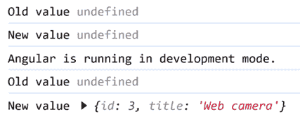

图 3.14：控制台输出

在前面的图像中，前两行表明产品值从`undefined`更改为`undefined`。这是产品详情组件初始化的实际时间，`product`属性还没有值。`OnChanges`生命周期事件在值首次设置后触发，并在所有通过绑定机制发生的后续更改中触发。

1.  为了消除不必要的日志消息，我们可以使用`isFirstChange`方法检查`product`属性是否是第一次被更改：

    ```js
    ngOnChanges(changes: SimpleChanges): void {
      const product = changes['product']; 
      **if (!product.isFirstChange()) {**
        const oldValue = product.previousValue; 
        const newValue = product.currentValue; 
        console.log('Old value', oldValue);
        console.log('New value', newValue);
      `}`
    } 
    ```

如果我们刷新浏览器，我们可以在控制台窗口中看到正确的消息。

`ngOnChanges`生命周期钩子是检测输入属性值变化的好方法。随着信号 API 的出现，我们有了更好的方法来检测和响应这些变化，正如我们将在*第七章*，*使用信号跟踪应用程序状态*中学习的那样。然而，对于 Angular 的旧版本，钩子仍然是首选的解决方案。

我们将要探索的 Angular 组件的最后一个生命周期事件是`ngAfterViewInit`钩子。

## 访问子组件

当 Angular 组件的`ngAfterViewInit`生命周期钩子被调用时：

+   组件的 HTML 模板已经初始化

+   所有子组件的 HTML 模板已经初始化

我们可以通过产品列表和产品详情组件来探索`ngAfterViewInit`事件是如何工作的：

1.  打开`product-list.component.ts`文件，并从`@angular/core` npm 包中导入`AfterViewInit`和`viewChild`组件：

    ```js
    import { **AfterViewInit**, Component, **viewChild** } from '@angular/core'; 
    ```

1.  在`ProductListComponent`类中创建以下属性：

    ```js
    productDetail = viewChild(ProductDetailComponent); 
    ```

我们已经学习了如何使用局部引用变量从 HTML 模板中查询组件类。或者，我们也可以使用`viewChild`函数从父组件类中查询子组件。

在 Angular 的旧版本中，我们使用`@ViewChild`装饰器来查询子组件。你可以了解更多信息在[`angular.dev/guide/components/queries`](https://angular.dev/guide/components/queries)。

`viewChild`函数接受我们想要查询的组件类型作为参数。

1.  修改`ProductListComponent`类的定义，使其实现`AfterViewInit`接口：

    ```js
    export class ProductListComponent **implements AfterViewInit** 
    ```

1.  `AfterViewInit`接口实现了`ngAfterViewInit`方法，我们可以使用它来访问`productDetail`属性：

    ```js
    ngAfterViewInit(): void {
      console.log(this.productDetail()!.product());
    } 
    ```

当我们查询`productDetail`属性时，我们得到`ProductDetail-Component`类的实例。然后我们可以访问其公共 API 的任何成员，例如`product`属性。

运行前面的代码将显示`product`属性的`undefined`值，因为我们没有在产品详情组件初始化时设置初始值。

`ngAfterViewInit`生命周期事件标志着我们通过 Angular 组件生命周期的旅程结束。组件生命周期钩子是框架的一个有用特性，您将在开发 Angular 应用程序时大量使用它们。

# 摘要

在本章中，我们探讨了 Angular 组件。我们看到了它们的结构以及如何创建它们，并讨论了如何将组件的 HTML 模板隔离在外部文件中，以简化其未来的可维护性。我们还看到了如何将任何我们想要绑定到组件的样式表也进行相同的处理，以防我们不希望将组件样式内联捆绑。我们还学习了如何使用 Angular 模板语法并与组件模板交互。同样，我们了解了组件如何通过属性和事件绑定双向通信。

我们探讨了 Angular 中创建强大 API 的选项，以便我们可以在组件之间提供高水平的互操作性，通过分配静态值或管理绑定来配置它们的属性。我们还看到了一个组件如何作为宿主组件为另一个子组件服务，在其模板中实例化前者的自定义元素，并为我们的应用程序中更大的组件树奠定基础。输出参数通过将我们的组件转换为事件发射器，为我们提供了所需的交互层，从而使它们能够与任何可能最终托管它们的父组件充分通信。

模板引用为我们铺平了道路，使我们能够在自定义元素中创建引用，我们可以使用它们作为访问器，从模板中以声明方式访问它们的属性和方法。Angular 中处理 CSS 视图封装的内置功能概述让我们对如何从每个组件的 shadow DOM 的 CSS 作用域中受益有了更深入的了解。最后，我们学习了在 Angular 应用程序中变更检测的重要性以及如何自定义它以进一步提高其性能。

我们还研究了组件生命周期，并学习了如何使用内置的 Angular 生命周期钩子执行自定义逻辑。关于 Angular 中的模板管理，我们还有更多要学习的内容，主要涉及您在 Angular 之旅中将要使用的两个概念：指令和管道，这些内容将在下一章中介绍。
