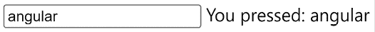
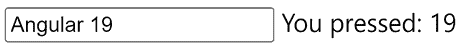
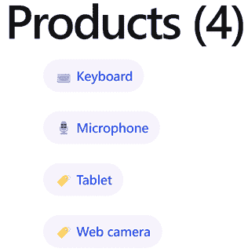

# 6

# Angular 中的响应式模式

处理异步信息是开发者日常生活中的常见任务。**响应式编程**是一种范式，它帮助我们通过数据流来消费、消化和转换异步信息。**RxJS**是一个 JavaScript 库，它提供了使用**可观察对象**来操作数据流的方法。

Angular 提供了一套无与伦比的工具集，帮助我们处理异步数据。可观察流是这套工具集的前沿，为开发者创建 Angular 应用提供了丰富的功能。Angular 框架的核心对 RxJS 的依赖性较小。其他 Angular 包，如路由器和 HTTP 客户端，与可观察对象的耦合性更紧密。然而，在撰写本文时，Angular 团队目前正在调查如何使上述包减少对可观察对象的依赖。

在本章中，我们将学习以下概念：

+   处理异步信息的策略

+   Angular 中的响应式编程

+   RxJS 库

+   订阅可观察对象

+   从可观察对象中退订

# 技术要求

本章包含各种代码示例，引导您了解可观察对象和 RxJS。您可以在以下 GitHub 仓库的 `ch06` 文件夹中找到相关源代码：

[`www.github.com/PacktPublishing/Learning-Angular-Fifth-Edition`](https://www.github.com/PacktPublishing/Learning-Angular-Fifth-Edition)

# 处理异步信息的策略

我们以不同的形式异步管理数据，例如从后端 API 消费数据，这是我们日常开发工作流程中的典型操作，或者从本地文件系统中读取内容。我们总是通过 HTTP 消费数据，例如通过向认证服务发送凭证来验证用户。我们还在获取我们最喜欢的社交网络应用中的最新帖子时使用 HTTP。

现代移动设备引入了一种独特的消费远程服务的方式。它们将请求和响应消费推迟到移动连接可用时。响应性和可用性已经成为一大问题。

尽管现在的互联网连接速度很快，但在提供此类信息时，响应时间总是存在的。因此，正如我们将在本节中看到的，我们为最终用户透明地处理应用程序的状态设置了机制。

## 从回调地狱转向承诺

有时我们可能需要在应用程序中构建一些功能，这些功能在时间经过后异步地改变其状态。在这些情况下，我们必须引入代码模式，例如**回调模式**，来处理应用程序状态的这种延迟变化。

在回调中，触发异步操作的功能接受另一个函数作为参数。当异步操作完成后，该函数将被执行。

您需要我们在*第五章*，*使用服务管理复杂任务*中创建的 Angular 应用程序的源代码，才能跟随本章的其余部分。在您获取代码后，我们建议您为简单起见采取以下行动：

+   删除`favorites`文件夹

+   删除`favorites.service.ts`及其单元测试文件

+   删除`favorite.ts`文件

+   删除`numeric.directive.ts`文件及其单元测试文件

+   删除`product-view`文件夹

让我们通过一个示例来看看如何使用回调：

1.  打开`app.component.html`文件，并添加一个`<header>`HTML 元素来显示`title`组件属性，使用插值表达式：

    ```js
    **<header>{{ title }}</header>**
    <main class="main">
      <div class="content">
        <app-product-list></app-product-list>
      </div>
    </main>
    <footer appCopyright> - v{{ settings.version }}</footer>
    <router-outlet /> 
    ```

1.  打开`app.component.ts`文件并创建以下属性：

    ```js
    private setTitle = () => {
      this.title = this.settings.title;
    } 
    ```

`setTitle`属性用于根据应用程序设置中的`title`属性更改`title`组件属性。它返回一个箭头函数，因为我们将其用作另一个方法的回调。

1.  接下来，创建一个名为`changeTitle`的方法，该方法在两秒后调用另一个方法，按照惯例命名为`callback`：

    ```js
    private changeTitle(callback: Function) {
      setTimeout(() => {
        callback();
      }, 2000);
    } 
    ```

1.  添加一个`constructor`来调用`changeTitle`方法，并将`setTitle`属性作为参数传递：

    ```js
    constructor() {
      this.changeTitle(this.setTitle);
    } 
    ```

在前面的代码片段中，我们使用`setTitle`属性而没有括号，因为我们使用回调时传递的是函数签名，而不是实际的函数调用。

如果我们使用`ng serve`命令运行 Angular 应用程序，我们会看到`title`属性在两秒后改变。我们刚才描述的模式的问题在于，随着我们引入更多的嵌套回调，代码可能会变得混乱和繁琐。

考虑以下场景，我们需要钻入文件夹层次结构以访问设备上的照片：

```js
getRootFolder(folder => { 
  getAssetsFolder(folder, assets => {
    getPhotos(assets, photos => {}); 
  });   
}); 
```

在我们能够进行下一个调用之前，我们必须依赖于之前的异步调用及其返回的数据。我们必须在执行另一个带有回调的方法的方法内部执行一个方法。代码很快就会变得复杂且难以阅读，导致一种称为**回调地狱**的情况。

我们可以使用**promises**来避免回调地狱。Promises 通过遵循更整洁、更稳定的接口，引入了一种新的异步数据管理方式。不同的异步操作可以在同一级别上串联，甚至可以从其他函数中拆分并返回。

为了更好地理解 promises 的工作原理，让我们重构先前的回调示例：

1.  在`AppComponent`类中创建一个名为`onComplete`的新方法，该方法返回一个`Promise`对象。Promise 可以是**已解决**或**拒绝**的。`resolve`参数表示 promise 已成功完成，并可选择返回一个结果：

    ```js
    private onComplete() {
      return new Promise<void>(resolve => {
      });
    } 
    ```

1.  在 promise 中引入两秒的超时，以便在这段时间过后解决：

    ```js
    private onComplete() {
      return new Promise<void>(resolve => {
        **setTimeout(() => {**
          **resolve();**
        **}, 2000);**
      });
    } 
    ```

1.  现在，将`constructor`中的`changeTitle`调用替换为基于 promise 的方法。要执行返回 promise 的方法，我们调用该方法，并用`then`方法链式调用：

    ```js
    constructor() {
      **this.onComplete().then(this.setTitle);**
    } 
    ```

如果我们重新运行 Angular 应用程序，我们不应该注意到任何显著的差异。承诺的真实价值在于它为我们代码带来的简洁性和可读性。我们现在可以相应地重构先前的文件夹层次结构示例：

```js
getRootFolder()
  .then(getAssetsFolder)
  .then(getPhotos); 
```

上一段代码中`then`方法的链式调用展示了我们如何将一个异步调用紧接另一个异步调用。每个先前的异步调用都会将其结果传递给即将到来的异步方法。

承诺很有吸引力，但有时我们可能需要生成一个响应输出，它遵循更复杂的消化过程，甚至取消整个过程。我们不能用承诺实现这种行为，因为它们在实例化时就会触发。换句话说，承诺不是懒加载的。另一方面，在异步操作已经触发但尚未完成的情况下，取消该操作的可能性在特定场景中可能非常有用。承诺允许我们解决或拒绝异步操作，但有时我们可能想在达到那个点之前取消一切。

此外，承诺作为一次性操作。一旦它们被解决，除非我们从零开始运行一切，否则我们无法期望收到任何进一步的信息或状态变化通知。总结承诺的限制：

+   它们不能被取消

+   它们立即执行

+   它们是单次操作；没有简单的方法可以重试它们

+   它们只响应一个值

让我们用一个例子来说明一些限制：

1.  在`onComplete`方法中将`setTimeout`替换为`setInterval`：

    ```js
    private onComplete() {
      return new Promise<void>(resolve => {
        **setInterval**(() => {
          resolve();
        }, 2000);
      });
    } 
    ```

承诺现在将每两秒解析一次。

1.  将`setTitle`属性修改为在组件的`title`属性中附加当前的`timestamp`：

    ```js
    private setTitle = () => {
      **const timestamp = new Date();**
      this.title = **`${this.settings.title} (${timestamp})`;**
    } 
    ```

1.  运行 Angular 应用程序，你会注意到时间戳在两秒后只设置了一次，之后再也没有改变。承诺自行解决，整个异步事件在那个时刻终止。

我们可能需要一个更主动的异步数据处理实现来修复前面的行为，这就是可观察对象出现的地方。

## 简而言之，可观察对象

可观察对象是一个对象，它维护一个依赖者列表，称为**观察者**，并通过异步方式发出事件来通知它们关于状态和数据的变化。为了做到这一点，可观察对象实现了所有必要的机制来产生和发出这些事件。它可以随时触发和取消，无论它是否已经发出了预期的数据。

观察者必须订阅一个可观察对象以接收通知并响应状态变化。这种模式被称为**观察者模式**，它允许并发操作和更高级的逻辑。这些观察者，也称为**订阅者**，会持续监听可观察对象中发生的事情，直到它被销毁。我们可以在实际示例中更清晰地看到这一切：

1.  从`rxjs` npm 包中导入`Observable`对象：

    ```js
    import { Observable } from 'rxjs'; 
    ```

1.  创建一个名为 `title$` 的组件属性，该属性创建一个 `Observable` 对象。可观察对象的构造函数接受一个 `observer` 对象作为参数。`observer` 是一个箭头函数，包含当有人使用可观察对象时将执行的业务逻辑。每隔两秒调用 `observer` 的 `next` 方法以指示数据或应用程序状态的变化：

    ```js
    title$ = new Observable(observer => {
      setInterval(() => {
        observer.next();
      }, 2000);
    }); 
    ```

当我们定义一个可观察变量时，我们倾向于在变量名后附加 `$` 符号。这是我们遵循的一种约定，以便在我们的代码中高效且快速地识别可观察对象。

1.  修改 `constructor` 组件以使用新创建的 `title$` 属性：

    ```js
    constructor() {
      **this.title$.subscribe**(this.setTitle);
    } 
    ```

我们使用 `subscribe` 方法注册到 `title$` 可观察对象，并接收任何变化的通知。如果我们不调用此方法，`setTitle` 方法将永远不会执行。

除非有订阅者订阅它，否则可观察对象不会做任何事情。

如果你运行应用程序，你会注意到时间戳每两秒变化一次。恭喜！你已经进入了可观察对象和反应式编程的世界！

可观察对象返回一个事件流，我们的订阅者会收到这些事件的即时通知，以便他们可以相应地采取行动。它们不执行异步操作并终止（尽管我们可以配置它们这样做），而是启动一个持续的流，我们可以订阅它。

然而，这还不算完。这个流可以在到达订阅它的观察者之前组合许多操作。就像我们可以使用 `map` 或 `filter` 等方法来操作数组并对其进行转换一样，我们也可以对由可观察对象发出的事件流做同样的事情。这是一个被称为反应式编程的模式，Angular 充分利用这种范式来处理异步信息。

# Angular 中的反应式编程

观察者模式是反应式编程的核心。反应脚本最基本实现包括几个我们需要熟悉的概念：

+   可观察对象

+   观察者

+   时间线

+   一系列事件

+   一组可组合的操作符

这可能听起来令人畏惧，但实际上并非如此。这里的重大挑战是改变我们的思维方式，学习如何进行反应式思考，这是本节的主要目标。

反应式编程涉及对事件流的可观察对象应用异步订阅和转换。

让我们通过一个更具描述性的例子来解释。想象一下一个交互设备，比如键盘。它有用户可以按下的键。每个按键都会触发一个特定的键盘事件，例如 `keyUp`。`keyUp` 事件具有广泛的元数据，包括但不限于用户在特定时刻按下的特定键的数字代码。随着用户继续按键，将触发更多的 `keyUp` 事件，并通过一个想象的时间线传递。时间线是一个连续的数据流，其中 `keyUp` 事件可以在任何时间发生；毕竟，用户决定何时按下这些键。

回想一下上一节中关于可观察对象的例子。那段代码可以通知观察者每两秒发出另一个值。我们知道定时器间隔触发的频率。在 keyUp 事件的情况下，我们不知道，因为它们不受我们的控制。让我们通过在我们的应用程序中实现一个键记录器来进一步解释：

1.  创建一个名为 `key-logger` 的新 Angular 组件：

    ```js
    ng generate component key-logger 
    ```

1.  打开 `key-logger.component.html` 文件，并用以下 HTML 模板替换其内容：

    ```js
    <input type="text" #keyContainer />
    You pressed: {{keys}} 
    ```

在前面的模板中，我们添加了一个 `<input>` HTML 元素，并附加了 `keyContainer` 模板引用变量。

模板引用变量可以添加到任何 HTML 元素中，而不仅仅是组件。

我们还显示了一个 `keys` 属性，表示用户按下的所有键盘键。

1.  打开 `key-logger.component.ts` 文件，并从 `@angular/core` npm 包导入 `OnInit`、`viewChild` 和 `ElementRef` 工具：

    ```js
    import { Component, **ElementRef, OnInit, viewChild** } from '@angular/core'; 
    ```

1.  在 `KeyLoggerComponent` 类中创建以下属性：

    ```js
    input = viewChild<ElementRef>('keyContainer');
    keys = ''; 
    ```

`input` 属性用于使用 `keyContainer` 模板引用变量查询 `<input>` HTML 元素。

1.  添加以下 `import` 语句以从 `rxjs` npm 包导入 `fromEvent` 工具：

    ```js
    import { fromEvent } from 'rxjs'; 
    ```

RxJS 库拥有各种有用的工具，称为 **操作符**，我们可以与可观察对象一起使用。`fromEvent` 操作符从一个原生 HTML 元素的 DOM 事件创建一个可观察对象。

1.  实现 `ngOnInit` 方法，从 `OnInit` 接口监听 `<input>` 元素中的 `keyup` 事件，并将按下的键保存在 `keys` 属性中：

    ```js
    export class KeyLoggerComponent **implements OnInit** {
      input = viewChild<ElementRef>('keyContainer');
      keys = '';
      **ngOnInit(): void {**
        **const logger$ = fromEvent<KeyboardEvent>(this.input()!.nativeElement, 'keyup');**
        **logger$.subscribe(evt => this.keys += evt.key);**
      **}**
    **}** 
    ```

注意，我们通过模板引用变量的 `nativeElement` 属性访问原生 HTML 输入元素。使用 `viewChild` 函数查询的结果是一个 `ElementRef` 对象，它是实际 HTML 元素的包装器。

1.  打开 `app.component.ts` 文件，并从 `@angular/core` npm 包导入 `KeyLoggerComponent` 类：

    ```js
    import { Component, inject } from '@angular/core';
    import { RouterOutlet } from '@angular/router';
    import { ProductListComponent } from './product-list/product-list.component';
    import { CopyrightDirective } from './copyright.directive';
    import { APP_SETTINGS, appSettings } from './app.settings';
    import { Observable } from 'rxjs';
    **import { KeyLoggerComponent } from './key-logger/key-logger.component';**
    @Component({
      selector: 'app-root',
      imports: [
        RouterOutlet,
        ProductListComponent,
        CopyrightDirective,
        **KeyLoggerComponent**
      ],
      templateUrl: './app.component.html',
      styleUrl: './app.component.css',
      providers: [
        { provide: APP_SETTINGS, useValue: appSettings }
      ]
    }) 
    ```

1.  打开 `app.component.html` 文件，并在模板中添加 `<app-key-logger>` 选择器：

    ```js
    <header>{{ title }}</header>
    <main class="main">
      <div class="content">
        <app-product-list></app-product-list>
      </div>
    </main>
    <footer appCopyright> - v{{ settings.version }}</footer>
    <router-outlet />
    **<app-key-logger></app-key-logger>** 
    ```

使用 `ng serve` 命令运行应用程序，并开始按键以验证我们刚刚创建的键记录器的使用情况：



图 6.1：键记录器输出

可观察对象的一个基本方面是使用操作符并将可观察对象链接在一起，从而实现 **丰富的组合**。当我们想要使用它们时，可观察对象操作符看起来像数组方法。例如，用于可观察对象的 `map` 操作符与数组的 `map` 方法用法相似。在下一节中，我们将学习 RxJS 库，它提供了这些操作符，并通过示例了解其中的一些。

# RxJS 库

如前所述，Angular 依赖于 RxJS，这是 **ReactiveX** 库的 JavaScript 版本，它允许我们从各种场景中创建可观察对象，包括以下内容：

+   交互事件

+   Promises

+   回调函数

+   事件

响应式编程并不旨在取代异步模式，如承诺或回调。相反，它也可以利用它们来创建可观察序列。

RxJS 内置了对各种可组合操作符的支持，用于转换、过滤和组合结果事件流。它的 API 为观察者提供了方便的方法来订阅这些流，以便我们的组件能够相应地响应状态变化或输入交互。以下小节中，我们将看到一些这些操作符的实际应用。

## 创建可观察对象

我们已经学习了如何使用`fromEvent`操作符从 DOM 事件创建可观察对象。与可观察对象创建相关的另外两个流行的操作符是`of`和`from`操作符。

`of`操作符用于从数字等值创建可观察对象：

```js
const values = of(1, 2, 3);
values.subscribe(value => console.log(value)); 
```

之前的代码片段按顺序在浏览器控制台窗口中打印了数字**1**、**2**和**3**。

`from`操作符用于将数组转换为可观察对象：

```js
const values = from([1, 2, 3]);
values.subscribe(value => console.log(value)); 
```

`from`操作符在将承诺或回调转换为可观察对象时也非常有用。我们可以在`AppComponent`类的`constructor`中将`onComplete`方法包装如下：

```js
constructor() {
  const complete$ = from(this.onComplete());
  complete$.subscribe(this.setTitle);
} 
```

如果你在一个现有的应用程序中使用承诺，`from`操作符是迁移到可观察对象的一个极好方式！

除了创建可观察对象外，RxJS 库还包含了一些实用的操作符，用于操作和转换从可观察对象发出的数据。

## 转换可观察对象

我们已经在*第四章*，*使用管道和指令丰富应用*中学习了如何创建只包含数字的指令。现在，我们将使用 RxJS 操作符在我们的键记录器组件中完成相同的事情：

1.  打开`key-logger.component.ts`文件，并从`rxjs` npm 包中导入`tap`操作符：

    ```js
    import { fromEvent, **tap** } from 'rxjs'; 
    ```

1.  按如下方式重构`ngOnInit`方法：

    ```js
    ngOnInit(): void {
      const logger$ = fromEvent<KeyboardEvent>(this.input()!.nativeElement, 'keyup');
      logger$**.pipe(**
        **tap(evt => this.keys += evt.key)**
      **).subscribe();**
    } 
    ```

`pipe`操作符将用逗号分隔的多个操作符链接和组合起来。我们可以将其视为一个配方，定义了应用于可观察对象的操作符。其中之一是`tap`操作符，当我们想要对数据执行某些操作而不修改它时使用。

1.  我们想要排除`logger$`可观察对象发出的非数字值。我们已经从`evt`属性中获取了实际按下的键，但它返回的是字母数字值。列出所有非数字值并手动排除它们将不会很高效。相反，我们将使用`map`操作符来获取键的实际 Unicode 值。它的工作方式与数组的`map`方法类似，因为它返回一个包含修改后初始数据的可观察对象。从`rxjs` npm 包中导入`map`操作符：

    ```js
    import { fromEvent, tap, **map** } from 'rxjs'; 
    ```

1.  在`ngOnInit`方法中`tap`操作符上方添加以下代码片段：

    ```js
    map(evt => evt.key.charCodeAt(0)) 
    ```

1.  我们现在可以添加`filter`操作符，它的工作方式与数组的`filter`方法类似，用于排除非数字值。从`rxjs` npm 包中导入`filter`操作符：

    ```js
    import { fromEvent, tap, map, **filter** } from 'rxjs'; 
    ```

1.  在`ngOnInit`方法中`map`运算符之后添加以下代码片段：

    ```js
    filter(code => (code > 31 && (code < 48 || code > 57)) === false) 
    ```

1.  当前可观察对象发出的是 Unicode 字符码。我们必须将它们转换回键盘字符以便在 HTML 模板中显示。重构`tap`运算符以适应这一变化：

    ```js
    tap(**digit** => this.keys += **String.fromCharCode(digit)**) 
    ```

作为最后的润色，我们将在组件中添加一个输入绑定，以有条件地切换仅数字功能：

1.  在`@angular/core` npm 包的`import`语句中添加`input`函数：

    ```js
    import { Component, ElementRef, OnInit, viewChild, **input** } from '@angular/core'; 
    ```

1.  在`KeyLoggerComponent`类中添加一个`numeric`输入属性：

    ```js
    numeric = input(false); 
    ```

1.  重构`ngOnInit`方法中的`filter`运算符，使其考虑`numeric`属性：

    ```js
    filter(code => **{**
      **if (this.numeric()) {**
        **return (code > 31 && (code < 48 || code > 57)) === false;**
      **}**
      **return true;**
    **}**) 
    ```

只有当`numeric`输入属性为`true`时，`logger$`可观察对象才会过滤非数字值。

1.  `ngOnInit`方法最终应如下所示：

    ```js
    ngOnInit(): void {
      const logger$ = fromEvent<KeyboardEvent>(this.input()!.nativeElement, 'keyup');
      logger$.pipe(
        map(evt => evt.key.charCodeAt(0)),
        filter(code => {
          if (this.numeric()) {
            return (code > 31 && (code < 48 || code > 57)) === false;
          }
          return true;
        }),
        tap(digit => this.keys += String.fromCharCode(digit))
      ).subscribe();
    } 
    ```

1.  打开`app.component.html`文件，并在`<app-key-logger>`选择器中添加对`numeric`属性的绑定：

    ```js
    <app-key-logger **[numeric]="true"**></app-key-logger> 
    ```

1.  使用`ng serve`命令运行应用程序，并在输入框中输入`Angular 19`：



图 6.2：数字键盘记录器

我们已经看到了 RxJS 运算符如何操作返回原始数据类型（如数字、字符串和数组）的可观察对象。在下一节中，我们将学习如何在我们的电子商务应用程序中使用可观察对象。

# 订阅可观察对象

我们已经了解到观察者需要订阅一个可观察对象以获取发出的数据。在我们的例子中，观察者将是产品列表组件，而可观察对象将位于`products.service.ts`文件中。因此，我们首先需要将`ProductsService`类转换为使用可观察对象而不是普通数组，以便组件可以订阅以获取数据：

1.  打开`products.service.ts`文件，并添加以下`import`语句：

    ```js
    import { Observable, of } from 'rxjs'; 
    ```

1.  将`getProducts`方法中使用的商品数据提取到单独的服务属性中，以增强代码可读性：

    ```js
    private products: Product[] = [
      { 
        id: 1,
        title: 'Keyboard',
        price: 100,
        categories: {
          1: 'Computing',
          2: 'Peripherals'
        }
      },
      {
        id: 2,
        title: 'Microphone',
        price: 35,
        categories: { 3: 'Multimedia' }
      },
      {
        id: 3,
        title: 'Web camera',
        price: 79,
        categories: {
          1: 'Computing',
          3: 'Multimedia'
        }
      },
      {
        id: 4,
        title: 'Tablet',
        price: 500,
        categories: { 4: 'Entertainment' }
      }
    ]; 
    ```

1.  修改`getProducts`方法，使其返回`products`属性作为可观察对象：

    ```js
    getProducts(): **Observable<Product[]**> {
      return **of(this.products);**
    } 
    ```

在前面的代码片段中，我们使用`of`运算符从`products`数组创建一个新的可观察对象。

`ProductsService`类现在使用可观察对象发出产品数据。我们必须修改组件以订阅并获取这些数据：

1.  打开`product-list.component.ts`文件，并在`ProductListComponent`类中创建一个`getProducts`方法：

    ```js
    private getProducts() {
      this.productService.getProducts().subscribe(products => {
        this.products = products;
      });
    } 
    ```

在前面的方法中，我们订阅了`ProductsService`类的`getProducts`方法，因为它返回一个可观察对象而不是一个普通数组。`products`数组在`subscribe`方法中返回，在那里我们将`products`组件属性设置为从可观察对象发出的数组。

1.  修改`ngOnInit`方法，使其调用新创建的`getProducts`方法：

    ```js
    ngOnInit(): void {
      **this.getProducts();**
    } 
    ```

我们本可以将`getProducts`方法的主体直接放在`ngOnInit`方法中。我们没有这样做，因为组件生命周期事件方法应该尽可能清晰简洁。始终尝试将它们的逻辑提取到单独的方法中以提高清晰度。

使用`ng serve`命令运行应用程序，你应该能够成功地在页面上显示产品列表：

图 6.3：产品列表

如前一张图所示，我们已经达到了与*第五章*中*使用服务管理复杂任务*相同的结果，即显示产品列表，但使用了可观察对象。这可能一开始并不明显，但我们已经为使用基于可观察对象的 Angular HTTP 客户端奠定了基础。在*第八章*，*通过 HTTP 与数据服务通信*中，我们将更详细地探讨 HTTP 客户端。

当我们订阅可观察对象时，如果我们没有及时清理它们，我们容易受到潜在内存泄漏的影响。在下一节中，我们将了解不同的方法来完成这项任务。

# 从可观察对象中取消订阅

当我们订阅一个可观察对象时，我们创建一个观察者来监听数据流中的变化。在订阅保持活跃的同时，观察者会持续监视该流。当订阅活跃时，它会在浏览器中保留内存并消耗一定资源。如果我们没有告诉观察者在某个时刻取消订阅并清理任何资源，对可观察对象的订阅可能会*可能地*导致内存泄漏。

观察者通常需要在创建订阅的 Angular 组件必须被销毁时取消订阅。

用于从可观察对象中取消订阅的最知名的技术如下：

+   手动取消可观察对象的订阅

+   在组件模板中使用`async`管道

让我们在以下小节中看到这两种技术的实际应用。

## 销毁组件

组件有我们可以用来挂钩并执行自定义逻辑的生命周期事件，正如我们在*第三章*，*使用组件构建用户界面*中学到的。其中之一是`ngOnDestroy`事件，它在组件被销毁且不再存在时被调用。

回想一下我们之前在示例中使用的`ProductListComponent`和`ProductViewComponent`，它们在组件初始化时订阅了`ProductsService`和`ProductViewService`的相应方法。当组件被销毁时，订阅的引用仍然保持活跃，这可能会导致不可预测的行为。我们需要在组件销毁时手动取消订阅以正确清理任何资源：

1.  打开`product-list.component.ts`文件并添加以下`import`语句：

    ```js
    import { Subscription } from 'rxjs'; 
    ```

1.  在`ProductListComponent`类中创建以下属性：

    ```js
    private productsSub: Subscription | undefined; 
    ```

1.  在`getProducts`方法中将`productsSub`属性分配给订阅结果：

    ```js
    private getProducts() {
      **this.productsSub** = this.productService.getProducts().subscribe(products => {
        this.products = products;
      });
    } 
    ```

1.  从`@angular/core` npm 包中导入`OnDestroy`生命周期钩子：

    ```js
    import { Component, OnInit, **OnDestroy** } from '@angular/core'; 
    ```

1.  将`OnDestroy`添加到`ProductListComponent`类的实现接口列表中：

    ```js
    export class ProductListComponent implements OnInit, **OnDestroy** 
    ```

1.  按照以下方式实现`ngOnDestroy`方法：

    ```js
    ngOnDestroy(): void {
      this.productsSub?.unsubscribe();
    } 
    ```

`unsubscribe`方法从订阅的活跃监听器中移除观察者，并清理任何预留的资源。

只为了取消一个订阅就需要这么多的样板代码，如果我们有很多订阅，这可能会很快变得难以阅读和维护。

或者，我们可以使用一种特定类型的操作符，称为`takeUntilDestroyed` **,** 它在`@angular/core/rxjs-interop`包中可用。我们将在产品列表组件中探索使用此操作符取消订阅观察者的方式：

1.  打开`product-list.component.ts`文件，并按照以下方式导入`inject`、`DestroyRef`和`takeUntilDestroyed`实体：

    ```js
    import { Component, **DestroyRef, inject**, OnInit } from '@angular/core';
    **import { takeUntilDestroyed } from '@angular/core/rxjs-interop';** 
    ```

`takeUntilDestroyed`实体是一个操作符，当组件被销毁时，它会取消订阅观察者。

1.  声明以下属性以注入`DestroyRef`服务：

    ```js
    private destroyRef = inject(DestroyRef); 
    ```

1.  按照以下方式修改`getProducts`方法：

    ```js
    private getProducts() {
      this.productService.getProducts()**.pipe(**
        **takeUntilDestroyed(this.destroyRef)**
      **)**.subscribe(products => {
        this.products = products;
      });
    } 
    ```

在前面的方法中，我们使用`pipe`操作符将`takeUntilDestroyed`操作符与`ProductsService`类的`getProducts`方法的订阅链接起来。`takeUntilDestroyed`操作符接受`DestroyRef`服务的参数。

1.  删除与`ngOnDestroy`方法相关的任何代码。

就这样！我们已经将我们的订阅转换为更声明性和易读的形式。然而，可维护性的问题仍然存在。我们的组件现在正在手动取消它们的观察者订阅。我们可以使用一个专门的 Angular 管道，即`async`管道，来解决这个问题，它允许我们用更少的代码自动取消订阅。

## 使用异步管道

`async`管道是 Angular 内置的管道，与观察者一起使用，其作用有两方面。它帮助我们编写更少的代码，并使我们免于设置和取消订阅。它自动订阅观察者，并在组件销毁时取消订阅。我们将使用它来简化产品列表组件的代码：

1.  打开`product-list.component.ts`文件，并添加以下`import`语句：

    ```js
    import { AsyncPipe } from '@angular/common';
    import { Observable } from 'rxjs'; 
    ```

1.  将`AsyncPipe`类添加到`@Component`装饰器的`imports`数组中：

    ```js
    @Component({
      selector: 'app-product-list',
      imports: [ProductDetailComponent, SortPipe, AsyncPipe],
      templateUrl: './product-list.component.html',
      styleUrl: './product-list.component.css'
    }) 
    ```

1.  将`products`组件属性转换为观察者：

    ```js
    products$: Observable<Product[]> | undefined; 
    ```

1.  将`ProductsService`类的`getProducts`方法分配给`products$`组件属性：

    ```js
    private getProducts() {
      **this.products$ = this.productService.getProducts();**
    } 
    ```

`getProducts`方法的主体现在已经被缩减到一行，并且变得更加易读。

1.  打开`product-list.component.html`文件，并在文件开头添加以下片段：

    ```js
    @let products = (products$ | async)!; 
    ```

在前面的代码片段中，我们使用 `async` 管道订阅了 `products$` 观察者，并使用 `@let` 关键字创建了一个模板变量。这个模板变量的名称与之前相应的组件属性相同，因此我们不需要进一步更改组件模板。

就这样！我们不再需要手动订阅或取消订阅观察者了！`async` 管道会为我们处理一切。

我们了解到观察者会对应用程序事件做出反应，并异步地向注册的观察者发出值。我们可以将观察者想象为围绕发出值的包装对象。Angular 通过提供类似的包装器，该包装器同步工作并响应应用程序状态变化，从而丰富了 Web 应用的响应式领域。

# 摘要

要详细涵盖 Angular 中所有我们可以用响应式编程做到的伟大事情，需要不止一个章节。好消息是，我们已经涵盖了进行基本 Angular 开发所需的所有工具和类。

我们学习了什么是响应式编程以及如何在 Angular 中使用它。我们看到了如何应用响应式技术，如观察者，来与数据流交互。我们探讨了 RxJS 库以及如何使用一些操作符来操作观察者。我们学习了在 Angular 组件中订阅和取消订阅观察者的不同方法。

剩下的就留给你的想象力了，所以请尽情发挥，将所有这些知识应用到你的 Angular 应用程序中。可能性是无限的，你有从承诺和观察者到响应式模式的各种策略。你可以利用响应式模式的惊人功能，为你的 Angular 应用程序构建令人惊叹的响应式体验。

正如我们已经强调的，天空才是极限。然而，我们仍然有一条漫长而激动人心的道路要走。在下一章中，我们将探索信号，这是 Angular 框架中内置的另一种响应式模式。我们将学习如何使用 Angular 信号来处理 Angular 应用程序的状态。
