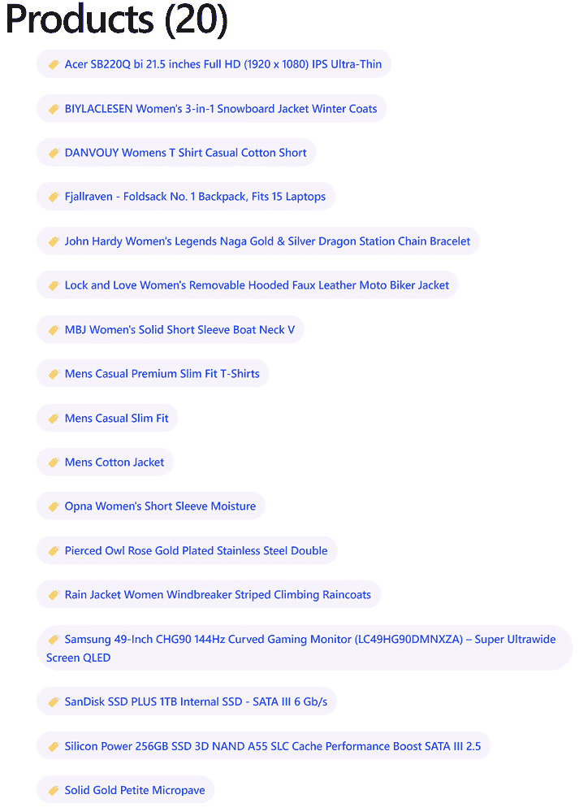

# 8

# 通过 HTTP 与数据服务通信

对于企业级 Angular 应用程序的一个真实场景是连接到远程服务和 API 以交换数据。Angular HTTP 客户端提供了与 HTTP 服务通信的现成支持。Angular 应用程序与 HTTP 客户端的交互基于 RxJS 可观察流，为开发者提供了一套丰富的数据访问能力。

通过 HTTP 连接到 API 有许多方法。在这本书中，我们只会触及表面。然而，本章涵盖的见解将让你能够迅速将 Angular 应用程序连接到 HTTP 服务，而如何使用它们的创意则完全取决于你。

在本章中，我们将探讨以下概念：

+   通过 HTTP 进行数据通信

+   介绍 Angular HTTP 客户端

+   设置后端 API

+   在 Angular 中处理 CRUD 数据

+   使用 HTTP 进行身份验证和授权

# 技术要求

本章包含各种代码示例，以向您介绍 Angular HTTP 客户端的概念。您可以在以下 GitHub 仓库的`ch08`文件夹中找到相关源代码：

[`www.github.com/PacktPublishing/Learning-Angular-Fifth-Edition`](https://www.github.com/PacktPublishing/Learning-Angular-Fifth-Edition)

# 通过 HTTP 进行数据通信

在我们深入描述 Angular HTTP 客户端及其如何与服务器通信之前，让我们首先谈谈原生的 HTTP 实现。目前，如果我们想使用 JavaScript 通过 HTTP 与服务器通信，我们可以使用 JavaScript 原生的`fetch` API。它包含所有连接到服务器和交换数据所需的方法。

你可以在以下代码中看到一个如何获取数据的示例：

```js
fetch(url)
  .then(response => {
    return response.ok ? response.text() : '';
  })
  .then(result => {
    if (result) {
      console.log(result);
    } else {
      console.error('An error has occurred');
    }
  }); 
```

尽管`fetch` API 基于 promise，但如果发生错误，它返回的 promise 不会被拒绝。相反，当`response`对象中没有`ok`属性时，请求将不成功。

如果对远程 URL 的请求完成，我们可以使用`response`对象的`text()`方法在一个新的 promise 中返回响应文本。最后，在第二个`then`回调中，我们将响应文本或特定的错误消息显示到浏览器控制台。

要了解更多关于`fetch` API 的信息，请查看官方文档[`developer.mozilla.org/docs/Web/API/fetch`](https://developer.mozilla.org/docs/Web/API/fetch)。

我们已经了解到，可观察者是管理异步操作时的灵活工具。你可能想知道我们如何将此模式应用于从 HTTP 服务获取信息时。到目前为止，你将习惯于向 AJAX 服务提交异步请求，然后将响应传递给回调或 promise。现在，我们将通过返回一个可观察者来处理调用。该可观察者将在流的环境中作为事件发出服务器响应，这可以通过 RxJS 运算符进行过滤，以更好地处理响应。

让我们将之前的 `fetch` API 示例转换为可观察对象。我们使用 `Observable` 类将 `fetch` 调用包装在一个可观察的流中，并用适当的 `observer` 对象方法替换 `console` 方法：

```js
**const request$ = new Observable(observer => {**
  fetch(url)
    .then(response => {
      return response.ok ? response.text() : '';
    })
    .then(result => {
      if (result) {
        **observer.next(result);**
        **observer.complete();**
      } else {
        **observer.error('An error has occurred');**
      }
    });
**});** 
```

在前面的代码片段中，我们使用了以下 `observer` 方法：

+   `next`：当数据到达时，这个方法将响应数据返回给订阅者

+   `complete`：这个方法通知订阅者流中不会有其他数据可用

+   `error`：这个方法会通知订阅者发生了错误

就这样！我们现在已经构建了一个自定义的 HTTP 客户端。当然，这并不算什么。我们的自定义 HTTP 客户端只处理一个 **GET** 操作来从远程端点获取数据。我们并没有处理 HTTP 协议的许多其他操作，如 **POST**、**PUT** 和 **DELETE**。然而，意识到 Angular 中 HTTP 客户端为我们所做的大量工作是非常重要的。另一个重要的教训是如何轻松地将异步 API 转换为与我们的其他异步概念很好地配合的可观察 API。因此，让我们继续探讨 Angular 中 HTTP 服务的实现。

# 介绍 Angular HTTP 客户端

Angular 框架的 HTTP 客户端是一个独立的 Angular 库，位于 `@angular/common` npm 包下的 `http` 命名空间中。Angular CLI 在创建新的 Angular 项目时默认安装此包。

您需要我们在 *第六章*，*Angular 中的响应式模式* 中创建的 Angular 应用程序的源代码，以便跟随本章的其余部分。在您获取代码后，我们建议您为了简化，删除 `key-logger` 文件夹。

要开始使用 Angular HTTP 客户端，我们需要在 `app.config.ts` 文件中导入 `provideHttpClient` 方法：

```js
**import { provideHttpClient } from '@angular/common/http';**
import { ApplicationConfig, provideZoneChangeDetection } from '@angular/core';
import { provideRouter } from '@angular/router';
import { routes } from './app.routes';
export const appConfig: ApplicationConfig = {
  providers: [
    provideZoneChangeDetection({ eventCoalescing: true }),
    provideRouter(routes),
    **provideHttpClient()**
  ]
}; 
```

假设我们想在用旧版本的 Angular 构建的应用程序中使用 HTTP 客户端。在这种情况下，我们需要从 `@angular/common/http` 命名空间中导入一个名为 `HttpClientModule` 的 Angular 模块到我们应用程序的某个模块中。

`provideHttpClient` 方法暴露了我们可以用来处理异步 HTTP 通信的各种 Angular 服务。最基本的是 `HttpClient` 服务，它提供了一个强大的 API，并抽象了通过以下 HTTP 方法处理异步连接所需的所有操作：

+   `get`：这个方法执行一个 **GET** 操作来获取数据

+   `post`：这个方法执行一个 **POST** 操作来添加新数据

+   `put` / `patch`：这个方法执行一个 **PUT** / **PATCH** 操作来更新现有数据

+   `delete`：这个方法执行一个 **DELETE** 操作来删除现有数据

之前的 HTTP 方法构成了 **创建、读取、更新、删除**（**CRUD**）应用程序的主要操作。Angular HTTP 客户端的早期方法都返回一个可观察的数据流。Angular 组件可以使用 RxJS 库订阅这些方法并与远程 API 交互。

Angular 团队目前正在调查和实验，看看他们是否可以使 RxJS 的使用在框架中成为可选的。在这种情况下，我们可能会看到一个基于信号的 HTTP 实现。在本章的其余部分，我们将坚持使用观察者，因为 Angular HTTP 客户端不支持开箱即用的信号。

在下一节中，我们将探讨如何使用这些方法并与远程 API 通信。

# 设置后端 API

Web CRUD 应用程序通常连接到服务器，并使用 HTTP 后端 API 对数据进行操作。它获取现有数据，更新它，创建新数据或删除它。

在现实世界的场景中，你很可能会通过 HTTP 与真实的后端 API 服务交互。在本书中，我们将使用一个名为 **Fake Store API** 的假 API。

官方的 Fake Store API 文档可以在 [`fakestoreapi.com`](https://fakestoreapi.com) 找到。

Fake Store API 是一个在线可用的后端 REST API，当你需要为电子商务或网店 Web 应用程序生成假数据时可以使用它。它可以管理以 JSON 格式存在的产品、购物车和用户。它公开以下主要端点：

+   **products**：这管理一组产品项

+   **cart**：这管理用户的购物车

+   **user**：这管理应用程序用户集合

+   **login**：这处理用户认证

    在本章中，我们将仅与产品和登录端点一起工作。然而，我们将在本书的后面部分重新访问购物车端点。

所有修改数据的操作都不会在数据库中物理持久化。然而，它们返回操作是否成功的指示。所有获取数据的操作返回一个预定义的项目集合。

# 在 Angular 中处理 CRUD 数据

CRUD 应用程序在 Angular 世界中广泛使用。你几乎找不到不遵循此模式的 Web 应用程序。Angular 通过提供 `HttpClient` 服务来很好地支持此类应用程序。在本节中，我们将通过与 Fake Store API 的产品端点交互来探索 Angular HTTP 客户端。

## 通过 HTTP 获取数据

`ProductListComponent` 类使用 `ProductsService` 类来获取和显示产品数据。数据目前硬编码在 `ProductsService` 类的 `products` 属性中。在本节中，我们将修改我们的 Angular 应用程序以使用 Fake Store API 的实时数据：

1.  打开 `app.component.ts` 文件，从 `@Component` 装饰器中移除 `providers` 属性。我们将直接通过应用程序配置文件提供 `APP_SETTINGS`。

1.  在这一点上，我们也可以移除 `title` 属性、`title$` 可观察对象、`setTitle` 属性和组件类的 `constructor`：

    ```js
    export class AppComponent {
      settings = inject(APP_SETTINGS);
    } 
    ```

1.  打开 `app.component.html` 文件，修改 `<header>` HTML 元素，使其直接使用 `settings` 对象：

    ```js
    <header>{{ **settings.title** }}</header> 
    ```

1.  打开 `app.config.ts` 文件，并按如下方式添加 `APP_SETTINGS` 提供者：

    ```js
    import { provideHttpClient } from '@angular/common/http';
    import { ApplicationConfig, provideZoneChangeDetection } from '@angular/core';
    import { provideRouter } from '@angular/router';
    import { routes } from './app.routes';
    **import { APP_SETTINGS, appSettings } from './app.settings';**
    export const appConfig: ApplicationConfig = {
      providers: [
        provideZoneChangeDetection({ eventCoalescing: true }),
        provideRouter(routes),
        provideHttpClient(),
        **{ provide: APP_SETTINGS, useValue: appSettings }**
      ]
    }; 
    ```

我们从应用程序配置文件中提供 `APP_SETTINGS`，因为我们希望它在应用程序中全局可访问。

1.  打开 `app.settings.ts` 文件，并在 `AppSettings` 接口中添加一个新属性，代表 Fake Store API 的 URL：

    ```js
    import { InjectionToken } from '@angular/core';
    export interface AppSettings {
      title: string;
      version: string;
      **apiUrl: string;**
    }
    export const appSettings: AppSettings = {
      title: 'My e-shop',
      version: '1.0',
      **apiUrl: 'https://fakestoreapi.com'**
    };
    export const APP_SETTINGS = new InjectionToken<AppSettings>('app.settings'); 
    ```

    后端 API 的 URL 也可以添加到环境文件中，我们将在 *第十四章*，*将应用程序部署到生产环境* 中学习这一点。

1.  打开 `products.service.ts` 文件，并相应地修改 `import` 语句：

    ```js
    **import { HttpClient } from '@angular/common/http';**
    import { Injectable, **inject** } from '@angular/core';
    import { Product } from './product';
    import { Observable, of } from 'rxjs';
    **import { APP_SETTINGS } from './app.settings';** 
    ```

1.  在 `ProductsService` 类中创建以下属性，代表 API 产品端点：

    ```js
    private productsUrl = inject(APP_SETTINGS).apiUrl + '/products'; 
    ```

1.  修改 `constructor` 以注入 `HttpClient` 服务：

    ```js
    constructor(**private http: HttpClient**) { } 
    ```

1.  修改 `getProducts` 方法，使其使用 `HttpClient` 服务获取产品列表：

    ```js
    getProducts(): Observable<Product[]> {
      return **this.http.get<Product[]>(this.productsUrl);**
    } 
    ```

在前面的方法中，我们使用 `HttpClient` 类的 `get` 方法，并将 API 的产品端点作为参数传递。我们还在 `get` 方法中定义 `Product` 为泛型类型，以指示 API 的响应包含 `Product` 对象的列表。

1.  将 `products` 属性转换为空数组：

    ```js
    private products: Product[] = **[]**; 
    ```

我们将在 *通过 HTTP 修改数据* 部分稍后用于本地缓存。

1.  打开 `product-list.component.html` 文件，并修改 `@if` 块，使其检查 `products` 模板变量是否存在：

    ```js
    @if (**products**) {
      <h1>Products ({{products.length}})</h1>
    } 
    ```

我们需要检查变量是否存在，因为数据现在是从 Fake Store API 获取的，变量获得值之前会有网络延迟。

如果我们使用 `ng serve` 命令运行应用程序，我们应该看到来自 API 的扩展产品列表，类似于以下内容：



图 8.1：Fake Store API 的产品列表

产品端点支持传递一个请求参数来限制 API 返回的结果。如 [`fakestoreapi.com/docs#p-limit`](https://fakestoreapi.com/docs#p-limit) 所示，我们可以使用名为 **limit** 的查询参数来完成此任务。让我们看看如何在 Angular HTTP 客户端中传递查询参数：

1.  打开 `products.service.ts` 文件，从 `@angular/common/http` 命名空间导入 `HttpParams` 类：

    ```js
    import { HttpClient, **HttpParams** } from '@angular/common/http'; 
    ```

`HttpParams` 类用于在 HTTP 请求中传递查询参数。

1.  在 `getProducts` 方法内部创建以下变量：

    ```js
    const options = new HttpParams().set('limit', 10); 
    ```

`HttpParams` 类是不可变的。以下操作不会工作，因为每个操作都会返回一个新的实例：

```js
`const options = new HttpParams();`
`options.set('limit', 10);` 
```

`HttpParams` 类的 `set` 方法创建一个新的查询参数。如果我们想传递额外的参数，我们应该链式调用更多的 `set` 方法，例如：

```js
const options = new HttpParams()
  .set('limit', 10)
  .set('page', 1); 
```

1.  我们使用 `get` 方法的第二个参数通过 `params` 属性传递查询参数：

    ```js
    return this.http.get<Product[]>(this.productsUrl, **{**
      **params: options**
    **}**); 
    ```

1.  保存您的更改，等待应用程序重新加载，并观察应用程序的输出：


图 8.2：产品列表

在前面的列表中，所有产品都显示相同的标签图标，这是根据 `product-list.component.html` 文件中的 `@switch` 块的默认设置：

```js
<li class="pill" (click)="selectedProduct = product">
  **@switch (product.title) {**
    **@case ('Keyboard') {** **** **}**
    **@case ('Microphone') {** **** **}**
    **@default {** **** **}**
  **}**
  **{{product.title}}**
</li> 
```

`@switch` 块依赖于产品 `title` 属性。我们将将其改为基于来自 API 产品端点的 `category` 属性：

1.  打开 `product.ts` 文件并将 `categories` 属性替换为以下属性：

    ```js
    category: string; 
    ```

1.  打开 `product-list.component.html` 文件并按如下方式修改 `@switch` 块：

    ```js
    @switch (product.category) {
      @case ('electronics') {  }
      @case ('jewelery') {  }
      @default {  }
    } 
    ```

1.  我们还需要修改 `product-detail.component.html` 文件，因为我们已经在步骤 1 中替换了 `categories` 属性：

    ```js
    @if (product()) {
      <p>You selected:
        <strong>{{product()!.title}}</strong>
      </p>
      <p>{{product()!.price | currency:'EUR'}}</p>
      <div class="pill-group">
        **<p class="pill">{{ product()!.category }}</p>**
      </div>  
      <button (click)="addToCart()">Add to cart</button>
    } 
    ```

1.  保存你的更改，等待应用程序重新加载，并观察应用程序的输出：


图 8.3：带有类别的产品列表

如果你点击列表中的产品，你会注意到产品详情显示正确：


图 8.4：产品详情

产品详情组件继续按预期工作，因为我们从产品列表传递所选产品作为输入属性：

```js
<app-product-detail
  **[product]="selectedProduct"**
  (added)="onAdded()"
></app-product-detail> 
```

我们将改变之前的行为，直接通过 HTTP GET 请求从 API 获取产品详情。Fake Store API 包含一个端点方法，我们可以使用它根据产品的 ID 获取特定产品的详情：

1.  打开 `products.service.ts` 文件并创建一个新的 `getProduct` 方法，该方法接受产品 `id` 作为参数，并根据该 `id` 初始化对 API 的 GET 请求：

    ```js
    getProduct(id: number): Observable<Product> {
      return this.http.get<Product>(`${this.productsUrl}/${id}`);
    } 
    ```

前面的方法使用 `HttpClient` 服务的 `get` 方法。它接受产品端点 URL 后跟产品 `id` 作为参数。

1.  打开 `product-detail.component.ts` 文件并按如下方式修改 `import` 语句：

    ```js
    import { CommonModule } from '@angular/common';
    import {
      Component,
      input,
      output,
      **OnChanges**
    } from '@angular/core';
    import { Product } from '../product';
    **import { Observable } from 'rxjs';**
    **import { ProductsService } from '../products.service';** 
    ```

1.  在 `ProductDetailComponent` 类中添加以下属性：

    ```js
    id = input<number>(); 
    ```

`id` 组件属性将用于从列表传递所选产品的 ID。

1.  将 `product` 输入属性替换为以下可观察对象：

    ```js
    product$: Observable<Product> | undefined; 
    ```

`product$` 属性将用于从服务中调用 `getProduct` 方法。

1.  在 `ProductDetailComponent` 类中添加一个 `constructor` 并注入 `ProductsService`：

    ```js
    constructor(private productService: ProductsService) { } 
    ```

1.  在实现接口列表中添加 `OnChanges`：

    ```js
    export class ProductDetailComponent **implements OnChanges** 
    ```

1.  实现以下 `ngOnChanges` 方法：

    ```js
    ngOnChanges(): void {
      this.product$ = this.productService.getProduct(this.id()!);
    } 
    ```

在前面的方法中，每次使用输入绑定传递新的 `id` 时，我们都将 `ProductsService` 中的 `getProduct` 方法的值分配给 `product$` 组件属性。

1.  打开 `product-detail.component.html` 文件并修改其内容，使其使用 `product$` 可观察对象：

    ```js
    **@let product = (product$ | async);**
    @if (**product**) {
      <p>You selected:
        <strong>{{**product**.title}}</strong>
      </p>
      <p>{{**product**.price | currency:'EUR'}}</p>
      <div class="pill-group">
        <p class="pill">{{ **product**.category }}</p>
      </div>  
      <button (click)="addToCart()">Add to cart</button>
    } 
    ```

1.  最后，打开 `product-list.component.html` 文件并绑定 `selectedProduct` 属性的 `id` 到 `<app-product-detail>` 组件的 `id` 输入绑定：

    ```js
    <app-product-detail
      **[id]="selectedProduct?.id"**
      (added)="onAdded()"
    ></app-product-detail> 
    ```

如果我们使用`ng serve`命令运行应用程序并从列表中选择一个产品，我们将验证产品详情是否正确显示。

我们已经学习了如何从后端 API 获取项目列表和单个项目，并涵盖了 CRUD 操作的**读取**部分。在下一节中，我们将涵盖 CRUD 操作的其余部分，这些部分主要涉及修改数据。

## 通过 HTTP 修改数据

在 CRUD 应用程序中修改数据通常指的是添加新数据以及更新或删除现有数据。为了演示如何使用 HTTP 客户端在 Angular 应用程序中实现此类功能，我们将对我们的应用程序进行以下更改：

+   创建一个 Angular 组件以添加新产品

+   修改产品详情组件以更改现有产品的价格

+   在产品详情组件中添加一个按钮以删除现有产品

我们已经提到，在 Fake Store API 中，没有 HTTP 操作会物理持久化数据，因此我们需要为我们的产品数据实现一个本地缓存机制，并在产品服务中直接与之交互：

1.  打开`products.service.ts`文件并导入`map` RxJS 运算符：

    ```js
    import { Observable, **map**, of } from 'rxjs'; 
    ```

1.  如下修改`getProducts`方法：

    ```js
    getProducts(): Observable<Product[]> {
      const options = new HttpParams().set('limit', 10);
      return this.http.get<Product[]>(this.productsUrl, {
        params: options
      })**.pipe(map(products => {**
        **this.products = products;**
        **return products;**
      **}));**
    } 
    ```

前面的方法使用 API 中的数据填充`products`数组，并将产品数据作为可观察对象返回。

1.  修改`getProduct`方法，使其使用`products`数组返回产品对象，而不是使用 Fake Store API：

    ```js
    getProduct(id: number): Observable<Product> {
      **const product = this.products.find(p => p.id === id);**
      **return of(product!);**
    } 
    ```

我们现在已经有了产品服务，可以开始构建添加新产品的组件。

### 添加新产品

要通过我们的应用程序添加新产品，我们需要将其详细信息发送到 Fake Store API：

1.  打开`products.service.ts`文件并添加以下方法：

    ```js
    addProduct(newProduct: Partial<Product>): Observable<Product> {
      return this.http.post<Product>(this.productsUrl, newProduct).pipe(
        map(product => {
          this.products.push(product);
          return product;
        })
      );
    } 
    ```

在前面的代码片段中，我们使用了`HttpClient`类的`post`方法，并传递了 API 的产品端点以及一个新产品对象作为参数。

我们将新产品定义为`Partial`，因为新产品没有 ID。

在`post`方法中定义的泛型类型表示从 API 返回的产品是一个`Product`对象。我们还将在本地缓存中添加新产品并返回它。

1.  运行以下 Angular CLI 命令以创建一个新的组件：

    ```js
    ng generate component product-create 
    ```

1.  打开`product-create.component.ts`文件并添加以下`import`语句：

    ```js
    import { ProductsService } from '../products.service'; 
    ```

1.  创建一个`constructor`并注入`ProductsService`类：

    ```js
    constructor(private productsService: ProductsService) {} 
    ```

1.  将以下方法添加到组件类中：

    ```js
    createProduct(title: string, price: string, category: string) {
      this.productsService.addProduct({
        title,
        price: Number(price),
        category
      }).subscribe();
    } 
    ```

在与 Angular HTTP 客户端交互时，我们不需要取消订阅，因为框架会自动为我们完成。

前面的方法接受产品详情作为参数并调用`ProductsService`类的`addProduct`方法。我们使用原生的`Number`函数将价格值转换为数字，因为它将从模板中作为字符串传递。

1.  打开`product-create.component.html`文件并将内容替换为以下 HTML 模板：

    ```js
    <h1>Add new product</h1>
    <div>
      <label for="title">Title</label>
      <input id="title" #title />
    </div>
    <div>
      <label for="price">Price</label>
      <input id="price" #price type="number" />
    </div>
    <div>
      <label for="category">Category</label>
      <select id="category" #category>
        <option>Select a category</option>
        <option value="electronics">Electronics</option>
        <option value="jewelery">Jewelery</option>
        <option>Other</option>
      </select>
    </div>
    <div>
      <button (click)="createProduct(title.value, price.value, category.value)">Create</button>
    </div> 
    ```

在前面的模板中，我们将 `createProduct` 方法绑定到 `Create` 按钮的 `click` 事件，并使用相应的模板引用变量传递 `<input>` 和 `<select>` HTML 元素的值。

1.  打开全局 `styles.css` 文件并添加以下 CSS 样式：

    ```js
    input {
      border-radius: 4px;
      padding: 8px;
      margin-bottom: 16px;
      border: 1px solid #BDBDBD;
    } 
    ```

此外，将按钮相关的样式从 `product-detail.component.css` 文件移动到全局 CSS 样式文件中。

1.  打开 `product-create.component.css` 文件并添加以下 CSS 样式以给我们的新组件一个良好的外观和感觉：

    ```js
    input {
      width: 200px;
    }
    select {
      border-radius: 4px;
      padding: 8px;
      margin-bottom: 16px;
      border: 1px solid #BDBDBD;
      width: 220px;
    }

    label {
      margin-bottom: 4px;
      display: block;
    } 
    ```

1.  打开 `product-list.component.ts` 文件并导入 `ProductCreateComponent` 类：

    ```js
    import { AsyncPipe } from '@angular/common';
    import { Component, OnInit } from '@angular/core';
    import { Observable } from 'rxjs';
    import { Product } from '../product';
    import { ProductDetailComponent } from '../product-detail/product-detail.component';
    import { SortPipe } from '../sort.pipe';
    import { ProductsService } from '../products.service';
    **import { ProductCreateComponent } from '../product-create/product-create.component';**
    @Component({
      selector: 'app-product-list',
      imports: [
        ProductDetailComponent,
        SortPipe,
        AsyncPipe,
        **ProductCreateComponent**
      ],
      templateUrl: './product-list.component.html',
      styleUrl: './product-list.component.css'
    }) 
    ```

1.  最后，打开 `product-list.component.html` 文件并在模板末尾添加以下片段：

    ```js
    <app-product-create></app-product-create> 
    ```

如果我们现在使用 `ng serve` 命令运行我们的 Angular 应用程序，我们应该在页面末尾看到添加新产品的组件：


图 8.5：创建产品

为了实验，尝试通过填写其详细信息，点击 **创建** 按钮，并验证新产品是否已添加到列表中。

我们将在应用程序中添加的下一个功能是通过更改现有产品的价格来修改数据。

### 更新产品价格

在电子商务应用程序中，产品的价格可能在某个时候需要更改。我们需要提供一个方法，让我们的用户可以通过我们的应用程序更新该价格：

1.  打开 `products.service.ts` 文件并添加一个用于更新产品的新的方法：

    ```js
    updateProduct(id: number, price: number): Observable<Product> {
      return this.http.patch<Product>(`${this.productsUrl}/${id}`, {
        price
      }).pipe(
        map(product => {
          const index = this.products.findIndex(p => p.id === id);
          this.products[index].price = price;
          return product;
        })
      );
    } 
    ```

在前面的方法中，我们使用 `HttpClient` 类的 `patch` 方法将我们要修改的产品详情发送到 API。我们还更新了所选产品的本地产品缓存中的价格，并返回它。

或者，我们也可以使用 HTTP 客户端的 `put` 方法。当我们只想更新对象的一个子集时，应该使用 `patch` 方法，而 `put` 方法会与所有对象属性交互。在这种情况下，我们不想更新产品标题，因此使用 `patch` 方法。这两种方法都接受 API 端点和我们要更新的对象作为参数。

1.  将以下方法添加到 `ProductDetailComponent` 类中：

    ```js
    changePrice(product: Product, price: string) {
      this.productService.updateProduct(product.id, Number(price)).subscribe();
    } 
    ```

前面的方法接受一个现有的 `product` 和其新的 `price` 作为参数，并调用 `ProductsService` 类的 `updateProduct` 方法。

1.  打开 `product-detail.component.html` 文件并在价格段落元素之后添加一个 `<input>` 和一个 `<button>` 元素：

    ```js
    @let product = (product$ | async);
    @if (product) {
      <p>You selected:
        <strong>{{product.title}}</strong>
      </p>
      <p>{{product.price | currency:'EUR'}}</p>
      **<input placeholder="New price" #price type="number" />**
      **<button**
        **class="secondary"**
        **(click)="changePrice(product, price.value)">**
          **Change**
      **</button>**
      <div class="pill-group">
        <p class="pill">{{ product.category }}</p>
      </div>  
      <button (click)="addToCart()">Add to cart</button>
    } 
    ```

`<input>` 元素用于输入产品的新的价格并定义 `price` 模板引用变量。`<button>` 元素的 `click` 事件绑定到 `changePrice` 方法，该方法传递当前的 `product` 对象和 `price` 变量的值。

1.  最后，打开 `product-detail.component.css` 文件并添加以下 CSS 样式：

    ```js
    button.secondary {
      display: inline;
      margin-left: 5px;
      --button-accent: var(--vivid-pink);
    } 
    ```

1.  运行 `ng serve` 命令以启动 Angular 应用程序，并从列表中选择一个产品。产品详情应如下所示：


图 8.6：产品详情

1.  在 **新价格** 输入框中输入一个价格并点击 **更改** 按钮。现有价格应更新以反映更改，例如：


图 8.7：更改价格后的产品详情

我们现在可以通过更改价格来修改产品。

请记住，来自 Fake Store API 的产品更改不会物理持久化。如果你更改价格并刷新浏览器，它将恢复初始价格。

我们 CRUD 应用程序的下一步和最后一步将是删除一个现有的产品。

### 删除产品

在电子商务应用程序中删除产品并不常见。然而，我们需要为此提供功能，以防用户输入错误或不正确的数据，之后想要删除它。在我们的应用程序中，删除现有产品将通过产品详情组件来完成：

1.  打开 `products.service.ts` 文件，并从 `rxjs` 包中导入 `tap` 操作符：

    ```js
    import { Observable, map, of, **tap** } from 'rxjs'; 
    ```

1.  将以下方法添加到 `ProductsService` 类中：

    ```js
    deleteProduct(id: number): Observable<void> {
      return this.http.delete<void>(`${this.productsUrl}/${id}`).pipe(
        tap(() => {
          const index = this.products.findIndex(p => p.id === id);
          this.products.splice(index, 1);
        })
      );
    } 
    ```

在前面的方法中，我们使用 `HttpClient` 类的 `delete` 方法，将产品端点和要删除的 API 产品 `id` 传递给方法。我们还在使用 `products` 数组的 `splice` 方法从本地缓存中删除产品。

该方法的返回类型设置为 `Observable<void>`，因为我们目前对 HTTP 请求的结果不感兴趣。我们只需要知道它是否成功。我们还使用了 `tap` RxJS 操作符，因为我们没有改变可观察返回的值。

1.  打开 `product-detail.component.ts` 文件，并在 `ProductDetailComponent` 类中创建一个新的输出属性：

    ```js
    deleted = output(); 
    ```

前面的属性将通知 `ProductListComponent` 已删除所选产品。

1.  创建以下方法，该方法调用 `ProductsService` 类的 `deleteProduct` 方法并触发 `deleted` 输出事件：

    ```js
    remove(product: Product) {
      this.productService.deleteProduct(product.id).subscribe(() => {
        this.deleted.emit();
      });
    } 
    ```

1.  打开 `product-detail.component.html` 文件，创建一个 `<button>` 元素，并将其 `click` 事件绑定到 `deleted` 输出事件的 `emit` 方法：

    ```js
    @let product = (product$ | async);
    @if (product) {
      <p>You selected:
        <strong>{{product.title}}</strong>
      </p>
      <p>{{product.price | currency:'EUR'}}</p>
      <input placeholder="New price" #price type="number" />
      <button
        class="secondary"
        (click)="changePrice(product, price.value)">
          Change
      </button>
      <div class="pill-group">
        <p class="pill">{{ product.category }}</p>
      </div>  
      **<div class="button-group">** 
        **<button (click)="addToCart()">Add to cart</button>**
        **<button class="delete" (click)="remove(product)">Delete</button>**
      **</div>**
    } 
    ```

在前面的代码片段中，我们将两个按钮分组在一个 `<div>` HTML 元素中，以便它们并排显示。

1.  在 `product-detail.component.css` 文件中添加新按钮和按钮组的适当样式：

    ```js
    button.delete {
      display: inline;
      margin-left: 5px;
      --button-accent: var(--hot-red);
    }
    .button-group {
      display: flex;
      flex-direction: row;
      align-items: start;
      flex-wrap: wrap;
    } 
    ```

1.  打开 `product-list.component.html` 文件，并为 `<app-product-detail>` 组件的 `deleted` 事件添加绑定：

    ```js
    <app-product-detail
      [id]="selectedProduct?.id"
      (added)="onAdded()"
      **(deleted)="selectedProduct = undefined"**
    ></app-product-detail> 
    ```

如果我们使用 `ng serve` 命令运行应用程序并从列表中选择一个产品，我们应该看到以下内容：


图 8.8：产品详情

产品详情组件现在有一个 **删除** 按钮，当点击时，它会删除产品并将其从列表中移除。

请记住，来自 Fake Store API 的产品更改不会物理持久化。如果你删除一个产品并刷新浏览器，该产品将再次出现在列表中。

我们迄今为止构建的电子商务应用有一个 **添加到购物车** 按钮可以用来将产品添加到购物车。按钮目前还没有做什么，但我们将将在下一章中实现完整的购物车功能。根据 Fake Store API 的文档，购物车仅对认证用户可用，因此我们必须确保在我们的应用中 **添加到购物车** 按钮仅对它们可用。

在 Angular 企业应用中，产品管理功能也必须保护免受未经授权的用户访问。在这种情况下，我们将实现一个更细粒度的授权方案，使用户角色仅允许管理员更改和添加产品。我们不会实现此功能，但鼓励您进行实验。

在下一节中，我们将学习 Angular 中的认证和授权。

# 使用 HTTP 进行认证和授权

Fake Store API 提供了一个用于用户认证的端点。它包含一个接受用户名和密码作为参数的登录方法，并返回一个认证令牌。我们将在我们的应用中使用认证令牌来区分已登录用户和访客。

来自用户端点 [`fakestoreapi.com/users`](https://fakestoreapi.com/users) 的预定义池提供了用户名和密码。

在本节中，我们将探讨以下认证和授权主题：

+   使用后端 API 进行认证

+   授权用户访问某些功能

+   使用拦截器授权 HTTP 请求

让我们从使用 Fake Store API 进行认证的主题开始。

## 使用后端 API 进行认证

在 Angular 的实际应用中，我们通常创建一个 Angular 组件，允许用户登录和注销应用。Angular 服务将与 API 通信并处理所有认证任务。

让我们从创建认证服务开始：

1.  运行以下命令以创建一个新的 Angular 服务：

    ```js
    ng generate service auth 
    ```

1.  打开 `auth.service.ts` 文件并按如下方式修改 `import` 语句：

    ```js
    import { Injectable, **computed, inject, signal** } from '@angular/core';
    **import { HttpClient } from '@angular/common/http';**
    **import { Observable, tap } from 'rxjs';**
    **import { APP_SETTINGS } from './app.settings';** 
    ```

1.  在 `AuthService` 类中创建以下属性：

    ```js
    private accessToken = signal('');
    private authUrl = inject(APP_SETTINGS).apiUrl + '/auth';
    isLoggedIn = computed(() => this.accessToken() !== ''); 
    ```

在前面的代码片段中，`accessToken` 信号将存储来自 API 的认证令牌，而 `isLoggedIn` 信号指示用户是否已登录。用户的登录状态取决于 `accessToken` 属性是否有值。

信号不仅可以在 Angular 组件中使用，也可以在服务内部使用。

`authUrl` 属性指向 Fake Store API 的认证端点 URL。

1.  在 `constructor` 中注入 `HttpClient` 类：

    ```js
    constructor(**private http: HttpClient**) { } 
    ```

1.  创建一个 `login` 方法以允许用户登录到 Fake Store API：

    ```js
    login(username: string, password: string): Observable<string> {
      return this.http.post<string>(this.authUrl + '/login', {
        username, password
      }).pipe(tap(token => this.accessToken.set(token)));
    } 
    ```

前面的方法使用 API 的登录端点发起 POST 请求，并在请求体中传递 `username` 和 `password`。从 POST 请求返回的可观察对象传递给 `tap` 操作符，该操作符更新 `accessToken` 信号。

1.  创建一个 `logout` 方法来重置 `accessToken` 信号：

    ```js
    logout() {
      this.accessToken.set('');
    } 
    ```

我们已经在 Angular 应用程序中设置了用户认证的业务逻辑。在下一节中，我们将学习如何使用它来控制应用程序中的授权。

## 授权用户访问

首先，我们将创建一个认证组件，允许我们的用户登录和登出应用程序：

1.  运行以下命令以创建一个新的 Angular 组件：

    ```js
    ng generate component auth 
    ```

1.  打开 `auth.component.ts` 文件并添加以下 `import` 语句：

    ```js
    import { AuthService } from '../auth.service'; 
    ```

1.  在组件的 `constructor` 中注入 `AuthService`：

    ```js
    constructor(public authService: AuthService) {} 
    ```

在前面的代码片段中，我们使用 `public` 访问修饰符注入 `AuthService`，因为我们希望它可以从组件的模板中访问。

1.  在 `AuthComponent` 类中创建以下方法：

    ```js
    login() {
      this.authService.login('david_r', '3478*#54').subscribe();
    }
    logout() {
      this.authService.logout();
    } 
    ```

在前面的代码片段中，`login` 方法使用用户端点的预定义凭据。

1.  打开 `auth.component.html` 文件，并用以下 HTML 模板替换其内容：

    ```js
    @if (!authService.isLoggedIn()) {
      <button (click)="login()">Login</button>
    } @else {
      <button (click)="logout()">Logout</button>
    } 
    ```

上述模板包含两个 `<button>` HTML 元素，用于登录/登出。每个按钮根据 `AuthService` 类的 `isLoggedIn` 信号值有条件地显示。

我们现在可以利用产品详情组件中的 `isLoggedIn` 信号来切换 **添加到购物车** 按钮的可见性：

1.  打开 `product-detail.component.ts` 文件并添加以下 `import` 语句：

    ```js
    import { AuthService } from '../auth.service'; 
    ```

1.  在 `ProductDetailComponent` 类的 `constructor` 中注入 `AuthService`：

    ```js
    constructor(private productService: ProductsService, **public authService: AuthService**) { } 
    ```

1.  打开 `product-detail.component.html` 文件，并使用 `@if` 块有条件地显示 **添加到购物车** 按钮：

    ```js
    **@if (authService.isLoggedIn()) {** 
      <button (click)="addToCart()">Add to cart</button>
    **}** 
    ```

1.  打开 `app.component.ts` 文件并导入 `AuthComponent` 类：

    ```js
    import { Component, inject } from '@angular/core';
    import { RouterOutlet } from '@angular/router';
    import { ProductListComponent } from './product-list/product-list.component';
    import { CopyrightDirective } from './copyright.directive';
    import { APP_SETTINGS } from './app.settings';
    **import { AuthComponent } from './auth/auth.component';**
    @Component({
      selector: 'app-root',
      imports: [
        RouterOutlet,
        ProductListComponent,
        CopyrightDirective,
        **AuthComponent**
      ],
      templateUrl: './app.component.html',
      styleUrl: './app.component.css'
    }) 
    ```

1.  打开 `app.component.html` 文件并在 `<header>` HTML 元素内添加 `<app-auth>` 标签：

    ```js
    <header>
      {{ settings.title }}
      **<app-auth></app-auth>**
    </header> 
    ```

要尝试应用程序中的认证功能，请按照以下步骤操作：

1.  运行 `ng serve` 命令以启动应用程序并导航到 `http://localhost:4200` 。

1.  从列表中选择一个产品并验证 **添加到购物车** 按钮不可见。

1.  点击页面左上角的 **登录** 按钮。成功登录到 Fake Store API 后，文本应更改为 **登出**，并且 **添加到购物车** 按钮应出现。

恭喜！您已将基本认证和授权模式添加到您的 Angular 应用程序中。

在企业应用程序中，在向后端 API 通信时执行授权是常见的。后端 API 通常要求在每次请求中通过头部传递认证令牌。在下一节中，我们将学习如何使用**HTTP 头部**。

## 授权 HTTP 请求

Fake Store API 在与端点通信时不需要授权。然而，假设我们正在与一个期望所有 HTTP 请求都包含使用 HTTP 头部传递的认证令牌的后端 API 一起工作。在 Web 应用程序中，一个常见的模式是在**Authorization**头部中包含令牌。我们可以通过从`@angular/common/http`命名空间导入`HttpHeaders`类并在相应的方法中修改来在 Angular 应用程序中使用 HTTP 头部。以下是如何看起来`getProducts`方法的示例：

```js
getProducts(): Observable<Product[]> {
  const options = {
    **params: new HttpParams().set('limit', 10),**
    **headers: new HttpHeaders({ Authorization: 'myToken' })**
  **};**
  return this.http.get<Product[]>(this.productsUrl, **options**).pipe(map(products => {
    this.products = products;
    return products;
  }));
} 
```

为了简化，我们正在使用硬编码的值作为认证令牌。在实际场景中，我们可能从浏览器的本地存储或其他方式中获取它。

所有`HttpClient`方法都接受一个可选的对象作为参数，用于将额外的选项传递给 HTTP 请求，包括 HTTP 头部。要设置头部，我们使用`options`对象的`headers`属性，并创建一个`HttpHeaders`类的新实例作为值。`HttpHeaders`对象是一个键值对，它定义了自定义 HTTP 头部。

现在，假设我们需要在`ProductsService`类的所有方法中传递认证令牌，会发生什么情况。我们应该逐个进入它们并重复编写相同的代码。我们的代码可能会很快变得杂乱无章，难以测试。幸运的是，Angular HTTP 客户端有另一个我们可以用来帮助这种情况的功能，称为**拦截器**。

HTTP 拦截器是一个 Angular 服务，它拦截通过 Angular HTTP 客户端传递的 HTTP 请求和响应。它可以在以下场景中使用：

+   当我们想要在每次请求中传递自定义 HTTP 头部，例如认证令牌

+   当我们想要在等待服务器响应时显示加载指示器

+   当我们想要为每次 HTTP 通信提供一个日志记录机制

在我们的情况下，我们可以为每个 HTTP 请求创建一个传递认证令牌的拦截器：

1.  运行以下命令以创建一个新的拦截器：

    ```js
    ng generate interceptor auth 
    ```

1.  打开`app.config.ts`文件并从`@angular/common/http`命名空间导入`withInterceptors`函数：

    ```js
    import { provideHttpClient, **withInterceptors** } from '@angular/common/http'; 
    ```

`withInterceptors`函数用于将拦截器注册到 HTTP 客户端。

1.  使用以下语句导入我们在上一步中创建的拦截器：

    ```js
    import { authInterceptor } from './auth.interceptor'; 
    ```

1.  修改`provideHttpClient`方法以注册`authInterceptor`：

    ```js
    export const appConfig: ApplicationConfig = {
      providers: [
        provideZoneChangeDetection({ eventCoalescing: true }),
        provideRouter(routes),
        provideHttpClient(**withInterceptors([authInterceptor])**),
        { provide: APP_SETTINGS, useValue: appSettings }
      ]
    }; 
    ```

`withInterceptors`函数接受一个已注册的拦截器列表，它们的顺序很重要。在下面的图中，你可以看到拦截器如何根据它们的顺序处理 HTTP 请求和响应：


图 8.9：Angular 拦截器的执行顺序

默认情况下，在将请求发送到服务器之前的最后一个拦截器是一个名为**HttpBackend**的内置 Angular 服务。

1.  打开`auth.interceptor.ts`文件，并按照以下方式修改`authInterceptor`函数的箭头函数：

    ```js
    export const authInterceptor: HttpInterceptorFn = (req, next) => {
      **const authReq = req.clone({**
        **setHeaders: { Authorization: 'myToken' }**
      **});**
      return next(**authReq**);
    }; 
    ```

箭头函数接受以下参数：`req`，表示当前请求，以及`next`，它是链中的下一个拦截器。在上面的代码片段中，我们使用`clone`方法修改现有的请求，因为默认情况下 HTTP 请求是不可变的。同样，由于 HTTP 头部的不可变性质，我们使用`setHeaders`方法来更新它们。最后，我们使用`handle`方法将请求委托给下一个拦截器。

拦截器可以使用`inject`方法从 Angular DI 机制获取它们可能需要的依赖项。例如，如果我们想在拦截器内部使用`AuthService`类，我们可以按照以下方式修改它：

```js
**import { inject } from '@angular/core';**
import { HttpInterceptorFn } from '@angular/common/http';
**import { AuthService } from './auth.service';**
export const authInterceptor: HttpInterceptorFn = (req, next) => {
  **const authService = inject(AuthService);**
  const authReq = req.clone({
    setHeaders: { Authorization: 'myToken' }
  });
  return next(authReq);
}; 
```

在使用较旧版本的 Angular 框架构建的应用程序中，您可能会注意到拦截器是 TypeScript 类而不是纯函数。为了将拦截器注册到 HTTP 客户端，我们需要在模块的`providers`数组中添加以下`provide`对象字面量，它还提供了`HttpClientModule`：

```js
{
  provide: HTTP_INTERCEPTORS,
  useClass: AuthInterceptor,
  multi: true
} 
```

在前面的代码片段中，`HTTP_INTERCEPTORS`是一个可以多次提供的注入令牌，如`multi`属性所示。

Angular 拦截器有许多用途，其中授权是最基本的之一。在 HTTP 请求期间传递认证令牌是企业级 Web 应用程序中的常见场景。

# 摘要

企业级 Web 应用程序几乎每天都需要与后端 API 交换信息。Angular 框架使应用程序能够通过 Angular HTTP 客户端使用 HTTP 与 API 进行通信。在本章中，我们探讨了 Angular HTTP 客户端的基本部分。

我们学习了如何摆脱传统的`fetch`API，并使用可观察对象通过 HTTP 进行通信。我们使用 Fake Store API 作为后端，探讨了 CRUD 应用程序的基本部分。我们研究了如何在 Angular 应用程序中实现认证和授权。最后，我们学习了 Angular 拦截器是什么以及如何使用它们来授权 HTTP 调用。

现在我们知道了如何在组件中从后端 API 获取数据，我们可以进一步改善我们应用程序的用户体验。在下一章中，我们将学习如何使用 Angular 路由通过导航来加载我们的组件。
