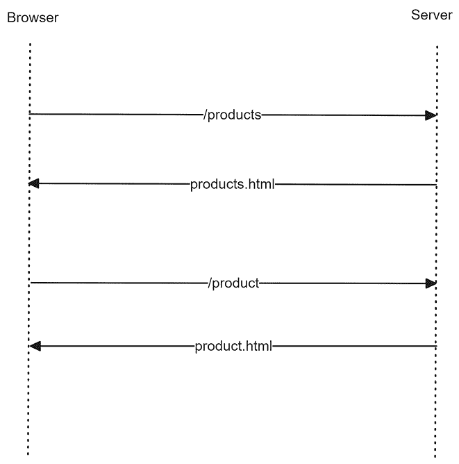
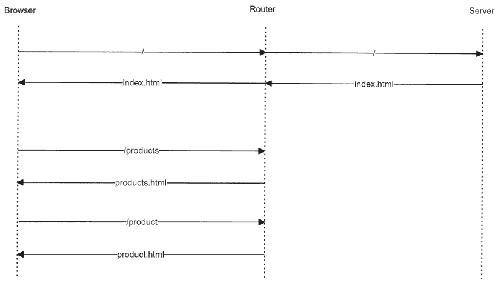
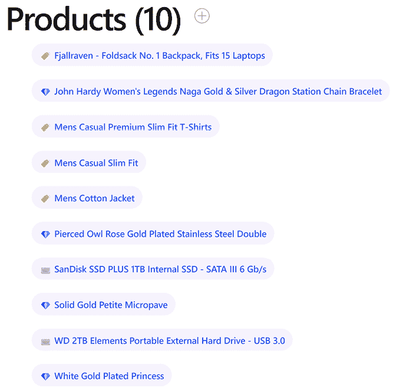
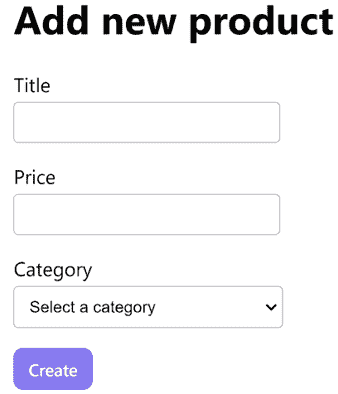
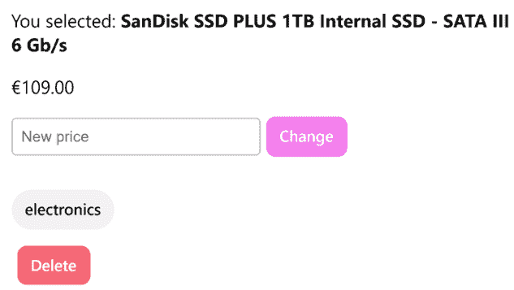
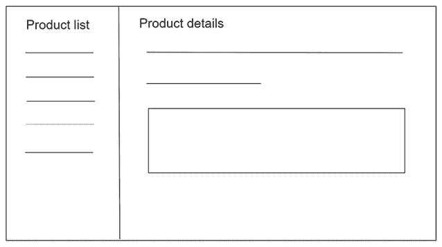
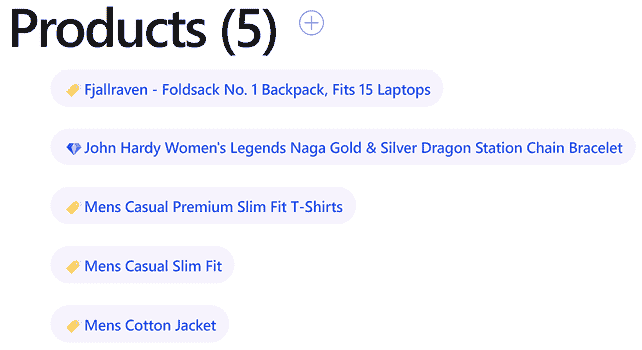
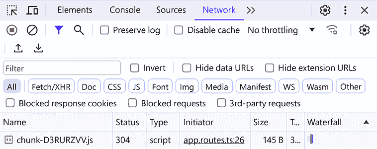

# 第九章：使用路由在应用程序中导航

在前面的章节中，我们很好地分离了关注点，并为 Angular 应用程序添加了不同的抽象层，以增加其可维护性。然而，我们几乎没有关注应用程序的用户体验（UX）。

我们的用户界面过于臃肿，组件散布在单个屏幕上。我们必须为用户提供更好的导航体验，以及一种直观地更改应用程序视图的逻辑方式。现在是时候引入路由并将不同兴趣区域分割成页面，通过链接和 URL 网格连接起来。

那么，我们如何在 Angular 应用程序的组件之间部署导航方案呢？我们使用 Angular 路由器并为我们的组件创建自定义链接以进行响应。

本章包含以下部分：

+   介绍 Angular 路由器

+   配置主要路由

+   组织应用程序路由

+   向路由传递参数

+   使用高级功能增强导航

# 技术要求

本章包含各种代码示例，以指导您了解 Angular 框架中的路由。您可以在以下 GitHub 仓库的 `ch09` 文件夹中找到相关源代码：

[`www.github.com/PacktPublishing/Learning-Angular-Fifth-Edition`](https://www.github.com/PacktPublishing/Learning-Angular-Fifth-Edition )

# 介绍 Angular 路由器

在传统的 Web 应用程序中，当我们想要从一个视图切换到另一个视图时，我们需要从服务器请求一个新的页面。浏览器会为视图创建一个 URL 并将其发送到服务器。然后，浏览器会在客户端收到响应后立即重新加载页面。这是一个导致往返时间延迟并给我们的应用程序带来糟糕用户体验的过程：



图 9.1：传统 Web 应用程序中的路由

使用 Angular 等 JavaScript 框架的现代 Web 应用程序采用不同的方法。它们在客户端处理视图或组件之间的变化，而不打扰服务器。它们在启动时仅与服务器联系一次以获取主 HTML 文件。客户端的路由器拦截并处理任何随后的 URL 变化。这些应用程序被称为 **单页应用程序（SPA**），因为它们不会导致页面完全重新加载：



图 9.2：SPA 架构

Angular 框架提供了 `@angular/router` npm 包，我们可以使用它来在 Angular 应用程序的不同组件之间进行导航。

在 Angular 应用程序中添加路由涉及以下步骤：

1.  指定 Angular 应用程序的基本路径

1.  使用 `@angular/router` npm 包中的适当指令或服务

1.  配置 Angular 应用程序的不同路由

1.  决定在导航时渲染组件的位置

在以下章节中，我们将在深入了解实际示例之前学习 Angular 路由的基础知识。

## 指定基本路径

正如我们已经看到的，当应用程序内的 URL 发生变化时，现代和传统 Web 应用程序的反应不同。每个浏览器的架构在这个行为中起着至关重要的作用。旧浏览器在 URL 发生变化时向服务器发起新的请求。现代浏览器，也称为 **evergreen** 浏览器，可以在不向服务器发送请求的情况下，通过使用称为 **pushState** 的技术在不同视图中导航时更改 URL 和浏览器历史记录。

HTML5 pushState 允许在应用程序内导航而不会导致页面完全重新加载，并且所有现代浏览器都支持。

Angular 应用程序必须在 `index.html` 文件中设置 `<base>` HTML 标签以启用 pushState 路由：

```js
<!doctype html>
<html lang="en">
<head>
  <meta charset="utf-8">
  <title>MyApp</title>
  **<base href="/">**
  <meta name="viewport" content="width=device-width, initial-scale=1">
  <link rel="icon" type="image/x-icon" href="favicon.ico">
</head>
<body>
  <app-root></app-root>
</body>
</html> 
```

`href` 属性通知浏览器在加载应用程序资源时应遵循的路径。Angular CLI 在创建新应用程序时会自动添加此标签，并将 `href` 值设置为应用程序根目录，`/`。如果你的应用程序位于根目录之外的文件夹中，你应该将其命名为该文件夹的名称。

## 在 Angular 应用程序中启用路由

新的 Angular 应用程序默认启用 Angular 路由器，如 `app.config.ts` 文件中的 `provideRouter` 方法所示：

```js
import { ApplicationConfig, provideZoneChangeDetection } from '@angular/core';
**import { provideRouter } from '@angular/router';**
**import { routes } from './app.routes';**
export const appConfig: ApplicationConfig = {
  providers: [
    provideZoneChangeDetection({ eventCoalescing: true }),
    **provideRouter(routes)**
  ]
}; 
```

在使用较旧版本的 Angular 框架构建的应用程序中，通过在主应用程序模块中导入 `RouterModule` 类并使用其 `forRoot` 方法来定义路由配置来启用路由器。

`provideRouter` 方法使我们能够使用与路由相关的 Angular 艺术品集：

+   执行常见路由任务（如导航）的服务

+   我们可以在组件中使用以丰富其导航逻辑的指令

它接受一个参数，即应用程序的路由配置，默认情况下在 `app.routes.ts` 文件中定义。

## 配置路由器

`app.routes.ts` 文件包含一个 `Routes` 对象列表，指定应用程序中存在哪些路由以及哪些组件应该对特定路由做出响应。它看起来如下所示：

```js
const routes: Routes = [ 
  { path: 'products', component: ProductListComponent }, 
  { path: '**', component: PageNotFoundComponent } 
]; 
```

在使用较旧版本的 Angular 框架构建的应用程序中，你可能注意到路由配置是在专门的 `app-routing.module.ts` 文件中定义的。

每个路由定义对象包含一个 `path` 属性，它是路由的 URL 路径，以及一个 `component` 属性，它定义了当应用程序导航到该路径时将加载哪个组件。

`path` 属性的值不应包含前导 `/`。

在 Angular 应用程序中的导航可以通过手动更改浏览器 URL 或使用应用程序内的链接进行。在第一种情况下，浏览器将导致应用程序重新加载，而在第二种情况下，它将指示路由器在运行时进行导航。在我们的案例中，当浏览器 URL 包含`products`路径时，路由器将在页面上渲染产品列表组件。相反，当应用程序通过代码导航到`products`时，路由器遵循相同的程序并更新浏览器 URL。

如果用户尝试导航到不匹配任何路由的 URL，Angular 将激活一种自定义类型的路由，称为**通配符**或**后备**路由。通配符路由的`path`属性有两个星号，匹配任何 URL。此组件的属性通常是特定于应用程序的`PageNotFoundComponent`或应用程序的主要组件。

## 组件渲染

主应用程序组件的模板包含`<router-outlet>`元素，这是 Angular 路由器的主要指令之一。它位于`app.component.html`文件中，用作通过路由激活的组件的占位符。这些组件作为`<router-outlet>`元素的兄弟元素进行渲染。

我们已经介绍了基础知识并提供了最小化的路由设置。在下一节中，我们将查看一个更实际的示例并扩展我们对路由的知识。

# 配置主路由

当我们开始设计具有路由的 Angular 应用程序的架构时，最容易想到的是其主要功能，例如用户可以点击以访问的菜单链接。产品和购物车是我们目前正在构建的电子商务应用程序的基本功能。添加链接并将它们配置为激活 Angular 应用程序的特定功能是应用程序路由配置的一部分。

您需要我们创建在*第八章*，*通过 HTTP 与数据服务通信*中创建的 Angular 应用程序的源代码，以便跟随本章的其余部分。在您获取代码后，我们建议您为简化起见采取以下行动：

+   删除`auth.interceptor.ts`及其单元测试文件。在 Fake Store API 的实际调用中不需要身份验证。

+   修改`app.config.ts`文件，以便`provideHttpClient`方法不使用拦截器。

要设置我们应用程序的路由配置，我们需要遵循以下步骤：

1.  运行以下命令以创建一个新的 Angular 组件用于购物车：

    ```js
    ng generate component cart 
    ```

1.  打开`app.routes.ts`文件并添加以下`import`语句：

    ```js
    import { CartComponent } from './cart/cart.component';
    import { ProductListComponent } from './product-list/product-list.component'; 
    ```

1.  在`routes`变量中添加两个路由定义对象：

    ```js
    export const routes: Routes = [
      **{ path: 'products', component: ProductListComponent },**
      **{ path: 'cart', component: CartComponent }**
    ]; 
    ```

在前面的代码片段中，`products`路由将激活`ProductListComponent`，而`cart`路由将激活`CartComponent`。

1.  打开`app.component.html`文件，并按照以下方式修改`<header>` HTML 元素：

    ```js
    <header>
      <h2>{{ settings.title }}</h2>
      <span class="spacer"></span>
      <div class="menu-links">
        <a routerLink="/products">Products</a>
        <a routerLink="/cart">My Cart</a>
      </div>
      <app-auth></app-auth>
    </header> 
    ```

在前面的模板中，我们应用了 `routerLink` 指令到锚点 HTML 元素，并分配我们想要导航的路由路径。请注意，路径应该以 `/` 开头，而不是路由定义对象中的 `path` 属性。

路径如何开始取决于我们是否想在应用程序中使用绝对路由或相对路由，我们将在本章后面学习。

1.  将 `<router-outlet>` HTML 元素移动到具有 `content` 类选择器的 `<div>` 元素内部，并删除 `<app-product-list>` 组件：

    ```js
    <main class="main">
      <div class="content">
        <router-outlet />
      </div>
    </main> 
    ```

1.  打开 `app.component.ts` 文件，删除对 `ProductListComponent` 类的任何引用，并导入 `RouterLink` 类：

    ```js
    import { Component, inject } from '@angular/core';
    import { **RouterLink**, RouterOutlet } from '@angular/router';
    import { CopyrightDirective } from './copyright.directive';
    import { APP_SETTINGS } from './app.settings';
    import { AuthComponent } from './auth/auth.component';
    @Component({
      selector: 'app-root',
      imports: [
        RouterOutlet,
        **RouterLink**,
        CopyrightDirective,
        AuthComponent
      ],
      templateUrl: './app.component.html',
      styleUrl: './app.component.css'
    }) 
    ```

1.  打开 `app.component.css` 文件，并用以下样式替换与 `.social-links` 选择器相关的所有 CSS 样式：

    ```js
    header {
      display: flex;
      flex-direction: row;
      gap: 0.73rem;
      justify-content: end;
      margin-top: 1.5rem;
    }
    .menu-links {
      display: flex;
      align-items: center;
      gap: 0.73rem;
    }
    .menu-links a {
      transition: fill 0.3s ease;
      color: var(--gray-400);
    }
    .menu-links a:hover {
      color: var(--gray-900);
    } 
    ```

1.  最后，打开全局的 `styles.css` 文件，并添加以下 CSS 样式：

    ```js
    a {
      text-decoration: none;
    }
    .spacer {
      flex: 1 1 auto;
    } 
    ```

我们现在可以预览我们的 Angular 应用程序了：

1.  运行 `ng serve` 命令并导航到 `http://localhost:4200`。最初，应用程序页面仅显示应用程序标题和版权信息。

1.  点击 **Products** 链接。应用程序应该显示产品列表，并更新浏览器 URL 以匹配 `/products` 路径。

1.  现在导航到根路径 `http://localhost:4200`，并在浏览器 URL 的末尾追加 `/cart` 路径。应用程序应该用购物车组件替换产品列表视图：

**购物车功能正常！**

Angular 中的路由是双向的。它使我们能够使用应用程序内的链接或浏览器地址栏导航到 Angular 组件。

恭喜！您的 Angular 应用程序现在支持应用程序内导航。

我们对 Angular 路由的探索还只是触及了皮毛。在接下来的章节中，我们将有许多特性要研究。现在，让我们尝试将我们的组件拆分成更多路由，以便我们能够轻松管理。

# 组织应用程序路由

我们的应用程序显示产品列表以及产品详情和产品创建组件。我们需要组织路由配置，以便不同的路由激活每个组件。

在本节中，我们将为产品创建组件添加一个新的路由。在后面的 *向路由传递参数* 部分，我们将为产品详情组件添加一个单独的路由。

让我们开始创建产品组件：

1.  打开 `app.routes.ts` 文件，并添加以下 `import` 语句：

    ```js
    import { ProductCreateComponent } from './product-create/product-create.component'; 
    ```

1.  在 `routes` 变量中添加以下路由定义对象：

    ```js
    { path: 'products/new', component: ProductCreateComponent } 
    ```

1.  打开 `product-list.component.ts` 文件，并删除对 `ProductCreateComponent` 类的任何引用。

1.  打开 `product-list.component.html` 文件，并删除 `<app-product-create>` 元素。

1.  运行 `ng serve` 命令以启动应用程序，点击 **Products** 链接，并验证产品创建表单没有显示。

目前，产品创建组件只能通过浏览器 URL 访问，我们无法通过应用程序 UI 访问它。在下一节中，我们将学习如何完成这项任务并强制导航到路由。

## 强制导航到路由

产品创建组件只能通过在浏览器地址栏中输入地址`http://localhost:4200/products/new`来激活。让我们在产品列表中添加一个按钮，以便我们也可以从 UI 导航：

1.  打开`product-list.component.html`文件并修改第二个`@if`块如下：

下面的`<path>`元素可能难以手动输入。或者，您可以在书的 GitHub 仓库中的`ch09`文件夹中找到代码并从那里复制。

```js
@if (products) {
  **<div class="caption">**
    **<h1>Products ({{products.length}})</h1>**
    **<a routerLink="new">**
      **<svg**
        **width="24"**
        **height="24"**

        **fill-rule="evenodd"**
        **clip-rule="evenodd">**
        **<path d="M11.5 0c6.347 0 11.5 5.153 11.5 11.5s-5.153 11.5-11.5 11.5-11.5-5.153-11.5-11.5 5.153-11.5 11.5-11.5zm0 1c5.795 0 10.5 4.705 10.5 10.5s-4.705 10.5-10.5 10.5-10.5-4.705-10.5-10.5 4.705-10.5 10.5-10.5zm.5 10h6v1h-6v6h-1v-6h-6v-1h6v-6h1v6z"/>**
      **</svg>**
    **</a>**
  **</div>**
} 
```

在前面的代码片段中，我们添加了一个锚点元素，它将带我们导航到产品创建组件，如`routerLink`指令的值所示。

`routerLink`指令的值是`new`，而不是像人们预期的那样是`/products/new`。前面的行为是因为按钮位于产品列表组件中，该组件已经被路由的`products`部分激活。

Angular 路由器可以通过所有激活的路由来合成目标路由，但如果您不想从根开始，可以在路由前添加一个`/`。

1.  打开`product-list.component.css`文件并添加以下 CSS 样式：

    ```js
    .caption {
      display: flex;
      align-items: center;
      gap: 1.25rem;
    }
    path {
      transition: fill 0.3s ease;
      fill: var(--gray-400);
    }
    a:hover svg path {
      fill: var(--gray-900);
    } 
    ```

1.  打开`product-list.component.ts`文件并添加以下`import`语句：

    ```js
    import { RouterLink } from '@angular/router'; 
    ```

1.  在`@Component`装饰器的`imports`数组中添加`RouterLink`类：

    ```js
    @Component({
      selector: 'app-product-list',
      imports: [
        ProductDetailComponent,
        SortPipe,
        AsyncPipe,
        **RouterLink**
      ],
      templateUrl: './product-list.component.html',
      styleUrl: './product-list.component.css'
    }) 
    ```

1.  打开`product-create.component.css`文件并添加以下 CSS 样式：

    ```js
    :host {
      width: 400px;
    } 
    ```

在前面的样式中，`:host`选择器针对产品创建组件的主元素。

1.  运行`ng serve`命令以启动应用程序并导航到`http://localhost:4200/products`：



图 9.3：产品列表

1.  点击带有加号的按钮。应用程序将您重定向到`/products/new`路由并激活产品创建组件：



图 9.4：产品创建表单

尽管产品创建组件仍然可用，但我们的更改在应用程序的 UX 中引入了一个缺陷。当创建新产品时，用户没有视觉指示，因为产品列表属于不同的路由。我们必须修改**创建**按钮的逻辑，以便在成功创建产品后将其重定向到产品列表：

1.  打开`product-create.component.ts`文件并添加以下`import`语句：

    ```js
    import { Router } from '@angular/router'; 
    ```

1.  在`ProductCreateComponent`类的`constructor`中注入`Router`服务：

    ```js
    constructor(private productsService: ProductsService, **private router: Router**) {} 
    ```

1.  按照以下方式修改`createProduct`方法：

    ```js
    createProduct(title: string, price: string, category: string) {
      this.productsService.addProduct({
        title,
        price: Number(price),
        category
      }).subscribe(**() => this.router.navigate(['/products'])**);
    } 
    ```

在前面的方法中，我们调用 `Router` 服务的 `navigate` 方法来导航到应用程序的 `/products` 路径。

我们使用 `/` 字符是因为我们默认使用绝对路由。

它接受一个包含我们想要导航的目的地路由路径的**链接参数数组**。

1.  打开 `products.service.ts` 文件，并修改 `getProducts` 方法，使其在没有本地产品数据时使用 Fake Store API：

    ```js
    getProducts(): Observable<Product[]> {
      **if (this.products.length === 0) {**
        const options = new HttpParams().set('limit', 10);
        return this.http.get<Product[]>(this.productsUrl, {
          params: options
        }).pipe(map(products => {
          this.products = products;
          return products;
        }));
      **}**
      **return of(this.products);**
    } 
    ```

如果我们不进行前面的更改，产品列表组件将始终从 Fake Store API 返回数据。

我们的应用程序现在在用户创建新产品时将用户重定向到产品列表，以便他们可以在列表中看到它。

到目前为止，我们已经配置了应用程序的路由，以便根据给定的路径激活组件。然而，在我们的应用程序中，以下情况下不会显示任何组件：

+   当我们导航到应用程序的根路径时

+   当我们尝试导航到一个不存在的路由时

在下一节中，我们将学习如何使用 Angular 路由器提供的内置路由路径，并改进应用程序的用户体验。

## 使用内置路由路径

当我们想要定义一个在导航到根路径时将被加载的组件时，我们创建一个路由定义对象，并将 `path` 属性设置为空字符串。具有空字符串 `path` 的路由称为 Angular 应用程序的**默认路由**。

在我们的案例中，我们希望默认路由显示产品列表组件。打开 `app.routes.ts` 文件，并在 `routes` 变量的末尾添加以下路由：

```js
{ path: '', redirectTo: 'products', pathMatch: 'full' } 
```

在前面的代码片段中，我们告诉路由器当应用程序导航到默认路由时重定向到 `products` 路径。`pathMatch` 属性告诉路由器如何将 URL 匹配到根路径属性。在这种情况下，只有当 URL 匹配根路径（即空字符串）时，路由器才会重定向到 `products` 路径。

如果我们运行应用程序，我们会注意到当浏览器 URL 指向我们的应用程序根路径时，我们会重定向到 `products` 路径，并且产品列表会显示在屏幕上。

我们在所有其他路由之后添加了默认路由，因为路由的顺序很重要。路由器采用“首次匹配即赢”的策略选择路由。更具体的路由应该定义在不太具体的路由之前。

我们在“介绍 Angular 路由器”部分遇到了未知路由的概念。我们简要地看到了如何设置一个**通配符**路由，当我们的应用程序尝试导航到一个不存在的路由时，显示 `PageNotFoundComponent`。在实际应用中，创建这样的组件很常见，尤其是如果你想向用户显示额外的信息，比如他们可以采取的下一步行动。在我们的案例中，这比较简单，我们将重定向到 `products` 路由。

打开 `app.routes.ts` 文件，并在 `routes` 变量的末尾添加以下路由：

```js
{ path: '**', redirectTo: 'products' } 
```

通配符路由必须是路由列表中的最后一个条目，因为应用程序只有在没有匹配的路由时才应该到达它。

如果我们使用`ng serve`命令运行我们的应用程序并导航到一个未知路径，我们的应用程序将显示产品列表。

到目前为止，我们一直依赖于浏览器地址栏来指示在任何给定时间哪个路由是激活的。正如我们将在下一节中学习的，我们可以使用 CSS 样式来改进用户体验。

## 路由链接样式

应用程序标题包含**产品**和**我的购物车**链接。当我们导航到每个链接时，不清楚哪个路由已被激活。Angular 路由器导出了`routerLinkActive`指令，我们可以用它来改变当对应路由激活时链接的样式。它的工作方式与我们在*第三章*中学习的类绑定类似，*使用组件结构化用户界面*。它接受一个类名列表或一个当链接激活时添加并当它变为非激活时移除的类。

让我们看看如何在我们的应用程序中使用它：

1.  打开`app.component.css`文件并添加以下 CSS 样式：

    ```js
    .menu-links a.active {
      color: var(--electric-violet);
    } 
    ```

1.  打开`app.component.ts`文件并从`@angular/router` npm 包中导入`RouterLinkActive`类：

    ```js
    import { RouterLink, **RouterLinkActive**, RouterOutlet } from '@angular/router'; 
    ```

1.  在`@Component`装饰器的`imports`数组中添加`RouterLinkActive`类：

    ```js
    @Component({
      selector: 'app-root',
      imports: [
        RouterOutlet,
        RouterLink,
        **RouterLinkActive**,
        CopyrightDirective,
        AuthComponent
      ],
      templateUrl: './app.component.html',
      styleUrl: './app.component.css'
    }) 
    ```

1.  打开`app.component.html`文件并将`routerLinkActive`指令添加到两个链接中：

    ```js
    <div class="menu-links">
      <a routerLink="/products" **routerLinkActive="active"**>Products</a>
      <a routerLink="/cart" **routerLinkActive="active"**>My Cart</a>
    </div> 
    ```

现在，当我们点击标题中的应用程序链接时，其颜色会改变以表示链接是激活的。

我们已经学习了如何使用路由和激活不需要任何参数的组件。然而，产品详情组件接受产品 ID 作为参数。在下一节中，我们将学习如何使用动态路由参数激活组件。

# 向路由传递参数

企业级 Web 应用中常见的场景是有一个项目列表，当你点击其中一个时，页面会改变当前视图并显示所选项目的详细信息。之前的方法类似于主从浏览功能，其中主页面上的每个生成的 URL 都包含在详情页上加载每个项目所需的标识符。

我们可以用两个路由来表示之前的场景，一个路由导航到不同的组件。一个组件是项目列表，另一个是项目详情。因此，我们需要找到一种方法从一条路由创建和传递动态的项目特定数据到另一条路由。

我们在这里面临双重挑战：在运行时创建带有动态参数的 URL 以及解析这些参数的值。没问题：Angular 路由器支持我们，我们将通过一个真实示例来了解这一点。

## 使用路由参数构建详情页

在我们的应用程序中，产品列表当前显示产品列表。当我们点击产品时，产品详情会显示在列表下方。我们需要重构之前的流程，以便负责显示产品详情的组件在列表的不同页面上渲染。我们将使用 Angular 路由在从列表中点击产品时将用户重定向到新页面。

产品列表组件当前通过输入绑定传递所选产品 ID。我们将使用 Angular 路由将产品 ID 作为路由参数传递：

1.  打开 `app.routes.ts` 文件并添加以下 `import` 语句：

    ```js
    import { ProductDetailComponent } from './product-detail/product-detail.component'; 
    ```

1.  在 `routes` 变量中 `products/new` 路由之后添加以下路由定义：

    ```js
    { path: 'products/:id', component: ProductDetailComponent } 
    ```

冒号字符表示在新的路由定义对象中将 `id` 作为路由参数。如果一个路由有多个参数，我们用 `/` 分隔它们。正如我们稍后将要学习的，当我们在组件中消费其值时，参数名称很重要。

1.  打开 `product-list.component.html` 文件并为产品标题添加一个锚点元素，使其使用新的路由定义：

    ```js
    <ul class="pill-group">
      @for (product of products | sort; track product.id) {
        <li class="pill" (click)="selectedProduct = product">
          @switch (product.category) {
            @case ('electronics') {  }
            @case ('jewelery') {  }
            @default {  }
          }
          **<a [routerLink]="[product.id]">{{product.title}}</a>**
        </li>
      } @empty {
        <p>No products found!</p>
      }
    </ul> 
    ```

在前面的代码片段中，`routerLink` 指令使用属性绑定来设置其值在链接参数数组中。我们将产品模板引用变量的 `id` 作为参数传递到数组中。

我们不需要在链接参数数组的值前加 `/products` 前缀，因为该路由已经激活了产品列表。

1.  移除 `<app-product-detail>` 组件和 `<li>` 标签上的 `click` 事件绑定。

我们可以重构 `product-list.component.ts` 文件，并移除任何使用 `selectedProduct` 属性和 `ProductDetailComponent` 类的代码。产品列表不需要在本地状态中保留所选产品，因为我们选择产品后会离开列表。

我们现在可以通过修改产品详情组件来使其与路由一起工作：

1.  打开 `product-detail.component.css` 文件，添加一个 CSS 样式来设置宿主元素的宽度：

    ```js
    :host {
      width: 450px;
    } 
    ```

1.  打开 `product-detail.component.ts` 文件，并按如下方式修改 `import` 语句：

    ```js
    import { CommonModule } from '@angular/common';
    import { Component, input, OnInit } from '@angular/core';
    import { ActivatedRoute, Router } from '@angular/router';
    import { Product } from '../product';
    import { Observable, switchMap } from 'rxjs';
    import { ProductsService } from '../products.service';
    import { AuthService } from '../auth.service'; 
    ```

Angular 路由导出 `ActivatedRoute` 服务，我们可以使用它来检索有关当前激活路由的信息，包括任何参数。

1.  修改 `constructor` 组件以注入 `ActivatedRoute` 和 `Router` 服务：

    ```js
    constructor(
      private productService: ProductsService,
      public authService: AuthService,
      **private route: ActivatedRoute,**
      **private router: Router**
    ) { } 
    ```

1.  修改 `ProductDetailComponent` 类实现的接口列表：

    ```js
    export class ProductDetailComponent implements OnInit 
    ```

1.  创建以下 `ngOnInit` 方法：

    ```js
    ngOnInit(): void {
      this.product$ = this.route.paramMap.pipe(
        switchMap(params => {
          return this.productService.getProduct(Number(params.get('id')));
        })
      );
    } 
    ```

`ActivatedRoute` 服务包含 `paramMap` 可观察对象，我们可以使用它来订阅并获取路由参数值。当我们需要从一个可观察对象中获取值、完成它并将值传递给另一个可观察对象时，我们使用 `switchMap` RxJS 操作符。在这种情况下，我们使用它将 `paramMap` 可观察对象中的 `id` 参数传递到 `ProductsService` 类的 `getProduct` 方法。

1.  修改 `changePrice` 和 `remove` 方法，以便在每次操作完成后应用程序将重定向到产品列表：

    ```js
    changePrice(product: Product, price: string) {
      this.productService.updateProduct(product.id, Number(price)).subscribe(() => {
        **this.router.navigate(['/products']);**
      **}**);
    }
    remove(product: Product) {
      this.productService.deleteProduct(product.id).subscribe(**() => {**
    **this.router.navigate(['/products']);**
    **}**);
    } 
    ```

1.  移除 `ngOnChanges` 方法，因为组件及其绑定每次激活路由时都会初始化。

1.  移除输出事件发射器，因为产品列表组件不再是父组件。保留 `id` 输入属性不变，因为我们将在本章后面使用它。

1.  目前将 `addToCart` 方法留空。我们将在第十章 *使用表单收集用户数据* 中使用它。

还值得注意的是：

1.  `paramMap` 可观察者返回一个 `ParamMap` 类型的对象。我们可以使用 `ParamMap` 对象的 `get` 方法来传递我们在路由配置中定义的参数名称，并访问其值。

1.  我们将 `id` 参数的值转换为数字，因为路由参数值始终是字符串。

如果我们使用 `ng serve` 命令运行应用程序并从列表中点击一个产品，应用程序将导航到产品详情组件：



图 9.5：产品详情页面

如果你刷新浏览器，应用程序将不会显示产品，因为 `ProductsService` 类的 `getProduct` 方法只与产品数据的缓存版本一起工作。你必须再次转到产品列表并选择一个产品，因为本地缓存已被重置。请注意，这种行为基于电子商务应用程序的当前实现，并不依赖于 Angular 路由器架构。

在前面的例子中，我们使用了 `paramMap` 属性来获取路由参数作为可观察者。因此，理想情况下，我们的组件可以在其生命周期内通知新值。但是，每次我们想要从列表中选择不同的产品时，组件和 `paramMap` 可观察者的订阅都会被销毁。

或者，我们可以在组件在连续导航中保持渲染在屏幕上时立即重用组件的实例，从而避免使用可观察者。我们可以通过使用子路由来实现这种行为，正如我们将在下一节中学习的。

## 使用子路由重用组件

当我们想要一个提供其他组件路由的着陆页组件时，子路由是一个完美的解决方案。该组件应包含一个 `<router-outlet>` 元素，其中将加载子路由。

假设我们想定义我们的 Angular 应用程序的布局如下：



图 9.6：主-详细布局

上一图中的场景要求产品列表组件包含一个 `<router-outlet>` 元素，以便在激活相关路由时渲染产品详情组件。

产品详情组件将在产品列表组件的`<router-outlet>`中渲染，而不是在主应用程序组件的`<router-outlet>`中。

当我们从一种产品导航到另一种产品时，产品详情组件不会被销毁。相反，它保持在 DOM 树中，并且它的`ngOnInit`方法只在第一次选择产品时被调用。当我们从列表中选择新产品时，`paramMap`可观察对象会发出新产品的`id`。新产品使用`ProductsService`类获取，组件模板被刷新以反映新的变化。

应用程序的路线配置，在这种情况下，如下所示：

```js
export const routes: Routes = [
  **{**
    **path: 'products',**
    **component: ProductListComponent,**
    **children: [**
      **{ path: 'new', component: ProductCreateComponent },**
      **{ path: ':id', component: ProductDetailComponent },**
    **]**
  **}**,
  { path: 'cart', component: CartComponent },
  { path: '', redirectTo: 'products', pathMatch: 'full' },
  { path: '**', redirectTo: 'products' }
]; 
```

在前面的代码片段中，我们使用路由定义对象的`children`属性来定义包含路由定义对象列表的子路由。

注意，我们还从子路由的`path`属性中移除了单词`products`，因为父路由会附加它。

父路由也可以通过使用路由定义对象的`providers`属性为其子路由提供服务。在路由中提供服务在我们想要限制对路由配置子集的访问时非常有用。如果我们只想将`ProductsService`类限制在产品相关组件中，我们应该做以下操作：

```js
{
  path: 'products',
  component: ProductListComponent,
  children: [
    { path: 'new', component: ProductCreateComponent },
    { path: ':id', component: ProductDetailComponent },
  ],
  **providers: [ProductsService]**
} 
```

当在路由定义对象中提供服务时，Angular 会创建一个独立的注入器，它是根注入器的直接子节点。假设该服务也在根注入器中提供，并且假设购物车组件使用它。在这种情况下，由产品相关组件之一创建的实例将与购物车组件的实例不同。

我们已经学习了如何在 Angular 路由中使用`paramMap`可观察对象。在下一节中，我们将讨论使用快照的替代方法。

## 拍摄路由参数快照

当我们从列表中选择产品时，产品列表组件会被从 DOM 树中移除，产品详情组件被添加。要选择不同的产品，我们需要点击**产品**链接或浏览器的后退按钮。因此，产品详情组件在 DOM 中被产品列表组件替换。所以，我们处于在任何时候屏幕上只显示一个组件的情况。

当产品详情组件被销毁时，它的`ngOnInit`方法和对`paramMap`可观察对象的订阅也会被销毁。因此，我们在此点使用可观察对象没有好处。作为替代，我们可以使用`ActivatedRoute`服务的`snapshot`属性来获取路由参数的值，如下所示：

```js
ngOnInit(): void {
  const id = this.route.snapshot.params['id'];
  this.product$ = this.productService.getProduct(id);
} 
```

`snapshot`属性表示路由参数的当前值，这恰好也是初始值。它包含`params`属性，这是一个我们可以访问的路由参数键值对的对象。

如果你确定你的组件不会被重用，请使用快照方法。

到目前为止，我们已经处理了以 `products/:id` 形式的路由参数。我们使用这些参数导航到需要该参数的组件。在我们的例子中，产品详情组件需要 `id` 参数来获取特定产品的详细信息。然而，当我们需要它为可选时，还有另一种类型的路由参数，我们将在下一节中学习。

## 使用查询参数过滤数据

在 *第八章* ，*通过 HTTP 与数据服务通信* 中，我们学习了如何使用 `HttpParams` 类将查询参数传递给请求。Angular 路由也支持通过应用程序的 URL 传递查询参数。

`products.service.ts` 文件中的 `getProducts` 方法使用 HTTP 查询参数来限制从 Fake Store API 返回的产品结果：

```js
getProducts(): Observable<Product[]> {
  if (this.products.length === 0) {
    const options = new HttpParams().set('limit', 10);
    return this.http.get<Product[]>(this.productsUrl, {
      params: options
    }).pipe(map(products => {
      this.products = products;
      return products;
    }));
  }
  return of(this.products);
} 
```

它使用硬编码的值来设置 `limit` 查询参数。我们将修改应用程序，使产品列表组件动态传递 `limit` 值：

1.  打开 `products.service.ts` 文件并修改 `getProducts` 方法，使 `limit` 作为参数传递：

    ```js
    getProducts(**limit?: number**): Observable<Product[]> {
      if (this.products.length === 0) {
        const options = new HttpParams().set('limit', **limit ||** 10);
        return this.http.get<Product[]>(this.productsUrl, {
          params: options
        }).pipe(map(products => {
          this.products = products;
          return products;
        }));
      }
      return of(this.products);
    } 
    ```

在前面的方法中，如果 `limit` 值为 **假值**，我们将默认值 `10` 传递给查询参数。

在布尔上下文中，假值评估为 `False`，可以是 `null`、`undefined`、`0` 或 `False`。您可以在 [`developer.mozilla.org/docs/Glossary/Falsy`](https://developer.mozilla.org/docs/Glossary/Falsy) 上了解更多信息。

1.  打开 `product-list.component.ts` 文件并导入 `ActivatedRoute` 服务和 `switchMap` RxJS 操作符：

    ```js
    import { RouterLink, **ActivatedRoute** } from '@angular/router';
    import { Observable, **switchMap** } from 'rxjs'; 
    ```

1.  在 `ProductListComponent` 类的 `constructor` 中注入 `ActivatedRoute` 服务：

    ```js
    constructor(private productService: ProductsService, **private route: ActivatedRoute**) {} 
    ```

1.  `ActivatedRoute` 服务包含一个 `queryParamMap` 可观察对象，我们可以订阅它以获取查询参数值。它返回一个 `ParamMap` 对象，类似于我们之前看到的 `paramMap` 可观察对象，我们可以查询它以获取参数值。修改 `getProducts` 方法以使用 `queryParamMap` 可观察对象：

    ```js
    private getProducts() {
      this.products$ = **this.route.queryParamMap.pipe(**
        **switchMap(params => {**
          **return this.productService.getProducts(Number(params.get('limit')));**
        **})**
      **);**
    } 
    ```

在前面的代码片段中，我们使用 `switchMap` RxJS 操作符将 `limit` 参数从 `queryParamMap` 可观察对象管道到 `ProductsService` 类的 `getProducts` 方法作为数字。

1.  运行 `ng serve` 命令以启动应用程序并导航到 `http://localhost:4200?limit=5` 。你应该看到 5 个产品的列表：



图 9.7：过滤后的产品列表

尝试对 `limit` 参数的不同值进行实验，并观察输出。

路由中的查询参数功能强大，可用于各种用例，例如过滤和排序数据。它们也可以在与基于快照的路由一起工作时使用。

在下一节中，我们将探索一种新的创新方法，使用组件输入属性传递路由参数。

## 将输入属性绑定到路由

我们已经在 *第三章* 中学习了，*使用组件构建用户界面*，我们使用输入和输出绑定在组件之间进行交互。输入绑定还可以在导航到组件时传递路由参数。我们将通过产品详情组件的示例来了解：

1.  默认情况下，Angular 路由器没有启用带有路由参数的输入绑定。我们必须从应用程序配置文件中激活它。打开 `app.config.ts` 文件，并从 `@angular/router` npm 包中导入 `withComponentInputBinding` 函数：

    ```js
    import { provideRouter, **withComponentInputBinding** } from '@angular/router'; 
    ```

1.  将前面的函数作为 `provideRouter` 方法的第二个参数传递：

    ```js
    provideRouter(routes, **withComponentInputBinding()**), 
    ```

1.  现在，打开 `product-detail.component.ts` 文件，将 `id` 组件属性的类型更改为 `string`：

    ```js
    id = input<**string**>(); 
    ```

我们必须更改属性类型，因为路由参数是以字符串形式传递的。

1.  修改 `ngOnInit` 方法以使用 `id` 参数获取产品：

    ```js
    ngOnInit(): void {
      **this.product$ = this.productService.getProduct(Number(this.id()!));**
    } 
    ```

1.  运行 `ng serve` 命令并验证在从列表中选择产品时是否显示产品详情。

将路由参数绑定到组件输入属性有以下优点：

+   TypeScript 组件类更简单，因为我们没有使用异步调用与可观察对象

+   我们可以使用路由访问与输入和输出绑定一起工作的现有组件

输入绑定与通过路由激活的组件一起工作。如果我们想从另一个组件访问任何路由参数，我们必须使用 `ActivatedRoute` 服务。

现在我们已经学习了在导航期间传递参数的所有不同方式，我们已经涵盖了开始使用路由构建 Angular 应用程序所需的所有基本信息。在以下章节中，我们将关注增强 Angular 应用程序中应用程序导航用户体验的高级实践。

# 使用高级功能增强导航

到目前为止，我们已经介绍了使用路由和查询参数的基本路由。然而，Angular 路由器功能强大，能够做更多的事情，例如以下内容：

+   控制对路由的访问

+   防止从路由导航离开

+   预取数据以改善应用程序 UX

+   懒加载路由以加快响应时间

在以下章节中，我们将更详细地了解所有这些技术。

## 控制路由访问

当我们想要控制对特定路由的访问时，我们使用 **守卫**。要创建守卫，我们使用 Angular CLI 的 `ng generate` 命令，传递 `guard` 和其名称作为参数：

```js
ng generate guard auth 
```

当我们执行前面的命令时，Angular CLI 会询问我们想要创建哪种类型的守卫。根据它们提供的功能，我们可以创建多种类型的守卫：

+   `CanActivate` : 控制是否可以激活路由

+   `CanActivateChild` : 控制子路由是否可以激活

+   `CanDeactivate` : 控制是否可以停用路由

停用发生在我们从路由导航离开时。

+   `CanMatch`：控制是否可以访问任何路由

选择`CanActivate`并按*Enter*。Angular CLI 创建以下`auth.guard.ts`文件：

```js
import { CanActivateFn } from '@angular/router';
export const authGuard: CanActivateFn = (route, state) => {
  return true;
}; 
```

我们创建的守卫是一个`CanActivateFn`类型的函数，它接受两个参数：

+   `route`：指示将要激活的路由

+   `state`：包含成功导航时的路由器状态

`CanActivateFn`函数可以同步或异步地返回一个布尔值。在后一种情况下，路由器将等待可观察对象或承诺解析完成后再继续。如果异步事件没有完成，导航将不会继续。它还可以返回一个`UrlTree`对象，这将导致新的导航到定义的路由。

我们的守卫立即返回`true`，允许自由访问路由。让我们添加自定义逻辑来根据用户是否登录来控制访问：

1.  按照以下方式修改`import`语句：

    ```js
    **import { inject } from '@angular/core';**
    import { CanActivateFn, **Router** } from '@angular/router';
    **import { AuthService } from './auth.service';** 
    ```

1.  将箭头函数的主体替换为以下代码片段：

    ```js
    const authService = inject(AuthService);
    const router = inject(Router);
    if (authService.isLoggedIn()) {
      return true;
    }
    return router.parseUrl('/'); 
    ```

在前面的代码片段中，我们使用`inject`方法将`AuthService`和`Router`服务注入到函数中。然后我们检查`isLoggedIn`信号值的真假。如果它是`true`，我们允许应用程序导航到请求的路由。否则，我们使用`Router`服务的`parseUrl`方法导航到 Angular 应用程序的根路径。

`parseUrl`方法返回一个`UrlTree`对象，它实际上取消了之前的导航并将用户重定向到参数中传入的 URL。建议使用它而不是`navigate`方法，因为`navigate`方法可能会引入意外的行为，并可能导致复杂的导航问题。

1.  打开`app.routes.ts`文件并添加以下`import`语句：

    ```js
    import { authGuard } from './auth.guard'; 
    ```

1.  在`cart`路由的`canActivate`数组中添加`authGuard`函数：

    ```js
    {
      path: 'cart',
      component: CartComponent,
      **canActivate: [authGuard]**
    } 
    ```

`canActivate`属性是一个数组，因为多个守卫可以控制路由激活。数组中守卫的顺序很重要。如果数组中的任何一个守卫未能通过，Angular 将阻止访问该路由。

只有经过身份验证的用户现在才能访问购物车。如果你使用`ng serve`命令运行应用程序并点击**我的购物车**链接，你会注意到没有任何反应。

当你尝试从产品列表访问购物车时，你总是停留在同一页面上。这是因为由于身份验证守卫导致的重定向在你已经在重定向的路由中时没有任何效果。

与路由激活相关的另一种守卫类型是`CanDeactivate`守卫。在下一节中，我们将学习如何使用它来防止用户离开路由。

## 防止从路由导航离开

控制路由是否可以被退出的守卫是一个`CanDeactivateFn`类型的函数。我们将通过实现一个守卫来学习如何使用它，当用户从购物车组件导航离开时，它会通知用户购物车中有待处理的产品：

1.  运行以下命令以生成一个新的守卫：

    ```js
    ng generate guard checkout 
    ```

1.  从列表中选择`CanDeactivate`类型并按*Enter*键。

1.  打开`checkout.guard.ts`文件并添加以下`import`语句：

    ```js
    import { CartComponent } from './cart/cart.component'; 
    ```

1.  将`CanDeactivateFn`的泛型更改为`CartComponent`并移除箭头函数的参数。

在现实世界的场景中，我们可能需要在泛型中添加更多组件来创建一个泛型守卫。

1.  将箭头函数的主体替换为以下代码片段：

    ```js
    const confirmation = confirm(
      'You have pending items in your cart. Do you want to continue?'
    );
    return confirmation; 
    ```

在前面的代码片段中，我们使用全局`window`对象的`confirm`方法在离开购物车组件之前显示一个确认对话框。应用程序执行将等待直到确认对话框被关闭，作为用户交互。

1.  打开`app.routes.ts`文件并添加以下`import`语句：

    ```js
    import { checkoutGuard } from './checkout.guard'; 
    ```

1.  路由定义对象包含一个类似于`canActivate`的`canDeactivate`数组。将`checkoutGuard`函数添加到`cart`路由的`canDeactivate`数组中：

    ```js
    {
      path: 'cart',
      component: CartComponent,
      canActivate: [authGuard],
      **canDeactivate: [checkoutGuard]**
    } 
    ```

`canDeactivate`属性是一个数组，因为多个守卫可以控制路由的停用。数组中守卫的顺序很重要。如果其中一个守卫未能通过，Angular 将阻止用户离开该路由。

对于这样一个简单的场景，我们可以在内联中编写`checkoutGuard`函数的逻辑，以避免创建`checkout.guard.ts`文件：

```js
{
  path: 'cart',
  component: CartComponent,
  canActivate: [authGuard],
  canDeactivate: [**() => confirm('You have pending items in your cart. Do you want to continue?')**]
} 
```

使用`ng serve`命令运行应用程序，并在登录后点击**我的购物车**链接。如果你然后点击**产品**链接或按浏览器的后退按钮，你应该会看到一个包含以下信息的对话框：

**你的购物车中有待处理的项目。你想继续吗？**

如果你点击**取消**按钮，导航将被取消，应用程序将保持当前状态。如果你点击**确定**按钮，你将被重定向到产品列表。

## 预取路由数据

你可能已经注意到，当你第一次导航到应用程序的根路径时，产品列表的显示会有延迟。这是合理的，因为我们正在向后端 API 发出 HTTP 请求。然而，产品列表组件当时已经初始化了。

如果组件在初始化期间与数据交互的逻辑导致这种行为，可能会导致不希望的效果。为了解决这个问题，我们可以使用**解析器**来预取产品列表并在数据可用时加载组件。

在激活路由之前处理可能的错误时，解析器非常有用。如果 API 请求失败，导航到错误页面比显示空白页面更合适。

要创建一个解析器，我们使用 Angular CLI 的`ng generate`命令，传递单词`resolver`及其名称作为参数：

```js
ng generate resolver products 
```

前面的命令创建以下`products.resolver.ts`文件：

```js
import { ResolveFn } from '@angular/router';
export const productsResolver: ResolveFn<boolean> = (route, state) => {
  return true;
}; 
```

我们创建的解析器是一个类型为`ResolveFn`的函数，它接受两个参数：

+   `route`：指示将要激活的路由

+   `state`：包含激活路由的状态

`ResolveFn`函数可以返回一个可观察对象或 promise。路由器将在可观察对象或 promise 解析之前等待，如果异步事件未完成，则导航不会继续。

目前，我们的解析器返回一个布尔值。让我们添加自定义逻辑，使其返回产品数组：

1.  添加以下`import`语句：

    ```js
    import { inject } from '@angular/core';
    import { Product } from './product';
    import { ProductsService } from './products.service'; 
    ```

1.  修改`productsResolver`函数，使其返回产品数组：

    ```js
    export const productsResolver: ResolveFn<**Product[]**> = (route, state) => {
      return **[]**;
    }; 
    ```

1.  使用`inject`方法在函数体中注入`ProductsService`：

    ```js
    const productService = inject(ProductsService); 
    ```

1.  使用`queryParamMap`属性从当前路由获取`limit`参数值：

    ```js
    const limit = Number(route.queryParamMap.get('limit')); 
    ```

1.  将`return`语句替换为以下内容：

    ```js
    return productService.getProducts(limit); 
    ```

1.  生成的函数应如下所示：

    ```js
    export const productsResolver: ResolveFn<Product[]> = (route, state) => {
      const productService = inject(ProductsService);
      const limit = Number(route.queryParamMap.get('limit'));

      return productService.getProducts(limit);
    }; 
    ```

现在我们已经创建了解析器，我们可以将其与产品列表组件连接起来：

1.  打开`app.routes.ts`文件并添加以下`import`语句：

    ```js
    import { productsResolver } from './products.resolver'; 
    ```

1.  将以下`resolve`属性添加到`products`路由：

    ```js
    {
      path: 'products',
      component: ProductListComponent,
      **resolve: {**
        **products: productsResolver**
      **}**
    } 
    ```

`resolve`属性是一个包含唯一名称作为键和解析函数作为值的对象。键名称很重要，因为我们将使用它在我们的组件中访问解析数据。

1.  打开`product-list.component.ts`文件并从`rxjs`npm 包中导入`of`运算符：

    ```js
    import { Observable, switchMap, of } from 'rxjs'; 
    ```

1.  修改`getProducts`方法，使其订阅`ActivatedRoute`服务的`data`属性：

    ```js
    private getProducts() {
      this.products$ = **this.route.data.pipe(**
        **switchMap(data => of(data['products']))**
      **);**
    } 
    ```

在前面的代码片段中，`data`可观察对象发出一个对象，其值存在于`products`键中。请注意，我们使用`switchMap`运算符在新的可观察对象中返回产品。

在这一点上，我们也可以删除对`ProductsService`类的任何引用，因为它不再需要了。

1.  运行`ng serve`命令以启动应用程序并验证在导航到`http://localhost:4200`时是否显示产品列表。

当路由组件中存在复杂的初始化逻辑时，Angular 解析器可以提高应用程序性能。提高应用程序性能的另一种方法是按需加载组件或子路由，我们将在下一节中学习。

## 懒加载应用程序的部分

在某个时候，我们的应用程序可能会增长，我们放入其中的数据量也可能增加。应用程序可能需要很长时间才能启动，或者某些部分可能需要很长时间才能加载。为了克服这些问题，我们可以使用称为**懒加载**的技术。

懒加载意味着我们最初不会加载某些应用程序部分，例如 Angular 组件或路由。在 Angular 应用程序中，懒加载有许多优点：

+   组件和路由可以根据用户请求进行加载

+   访问您应用程序特定区域的用户可以从这项技术中显著受益

+   我们可以在懒加载区域添加更多功能，而不会影响整体应用程序包的大小

要了解 Angular 中的懒加载是如何工作的，我们将创建一个新的组件来显示当前用户的个人资料。

一个好的做法是懒加载那些不常使用的应用程序部分，例如当前登录用户的个人资料。

让我们开始吧：

1.  运行以下命令创建 Angular 组件：

    ```js
    ng generate component user 
    ```

1.  在`src\app`文件夹中创建一个名为`user.routes.ts`的文件，并添加以下内容：

    ```js
    import { UserComponent } from './user/user.component';
    export default [
      { path: '', component: UserComponent }
    ]; 
    ```

在前面的代码片段中，我们将`path`属性设置为空字符串以默认激活路由。我们还使用`default`关键字来利用懒加载中的默认导出功能。

1.  打开`app.routes.ts`文件并在`routes`变量中添加以下路由定义：

    ```js
    { path: 'user', loadChildren: () => import('./user.routes') } 
    ```

路由定义对象的`loadChildren`属性用于懒加载 Angular 路由。它返回一个使用动态`import`语句懒加载路由文件的箭头函数。`import`函数接受我们想要导入的路由文件的相对路径。

1.  在`app.component.html`文件的`<header>`元素中添加一个新的锚点元素，链接到新创建的路由：

    ```js
    <div class="menu-links">
      <a routerLink="/products" routerLinkActive="active">Products</a>
      <a routerLink="/cart" routerLinkActive="active">My Cart</a>
      **<a routerLink="/user" routerLinkActive="active">My Profile</a>**
    </div> 
    ```

1.  运行命令`ng serve`并观察控制台窗口中的输出。它应该类似于以下内容：

    ```js
    Initial chunk files | Names         |  Raw size
    polyfills.js        | polyfills     |  82.71 kB | 
    main.js             | main          |  47.22 kB | 
    styles.css          | styles        |   1.14 kB | 
                        | Initial total | 131.07 kB
    Lazy chunk files    | Names         |  Raw size
    chunk-D3RURZVV.js   | user-routes   |   1.26 kB | 
    Application bundle generation complete. [1.234 seconds] 
    ```

在前面的输出中，我们可以看到 Angular CLI 除了创建了应用的初始块文件外，还创建了一个名为**user-routes**的懒加载块文件。

1.  使用您的浏览器导航到`http://localhost:4200`并打开开发者工具。

1.  点击**我的个人资料**链接并检查**网络**请求标签页：



图 9.8：懒加载路由

应用程序向块文件发起新的请求，这是用户路由的包。Angular 框架为每个懒加载的组件创建一个新的包，并且不将其包含在主应用程序包中。

如果您离开导航并再次点击**我的个人资料**链接，您会注意到应用程序不会发出新的请求来加载包文件。一旦请求懒加载的路由，它就会被保留在内存中，并可用于后续请求。

懒加载不仅适用于路由，也适用于组件。我们可以通过修改`user`路由来懒加载用户组件而不是整个路由，如下所示：

```js
{
  path: 'user',
  loadComponent: () => import('./user/user.component').then(c => c.UserComponent),
} 
```

在前面的代码片段中，我们使用`loadComponent`属性动态导入`user.component.ts`文件。`import`函数返回一个 promise，我们通过`then`方法将其链接以加载`UserComponent`类。

用户路由目前对所有用户都可用，即使未经过身份验证。在下一节中，我们将学习如何使用守卫来保护它们。

### 保护懒加载路由

我们可以像在正常路由上一样控制对懒加载路由的无授权访问。然而，我们的守卫需要支持一个名为`CanMatchFn`的函数类型。

我们将扩展我们的认证守卫以用于懒加载的路由：

1.  打开 `auth.guard.ts` 文件，并从 `@angular/router` npm 包中导入 `CanMatchFn` 类型：

    ```js
    import { CanActivateFn, **CanMatchFn**, Router } from '@angular/router'; 
    ```

1.  修改 `authGuard` 函数的签名如下：

    ```js
    export const authGuard: CanActivateFn | **CanMatchFn = ()** => {
      const authService = inject(AuthService);
      const router = inject(Router);
      if (authService.isLoggedIn()) {
        return true;
      }
      return router.parseUrl('/');
    }; 
    ```

1.  打开 `app.routes.ts` 文件，并在 `user` 路由的 `canMatch` 数组中添加 `authGuard` 函数：

    ```js
    {
      path: 'user',
      loadChildren: () => import('./user.routes'),
      **canMatch: [authGuard]**
    } 
    ```

    `canMatch` 属性是一个数组，因为多个守卫可以控制路由匹配。数组中守卫的顺序很重要。如果其中一个守卫无法与路由匹配，Angular 将阻止访问该路由。

如果我们现在运行应用程序并点击 **我的资料** 链接，我们会注意到除非我们已认证，否则无法导航到相应的组件。

当应用程序性能至关重要时，懒加载是一种首选的技术。Angular 还引入了一个更高效的功能，即延迟加载 Angular 应用程序的部分，称为 **可延迟视图**。可延迟视图让开发者能够更精细地控制应用的一部分将在何种条件下被加载。我们将在第十五章，*优化应用性能* 中探讨可延迟视图。

# 摘要

我们现在已经揭开了 Angular 路由的威力，希望您已经享受了这次深入了解这个库的旅程。Angular 路由中闪耀的一点是，我们可以用这样简单但强大的实现覆盖大量的选项和场景。

我们已经学习了设置路由和处理不同类型参数的基础知识。我们还了解了更多高级功能，例如子路由。此外，我们还学习了如何保护我们的路由免受未经授权的访问。最后，我们展示了路由的全部威力以及如何通过懒加载和预加载来提高响应时间。

在下一章中，我们将增强我们的应用组件，以展示 Angular 中 Web 表单背后的机制以及最佳策略，以使用表单控件捕获用户输入。
