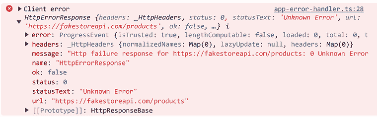

# 11

# 处理应用程序错误

应用程序错误是网络应用程序生命周期的一个组成部分。它们可能发生在运行时或开发应用程序期间。运行时错误的可能原因包括失败的 HTTP 请求或不完整的 HTML 表单。网络应用程序必须处理运行时错误并减轻不良影响，以确保流畅的用户体验。

开发错误通常发生在我们没有根据其语义正确使用编程语言或框架的情况下。在这种情况下，错误可能会覆盖编译器并在运行时在应用程序中暴露出来。通过遵循最佳实践和推荐的编码技术可以减轻开发错误。

在本章中，我们将学习如何在 Angular 应用程序中处理不同类型的错误，并理解来自框架本身的错误。我们将更详细地探讨以下概念：

+   处理运行时错误

+   揭秘框架错误

# 技术要求

本章中描述的代码示例可以在以下 GitHub 仓库的 `ch11` 文件夹中找到：

[`www.github.com/PacktPublishing/Learning-Angular-Fifth-Edition`](https://www.github.com/PacktPublishing/Learning-Angular-Fifth-Edition)

# 处理运行时错误

在 Angular 应用程序中，最常见的运行时错误来自于与 HTTP API 的交互。输入错误的登录凭证或以错误格式发送数据可能导致 HTTP 错误。Angular 应用程序可以通过以下方式处理 HTTP 错误：

+   在执行特定 HTTP 请求期间显式处理

+   在应用程序的全局错误处理器中全局处理

+   使用 HTTP 拦截器集中处理

在以下部分，我们将探讨如何处理特定 HTTP 请求中的 HTTP 错误。

## 捕获 HTTP 请求错误

处理 HTTP 请求中的错误通常需要手动检查错误响应对象中返回的信息。RxJS 提供了 `catchError` 操作符来简化这个过程。它可以在使用 `pipe` 操作符发起 HTTP 请求时捕获潜在的错误。

要跟随本章的其余部分，您需要我们在第十章 *使用表单收集用户数据* 中创建的 Angular 应用程序的源代码。

让我们看看我们如何使用 `catchError` 操作符来捕获在应用程序中获取产品列表时的 HTTP 错误：

1.  打开 `products.service.ts` 文件，并从 `rxjs` npm 包中导入 `catchError` 和 `throwError` 操作符：

    ```js
    import { Observable, map, of, tap, **catchError, throwError** } from 'rxjs'; 
    ```

1.  从 `@angular/common/http` 命名空间导入 `HttpErrorResponse` 接口：

    ```js
    import { HttpClient, HttpParams, **HttpErrorResponse** } from '@angular/common/http'; 
    ```

1.  修改 `getProducts` 方法：

    ```js
    getProducts(limit?: number): Observable<Product[]> {
      if (this.products.length === 0) {
        const options = new HttpParams().set('limit', limit || 10);
        return this.http.get<Product[]>(this.productsUrl, {
          params: options
        }).pipe(
          map(products => {
            this.products = products;
            return products;
          }),
          **catchError((error: HttpErrorResponse) => {**
            **console.error(error);**
            **return throwError(() => error);**
          **})**
        );
      }
      return of(this.products);
    } 
    ```

`catchError` 操作符的签名包含从服务器返回的实际 `HttpErrorResponse` 对象。在捕获错误后，我们使用 `throwError` 操作符，它将错误重新抛出为一个可观察对象。

或者，我们可以使用标准 Web API 方法中的`throw`关键字来抛出错误。然而，`throwError`方法通常过于强大。请相应地使用它。

这样，我们确保应用程序执行将继续并完成，而不会造成潜在的内存泄漏。

在实际场景中，我们可能会创建一个辅助方法来在一个更稳固的跟踪系统中记录错误，并根据错误的原因返回一些有意义的信息：

1.  在同一文件`products.service.ts`中，从`@angular/common/http`命名空间导入`HttpStatusCode`枚举：

    ```js
    import { HttpClient, HttpParams, HttpErrorResponse, **HttpStatusCode** } from '@angular/common/http'; 
    ```

`HttpStatusCode`是一个枚举，包含所有 HTTP 响应状态码的列表。

1.  在`ProductsService`类中创建以下方法：

    ```js
    private handleError(error: HttpErrorResponse) {
      let message = '';
      switch(error.status) {
        case HttpStatusCode.InternalServerError:
          message = 'Server error';
          break;
        case HttpStatusCode.BadRequest:
          message = 'Request error';
          break;
        default:
          message = 'Unknown error';
      }

      console.error(message, error.error);

      return throwError(() => error);
    } 
    ```

上述方法根据错误状态在浏览器控制台中记录不同的消息。它使用`switch`语句来区分内部服务器错误和错误请求。对于其他任何错误，它回退到`default`语句，在控制台中记录一个通用的消息。

1.  重构`getProducts`方法以使用`handleError`方法来捕获错误：

    ```js
    getProducts(limit?: number): Observable<Product[]> {
      if (this.products.length === 0) {
        const options = new HttpParams().set('limit', limit || 10);
        return this.http.get<Product[]>(this.productsUrl, {
          params: options
        }).pipe(
          map(products => {
            this.products = products;
            return products;
          }),
          catchError(**this.handleError**)
        );
      }
      return of(this.products);
    } 
    ```

当前`handleError`方法仅管理来自 HTTP 响应的 HTTP 错误。然而，在 Angular 应用程序中，其他错误也可能发生，例如由于网络错误而未到达服务器的请求或在 RxJS 操作符中抛出的异常。为了处理上述任何错误，我们应该在`handleError`方法中添加一个新的`case`语句：

```js
private handleError(error: HttpErrorResponse) {
  let message = '';
  switch(error.status) {
    **case 0:**
      **message = 'Client error';**
      **break;**
    case HttpStatusCode.InternalServerError:
      message = 'Server error';
      break;
    case HttpStatusCode.BadRequest:
      message = 'Request error';
      break;
    default:
      message = 'Unknown error';
  }

  console.error(message, error.error);

  return throwError(() => error);
} 
```

在前面的代码片段中，状态为`0`的错误表示它是在应用程序客户端发生的错误。

在 HTTP 请求中处理错误时，可以结合一个机制，在处理错误之前重试特定的 HTTP 调用特定次数。对于几乎所有事情，RxJS 都有一个操作符，甚至有一个用于重试 HTTP 请求的操作符。它接受重试次数，即特定请求必须执行直到成功完成：

```js
getProducts(limit?: number): Observable<Product[]> {
  if (this.products.length === 0) {
    const options = new HttpParams().set('limit', limit || 10);
    return this.http.get<Product[]>(this.productsUrl, {
      params: options
    }).pipe(
      map(products => {
        this.products = products;
        return products;
      }),
      **retry(2)**,
      catchError(this.handleError)
    );
  }
  return of(this.products);
} 
```

我们了解到我们使用`catchError` RxJS 操作符来捕获错误。我们处理它的方式取决于场景。在我们的情况下，我们在服务中为所有 HTTP 调用创建了一个`handleError`方法。在实际场景中，我们会在应用程序的其他 Angular 服务中遵循相同的错误处理方法。为每个服务创建一个方法可能不方便，并且扩展性不好。

或者，我们可以利用 Angular 提供的全局错误处理器来在中央位置处理错误。我们将在下一节学习如何创建全局错误处理器。

## 创建全局错误处理器

Angular 框架提供了`ErrorHandler`类来处理 Angular 应用程序中的全局错误。`ErrorHandler`类的默认实现将在浏览器控制台窗口中打印错误消息。

要为我们自己的应用程序创建一个自定义错误处理器，我们需要对 `ErrorHandler` 类进行子类化，并提供我们定制的错误记录实现：

1.  在 Angular CLI 工作区的 `src\app` 文件夹中创建一个名为 `app-error-handler.ts` 的文件。

1.  打开文件并添加以下 `import` 语句：

    ```js
    import { HttpErrorResponse, HttpStatusCode } from '@angular/common/http';
    import { ErrorHandler, Injectable } from '@angular/core'; 
    ```

1.  创建一个实现 `ErrorHandler` 接口的 TypeScript 类：

    ```js
    @Injectable()
    export class AppErrorHandler implements ErrorHandler {} 
    ```

`AppErrorHandler` 类必须使用 `@Injectable()` 装饰器进行装饰，因为我们将在应用程序配置文件中稍后提供它。

1.  按照以下方式实现 `ErrorHandler` 接口的 `handleError` 方法：

    ```js
    handleError(error: any): void {
      const err = error.rejection || error;
      let message = '';

      if (err instanceof HttpErrorResponse) {
        switch(err.status) {
          case 0:
            message = 'Client error';
            break;
          case HttpStatusCode.InternalServerError:
            message = 'Server error';
            break;
          case HttpStatusCode.BadRequest:
            message = 'Request error';
            break;
          default:
            message = 'Unknown error';
        }
      } else {
        message = 'Application error';
      }
      console.error(message, err);
    } 
    ```

在前面的方法中，我们检查 `error` 对象是否包含一个 `rejection` 属性。来自负责 Angular 中变更检测的 **Zone.js** 库的错误，封装了实际的错误在该属性中。

在从 `err` 变量中提取错误后，我们使用 `HttpErrorResponse` 类型检查它是否是 HTTP 错误。这个检查最终会捕获使用 `throwError` RxJS 操作符的任何 HTTP 调用的错误。所有其他错误都被视为客户端发生的应用错误。

1.  打开 `app.config.ts` 文件，并从 `@angular/core` npm 包中导入 `ErrorHandler` 类：

    ```js
    import { ApplicationConfig, **ErrorHandler**, provideZoneChangeDetection } from '@angular/core'; 
    ```

1.  从 `app-error-handler.ts` 文件中导入我们创建的自定义错误处理器：

    ```js
    import { AppErrorHandler } from './app-error-handler'; 
    ```

1.  通过将其添加到 `appConfig` 变量的 `providers` 数组中，将 `AppErrorHandler` 类注册为应用程序的全局错误处理器：

    ```js
    export const appConfig: ApplicationConfig = {
      providers: [
        provideZoneChangeDetection({ eventCoalescing: true }),
        provideRouter(routes),
        provideHttpClient(),
        { provide: APP_SETTINGS, useValue: appSettings },
        **{ provide: ErrorHandler, useClass: AppErrorHandler }**
      ]
    }; 
    ```

要调查全局应用错误处理器的行为，请执行以下步骤：

1.  运行 `ng serve` 命令以启动应用程序。

1.  断开您的计算机与互联网的连接。

1.  导航到 `http://localhost:4200` 。

1.  打开浏览器开发者工具并检查控制台窗口的输出：



图 11.1：应用错误

在一个网络企业应用中最常见的 HTTP 错误之一是 **401 未授权** 的响应错误。我们将在下一节学习如何处理这个特定的错误。

## 响应 401 未授权错误

在 Angular 应用程序中，401 未授权错误可能发生在以下情况：

+   用户在登录应用程序时没有提供正确的凭据

+   用户登录应用程序时提供的身份验证令牌已过期

处理 401 未授权错误的好地方是在负责身份验证的 HTTP 拦截器内部。在 *第八章* ，*通过 HTTP 与数据服务通信* 中，我们学习了如何创建一个身份验证拦截器，以便将授权令牌传递给每个 HTTP 请求。为了处理 401 未授权错误，`auth.interceptor.ts` 文件可以修改如下：

```js
import { HttpErrorResponse, HttpInterceptorFn, HttpStatusCode } from '@angular/common/http';
import { inject } from '@angular/core';
import { AuthService } from './auth.service';
import { catchError, EMPTY, throwError } from 'rxjs';
export const authInterceptor: HttpInterceptorFn = (req, next) => {
  const authService = inject(AuthService);
  const authReq = req.clone({
    setHeaders: { Authorization: 'myToken' }
  });
  return next(authReq).pipe(
    catchError((error: HttpErrorResponse) => {
      if (error.status === HttpStatusCode.Unauthorized) {
        authService.logout();
        return EMPTY;
      } else {
        return throwError(() => error);
      }
    })
  );
}; 
```

当发生 401 未授权错误时，拦截器将调用`AuthService`类的`logout`方法并返回一个`EMPTY`可观察对象以停止发出数据。它将使用`throwError`运算符将错误冒泡到全局错误处理器中的所有其他错误。正如我们之前看到的，全局错误处理器将检查返回的错误并根据状态码采取行动。

正如我们在上一节中创建的全局错误处理器中看到的，一些错误与 HTTP 客户端的交互无关。有一些应用程序错误是在客户端发生的，我们将在下一节中学习如何理解它们。

# 揭秘框架错误

在 Angular 应用程序中，客户端发生的应用程序错误可能有多种原因。其中之一是我们源代码与 Angular 框架的交互。开发者在构建应用程序时喜欢尝试新事物和方法。有时，一切都会顺利进行，但有时可能会在应用程序中引起错误。

Angular 框架提供了一个机制，以以下格式报告一些常见错误：

```js
NGWXYZ: {Error message}.<Link> 
```

让我们分析前面的错误格式：

+   `NG`：表示这是一个 Angular 错误，用于区分来自 TypeScript 和浏览器的其他错误

+   `W`：一个一位数，表示错误的类型。0 代表运行时错误，而 1 到 9 的所有其他数字代表编译器错误

+   `X`：一个一位数，表示框架运行区域类别，例如变更检测、依赖注入和模板

+   `YZ`：一个两位数代码，用于索引特定错误

+   `{错误消息}`：实际的错误消息

+   `<链接>`：指向 Angular 文档的链接，提供有关指定错误的更多信息

符合上述格式的错误消息将在浏览器控制台发生时显示。让我们通过使用`ExpressionChangedAfterChecked`错误（Angular 应用程序中最著名的错误）来查看一个错误示例：

1.  打开`app.component.ts`文件，从`@angular/core`npm 包中导入`AfterViewInit`实体：

    ```js
    import { **AfterViewInit**, Component, inject } from '@angular/core'; 
    ```

1.  将`AfterViewInit`添加到实现接口的列表中：

    ```js
    export class AppComponent **implements AfterViewInit** 
    ```

1.  在`AppComponent`类中创建以下`title`属性：

    ```js
    title = ''; 
    ```

1.  实现`ngAfterViewInit`方法并在方法体内更改`title`属性：

    ```js
    ngAfterViewInit(): void {
      this.title = this.settings.title;
    } 
    ```

1.  打开`app.component.html`文件，将`title`属性绑定到`<h2>`HTML 元素：

    ```js
     <h2>{{ **title** }}</h2> 
    ```

1.  运行`ng serve`命令并导航到`http://localhost:4200`。

初始时，一切看起来都工作正常。`title`属性的值在页面上正确显示。

1.  打开浏览器开发者工具并检查控制台窗口：

    ```js
    Application error RuntimeError: NG0100: ExpressionChangedAfterItHasBeenCheckedError: Expression has changed after it was checked. Previous value: ''. Current value: 'My e-shop'. Expression location: _AppComponent component. Find more at https://angular.dev/errors/NG0100 
    ```

前面的消息表明更改`title`属性的值导致了错误。

1.  点击[`angular.dev/errors/NG0100`](https://angular.dev/errors/NG0100)链接将带我们转到 Angular 文档中适当的错误指南，以获取更多信息。错误指南解释了具体的错误，并描述了如何在我们的应用程序代码中修复问题。

当我们理解了源自 Angular 框架的错误信息时，我们可以轻松地修复它们。

# 摘要

在运行时或开发过程中处理错误对于每个 Angular 应用程序至关重要。在本章中，我们学习了如何在 Angular 应用程序运行时处理错误，例如 HTTP 或客户端错误。我们还学习了如何理解和修复由 Angular 框架抛出的应用程序错误。

在下一章中，我们将学习如何在 Angular Material 的帮助下美化我们的应用程序，使其看起来更美观。Angular Material 拥有许多组件和样式，这些组件和样式已经准备好供你在项目中使用。所以，让我们给你的 Angular 项目带来应有的关爱。
