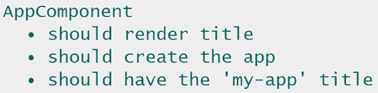
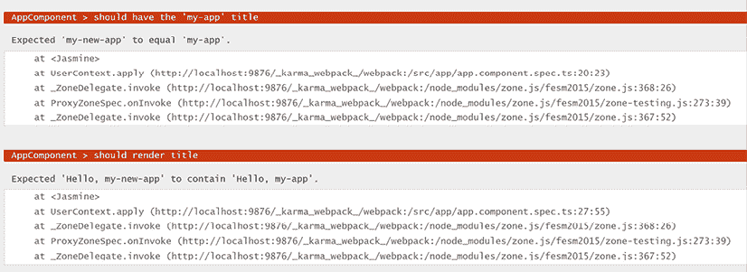

# 第十三章：单元测试 Angular 应用

在前面的章节中，我们讨论了从零开始构建 Angular 企业应用的许多方面。但我们是怎样确保应用在未来可以轻松维护的呢？一旦我们的应用开始扩展，我们必须减轻 bug 的影响，一个全面的自动化测试层就可以成为我们的生命线。

测试，特别是单元测试，旨在在项目开发过程中由开发者执行。现在我们的框架知识已经成熟，我们将简要介绍本章中 Angular 应用单元测试的所有复杂性，包括测试工具的使用。

为了简单起见，本章中的示例与我们在整本书中构建的电子商务应用无关。

更详细地说，我们将学习以下内容：

+   为什么我们需要单元测试？

+   单元测试的结构

+   在 Angular 中引入单元测试

+   测试组件

+   测试服务

+   测试管道

+   测试指令

+   测试表单

+   测试路由器

# 技术要求

本章包含各种代码示例，以向您介绍 Angular 中单元测试的概念。您可以在以下 GitHub 仓库的`ch13`文件夹中找到相关源代码：

[`www.github.com/PacktPublishing/Learning-Angular-Fifth-Edition`](https://www.github.com/PacktPublishing/Learning-Angular-Fifth-Edition) .

# 为什么我们需要单元测试？

在本节中，我们将学习单元测试是什么以及为什么它们在 Web 开发中很有用。

如果你熟悉单元测试和测试驱动开发，你可以跳到下一节。

单元测试是高效和敏捷开发流程的工程哲学的一部分。它们在代码开发之前为应用程序代码添加了一层自动化测试。核心概念是，一段代码及其测试都是由负责该代码的开发者构建的。首先，我们针对我们想要交付的功能设计测试，检查其输出和行为是否准确。由于该功能尚未实现，测试将失败，因此开发者的工作是构建功能以通过测试。

单元测试相当有争议。虽然测试驱动开发有助于确保代码质量并随着时间的推移进行维护，但并非每个人都在他们的日常开发工作流程中执行单元测试。

在我们开发代码的同时构建测试有时会感觉像是一种负担，尤其是在测试结果变得比要测试的功能更大的情况下。然而，支持测试的论据超过了反对它的论据：

+   构建测试有助于更好的代码设计。我们的代码必须符合测试要求，而不是相反。如果我们试图测试现有的代码并在某个点上受阻，那么代码可能设计得不好，需要重新思考。另一方面，构建可测试的功能可以帮助早期发现副作用。

+   对经过测试的代码进行重构是防止在后期引入错误的生命线。开发应当随着时间而演进，每次重构时引入错误的几率很高。单元测试是确保我们能够尽早捕捉到错误的一种极好方式，无论是引入新功能还是更新现有功能。

+   构建测试是记录我们代码的极好方式。当有人不熟悉代码库而接管开发任务时，它成为了一种无价资源。

这些只是其中的一小部分论点，但你在网上可以找到无数关于测试代码好处的资源。如果你还没有确信，不妨试一试；否则，让我们继续我们的旅程，看看单元测试的整体形式。

# 单元测试的结构

测试一段代码有许多不同的方法。在本章中，我们将探讨单元测试的结构——它由哪些单独的部分组成。

要测试任何代码，我们需要一个用于编写测试的框架和一个用于运行测试的运行器。在本节中，我们将专注于测试框架。测试框架应提供用于构建包含一个或多个测试规格的测试套件的实用函数。因此，单元测试涉及以下概念：

+   **测试套件**：一个为许多测试创建逻辑分组的套件。例如，一个套件可以包含特定功能的全部测试。

+   **测试规格**：实际的单元测试。

在本章中，我们将使用**Jasmine**，这是一个流行的测试框架，也是 Angular CLI 项目中默认使用的框架。以下是 Jasmine 中的单元测试示例：

```js
describe('Calculator', () => {
  it('should add two numbers', () => {
    expect(1+1).toBe(2);
  });
}); 
```

`describe` 方法定义了测试套件，并接受一个名称和一个箭头函数作为参数。箭头函数是测试套件的主体，包含多个单元测试。`it` 方法定义了一个单独的单元测试。它接受一个名称和一个箭头函数作为参数。

每个测试规格验证套件名称中描述的功能的特定功能，并在其主体中声明一个或多个期望。每个期望都包含一个值，称为**期望值**，它使用**匹配器函数**与**实际值**进行比较。该函数检查期望值和实际值是否相应匹配，这被称为**断言**。测试框架根据这种断言的结果通过或失败规格。在先前的例子中，`1+1`将返回实际值，该值应与在`toBe`匹配器函数中声明的期望值`2`相匹配。

Jasmine 框架根据用户特定的需求包含各种匹配器函数，正如我们在本章后面将要看到的。

假设前面的代码包含另一个必须测试的数学运算。将这两个操作组合在 `Calculator` 测试套件下进行测试是有意义的，如下所示：

```js
describe('Calculator', () => {
  it('should add two numbers', () => {
    expect(1+1).toBe(2);
  });
  **it('should subtract two numbers', () => {**
    **expect(1-1).toBe(0);**
  **});**
}); 
```

到目前为止，我们已经了解了测试套件以及如何使用它们根据其功能分组测试。此外，我们还学习了如何调用我们想要测试的代码并确认它做了它应该做的事情。然而，单元测试中涉及的概念更多，值得了解，即**设置**和**拆卸**功能。

设置功能是在你开始运行测试之前准备你的代码。这是一种通过调用代码并检查断言来保持代码清洁的方法。拆卸功能是相反的。它负责拆卸我们最初设置的内容，涉及诸如清理资源等活动。让我们通过一个代码示例来看看这在实际中是什么样子：

```js
describe('Calculator', () => {
  let total: number;
  **beforeEach(() => total = 1);**
  it('should add two numbers', () => {
    total = total + 1;
    expect(total).toBe(2);
  });
  it('should subtract two numbers', () => {
    total = total - 1;
    expect(total).toBe(0);
  });
  **afterEach(() => total = 0);**
}); 
```

`beforeEach` 方法用于设置功能，并在每个单元测试之前运行。在这个例子中，我们在每个测试之前将 `total` 变量的值设置为 `1`。`afterEach` 方法用于运行拆卸逻辑。在每个测试之后，我们将 `total` 变量的值重置为 `0`。

显然，测试只需要关注调用应用程序代码并断言结果，这使得测试更简洁；然而，在实际应用中，测试往往需要更多的设置。最重要的是，`beforeEach` 方法通常使添加新测试变得更容易，这是非常好的。我们希望代码经过良好的测试；编写和维护这样的代码越容易，对我们软件的好处就越大。

现在我们已经了解了单元测试的基础，让我们看看我们如何在 Angular 框架的上下文中实现它们。

# 在 Angular 中引入单元测试

在上一节中，我们熟悉了单元测试及其一般概念，如测试套件、测试规范和断言。现在是时候带着这些知识去探索 Angular 的单元测试了。然而，在我们开始为 Angular 编写测试之前，让我们看看 Angular 框架和 Angular CLI 为我们提供的工具：

+   **Jasmine**：我们已经了解到，这是一个测试框架。

+   **Karma**：运行我们的单元测试的测试运行器。

+   **Angular 测试工具**：一组辅助方法，帮助我们设置单元测试并在 Angular 框架的上下文中编写断言。

当我们使用 Angular CLI 时，我们不需要对 Angular 应用程序中的 Jasmine 和 Karma 进行任何配置。当我们创建一个新的 Angular CLI 项目时，单元测试默认情况下就可以工作。大多数时候，我们将与 Angular 测试工具交互。

Angular 测试实用工具帮助我们创建一个测试环境，使得为我们的 Angular 艺术品编写测试变得容易。它由 `TestBed` 类和 `@angular/core/testing` 命名空间中的各种辅助方法组成。随着本章的深入，我们将了解这些是什么以及它们如何帮助我们测试各种艺术品。现在，让我们先看看最常用的概念，以便在稍后更详细地探讨时，您能熟悉它们：

+   `TestBed`：一个创建测试模块的类。当我们测试它时，我们将 Angular 艺术品附加到这个测试模块上。`TestBed` 类包含我们用来设置测试模块所需的 `configureTestingModule` 方法。

+   `ComponentFixture`：一个围绕 Angular 组件实例的包装类。它允许我们与组件及其相应的 HTML 元素进行交互。

+   `DebugElement`：组件 DOM 元素的包装。它是一个跨平台操作抽象，使得我们的测试是平台无关的。

现在我们已经了解了我们的测试环境和使用的框架和库，我们可以开始编写我们的第一个 Angular 单元测试。

本章中描述的所有示例都是在新的 Angular CLI 项目中创建的。

我们将从 Angular 最基本的构建块——组件开始，开始这段伟大的旅程。

# 测试组件

你可能已经注意到，每次我们使用 Angular CLI 构建新的 Angular 应用程序或生成 Angular 艺术品时，它都会为我们创建一些测试文件。

Angular CLI 中的测试文件文件名中包含单词 `spec`。测试文件的文件名与其所测试的 Angular 艺术品相同，后跟后缀 `.spec.ts`。例如，Angular 应用程序主组件的测试文件是 `app.component.spec.ts`，它位于组件文件相同的路径中。

我们应该将 Angular 艺术品及其相应的测试视为一件事。当我们更改艺术品的逻辑时，我们可能需要修改单元测试。将单元测试文件与其 Angular 艺术品放在一起，使我们更容易记住和编辑它们。这也有助于我们在需要重构代码时，例如移动艺术品（不要忘记移动单元测试）。

当我们构建一个新的 Angular 应用程序时，Angular CLI 会自动为主组件 `AppComponent` 创建一个测试。在文件的开头，有一个用于设置的 `beforeEach` 语句：

```js
beforeEach(async () => {
  await TestBed.configureTestingModule({
    imports: [AppComponent],
  }).compileComponents();
}); 
```

它使用 `TestBed` 类的 `configureTestingModule` 方法，并将一个对象作为参数传递。

我们可以指定一个包含我们想要测试的组件的 `imports` 数组。此外，我们可以使用 `teardown` 属性定义拆解选项。

`teardown` 属性包含一个 `ModuleTeardownOptions` 类型的对象，可以设置以下属性：

+   `destroyAfterEach`：它在每个测试中创建模块的新实例，以消除由于 HTML 元素清理不完整而引起的错误。

+   `rethrowErrors`：它在模块销毁时抛出任何发生的错误。

最后，我们调用 `compileComponents` 方法来编译我们的组件的 TypeScript 类和 HTML 模板。

第一个单元测试验证我们是否可以使用 `createComponent` 方法创建 `AppComponent` 的新实例：

```js
it('should create the app', () => {
  const fixture = TestBed.createComponent(AppComponent);
  const app = fixture.componentInstance;
  expect(app).toBeTruthy();
}); 
```

`createComponent` 方法的结果是 `AppComponent` 类型的 `ComponentFixture` 实例，我们可以使用 `componentInstance` 属性获取组件实例。我们还使用 `toBeTruthy` 匹配器函数来检查生成的实例是否有效。

一旦我们能够访问组件实例，我们就可以查询其任何公共属性和方法：

```js
it(`should have the 'my-app' title`, () => {
  const fixture = TestBed.createComponent(AppComponent);
  const app = fixture.componentInstance;
  expect(app.title).toEqual('my-app');
}); 
```

在前面的测试中，我们使用另一个匹配器函数 `toEqual` 检查 `title` 组件属性是否设置为 `my-app`。

在新的 Angular 应用程序中，`title` 组件属性的值将是你在创建应用程序时通过 `ng new` 命令传递的名称。

正如我们所学的，组件由 TypeScript 类和模板文件组成。因此，仅从类角度测试，如前面的测试，是不够的。我们还应该测试类是否正确与 DOM 交互：

```js
it('should render title', () => {
  const fixture = TestBed.createComponent(AppComponent);
  fixture.detectChanges();
  const compiled = fixture.nativeElement as HTMLElement;
  expect(compiled.querySelector('h1')?.textContent).toContain('Hello, my-app');
}); 
```

许多开发者更喜欢类测试而不是 DOM 测试，并依赖于 **端到端**（**E2E**）测试，这种测试较慢且性能较差。端到端测试通常验证应用程序与后端 API 的集成，并且容易出错。因此，在 Angular 应用程序中执行 DOM 单元测试是推荐的。

在前面的测试中，我们创建了一个组件并调用了 `ComponentFixture` 的 `detectChanges` 方法。`detectChanges` 方法触发了 Angular 的变更检测机制，强制数据绑定更新。它在第一次调用时执行组件的 `ngOnInit` 生命周期事件，在后续调用中执行 `ngOnChanges`，这样我们就可以使用 `nativeElement` 属性查询组件的 DOM 元素。在这个例子中，我们检查与 `title` 属性对应的 HTML 元素的 `textContent`。

运行测试时，我们使用 Angular CLI 的 `ng test` 命令。它将启动 Karma 测试运行器，获取所有单元测试文件，执行它们，并打开浏览器以显示每个测试的结果。Angular CLI 默认使用 Google Chrome 浏览器。输出将类似于以下内容：



图 13.1：测试执行输出

在前面的图中，我们可以在页面顶部看到每个测试的结果。我们还可以看到 Karma 如何通过套件视觉分组每个测试。在我们的例子中，唯一的测试套件是 **AppComponent**。

现在，让我们让我们的一个测试失败。打开`app.component.ts`文件，将`title`属性的值更改为`my-new-app`，然后保存文件。Karma 将重新执行我们的测试，并在页面上显示结果：



图 13.2：测试失败

Karma 以**监视模式**运行，因此我们不需要每次更改时都执行 Angular CLI 测试命令。

有时，在浏览器中阅读测试输出并不太方便。作为替代，我们可以检查我们用来运行`ng test`命令的控制台窗口，其中包含测试结果的裁剪版本：

```js
Executed 3 of 3 SUCCESS (0.117 secs / 0.044 secs)
TOTAL: 3 SUCCESS 
```

通过查看 Angular CLI 为我们自动创建的`AppComponent`测试，我们已经获得了相当多的见解。在下一节中，我们将查看一个更高级的场景，用于测试具有依赖项的组件。

## 带依赖项的测试

在现实世界的场景中，组件通常不像主组件那样简单。它们几乎肯定依赖于一个或多个服务。它们也可能在其模板中包含其他子组件。

我们有不同方式处理这种情况下的测试。有一点很清楚：如果我们正在测试组件，我们不应该测试服务或其子组件。因此，当我们设置此类测试时，依赖项不应是真实类。在单元测试中，处理这个问题有不同方式；没有解决方案是绝对优于其他解决方案的：

+   **存根**：一种指示依赖项注入器注入我们提供的存根而不是真实类的指令。

+   **间谍**：一种注入实际依赖项但附加一个间谍到我们在组件中调用的方法的方法。然后我们可以返回模拟数据或让方法调用通过。

    当依赖项复杂时，使用存根而不是间谍更可取。一些服务会注入其他服务，因此在测试中使用真实依赖项需要您补偿其他依赖项。当我们要测试的组件在其模板中包含子组件时，这也是首选方法。

无论采用何种方法，我们都确保测试不会执行意外的操作，例如访问文件系统或尝试通过 HTTP 进行通信；我们正在完全隔离的情况下测试组件。

### 用存根替换依赖项

用存根替换依赖项意味着我们完全用假的依赖项替换了真实的依赖项。

我们可以通过以下方式创建一个假的依赖项：

+   创建一个包含真实依赖项属性和方法的常量变量或类。

+   为依赖项的实际类创建一个模拟定义。

这些方法并没有太大的区别。在本节中，我们将查看第一个方法，因为它在 Angular 开发中最为常见。您可以按照自己的节奏探索第二个方法。

考虑以下`stub.component.ts`组件文件：

```js
import { Component, OnInit } from '@angular/core';
import { StubService } from '../stub.service';
@Component({
  selector: 'app-stub',
  template: '<span>{{ msg }}</span>'
})
export class StubComponent implements OnInit {
  msg = '';
  constructor(private stubService: StubService) {}
  ngOnInit(): void {
    this.msg = this.stubService.isBusy
      ? this.stubService.name + ' is on mission'
      : this.stubService.name + ' is available';
  }
} 
```

它注入了`StubService`，该服务包含两个公共属性。在测试中为该服务提供占位符相当直接，如下面的示例所示：

```js
const serviceStub: Partial<StubService> = {
  name: 'Boothstomper'
}; 
```

我们将服务声明为`Partial`，因为我们只想最初设置`name`属性。现在我们可以使用对象字面量语法将占位符服务注入到我们的测试模块中：

```js
await TestBed.configureTestingModule({
  imports: [StubComponent],
  **providers: [**
    **{ provide: StubService, useValue: serviceStub }**
  **]**
})
.compileComponents(); 
```

`msg`组件属性依赖于`isBusy`服务属性的值。因此，我们需要在测试套件中获取对服务的引用，并在每个测试中为该属性提供不同的值。我们可以使用`TestBed`类的`inject`方法获取注入的`StubService`实例：

```js
describe('status', () => {
  let service: StubService;
  beforeEach(() => {
    service = TestBed.inject(StubService);
  })
}); 
```

我们将真实的`StubService`作为参数传递给`inject`方法，而不是我们创建的占位符版本。修改占位符的值不会影响注入的服务，因为我们的组件使用的是真实服务的实例。`inject`方法请求应用程序的根注入器提供所需的服务。如果服务是从组件注入器提供的，我们就需要使用`fixture.debugElement.injector.get(StubService)`从组件注入器获取它。

现在我们可以编写测试来检查`msg`组件属性在数据绑定期间是否表现正确：

```js
describe('status', () => {
  let service: StubService;
  **let msgDisplay: HTMLElement;**
  beforeEach(() => {
    service = TestBed.inject(StubService);
    **msgDisplay = fixture.nativeElement.****querySelector****(****'span'****);**
  })
  **it('should be on a mission', () => {**
**service.isBusy = true;**
**fixture.detectChanges();**
**expect(msgDisplay.textContent).toContain('is on mission');**
**});**
  **it('should be available', () => {**
    **service.isBusy = false;**
    **fixture.detectChanges();**
    **expect(msgDisplay.textContent).toContain('is available');**
  **});**
}); 
```

我们已经从`beforeEach`语句中移除了`fixture.detectChanges`行，因为我们希望在测试中单独触发变更检测。

占位依赖项并不总是可行的，尤其是在根注入器不提供它的情况下。服务可以在组件注入器级别提供。使用我们之前查看的过程提供占位符没有任何效果。为了应对这种情况，我们可以使用`TestBed`类的`overrideComponent`方法：

```js
await TestBed.configureTestingModule({
  imports: [StubComponent],
  providers: [
    { provide: StubService, useValue: serviceStub }
  ]
})
**.overrideComponent(StubComponent, {**
  **set: {**
    **providers: [**
      **{ provide: StubService, useValue: serviceStub }**
    **]**
  **}**
**})**
.compileComponents(); 
```

`overrideComponent`方法接受两个参数：提供服务的组件类型和一个覆盖元数据对象。元数据对象包含`set`属性，它为组件提供服务。

假设我们想要测试的组件在其模板中包含一个子组件，例如：

```js
@Component({
  selector: 'app-stub',
  template: `
    <span>{{ msg }}</span>
    **<app-child></app-child>**
  `
}) 
```

在前面的例子中，当我们测试`StubComponent`时，我们还需要在配置测试模块时导入`<app-child>`组件的 TypeScript 类：

```js
await TestBed.configureTestingModule({
  imports: [StubComponent],
  providers: [
    { provide: StubService, useValue: serviceStub }
  ],
  **imports: [ChildComponent]**
}) 
```

`ChildComponent`类可能还有其他依赖。为这些依赖提供占位符不可行，因为这不是被测试组件的责任。相反，我们可以为组件创建一个占位符 TypeScript 类，并在配置测试模块时导入它：

```js
@Component({ selector: 'app-child', template: '' })
class ChildStubComponent {} 
```

在前面的代码片段中，我们在组件的`template`属性中传递了一个空数组，因为我们对子组件的内部实现不感兴趣。

如果子组件包含在测试父组件时使用的属性和方法，我们还需要在`ChildStubComponent`中定义它们。

或者，为了提供一个组件的存根，我们可以在配置测试模块时传递来自 `@angular/core` npm 包的 `NO_ERRORS_SCHEMA`：

```js
await TestBed.configureTestingModule({
  imports: [StubComponent],
  providers: [
    { provide: StubService, useValue: serviceStub },
  ],
  **schemas: [NO_ERRORS_SCHEMA]**
}) 
```

前面的代码片段指示 Angular 忽略任何未导入到测试模块中的组件。

存根依赖非常简单，但并不总是可能的，正如我们将在下一节中看到的。

### 监视依赖方法

使用存根不是在单元测试中隔离逻辑的唯一方法。我们不必替换整个依赖——只需替换组件使用的部分。替换某些部分意味着我们指出依赖中的特定方法，并将间谍分配给它们。间谍可以回答你想要的内容，但你也可以看到它被调用了多少次以及使用了什么参数。因此，间谍为你提供了更多关于发生情况的信息。

在依赖中设置间谍有两种方式：

+   注入实际依赖并监视其方法。

+   使用 Jasmine 的 `createSpyObj` 方法来创建一个假的依赖实例。然后我们可以像对待真实实例一样监视这个依赖的方法。

第一种情况在 Angular 开发中最为常见。让我们看看如何设置它。考虑以下 `spy.component.ts` 文件，它使用了 Angular 框架的 `Title` 服务：

```js
import { Component, OnInit } from '@angular/core';
import { Title } from '@angular/platform-browser';
@Component({
  selector: 'app-spy',
  template: '{{ caption }}'
})
export class SpyComponent implements OnInit {
  caption = '';
  constructor(private title: Title) {}
  ngOnInit(): void {
    this.title.setTitle('My Angular app');
    this.caption = this.title.getTitle();
  }
} 
```

`Title` 服务与 Angular 应用程序中主 HTML 文档的标题进行交互。

我们对 `Title` 服务没有控制权，因为它已经内置到框架中。它可能包含我们不知道的依赖。监视其方法是我们在测试中使用它的最简单、最安全的方式。我们通过 `providers` 数组将其注入到测试模块中，然后在我们的测试中使用它，例如：

```js
it('should set the title', () => {
  const title = TestBed.inject(Title);
  const spy = spyOn(title, 'setTitle');
  component.ngOnInit();
  expect(spy).toHaveBeenCalledWith('My Angular app');
}); 
```

我们使用 Jasmine 的 `spyOn` 方法，它接受两个参数：要监视的对象及其特定的方法。我们在调用 `ngOnInit` 组件方法之前使用它来在触发变更检测机制之前附加间谍。`expect` 语句验证 `setTitle` 方法是否以正确的参数被调用。

我们的组件还使用 `getTitle` 方法来获取文档标题。我们可以直接监视该方法并返回模拟数据：

1.  首先，我们需要将 `Title` 服务定义为间谍对象，并通过传递两个参数——服务的名称和组件当前使用的方程序表来初始化它：

    ```js
    const titleSpy = jasmine.createSpyObj('Title', [
      'getTitle', 'setTitle'
    ]); 
    ```

1.  然后，我们将间谍附加到 `getTitle` 方法，并使用 Jasmine 的 `returnValue` 方法返回一个自定义标题：

    ```js
    titleSpy.getTitle.and.returnValue('My title'); 
    ```

1.  最后，我们在测试模块的 `providers` 数组中添加 `titleSpy` 变量：

    ```js
    await TestBed.configureTestingModule({
      imports: [SpyComponent],
      **providers: [**
        **{ provide: Title, useValue: titleSpy }**
      **]**
    })
    .compileComponents(); 
    ```

结果测试应该看起来像以下这样：

```js
it('should get the title', async () => {
  const titleSpy = jasmine.createSpyObj('Title', [
    'getTitle', 'setTitle'
  ]);    
  titleSpy.getTitle.and.returnValue('My title');
  await TestBed.configureTestingModule({
    imports: [SpyComponent],
    providers: [
      { provide: Title, useValue: titleSpy }
    ]
  })
  .compileComponents();    

  const fixture = TestBed.createComponent(SpyComponent);
  fixture.detectChanges();

  expect(fixture.nativeElement.textContent).toContain('My title');
}); 
```

很少有服务表现得很好且直接，例如 `Title` 服务，因为它们是同步的。大多数时候，它们是异步的，可以返回可观察对象或承诺。在下一节中，我们将学习如何测试异步依赖。

### 测试异步服务

Angular 测试工具提供了两个工具来处理异步测试场景：

+   `waitForAsync`：这是一种异步的单元测试服务的方法。它与`ComponentFixture`类的`whenStable`方法结合使用。

+   `fakeAsync`：这是一种同步的单元测试服务的方法。它通常与`tick`函数结合使用。

这两种方法提供大致相同的功能；它们只是在我们的使用方式上有所不同。让我们通过查看一个示例来看看我们如何使用每种方法。

考虑以下`async.component.ts`文件：

```js
import { AsyncPipe } from '@angular/common';
import { Component, OnInit } from '@angular/core';
import { Observable } from 'rxjs';
import { AsyncService } from '../async.service';
@Component({
  selector: 'app-async',
  imports: [AsyncPipe],
  template: `
    @for(item of items$ | async; track item) {
      <p>{{ item }}</p>
    }
  `
})
export class AsyncComponent implements OnInit {
  items$: Observable<string[]> | undefined;
  constructor(private asyncService: AsyncService) {}
  ngOnInit(): void {
    this.items$ = this.asyncService.getItems();
  }
} 
```

它从`async.service.ts`文件中注入`AsyncService`，并在`ngOnInit`方法中调用其`getItems`方法。正如我们所见，`getItems`方法返回一个字符串的可观察对象。它还引入了轻微的延迟，以便使场景看起来是异步的：

```js
getItems(): Observable<string[]> {
  return of(items).pipe(delay(500));
} 
```

单元测试会查询组件的原生元素，并检查`items$`可观察对象的价值是否正确显示：

```js
it('should get data with waitForAsync', waitForAsync(async() => {
  fixture.detectChanges();
  await fixture.whenStable();
  fixture.detectChanges();

  const itemDisplay: HTMLElement[] = fixture.nativeElement.querySelectorAll('p');
  expect(itemDisplay.length).toBe(2);
})); 
```

我们将测试的主体包裹在`waitForAsync`方法内，并调用`detectChanges`方法来触发变更检测。此外，我们调用`whenStable`方法，它返回一个立即解决的承诺，当`items$`可观察对象完成时。当承诺解决时，我们再次调用`detectChanges`方法来触发数据绑定并相应地查询 DOM。

当我们想要测试包含模板驱动的表单的组件时，也会使用`whenStable`方法。此方法的异步特性使得在 Angular 应用程序中使用响应式表单更为可取。

另一种同步的方法是使用`fakeAsync`方法，并按照以下方式编写相同的单元测试：

```js
it('should get items with fakeAsync', fakeAsync(() => {
  fixture.detectChanges();
  tick(500);
  fixture.detectChanges();

  const itemDisplay: HTMLElement[] = fixture.nativeElement.querySelectorAll('p');
  expect(itemDisplay.length).toBe(2);
})); 
```

在前面的代码片段中，我们将测试的主体包裹在`fakeAsync`方法内，并用`tick`函数替换了`whenStable`方法。`tick`函数将时间推进`500`毫秒，这是我们引入`AsyncService`的`getItems`方法中的虚拟延迟。

使用异步服务测试组件有时可能变得非常困难。然而，每种描述的方法都可以显著帮助我们完成这项任务。然而，组件不仅关于服务，还包括输入和输出绑定。在接下来的部分，我们将学习如何测试组件的公共 API。

## 输入和输出测试

到目前为止，我们已经学习了如何测试具有简单属性的组件以及处理同步和异步依赖。但组件的内容远不止于此。正如我们在*第三章*，*使用组件构建用户界面*中学到的，组件有一个由输入和输出组成的公共 API，这些也应该被测试。

由于我们想要测试组件的公共 API，因此测试它从另一个组件托管时的交互是有意义的。测试这样的组件可以通过两种方式完成：

+   我们可以验证我们的输入绑定是否设置正确。

+   我们可以验证我们的输出绑定是否正确触发，以及它发出的内容是否被接收。

假设我们有一个包含输入和输出绑定的 `bindings.component.ts` 文件：

```js
import { Component, input, output } from '@angular/core';
@Component({
  selector: 'app-bindings',
  template: `
    <p>{{ title() }}</p>
    <button (click)="liked.emit()">Like!</button>
  `
})
export class BindingsComponent {
  title = input('');
  liked = output();
} 
```

在我们开始编写测试之前，我们应该在 `bindings.component.spec.ts` 文件中创建一个测试宿主组件，该组件将使用要测试的组件：

```js
@Component({
  imports: [BindingsComponent],
  template: `
    <app-bindings [title]="testTitle" (liked)="isFavorite = true"></app-bindings>
  `
})
export class TestHostComponent {
  testTitle = 'My title';
  isFavorite = false;
} 
```

在设置阶段，请注意 `ComponentFixture` 是 `TestHostComponent` 类型：

```js
describe('BindingsComponent', () => {
  let component: **TestHostComponent**;
  let fixture: ComponentFixture<**TestHostComponent**>;
  beforeEach(async () => {
    await TestBed.configureTestingModule({
      imports: [**TestHostComponent**]
    })
    .compileComponents();

    fixture = TestBed.createComponent(**TestHostComponent**);
    component = fixture.componentInstance;
    fixture.detectChanges();
  });
  it('should create', () => {
    expect(component).toBeTruthy();
  });
}); 
```

我们的单元测试将验证 `BindingsComponent` 与 `TestHostComponent` 交互时的行为。

第一个测试检查输入绑定是否已正确应用于 `title` 属性：

```js
it('should display the title', () => {
  const titleDisplay: HTMLElement = fixture.nativeElement.querySelector('p');
  expect(titleDisplay.textContent).toEqual(component.testTitle);
}); 
```

第二个测试验证 `isFavorite` 属性是否正确地与 `liked` 输出事件连接：

```js
it('should emit the liked event', () => {
  const button: HTMLButtonElement = fixture.nativeElement.querySelector('button');
  button.click();
  expect(component.isFavorite).toBeTrue();
}); 
```

在上一个测试中，我们使用 `ComponentFixture` 类的 `nativeElement` 属性查询 DOM 中的 `<button>` 元素。然后，我们点击它以触发输出事件。或者，我们也可以使用 `debugElement` 属性找到按钮，并使用其 `triggerEventHandler` 方法来点击它：

```js
it('should emit the liked event using debugElement', () => {
  const buttonDe = fixture.debugElement.query(By.css('button'));
  buttonDe.triggerEventHandler('click');
  expect(component.isFavorite).toBeTrue();
}); 
```

在前面的测试中，我们使用了 `query` 方法，该方法接受一个 **谓词** 函数作为参数。谓词使用 `By` 类的 CSS 方法通过 CSS 选择器定位元素。

正如我们在 *Angular 中引入单元测试* 部分所学，`debugElement` 是框架无关的。如果你确定你的测试只会在浏览器中运行，你应该选择 `nativeElement` 属性。

`triggerEventHandler` 方法接受我们想要触发的事件名称作为参数；在这种情况下，是 `click` 事件。

如果我们只测试了 `BindingsComponent`，就可以避免很多代码，这仍然会是有效的。但我们就会错过将其作为真实场景进行测试的机会。组件的公共 API 旨在被其他组件使用，因此我们应该以这种方式进行测试。

目前，我们在 `BindingsComponent` 的模板中使用的按钮是一个原生的 HTML `<button>` 元素。如果按钮是 Angular Material 按钮组件，我们可以使用另一种与之交互的方法，这是下一节的主题。

## 使用组件 harness 进行测试

Angular CDK 库，Angular Material 的核心，包含一组实用工具，允许测试通过公共测试 API 与组件交互。Angular CDK 测试实用工具使我们能够通过组件 harness 访问 Angular Material 组件，而无需依赖它们的内部实现。

使用 harness 测试 Angular 组件的过程包括以下部分：

+   `@angular/cdk/testing`：包含与组件 harness 交互的基础设施的 npm 包。

+   **测试环境**：组件 harness 测试将被加载的环境。Angular CDK 包含一个用于 Karma 单元测试的内置测试环境。它还提供了一套丰富的工具，允许开发者创建自定义测试环境。

+   **组件 harness**：一个类，它为开发者提供了访问浏览器 DOM 中组件实例的权限。

要学习如何使用组件 harness，我们将`BindingsComponent`中的`<button>`元素转换为 Angular Material 按钮：

```js
import { Component, input, output } from '@angular/core';
**import { MatButton } from '@angular/material/button';**
@Component({
  selector: 'app-bindings',
  imports: [**MatButton**],
  template: `
    <p>{{ title() }}</p>
    <button **mat-button** (click)="liked.emit()">Like!</button>
  `
}) 
```

前面的代码片段假设你已经将 Angular Material 库添加到你正在工作的项目中。

要开始使用 Angular CDK 的组件 harness，我们需要从`@angular/cdk/testing`命名空间导入以下元素：

```js
import { TestbedHarnessEnvironment } from '@angular/cdk/testing/testbed';
import { MatButtonHarness } from '@angular/material/button/testing'; 
```

在前面的代码片段中，我们添加了以下类：

+   `TestbedHarnessEnvironment`：表示使用 Karma 运行单元测试的测试环境。

+   `MatButtonHarness`：Angular Material 按钮组件的组件 harness。Angular Material 库中的几乎所有组件都有一个相应的组件 harness，我们可以使用它。

    如果你是一个组件库的作者，Angular CDK 提供了创建 UI 组件 harness 所需的所有必要工具。

在我们导入所有必要的元素之后，我们可以编写我们的测试：

```js
it('should emit the liked event using harness', async () => {
  const loader = TestbedHarnessEnvironment.loader(fixture);
  const buttonHarness = await loader.getHarness(MatButtonHarness);
  await buttonHarness.click();
  expect(component.isFavorite).toBeTrue();
}); 
```

在前面的测试中，测试环境的`loader`方法接受当前组件的`ComponentFixture`实例作为参数，并返回一个`HarnessLoader`对象。Angular CDK harness 提供的抽象是基于它操作组件固定层（component fixture），这是一个在真实 DOM 元素之上的抽象层。

我们在测试的体内包围一个`async`函数，因为组件 harness 是基于 promise 的。我们使用 harness loader 的`getHarness`方法来加载按钮组件的特定 harness。最后，我们调用按钮组件 harness 的`click`方法来触发按钮点击事件。

我们不需要调用`detectChanges`方法，因为 Angular CDK 组件 harness 会自动触发变更检测。

组件 harness 是 Angular CDK 的一个强大工具，确保我们在测试期间以抽象和安全的方式与组件交互。

我们已经讨论了许多测试具有依赖项的组件的方法。现在，是时候学习如何测试依赖项本身了。

# 测试服务

正如我们在*第五章*，*使用服务管理复杂任务*中学到的，一个服务可以注入其他服务。测试独立服务相当直接：我们从注入器获取一个实例，然后开始查询其公共属性和方法。

我们只对测试服务的公共 API 感兴趣，这是组件和其他元素使用的接口。私有属性和方法在测试中没有价值，因为它们代表了服务的内部实现。

在服务中，我们可以执行两种不同的测试：

+   测试同步和异步操作，例如返回一个简单数组的方法或返回一个可观察对象的方法

+   测试具有依赖项的服务，例如执行 HTTP 请求的方法

在以下部分，我们将更详细地介绍每个部分。

## 测试同步/异步方法

当我们使用 Angular CLI 创建 Angular 服务时，它也会创建一个相应的测试文件。考虑以下 `async.service.spec.ts` 文件，这是我们之前使用的 `AsyncService` 的测试文件：

```js
import { TestBed } from '@angular/core/testing';
import { AsyncService } from './async.service';
describe('AsyncService', () => {
  let service: AsyncService;
  beforeEach(() => {
    TestBed.configureTestingModule({});
    service = TestBed.inject(AsyncService);
  });
  it('should be created', () => {
    expect(service).toBeTruthy();
  });
}); 
```

`AsyncService` 不依赖于任何东西。它还由 Angular 应用的根注入器提供，因此它将一个空对象传递给 `configureTestingModule` 方法。我们可以使用 `TestBed` 类的 `inject` 方法获取我们测试的服务的实例。

我们可以编写的第一个测试相当直接，因为它调用 `setItems` 方法并检查其结果：

```js
it('should set items', () => {
  const result = service.setItems('Camera');
  expect(result.length).toBe(3);
}); 
```

与前一个案例中同步方法的测试相比，编写同步方法的测试通常相对容易；然而，当我们想要测试如下的异步方法时，情况就不同了。

第二个测试有点棘手，因为它涉及到一个可观察对象。我们需要订阅 `getItems` 方法，并在可观察对象完成时立即检查其值：

```js
it('should get items', (done: DoneFn) => {
  service.getItems().subscribe(items => {
    expect(items.length).toBe(2);
    done();
  });
}); 
```

Karma 测试运行器不知道可观察对象何时完成，因此我们提供了 `done` 方法来表示可观察对象已完成，我们现在可以断言 `expect` 语句。

## 测试具有依赖关系的服务

测试具有依赖关系的服务与测试具有依赖关系的组件类似。我们在 *测试组件* 部分看到的每个方法都可以类似地应用；然而，当我们测试注入 `HttpClient` 服务的服务时，我们遵循不同的方法。

考虑以下使用 HTTP 客户端的 `deps.service.ts` 文件：

```js
import { HttpClient } from '@angular/common/http';
import { Injectable } from '@angular/core';
@Injectable({
  providedIn: 'root'
})
export class DepsService {
  constructor(private http: HttpClient) { }
  getItems() {
    return this.http.get('http://some.url');
  }
  addItem(item: string) {
    return this.http.post('http://some.url', { name: item });
  }
} 
```

Angular 测试工具提供了两个用于在单元测试中模拟 HTTP 请求的工件：`provideHttpClientTesting` 函数，它为测试提供了一个 HTTP 客户端，以及 `HttpTestingController`，它模拟 `HttpClient` 服务。我们可以从 `@angular/common/http/testing` 命名空间导入这两个：

```js
import { TestBed } from '@angular/core/testing';
import { provideHttpClient } from '@angular/common/http';
**import { HttpTestingController, provideHttpClientTesting } from '@angular/common/http/testing';**
import { DepsService } from './deps.service';
describe('DepsService', () => {
  let service: DepsService;
  **let httpTestingController: HttpTestingController;**
  beforeEach(() => {
    TestBed.configureTestingModule({
      **providers: [**
        provideHttpClient(),
        **provideHttpClientTesting()**
      **]**
    });
    service = TestBed.inject(DepsService);
    **httpTestingController = TestBed.inject(HttpTestingController);**
  });
}); 
```

我们的测试不应该发出真实的 HTTP 请求。它们只需要验证它将以正确的选项发出。以下是对 `getItems` 方法进行验证的第一个测试：

```js
it('should get items', () => {
  service.getItems().subscribe();
  const req = httpTestingController.expectOne('http://some.url');
  expect(req.request.method).toBe('GET');
}); 
```

在前面的测试中，我们使用 `HttpTestingController` 的 `expectOne` 方法创建了一个假请求，该方法接受一个 URL 作为参数。`expectOne` 方法创建一个模拟请求对象，并断言只向特定的 URL 发出了一个请求。在我们创建我们的请求后，我们可以验证其方法是 `GET`。

在测试 `addItem` 方法时，我们遵循类似的方法，但我们需要确保请求体包含正确的数据：

```js
it('should add an item', () => {
  service.addItem('Camera').subscribe();
  const req = httpTestingController.expectOne('http://some.url');
  expect(req.request.method).toBe('POST');
  expect(req.request.body).toEqual({
    name: 'Camera'
  });
}); 
```

在每个测试之后，我们使用 `afterEach` 块内的 `verify` 方法确保没有未匹配的请求挂起：

```js
afterEach(() => {
  httpTestingController.verify();
}); 
```

在以下部分，我们继续我们的测试之旅，通过学习如何测试一个管道来继续探索测试世界。

# 测试管道

正如我们在 *第四章* ，*使用管道和指令丰富应用程序* 中所学，管道是一个实现了 `PipeTransform` 接口的 TypeScript 类。它公开了一个 `transform` 方法，这个方法通常是同步的，这意味着它很容易测试。

考虑包含将逗号分隔的字符串转换为列表的管道的 `list.pipe.ts` 文件：

```js
import { Pipe, PipeTransform } from '@angular/core';

@Pipe({
  name: 'list'
})
export class ListPipe implements PipeTransform {
  transform(value: string): string[] {
    return value.split(',');
  }
} 
```

编写测试很简单。我们唯一需要做的是实例化 `ListPipe` 类的一个实例，并使用一些模拟数据验证 `transform` 方法的输出结果：

```js
it('should return an array', () => {
  const pipe = new ListPipe();
  expect(pipe.transform('A,B,C')).toEqual(['A', 'B', 'C']);
}); 
```

在测试管道时，不涉及 Angular 测试工具。我们创建管道类的实例，然后可以开始调用 `transform` 方法。

Angular 指令是我们可能不会经常创建的工件，因为框架提供的内置集合已经足够多了；然而，如果我们创建了自定义指令，我们也应该测试它们。在下一节中，我们将学习如何完成这项工作。

# 测试指令

指令在整体形状上通常非常直接，它们是没有视图的组件。指令通常与组件一起工作的事实，让我们对测试它们时如何进行有了很好的了解。

考虑我们创建在 *第五章* ，*使用管道和指令丰富应用程序* 中的 `copyright.directive.ts` 文件：

```js
import { Directive, ElementRef } from '@angular/core';
@Directive({
  selector: '[appCopyright]'
})
export class CopyrightDirective {
  constructor(el: ElementRef) {
    const currentYear = new Date().getFullYear();
    const targetEl: HTMLElement = el.nativeElement;
    targetEl.classList.add('copyright');
    targetEl.textContent = `Copyright ©${currentYear} All Rights Reserved`;
  }  
} 
```

指令通常与组件一起使用，因此在使用组件的同时对其进行单元测试是有意义的。让我们创建一个测试宿主组件并将其添加到测试模块的 `imports` 数组中：

```js
@Component({
  imports: [CopyrightDirective],
  template: '<span appCopyright></span>'
})
class TestHostComponent { } 
```

我们现在可以编写测试来检查 `<span>` 元素是否包含 `copyright` 类，并在其 `textContent` 属性中显示当前年份：

```js
describe('CopyrightDirective', () => {
  let container: HTMLElement;
  beforeEach(() => {
    const fixture = TestBed.configureTestingModule({
      imports: [TestHostComponent]
    })
    .createComponent(TestHostComponent);
    container = fixture.nativeElement.querySelector('span');
  });
  it('should have copyright class', () => {
    expect(container.classList).toContain('copyright');
  });
  it('should display copyright details', () => {
    expect(container.textContent).toContain(new Date().getFullYear().toString());
  });
}); 
```

这就是测试指令可以有多简单。关键要点是，你需要一个组件来放置指令，并且你隐式地使用组件来测试指令。

在下一节中，我们将学习如何测试响应式表单。

# 测试表单

正如我们在 *第十章* ，*使用表单收集用户数据* 中所见，表单对于 Angular 应用程序至关重要。Angular 应用程序没有至少一个简单表单的情况很少见，例如搜索表单。在本章中，我们将专注于响应式表单，因为它们比模板驱动的表单更容易测试。

考虑以下 `search.component.ts` 文件：

```js
import { Component } from '@angular/core';
import { FormGroup, FormControl, Validators, ReactiveFormsModule } from '@angular/forms';
@Component({
  selector: 'app-search',
  imports: [ReactiveFormsModule],
  template: `
    <form [formGroup]="searchForm" (ngSubmit)="search()">
      <input type="text" formControlName="searchText">
      <button type="submit" [disabled]="searchForm.invalid">Search</button>
    </form>
  `
})
export class SearchComponent {
  searchForm = new FormGroup({
    searchText: new FormControl('', Validators.required)
  });
  search() {
    if(this.searchForm.valid) {
      console.log('You searched for: ' + this.searchForm.controls.searchText.value);
    }
  }
} 
```

在前面的组件中，我们可以编写单元测试来验证以下内容：

+   `searchText` 表单控件的值可以正确设置

+   当表单无效时，`Search` 按钮被禁用

+   当表单有效，并且用户点击 **Search** 按钮时，会调用 `console.log` 方法

要测试响应式表单，我们首先需要将 `ReactiveFormsModule` 导入到测试模块中：

```js
await TestBed.configureTestingModule({
  imports: [SearchComponent, **ReactiveFormsModule**]
})
.compileComponents(); 
```

对于第一个测试，我们需要断言当我们向输入控件中输入内容时，值是否传播到 `searchText` 表单控件：

```js
it('should set the searchText', () => {
  const input: HTMLInputElement = fixture.nativeElement.querySelector('input');
  input.value = 'Angular';
  input.dispatchEvent(new CustomEvent('input'));
  expect(component.searchForm.controls.searchText.value).toBe('Angular');
}); 
```

在前面的测试中，我们使用 `nativeElement` 属性的 `querySelector` 方法找到 `<input>` HTML 元素并设置其值。但仅此不足以使值传播到表单控件。Angular 框架将不知道 `<input>` HTML 元素的值是否已更改，直到我们触发该元素的 `input` DOM 事件。我们正在使用 `dispatchEvent` 方法来触发事件，该方法接受一个参数，该参数指向 `CustomEvent` 类的实例。

现在我们确信 `searchText` 表单控件已正确连接，我们可以使用它来编写剩余的测试：

```js
it('should disable search button', () => {
  const button: HTMLButtonElement = fixture.nativeElement.querySelector('button');
  component.searchForm.controls.searchText.setValue('');
  expect(button.disabled).toBeTrue();
});
it('should log to the console', () => {
  const button: HTMLButtonElement = fixture.nativeElement.querySelector('button');
  const spy = spyOn(console, 'log');
  component.searchForm.controls.searchText.setValue('Angular');
  fixture.detectChanges();
  button.click();
  expect(spy).toHaveBeenCalledWith('You searched for: Angular');
}); 
```

注意，在第二个测试中，我们设置了 `searchText` 表单控件的值，然后调用按钮的 `detectChanges` 方法以启用它。点击按钮将触发表单的 `submit` 事件，我们最终可以断言测试的期望。

在表单有多个控件的情况下，在测试中查询它们并不方便。作为替代，我们可以创建一个 `Page` 对象，该对象负责查询 HTML 元素并监视服务：

```js
class Page {
  get searchText() { return this.query<HTMLInputElement>('input'); }
  get submitButton() { return this.query<HTMLButtonElement>('button'); }
  private query<T>(selector: string): T {
    return fixture.nativeElement.querySelector(selector);
  }
} 
```

然后，我们可以在 `beforeEach` 语句中创建 `Page` 对象的实例，并在测试中访问其属性和方法。

正如我们所见，响应式表单很容易测试，因为表单模型是唯一的真相来源。在下一节中，我们将学习如何测试使用路由的 Angular 应用程序的某些部分。

# 测试路由器

测试与 Angular 路由交互的代码可能很容易成为一个单独的章节。在本节中，我们将关注以下路由概念：

+   路由和路由组件

+   守卫

+   解析器

让我们首先看看如何测试路由和路由组件。

## 路由和路由组件

路由组件是在我们导航到特定应用程序路由时被激活的组件。考虑以下 `app.routes.ts` 文件：

```js
import { Routes } from '@angular/router';
import { RoutedComponent } from './routed/routed.component';
export const routes: Routes = [
  { path: 'routed', component: RoutedComponent }
]; 
```

`RoutedComponent` 类定义在下面的 `routed.component.ts` 文件中：

```js
import { Component } from '@angular/core';
@Component({
  selector: 'app-routed',
  template: '<span>{{ title }}</span>'
})
export class RoutedComponent {
  title = 'My routed component';
} 
```

前面的组件将 `title` 组件属性的值绑定到一个 `<span>` HTML 元素上。我们将编写的测试将断言绑定是否正确工作。

Angular 路由测试基于我们在 *测试组件* 部分学习到的组件 harness 方法。它公开了 `RouterTestingHarness` 类，该类包含在测试中处理路由组件的各种实用方法：

```js
import { RouterTestingHarness } from '@angular/router/testing'; 
```

在我们开始测试路由组件之前，我们必须在测试模块中注册应用程序的路由配置：

```js
beforeEach(async () => {
  await TestBed.configureTestingModule({
    **providers: [provideRouter(routes)]**
  })
  .compileComponents();

  fixture = TestBed.createComponent(RoutedComponent);
  component = fixture.componentInstance;
  fixture.detectChanges();
}); 
```

在前面的设置过程中，我们提供了与应用程序路由配置相同的 `app.config.ts` 文件。

我们已经了解到，我们可以从 `ComponentFixture` 类查询原生 HTML 元素的 DOM。当使用路由器加载组件时，我们使用 `RouterTestingHarness` 类的 `routeNativeElement` 属性：

```js
it('should display a span element', async () => {
  const harness = await RouterTestingHarness.create();
  await harness.navigateByUrl('/routed');
  expect(harness.routeNativeElement?.querySelector('span')?.textContent).toBe('My routed component');
}); 
```

前面的测试被分为以下步骤：

1.  我们使用`RouterTestingHarness`的`create`方法为我们的组件创建一个新的路由测试工具。

1.  我们使用`navigateByUrl`方法导航到已注册的路由路径。根据应用程序的路由配置，`/routed`URL 将激活测试中的组件。

1.  我们使用`routeNativeElement`属性的标准化查询方法来验证`<span>`HTML 元素是否显示了正确的文本。

`RouterTestingHarness`类还包含`routeDebugElement`属性，它跨平台的工作方式类似于`ComponentFixture`类的`debugElement`属性。

路由组件是一个用于在 Angular 应用程序中导航到另一个组件的组件。它通常涉及调用`Router`服务的`navigate`方法，如下所示：

```js
import { Component } from '@angular/core';
**import { Router } from '@angular/router';**
@Component({
  selector: 'app-routed',
  template: '<span>{{ title }}</span>'
})
export class RoutedComponent {
  title = 'My routed component';
  **constructor(private router: Router) {}**
  **goBack() {**
    **this.router.navigate(['/']);**
  **}**
} 
```

根据前面的代码片段，我们的测试应该验证当我们调用`goBack`方法时，路由器将导航到根路径：

```js
it('should navigate to the root path', () => {
  component.goBack();
  expect(TestBed.inject(Router).url).toBe('/');
}); 
```

在前面的测试中，我们使用`TestBed`类的`inject`方法获取`Router`服务的引用。然后我们访问`url`属性以验证导航过程是否正确完成。

在以下部分，我们将学习如何测试路由守卫。

## 守卫

我们在*第九章*，*使用路由导航应用程序*中了解到，路由守卫是普通的函数。

考虑以下检查用户认证状态的守卫：

```js
import { inject } from '@angular/core';
import { CanActivateFn, Router } from '@angular/router';
import { AuthService } from './auth.service';
export const authGuard: CanActivateFn = () => {
  const authService = inject(AuthService);
  const router = inject(Router);
  if (authService.isLoggedIn) {
    return true;
  }
  return router.parseUrl('/');
}; 
```

在前面的守卫中，我们检查了以下`AuthService`类的`isLoggedIn`属性：

```js
import { Injectable } from '@angular/core';
@Injectable({
  providedIn: 'root'
})
export class AuthService {
  isLoggedIn = false;
} 
```

我们决定保持`AuthService`类简单，并专注于认证守卫的逻辑。

如果`isLoggedIn`属性为`true`，守卫也返回`true`。否则，它执行`Router`服务的`parseUrl`方法，将用户重定向到根路径。

Angular CLI 为守卫创建了以下单元测试：

```js
import { TestBed } from '@angular/core/testing';
import { CanActivateFn } from '@angular/router';
import { authGuard } from './auth.guard';
describe('authGuard', () => {
  const executeGuard: CanActivateFn = (...guardParameters) => 
      TestBed.runInInjectionContext(() => authGuard(...guardParameters));
  beforeEach(() => {
    TestBed.configureTestingModule({});
  });
  it('should be created', () => {
    expect(executeGuard).toBeTruthy();
  });
}); 
```

在前面的代码片段中，`executeGuard`变量封装了`authGuard`函数的创建。它使用`TestBed`类的`runInInjectionContext`方法，通过`inject`方法允许注入所需的服务。

要创建验证认证守卫使用的单元测试，我们必须执行以下步骤：

1.  按照以下方式修改`@angular/router`npm 包的`import`语句：

    ```js
    import {
      **ActivatedRouteSnapshot**,
      CanActivateFn,
      **Router,**
      **RouterStateSnapshot**
    } from '@angular/router'; 
    ```

1.  添加以下`import`语句：

    ```js
    import { AuthService } from './auth.service'; 
    ```

1.  创建以下与注入服务对应的变量：

    ```js
    let authService: AuthService;
    let routerSpy: jasmine.SpyObj<Router>; 
    ```

1.  在测试套件的`beforeEach`语句中初始化前面的变量：

    ```js
    beforeEach(() => {
      **routerSpy = jasmine.createSpyObj('Router', ['parseUrl']);**
      TestBed.configureTestingModule({
        **providers: [**
          **{ provide: Router, useValue: routerSpy }**
        **]**
      });
      **authService = TestBed.inject(AuthService);**
    }); 
    ```

在前面的代码片段中，我们使用`createSpyObj`方法为`Router`服务创建一个间谍对象，并将其提供给测试模块。此外，我们使用`TestBed`类的`inject`方法获取实际`AuthService`类的实例，因为它是一个没有依赖的简单服务。

1.  第一个单元测试应该断言当用户认证时，守卫执行返回`true`：

    ```js
    it('should return true', () => {
      authService.isLoggedIn = true;
      expect(executeGuard({} as ActivatedRouteSnapshot, {} as RouterStateSnapshot)).toBeTrue();
    }); 
    ```

我们为`ActivatedRouteSnapshot`和`RouterStateSnapshot`参数传递一个空对象，因为它们在守卫中是不必要的。

1.  第二个单元测试应验证守卫执行导致重定向到根路径：

    ```js
    it('should redirect', () => {
      authService.isLoggedIn = false;
      executeGuard({} as ActivatedRouteSnapshot, {} as RouterStateSnapshot);
      expect(routerSpy.parseUrl).toHaveBeenCalledWith('/');
    }); 
    ```

在下一节中，我们将学习如何测试守卫解析器。

## 解析器

路由解析器是特定类型的普通函数，类似于守卫。在测试解析器时最常见的情况是验证返回的数据是否正确。

考虑以下解析器，它返回一个项目列表：

```js
import { ResolveFn } from '@angular/router';
import { AsyncService } from './async.service';
import { inject } from '@angular/core';
export const itemsResolver: ResolveFn<string[]> = () => {
  const asyncService = inject(AsyncService);
  return asyncService.getItems();
}; 
```

解析器使用了我们之前看到的`AsyncService`，它通过`getItems`方法返回一个包含项目的可观察对象。

Angular CLI 在搭建解析器时会最初创建以下单元测试文件：

```js
import { TestBed } from '@angular/core/testing';
import { ResolveFn } from '@angular/router';
import { itemsResolver } from './items.resolver';
describe('itemsResolver', () => {
  const executeResolver: ResolveFn<boolean> = (...resolverParameters) => 
      TestBed.runInInjectionContext(() => itemsResolver(...resolverParameters));
  beforeEach(() => {
    TestBed.configureTestingModule({});
  });
  it('should be created', () => {
    expect(executeResolver).toBeTruthy();
  });
}); 
```

在前面的代码片段中，`executeResolver`变量封装了`itemsResolver`函数的创建，类似于它对守卫的处理。它还使用了`TestBed`类的`runInInjectionContext`方法来允许注入所需的服务。

我们的解析器逻辑非常简单，因此我们必须编写一个单独的单元测试：

1.  修改`@angular/router` npm 包的`import`语句如下：

    ```js
    import {
      **ActivatedRouteSnapshot**,
      ResolveFn,
      **RouterStateSnapshot**
    } from '@angular/router'; 
    ```

1.  添加以下`import`语句：

    ```js
    import { Observable } from 'rxjs'; 
    ```

1.  将`executeResolver`变量的类型更改为`ResolveFn<string[]>`，以便与`itemsResolver`函数的签名匹配：

    ```js
    const executeResolver: ResolveFn<**string[]**> = (...resolverParameters) => 
        TestBed.runInInjectionContext(() => itemsResolver(...resolverParameters)); 
    ```

1.  编写以下单元测试：

    ```js
    it('should return items', () => {
      (executeResolver({} as ActivatedRouteSnapshot, {} as RouterStateSnapshot) as Observable<string[]>).subscribe(items => {
        expect(items).toEqual(['Microphone', 'Keyboard']);
      })
    }); 
    ```

为了验证解析器返回的数据是否正确，我们必须订阅`executeResolver`函数。

在本节中，我们学习了如何对 Angular 路由器的一些重要功能进行单元测试。

# 摘要

我们的测试之旅即将结束，这是一段漫长但令人兴奋的旅程。在本章中，我们看到了在 Angular 应用程序中引入单元测试的重要性，单元测试的基本形状以及为我们的测试设置 Jasmine 的过程。

我们还学习了如何为我们的组件、指令、管道和服务编写健壮的测试。我们还讨论了如何测试 Angular 响应式表单和路由器。

本单元测试章节几乎完成了构建完整 Angular 应用程序的拼图。只剩下最后一块，这很重要，因为网络应用程序最终注定要面向网络。因此，在下一章中，我们将学习如何为 Angular 应用程序生成生产构建并将其部署以与世界分享！
