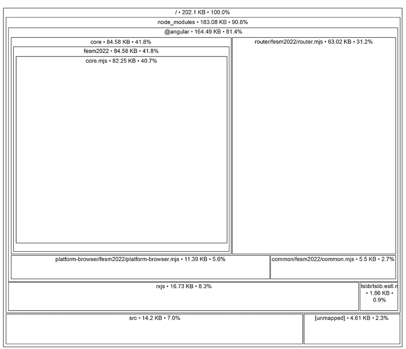

# 14

# 将应用程序推向生产

一个 Web 应用程序通常应该在 Web 上运行，并且任何人从任何地方都可以访问。它需要两个基本要素：一个托管应用程序的 Web 服务器和一个生产构建，以便将其部署到该服务器。在本章中，我们将关注食谱的第二部分。

简而言之，一个 Web 应用的生产构建是应用程序代码的优化版本，它更小、更快、性能更优。主要来说，这是一个将所有代码文件应用于优化技术，并将它们转换成一个单包文件的过程。

在前面的章节中，我们了解了构建 Angular 应用程序所涉及到的许多部分。我们只需要最后一块拼图，将所有部分连接起来，使我们的应用程序可供任何人使用，那就是构建它并将其部署到 web 服务器上。

在本章中，我们将学习以下概念：

+   构建 Angular 应用程序

+   限制应用程序包的大小

+   优化应用程序包

+   部署 Angular 应用程序

# 技术要求

本章包含各种代码示例，以指导您了解将应用程序推向生产的概念。

您可以在以下 GitHub 仓库的 `ch14` 文件夹中找到相关的源代码：

[`www.github.com/PacktPublishing/Learning-Angular-Fifth-Edition`](https://www.github.com/PacktPublishing/Learning-Angular-Fifth-Edition)

# 构建 Angular 应用程序

要构建 Angular 应用程序，我们使用以下 Angular CLI 命令：

```js
ng build 
```

构建过程启动 Angular 编译器，它主要收集我们应用程序代码中的所有 TypeScript 和 HTML 文件，并将它们转换为 JavaScript。CSS 样式表文件（如 SCSS）被转换为纯 CSS 文件。构建过程确保我们的应用程序在浏览器中的快速和最优渲染。

一个 Angular 应用程序包含各种 TypeScript 文件，这些文件在运行时通常不使用，例如单元测试或工具辅助程序。编译器通过读取 `tsconfig.app.json` 文件的 `files` 属性来确定哪些文件需要收集到构建过程中：

```js
{
  "extends": "./tsconfig.json",
  "compilerOptions": {
    "outDir": "./out-tsc/app",
    "types": []
  },
  **"files": [**
    **"src/main.ts"**
  **],**
  "include": [
    "src/**/*.d.ts"
  ]
} 
```

`src/main.ts` 文件是应用程序的主要入口点，它帮助 Angular 遍历我们应用程序需要的所有组件、服务和其它 Angular 元素。

`ng build` 命令的输出如下所示：

```js
Initial chunk files   | Names         |  Raw size | Estimated transfer size
main-N4USDVTP.js      | main          | 206.91 kB |                55.87 kB
polyfills-SCHOHYNV.js | polyfills     |  34.52 kB |                11.29 kB
styles-5INURTSO.css   | styles        |   0 bytes |                 0 bytes
                      | Initial total | 241.44 kB |                67.16 kB 
```

此输出显示了从构建 Angular 应用程序生成的 JavaScript 和 CSS 文件，即：

+   `main`：我们所编写的实际应用程序代码

+   `polyfills`：为旧浏览器提供的功能 polyfills

+   `styles`：我们应用程序的全局 CSS 样式

Angular 编译器将前面的文件输出到 `dist\appName\browser` 文件夹中，其中 `appName` 是应用程序名称。它还包含以下文件：

+   `favicon.ico`：Angular 应用程序的图标

+   `index.html`：Angular 应用程序的主要 HTML 文件

Angular CLI 的 `ng build` 命令可以在两种模式下运行：开发和生产。默认情况下，它以生产模式运行。要将其以开发模式运行，我们应该运行以下 Angular CLI 命令：

```js
ng build --configuration=development 
```

前面的命令将产生如下所示的输出：

```js
Initial chunk files | Names         | Raw size
main.js             | main          |  1.25 MB | 
polyfills.js        | polyfills     | 90.23 kB | 
styles.css          | styles        | 95 bytes | 
                    | Initial total |  1.35 MB 
```

在前面的输出中，您可能会注意到 `Initial chunk files` 的名称不包含哈希数字，这与生产构建的情况不同。在生产模式下，Angular CLI 对应用程序代码执行各种优化技术，例如图像优化和**即时编译**（**AOT**），以确保最终输出适合托管在 Web 服务器和生产环境中。添加到每个文件的哈希数字确保在部署应用程序的新版本时，浏览器的缓存会快速失效它们。

当我们在开发模式下运行 Angular CLI 的 `ng build` 命令时，我们使用了 `--configuration` 选项。`--configuration` 选项允许我们在不同的环境中运行 Angular 应用程序。我们将在下一节学习如何定义 Angular 环境。

## 为不同环境构建

一个组织可能希望为需要不同变量（如后端 API 端点和应用程序本地设置）的多个环境构建 Angular 应用程序。一个常见的用例是在部署到生产之前测试应用程序的预发布环境。

Angular CLI 允许我们为每个环境定义不同的配置，并使用每个配置构建我们的应用程序。我们可以使用以下语法在执行 `ng build` 命令时传递配置名称作为参数：

```js
ng build --configuration=name 
```

我们还可以在其他 Angular CLI 命令中传递配置，例如 `ng serve` 和 `ng test`。

我们可以使用以下 Angular CLI 命令来开始使用环境：

```js
ng generate environments 
```

此命令将在 Angular 项目中创建一个 `src\environments` 文件夹，其中包含以下文件：

+   `environment.ts`：应用程序的默认环境，在生产期间使用

+   `environment.development.ts`：开发期间使用的应用程序环境

它还会在 Angular 项目的 `angular.json` 配置文件中添加一个 `fileReplacements` 部分：

```js
"development": {
  "optimization": false,
  "extractLicenses": false,
  "sourceMap": true,
  **"fileReplacements": [**
    **{**
      **"replace": "src/environments/environment.ts",**
      **"with": "src/environments/environment.development.ts"**
    **}**
  **]**
} 
```

在前面的代码片段中，`fileReplacements` 属性定义了在执行 `build` 命令时的 `development` 环境中将替换默认环境文件的环境文件。如果我们运行 `ng build --configuration=development` 命令，Angular CLI 将将应用程序包中的 `environment.ts` 文件替换为 `environment.development.ts` 文件。

每个环境文件导出一个 `environment` 对象，其中我们可以定义额外的应用程序属性，例如后端 API 的 URL：

```js
export const environment = {
  **apiUrl: 'https://my-default-url'**
}; 
```

所有环境文件中必须定义导出对象的相同属性。

我们需要导入默认环境才能在 Angular 应用程序中访问环境属性。例如，要使用主应用程序组件中的`apiUrl`属性，我们应该这样做：

```js
import { Component } from '@angular/core';
import { RouterOutlet } from '@angular/router';
**import { environment } from '../environments/environment';**
@Component({
  selector: 'app-root',
  imports: [RouterOutlet],
  templateUrl: './app.component.html',
  styleUrl: './app.component.css'
})
export class AppComponent {
  title = 'my-app';
  **apiUrl = environment.apiUrl;**
} 
```

并非 Angular 应用程序中的所有库都可以像大多数 Angular 第一方库那样导入为 JavaScript 模块。在下一节中，我们将学习如何导入需要全局`window`对象的库。

## 为窗口对象构建

Angular 应用程序可能使用像**jQuery**这样的库，它必须附加到`window`对象上。其他库，如**Bootstrap**，包含字体、图标和 CSS 文件，这些文件必须包含在应用程序包中。

在所有这些情况下，我们需要告诉 Angular CLI 它们的存在，以便它可以将其包含在最终包中。

`angular.json`配置文件包含一个在`build`配置中的`options`对象，我们可以使用它来定义此类文件：

```js
"options": {
  "outputPath": "dist/my-app",
  "index": "src/index.html",
  "browser": "src/main.ts",
  "polyfills": [
    "zone.js"
  ],
  "tsConfig": "tsconfig.app.json",
  "assets": [
    {
      "glob": "**/*",
      "input": "public"
    }
  ],
  "styles": [
    "src/styles.css"
  ],
  "scripts": []
} 
```

`options`对象包含以下属性，我们可以使用它们：

+   `assets`：包含来自`public`文件夹的静态文件，如图标、字体和翻译。

+   `styles`：包含外部 CSS 样式表文件。默认情况下，应用程序的全局 CSS 样式表文件被包含在内。

+   `scripts`：包含外部 JavaScript 文件。

随着我们向 Angular 应用程序添加越来越多的功能，最终包的大小在某些时候会变得更大。在下一节中，我们将学习如何使用预算来减轻这种影响。

# 限制应用程序包的大小

作为开发者，我们总是希望为最终用户提供具有酷炫功能的令人印象深刻的程序。因此，我们最终会向我们的 Angular 应用程序添加越来越多的功能——有时根据规格，有时为了向用户提供额外的价值。然而，向 Angular 应用程序添加新功能会导致其大小增加，这可能在某些时候是不可接受的。为了克服这个问题，我们可以使用**预算**。

预算是我们可以在`angular.json`配置文件中定义的阈值，我们可以确保应用程序的大小不超过这些阈值。要设置预算，我们可以使用`build`命令中的`production`配置的`budgets`属性：

```js
"budgets": [
  {
    "type": "initial",
    "maximumWarning": "500kB",
    "maximumError": "1MB"
  },
  {
    "type": "anyComponentStyle",
    "maximumWarning": "4kB",
    "maximumError": "8kB"
  }
] 
```

Angular CLI 在创建新的 Angular CLI 项目时定义了前面的默认预算。

我们可以为不同类型定义预算，例如整个 Angular 应用程序或其某些部分。预算的阈值可以定义为字节、千字节、兆字节或其百分比。当达到或超过阈值定义的值时，Angular CLI 会显示警告或抛出错误。

为了更好地理解它，让我们描述前面的默认示例：

+   当 Angular 应用程序的大小超过`500` KB 时，会显示警告，当超过`1` MB 时，会显示错误。

+   当任何组件样式的尺寸超过`4` KB 时，会显示警告，当超过`8` KB 时，会显示错误。

要查看在配置 Angular 应用程序的预算时可以定义的所有可用选项，请查看官方文档网站上的指南：[`angular.dev/tools/cli/build/#configuring-size-budgets`](https://angular.dev/tools/cli/build/#configuring-size-budgets)。

当我们希望提供一种警报机制以应对 Angular 应用程序显著增长时，预算是非常有用的。然而，它们只是信息预防和措施的一个级别。在下一节中，我们将学习如何最小化我们的包大小。

# 优化应用程序包

正如在*构建 Angular 应用程序*部分中学到的，当我们构建 Angular 应用程序时，Angular CLI 会执行优化技术。在应用程序代码中执行的优化过程包括现代 Web 技术和工具，如下所示：

+   **压缩**：将多行源文件转换为单行，删除空白和注释。这是一个使浏览器能够更快地解析它们的进程。

+   **混淆**：将属性和方法重命名为非人类可读的形式，以便它们难以理解和用于恶意目的。

+   **打包**：将应用程序的所有源文件连接成一个单一的文件，称为包。

+   **摇树优化**：删除未使用的文件和 Angular 组件和服务等 Angular 工件，从而减小包的大小。

+   **字体优化**：在应用程序的主要 HTML 文件中内联外部字体文件，而不会阻塞渲染请求。它目前支持 Google Fonts 和 Adobe Fonts，并需要互联网连接来下载它们。

+   **构建缓存**：缓存之前的构建状态，并在我们运行相同的构建时恢复它，从而减少构建应用程序所需的时间。

如果在所有先前的优化技术之后，Angular 应用程序的最终包仍然很大，我们可以使用一个名为`source-map-explorer`的外部工具来调查原因。也许我们重复导入了 JavaScript 库或包含了一个未使用的文件。该工具分析我们的应用程序包，并以可视化的形式显示我们使用的所有 Angular 工件和库。要开始使用它，请按照以下步骤操作：

1.  从终端安装`source-map-explorer` npm 包：

    ```js
    npm install source-map-explorer --save-dev 
    ```

1.  构建您的 Angular 应用程序并启用源映射：

    ```js
    ng build --source-map 
    ```

1.  在`package.json`文件中添加以下脚本：

    ```js
    "scripts": {
      "ng": "ng",
      "start": "ng serve",
      "build": "ng build",
      "watch": "ng build --watch --configuration development",
      "test": "ng test",
      **"analyze": "source-map-explorer"**
    } 
    ```

1.  在`main`包文件上运行以下命令：

    ```js
    npm run analyze dist/my-app/browser/main*.js 
    ```

它将在浏览器中打开应用程序包的视觉表示：



图 14.1：源映射探索器输出

我们可以与之交互并检查它，以了解为什么我们的包仍然太大。一些可能的原因如下：

+   包中包含了一个库

+   包含了一个无法摇树优化的库，但当前并未使用

在我们构建 Angular 应用程序之后的最后一步是将它部署到 Web 服务器，正如我们将在下一节中学习的那样。

# 部署 Angular 应用

如果你已经有一个想要用于 Angular 应用的网络服务器，你可以将输出文件夹的内容复制到该服务器的一个路径。如果你想将其部署到根目录以外的其他文件夹，你可以按照以下方式更改主 HTML 文件中 `<base>` 标签的 `href` 属性：

+   在 `ng build` 命令中传递 `--base-href` 选项：

    ```js
    ng build --base-href=/mypath/ 
    ```

+   在 `angular.json` 配置文件的 `build` 命令中设置 `baseHref` 属性：

    ```js
    "options": {
      "outputPath": "dist/my-app",
      "index": "src/index.html",
      "browser": "src/main.ts",
      **"baseHref": "/mypath/"**,
      "polyfills": [
        "zone.js"
      ],
      "tsConfig": "tsconfig.app.json",
      "assets": [
        {
          "glob": "**/*",
          "input": "public"
        }
      ],
      "styles": [
        "src/styles.css"
      ],
      "scripts": []
    } 
    ```

如果你不想将其部署到自定义服务器，你可以使用 Angular CLI 工具将应用部署到支持的托管提供商，具体信息可以在[`angular.dev/tools/cli/deployment#automatic-deployment-with-the-cli`](https://angular.dev/tools/cli/deployment#automatic-deployment-with-the-cli) 找到。

# 摘要

Angular 应用的部署是最简单且最重要的部分，因为它最终使你的优秀应用对最终用户可用。毕竟，Web 应用都是关于向最终用户提供体验的。

在本章中，我们学习了如何构建 Angular 应用并将其准备好用于生产。我们还探讨了优化最终包的不同方法，并学习了如何将 Angular 应用部署到自定义服务器，手动和自动地部署到其他托管提供商。

在下一章，也就是本书的最后一章，我们将学习如何提高 Angular 应用的性能。
