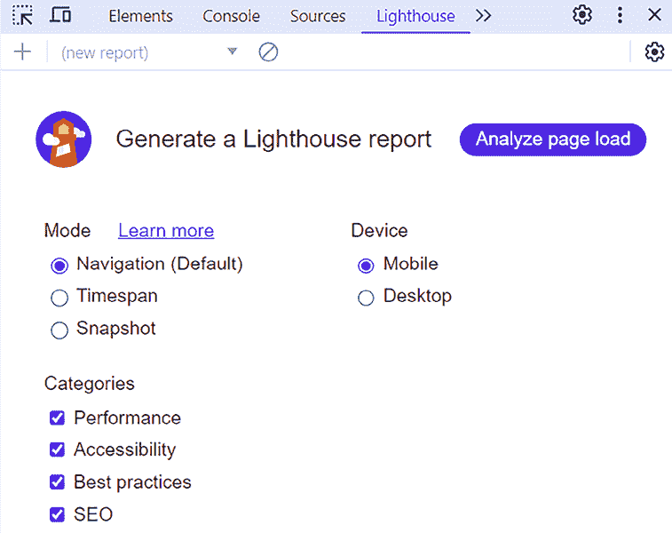
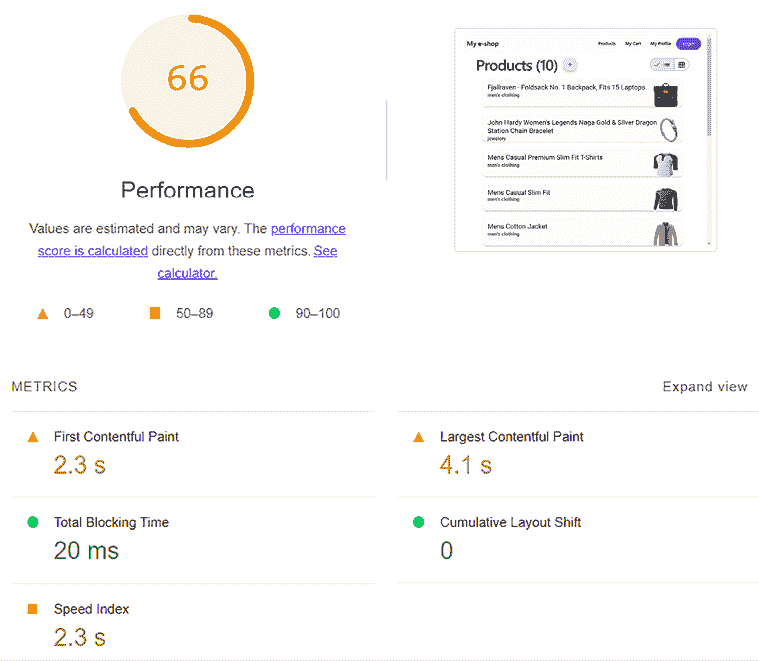
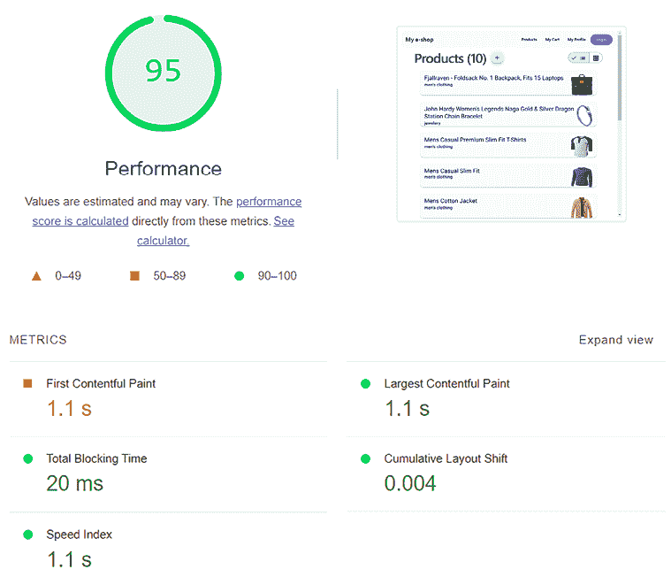
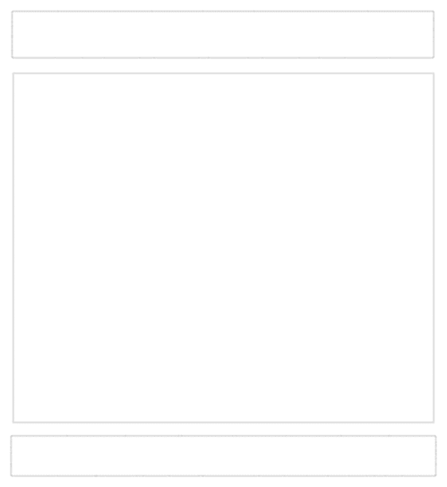

# 15

# 优化应用程序性能

作为开发人员和技术专业人士，我们在构建和部署 Angular 应用程序中发挥着至关重要的作用，确保它们的持续性能并提供卓越的用户体验。我们的努力对于应用程序的成功至关重要。

网络应用程序的行为以及它在运行时的表现是监控和优化的关键考虑因素。如果我们的应用程序开始退化，我们应该监控和衡量应用程序的性能。用于识别网络应用程序问题的最流行指标之一是**核心网页关键指标**（**CWV**）。

确定退化的原因后，我们可以应用各种优化技术。Angular 框架提供了各种工具来优化 Angular 应用程序，包括**服务器端渲染**（**SSR**）、图像优化和延迟视图加载。如果我们事先知道应用程序将具有高性能，那么在开发早期使用上述任何工具也是高度推荐的。

在本章中，我们将探讨以下关于优化的 Angular 概念：

+   介绍核心网页关键指标

+   渲染 SSR 应用程序

+   优化图像加载

+   延迟组件

+   预渲染 SSG 应用程序

# 技术要求

本章包含各种代码示例，以指导您了解优化 Angular 应用程序的概念。您可以在以下 GitHub 仓库的`ch15`文件夹中找到相关源代码：

[`github.com/PacktPublishing/Learning-Angular-Fifth-Edition`](https://github.com/PacktPublishing/Learning-Angular-Fifth-Edition)

# 介绍核心网页关键指标

CWV 是一组指标，帮助我们衡量网络应用程序的性能。它是**网页关键指标**（**Web Vitals**）的一部分，这是由 Google 领导的一项倡议，旨在统一各种用于衡量网页性能的指南和工具。每个指标都关注用户体验的特定方面，包括网页的加载、交互性和视觉稳定性：

+   **最大内容绘制**（**LCP**）：这通过计算页面上的最大元素渲染所需的时间来衡量网页的加载速度。快速的 LCP 值表示页面能够快速对用户可用。

+   **交互到下一次绘制**（**INP**）：这通过计算对用户交互做出响应并提供视觉反馈所需的时间来衡量网页的响应性。低 INP 值表示页面能够快速响应用户。

+   **累积布局偏移**（**CLS**）：这通过计算不想要的布局偏移发生的频率来衡量网页 UI 的稳定性。布局偏移通常发生在由于动态或异步加载而导致 HTML 元素在 DOM 中移动时。低 CLS 值表示页面在视觉上是稳定的。

    Web Vitals 包含额外的指标，通过测量更广泛或更专业的用户体验领域（如**首次内容渲染**（**FCP**）和**首次字节时间**（**TTFB**））来补充现有的 CWV 集。

每个 CWV 指标的值都落入以下类别：

+   **良好**（绿色）

+   **需要改进**（橙色）

+   **差**（红色）

您可以在[`web.dev/articles/vitals#core-web-vitals`](https://web.dev/articles/vitals#core-web-vitals)了解更多关于 CWV 类别及其阈值的信息。

我们可以通过以下方式测量 CWV：

+   **在生产环境中**：当 Web 应用在生产环境中运行时，我们可以使用**PageSpeed Insights**和**Chrome 用户体验报告**等工具。

+   **以编程方式在 JavaScript 中**：我们可以使用标准 Web API 或第三方库，如**web-vitals**。

+   **在实验室中**：在开发过程中构建 Web 应用时，我们可以使用**Chrome DevTools**和**Lighthouse**等工具。

在本章中，我们将学习如何使用 Chrome DevTools 来测量我们电商应用的性能：

1.  将*第十二章*，*Angular Material 简介*中的源代码复制到一个新文件夹中。

1.  在新文件夹内运行以下命令以安装包依赖项：

    ```js
    npm install 
    ```

1.  运行以下命令以启动 Angular 应用：

    ```js
    ng serve 
    ```

1.  打开**Google Chrome**并导航到`http://localhost:4200`。

1.  切换开发者工具并选择**Lighthouse**标签。Lighthouse 是一个用于测量网页各种性能方面的工具，包括 CWV。Google Chrome 内置了 Lighthouse 版本，我们可以用它来基准测试我们的应用：



图 15.1：Lighthouse 标签页

在前一张显示的屏幕上，我们可以通过选择各种选项（包括**设备**和**类别**部分）来生成 Lighthouse 性能报告。**设备**部分允许我们指定我们想要测量应用的环境。**类别**部分允许我们评估与 CWV 相关的不同指标，包括**性能**。

1.  在**设备**部分选择**桌面**选项，在**类别**部分仅检查**性能**选项，然后点击**分析页面加载**按钮：



图 15.2：Lighthouse 报告

在前一张图片中，我们可以看到 CWV 指标的单个得分和总体性能得分。

总体性能评分是一个估计值，可能会根据您计算机的能力或任何已安装的浏览器扩展程序而有所不同。最好在**隐身或私人**模式下运行基准测试，以模拟更接近真实世界场景的环境。

在以下章节中，我们将探讨通过应用 Angular 最佳实践来提高性能得分的方法。我们将从 SSR 开始。

# 渲染 SSR 应用

SSR 是一种在 Web 开发中提高应用程序性能和安全的技巧，以下是一些方式：

+   它通过在服务器上渲染应用程序并消除发送给客户端的初始 HTML 内容来提高加载性能。服务器将初始 HTML 发送给客户端，客户端可以在等待 JavaScript 内容下载的同时解析和加载。

+   它通过使应用程序可被发现和可由网络爬虫索引来提高 **搜索引擎优化**（ **SEO** ）。SEO 在第三方应用程序（如社交媒体平台）中共享时提供有意义的内。

+   它通过提高与加载速度和 UI 稳定性相关的 CWV 指标（如 LCP、FCP 和 CLS）来提高性能。

+   它通过向 Angular 应用程序添加 CSP nonces 来提高安全性。

正如我们在 *第一章* 中所看到的，*构建您的第一个 Angular 应用程序*，当我们使用 Angular CLI 创建新应用程序时，它会提示我们启用 SSR：

```js
Do you want to enable Server-Side Rendering (SSR) and Static Site Generation (SSG/Prerendering)? (y/N) 
```

在我们的案例中，我们已经使用 Angular CLI 创建了一个 Angular 应用程序。要在现有的 Angular 应用程序中添加 SSR，请在 Angular CLI 工作区内的终端窗口中运行以下命令：

```js
ng add @angular/ssr 
```

上述命令将询问我们以下问题：

```js
Would you like to use the Server Routing and App Engine APIs (Developer Preview) for this server application? (y/N) 
```

通过按 *Enter* 键接受默认值 `No`，Angular CLI 将提示我们安装 `@angular/ssr` npm 包。

**开发者预览** 中的功能意味着它尚未准备好用于生产，但您可以在开发环境中对其进行测试。

安装完成后，Angular CLI 将创建以下文件：

+   `main.server.ts`：这是在服务器上使用特定配置启动应用程序的文件。

+   `app.config.server.ts`：这包含在服务器上渲染的应用程序的配置。它导出一个 `config` 变量，其中包含客户端和服务器应用程序配置文件的合并版本。

+   `server.ts`：它配置并启动一个 Node.js **Express** 服务器，在服务器上渲染 Angular 应用程序。它使用 `@angular/ssr` 包中的 `CommonEngine` 类来启动 Angular 应用程序。

此外，该命令将在 Angular CLI 工作区中进行以下修改：

+   它将在 `angular.json` 文件的 `build` 部分中添加必要的选项，以在 SSR 和 SSG 中运行 Angular 应用程序。

+   它将在 `tsconfig.app.json` 文件的 `files` 和 `types` 属性中添加必要的条目，以便 TypeScript 编译器可以识别为服务器创建的文件。

+   它将在 `package.json` 文件中添加必要的脚本和依赖项。

+   在 `src\app\app.config.ts` 文件中添加 `provideClientHydration` 以启用 Angular 应用程序中的 ** hydration **。Hydration 是将服务器端渲染的应用程序恢复到客户端的过程。我们将在本章后面了解更多关于 hydration 的内容。

现在我们已经在我们的应用程序中安装了 Angular SSR，让我们看看如何使用它：

1.  打开 `app.config.ts` 文件，并按如下方式修改 `@angular/common/http` 命名空间的 `import` 语句：

    ```js
    import { provideHttpClient, **withFetch** } from '@angular/common/http'; 
    ```

`withFetch` 方法用于配置 Angular HTTP 客户端，使其使用原生的 `fetch` API 进行请求。

强烈建议为使用 SSR 的应用程序启用 `fetch`，以获得更好的性能和兼容性。

1.  在 `provideHttpClient` 方法中将 `withFetch` 方法作为参数传递：

    ```js
    provideHttpClient(**withFetch()**) 
    ```

1.  运行以下命令以构建 Angular 应用程序：

    ```js
    ng build 
    ```

前一个命令在 `dist\my-app` 文件夹内生成 `browser` 和 `server` 打包，并预渲染静态路由。我们将在 *预渲染 SSG 应用程序* 部分了解更多关于预渲染的内容。

1.  运行以下命令以运行 SSR 应用程序：

    ```js
    npm run serve:ssr:my-app 
    ```

前一个命令将在本地端口 `4000` 启动 Express 服务器并服务 SSR 应用程序。

1.  打开 Google Chrome 并导航到 `http://localhost:4000`。你应该在网页上看到电子商务应用程序。

1.  重复上一节中我们学习的过程，使用 Lighthouse 运行性能基准测试。整体得分和 CWV 指标应该有显著提升：



图 15.3：Lighthouse 报告（SSR）

通过在我们的 Angular 应用程序中安装 SSR，我们的应用程序性能提高了超过 20%！正如我们将在本章后面学到的那样，我们可以应用各种 Angular 技巧来进一步提高性能。

当我们需要从服务器获取数据并在网站上静态显示时，Angular SSR 是一个很好的选择。然而，在某些情况下，SSR 并没有好处，例如当应用程序基于数据输入并且有很多用户输入时。

在下一节中，我们将学习如何覆盖 SSR 或完全跳过 Angular 应用程序的部分。

## 在 Angular 应用程序中覆盖 SSR

湿化是 Angular SSR 应用程序默认启用的一个重要功能。它通过有效地处理客户端上 DOM 的创建来提高应用程序的整体性能。客户端可以重用服务器端渲染应用程序的 DOM 结构，而不是从头创建它并强制 UI 闪烁，这会影响 CWV 指标，如 LCP 和 CLS。以下情况下， hydration 过程将失败：

+   当我们尝试通过原生浏览器 API（如 `window` 或 `document`）直接或使用第三方库来操作 DOM 时

+   当我们的组件模板没有有效的 HTML 语法时

我们可以通过应用以下最佳实践来克服上述问题：

+   在与 DOM 交互之前，使用 Angular API 检测我们的应用程序正在运行的平台。

+   跳过特定 Angular 组件的 hydration

让我们通过一个示例来看看如何同时使用这两个功能：

1.  运行上一节中显示的 Angular 应用程序的 SSR 版本。

1.  注意在应用程序页脚中显示的文本：

**- v1.0**

版权信息显示不正确。

1.  打开`copyright.directive.ts`文件并关注`constructor`代码：

    ```js
    constructor(el: ElementRef) {
      const currentYear = new Date().getFullYear();
      const targetEl: HTMLElement = el.nativeElement;
      targetEl.classList.add('copyright');
      targetEl.textContent = `Copyright ©${currentYear} All Rights Reserved`;
    } 
    ```

前面的代码使用`nativeElement`属性通过添加 CSS 类和设置 HTML 元素的`textContent`来操作 DOM。然而，正如之前提到的，这段代码破坏了我们的应用程序，因为服务器上没有 DOM。让我们来修复它！

1.  打开`app.component.html`文件，并在`<footer>`HTML 标签的`<mat-toolbar>`元素上添加`ngSkipHydration`属性：

    ```js
    <footer>
      <mat-toolbar **ngSkipHydration**>
        <mat-toolbar-row>
          <span appCopyright> - v{{ settings.version }}</span> 
        </mat-toolbar-row>
      </mat-toolbar>
    </footer> 
    ```

    `ngSkipHydration`是一个 HTML 属性，而不是 Angular 指令。它只能在其他 Angular 组件中使用，不能用于原生 HTML 元素。如果我们将其添加到`<footer>`标签中，则不会起作用。

在前面的代码片段中，`<mat-toolbar>`组件及其子组件将不会被水合。这实际上意味着当 SSR 版本的应用程序准备就绪时，Angular 将从头开始创建它们。

1.  再次运行步骤 1，并观察应用程序页脚中的输出：

**版权所有 ©2024 保留所有权利 - v1.0**

跳过水合应该被视为一种权宜之计。我们暂时在无法启用水合的情况下使用它。建议重构你的代码，以便你的应用程序能够从水合功能中受益。

另一种更好方法是重构我们的代码，使其有条件地执行客户端代码：

1.  按照以下方式修改`copyright.directive.ts`文件中的`import`语句：

    ```js
    **import { isPlatformBrowser } from '@angular/common';**
    import { Directive, ElementRef, **inject, OnInit, PLATFORM_ID** } from '@angular/core'; 
    ```

`PLATFORM_ID`是一个`InjectionToken`，它指示我们的应用程序当前正在运行的平台类型。`isPlatformBrowser`函数检查给定的平台 ID 是否为浏览器。

将`OnInit`接口添加到`CopyrightDirective`类的实现接口列表中：

```js
export class CopyrightDirective **implements OnInit** 
```

1.  添加以下类属性：

    ```js
    private platform = inject(PLATFORM_ID);
    private el = inject(ElementRef); 
    ```

1.  删除`constructor`并添加以下`ngOnInit`方法：

    ```js
    ngOnInit(): void {
      if (isPlatformBrowser(this.platform)) {
        const currentYear = new Date().getFullYear();
        const targetEl: HTMLElement = this.el.nativeElement;
        targetEl.classList.add('copyright');
        targetEl.textContent = `Copyright ©${currentYear} All Rights Reserved ${targetEl.textContent}`;
      }
    } 
    ```

`isPlatformBrowser`函数接受平台 ID 作为参数。

Angular 还提供了`isPlatformServer`函数，它是`isPlatformBrowser`函数的对立面，用于检查当前平台是否为服务器。

1.  以服务器端模式构建和运行应用程序，以验证版权信息是否仍然可见。

总结来说，建议你在整个应用程序中使用 Angular SSR，并对必须在浏览器上运行的代码部分进行重构。这将使你能够享受到服务器端渲染应用程序的所有好处。

在前面的章节中，我们展示了将 SSR 添加到 Angular 应用程序中可以显著提高其整体性能评分。正如我们将在下一节中学习的，通过应用优化技术到产品图片，我们可以做得更好。

# 优化图片加载

产品列表是我们应用程序的着陆组件，它会在列表中显示每个产品的图像。在 Angular 应用程序中图像的加载方式可能会影响 CWV 指标，如 LCP 和 CLS。我们的应用程序目前以从 Fake Store API 收到的形式加载图像。然而，我们可以在加载图像时使用特定的 Angular 工具来强制执行最佳实践。

Angular 框架为我们提供了 `NgOptimizedImage` 指令，我们可以将其附加到 `` HTML 元素上：

1.  打开 `product-list.component.ts` 文件，并从 `@angular/common` npm 包中导入 `NgOptimizedImage` 类：

    ```js
    import { AsyncPipe, CurrencyPipe, **NgOptimizedImage** } from '@angular/common'; 
    ```

1.  在 `@Component` 装饰器的 `imports` 数组中添加 `NgOptimizedImage` 类：

    ```js
    @Component({
      selector: 'app-product-list',
      imports: [
        SortPipe,
        AsyncPipe,
        CurrencyPipe,
        RouterLink,
        MatMiniFabButton,
        MatIcon,
        MatCardModule,
        MatTableModule,
        MatButtonToggle,
        MatButtonToggleGroup,
        **NgOptimizedImage**
      ],
      templateUrl: './product-list.component.html',
      styleUrl: './product-list.component.css'
    }) 
    ```

1.  打开 `product-list.component.html` 文件，并将 `src` 属性的绑定替换为 `ngSrc` 指令：

    ```js
    <mat-card-title-group>
      <mat-card-title>{{ product.title }}</mat-card-title>
      <mat-card-subtitle>{{ product.category }}</mat-card-subtitle>
      
    </mat-card-title-group> 
    ```

`ngSrc` 指令在加载图像时不足以防止布局偏移。我们还必须通过定义 `width`、`height` 或 `fill` 属性来设置图像大小。在这种情况下，我们将使用后者，因为并非所有产品的图像大小都相同：

```js
 
```

1.  打开 `product-list.component.css` 文件，并添加以下 CSS 样式以将图像定位在容器的右上角：

    ```js
    img {
      object-fit: contain;
      object-position: right 5px top 0;
    } 
    ```

1.  运行以下命令以启动应用程序：

    ```js
    ng serve 
    ```

1.  导航到 `http://localhost:4200` 并验证产品列表是否正确显示。

使用 `NgOptimizedImage` 指令获得的好处不会立即在 UI 中显现。该指令在后台工作，并自动通过以下方式提高 CWV 的 LCP 指标：

+   在 `` HTML 元素上设置获取优先级

+   懒加载图像

+   在 SSR 的情况下设置 `preconnect` 链接标签和预加载提示

+   为响应式图像生成 `srcset` 属性

此外，它还帮助开发者遵循有关图像加载的最佳实践，例如：

+   如果事先知道图像大小，则设置图像大小

+   通过 CDN 加载图像

+   在控制台窗口中显示针对不同指标的适当警告

`NgOptimizedImage` 指令包含许多其他我们可以启用的功能，以实现强大的性能改进，例如设置图像加载器、使用占位符以及定义优先加载的图像。更多信息请参阅 [`angular.dev/guide/image-optimization`](https://angular.dev/guide/image-optimization) 。

我们已经学习了各种提高应用程序性能的工具。其中最有效的工具之一是**可延迟视图**，我们将在下一节中学习。

# 延迟组件

介绍新的控制流语法使 Angular 能够在框架中集成新的原语，从而提高了 Angular 应用程序的用户体验、开发体验和性能。其中一个这样的原语是可延迟视图，它允许懒加载 Angular 组件及其依赖项。

## 介绍可延迟视图

我们已经学习了如何使用 Angular 路由根据特定路由懒加载组件。可延迟视图提供了一个新的 API，补充了前面的 API。结合懒加载路由可以保证开发高性能和强大的 Web 应用程序。可延迟视图允许我们根据事件或组件状态懒加载组件，并具有以下特性：

+   它们易于使用，并且易于理解封装的代码

+   我们以声明式的方式定义它们

+   它们最小化了初始应用程序加载和最终包的大小，提高了 CWV 指标，如 LCP 和 TTFB

每个可延迟视图都被分割成单独的块，类似于由懒加载路由生成的单个块文件。它们由以下 HTML 块组成：

+   `@defer`：指示将要加载的 HTML 内容。

+   `@placeholder`：指示在 `@defer` 块开始加载之前显示的 HTML 内容。它在应用程序通过慢速网络加载或我们想要避免 UI 闪烁时特别有用。

+   `@loading`：指示在 `@defer` 块加载时可见的 HTML 内容。

+   `@error`：指示在 `@defer` 块加载时发生错误时显示的 HTML 内容。

我们将在下一节学习如何使用每个块。

## 使用可延迟块

我们将通过创建一个组件来在我们的电子商务应用中集成可延迟视图，该组件将显示来自 Fake Store API 的特色产品，而这些产品目前不在产品列表中。让我们开始：

1.  运行以下命令来创建新的组件：

    ```js
    ng generate component featured 
    ```

1.  打开 `products.service.ts` 文件，并添加以下方法，该方法从 Fake Store API 获取 ID 为 `20` 的特定产品：

    ```js
    getFeatured(): Observable<Product> {
      return this.http.get<Product>(this.productsUrl + '/20');
    } 
    ```

1.  打开 `featured.component.ts` 文件，并按照以下方式修改 `import` 语句：

    ```js
    import { Component, **OnInit** } from '@angular/core';
    **import { CommonModule } from '@angular/common';**
    **import { MatButton } from '@angular/material/button';**
    **import { MatCardModule } from '@angular/material/card';**
    **import { Observable } from 'rxjs';**
    **import { Product } from '../product';**
    **import { ProductsService } from '../products.service';** 
    ```

1.  按照以下方式修改 `@Component` 装饰器的 `imports` 数组：

    ```js
    @Component({
      selector: 'app-featured',
      imports: [**CommonModule, MatButton, MatCardModule**],
      templateUrl: './featured.component.html',
      styleUrl: './featured.component.css'
    }) 
    ```

1.  按照以下方式修改 `FeaturedComponent` 类：

    ```js
    export class FeaturedComponent implements **OnInit** {
      **product$: Observable<Product> | undefined;**

      **constructor(private productService: ProductsService) {}**
      **ngOnInit() {**
        **this.product$ = this.productService.getFeatured();**
      **}**
    } 
    ```

在前面的 TypeScript 类中，我们已经声明了 `product$` 可观察对象，并将其分配给 `ProductsService` 类中 `getFeatured` 方法的返回值。

1.  打开 `featured.component.html` 文件，并用以下 HTML 代码替换其内容：

    ```js
    @if (product$ | async; as product) {
      <mat-card>
        <mat-card-header>
          <mat-card-title>MEGA DEAL</mat-card-title>
          <mat-card-subtitle>{{ product.title }}</mat-card-subtitle>
        </mat-card-header>
        
        <mat-card-actions>
          <button mat-flat-button color="primary">Buy now</button>
        </mat-card-actions>
      </mat-card>
    } 
    ```

在前面的代码片段中，我们使用 `async` 管道在 `@if` 块内部订阅 `product$` 可观察对象。该块的 HTML 内容以 Angular Material 卡组件的形式显示产品详情。

1.  打开 `featured.component.css` 文件，并为卡片和按钮组件添加以下 CSS 样式：

    ```js
    mat-card {
      max-width: 350px;
    }
    button {
      width: 100%;
    } 
    ```

新的 Angular 组件已经就位。我们必须将其添加到应用程序的主组件中，并使用 `@defer` 块来加载它：

1.  打开 `app.component.ts` 文件，并添加以下 `import` 语句：

    ```js
    import { FeaturedComponent } from './featured/featured.component'; 
    ```

1.  在 `@Component` 装饰器的 `imports` 数组中添加 `FeaturedComponent` 类：

    ```js
    @Component({
      selector: 'app-root',
      imports: [
        RouterOutlet,
        RouterLink,
        CopyrightDirective,
        AuthComponent,
        MatToolbarRow,
        MatToolbar,
        MatButton,
        MatBadge,
        **FeaturedComponent**
      ],
      templateUrl: './app.component.html',
      styleUrl: './app.component.css'
    }) 
    ```

1.  打开 `app.component.html` 文件，并在 `<main>` HTML 标签内添加 `<app-featured>` 组件：

    ```js
    <main class="main">
      <div class="content">
        <router-outlet />
      </div>
      **@defer() {**
        **<app-featured />**
      **}**
    </main> 
    ```

在前面的代码片段中，我们使用`@defer`块通过自闭合标签语法声明了`<app-featured>`组件。

1.  运行`ng serve`命令以启动应用程序，并在终端窗口中观察**懒加载文件**部分：

    ```js
    Lazy chunk files     | Names              |  Raw size
    chunk-OP24QI45.mjs   | featured-component |   2.88 kB | 
    chunk-4T4L5V7V.mjs   | user-routes        |   1.19 kB | 
    ```

特色组件的源代码被分割成一个块文件。

1.  导航到`http://localhost:4200`并观察产品列表右侧的新组件：


图 15.4：特色产品

尝试重新加载浏览器，您将注意到在加载特色产品时会出现 UI 闪烁。我们将使用`@placeholder`块在特色组件开始加载之前显示轮廓图像：

1.  将*技术要求*部分中描述的 GitHub 仓库的`public`文件夹中的`placeholder.png`图像复制到您的工作空间相应文件夹中。

1.  在`@defer`块之后添加一个`@placeholder`块，如下所示：

    ```js
    @defer() {
      <app-featured />
    } **@placeholder(minimum 1s) {**
      ****
    **}** 
    ```

`@placeholder`块接受一个可选参数，定义占位符将可见的最短时间。在这种情况下，我们定义的最短时间为`1`秒。

1.  使用`ng serve`命令运行应用程序，并验证在内容加载前，以下占位图是否可见 1 秒钟：



图 15.5：占位图

另一种方法是在`@loading`块中使用，并在特色组件加载时显示一个加载指示器，例如一个旋转器：

1.  打开`app.component.ts`文件并添加以下`import`语句：

    ```js
    import { MatProgressSpinner } from '@angular/material/progress-spinner'; 
    ```

`MatProgressSpinner`类是 Angular Material 库中的一个旋转器组件。

1.  在`@Component`装饰器的`imports`数组中添加`MatProgressSpinner`类：

    ```js
    @Component({
      selector: 'app-root',
      imports: [
        RouterOutlet,
        RouterLink,
        CopyrightDirective,
        AuthComponent,
        MatToolbarRow,
        MatToolbar,
        MatButton,
        MatBadge,
        FeaturedComponent,
        **MatProgressSpinner**
      ],
      templateUrl: './app.component.html',
      styleUrl: './app.component.css'
    }) 
    ```

1.  在`app.component.html`文件中添加`@loading`块，如下所示：

    ```js
    @defer() {
      <app-featured />
    } **@loading(minimum 1s) {**
      **<mat-spinner ngSkipHydration></mat-spinner>**
    **}** 
    ```

`@loading`块接受与`@placeholder`块相同的可选参数。在这种情况下，我们至少显示旋转器组件`1`秒。

我们添加了`ngSkipHydration`属性，因为旋转器组件与浏览器 DOM 交互，不能进行水合。

1.  如果我们使用`ng serve`命令运行应用程序，我们应该在特色组件加载时看到一个旋转指示器，持续 1 秒钟。

可延迟视图中的`@error`块与`@placeholder`和`@loading`块的工作方式类似。当加载`@defer`块内容时发生错误，其中的 HTML 内容将可见：

```js
@defer() {
  <app-featured />
} @placeholder(minimum 1s) {
  
} **@error() {**
  **<span>An error occurred while loading the featured product</span>**
**}** 
```

正如我们所见，`@defer`块的内容在所属组件渲染时立即开始加载。然而，可延迟视图 API 为我们提供了便于控制块何时加载的工具，我们将在下一节中看到。

## 在`@defer`块中加载模式

使用**触发器**和**预取**机制，我们可以控制`@defer`块何时以及如何加载：

+   触发器定义了块的内容何时开始加载

+   Prefetch 定义了 Angular 是否会在需要时预先获取内容，以便它们在需要时可用

我们可以在`@defer`块内部使用`on`关键字和触发器的名称来定义一个触发器作为可选参数：

```js
@defer(**on viewport**) {
  <app-featured />
} @placeholder(minimum 1s) {
  
} @error() {
  <span>An error occurred while loading the featured product</span>
} 
```

Angular 框架包含以下内置触发器：

+   `viewport`：这将触发当内容进入浏览器**视口**时，即当前可见的浏览器部分。

你可以在[`developer.mozilla.org/docs/Glossary/Viewport`](https://developer.mozilla.org/docs/Glossary/Viewport)上了解更多关于视口的信息。

+   `interaction`：这将触发当用户与内容交互时。

+   `hover`：这将触发当用户将鼠标悬停在内容覆盖的区域上时。

+   `idle`：这将触发当浏览器进入一个**空闲**状态时，这是可延迟视图的默认行为。浏览器空闲状态由原生的`requestIdleCallback` API 触发。

你可以在[`developer.mozilla.org/docs/Web/API/Window/requestIdleCallback`](https://developer.mozilla.org/docs/Web/API/Window/requestIdleCallback)上了解更多关于空闲状态的信息。

+   `immediate`：这将触发当客户端渲染页面时。

不使用块与使用`immediate`触发器之间的区别在于，我们可以从可延迟视图的代码拆分功能中受益，并向客户端交付更少的 JavaScript。

+   `timer`：这将触发在指定持续时间后执行块。持续时间是`timer`函数的必需参数：

    ```js
    @defer(**on timer(2s)**) {
      <app-featured />
    } 
    ```

+   在前面的代码片段中，将在`2`秒后开始加载特色组件。

通过组合触发器，我们可以实现更好的加载粒度：

```js
@defer(**on timer(2s); on idle**) {
  <app-featured />
} 
```

在前面的代码片段中，将在浏览器处于`idle`状态或`2`秒后加载特色组件。

除了内置触发器之外，我们可以使用`when`关键字自己创建自定义触发器。`when`关键字后面跟着一个评估为布尔值的表达式：

```js
@defer(**when isActive === true**) {
  <app-featured />
} 
```

在前面的代码片段中，当`isActive`组件属性为`true`时，将加载特色组件。

可延迟视图中的触发器是强大且人性化的工具，可以在速度和性能上带来惊人的结果。当与预取结合使用时，它们可以在 Angular 应用程序中实现巨大的性能提升。预取允许我们指定可以预取可延迟视图以备需要时使用的条件。预取支持所有可延迟视图的内置触发器：

```js
@defer(on timer(2s); **prefetch on idle**) {
  <app-featured />
} 
```

在前面的代码片段中，当浏览器处于`idle`状态时，将预取内容，并在`2`秒后加载。它还可以使用`when`关键字定义预取内容的时间，或创建自定义触发器。

触发和预取允许我们创建加载可延迟视图的复杂场景。可延迟视图 API 提供的灵活性使其成为开发高度复杂和性能卓越的 Angular 应用程序的有用工具。

不应将可延迟视图用于必须立即渲染的内容。

在下一节中，我们将结束使用 Angular SSG 优化应用程序性能的旅程。

# 预渲染 SSG 应用程序

SSG 或构建时预渲染是创建 Angular 应用程序的静态生成 HTML 文件的过程。当我们使用 `ng build` Angular CLI 命令构建 Angular SSR 应用程序时，它默认发生。

SSG 应用程序的主要好处是它不需要在每个请求之间在服务器和客户端之间进行往返。相反，每个页面都作为静态内容提供，消除了 TTFB CWV 指标所衡量的应用程序加载时间。

在 *渲染 SSR 应用程序* 部分，Angular CLI 构建命令的输出包括以下信息：

```js
Prerendered 4 static routes. 
```

让我们看看 SSG 的工作原理以及前面的输出意味着什么：

1.  运行以下命令来构建 Angular 应用程序：

    ```js
    ng build 
    ```

1.  `ng build` 命令将创建 `dist\my-app\browser` 文件夹。

前面的文件夹不应与构建非 SSR Angular 应用程序时生成的 `browser` 文件夹混淆。

1.  导航到 `dist\my-app` 文件夹并打开 `prerendered-routes.json` 文件：

    ```js
    {
      "routes": [
        "/cart",
        "/products",
        "/products/new",
        "/user"
      ]
    } 
    ```

它列出了 Angular SSG 预渲染的应用程序路由。它还在 `browser` 文件夹内为每个路由创建了一个文件夹和 `index.html` 文件。

1.  打开 `products\index.html` 文件，你会看到 Angular 已经添加了所有 CSS 和 HTML 文件，并且它甚至已经渲染了从 Fake Store API 获取的产品数据。

1.  要预览 SSG 的工作方式，运行 `ng serve` 命令以启动应用程序，并导航到 `http://localhost:4200/products`。产品列表会立即加载，无需等待应用程序从 Fake Store API 获取数据。

`ng serve` 命令提供我们应用程序的 SSG 版本，因为它在底层执行 `ng build` 命令。要禁用 SSG，打开 `angular.json` 文件，并在 `build` 部分将 `prerender` 属性设置为 `false`。

在 Angular SSR 应用程序中，SSG 默认启用，可以显著提高它们的加载时间和运行时性能。对于性能较差的低端设备尤其有用。

# 摘要

在本章中，我们学习了不同的方法来优化和改进 Angular 应用程序的性能。我们介绍了 CWV 的概念以及它如何影响 Web 应用程序。我们探讨了如何使用 Angular 应用程序中的 SSR 和激活来测量和改进 CWV 指标。我们还研究了性能优化的不同方面，例如 `NgOptimizedImage` 指令和可延迟视图。最后，我们概述了 Angular 应用程序中的 SSG。

我们的 Angular 框架之旅以本章结束。然而，我们能做的事情的可能性是无限的。Angular 框架在每次发布中都更新了新功能，为网络开发者提供了强大的日常开发工具。我们很高兴您能加入我们，并希望这本书能帮助您拓宽对使用如此优秀工具所能实现的事情的看法！

# 加入我们的 Discord

加入我们社区的 Discord 空间，与作者和其他读者进行讨论：

[`packt.link/LearningAngular5e`](https://packt.link/LearningAngular5e)


[packt.com](https://www.packt.com)

订阅我们的在线数字图书馆，全面访问超过 7,000 本书籍和视频，以及领先的行业工具，帮助您规划个人发展并推进您的职业生涯。更多信息，请访问我们的网站。

# 为什么订阅？

+   使用来自 4,000 多名行业专业人士的实用电子书和视频，节省学习时间，多花时间编码

+   使用专为您量身定制的技能计划提高您的学习效果

+   每月免费获得一本电子书或视频

+   完全可搜索，便于轻松访问关键信息

+   复制粘贴、打印和收藏内容

在[www.packt.com](https://www.packt.com) ，您还可以阅读一系列免费的技术文章，注册各种免费通讯，并享受 Packt 书籍和电子书的独家折扣和优惠。

# 你可能还会喜欢的其他书籍

如果你喜欢这本书，你可能对 Packt 的这些其他书籍也感兴趣：


**有效的 Angular**

Roberto Heckers

ISBN: 978-1-80512-553-2

+   创建可以处理数百个 Angular 应用程序的 Nx 单仓库

+   使用独立的 API、注入函数、控制流和信号在 Angular 中降低复杂性

+   使用信号、RxJS 和 NgRx 有效地管理应用程序状态

+   使用投影、TemplateRef 和延迟块构建动态组件

+   使用 Cypress 和 Jest 在 Angular 中执行端到端和单元测试

+   优化 Angular 性能，防止不良做法，并自动化部署


**使用 RxJS 和 Angular 信号构建响应式模式**

Lamis Chebbi

ISBN: 978-1-83508-770-1

+   掌握 RxJS 核心概念，如 Observables、subjects 和 operators

+   在响应式模式中使用宝石图

+   深入研究流式处理，包括转换和组合它们

+   使用 RxJS 和最佳实践了解内存泄漏问题，并避免它们

+   使用 Angular 信号和 RxJS 构建响应式模式

+   探索针对 RxJS 应用程序的不同测试策略

+   发现 RxJS 中的多播及其如何解决复杂问题

+   使用 RxJS 和 Angular 的最新功能构建完整的响应式 Angular 应用程序

[(https://www.packtpub.com/en-us/product/angular-for-enterprise-applications-9781805125037)]

**《企业级应用 Angular，第三版》**

杜古汉·乌卢卡

ISBN: 978-1-80512-712-3

+   架构和领导企业级项目的最佳实践

+   交付 Web 应用的极简主义、价值优先方法

+   Angular 中独立组件、服务、提供者、模块、懒加载和指令是如何工作的

+   使用 Signals 或 RxJS 管理你的应用数据响应性

+   使用 NgRx 为你的 Angular 应用进行状态管理

+   使用 Angular 生态系统构建和交付企业级应用

+   自动化测试和 CI/CD 以交付高质量应用

+   认证和授权

+   使用 REST 和 GraphQL 构建基于角色的访问控制

# Packt 正在寻找像你这样的作者

如果你对成为 Packt 的作者感兴趣，请访问 [authors.packtpub.com](https://authors.packtpub.com) 并今天申请。我们已与成千上万的开发者和技术专业人士合作，就像你一样，帮助他们将见解分享给全球技术社区。你可以提交一个一般性申请，申请我们正在招募作者的特定热门话题，或者提交你自己的想法。

# 分享你的想法

现在你已经完成了 *《学习 Angular，第五版》*，我们很乐意听听你的想法！如果你在亚马逊购买了这本书，请[点击此处直接进入该书的亚马逊评论页面](https://packt.link/r/1835087485)并分享你的反馈或在该网站上留下评论。

你的评论对我们和整个技术社区都很重要，并将帮助我们确保我们提供高质量的内容。
