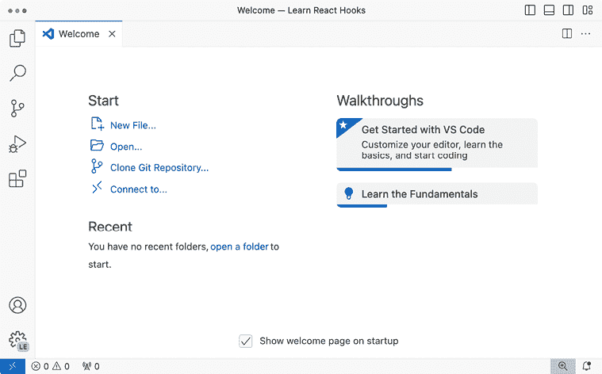
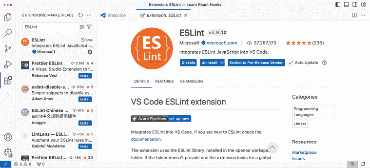
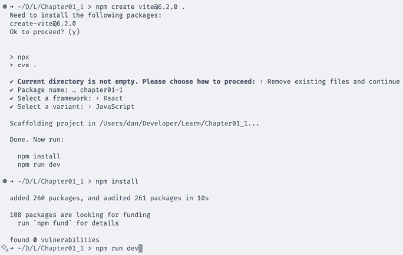
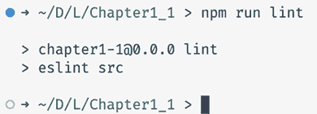
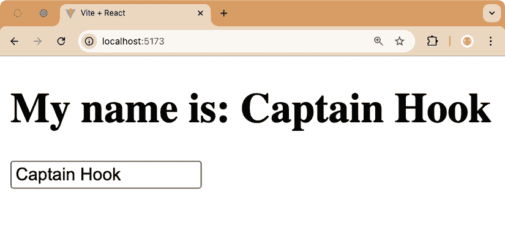

# 第一章：介绍 React 和 React Hooks

React 是一个用于构建高效和可扩展 Web 应用的 JavaScript 库。React 由 Meta 开发，并被用于许多大型 Web 应用程序中，如 Facebook、Instagram、Netflix、Shopify、Airbnb、Cloudflare 和 BBC。

在本书中，我们将学习如何使用 React 构建复杂且高效的用户界面，同时保持代码简单和可扩展。通过 React Hooks 的范式，我们可以极大地简化处理 Web 应用程序中的状态和副作用，确保应用程序未来有增长和扩展的潜力。我们还将了解 **React Context**、**React Suspense** 和 **表单操作**，以及它们如何与 Hooks 一起使用。最后，我们将学习如何构建自己的 Hooks 以及如何将现有应用程序从 React 类组件迁移到基于 React Hooks 的架构。

在本章中，我们将学习 React 和 React Hooks 的基本原理。我们将从了解 React 和 React Hooks 是什么以及为什么我们应该使用它们开始。然后，我们将继续学习 Hooks 的内部工作原理。最后，您将了解 React 提供的 Hooks 以及社区提供的几个 Hooks，例如数据获取和路由 Hooks。通过学习 React 和 React Hooks 的基础知识，我们将更好地理解本书中将要介绍的概念。

在本章中，我们将涵盖以下主要主题：

+   React 原理

+   使用 React Hooks 的动机

+   设置开发环境

+   开始使用 React Hooks

# 技术要求

应该已经安装了相当新版本的 Node.js。Node 包管理器 (`npm`) 也需要安装（它应该随 Node.js 一起安装）。有关如何安装 Node.js 的更多信息，请查看他们的官方网站：[`nodejs.org/`](https://nodejs.org/).

在本书的指南中，我们将使用 **Visual Studio Code** （**VS Code**），但所有内容在任何其他编辑器中都应该类似。有关如何安装 VS Code 的更多信息，请参阅他们的官方网站：[`code.visualstudio.com`](https://code.visualstudio.com).

在本书中，我们使用以下版本：

+   Node.js v22.14.0

+   `npm` v10.9.2

+   Visual Studio Code v1.97.2

上列出的版本是本书中使用的版本。虽然安装较新版本不应有问题，但请注意，某些步骤在较新版本上可能会有所不同。如果您在使用本书中提供的代码和步骤时遇到问题，请尝试使用提到的版本。

您可以在 GitHub 上找到本章的代码：[`github.com/PacktPublishing/Learn-React-Hooks-Second-Edition/tree/main/Chapter01`](https://github.com/PacktPublishing/Learn-React-Hooks-Second-Edition/tree/main/Chapter01).

强烈建议您自己编写代码。不要简单地运行书中提供的代码示例。自己编写代码对于正确学习和理解代码非常重要。然而，如果您遇到任何问题，您始终可以参考代码示例。

# React 原则

在我们开始学习如何设置 React 项目之前，让我们回顾一下 React 的三个基本原理。这些原理使我们能够轻松编写可扩展的 Web 应用程序。

React 基于三个基本原理：

+   **声明式**：我们不是告诉 React 如何做事，而是告诉它我们想要它做什么。例如，如果我们更改数据，我们不需要告诉 React 哪些组件需要重新渲染。这会很复杂且容易出错。相反，我们只需告诉 React 数据已更改，所有使用此数据的相关组件都将被高效更新并为我们重新渲染。React 会处理细节，这样我们就可以专注于手头的任务，轻松开发我们的 Web 应用程序。

+   **组件化**：React 封装了管理自身状态和视图的组件，然后允许我们将它们组合起来以创建复杂用户界面。

+   **一次学习，到处编写**：React 不对您的技术栈做出假设，并试图确保您可以在不尽可能重写现有代码的情况下开发应用程序。

React 的三个基本原理使编写代码、封装组件以及在多个平台上共享代码变得容易。React 总是试图尽可能多地利用现有的 JavaScript 功能，而不是重新发明轮子。因此，我们将学习适用于许多更多情况的软件设计模式，而不仅仅是设计用户界面。

我们刚刚了解到 React 是基于组件的。在 React 中，有两种类型的组件：

+   **函数组件**：接受 props 作为参数的 JavaScript 函数，并返回用户界面（通常通过 JSX，它是 JavaScript 语法的一个扩展，允许我们在 JavaScript 代码中直接编写类似 HTML 的标记）

+   **类组件**：提供 `render` 方法的 JavaScript 类，该方法返回用户界面（通常通过 JSX）

虽然函数组件更容易定义和理解，但在过去，处理状态、上下文以及许多其他 React 高级功能需要类组件。然而，随着 React Hooks 的出现，我们可以使用 React 的大多数高级功能，而无需类组件！

在编写本文时，React 拥有一些特性，这些特性目前还不能通过函数组件和 Hooks 实现。例如，定义错误边界仍然需要类组件以及 `componentDidCatch` 和 `getDerivedStateFromError` 生命周期方法。

# 使用 React Hooks 的动机

React 总是努力使开发者体验尽可能顺畅，同时确保性能足够好，让开发者无需过多担心如何优化性能。然而，在多年的 React 使用过程中，已经识别出了一些问题。

在以下子节中的代码片段仅旨在让您了解为什么需要 Hooks，通过给出开发者以前如何处理 React 中某些问题的示例。如果您不熟悉这些旧方法，请不要担心，了解旧方法并不是继续学习所必需的。在接下来的章节中，我们将学习如何使用 React Hooks 以更好的方式处理这些问题。

现在，让我们在以下子节中查看这些问题。

## 令人困惑的类

在过去，我们必须使用具有特殊函数的生命周期方法（如 `componentDidUpdate`）和特殊的状态处理方法（如 `this.setState`）来处理状态变化。React 类，尤其是 `this` 上下文，对于开发者和机器来说都很难阅读和理解。

`this` 是 JavaScript 中一个特殊的保留字，它始终指向它所属的对象：

+   在方法中，`this` 指的是类对象（类的实例）。

+   在事件处理程序中，`this` 指的是接收事件的元素。

+   在函数或独立存在时，`this` 指的是全局对象。例如，在浏览器中，全局对象是 `Window` 对象。

+   在严格模式下，函数中的 `this` 是 `undefined`。

+   此外，`call()` 和 `apply()` 等方法可以改变 `this` 指向的对象，因此它可以指向任何对象。

对于开发者来说，类很难，因为 `this` 总是指向不同的事物，所以有时（例如在事件处理程序中）我们需要手动将其重新绑定到类对象上。对于机器来说，类也很难，因为它们不知道类中哪些方法会被调用以及 `this` 将如何被修改，这使得优化性能和删除未使用的代码变得困难。

此外，类有时要求我们在多个地方同时编写代码。例如，如果我们想在组件渲染时获取数据或组件的 props 发生变化时，我们需要使用两种方法来完成：一次在 `componentDidMount` 中，一次在 `componentDidUpdate` 中。

为了举例说明，让我们定义一个从 API 获取数据的类组件：

1.  首先，我们通过扩展 `React.Component` 类来定义一个类组件：

    ```js
    class ExampleComponent extends React.Component { 
    ```

1.  然后，我们定义 `componentDidMount` 生命周期方法，在那里我们从 API 拉取数据：

    ```js
     componentDidMount() {
        fetch(`http://my.api/${this.props.name}`)
          .then(…)
      } 
    ```

1.  然而，我们还需要定义 `componentDidUpdate` 生命周期方法，以防 `name` prop 发生变化。此外，我们还需要在这里添加一个手动检查，以确保我们仅在 `name` prop 发生变化时重新获取数据，而不是在其他 props 发生变化时：

    ```js
     componentDidUpdate(prevProps) {
        if (this.props.name !== prevProps.name) {
          fetch(`http://my.api/${this.props.name}`)
            .then(...)
        }
      }
    } 
    ```

1.  为了使代码不那么重复，我们可以通过创建一个名为`fetchData`的单独方法来重构我们的代码，并如下获取数据：

    ```js
     fetchData() {
        fetch(`http://my.api/${this.props.name}`)
          .then(...)
      } 
    ```

1.  然后，我们可以在`componentDidMount`和`componentDidUpdate`中调用该方法：

    ```js
     componentDidMount() {
    **this****.****fetchData****()**
      }
      componentDidUpdate(prevProps) {
        if (this.props.name !== prevProps.name) {
    **this****.****fetchData****()**
        }
      } 
    ```

然而，即使如此，我们仍然需要在两个地方调用方法。每当我们需要更新传递给方法的参数时，我们都需要在两个地方更新它们，这使得这种模式非常容易出错，并且可能导致未来的错误。

## 包装地狱

假设我们已实现了一个添加认证到我们组件之一的`authenticateUser`高阶组件函数，以及一个名为`AuthenticationContext`的上下文，通过渲染属性提供有关认证用户的信息。然后，我们会如下使用此上下文：

1.  我们首先导入`authenticateUser`函数，用上下文包装我们的组件，并导入`AuthenticationContext`组件以便能够访问上下文：

    ```js
    import authenticateUser, { AuthenticationContext } from './auth' 
    ```

1.  然后，我们定义一个`App`组件，在其中我们使用`AuthenticationContext.Consumer`组件和`user`渲染属性：

    ```js
    const App = () => (
      <AuthenticationContext.Consumer>
        {user => 
    ```

**渲染属性**是将属性传递到组件子组件的一种方式。正如我们所见，渲染属性允许我们将`user`传递给`AuthenticationContext.Consumer`组件的子组件。

1.  现在，我们根据用户是否登录显示不同的文本：

    ```js
     user ? `${user} logged in` : 'not logged in'
        } 
    ```

在这里，我们使用了两个 JavaScript 概念：

+   **三元运算符**是`if`条件的内联版本。它看起来如下：`ifThisIsTrue ? returnThis : otherwiseReturnThis`。

+   **模板字符串**可以用来在字符串中插入变量。它使用反引号（`` ` ``）而不是普通单引号（`'`）来定义。变量可以通过`${variableName}`语法插入。我们也可以在`${}`括号内使用任何 JavaScript 表达式——例如，`${someValue + 1}`。

1.  最后，通过使用高阶组件模式，我们在将`authenticateUser`上下文包装到组件后导出组件：

    ```js
     </AuthenticationContext.Consumer>
    )
    export default authenticateUser(App) 
    ```

**高阶组件**是包装组件并为其添加功能的函数。在 Hooks 出现之前，它们被用来封装和重用状态管理逻辑。

在这个例子中，我们使用了`authenticateUser`高阶组件函数来为我们现有的组件添加认证逻辑。然后，我们使用`AuthenticationContext.Consumer`通过其渲染属性将`user`属性注入到我们的组件中。

如你所想，使用许多高阶组件会导致一个具有许多子树的庞大树，这是一种称为**包装地狱**的反模式。例如，当我们想要使用三个上下文时，包装地狱看起来如下：

```js
<AuthenticationContext.Consumer>
  {user => (
    <LanguageContext.Consumer>
      {language => (
        <StatusContext.Consumer>
          {status => (
            ...
          )}
        </StatusContext.Consumer>
      )}
    </LanguageContext.Consumer>
  )}
</AuthenticationContext.Consumer> 
```

这并不容易阅读或编写，如果以后需要更改某些内容，也容易出错。包装地狱使得调试变得困难，因为我们需要查看一个具有许多仅作为包装器的组件的大型组件树。

现在我们已经了解了 React 的一些常见问题，让我们学习 Hook 模式，以便更好地处理这些问题！

## Hooks 来拯救！

React Hooks 基于与 React 相同的基本原则。它们通过使用现有的 JavaScript 特性来封装状态管理。因此，我们不再需要学习和理解许多专门的 React 特性；我们只需利用我们现有的 JavaScript 知识来使用 Hooks。

使用 Hooks，我们可以为之前提到的问题提出更好的解决方案。Hooks 简单来说就是可以在函数组件中调用的函数。我们也不再需要使用 render props 来处理上下文，因为我们可以直接使用 **Context Hook** 来获取所需的数据。此外，Hooks 允许我们在组件之间重用有状态的逻辑，而无需创建高阶组件。

例如，可以使用 **Effect Hook** 解决前面提到的生命周期方法的问题，如下所示：

```js
function ExampleComponent({ name }) {
**useEffect****(****() =>** **{**
**fetch****(****`http://my.api/****${name}****`****)**
 **.****then****(...)**
 **}, [name])**
// ...
} 
```

这个 Effect Hook 将在组件挂载时自动触发，并且每当 `name` 属性发生变化时。

如前所述的包装地狱问题可以使用 Context Hooks 解决，如下所示：

```js
const user = useContext(AuthenticationContext)
const language = useContext(LanguageContext)
const status = useContext(StatusContext) 
```

如我们所见，通过使用 Hooks，我们可以保持代码的整洁和简洁，确保我们的代码易于阅读和维护。编写自定义 Hooks 也有助于在项目中重用应用程序逻辑。

现在我们知道了 Hooks 可以解决哪些问题，我们可以开始在实际中使用它们。然而，首先，我们需要快速设置我们的开发环境。

# 设置开发环境

在本书中，我们将使用 **VS Code** 作为我们的代码编辑器。请随意使用您偏好的任何编辑器，但请注意，您选择的编辑器中使用的扩展和配置的设置可能略有不同。

现在我们来安装 VS Code 和一些有用的扩展，然后继续设置我们开发环境所需的所有工具。

## 安装 VS Code 和扩展

在我们开始开发和设置其他工具之前，我们需要按照以下步骤设置我们的代码编辑器：

1.  请从官方网站（截至编写时，网址为 [`code.visualstudio.com/`](https://code.visualstudio.com/)）下载适用于您的操作系统的 VS Code。本书中将使用版本 1.97.2。

1.  下载并安装应用程序后，打开它，您应该会看到以下窗口：



图 1.1 – 在 macOS 上 Visual Studio Code 的新安装

1.  为了让事情更容易，我们将安装一些扩展，所以点击 **Extensions** 图标，这是截图左上角的第五个图标。

应该会打开一个侧边栏，您可以在顶部看到 **Search Extensions in Marketplace**。在此处输入扩展名称，然后点击 **Install** 来安装它。让我们先安装 **ESLint** 扩展：



图 1.2 – 在 Visual Studio Code 中安装 ESLint 扩展

1.  确保安装以下扩展：

    +   ESLint（由 Microsoft 提供）

    +   Prettier – 代码格式化工具（由 Prettier 提供）

支持 JavaScript 和 Node.js 已经内置在 VS Code 中。

1.  为这本书中制作的项目创建一个文件夹（例如，您可以将其命名为`Learn-React-Hooks-Second-Edition`）。在这个文件夹内部，创建一个名为`Chapter01_1`的新文件夹。

1.  在 VS Code 中打开空的`Chapter01_1`文件夹。

1.  如果出现一个对话框询问**你信任此文件夹中文件的作者吗？**，请选择**信任父文件夹‘Learn-React-Hooks’中的所有文件的作者**，然后点击**是，我信任作者**按钮。


图 1.3 – 允许 VS Code 在项目文件夹中执行文件

在您自己的项目中，您可以安全地忽略此警告，因为您可以确信这些项目中不包含恶意代码。当从不受信任的来源打开文件夹时，您可以按**不，我不信任作者**，仍然浏览代码。然而，这样做时，VS Code 的一些功能将被禁用。

我们现在已经成功设置了 VS Code，并准备好开始设置我们的项目！如果您从 GitHub 提供的代码示例中克隆了文件夹，也会弹出一个通知，告诉您找到了 Git 仓库。您可以简单地关闭它，因为我们只想打开`Chapter01_1`文件夹。

现在 VS Code 已经准备好了，让我们继续通过使用 Vite 设置一个新的项目。

## 使用 Vite 设置项目

对于这本书，我们将使用**Vite**来设置我们的项目，因为它是最受欢迎和最受欢迎的本地开发服务器，根据*The State of JS 2024*调查([`2024.stateofjs.com/`](https://2024.stateofjs.com/))。

Vite 还使得设置现代前端项目变得容易，同时如果需要，还可以稍后扩展配置。按照以下步骤使用 Vite 设置您的项目：

1.  在 VS Code 菜单栏中，转到**终端** | **新建终端**以打开一个新的终端。

1.  在终端内部，运行以下命令：

    ```js
    $ npm create vite@6.2.0 . 
    ```

`$`符号表示这是一个需要输入到终端中的命令。将`$`符号之后的所有内容输入到终端中，并使用*Return/Enter*确认以运行命令。确保命令末尾有一个句点，以便在当前文件夹中创建项目，而不是创建一个新的文件夹。

为了确保即使新版本发布，本书中的说明仍然有效，我们将所有包固定到特定版本。请按照给定的版本执行说明。完成本书后，当你自己开始新项目时，你应该始终尝试使用最新版本，但请注意，可能需要进行一些更改才能使其工作。请查阅相应包的文档，并遵循从本书版本到最新版本的迁移路径。

1.  当被问及是否应安装 `create-vite` 时，只需输入 `y` 并按 *Return/Enter* 键继续。

1.  如果被询问当前目录不为空，选择 **删除现有文件并继续** 选项，然后按 *Return/Enter* 确认。

1.  当被要求输入包名时，通过按 *Return/Enter* 确认默认建议。

1.  当被询问框架时，使用箭头键选择 **React** 并按 *Return/Enter*。

1.  当被问及变体时，选择 **JavaScript**。

    为了简单起见，并为了满足更广泛的受众，本书中我们只使用了纯 JavaScript。需要注意的是，如今 TypeScript 在许多项目中得到了广泛应用，所以你可能希望在将来的项目中考虑采用 TypeScript。然而，学习 TypeScript 超出了本书的范围。

1.  编辑 `package.json` 并确保 `dependencies` 和 `devDependencies` 的版本如下：

    ```js
     "dependencies": {
        "react": "19.0.0",
        "react-dom": "19.0.0"
      },
      "devDependencies": {
        "@eslint/js": "9.19.0",
        "@types/react": "19.0.8",
        "@types/react-dom": "19.0.3",
        "@vitejs/plugin-react": "4.3.4",
        "eslint": "9.19.0",
        "eslint-plugin-react": "7.37.4",
        "eslint-plugin-react-hooks": "5.0.0",
        "eslint-plugin-react-refresh": "0.4.18",
        "globals": "15.14.0",
        "vite": "6.1.0"
      } 
    ```

1.  现在我们的项目已设置好，我们可以在终端中运行 `npm install` 来安装依赖项。

1.  之后，运行 `npm run dev` 来启动开发服务器，如下截图所示：



图 1.4 – 使用 Vite 设置项目后的终端，在启动开发服务器之前

为了设置简单，我们直接使用了 `npm`。如果你更喜欢 `yarn` 或 `pnpm`，你可以分别运行 `yarn create vite` 或 `pnpm create vite`。

1.  在终端中，你会看到一个 URL，告诉你你的应用正在运行的位置。你可以通过按住 *Ctrl* (*Cmd* 在 macOS 上) 并点击链接在浏览器中打开它，或者手动在浏览器中输入 URL。现在在浏览器中打开链接。

1.  要测试你的应用是否是交互式的，点击带有文本 **计数为 0** 的按钮，每次点击它都应该增加计数。


图 1.5 – 使用 Vite 运行的我们的第一个 React 应用

### Vite 的替代方案

Vite 的替代品是 webpack、Rollup 和 Parcel 等打包器。这些打包器高度可配置，但通常不提供出色的开发服务器体验。它们必须首先将所有我们的代码打包在一起，然后再将其提供给浏览器。相反，Vite 原生支持**ECMAScript Module**（**ESM**）标准。此外，Vite 启动时几乎不需要配置。Vite 的一个缺点是，用它配置某些更复杂的场景可能很困难。一个有希望的即将到来的打包器是 Rolldown ([`rolldown.rs`](https://rolldown.rs))；然而，在撰写本文时，它仍然非常新。

现在我们已经启动并运行了样板项目，让我们花些时间设置一些工具，这些工具将强制执行最佳实践和一致的代码风格。

## 设置 ESLint 和 Prettier 以强制执行最佳实践和代码风格

现在我们已经设置了 React 应用程序，我们将设置**ESLint**以使用 JavaScript 和 React 强制执行编码最佳实践。我们还将设置**Prettier**以强制执行代码风格并自动格式化我们的代码。

### 安装必要的依赖项

首先，我们将安装所有必要的依赖项。

1.  在终端中，点击终端面板右上角的**Split Terminal**图标以创建一个新的终端面板（或者，在终端面板上右键单击并选择**Split Terminal**）。这将保持我们的应用程序运行，同时我们可以运行其他命令。

1.  点击这个新打开的面板以将其聚焦。然后，输入以下命令来安装 Prettier 和 Prettier 的 ESLint 配置：

    ```js
    $ npm install --save-dev --save-exact prettier@3.5.1 eslint-config-prettier@10.0.1 
    ```

    在`npm`中使用`--save-dev`标志将那些依赖项保存为`dev`依赖项，这意味着它们将仅用于开发。它们不会被安装并包含在部署的应用程序中。`--save-exact`标志确保版本被固定为书中提供的确切版本。

依赖项安装完成后，我们需要配置 Prettier 和 ESLint。我们将从配置 Prettier 开始。

### 配置 Prettier

Prettier 将为我们格式化代码，并替换 VS Code 中 JavaScript 的默认代码格式化器。它将允许我们花更多的时间编写代码，在保存文件时自动为我们正确地格式化代码。按照以下步骤配置 Prettier：

1.  在 VS Code 左侧侧边栏的文件列表下方（如果未打开，请点击**Files**图标）右键单击，然后点击**New file...**来创建一个新文件。将其命名为`.prettierrc.json`（不要忘记文件名开头的点！）。

1.  新创建的文件应自动打开；开始将以下配置写入其中。我们首先创建一个新的对象，并将`trailingComma`选项设置为`all`，以确保跨越多行的对象和数组始终在末尾有逗号，即使是最后一个元素。这减少了通过 Git 提交更改时需要修改的行数：

    ```js
    {
      "trailingComma": "all", 
    ```

1.  然后，我们将`tabWidth`选项设置为两个空格：

    ```js
     "tabWidth": 2, 
    ```

1.  将`printWidth`设置为每行 80 个字符，以避免代码中出现长行：

    ```js
     "printWidth": 80, 
    ```

1.  将`semi`选项设置为`false`以避免在不必要的地方使用分号：

    ```js
     "semi": false, 
    ```

1.  最后，我们强制使用单引号而不是双引号：

    ```js
     "jsxSingleQuote": true,
      "singleQuote": true
    } 
    ```

    这些 Prettier 设置只是编码风格约定的一个示例。当然，您可以自由调整以符合您的个人喜好。还有更多选项，所有这些都可以在 Prettier 文档中找到（[`prettier.io/docs/en/options.html`](https://prettier.io/docs/en/options.html)）。

### 配置 Prettier 扩展

现在我们已经有了 Prettier 的配置文件，我们需要确保 VS Code 扩展已正确配置以为我们格式化代码：

1.  通过在 Windows/Linux 上转到**文件 | 首选项... | 设置**或在 macOS 上转到**代码 | 设置... | 设置**来打开 VS Code 设置。

1.  在新打开的设置编辑器中，点击**Workspace**标签。这确保我们将所有设置保存在项目文件夹中的`.vscode/settings.json`文件中。当其他开发者打开我们的项目时，他们也会自动使用这些设置。

1.  搜索`editor format on save`并勾选复选框以启用保存时格式化代码。

1.  在列表中搜索`editor default formatter`并选择**Prettier - Code formatter**。

1.  要验证 Prettier 是否正常工作，打开`.prettierrc.json`文件，在行首添加一些额外的空格，并保存文件。您应该注意到 Prettier 已重新格式化代码以符合定义的代码风格。它将缩进空格的数量减少到 2。

现在 Prettier 已经正确设置，我们不再需要手动格式化代码。您可以随时输入代码并保存文件，Prettier 会自动为您格式化！

### 创建 Prettier 忽略文件

为了提高性能并避免在不需要自动格式化的文件上运行 Prettier，我们可以通过创建 Prettier 忽略文件来忽略某些文件和文件夹。按照以下步骤操作：

1.  在项目根目录中创建一个名为`.prettierignore`的新文件，类似于我们创建`.prettierrc.json`文件的方式。

1.  添加以下内容以忽略转译的源代码：

    ```js
    dist/ 
    ```

`node_modules/`文件夹会自动被 Prettier 忽略。

现在我们已经成功设置了 Prettier，我们将配置 ESLint 以强制执行编码最佳实践。

### 配置 ESLint

虽然 Prettier 关注代码的风格和格式，但 ESLint 关注实际的代码，避免常见的错误或不必要的代码。现在让我们来配置它：

1.  打开自动创建的`eslint.config.js`文件，并向其中添加以下导入：

    ```js
    import prettierConfig from 'eslint-config-prettier' 
    ```

1.  将文件滚动到末尾，并在数组末尾添加 Prettier 配置，如下所示：

    ```js
     'react-refresh/only-export-components': [
            'warn',
            { allowConstantExport: true },
          ],
        },
      },
     **prettierConfig,**
    ] 
    ```

1.  此外，禁用`react/prop-types`规则，如下所示：

    ```js
     'react-refresh/only-export-components': [
            'warn',
            { allowConstantExport: true },
          ],
    **'****react/prop-types'****:** **'off'****,**
        },
      },
      prettierConfig,
    ] 
    ```

自 React 19 以来，属性类型检查已被完全移除，并且将被静默忽略。向 props 添加类型检查的唯一方法是使用完整的类型检查解决方案，例如 TypeScript。由于我们在这本书中专注于学习带有 Hooks 的纯 React，因此使用 TypeScript 不在范围之内。然而，如果你还没有学习 TypeScript，我强烈建议你在完成这本书后自学 TypeScript。

1.  保存文件，并在终端中运行 `npx eslint src` 以运行代码检查器。你会看到没有输出，这意味着一切都被代码检查器成功检查，没有错误！

`npx` 命令允许我们在类似在 `package.json` 脚本中运行它们的环境中执行 `npm` 包提供的命令。它还可以运行远程包而无需永久安装。如果包尚未安装，它会询问你是否应该这样做。

### 添加一个新的脚本来运行我们的代码检查器

在上一节中，我们通过手动运行 `npx eslint src` 来调用代码检查器。我们现在将向 `package.json` 中添加一个 `lint` 脚本：

1.  在终端中，运行以下命令以在 `package.json` 文件中定义一个代码检查脚本：

    ```js
    $ npm pkg set scripts.lint="eslint src" 
    ```

1.  现在，在终端中运行 `npm run lint`。这应该会成功执行 `eslint src`，就像之前使用 `npx eslint src` 一样：



图 1.6 – 代码检查器成功运行，没有错误

现在我们已经成功设置了我们的开发环境，让我们继续学习如何在实践中使用 React 类组件与 React Hooks！

**示例代码**

本节示例代码可在 `Chapter01/Chapter01_1` 文件夹中找到。请检查文件夹内的 `README.md` 文件，以获取设置和运行示例的说明。

# React Hooks 入门

正如我们在本章前面所学，React Hooks 解决了许多问题，尤其是在大型网络应用程序中。Hooks 是在 React 16.8 中添加的，它们允许我们使用状态，以及各种其他 React 功能，而无需编写类。在本节中，我们将首先定义一个类组件，然后我们将使用 Hooks 将相同的组件编写为函数组件。然后我们将讨论 Hooks 的优点以及如何从类迁移到基于 Hooks 的解决方案。

## 从类组件开始

让我们先创建一个传统的 React 类组件，它允许我们输入一个名称；然后这个名称将在我们的应用中显示：

1.  将 `Chapter01_1` 文件夹复制到新的 `Chapter01_2` 文件夹中，如下所示：

    ```js
    $ cp -R Chapter01_1 Chapter01_2 
    ```

    在 macOS 上，运行带有大写 `-R` 标志的命令很重要，而不是 `-r`。`-r` 标志对符号链接的处理方式不同，会导致 `node_modules/` 文件夹损坏。`-r` 标志仅出于历史原因存在，不应在 macOS 上使用。始终优先使用 `-R` 标志。

1.  在 VS Code 中打开新的 `Chapter01_2` 文件夹。

1.  *删除* `src/assets/` 文件夹及其所有内容。

1.  **删除**`src/App.css`和`src/index.css`文件。

1.  打开`src/main.jsx`文件，并**删除**以下导入：

    ```js
    import './index.css' 
    ```

1.  此外，将`App`组件的导入从默认导入更改为命名导入，如下所示：

    ```js
    import **{** App **}** from './App.jsx' 
    ```

    在大多数情况下，使用命名导出/导入比使用默认导出/导入更可取。使用命名导出/导入在重构代码时更不容易出错。例如，让我们假设你有一个`Login`组件，并将其复制粘贴到一个新的`Register`组件中，但忘记将组件重命名为`Register`。使用默认导入，仍然可以将其导入为`Register`，尽管组件内部称为`Login`。然而，当在 React 开发者工具中进行调试或试图在项目中找到该组件时，你会看到它命名为`Login`，这可能会造成混淆，尤其是在大型项目中。在处理函数时，使用命名导出甚至更有用，因为它允许你轻松地在不同的文件中移动它们。

1.  打开`src/App.jsx`文件，并从中**删除**所有现有代码。

1.  接下来，我们按照以下方式导入 React：

    ```js
    import React from 'react' 
    ```

1.  然后，我们开始定义一个类组件：

    ```js
    export class App extends React.Component { 
    ```

1.  接下来，我们必须定义一个`constructor`方法，在其中设置初始的`state`对象，它将是一个空字符串。在这里，我们还需要确保调用`super(props)`，以便让`React.Component`构造函数了解`props`对象：

    ```js
     constructor(props) {
        super(props)
        this.state = { name: '' }
      } 
    ```

1.  现在，我们定义一个方法来设置`name`变量，通过使用`this.setState`。由于我们将使用该方法处理文本字段的输入，我们需要使用`evt.target.value`从输入字段获取值：

    ```js
     handleChange(evt) {
        this.setState({ name: evt.target.value })
      } 
    ```

1.  然后，我们定义`render`方法，在其中我们将显示一个输入字段和名称：

    ```js
     render() { 
    ```

1.  要从`this.state`对象中获取`name`变量，我们将使用解构：

    ```js
     const { name } = this.state 
    ```

上述语句相当于执行以下操作：

```js
 const name = this.state.name 
```

1.  然后，我们显示当前输入的`name`状态变量：

    ```js
     return (
          <div>
            <h1>My name is: {name}</h1> 
    ```

1.  我们显示一个输入字段，并将处理程序方法传递给它：

    ```js
     <input type='text' value={name} onChange={this.handleChange} />
          </div>
        )
      }
    } 
    ```

如果我们现在运行此代码，在输入文本时会出现以下错误，因为将处理程序方法传递给`onChange`会改变`this`上下文：

```js
Uncaught TypeError: Cannot read properties of undefined (reading 'setState') 
```

或者，在某些浏览器上，你可能得到以下错误：

```js
TypeError: undefined is not an object (evaluating 'this.setState') 
```

1.  因此，现在我们需要调整`constructor`方法，并将我们的处理程序方法的`this`上下文重新绑定到类上。编辑`src/App.jsx`并在构造函数中添加以下行：

    ```js
     constructor(props) {
        super(props)
        this.state = { name: '' }
    **this****.****handleChange** **=** **this****.****handleChange****.****bind****(****this****)**
      } 
    ```

1.  通过打开终端（在 VS Code 中，选择**终端** | **新终端**菜单选项），并执行以下命令来运行开发服务器：

    ```js
    $ npm run dev 
    ```

1.  在浏览器中打开开发服务器的链接，你应该会看到组件正在渲染。现在尝试输入一些文本，它应该可以工作！

或者，自 ES6 以来，可以使用箭头函数作为类方法来避免重新绑定`this`上下文。

最后，我们的组件工作正常了！正如你所见，要使状态处理在类组件中正常工作，需要编写大量的代码。我们还必须重新绑定`this`上下文；否则，我们的处理方法将无法工作。这并不直观，而且在开发过程中很容易忽略，导致开发者体验不佳。

**示例代码**

本节示例代码位于`Chapter01/Chapter01_2`文件夹中。请检查文件夹内的`README.md`文件，以获取设置和运行示例的说明。

## 使用 Hooks 代替

在使用传统的类组件创建我们的应用后，我们将使用 Hooks 来编写相同的应用。和之前一样，我们的应用将允许我们输入一个名字，然后我们在应用中显示这个名字。

只能在 React 函数组件中使用 Hooks。你无法在 React 类组件中使用 Hooks。

按照以下步骤开始：

1.  将`Chapter01_2`文件夹复制到新的`Chapter01_3`文件夹中，如下所示：

    ```js
    $ cp -R Chapter01_2 Chapter01_3 
    ```

1.  在 VS Code 中打开新的`Chapter01_3`文件夹。

1.  打开`src/App.jsx`文件，并*删除*其中的所有现有代码。

1.  首先，我们按照以下方式导入`useState`Hook：

    ```js
    import { useState } from 'react' 
    ```

1.  我们从函数定义开始。在我们的例子中，我们不传递任何参数，因为我们的组件没有任何属性：

    ```js
    export function App() { 
    ```

下一步是从组件状态中获取`name`变量。然而，我们无法在函数组件中使用`this.state`。我们已经了解到 Hooks 只是 JavaScript 函数，但这究竟意味着什么呢？这意味着我们可以像使用任何其他 JavaScript 函数一样，简单地从函数组件中使用 Hooks！

要通过 Hooks 使用状态，我们调用`useState()`，并将初始状态作为参数。这个函数返回一个包含两个元素的数组：

+   当前状态

+   用于设置状态的设置函数

1.  我们可以使用解构来将这些两个元素存储在单独的变量中，如下所示：

    ```js
     const [name, setName] = useState('') 
    ```

之前的代码等同于以下代码：

```js
 const nameHook = useState('')
  const name = nameHook[0]
  const setName = nameHook[1] 
```

1.  现在，我们定义输入处理函数，其中我们使用了`setName`设置函数：

    ```js
     function handleChange(evt) {
        setName(evt.target.value)
      } 
    ```

由于我们现在不处理类，因此不再需要重新绑定`this`。

1.  最后，我们通过从函数中返回它来渲染用户界面：

    ```js
     return (
        <div>
    <h1>My name is: {name}</h1>
    <input type='text' value={name} onChange={handleChange} />
    </div>
      )
    } 
    ```

就这样 – 我们已经成功首次使用了 Hooks！正如你所见，`useState`Hook 是`this.state`和`this.setState`的简单替代品。

通过在终端中执行`npm run dev`并打开浏览器中的 URL 来运行我们的应用：



图 1.7 – 使用 Hooks 的我们的第一个 React 应用！

在使用类组件和函数组件实现相同的应用后，让我们比较一下解决方案。

**示例代码**

本节示例代码位于`Chapter01/Chapter01_3`文件夹中。请检查文件夹内的`README.md`文件，以获取设置和运行示例的说明。

## 比较解决方案

让我们比较我们的两种解决方案，看看类组件和函数组件使用 Hooks 之间的区别。

### 类组件

类组件利用 `constructor` 方法来定义状态，并且需要重新绑定 `this` 以便能够将处理方法传递给 `input` 字段。完整的类组件代码如下：

```js
import React from 'react'
export class App extends React.Component {
  constructor(props) {
    super(props)
    this.state = { name: '' }
    this.handleChange = this.handleChange.bind(this)
  }
  handleChange(evt) {
    this.setState({ name: evt.target.value })
  }
  render() {
    const { name } = this.state
return (
      <div>
<h1>My name is: {name}</h1>
<input type='text' value={name} onChange={this.handleChange} />
</div>
    )
  }
} 
```

如我们所见，类组件需要大量的样板代码来初始化 `state` 对象和处理函数。

现在，让我们来看看函数组件。

### 带有 Hooks 的函数组件

函数组件利用 `useState` Hook，因此我们不需要处理 `this` 或 `constructor` 方法。完整的函数组件代码如下：

```js
import { useState } from 'react'
export function App() {
  const [name, setName] = useState('')
  function handleChange(evt) {
    setName(evt.target.value)
  }
  return (
    <div>
<h1>My name is: {name}</h1>
<input type='text' value={name} onChange={handleChange} />
</div>
  )
} 
```

如我们所见，Hooks 使我们的代码更加简洁，并且更容易让开发者推理。我们不再需要担心内部的工作方式；我们可以简单地通过访问 `useState` 函数来使用状态！

## Hooks 的优势

让我们再次回顾 React 的第一个原则：

> 声明式：我们不是告诉 React 如何去做事情，而是告诉它我们想要它做什么。因此，我们可以轻松地设计我们的应用程序，当数据发生变化时，React 将高效地更新和渲染正确的组件。

如我们在本章所学，Hooks 允许我们编写代码来告诉 React 我们想要什么。然而，对于类组件，我们需要告诉 React 如何去做事情。因此，Hooks 比类组件更加声明式，这使得它们更适合 React 生态系统。

Hooks 的声明式特性还意味着 React 可以对我们的代码进行各种优化，因为分析函数和函数调用比类和它们的复杂 `this` 行为更容易。此外，Hooks 使组件之间抽象和共享常见状态逻辑变得更加容易。通过使用 Hooks，我们可以避免使用渲染属性和高级组件。

我们可以看到，Hooks 不仅使我们的代码更加简洁，并且更容易让开发者推理，而且它们还使代码更容易为 React 优化。

## 迁移到 Hooks

现在，你可能想知道这是否意味着类组件已经过时，我们需要现在就将所有内容迁移到 Hooks。当然不是——Hooks 是完全可选的。您可以在某些组件中尝试 Hooks，而无需重写任何其他代码。React 团队目前也没有计划移除类。

目前没有必要急于将所有内容迁移到 Hooks。建议您逐步在某些组件中采用 Hooks，这些组件将最有用。例如，如果您有许多处理类似逻辑的组件，您可以将逻辑提取到 Hook 中。您还可以将带有 Hooks 的函数组件与类组件并行使用。

钩子具有向后兼容性，并提供了一个直接访问你已知的各种 React 概念的 API：**props**、**state**、**context**、**refs** 和 **生命周期**。此外，钩子还提供了结合这些概念的新方法，并以更好的方式封装它们的逻辑，从而不会导致包装地狱或类似问题。

## 钩子心态

钩子的主要目标是解耦状态逻辑和渲染逻辑。钩子允许我们在单独的函数中定义逻辑，并在多个组件之间重用它们。有了钩子，我们不需要更改组件层次结构来实现状态逻辑。不再需要定义一个单独的组件来为多个组件提供状态逻辑，我们只需使用一个钩子即可！

然而，钩子需要与传统 React 开发完全不同的心态。我们不再需要考虑组件的生命周期。相反，我们应该考虑数据流。例如，我们可以告诉钩子当某些 props 或其他钩子的值发生变化时触发。我们将在*第四章* *使用 Reducer 和 Effect 钩子* 中了解更多关于这个概念。我们也不再需要根据生命周期方法来拆分组件。相反，我们可以使用钩子来处理常见功能，例如获取数据或设置数据订阅。

## 钩子规则

钩子非常灵活。然而，使用钩子有一些限制，我们应该始终牢记：

+   钩子只能在函数组件和其他钩子内部使用，不能在类组件或任意函数中使用

+   钩子定义的顺序很重要，需要保持一致；因此，我们不能在 `if` 条件、循环或嵌套函数中放置钩子

幸运的是，Vite 已经为我们配置了一个 ESLint 插件，确保钩子规则不被违反。

我们将在本书的后续章节中更详细地讨论这些限制以及如何绕过它们。

# 摘要

在本书的第一章中，我们首先学习了 React 的基本原则以及它提供的组件类型。然后，我们继续学习关于类组件的常见问题，使用 React 的现有功能以及它们如何破坏基本原则。接下来，我们使用类组件和带有 Hooks 的函数组件实现了一个简单的应用程序，以便能够比较两种解决方案之间的差异。正如我们所发现的那样，带有 Hooks 的函数组件更适合 React 的基本原则；它们不会像类组件那样出现问题，并且使我们的代码更加简洁易懂！React 团队现在甚至推荐使用函数组件而不是类组件，使函数组件成为编写 React 代码的尖端方式。阅读本章后，React 和 React Hooks 的基本知识已经清楚。我们现在可以继续学习 Hooks 的详细内容。

在下一章中，我们将通过从头开始重新实现 State Hook 来深入了解其工作原理。通过这样做，我们将掌握 Hooks 的内部工作方式以及它们的局限性。之后，我们将使用 State Hook 创建一个小型博客应用程序！

# 问题

为了回顾我们在本章中学到的内容，尝试回答以下问题：

1.  React 的三个基本原则是什么？

1.  React 中有哪两种类型的组件？

1.  React 中类组件有哪些问题？

1.  使用高阶组件在 React 中会出现什么问题？

1.  我们可以使用哪个工具来设置 React 项目，以及我们需要运行什么命令来使用它？

1.  如果我们使用类组件遇到以下错误，我们应该做什么：`未捕获的类型错误：无法读取未定义的属性（读取'setState'）`？

1.  我们如何使用 Hooks 与 React 状态？

1.  与类组件相比，使用带有 Hooks 的函数组件有哪些优势？

1.  在更新 React 时，我们需要用带有 Hooks 的函数组件替换所有类组件吗？

# 进一步阅读

如果你对我们在本章中学到的概念感兴趣，请查看以下链接：

+   关于函数组件的信息：[`react.dev/reference/react/Component`](https://react.dev/reference/react/Component)

+   React Hooks 的 RFC：[`github.com/reactjs/rfcs/blob/main/text/0068-react-hooks.md`](https://github.com/reactjs/rfcs/blob/main/text/0068-react-hooks.md)

+   解构：[`exploringjs.com/es6/ch_destructuring.html`](https://exploringjs.com/es6/ch_destructuring.html)

+   模板字符串：[`developer.mozilla.org/en-US/docs/Web/JavaScript/Reference/Template_literals`](https://developer.mozilla.org/en-US/docs/Web/JavaScript/Reference/Template_literals)

+   三元运算符: [`developer.mozilla.org/en-US/docs/Web/JavaScript/Reference/Operators/Conditional_operator`](https://developer.mozilla.org/en-US/docs/Web/JavaScript/Reference/Operators/Conditional_operator)

# 在 Discord 上了解更多

要加入本书的 Discord 社区——在那里您可以分享反馈、向作者提问以及了解新版本——请扫描下面的二维码：

`packt.link/wnXT0`


