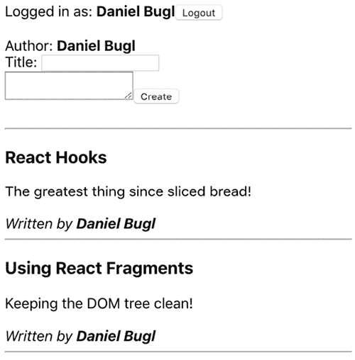
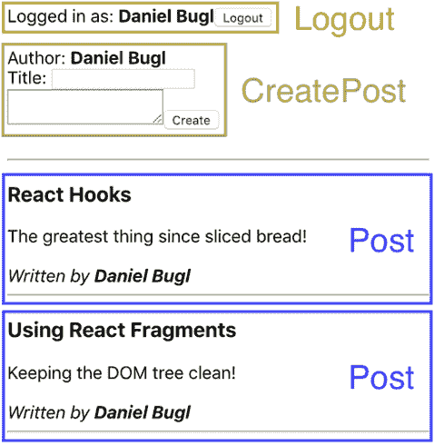
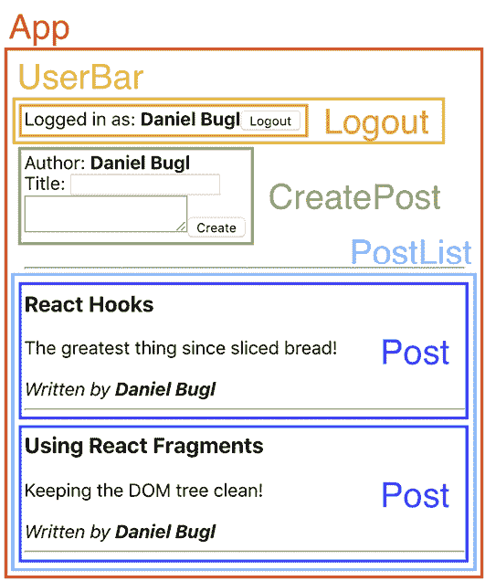
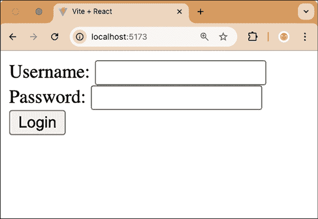
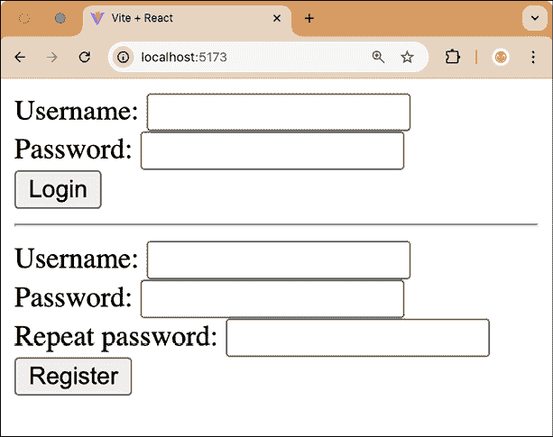
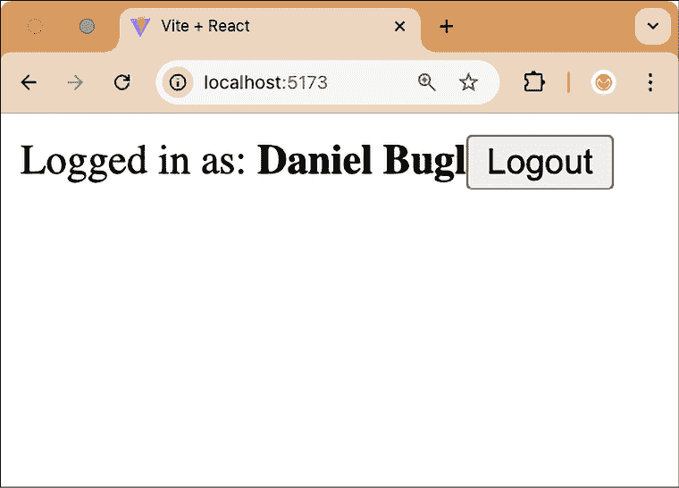
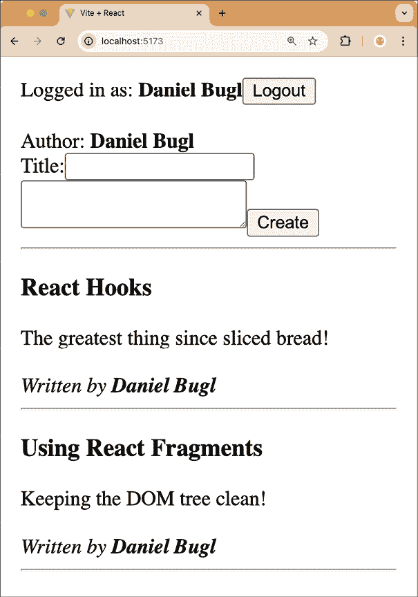
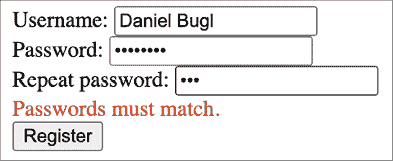
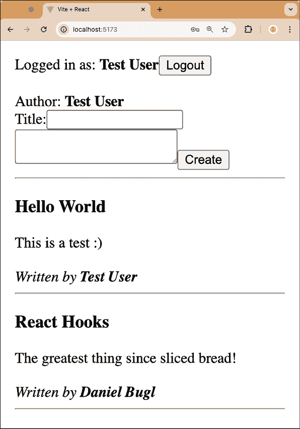

# 3

# 使用 React Hooks 编写您的第一个应用程序

在深入了解 State Hook 之后，我们现在将利用它从头开始创建一个博客应用程序。在本章中，我们首先将学习如何以可扩展的方式结构化 React 应用程序。然后，我们将定义我们需要用到的组件，以覆盖博客应用程序的基本功能。最后，我们将使用 Hooks 将状态引入我们的应用程序！在本章中，我们还将了解 JSX 和各种 JavaScript 功能。在本章结束时，我们将拥有一个基本的博客应用程序，我们可以登录、注册和创建帖子。

本章将涵盖以下主题：

+   结构化 React 项目

+   实现静态 React 组件

+   使用 Hooks 实现有状态的组件

# 技术要求

应已安装一个相当新的 Node.js 版本。还需要安装 Node 包管理器 (`npm`)（它应随 Node.js 一起安装）。有关如何安装 Node.js 的更多信息，请访问官方网站：[`nodejs.org/`](https://nodejs.org/)。

在本书的指南中，我们将使用 **Visual Studio Code** （**VS Code**），但任何其他编辑器都应该以类似的方式工作。有关如何安装 VS Code 的更多信息，请参阅官方网站：[`code.visualstudio.com`](https://code.visualstudio.com)。

在本书中，我们使用以下版本：

+   Node.js v22.14.0

+   `npm` v10.9.2

+   Visual Studio Code v1.97.2

上列版本是本书中使用的版本。虽然安装较新版本通常不会有问题，但请注意，某些步骤在较新版本上可能会有所不同。如果您在使用本书提供的代码和步骤时遇到问题，请尝试使用提到的版本。

您可以在 GitHub 上找到本章的代码：[`github.com/PacktPublishing/Learn-React-Hooks-Second-Edition/tree/main/Chapter03`](https://github.com/PacktPublishing/Learn-React-Hooks-Second-Edition/tree/main/Chapter03)。

强烈建议您亲自编写代码。不要简单地运行书中提供的代码示例。自己编写代码对于正确学习和理解代码非常重要。然而，如果您遇到任何问题，您始终可以参考代码示例。

# 结构化 React 项目

在了解 React 原则、如何使用 State Hook 以及 Hooks 内部工作原理之后，我们现在将利用真实的 State Hook 来开发一个博客应用程序。在本节中，我们将以允许我们以后扩展项目的方式结构化文件夹。

## 文件夹结构

项目可以有多种结构，不同的结构可能适合不同的项目。通常，创建一个`src/`文件夹来存放所有源代码是一个好主意，以区分资源和配置文件。在这个文件夹内，一种可能的组织方式是按特性分组文件。另一种流行的项目组织方式是按路由分组文件。对于某些项目，可能还需要按文件类型进一步分离，例如`src/api/`和`src/components/`。然而，对于我们的项目，我们主要将关注**用户界面**（**UI**）。因此，我们将在`src/`文件夹中按特性分组文件。

首先从一个简单的结构开始是个好主意，只有在你真正需要的时候才进行更深的嵌套。在项目开始时不要花太多时间思考文件结构，因为通常你事先不知道文件应该如何分组，而且它可能以后还会改变。然而，尽量避免使用通用的文件夹和文件名，如`utils`、`common`或`shared`。使用尽可能具体的术语，并在结构演变时进行扩展。

## 定义特性

我们首先必须考虑我们将在博客应用中实现哪些特性。至少，我们想要实现以下特性：

+   注册用户

+   登录/登出

+   查看单个帖子

+   创建新帖子

+   列出帖子

## 制定初始结构

从我们定义的特性中，我们可以抽象出一组功能组：

+   用户（注册、登录/登出）

+   帖子（创建、查看、列出）

我们现在可以保持非常简单，在`src/`文件夹中创建所有组件，而不需要任何嵌套。然而，由于我们已经对博客应用将需要的特性有了相当清晰的了解，我们可以提前制定一个文件夹结构：

+   `src/`

+   `src/user/`

+   `src/post/`

让我们现在设置初始的文件夹结构：

1.  通过执行以下命令将`Chapter01_3`文件夹复制到新的`Chapter03_1`文件夹：

    ```js
    $ cp -R Chapter01_3 Chapter03_1 
    ```

1.  在 VS Code 中打开新的`Chapter03_1`文件夹。

1.  在`Chapter03_1`文件夹内，创建新的`src/user/`和`src/post/`文件夹。

## 组件结构

React 中组件的理念是让每个组件处理单个任务或 UI 元素。我们应该尽量使组件尽可能细粒度，以便能够重用代码。如果我们发现自己正在从一个组件复制粘贴代码到另一个组件，可能将这个通用代码提取到一个可以重用的单独组件中是个好主意。

通常，在开发软件时，我们首先从 UI 原型开始。对于我们的博客，它看起来如下：



图 3.1 – 我们博客应用的初始原型

在拆分组件时，我们使用**单一职责原则**，该原则指出每个模块应该只负责功能的一个封装部分。

在原型中，我们可以在每个组件和子组件周围绘制方框，并给它们命名。请记住，每个组件应该只有一个职责。我们从这个应用的基本组件开始：



图 3.2 – 在我们的原型中绘制基本组件

我们绘制了一个`Logout`组件用于登出（在登出状态下将被`Login`/`Register`组件替换），一个`CreatePost`组件用于渲染创建新帖子的表单，以及一个`Post`组件用于实际的帖子。

现在我们已经绘制了基本组件，我们将查看哪些组件在逻辑上属于一组，因此形成一个组。为此，我们现在绘制容器组件，这是我们为了将组件组合在一起所需要的：



图 3.3 – 在我们的原型中绘制容器组件

我们绘制了一个`PostList`组件，用于将帖子分组，然后一个`UserBar`组件用于处理登录/登出和注册。最后，我们绘制了一个`App`组件，将其他所有内容组合在一起并定义我们应用的结构。

现在我们已经完成了 React 项目的结构化，我们可以继续实现静态组件。

# 实现静态组件

在我们通过 Hooks 向我们的博客应用添加状态之前，我们将使用静态 React 组件来模拟我们应用的基本功能。这样做意味着我们必须处理我们应用静态视图结构。

首先处理静态结构是有意义的，因为它将避免以后需要将动态代码移动到不同的组件中。此外，首先只处理 HTML（和 CSS）更容易——帮助我们快速开始项目。然后，我们可以继续实现动态代码和处理状态。

逐步进行，而不是一次性实现所有内容，这有助于我们快速开始新项目，而不必一次性思考太多，并且减少了我们以后需要重构的量！

## 实现与用户相关的静态组件

我们将从静态组件中最简单的功能开始，即实现与用户相关的功能。正如我们从我们的原型中看到的，我们在这里需要四个组件：

+   一个在用户尚未登录时将要显示的`Login`组件

+   一个在用户尚未登录时也将要显示的`Register`组件

+   一个在用户登录后将要显示的`Logout`组件

+   一个`UserBar`组件，它将根据用户的登录状态有条件地显示其他组件

我们将首先定义前三个组件，它们都是独立组件。最后，我们将定义依赖于其他组件的`UserBar`组件。

### 登录组件

首先，我们将定义`Login`组件，我们将展示两个字段：一个**用户名**字段和一个**密码**字段。此外，我们还将展示一个**登录**按钮。让我们开始吧：

1.  在之前设置的`Chapter03_1`文件夹内，为我们的组件创建一个新文件：`src/user/Login.jsx`。

1.  在新创建的`src/user/Login.jsx`文件中，定义一个组件，目前它不接受任何属性：

    ```js
    export function Login() { 
    ```

1.  渲染一个`<form>`，防止表单的默认提交行为和刷新页面：

    ```js
     return (
        <form onSubmit={(e) => e.preventDefault()}> 
    ```

这里，我们使用一个**匿名函数**（也称为**箭头函数**）来定义`onSubmit`处理程序。匿名函数的定义如下：

+   如果它们没有参数，我们可以写`() => { ... }`，而不是`function () { ... }`

+   有参数的情况下，我们可以写`(arg1, arg2) => { ... }`，而不是`function (arg1, arg2) { ... }`

如果我们不使用括号`{ }`，函数体中的语句的结果也将自动从函数返回，尽管这通常在事件处理程序中不是问题。

1.  然后，渲染两个输入字段来输入用户名和密码，以及一个提交登录表单的按钮：

    ```js
     <label htmlFor='login-username'>Username: </label>
    <input type='text' name='username' id='login-username' />
    <br />
    <label htmlFor='login-password'>Password: </label>
    <input type='password' name='password' id='login-password' />
    <br />
    <input type='submit' value='Login' />
    </form>
      )
    } 
    ```

使用语义化 HTML，如`<form>`和`<label>`，可以使你的应用对使用辅助软件（如屏幕阅读器）的人更容易导航。此外，当使用语义化 HTML 时，键盘快捷键，如通过按*Enter*/*Return*键提交表单，将自动工作。我们使用了`htmlFor`和`id`属性来确保屏幕阅读器知道标签属于哪个输入字段。`id`属性在整个页面中必须是唯一的，但对于`name`属性，只要在表单内是唯一的就足够了。

现在已经实现了静态的`Login`组件，让我们渲染它来看看它的样子。

#### 渲染登录组件

按照以下步骤渲染`Login`组件：

1.  首先，编辑`src/App.jsx`并*删除*其中的所有现有代码。

1.  然后，按照以下方式导入`Login`组件：

    ```js
    import { Login } from './user/Login.jsx' 
    ```

1.  定义并导出`App`组件，目前它只是简单地渲染`Login`组件：

    ```js
    export function App() {
      return <Login />
    } 
    ```

如果我们只返回一个组件，我们可以在`return`语句中省略括号。而不是写`return (<Login />)`，我们可以简单地写`return <Login />`。

1.  通过打开终端（VS Code 中的**终端** | **新终端**菜单选项）并执行以下命令来运行`dev`服务器：

    ```js
    $ npm run dev 
    ```

1.  在你的浏览器中打开 dev 服务器的链接，你应该会看到`Login`组件正在被渲染。如果你更改代码，它应该会自动刷新，所以你可以在这个章节中一直运行 dev 服务器。



图 3.4 – 我们博客应用的第一组件：带有用户名和密码的登录

如我们所见，静态的`Login`组件在 React 中渲染良好。

### 注册组件

静态的`Register`组件将与`Login`组件非常相似，多了一个重复密码的字段。如果它们如此相似，有人可能会想到将它们合并为一个组件，并添加一个 prop 来切换额外字段。然而，在这种情况下，最好让每个组件只处理一个功能。稍后，我们将使用动态代码扩展静态组件；然后，`Register`和`Login`将具有截然不同的逻辑，我们需要再次将它们分开。

然而，让我们开始编写`Register`组件的代码：

1.  创建一个新的`src/user/Register.jsx`文件。

1.  定义一个包含**用户名**和**密码**字段的表单，类似于`Login`组件：

    ```js
    export function Register() {
      return (
        <form onSubmit={(e) => e.preventDefault()}>
          <label htmlFor='register-username'>Username: </label>
    <input type='text' name='username' id='register-username' />
    <br />
    <label htmlFor='register-password'>Password: </label>
    <input type='password' name='password' id='register-password' />
    <br /> 
    ```

    请注意，你应该优先使用 CSS 进行间距设置，而不是使用`<br />`HTML 标签。然而，在这本书中，我们专注于 UI 结构和与 Hooks 的集成，因此我们尽可能简单地使用 HTML。

1.  接下来，添加一个**重复密码**字段：

    ```js
     <label htmlFor='register-password-repeat'>Repeat password:   
          </label>
    <input
     type='password'
     name='password-repeat'
     id='register-password-repeat'
          />
    <br /> 
    ```

1.  最后，添加一个**注册**按钮：

    ```js
     <input type='submit' value='Register' />
        </form>
      )
    } 
    ```

1.  再次，我们可以编辑`src/App.jsx`来显示我们的新组件，如下所示：

    ```js
    import { **Register** } from './user/**Register**.jsx'
    export function App() {
      return <**Register** />
    } 
    ```

如我们所见，`Register`组件看起来与`Login`组件非常相似，但多了一个字段，并且按钮上的文本不同。

### 注销组件

接下来，我们将定义`Logout`组件，该组件将显示当前登录用户的名称，以及一个注销按钮：

1.  创建一个名为`src/user/Logout.jsx`的新文件。

1.  编辑`src/user/Logout.jsx`文件，并定义一个接受`username`属性的组件：

    ```js
    export function Logout({ username }) { 
    ```

这里，我们使用**解构**从`props`对象中提取`username`键。React 将所有组件 prop 作为单个对象传递给函数的第一个参数。在第一个参数上使用解构类似于在类组件中执行`const { username } = this.props`。

1.  在其中，返回一个表单，显示当前登录用户和一个**注销**按钮：

    ```js
     return (
        <form onSubmit={(e) => e.preventDefault()}>
          Logged in as: <b>{username}</b>
    <input type='submit' value='Logout' />
    </form>
      )
    } 
    ```

1.  我们现在可以将`Register`组件替换为`Logout`组件在`src/App.jsx`中，以查看我们新定义的组件（不要忘记传递`username`prop 给它！）：

    ```js
    import { **Logout** } from './user/**Logout**.jsx'
    export function App() {
      return **<****Logout****username****=****'Daniel Bugl'** **/>**
    } 
    ```

现在已经定义了`Logout`组件，我们可以继续编写`UserBar`组件。

### 用户栏组件

现在，是时候将我们的用户相关组件组合成一个`UserBar`组件了，我们将根据用户是否已经登录，有条件地显示`Login`和`Register`组件或`Logout`组件。

让我们开始实现`UserBar`组件：

1.  创建一个新的`src/user/UserBar.jsx`文件。

1.  在其中，导入`Login`、`Logout`和`Register`组件：

    ```js
    import { Login } from './Login.jsx'
    import { Logout } from './Logout.jsx'
    import { Register } from './Register.jsx' 
    ```

1.  定义 `UserBar` 组件和一个 `username` 变量。目前，我们将其设置为静态值：

    ```js
    export function UserBar() {
      const username = '' 
    ```

1.  然后，我们检查用户是否已登录。如果用户已登录，我们显示 `Logout` 组件，并将其 `username` 传递给它：

    ```js
     if (username) {
        return <Logout username={username} />
      } 
    ```

1.  否则，我们显示 `Login` 和 `Register` 组件。在这里，我们可以使用 `React.Fragment`（简写语法：`<>` 和 `</>`）而不是 `<div>` 容器。这使我们的 UI 树保持清洁，因为组件将简单地并排渲染，而不是被另一个元素包裹：

    ```js
     return (
        <>
    <Login />
    <hr />
    <Register />
    </>
      )
    } 
    ```

1.  编辑 `src/App.jsx` 并显示 `UserBar` 组件，如下所示：

    ```js
    import { **UserBar** } from './user/**UserBar**.jsx'
    export function App() {
      return **<****UserBar** **/>**
    } 
    ```

如你所见，`UserBar` 组件成功渲染了 `Login` 和 `Register` 组件：



图 3.5 – 用户尚未登录时的 UserBar 组件

1.  你可以尝试编辑静态的 `username` 变量，看看它是否会渲染 `Logout` 组件。编辑 `src/user/UserBar.jsx` 并按照以下方式调整：

    ```js
    export function UserBar() {
      const username = '`Daniel Bugl`' 
    ```

进行此更改后，`UserBar` 组件将渲染 `Logout` 组件：



图 3.6 – 定义 username 后的 UserBar 组件

在本章的后面部分，我们将向我们的应用程序添加 Hooks，这样我们就可以动态地登录并改变状态，而无需编辑代码！

## 实现帖子

在实现所有用户相关组件后，我们现在可以继续在我们的博客应用程序中实现帖子。我们将定义以下组件：

+   一个用于显示单个帖子的 `Post` 组件

+   一个用于创建新帖子的 `CreatePost` 组件

+   一个 `PostList` 组件用于显示所有帖子的列表

### `Post` 组件

我们在创建原型时已经考虑了帖子应该包含哪些元素。帖子应该有一个标题、内容和作者（撰写帖子的用户）。

现在让我们来实现 `Post` 组件：

1.  创建一个新的 `src/post/Post.jsx` 文件。

1.  在其中，以类似于原型的方式渲染所有属性：

    ```js
    export function Post({ title, content, author }) {
      return (
        <div>
    <h3>{title}</h3>
    <div>{content}</div>
    <br />
    <i>
            Written by <b>{author}</b>
    </i>
    </div>
      )
    } 
    ```

1.  和往常一样，我们可以通过编辑 `src/App.jsx` 文件来测试我们的组件：

    ```js
    import { **Post** } from './**post**/**Post**.jsx'
    export function App() {
    **return** **(**
    **<****Post**
    **title****=****'React Hooks'**
    **content****=****'The greatest thing since sliced bread!'**
    **author****=****'****Daniel Bugl'**
     **/>**
     **)**
    } 
    ```

现在静态的 `Post` 组件已经实现，我们可以继续进行 `CreatePost` 组件的开发。

### 创建帖子组件

我们需要实现一个表单来创建新帖子。在这里，我们将 `username` 作为属性传递给组件，因为作者始终是当前登录的用户。然后，我们显示作者并提供一个标题输入字段和一个 `<textarea>` 元素用于博客帖子的内容。

现在让我们来实现 `CreatePost` 组件：

1.  创建一个新的 `src/post/CreatePost.jsx` 文件。

1.  在其中，根据原型定义组件：

    ```js
    export function CreatePost({ username }) {
      return (
        <form onSubmit={(e) => e.preventDefault()}>
          <div>
            Author: <b>{username}</b>
    </div>
    <div>
    <label htmlFor='create-title'>Title:</label>
    <input type='text' name='title' id='create-title' />
    </div>
    <textarea name='content' />
    <input type='submit' value='Create' />
    </form>
      )
    } 
    ```

1.  和往常一样，我们可以通过编辑 `src/App.jsx` 文件来测试我们的组件，如下所示：

    ```js
    import { **CreatePost** } from './post/**CreatePost**.jsx'
    export function App() {
      return **<****CreatePost****username****=****'****Daniel Bugl'** **/>**
    } 
    ```

如我们所见，`CreatePost` 组件渲染良好。我们现在可以继续进行 `PostList` 组件的开发。

### 帖子列表组件

在实现其他与帖子相关的组件后，我们现在可以实施我们博客应用最重要的部分：博客帖子的流。目前，流将简单地显示博客帖子的列表。

现在让我们开始实现`PostList`组件：

1.  创建一个新的`src/post/PostList.jsx`文件。

1.  首先，我们导入`Fragment`和`Post`组件：

    ```js
    import { Fragment } from 'react'
    import { Post } from './Post.jsx' 
    ```

1.  然后，我们定义接受一个`posts`数组作为属性的`PostList`函数组件。如果`posts`未定义，我们默认将其设置为空数组：

    ```js
    export function PostList({ posts = [] }) { 
    ```

1.  接下来，我们使用`.map`函数和展开语法来渲染所有帖子：

    ```js
     return (
        <div>
          {posts.map((post, index) => (
            <Post {...post} key={`post-${index}`} />
          ))}
        </div>
      )
    } 
    ```

我们为每个帖子返回`<Post>`组件，并将`post`对象的所有键作为属性传递给组件。我们通过使用展开语法来完成此操作，这具有与手动将对象的所有键作为属性列出相同的效果，如下所示：

```js
<Post
  title={post.title}
  author={post.author}
  content={post.content}
/> 
```

如果我们在渲染元素列表，我们必须为每个元素提供一个唯一的`key`属性。React 使用这个`key`属性在数据发生变化时高效地计算两个列表之间的差异。使用唯一的 ID 作为`key`属性的最佳实践，例如数据库 ID，这样 React 可以跟踪列表中变化的项目。然而，在这种情况下，我们没有这样的 ID，所以我们简单地回退到使用索引。

我们使用了`map`函数，它将一个函数应用于数组的所有元素。这与使用`for`循环并存储所有结果类似，但更简洁、声明性更强，更容易阅读！作为使用`map`函数的替代方案，我们可以这样做：

```js
let renderedPosts = []
let index = 0
for (let post of posts) {
  renderedPosts.push(<Post {...post} key={`post-${index}`} />)
  index++
}
return (
  <div>
    {renderedPosts}
  </div>
) 
```

然而，不建议在 React 中使用这种风格。

1.  在原型中，每个博客帖子后面都有一个水平线。我们可以通过使用`Fragment`而不添加额外的`<div>`容器元素来实现这一点，如下所示：

    ```js
     {posts.map((post, index) => (
    **<****Fragment****key****=****{****`****post-****${****index****}`}>**
    **<****Post** **{****...post****} />**
    **<****hr** **/>**
    **</****Fragment****>**
          ))} 
    ```

使用`Fragment`而不是额外的`<div>`容器元素可以保持 DOM 树整洁并减少嵌套的数量。

`key`属性必须始终添加到在`map`函数中渲染的最高父元素。在这种情况下，我们必须将`key`属性从`Post`组件移动到`Fragment`。

1.  再次，我们通过编辑`src/App.jsx`文件来测试我们的组件：

    ```js
    import { **PostList** } from './post/**PostList**.jsx'
    **const** **posts = [**
     **{**
    **title****:** **'React Hooks'****,**
    **content****:** **'The greatest thing since sliced bread!'****,**
    **author****:** **'Daniel Bugl'****,**
     **},**
     **{**
    **title****:** **'Using React Fragments'****,**
    **content****:** **'Keeping the DOM tree clean!'****,**
    **author****:** **'Daniel Bugl'****,**
     **},**
    **]**
    export function App() {
      return **<****PostList****posts****=****{posts}** **/>**
    } 
    ```

现在，我们可以看到我们的应用列出了我们在`posts`数组中定义的所有帖子。

如我们所见，通过`PostList`组件列出多个帖子工作得很好。现在我们可以继续组装应用。

## 组装应用

在实现所有组件以重现原型后，我们只需在`App`组件中将所有内容组合在一起。然后，我们就成功重现了原型！

让我们从修改`App`组件并组装我们的应用开始：

1.  编辑`src/App.jsx`并*删除*所有当前代码。

1.  首先，导入`UserBar`、`CreatePost`和`PostList`组件：

    ```js
    import { UserBar } from './user/UserBar.jsx'
    import { CreatePost } from './post/CreatePost.jsx'
    import { PostList } from './post/PostList.jsx' 
    ```

1.  然后，为应用定义一些模拟数据：

    ```js
    const username = 'Daniel Bugl'
    const posts = [
      {
        title: 'React Hooks',
        content: 'The greatest thing since sliced bread!',
        author: 'Daniel Bugl',
      },
      {
        title: 'Using React Fragments',
        content: 'Keeping the DOM tree clean!',
        author: 'Daniel Bugl',
      },
    ] 
    ```

1.  接下来，定义`App`组件并返回一个带有一些填充的容器：

    ```js
    export function App() {
      return (
        <div style={{ padding: 8 }}> 
    ```

1.  现在，渲染 `UserBar` 和 `CreatePost` 组件，并将 `username` 属性传递给 `CreatePost` 组件：

    ```js
     <UserBar />
          <br />
    <CreatePost username={username} /> 
    ```

1.  最后，显示 `PostList` 组件，并将 `posts` 属性传递给它：

    ```js
     <hr />
          <PostList posts={posts} />
        </div>
      )
    } 
    ```

保存文件后，浏览器应自动刷新，我们现在可以看到完整的 UI：



图 3.7 – 根据原型完全实现我们的静态博客应用程序

如我们所见，现在，我们之前定义的所有静态组件都在一个 `App` 组件中一起渲染。

**示例代码**

本节示例代码位于 `Chapter03/Chapter03_1` 文件夹中。请检查文件夹内的 `README.md` 文件，了解如何设置和运行示例。

我们的应用程序现在看起来就像原型一样，所以，我们现在可以继续使用 Hooks 来使所有组件动态化。

# 使用 Hooks 实现状态化组件

现在我们已经实现了应用程序的静态结构，我们将添加状态 Hooks 来处理状态和动态交互！

首先，让我们为状态实现创建一个新的文件夹：

1.  将 `Chapter03_1` 文件夹复制到新的 `Chapter03_2` 文件夹中，如下所示：

    ```js
    $ cp -R Chapter03_1 Chapter03_2 
    ```

1.  在 VS Code 中打开新的 `Chapter03_2` 文件夹。

## 为用户功能添加 Hooks

为了添加用户功能的 Hooks，我们需要将静态的 `username` 变量替换为一个 Hook。然后，我们需要在登录、注册和注销时调整值。

### 调整用户栏

当我们创建 `UserBar` 组件时，我们静态地定义了一个 `username` 变量。我们现在将用状态 Hook 来替换它！

让我们开始修改 `UserBar` 组件，使其动态化：

1.  编辑 `src/user/UserBar.jsx` 并导入 `useState` Hook，如下所示：

    ```js
    import { useState } from 'react' 
    ```

1.  *删除* 以下代码行：

    ```js
     const username = 'Daniel Bugl' 
    ```

*替换* 它为一个使用空用户名作为默认值的 State Hook：

```js
 const [username, setUsername] = useState('') 
```

1.  然后，将 `setUsername` 函数传递给 `Logout` 组件：

    ```js
     if (username) {
        return <Logout username={username} **setUsername****=****{setUsername}** 
          />
      } 
    ```

为了简化并更容易跟踪状态处理的位置，我们将直接从状态 Hook 将 `username` 和 `setUsername` 函数传递到其他组件。在实际项目中，最好使用特定的名称来命名处理程序，例如 `onLogout`。这减少了组件之间的耦合。

1.  此外，将 `setUsername` 函数分别传递给 `Login` 和 `Register` 组件：

    ```js
     return (
        <>
    <Login **setUsername****=****{setUsername}** />
    <hr />
    <Register **setUsername****=****{setUsername}** />
    </>
      )
    } 
    ```

现在，`UserBar` 组件可以动态地设置用户名。然而，我们仍然需要修改其他组件以添加处理程序。

1.  编辑 `src/user/Logout.jsx` 并定义一个 `handleSubmit` 函数，如下所示：

    ```js
    export function Logout({ username**, setUsername** }) {
    **function****handleSubmit****(****e****) {**
     **e.****preventDefault****()**
    **setUsername****(****''****)**
     **}** 
    ```

    在 React 19 中，**表单操作**被引入作为一种处理表单提交的高级方式。我们将在*第七章*中学习更多关于表单操作的内容，*使用 Hooks 处理表单*。在本章中，我们将专注于使用 State Hook 和传统的使用`onSubmit`处理函数处理表单的方式。

1.  然后，用新定义的函数替换现有的`onSubmit`处理程序：

    ```js
     return (
        <form onSubmit={**handleSubmit**}> 
    ```

1.  编辑`src/user/Login.jsx`并定义一个`handleSubmit`函数，如下所示：

    ```js
    export function Login(**{ setUsername }**) {
    **function****handleSubmit****(****e****) {**
     **e.****preventDefault****()**
    **const** **username = e.****target****.****elements****.****username****.****value**
    **setUsername****(username)**
     **}**
    return (
        <form onSubmit={**handleSubmit**}> 
    ```

如我们所见，我们可以通过使用`e.target.elements`直接访问表单中`username`字段的值。`form`元素的键等同于`<input>`元素的`name`属性。

1.  编辑`src/user/Register.jsx`并定义一个`handleSubmit`函数，如下所示：

    ```js
    export function Register(**{ setUsername }**) {
    **function****handleSubmit****(****e****) {**
     **e.****preventDefault****()**
    **const** **username = e.****target****.****elements****.****username****.****value**
    **setUsername****(username)**
     **}**
    return (
        <form onSubmit={**handleSubmit**}> 
    ```

现在，你可以尝试注册、登录和登出，并查看状态在组件间如何变化。

### 添加验证

在尝试`login`和`register`功能时，你可能已经注意到没有进行验证。对于简单的验证，如必填字段，我们可以直接使用 HTML 功能。HTML 验证将阻止用户提交表单，如果字段无效，会弹出一个提示告诉用户哪里出了问题。然而，对于更复杂的验证，如检查重复密码是否相同，我们需要使用 State Hook 来跟踪表单的错误状态。

让我们开始实现验证：

1.  编辑`src/user/Login.jsx`并给以下`input`字段添加`required`属性：

    ```js
     <input type='text' name='username' id='login-username' **required** />
          …
          <input type='password' name='password' id='login-password' **required** /> 
    ```

1.  编辑`src/user/Register.jsx`并添加`required`属性：

    ```js
     <input type='text' name='username' id='register-username' **required** />
          …
          <input type='password' name='password' id='register-password' **required** />
          …
          <input
     type='password'
     name='password-repeat'
     id='register-password-repeat'
     **required**
          /> 
    ```

1.  在`src/user/Register.jsx`文件中，也导入`useState`函数：

    ```js
    import { useState } from 'react' 
    ```

1.  然后，添加一个新的 State Hook 来跟踪错误状态：

    ```js
    export function Register({ setUsername }) {
    **const** **[invalidRepeat, setInvalidRepeat] =** **useState****(****false****)** 
    ```

这种状态被称为**局部状态**，因为它只需要在一个组件内使用。

1.  在`handleSubmit`函数中，检查`password`和`password-repeat`字段是否相同。如果不相同，设置错误状态并从函数中返回：

    ```js
     function handleSubmit(e) {
        e.preventDefault()
    **if** **(**
     **e.****target****.****elements****.****password****.****value** **!==**
     **e.****target****.****elements****[****'password-repeat'****].****value**
     **) {**
    **setInvalidRepeat****(****true****)**
    **return**
     **}** 
    ```

如果不满足某些条件，函数的早期返回通常比嵌套`if`语句更可取。早期返回使函数易于阅读，并避免代码意外执行的问题。

1.  在`if`语句之后，如果密码相同，重置错误状态并处理注册：

    ```js
    **setInvalidRepeat****(****false****)**
    const username = e.target.elements.username.value
    setUsername(username)
      } 
    ```

1.  在表单末尾，在**注册**按钮之前，如果错误状态被触发，我们插入一条错误信息：

    ```js
     <br />
     **{invalidRepeat && (**
    **<****div****style****=****{{****color:** **'****red****' }}>****Passwords must** 
     **match.****</****div****>**
     **)}**
    <input type='submit' value='Register' />
    </form> 
    ```

如果我们现在尝试注册但密码没有正确重复，我们可以看到以下错误信息：



图 3.8 – 使用 Hooks 实现的验证和错误信息

现在我们已经成功实现了验证，我们可以继续将用户名传递给`CreatePost`组件。

### 将用户传递给 CreatePost

如您可能已经注意到的，`CreatePost`组件仍然使用硬编码的用户名。为了能够在那里访问用户名，我们需要将钩子从`UserBar`组件移动到`App`组件中：

1.  编辑`src/user/UserBar.jsx`并*剪切/删除*以下钩子定义：

    ```js
    export function UserBar() {
    **const** **[username, setUsername] =** **useState****(****''****)** 
    ```

1.  然后，调整函数定义以接受这两个属性：

    ```js
    export function UserBar(**{ username, setUsername }**) { 
    ```

1.  *删除*以下`useState`导入：

    ```js
    import { useState } from 'react' 
    ```

1.  现在，编辑`src/App.jsx`并从那里导入`useState`函数：

    ```js
    import { useState } from 'react' 
    ```

1.  *删除*以下代码行：

    ```js
    const username = 'Daniel Bugl' 
    ```

1.  在`App`函数组件内部，添加我们之前移除的钩子：

    ```js
    export function App() {
    **const** **[username, setUsername] =** **useState****(****''****)** 
    ```

这种状态被称为**全局状态**，因为它在整个博客应用中的多个组件中都需要，这也是为什么我们将状态钩子移动到`App`组件中的原因。

1.  然后，将`username`值和`setUsername`函数传递给`UserBar`组件：

    ```js
     return (
        <div style={{ padding: 8 }}>
    <UserBar **username****=****{username}****setUsername****=****{setUsername}** /> 
    ```

    在*第五章*《实现 React 上下文》中，我们将学习一个更好的解决方案来将登录状态提供给其他组件。现在，我们只是将值和函数传递下去。

1.  最后，确保`CreatePost`组件仅在用户登录时渲染（`username`已定义）：

    ```js
     <br />
          **{username &&** <CreatePost username={username} />**}** 
    ```

现在用户功能已完全实现，我们可以继续使用钩子来实现帖子功能！

## 为帖子功能添加钩子

在实现了用户功能之后，我们现在将实现帖子的动态创建。我们首先调整`App`组件，然后修改`CreatePost`组件以能够插入新帖子。

### 调整`App`组件

与`username`状态类似，我们将在`App`组件中定义`posts`作为全局状态，并从那里提供给其他组件。

让我们开始调整`App`组件：

1.  编辑`src/App.jsx`并将当前的`posts`数组重命名为`defaultPosts`：

    ```js
    const **defaultPosts** = [
      {
        title: 'React Hooks',
        content: 'The greatest thing since sliced bread!',
        author: 'Daniel Bugl',
      },
      {
        title: 'Using React Fragments',
        content: 'Keeping the DOM tree clean!',
        author: 'Daniel Bugl',
      },
    ] 
    ```

1.  然后，在`App`函数内部定义一个新的`posts`状态钩子：

    ```js
    export function App() {
    **const** **[posts, setPosts] =** **useState****(defaultPosts)** 
    ```

1.  现在，将`setPosts`作为属性传递给`CreatePost`组件：

    ```js
     {username && (
            <CreatePost username={username} **setPosts****=****{setPosts}** />
          )} 
    ```

在将状态提供给`CreatePost`组件后，让我们继续调整它。

### 调整`CreatePost`组件

现在，我们需要使用`setPosts`函数在按下**创建**按钮时插入一个新的帖子，如下所示：

1.  编辑`src/post/CreatePost.jsx`并调整函数定义以接受`setPosts`属性：

    ```js
    export function CreatePost({ username**, setPosts** }) { 
    ```

1.  接下来，定义一个`handleSubmit`函数，在其中我们首先收集所有需要的值：

    ```js
     function handleSubmit(e) {
        e.preventDefault()
        const form = e.target
    const title = form.elements.title.value
    const content = form.elements.content.value
    const newPost = { title, content, author: username } 
    ```

在这里，我们将`{ title: title }`对象赋值简写为`{ title }`，它们具有相同的效果。

1.  然后，我们将新帖子插入到数组中：

    ```js
     setPosts((posts) => [newPost, ...posts]) 
    ```

在这里，我们使用一个函数来获取状态钩子的当前值，然后返回一个新值，其中包含插入到数组中的新帖子。

1.  最后，我们将重置表单以清除所有输入字段：

    ```js
     form.reset()
      } 
    ```

1.  我们仍然需要将新定义的函数分配给`onSubmit`处理程序，如下所示：

    ```js
     return (
        <form onSubmit={**handleSubmit**}> 
    ```

现在，我们可以登录并创建一个新的帖子，它将被插入到动态流的开始处！



图 3.9 – 使用 Hooks 插入新帖子后的我们的博客应用的第一版

**示例代码**

本节示例代码可在`Chapter03/Chapter03_2`文件夹中找到。请检查文件夹内的`README.md`文件，以获取设置和运行示例的说明。

# 摘要

在本章中，我们从零开始开发了自己的博客应用！我们从一个原型开始，然后创建了静态组件来模拟它。之后，我们实现了 Hooks 以允许动态行为。在整个章节中，我们学习了如何使用 Hooks 处理本地和全局状态。此外，我们学习了如何使用多个 Hooks，以及在哪些组件中定义 Hooks 和存储状态。我们还学习了如何解决常见用例，例如表单验证和提交。

在下一章，*第四章*，*使用 Reducer 和 Effect 钩子*，我们将学习 Reducer 钩子，它使我们能够更容易地处理某些状态变化。此外，我们还将学习 Effect 钩子，它允许我们运行具有副作用代码。

# 问题

为了回顾本章学到的内容，尝试回答以下问题：

1.  在 React 中，有哪些好的文件夹结构方式？

1.  在拆分 React 组件时，我们应该使用哪个原则？

1.  `map`函数的作用是什么？

1.  解构是如何工作的，我们何时使用它？

1.  扩展运算符是如何工作的，我们何时使用它？

1.  我们如何处理表单验证和提交？

1.  应该在哪里定义本地状态钩子？

1.  什么是全局状态？

1.  应该在哪里定义全局状态钩子？

# 进一步阅读

如果你对本章学到的概念有更多兴趣，请查看以下链接：

+   *思考 React*的官方文档：[`react.dev/learn/thinking-in-react`](https://react.dev/learn/thinking-in-react)

# 在 Discord 上了解更多

要加入这本书的 Discord 社区——在那里你可以分享反馈，向作者提问，并了解新版本——请扫描下面的二维码：

`packt.link/wnXT0`


