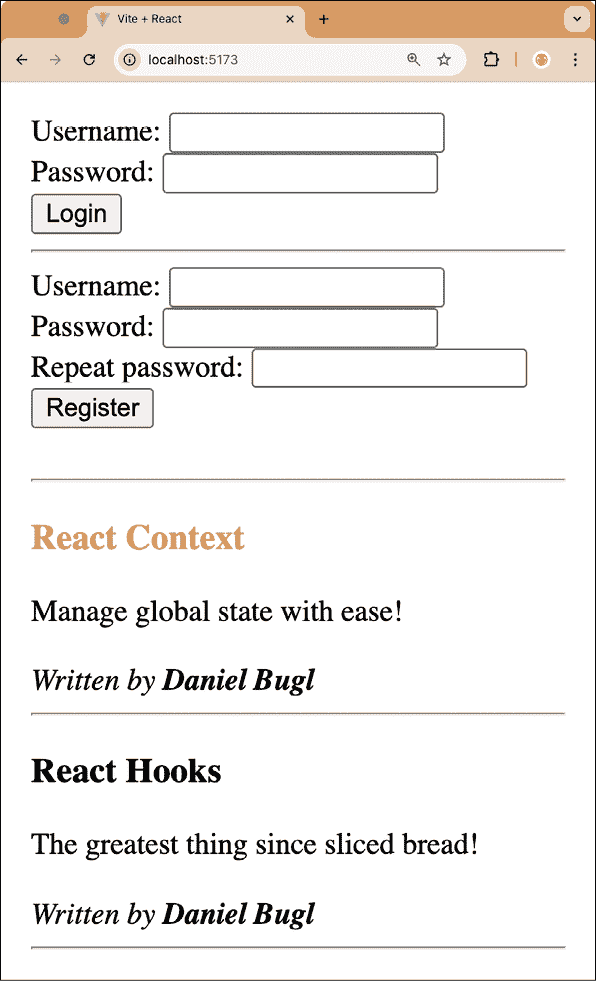

# 第五章：实现 React 上下文

在前面的章节中，我们学习了 State Hook、Reducer Hook 和 Effect Hook。我们使用这些 Hooks 开发了一个小型博客应用程序。正如我们在开发博客应用程序时注意到的那样，我们必须从`App`组件向下传递`username`状态到`UserBar`组件，然后从`UserBar`组件传递到`Login`、`Register`和`Logout`组件。为了避免必须以这种方式传递状态，我们现在将学习 React Context 和 Context Hooks。

我们将首先通过实现主题作为上下文的示例来学习 React 上下文是什么，以及提供者和消费者是什么。然后，我们将使用 Hooks 作为上下文消费者，并讨论何时应该使用上下文。最后，我们将使用上下文实现全局状态。

本章将涵盖以下主题：

+   介绍 React 上下文

+   通过上下文实现主题

+   上下文的替代方案

+   使用上下文进行全局状态管理

# 技术要求

应该已经安装了相当新的 Node.js 版本。Node 包管理器（`npm`）也需要安装（它应该与 Node.js 一起安装）。有关如何安装 Node.js 的更多信息，请访问官方网站：[`nodejs.org/`](https://nodejs.org/)。

我们将在本书的指南中使用**Visual Studio Code**（**VS Code**），但任何其他编辑器都应该以类似的方式工作。有关如何安装 VS Code 的更多信息，请参阅官方网站：[`code.visualstudio.com`](https://code.visualstudio.com)。

在本书中，我们使用以下版本：

+   Node.js v22.14.0

+   `npm` v10.9.2

+   VS Code v1.97.2

虽然安装较新版本不应有问题，但请注意，某些步骤在较新版本上可能有所不同。如果您在本书提供的代码和步骤中遇到问题，请尝试使用提到的版本。

您可以在 GitHub 上找到本章的代码：[`github.com/PacktPublishing/Learn-React-Hooks-Second-Edition/tree/main/Chapter05`](https://github.com/PacktPublishing/Learn-React-Hooks-Second-Edition/tree/main/Chapter05)。

强烈建议您自己编写代码。不要简单地运行书中提供的代码示例。自己编写代码对于正确学习和理解代码非常重要。然而，如果您遇到任何问题，您始终可以参考代码示例。

# 介绍 React 上下文

在前面的章节中，我们将`username`状态和`setUsername`函数从`App`组件传递到`UserBar`组件；然后从`UserBar`组件传递到`Logout`、`Login`和`Register`组件。React Context 提供了一种解决方案，通过允许我们在组件之间共享值，而无需通过 props 显式传递它们，从而解决了在多个组件层级之间传递 props 的繁琐方式。正如我们将要看到的，上下文非常适合在整个应用程序中共享全局状态。

## 传递 props

在深入了解 React Context 之前，让我们回顾一下我们在前面的章节中实现的内容，以了解上下文解决的问题。在此阶段，你不需要编辑任何代码；这些步骤只是对我们已经完成的内容的回顾。只需阅读以下步骤：

1.  在`src/App.jsx`中，我们使用 State Hook 定义了`username`状态和`setUsername`函数：

    ```js
    export function App() {
      const [posts, dispatch] = useReducer(postsReducer, defaultPosts)
    **const** **[username, setUsername] =** **useState****(****''****)** 
    ```

1.  然后，我们将`username`状态和`setUsername`函数传递给`UserBar`组件：

    ```js
     return (
        <div style={{ padding: 8 }}>
    <UserBar **username****=****{username}****setUsername****=****{setUsername}** /> 
    ```

1.  在`src/user/UserBar.jsx`文件中，我们定义了一个`UserBar`组件，它接受`username`状态作为 prop，并将其传递给`Logout`组件。我们还向`Logout`、`Login`和`Register`组件传递了`setUsername`函数：

    ```js
    export function UserBar({ **username, setUsername** }) {
      if (username) {
        return <Logout **username****=****{username}****setUsername****=****{setUsername}** />
      } else {
        return (
          <>
    <Login **setUsername****=****{setUsername}** />
    <hr />
    <Register **setUsername****=****{setUsername}** />
    </>
        )
      }
    } 
    ```

1.  最后，我们在`Logout`、`Login`和`Register`组件中使用了`setUsername`函数和`username`状态：

    ```js
    export function Login({ **setUsername** }) {
      function handleSubmit(e) {
        e.preventDefault()
        const username = e.target.elements.username.value
    **setUsername****(username)**
      } 
    ```

React Context 允许我们跳过*步骤 2*和*步骤 3*，直接从*步骤 1*跳到*步骤 4*。正如你可以想象的那样，在更大的应用程序中，上下文变得更加有用，因为我们可能需要在多个层级传递 props。

在下一节中，我们首先将通过为我们的博客实现主题系统来学习上下文的工作原理。然后，我们将使用 React Context 来处理我们的博客应用程序中的`username`全局状态。

# 通过上下文实现主题

**React Context**用于在 React 组件树中共享值。通常，我们想要共享全局值，例如`username`状态、我们的应用程序的主题或选择的语言（如果应用程序支持多种语言）。

React Context 由三个部分组成：

+   **上下文**本身，它定义了一个默认值，并允许我们提供和消费值

+   **提供者**，它提供（设置）值

+   **消费者**，它消费（使用）值

## 定义上下文

首先，我们必须定义上下文。自从引入 Hooks 以来，这种方式没有改变。我们只需使用 React 中的`createContext(defaultValue)`函数来创建一个新的上下文对象。在这种情况下，我们将默认值设置为`{ primaryColor: 'maroon' }`，因此当没有提供者定义时，我们的默认主颜色将是栗色。

现在，让我们开始定义上下文：

1.  通过执行以下命令将`Chapter04_2`文件夹复制到新的`Chapter05_1`文件夹：

    ```js
    $ cp -R Chapter04_2 Chapter05_1 
    ```

1.  在 VS Code 中打开新的`Chapter05_1`文件夹。

1.  为了保持我们的项目在增长过程中保持整洁，我们现在通过首先按基础原语分组，然后在那个文件夹内按功能分组来扩展文件夹结构。现在创建一个新的`src/contexts/`文件夹。

1.  此外，创建一个新的`src/components/`文件夹。

1.  将`src/post/`和`src/user/`文件夹移动到`src/components/`文件夹中。

1.  编辑`src/App.jsx`并调整导入，如下所示：

    ```js
    import { UserBar } from './**components/**user/UserBar.jsx'
    import { CreatePost } from './**components/**post/CreatePost.jsx'
    import { PostList } from './**components/**post/PostList.jsx' 
    ```

1.  创建一个新的`src/contexts/ThemeContext.js`文件。在其内部，导入`createContext`函数：

    ```js
    import { createContext } from 'react' 
    ```

1.  现在，使用前面提到的默认值定义上下文：

    ```js
    export const ThemeContext = createContext(
      { primaryColor: 'maroon' }
    ) 
    ```

当上下文被消费但没有定义提供者时，它将返回此默认值。

注意我们在这里导出`ThemeContext`，因为我们稍后需要导入它来创建提供者，并使用 Context Hook 来消费它。

这就是我们使用 React 定义上下文所需做的全部工作。

## 快速转向——绝对导入

如果我们现在在组件中导入上下文，我们将不得不从`../../contexts/ThemeContext.js`导入。除了当文件深度嵌套时难以阅读的事实外，它还可能在稍后组织文件到子文件夹时引起问题。为了避免这些问题，我们可以使用**绝对导入**。绝对导入允许我们从项目的根目录导入。它们是通过 Vite 中的**resolve 别名**实现的。基本上，我们可以告诉 Vite 将一个特殊字符，例如`@`符号，解析到`src`文件夹的绝对路径。这意味着我们可以从`@/contexts/ThemeContext.js`导入上下文。

让我们现在开始配置绝对导入：

1.  编辑`vite.config.js`并导入`path`实用工具：

    ```js
    import path from 'node:path' 
    ```

1.  在`config`对象中，添加一个`resolve`别名，如下所示：

    ```js
    export default defineConfig({
      plugins: [react()],
    **resolve****: {**
    **alias****: [{** **find****:** **'@'****,** **replacement****:** 
     **path.****resolve****(****import****.****meta****.****dirname****,** **'src'****) }],**
     **},**
    }) 
    ```

1.  此外，我们可以通过创建一个`jsconfig.json`文件来改进代码编辑器或 IDE 中的自动完成。此文件将告诉编辑器有关我们的绝对导入配置，并使我们能够轻松地从它导入文件。现在创建一个新的`jsconfig.json`文件。

1.  在内部添加以下配置：

    ```js
    {
      "compilerOptions": {
        "baseUrl": ".",
        "paths": {
          "@/*": ["./src/*"]
        }
      },
      "exclude": ["node_modules"]
    } 
    ```

现在我们可以使用绝对导入，让我们继续定义消费者。

## 定义消费者

要使用上下文，我们需要一个消费者。在我们开始使用 Hooks 之前，让我们首先回顾一下定义消费者的传统方式：

1.  编辑`src/components/post/Post.jsx`并在其中导入`ThemeContext`：

    ```js
    import { ThemeContext } from '@/contexts/ThemeContext.js' 
    ```

1.  将整个组件包裹在一个`ThemeContext.Consumer`组件中，并将其`children`属性设置为**渲染函数**，以使用上下文值：

    ```js
    export function Post({ title, content, author }) {
      return (
     **<****ThemeContext****.****Consumer****>**
     **{****(****theme****) =>** **(** 
    ```

渲染函数允许我们将值传递给组件的子组件。

1.  在渲染函数内部，我们现在可以利用上下文值来设置博客文章标题的颜色，如下所示：

    ```js
     <div>
    <h3 style={{ color: theme.primaryColor }}>
                {title}
              </h3>
    <div>{content}</div>
    <br />
    <i>
                Written by <b>{author}</b>
    </i>
    </div>
     **)}**
    **</****ThemeContext.Consumer****>**
      )
    } 
    ```

使用上下文的方式是可行的，但正如我们在第一章中学到的，以这种方式使用具有渲染函数的组件会使得 React 树变得杂乱，并使得我们的应用更难调试和维护。

## 使用 Hooks 来消费上下文

消费上下文的一个更好的方法是使用 Context Hook！这样，我们可以像使用其他任何值一样使用上下文值。

按照以下步骤将消费者改为上下文钩子：

1.  编辑`src/components/post/Post.jsx`并添加以下导入：

    ```js
    import { useContext } from 'react' 
    ```

1.  然后，定义一个上下文钩子，如下所示：

    ```js
    export function Post({ title, content, author }) {
    **const** **theme =** **useContext****(****ThemeContext****)** 
    ```

1.  接下来，*删除*以下突出显示的代码部分：

    ```js
     return (
    **<****ThemeContext.Consumer****>**
     **{(theme) => (**
    <div>
    <h3 style={{ color: theme.primaryColor }}>{title}</h3>
    <div>{content}</div>
    <br />
    <i>
                Written by <b>{author}</b>
    </i>
    </div>
     **)}**
    **</****ThemeContext.Consumer****>**
      )
    } 
    ```

如你所见，使用上下文钩子允许我们直接从上下文中消费值，并简单地渲染帖子，而无需使用包装组件。

1.  通过执行以下命令启动博客应用：

    ```js
    $ npm run dev 
    ```

我们可以看到，博客帖子的标题现在变成了朱红色：


图 5.1 – 使用上下文钩子更改我们的应用主题

如我们所见，主题上下文成功为帖子标题提供了颜色。

## 定义提供者

当没有定义提供者时，上下文使用传递给`createContext`的默认值。例如，让我们想象我们的组件使用`ThemeContext`并按以下方式渲染：

```js
<Component /> 
```

然后，`primaryColor`将被设置为`maroon`（我们之前定义了它）。这可以用作后备，例如，当组件不是嵌入到应用中，而是嵌入到一个交互式样式指南（如 Storybook）中时。

当定义了提供者时，它们将使用提供者的值。让我们这样渲染组件：

```js
<ThemeContext.Provider value={{ primaryColor: 'black' }}>
  <Component />
</ThemeContext.Provider> 
```

然后，`primaryColor`将被设置为`black`。

如果树中有多个提供者，组件将使用最近父提供者的值。例如，假设我们这样渲染组件：

```js
<ThemeContext.Provider value={{ primaryColor: 'black' }}>
  <OtherComponent />
<ThemeContext.Provider value={{ primaryColor: 'red' }}>
<Component />
</ThemeContext.Provider>
</ThemeContext.Provider> 
```

然后，组件中的`primaryColor`将被设置为`red`，因为那是树中离组件最近的提供者。然而，在这个例子中，`OtherComponent`的`primaryColor`仍然设置为`black`。

如我们所见，没有提供者的上下文只是一个静态值；提供者（特别是与其他钩子结合使用时，如用于值的 State 钩子）允许我们动态地改变上下文的值。

现在让我们定义提供者。按照以下步骤开始：

1.  编辑`src/App.jsx`并导入`ThemeContext`：

    ```js
    import { ThemeContext } from './contexts/ThemeContext.js' 
    ```

1.  然后，将`App`组件的内容包裹在`ThemeContext.Provider`组件中，并提供一个值：

    ```js
    export function App() {
      const [posts, dispatch] = useReducer(postsReducer, defaultPosts)
      const [username, setUsername] = useState('')
      return (
    **<****ThemeContext.Provider****value****=****{{****primaryColor:** **'****black****'** **}}>**
    <div style={{ padding: 8 }}>
    <UserBar username={username} setUsername={setUsername} />
    <br />
            {username && <CreatePost username={username} dispatch={dispatch} />}
            <hr />
    <PostList posts={posts} />
    </div>
    **</****ThemeContext.Provider****>**
      )
    } 
    ```

如我们所见，帖子标题现在又回到了黑色。如果我们想改变上下文的值，我们可以简单地调整传递给`provider`组件的`value`属性。例如，我们也可以使用状态钩子来动态改变上下文的值。我们将在使用上下文进行全局状态时尝试这一点。

如果我们不向提供者传递`value`属性，上下文的默认值将*不会*被使用！如果我们定义了一个没有`value`属性的提供者，那么上下文的值将是`undefined`。

现在我们已经为上下文定义了一个单独的提供者，接下来让我们继续定义多个嵌套提供者。

## 嵌套提供者

使用 React Context，我们也可以为同一个上下文定义多个提供者。使用这种技术，我们可以在我们应用的某些部分覆盖上下文值。例如，假设我们想在博客应用中实现一个特色帖子部分。然后，我们可以这样做：

1.  编辑`src/App.jsx`并定义一个新的`featuredPosts`数组：

    ```js
    const featuredPosts = [
      {
        title: 'React Context',
        content: 'Manage global state with ease!',
        author: 'Daniel Bugl',
      },
    ] 
    ```

1.  现在，在`App`组件内部，渲染一个新的`PostList`组件，渲染`featuredPosts`数组，但将其包裹在另一个`ThemeContext.Provider`中：

    ```js
    export function App() {
      const [posts, dispatch] = useReducer(postsReducer, defaultPosts)
      const [username, setUsername] = useState('')
      return (
        <ThemeContext.Provider value={{ primaryColor: 'black' }}>
    <div style={{ padding: 8 }}>
    <UserBar username={username} setUsername={setUsername} />
    <br />
            {username && <CreatePost username={username} 
     dispatch={dispatch} />}
            <hr />
    **<****ThemeContext.Provider****value****=****{{****primaryColor:** **'****salmon****' }}>**
    **<****PostList****posts****=****{featuredPosts}** **/>**
    **</****ThemeContext.Provider****>**
    <PostList posts={posts} />
    </div>
    </ThemeContext.Provider>
      )
    } 
    ```

现在，你会发现特色帖子与其他帖子颜色不同：



图 5.2 – 通过覆盖嵌套提供者的上下文值来实现特色帖子

**示例代码**

本节的示例代码可以在`Chapter05/Chapter05_1`文件夹中找到。请检查文件夹内的`README.md`文件，以获取设置和运行示例的说明。

# 上下文替代方案

我们应该小心不要过度使用 React Context，因为它会使组件的重用变得更加困难。我们只应该在需要访问不同嵌套级别的多个组件中的数据时使用 context。此外，我们需要确保我们只使用上下文来处理非频繁变化的数据。上下文频繁变化的价值，尤其是那些在组件树中位置较高的上下文，可能会导致组件树的大部分重新渲染，从而引起性能问题。这就是为什么对于频繁变化的价值，我们应该使用像 Jotai、Redux 或 MobX 这样的状态管理解决方案。这些状态管理解决方案允许我们以细粒度的方式访问状态的小部分，从而减少重新渲染的数量。上下文的好候选包括主题和翻译（i18n）系统等特性。

如果我们只想避免传递 props，在某些情况下，我们可以传递渲染的组件而不是数据。例如，假设我们有一个`Page`组件，它渲染一个`Header`组件，该组件又渲染一个`Profile`组件，然后该组件再渲染一个`Avatar`组件。我们向`Page`组件传递了一个`headerSize` prop，我们不仅需要在`Header`组件中，还需要在`Avatar`组件中使用它：

```js
function Page({ headerSize }) {
  return <Header size={headerSize} />
}
function Header({ size }) {
  // ... makes use of size ...
return <Profile size={size} />
}
function Profile({ size }) {
  // ... does not use size, only passes it down ...
return <Avatar size={size} />
}
function Avatar({ size }) {
  // ... makes use of size ...
} 
```

而不是通过多个层级传递 props，我们可以这样做：

```js
function Page({ headerSize }) {
  const profile = (
    <Profile>
<Avatar size={headerSize} />
</Profile>
  )
  return <Header size={headerSize} profile={profile} />
} 
```

现在，只有`Page`组件需要知道 props，并且没有必要在树中进一步传递它们。在这种情况下，上下文是不必要的。

这种模式被称为**控制反转**，它可以使得你的代码比传递 props 或使用 context 更简洁。然而，我们也不应该总是使用这种模式，因为它会使高级组件变得更加复杂。

现在，让我们继续学习如何使用上下文进行全局状态管理。

# 使用上下文进行全局状态管理

在学习了如何在我们的博客应用中使用 React Context 来实现主题之后，我们现在将使用一个上下文来避免手动传递 `username` 和 `setUsername` 属性。用户状态是一个全局状态，这意味着它在整个应用中都被使用。它也不经常改变。因此，它是一个使用上下文的良好候选者。就像我们之前做的那样，我们首先定义上下文。

## 定义上下文

要定义上下文，我们需要再次使用 `createContext` 函数。在这种情况下，我们将默认值设置为包含空字符串和一个 **no-op 函数**（一个什么也不做的函数）的数组。稍后，在定义提供者时，我们将使用 State Hook 的结果提供这个数组。记住，State Hook 返回一个这样的数组：`[value, setValue]`。

现在，让我们开始定义上下文：

1.  通过执行以下命令将 `Chapter05_1` 文件夹复制到新的 `Chapter05_2` 文件夹：

    ```js
    $ cp -R Chapter05_1 Chapter05_2 
    ```

1.  在 VS Code 中打开新的 `Chapter05_2` 文件夹。

1.  创建一个新的 `src/contexts/UserContext.js` 文件。在文件内部，导入 `createContext` 函数：

    ```js
    import { createContext } from 'react' 
    ```

1.  现在，使用前面提到的默认值定义上下文，这模仿了 State Hook 的返回值，但使用空字符串和一个 **no-op 函数**（一个什么也不做的函数）：

    ```js
    export const UserContext = createContext(
      ['', () => {}]
    ) 
    ```

当上下文被消费但没有定义提供者时，它将返回这个默认值。

现在，让我们继续定义上下文提供者。

## 定义上下文提供者

我们已经为 `username` 状态创建了一个 State Hook。现在我们可以使用这个 State Hook 的结果并将其传递给上下文提供者，这样我们的应用中的任何组件都可以使用它。

让我们开始定义上下文提供者：

1.  编辑 `src/App.jsx` 并按照以下方式导入 `UserContext`：

    ```js
    import { UserContext } from './contexts/UserContext.js' 
    ```

1.  然后，将 `App` 组件的结果包裹在 `UserContext.Provider` 中：

    ```js
    export function App() {
      const [posts, dispatch] = useReducer(postsReducer, defaultPosts)
      const [username, setUsername] = useState('')
      return (
        **<****UserContext****.****Provider****value****={[****username****,** **setUsername****]}>**
    <ThemeContext.Provider value={{ primaryColor: 'black' }}> 
    ```

1.  现在，我们可以 *移除* 我们之前传递下来的以下属性：

    ```js
     <div style={{ padding: 8 }}>
    <UserBar **username****=****{username}****setUsername****=****{setUsername}** />
    <br />
              {username && <CreatePost **username****=****{username}** dispatch={dispatch} />}
              <hr />
    <ThemeContext.Provider value={{ primaryColor: 'salmon' }}>
    <PostList posts={featuredPosts} />
    </ThemeContext.Provider>
    <PostList posts={posts} />
    </div> 
    ```

1.  不要忘记为 `UserContext.Provider` 添加关闭标签：

    ```js
     </ThemeContext.Provider>
     **</****UserContext****.****Provider****>**
      )
    } 
    ```

当然，也可以使用类似的模式将 Reducer Hook 的结果传递到上下文中。

现在上下文提供者提供了 `username` 值和 `setUsername` 函数给我们的应用的其他部分。

## 将应用重构为使用 UserContext

现在我们有了上下文提供者，我们可以重构应用的其他部分以使用上下文而不是属性。

按照以下步骤开始：

1.  首先，编辑 `src/components/user/UserBar.jsx` 并向 `useContext` 函数和 `UserContext` 添加导入：

    ```js
    import { useContext } from 'react'
    import { UserContext } from '@/contexts/UserContext.js' 
    ```

1.  然后，*移除* 传递给组件的属性：

    ```js
    export function UserBar(**{ username, setUsername }**) { 
    ```

1.  接下来，定义 Context Hook 并从其中获取 `username` 值：

    ```js
     const [username] = useContext(UserContext) 
    ```

1.  现在，我们可以 *移除* 传递给其他组件的属性：

    ```js
     if (username) {
        return <Logout **username****=****{username}****setUsername****=****{setUsername}** />
      }
      return (
        <>
    <Login **setUsername****=****{setUsername}** />
    <hr />
    <Register **setUsername****=****{setUsername}** />
    </>
      )
    } 
    ```

1.  编辑 `src/components/user/Login.jsx` 并添加 `useContext` 和 `UserContext` 的导入：

    ```js
    import { useContext } from 'react'
    import { UserContext } from '@/contexts/UserContext.js' 
    ```

1.  然后，*移除* 组件中的属性：

    ```js
    export function Login(**{ setUsername }**) { 
    ```

1.  添加 Context Hook：

    ```js
     const [, setUsername] = useContext(UserContext) 
    ```

    如果我们不需要数组的第一元素，我们可以在解构时通过简单地放置一个逗号而不指定第一个变量的名称来跳过它。

1.  编辑`src/components/user/Logout.jsx`并添加`useContext`和`UserContext`的导入：

    ```js
    import { useState, useEffect, **useContext** } from 'react'
    **import** **{** **UserContext** **}** **from****'@/contexts/UserContext.js'** 
    ```

1.  然后，*移除*组件的 props：

    ```js
    export function Logout(**{ username, setUsername }**) { 
    ```

1.  添加 Context Hook：

    ```js
     const [username, setUsername] = useContext(UserContext) 
    ```

1.  编辑`src/components/user/Register.jsx`并添加`useContext`和`UserContext`的导入：

    ```js
    import { useState, **useContext** } from 'react'
    **import** **{** **UserContext** **}** **from****'@/contexts/UserContext.js'** 
    ```

1.  然后，*移除*组件的 props：

    ```js
    export function Register(**{ setUsername }**) { 
    ```

1.  添加 Context Hook：

    ```js
     const [, setUsername] = useContext(UserContext) 
    ```

1.  编辑`src/components/post/CreatePost.jsx`并添加`useContext`和`UserContext`的导入：

    ```js
    import { useContext } from 'react'
    import { UserContext } from '@/contexts/UserContext.js' 
    ```

1.  然后，*移除*组件的`username` prop：

    ```js
    export function CreatePost({ **username,** dispatch }) { 
    ```

1.  按以下步骤添加 Context Hook：

    ```js
     const [username] = useContext(UserContext) 
    ```

1.  按以下步骤启动应用：

    ```js
    $ npm run dev 
    ```

现在，这个应用的工作方式与之前相同，但我们的代码更加整洁和简洁，这都要归功于 React Context 和 Context Hook！

**示例代码**

本节的示例代码可以在`Chapter05/Chapter05_2`文件夹中找到。请检查文件夹内的`README.md`文件，以获取设置和运行示例的说明。

# 摘要

在本章中，我们首先了解了 React Context 作为在多个 React 组件层级传递 props 的替代方案。然后，我们学习了上下文提供者和消费者，以及通过 Hooks 定义消费者的新方法。我们通过在我们的博客应用中实现主题支持来实践所学知识。接下来，我们学习了何时不应使用上下文，以及何时应使用控制反转。最后，我们在我们的博客应用中使用了上下文来存储全局`username`状态。

在下一章中，我们将学习如何使用 React 和 Hooks 从服务器请求数据。然后，我们将学习 React Suspense，这样我们就不必等待请求完成后再渲染我们的应用。

# 问题

为了回顾本章学到的内容，尝试回答以下问题：

1.  上下文避免了什么问题？

1.  上下文由哪三个部分组成？

1.  使用上下文是否需要定义所有部分？

1.  使用 Hooks 而不是传统上下文消费者有什么优势？

1.  上下文的替代方案是什么？何时应该使用它？

1.  我们如何实现动态更改上下文？

1.  在什么情况下使用上下文来存储状态是有意义的？

# 进一步阅读

如果您对本章学到的概念感兴趣，请查看以下链接：

+   React Context 的官方文档：[`react.dev/learn/passing-data-deeply-with-context`](https://react.dev/learn/passing-data-deeply-with-context)

+   HTML 颜色代码列表（如果您想调整主题）：[`www.rapidtables.com/web/color/html-color-codes.html`](https://www.rapidtables.com/web/color/html-color-codes.html)

+   `react-aria`使用的本地状态上下文示例：[`react-spectrum.adobe.com/react-aria/advanced.html#contexts`](https://react-spectrum.adobe.com/react-aria/advanced.html#contexts)

+   `react-i18next` 用于全局状态的上下文示例：[`react.i18next.com/latest/i18nextprovider`](https://react.i18next.com/latest/i18nextprovider)

# 在 Discord 上了解更多

要加入这本书的 Discord 社区——在那里您可以分享反馈、向作者提问，并了解新书发布——请扫描下面的二维码：

`packt.link/wnXT0`


