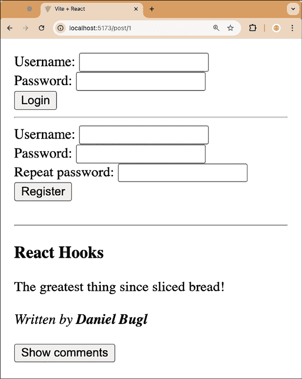
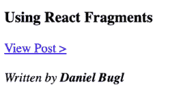

# 8

# 使用 Hooks 进行路由

在上一章中，我们学习了如何使用**Action State Hook**处理表单提交，如何使用**Transition Hook**避免 UI 阻塞，以及如何使用**Optimistic Hook**实现乐观更新。

在本章中，我们将学习如何在我们的博客应用中通过使用**React Router**实现客户端路由。首先，我们将学习 React Router 是如何工作的，以及它提供了哪些功能。然后，我们将创建一个新的路由来查看单个帖子，并使用**Param Hook**从 URL 中获取帖子 ID。接下来，我们将学习如何使用`Link`组件链接到不同的路由。最后，我们将学习如何使用**Navigation Hook**编程式实现导航以重定向到新创建的帖子。

本章将涵盖以下主题：

+   介绍 React Router

+   创建新路由并使用 Param Hook

+   使用 Link 组件链接到路由

+   使用 Navigation Hook 进行编程式重定向

# 技术要求

应该已经安装了相当新的 Node.js 版本。Node 包管理器（`npm`）也需要安装（它应该随 Node.js 一起提供）。有关如何安装 Node.js 的更多信息，请查看他们的官方网站：[`nodejs.org/`](https://nodejs.org/)

我们将在本书的指南中使用**Visual Studio Code**（**VS Code**），但在任何其他编辑器中一切都应该类似。有关如何安装 VS Code 的更多信息，请参阅他们的官方网站：[`code.visualstudio.com`](https://code.visualstudio.com)

在本书中，我们使用以下版本：

+   Node.js v22.14.0

+   `npm` v10.9.2

+   Visual Studio Code v1.97.2

在前面列出的版本是书中使用的版本。虽然安装较新版本通常不会有问题，但请注意，某些步骤在较新版本上可能工作方式不同。如果您在使用本书提供的代码和步骤时遇到问题，请尝试使用提到的版本。

您可以在 GitHub 上找到本章的代码：[`github.com/PacktPublishing/Learn-React-Hooks-Second-Edition/tree/main/Chapter08`](https://github.com/PacktPublishing/Learn-React-Hooks-Second-Edition/tree/main/Chapter08)

强烈建议您自己编写代码。不要简单地运行书中提供的代码示例。自己编写代码对于正确学习和理解代码非常重要。然而，如果您遇到任何问题，您始终可以参考代码示例。

# 介绍 React Router

React Router 最初是一个简单、声明式的路由库。它为我们提供了定义和管理应用程序不同路由的功能，以及在这些路由之间导航。最近，React Router 也可以用作 React 框架，提供处理布局和高级服务器端渲染的方法。然而，由于本书专注于 Hooks，我们将专注于将 React Router 作为库。

该库由三个主要组件组成：

+   `BrowserRouter` 组件，它提供了一个上下文来使用路由

+   `Routes` 组件，它允许我们定义一些路由并渲染当前活动路由的组件

+   `Route` 组件，它允许我们定义一个特定的路由和要渲染的组件

此外，该库提供了创建指向特定路由的链接的组件（使用 `Link` 和 `NavLink` 组件），以及从 URL 获取参数（参数钩子）和导航（导航钩子）的钩子。

现在，让我们开始设置 React Router 和索引路由（它将包含我们博客的主页，显示博客帖子的源）。索引路由将是我们的服务器主 URL 上提供的内容，有时也称为入口点或 `/` 路由。

## 设置 React Router

按照以下步骤开始设置 React Router 库和索引路由：

1.  通过执行以下命令将 `Chapter07_4` 文件夹复制到新的 `Chapter08_1` 文件夹：

    ```js
    $ cp -R Chapter07_4 Chapter08_1 
    ```

1.  在 VS Code 中打开新的 `Chapter08_1` 文件夹。

1.  打开一个终端，并按照以下方式安装 `react-router` 库：

    ```js
    $ npm install --save-exact react-router@7.2.0 
    ```

1.  创建一个新的 `src/pages/` 文件夹，我们将把应用程序的各种页面放在其中。

1.  创建一个新的 `src/pages/Home.jsx` 文件来包含我们博客应用程序的主页（将显示我们之前已有的帖子源）。

1.  在其中，导入 `Suspense`、`PostFeed` 和 `ThemeContext`：

    ```js
    import { Suspense } from 'react'
    import { PostFeed } from '@/components/post/PostFeed.jsx'
    import { ThemeContext } from '@/contexts/ThemeContext.js' 
    ```

1.  定义并导出 `Home` 组件，该组件在加载帖子时显示回退，然后以特殊颜色显示特色帖子，然后显示常规帖子：

    ```js
    export function Home() {
      return (
        <Suspense fallback={<strong>Loading posts...</strong>}>
          <ThemeContext.Provider value={{ primaryColor: 'salmon' }}>
    <PostFeed featured />
    </ThemeContext.Provider>
    <PostFeed />
    </Suspense>
      )
    } 
    ```

1.  编辑 `src/App.jsx` 并*删除* `Suspense` 的导入，因为我们不再需要它了：

    ```js
    import { useState**,** **Suspense** } from 'react' 
    ```

1.  此外，*删除* `PostFeed` 组件的导入：

    ```js
    import { PostFeed } from './components/post/PostFeed.jsx' 
    ```

1.  然后，从 `react-router` 中导入 `BrowserRouter`、`Routes` 和 `Route`：

    ```js
    import { BrowserRouter, Routes, Route } from 'react-router' 
    ```

1.  此外，导入 `Home` 页面组件：

    ```js
    import { Home } from './pages/Home.jsx' 
    ```

1.  在 `App` 组件内部，定义 `BrowserRouter`，确保它包装了所有组件，这样我们就可以在标题组件中使用导航钩子：

    ```js
    export function App() {
      const [username, setUsername] = useState('')
      return (
        <QueryClientProvider client={queryClient}>
    <UserContext.Provider value={[username, setUsername]}>
    <ThemeContext.Provider value={{ primaryColor: 'black' }}>
    **<****BrowserRouter****>**
    <div style={{ padding: 8 }}>
    <UserBar />
    <br />
                  {username && <CreatePost />}
                  <hr /> 
    ```

1.  在 `ErrorBoundary` 内部，*替换* `Suspense` 组件及其所有子组件。相反，渲染 `Routes` 组件，在其中我们可以为我们的应用程序定义路由：

    ```js
     <QueryErrorResetBoundary>
                    {({ reset }) => (
                      <ErrorBoundary
     onReset={reset}
     fallbackRender={FetchErrorNotice}
                      >
    **<****Routes****>** 
    ```

1.  定义一个索引路由，用于渲染 `Home` 页面组件：

    ```js
    **<****Route****index****element****=****{****<****Home** **/>****} />**
    **</****Routes****>**
    </ErrorBoundary>
                    )}
                  </QueryErrorResetBoundary>
    </div>
    **</****BrowserRouter****>**
    </ThemeContext.Provider>
    </UserContext.Provider>
    </QueryClientProvider>
      )
    } 
    ```

1.  按照以下方式运行应用程序：

    ```js
    $ npm run dev 
    ```

当在浏览器中打开应用程序时，你会看到它看起来与之前完全一样，但现在主页是通过 React Router 而不是硬编码来渲染的！

**示例代码**

本节的示例代码可以在`Chapter08/Chapter08_1`文件夹中找到。请检查文件夹内的`README.md`文件，以获取设置和运行示例的说明。

# 创建一个新的路由并使用 Param Hook

现在我们已经成功设置了 React Router，我们可以开始创建一个新的路由来查看单个帖子。这个路由看起来如下所示：`/post/:id`，其中`:id`是一个包含要查看的帖子 ID 的 URL 参数。

**URL 参数**是在 URL 中使用的参数，用于定义动态内容。例如，在`/post/:id`路由中，`/post/`部分将是一个静态字符串，但`:id`将被替换为动态帖子 ID。假设你有一个以`/post/8`结尾的 URL，这意味着该路由与设置为`8`的`id`参数匹配。

让我们开始设置页面和路由：

1.  通过执行以下命令将`Chapter08_1`文件夹复制到一个新的`Chapter08_2`文件夹：

    ```js
    $ cp -R Chapter08_1 Chapter08_2 
    ```

1.  在 VS Code 中打开新的`Chapter08_2`文件夹。

1.  编辑`src/api.js`并定义一个新的函数来获取单个帖子：

    ```js
    export async function fetchPost({ id }) {
      const res = await fetch(`/api/posts/${id}`)
      return await res.json()
    } 
    ```

1.  编辑`src/components/post/Post.jsx`并导入`useSuspenseQuery`和`fetchPost`函数：

    ```js
    import { useSuspenseQuery } from '@tanstack/react-query'
    import { fetchPost } from '@/api.js' 
    ```

1.  将`Post`组件更改为仅接受`id`属性：

    ```js
    export function Post({ **id** }) { 
    ```

1.  在`Post`组件内部，添加一个**Suspense Query Hook**来获取帖子并获取所有数据：

    ```js
     const { data } = useSuspenseQuery({
        queryKey: ['post', id],
        queryFn: async () => await fetchPost({ id }),
      })
      const { title, content, author } = data 
    ```

1.  创建一个新的`src/pages/ViewPost.jsx`文件。在文件内部，导入`Suspense`，从`react-router`导入`useParams`函数和`Post`组件：

    ```js
    import { Suspense } from 'react'
    import { useParams } from 'react-router'
    import { Post } from '@/components/post/Post.jsx' 
    ```

1.  定义并导出`ViewPost`页面组件：

    ```js
    export function ViewPost() { 
    ```

1.  使用 Params Hook 从 URL 参数中获取`id`：

    ```js
     const { id } = useParams() 
    ```

1.  使用`Suspense`边界在帖子获取时提供回退，然后渲染`Post`组件：

    ```js
     return (
        <Suspense fallback={<strong>Loading post...</strong>}>
          <Post id={id} />
    </Suspense>
      )
    } 
    ```

1.  编辑`src/App.jsx`并导入`ViewPost`组件：

    ```js
    import { ViewPost } from './pages/ViewPost.jsx' 
    ```

1.  然后，为`ViewPost`页面定义一个新的带有`:id`参数的路由：

    ```js
     <Routes>
                          <Route index element={<Home />} />
    **<****Route****path****=****'post/:id'****element****=****{****<****ViewPost** **/>****} />**
                        </Routes> 
    ```

1.  按照以下方式运行应用程序，在整个章节的其余部分保持运行状态：

    ```js
    $ npm run dev 
    ```

现在可以通过在浏览器中的 URL 后附加`/post/:id`来手动访问单个帖子页面（例如`/post/1`）：



图 8.1 – 在我们新定义的路由上查看单个帖子

然而，如果我们能通过点击主页上的主帖流中的某个帖子来访问这个页面，那就太好了。让我们在下一节中通过使用`Link`组件来实现这个功能。

# 使用<Link>组件链接到路由

当处理用户可以点击以访问不同页面的链接时，最好且最简单的方法是使用`Link`组件。这个组件将自动为我们创建一个指向特定页面的简单链接。

让我们开始使用`Link`组件来提供一个指向单个帖子的链接：

1.  创建一个新的`src/components/post/PostListItem.jsx`文件，在其中我们将定义`Post`组件的简化版本，该版本将在`PostList`组件中显示。在文件内部，导入`useContext`函数，`ThemeContext`和`Link`组件从`react-router`：

    ```js
    import { useContext } from 'react'
    import { ThemeContext } from '@/contexts/ThemeContext.js'
    import { Link } from 'react-router' 
    ```

1.  定义并导出`PostListItem`组件，它接受帖子`id`、`title`和`author`作为 props：

    ```js
    export function PostListItem({ id, title, author }) { 
    ```

1.  定义一个 Context Hook 来获取主题：

    ```js
     const theme = useContext(ThemeContext) 
    ```

1.  渲染标题，就像我们之前做的那样：

    ```js
     return (
        <div>
          <h3 style={{ color: theme.primaryColor }}>{title}</h3> 
    ```

1.  现在，渲染一个`Link`组件，它将导航到`/post/:id`并显示`ViewPost`页面：

    ```js
     <div>
            <Link to={`/post/${id}`}>View Post &gt;</Link>
          </div> 
    ```

1.  然后，显示作者，但不显示内容，以避免使信息过载：

    ```js
     <br />
          <i>
            Written by <b>{author}</b>
    </i>
        </div>
      )
    } 
    ```

1.  编辑`src/components/post/PostList.jsx`并将`Post`导入替换为`PostListItem`组件的导入：

    ```js
    import { **PostListItem** } from './**PostListItem**.jsx' 
    ```

1.  将`PostListItem`组件渲染代替`Post`组件：

    ```js
     {posts.map((post) => (
            <Fragment key={post.id}>
    <**PostListItem** {...post} /> 
    ```

现在可以从首页跳转到单个帖子：



图 8.2 – 链接组件渲染“查看帖子 >”链接以跳转到单个帖子页面

但仍然没有返回首页的方法。让我们在下一节中实现它。

## 使用`<NavLink>`定义导航栏

如果我们想要给链接添加样式，例如，实现一个显示我们当前所在页面的导航栏，我们可以使用`NavLink`组件。

让我们使用这个组件来实现一个带有返回首页链接的导航栏：

1.  创建一个新的`src/components/NavBarLink.jsx`文件。在其内部，导入`NavLink`组件：

    ```js
    import { NavLink } from 'react-router' 
    ```

1.  定义并导出一个组件，它接受一个`to`prop，用于定义我们应该链接到哪个路由，以及一个`children`prop 来提供要放在链接上的文本或组件：

    ```js
    export function NavBarLink({ children, to }) {
      return (
        <NavLink
     to={to} 
    ```

1.  然后，定义一个`style`，在其中检查链接是否处于激活状态（当我们当前在页面上时），然后以粗体形式渲染它：

    ```js
     style={({ isActive }) => ({
            fontWeight: isActive ? 'bold' : 'normal',
          })}
        >
          {children}
        </NavLink>
      )
    } 
    ```

1.  编辑`src/App.jsx`并导入`NavBarLink`组件，如下所示：

    ```js
    import { NavBarLink } from './components/NavBarLink.jsx' 
    ```

1.  在我们的博客应用的头部部分，在`UserBar`之前定义一个返回索引/首页的`NavBarLink`：

    ```js
     <BrowserRouter>
                <div style={{ padding: 8 }}>
    **<****NavBarLink****to****=****'/'****>****Home****</****NavBarLink****>**
    **<****hr** **/>**
    <UserBar /> 
    ```

现在我们有了一种从首页跳转到单个帖子，然后再回到首页查看其他帖子的方法：


图 8.3 – 渲染一个“首页”`NavLink`，当前处于激活状态（粗体）

接下来，让我们看看在创建新帖子后如何程序化地导航到单个帖子页面。

# 使用 Navigation Hook 进行程序化导航

每当我们想要程序化导航而不是让用户点击链接时，我们可以使用 React Router 提供的 Navigation Hook。Navigation Hook 提供了一个用于程序化导航的函数。

让我们现在开始使用 Navigation Hook：

1.  编辑`src/components/post/CreatePost.jsx`并导入`useNavigate`函数：

    ```js
    import { useNavigate } from 'react-router' 
    ```

1.  在`CreatePost`组件内部定义一个 Navigate Hook：

    ```js
    export function CreatePost() {
      const [username] = useContext(UserContext)
    **const** **navigate =** **useNavigate****()** 
    ```

1.  在 Action State Hook 内部，从 mutation 中获取结果，然后重定向到新创建的帖子的`ViewPost`页面：

    ```js
     const [error, submitAction, isPending] = useActionState(
        async (currentState, formData) => {
          const title = formData.get('title')
          const content = formData.get('content')
          const newPost = { title, content, author: username, featured: false }
          try {
            **const** **result =** await createPostMutation.mutateAsync(newPost)
    **navigate****(****`/post/****${result.id}****`****)**
          } catch (err) {
            return err
          }
        },
      ) 
    ```

1.  尝试在博客应用中创建一个新的帖子，你会看到你被重定向到新创建的帖子页面！

我们已经在我们的博客应用程序中成功实现了路由！作为一个练习，你现在可以尝试在单独的页面上实现登录/注册表单和创建文章表单。在这样做的时候，我建议将主页链接重构为一个新的 `NavBar` 组件，其中包含链接到各个页面。

**示例代码**

本节示例代码位于 `Chapter08/Chapter08_2` 文件夹中。请检查文件夹内的 `README.md` 文件，以获取设置和运行示例的说明。

# 概述

在本章中，我们首先学习了 React Router 库的工作原理以及它由哪些组件组成。然后，我们设置了库以及博客主页的索引路由（显示博客文章的列表）。接下来，我们定义了一个新的路由来显示单独页面上的单个文章，并使用 Params 钩子从 URL 中获取 `id` 值。然后，我们学习了如何使用 `Link` 和 `NavLink` 组件导航到这个新路由以及如何返回主页。最后，我们学习了如何通过使用导航钩子程序化地导航到在文章成功创建后的路由。

在下一章中，我们将学习 React 提供的更高级的内置钩子。

# 问题

为了回顾本章学到的内容，尝试回答以下问题：

1.  React Router 库由哪些组件组成？

1.  我们如何使用 React Router 库定义一个新的路由？

1.  我们如何在 URL 中读取动态值（参数）？

1.  使用 React Router 定义链接有哪些方法，它们有何不同？

1.  哪个钩子用于使用 React Router 程序化导航？

# 进一步阅读

如果你对本章学到的概念有更多兴趣，请查看以下链接：

+   React Router 的官方网站：[`reactrouter.com/`](https://reactrouter.com/)

# 在 Discord 上了解更多

要加入本书的 Discord 社区——在那里你可以分享反馈、向作者提问以及了解新版本——请扫描下面的二维码：

`packt.link/wnXT0`


