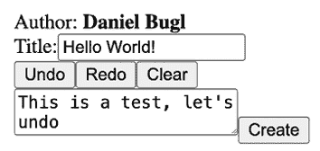
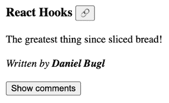
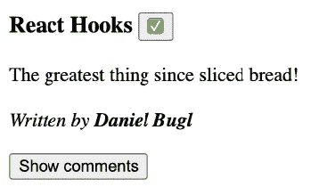
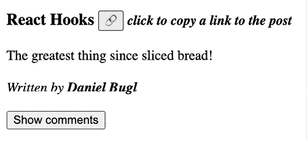

# 10

# 使用社区钩子

在上一章中，我们学习了各种内置的 React 钩子。

在本章中，我们将学习社区提供的各种钩子。首先，我们将学习如何使用钩子管理应用程序状态。然后，我们将使用钩子实现**防抖**。接下来，我们将学习有关各种实用钩子的内容。最后，我们将学习在哪里可以找到更多社区钩子。

本章将涵盖以下主题：

+   使用钩子管理应用程序状态

+   使用钩子进行防抖

+   了解各种实用钩子

+   寻找更多社区钩子

# 技术要求

应已安装相当新的 Node.js 版本。Node 包管理器 (`npm`) 也需要安装（它应该与 Node.js 一起提供）。有关如何安装 Node.js 的更多信息，请访问他们的官方网站：[`nodejs.org/`](https://nodejs.org/)

我们将在本书的指南中使用 **Visual Studio Code** （**VS Code**），但在任何其他编辑器中一切都应该类似。有关如何安装 VS Code 的更多信息，请参阅他们的官方网站：[`code.visualstudio.com`](https://code.visualstudio.com)

在本书中，我们使用以下版本：

+   Node.js v22.14.0

+   `npm` v10.9.2

+   Visual Studio Code v1.97.2

上列出的版本是本书中使用的版本。虽然安装较新版本不应有问题，但请注意，某些步骤在较新版本上可能有所不同。如果您在本书中遇到代码和步骤问题，请尝试使用提到的版本。

您可以在 GitHub 上找到本章的代码：[`github.com/PacktPublishing/Learn-React-Hooks-Second-Edition/tree/main/Chapter10`](https://github.com/PacktPublishing/Learn-React-Hooks-Second-Edition/tree/main/Chapter10)

强烈建议您自己编写代码。不要简单地运行书中提供的代码示例。自己编写代码对于正确学习和理解代码非常重要。然而，如果您遇到任何问题，您始终可以参考代码示例。

# 使用钩子管理应用程序状态

在本节中，我们将学习各种社区钩子，这些钩子可以帮助您管理应用程序状态。这些钩子由 [useHooks.com](https://www.useHooks.com) 提供，这是一个包含各种有用钩子的单一库。

## useLocalStorage

**本地存储钩子**允许您使用浏览器的**LocalStorage API**存储和检索数据。LocalStorage API 是在用户浏览器中持久存储信息的一种方式。我们可以用它来存储有关当前登录用户的信息。

`useLocalStorage` 函数具有以下签名：

```js
const [data, saveData] = useLocalStorage(key, initialValue) 
```

如我们所见，本地存储钩子接受一个键（用于在本地存储中标识数据）和一个初始值（当本地存储中没有给定键的项时用作回退）。然后它返回一个类似于**状态钩子**的 API：数据本身，以及一个用于更新本地存储中数据的函数。

在我们的案例中，我们只是简单地将用户名存储在本地存储中。

在实际应用中，你应该存储一个令牌，例如**JSON Web Token**（JWT），并且理想情况下将其存储在 Cookie 中而不是本地存储。然而，这需要服务器和一些全栈知识。要了解更多关于使用 React 的全栈项目，包括现实世界的身份验证，请参阅我的书籍：*现代全栈 React 项目*。

按照以下步骤开始将用户名存储在本地存储中：

1.  通过执行以下命令将`Chapter09_1`文件夹复制到新的`Chapter10_1`文件夹：

    ```js
    $ cp -R Chapter09_1 Chapter10_1 
    ```

1.  在 VS Code 中打开新的`Chapter10_1`文件夹。

1.  按照以下步骤安装`useHooks`库：

    ```js
    $ npm install --save-exact @uidotdev/usehooks@2.4.1 
    ```

1.  *删除*`src/contexts/UserContext.js`文件。我们现在将用本地存储替换`UserContext`。

1.  编辑`src/App.jsx`并删除以下导入：

    ```js
    import { useState } from 'react'
    import { UserContext } from './contexts/UserContext.js' 
    ```

1.  相反，*替换*它们为以下导入：

    ```js
    import { useLocalStorage } from '@uidotdev/usehooks' 
    ```

1.  *删除*以下状态钩子：

    ```js
    export function App() {
    **const** **[username, setUsername] =** **useState****(****''****)** 
    ```

1.  *替换*它为本地存储钩子：

    ```js
    export function App() {
    **const** **[username] =** **useLocalStorage****(****'username'****,** **null****)** 
    ```

1.  *删除*`UserContext`通过删除以下高亮行：

    ```js
     return (
        <QueryClientProvider client={queryClient}>
    **<****UserContext.Provider****value****=****{[username,****setUsername****]}>**
            …
    **</****UserContext.Provider****>**
    </QueryClientProvider>
      )
    } 
    ```

1.  编辑`src/components/user/UserBar.jsx`并删除以下导入：

    ```js
    import { useContext } from 'react'
    import { UserContext } from '@/contexts/UserContext.js' 
    ```

1.  *替换*它们为对`useLocalStorage`函数的导入：

    ```js
    import { useLocalStorage } from '@uidotdev/usehooks' 
    ```

1.  然后，按照以下方式将上下文钩子替换为本地存储钩子：

    ```js
    export function UserBar() {
      const [username] = **useLocalStorage****(****'username'****,** **null****)** 
    ```

1.  编辑`src/components/user/Register.jsx`并将所有导入替换为以下内容：

    ```js
    import { useState } from 'react'
    import { useLocalStorage } from '@uidotdev/usehooks' 
    ```

1.  现在，*替换*上下文钩子为本地存储钩子：

    ```js
    export function Register() {
      const [, setUsername] = **useLocalStorage****(****'username'****,** **null****)** 
    ```

1.  编辑`src/components/user/Login.jsx`并将所有导入替换为以下内容：

    ```js
    import { useLocalStorage } from '@uidotdev/usehooks' 
    ```

1.  接下来，*替换*上下文钩子为本地存储钩子：

    ```js
    export function Login() {
      const [, setUsername] = **useLocalStorage****(****'username'****,** **null****)** 
    ```

1.  编辑`src/components/user/Logout.jsx`并将所有导入替换为以下内容：

    ```js
    import { useState, useEffect } from 'react'
    import { useLocalStorage } from '@uidotdev/usehooks' 
    ```

1.  *替换*上下文钩子为本地存储钩子：

    ```js
    export function Logout() {
    **const** **[username, setUsername] =** **useLocalStorage****(****'username'****,** **null****)** 
    ```

1.  编辑`src/components/post/CreatePost.jsx`并删除`useContext`导入：

    ```js
    import { **useContext**, useActionState } from 'react' 
    ```

1.  然后，*删除*以下导入：

    ```js
    import { UserContext } from '@/contexts/UserContext.js' 
    ```

1.  *替换*它为`useLocalStorage`的导入：

    ```js
    import { useLocalStorage } from '@uidotdev/usehooks' 
    ```

1.  *替换*上下文钩子为本地存储钩子：

    ```js
    export function CreatePost() {
      const [username] = **useLocalStorage****(****'username'****,** **null****)** 
    ```

1.  编辑`src/components/comment/CreateComment.jsx`并将所有导入替换为以下内容：

    ```js
    import { useLocalStorage } from '@uidotdev/usehooks' 
    ```

1.  然后，*替换*上下文钩子为本地存储钩子：

    ```js
    export function CreateComment({ addComment }) {
      const [username] = **useLocalStorage****(****'username'****,** **null****)** 
    ```

1.  编辑`src/components/comment/CommentList.jsx`并删除`useContext`导入：

    ```js
    import { useContext, useState, useOptimistic } from 'react' 
    ```

1.  *删除*以下导入：

    ```js
    import { **UserContext** } from '@/contexts/UserContext.js' 
    ```

1.  *替换*它为`useLocalStorage`的导入：

    ```js
    import { useLocalStorage } from '@uidotdev/usehooks' 
    ```

1.  *替换*上下文钩子为本地存储钩子：

    ```js
    export function CommentList() {
      const [username] = **useLocalStorage****(****'username'****,** **null****)** 
    ```

1.  现在，按照以下步骤运行博客应用：

    ```js
    $ npm run dev 
    ```

你会发现注册、登录和注销仍然像以前一样工作，但现在有一个额外的优势：当刷新页面时，用户会保持登录状态，直到他们按下**注销**按钮！

正如你所见，本地存储钩子是持久化存储浏览器中信息的一种极好方式！

## useHistoryState

**历史状态 Hook** 是状态 Hook 的扩展版本，增加了对状态撤销/重做更改的功能。它具有以下签名：

```js
const { state, set, undo, redo, clear, canUndo, canRedo } = useHistoryState(initialState) 
```

我们向其提供一个初始状态，并返回当前的`状态`，一个用于`设置`状态的函数，一个用于撤销状态更改的`撤销`函数，一个用于重做更改的`重做`函数，一个用于将状态重置到初始状态的`清除`函数，以及`canUndo`和`canRedo`标志来告知是否可以撤销/重做状态。

理解这个 Hook 的最好方法是亲自尝试，所以让我们开始为我们的`CreatePost`组件实现撤销/重做功能：

1.  编辑`src/components/post/CreatePost.jsx`并导入`useHistoryState`函数：

    ```js
    import { useLocalStorage, **useHistoryState** } from '@uidotdev/usehooks' 
    ```

1.  为帖子内容定义一个历史状态 Hook，如下所示：

    ```js
    export function CreatePost() {
      const [username] = useLocalStorage('username', null)
      const navigate = useNavigate()
    **const** **{ state, set, undo, redo, clear, canUndo, canRedo } =**
    **useHistoryState****(****''****)** 
    ```

1.  定义一个处理函数，当用户更改内容时使用：

    ```js
     function handleContentChange(e) {
        const { value } = e.target
    set(value)
      } 
    ```

1.  定义撤销/重做和清除内容的按钮：

    ```js
     <div>
    <label htmlFor='create-title'>Title:</label>
    <input type='text' name='title' id='create-title' />
    </div>
    **<****div****>**
    **<****button****type****=****'****button'****disabled****=****{!canUndo}****onClick****=****{undo}****>**
     **Undo**
    **</****button****>**
    **<****button****type****=****'****button'****disabled****=****{!canRedo}****onClick****=****{redo}****>**
     **Redo**
    **</****button****>**
    **<****button****type****=****'****button'****onClick****=****{clear}****>**
     **Clear**
    **</****button****>**
    **</****div****>** 
    ```

在这里为所有按钮添加`type='button'`属性非常重要。否则，按下这些按钮将提交表单。

1.  通过提供`value`和`onChange`处理函数将`<textarea>`变为受控元素：

    ```js
     <textarea name='content' **value****=****{state}**
     **onChange****=****{****handleContentChange****} />** 
    ```

1.  最后，在创建帖子成功后，在 Action State Hook 中调用`清除`函数：

    ```js
     const [error, submitAction, isPending] = useActionState(
        async (currentState, formData) => {
          const title = formData.get('title')
          const content = formData.get('content')
          const post = { title, content, author: username, featured:           false }
          try {
            const result = await createPostMutation.mutateAsync(post)
            **clear****()**
    navigate(`/post/${result.id}`)
          } catch (err) {
            return err
          }
        },
      ) 
    ```

由于我们现在处理的是一个受控元素，我们需要自己清除其内容。在表单提交时不再自动执行。

1.  按照以下步骤启动博客应用：

    ```js
    $ npm run dev 
    ```

你会看到现在有三个新的按钮，如下面的截图所示：



图 10.1 – 在创建帖子时提供撤销/重做/清除按钮

尝试在字段中输入一些文本，你将能够撤销/重做对该字段所做的更改！然而，你可能已经注意到，每次只能撤销/重做单个字符。接下来，我们将实现防抖，这意味着我们的更改将在一定时间后添加到撤销/重做历史中，而不是在输入每个字符后。

**示例代码**

本节的示例代码可以在`Chapter10/Chapter10_1`文件夹中找到。请检查文件夹内的`README.md`文件，以获取设置和运行示例的说明。

# 防抖与 Hooks

正如我们在上一节中看到的，当我们按下撤销时，它每次撤销一个字符。有时，我们不想将每次更改都存储在撤销历史中。为了避免存储每次更改，我们需要实现防抖，这意味着将`content`存储到历史状态的函数只有在一定时间内没有更改后才会被调用。

`use-debounce`库提供了一个**防抖 Hook**，可以像以下这样用于简单值：

```js
const [text, setText] = useState('')
const [value] = useDebounce(text, 1000) 
```

现在，如果我们通过`setText`更改文本，`text`值将立即更新，但`value`变量将在 1000 毫秒（1 秒）后更新。

然而，对于我们的用例，这还不够。我们需要防抖回调来实现与历史状态 Hook 结合的防抖。幸运的是，`use-debounce` 库还提供了防抖回调 Hook，可以按照以下方式使用：

```js
const [text, setText] = useState('')
const [debouncedSet, cancelDebounce] = useDebouncedCallback(
  (value) => setText(value),
  1000
) 
```

现在，如果我们调用 `debouncedSet('text')`，`text` 值将在 1000 毫秒（1 秒）后更新。如果多次调用 `debouncedSet`，每次都会重置超时，只有在 1000 毫秒内没有进一步调用 `debouncedSet` 函数后，`setText` 函数才会被调用。

## 在帖子编辑器中防抖更改

现在我们已经了解了防抖，我们将在帖子编辑器中将它与历史状态 Hook 结合起来实现。按照以下步骤开始：

1.  通过执行以下命令将 `Chapter10_1` 文件夹复制到新的 `Chapter10_2` 文件夹：

    ```js
    $ cp -R Chapter10_1 Chapter10_2 
    ```

1.  在 VS Code 中打开新的 `Chapter10_2` 文件夹。

1.  按照以下方式安装 `use-debounce` 库：

    ```js
    $ npm install --save-exact use-debounce@10.0.4 
    ```

1.  编辑 `src/components/post/CreatePost.jsx` 并导入 `useState`、`useEffect` 和 `useDebouncedCallback` 函数：

    ```js
    import { useActionState, **useState, useEffect** } from 'react'
    **import** **{ useDebouncedCallback }** **from****'use-debounce'** 
    ```

1.  定义一个新的状态 Hook，它将包含受控输入值：

    ```js
     const { state, set, undo, redo, clear, canUndo, canRedo } =
        useHistoryState('')
    **const** **[content, setContent] =** **useState****(****''****)** 
    ```

1.  然后，定义一个**防抖回调 Hook**，它将在 200 毫秒后设置历史状态：

    ```js
     const debounced = useDebouncedCallback((value) => set(value), 200) 
    ```

1.  接下来，我们必须定义一个 Effect Hook，它将在历史状态更改时触发，取消当前的防抖，并将受控输入值设置为历史状态 Hook 的当前值：

    ```js
     useEffect(() => {
        debounced.cancel()
        setContent(state)
      }, [state, debounced]) 
    ```

1.  调整处理函数以触发 `setContent` 函数来更新受控输入值，以及 `debounced` 函数来更新历史状态：

    ```js
     function handleContentChange(e) {
        const { value } = e.target
    **setContent****(value)**
    **debounced****(value)**
      } 
    ```

1.  最后，调整 `textarea` 以使用 `content` 而不是 `state` 作为其值：

    ```js
     <textarea name='content' value={**content**} onChange={handleContentChange} /> 
    ```

1.  按照以下方式启动博客应用：

    ```js
    $ npm run dev 
    ```

我们现在立即设置受控输入值，但还没有将其存储到历史状态中。在防抖回调触发（200 毫秒后），我们将当前值存储到历史状态中。每当历史状态更新时，例如，当我们按下 **撤销**/** 重做**按钮时，我们将取消当前的防抖以避免在撤销/重做后覆盖值。然后，我们将受控输入值设置为历史状态 Hook 的新值。

如果我们现在在我们的编辑器中输入一些文本，我们可以看到 **撤销** 按钮需要一段时间才会激活。如果我们现在按下 **撤销** 按钮，我们可以看到我们不会逐字符撤销，而是会一次性撤销更多文本。正如我们所看到的，撤销/重做与防抖结合得非常好！

## 防抖值与延迟值之间的区别

你可能记得，在 *第九章* 中，*React 提供的高级 Hooks*，我们使用了**延迟值 Hook**来等待新的搜索结果到来后再显示，这样我们就可以避免在等待新结果时显示加载界面。虽然我们也可以在那里使用防抖，但使用防抖在这个用例中也有一些缺点。

消抖和延迟值之间的主要区别在于，当消抖时，我们定义一个固定的时间间隔，在此之后值被更新。然而，延迟值会在每次更改后尝试更新（如果出现新的更改，则取消更新）。因此，延迟值不是限制在固定的时间间隔内，而是限制在请求可以处理的速度上。

**示例代码**

本节示例代码位于`Chapter10/Chapter10_2`文件夹中。请检查文件夹内的`README.md`文件，了解如何设置和运行示例。

# 了解各种实用钩子

我们现在将学习一些由 useHooks 库提供的有用实用钩子。

## useCopyToClipboard

**复制到剪贴板钩子**使得在不同浏览器之间复制文本变得容易。如果可用，它使用现代的`navigator.clipboard.writeText` API。否则，它回退到传统的`document.execCommand("copy")`方法，确保该功能对旧版和新版浏览器都有效。此钩子也由[`www.useHooks.com`](https://www.useHooks.com)提供。

`useCopyToClipboard`函数具有以下签名：

```js
const [copiedText, copyToClipboard] = useCopyToClipboard() 
```

它提供了一个与 State Hook 类似的 API，其中`copyToClipboard`函数接受一个字符串并将其复制到剪贴板，同时存储在`copiedText`值中。此值也可以用来检查我们是否成功将文本复制到剪贴板。

现在，让我们使用钩子来实现复制博客文章链接的方法：

1.  通过执行以下命令将`Chapter10_2`文件夹复制到新的`Chapter10_3`文件夹：

    ```js
    $ cp -R Chapter10_2 Chapter10_3 
    ```

1.  在 VS Code 中打开新的`Chapter10_3`文件夹。

1.  创建一个新的`src/components/post/CopyLink.jsx`文件。

1.  在其中，导入`useCopyToClipboard`函数：

    ```js
    import { useCopyToClipboard } from '@uidotdev/usehooks' 
    ```

1.  为复制链接按钮定义一个勾选和链接表情符号：

    ```js
    const CHECKMARK_EMOJI = <>&#9989;</>
    const LINK_EMOJI = <>&#128279;</> 
    ```

1.  然后，定义一个接受`url`的组件：

    ```js
    export function CopyLink({ url }) { 
    ```

1.  在组件内部，定义复制到剪贴板钩子，如下所示：

    ```js
     const [copiedText, copyToClipboard] = useCopyToClipboard() 
    ```

1.  现在，渲染一个触发`copyToClipboard`函数的按钮：

    ```js
     return (
        <button type='button' onClick={() => copyToClipboard(url)}> 
    ```

1.  如果链接已被复制，显示勾选符号，否则显示链接符号：

    ```js
     {copiedText ? CHECKMARK_EMOJI : LINK_EMOJI}
        </button>
      )
    } 
    ```

1.  编辑`src/components/post/Post.jsx`并导入`CopyLink`组件：

    ```js
    import { CopyLink } from './CopyLink.jsx' 
    ```

1.  在博客文章标题旁边渲染该组件，并将当前 URL 传递给它：

    ```js
     <h3 style={{ color: theme.primaryColor }}>
            {title} **<****CopyLink** **url={****window****.****location****.****href****} />**
          </h3> 
    ```

1.  按照以下方式启动博客应用：

    ```js
    $ npm run dev 
    ```

1.  点击一个**查看帖子 >**链接进入单个帖子页面。您将看到一个带有链接表情符号的按钮：



图 10.2 – 在博客文章标题旁边显示“复制链接”按钮

1.  点击此按钮后，它将显示勾选表情符号并将当前 URL 复制到您的剪贴板：



图 10.3 – 成功复制链接后按钮的状态

尝试将链接粘贴到某处，看看是否成功！

## useHover

**悬停 Hook**跟踪用户是否悬停在元素上。它具有以下签名：

```js
const [ref, hovering] = useHover() 
```

如我们所见，它返回一个`ref`，我们需要将其传递给我们要跟踪悬停状态的元素。它还返回一个`hovering`状态，如果用户悬停在元素上，则为`true`，如果没有，则为`false`。此 Hook 也由[useHooks.com](https://www.useHooks.com)提供。

现在我们使用悬停 Hook 在用户悬停在复制链接按钮上时显示提示：

1.  编辑`src/components/post/CopyLink.jsx`并导入`useHover`函数：

    ```js
    import { useCopyToClipboard, **useHover** } from '@uidotdev/usehooks' 
    ```

1.  然后，定义一个悬停 Hook：

    ```js
    export function CopyLink({ url }) {
      const [copiedText, copyToClipboard] = useCopyToClipboard()
    **const** **[ref, hovering] =** **useHover****()** 
    ```

1.  创建一个 Fragment，以便我们可以在按钮旁边显示一条消息：

    ```js
     return (
        **<>** 
    ```

1.  将悬停 Hook 的`ref`传递给按钮：

    ```js
     <button **ref={ref}** type='button' onClick={() => copyToClipboard(url)}> 
    ```

1.  如果我们悬停在按钮上，将显示如下的小信息文本：

    ```js
     {copiedText ? CHECKMARK_EMOJI : LINK_EMOJI}
          </button>
     **{hovering && (**
    **<****small****>**
    **<****i****>** **{copiedText ?** **'copied!'** **:** **'click to copy a link to the** 
     **post'****}****</****i****>**
    **</****small****>**
     **)}**
    **</>**
      )
    } 
    ```

    在实际项目中，UI 中的大多数悬停效果都会使用 CSS 完成。使用悬停 Hook 的一个实际示例是在悬停时向分析 API 发送事件。然而，这会比显示悬停文本的示例长得多。

现在尝试悬停在复制链接按钮上，您将看到信息文本：



图 10.4 – 鼠标悬停在按钮上时显示信息文本

**示例代码**

本节的示例代码可以在`Chapter10/Chapter10_3`文件夹中找到。请检查文件夹内的`README.md`文件，以获取设置和运行示例的说明。

# 查找更多社区 Hooks

我们已经了解了由[useHooks.com](https://www.useHooks.com)提供的 Hooks 集合。然而，社区还提供了许多其他的 Hooks。您可以在以下页面上找到各种 Hooks 的可搜索列表：[`nikgraf.github.io/react-hooks/`](https://nikgraf.github.io/react-hooks/)。

为了让您了解还有哪些其他 Hooks，以下功能是由社区 Hooks 提供的。我们现在列出社区提供的几个更有趣的 Hooks。

+   `use-events` ([`github.com/sandiiarov/use-events`](https://github.com/sandiiarov/use-events))：已转换为 Hooks 的各种 JavaScript 事件，例如鼠标位置、触摸事件、点击外部等。

+   `react-use` ([`github.com/streamich/react-use`](https://github.com/streamich/react-use))：处理传感器（`useBattery`、`useIdle`、`useGeolocation`等）、UI（`useAudio`、`useCss`、`useFullscreen`等）、动画（`useSpring`、`useTween`、`useRaf`等）和副作用（`useAsync`、`useDebounce`、`useFavicon`等）的各种 Hooks。

当然，GitHub 和 npm 上还有更多 Hooks 可以找到。

# 摘要

在本章中，我们首先学习了如何通过 LocalStorage API 和 Local Storage Hook 在浏览器中持久化存储数据。然后，我们使用 History State Hook 在`CreatePost`组件中实现了撤销/重做功能。接下来，我们学习了防抖并使用 Debounced Callback Hook 实现了它。然后，我们学习了关于一些实用 Hooks，用于复制到剪贴板和处理悬停状态。最后，我们学习了在哪里可以找到更多的社区 Hooks。

在下一章中，我们将学习 Hooks 的规则，这将教会我们在开发自己的自定义 Hooks 之前需要了解的基本知识。

# 问题

为了回顾我们在本章中学到的内容，尝试回答以下问题：

1.  我们可以使用哪个 Hook 在浏览器中持久化存储信息？

1.  我们可以使用哪个 Hook 来实现撤销/重做功能？

1.  什么是防抖？为什么我们需要这样做？

1.  我们可以使用哪个 Hook 进行防抖？

1.  防抖值与延迟值有何不同？

1.  我们在哪里可以找到更多的 Hooks？

# 进一步阅读

如果您对我们在本章中学到的概念感兴趣，请查看以下书籍和链接：

+   *《现代全栈 React 项目》* by Daniel Bugl

+   useHooks 网站：[`usehooks.com`](https://usehooks.com)

+   use-debounce 库文档：[`github.com/xnimorz/use-debounce`](https://github.com/xnimorz/use-debounce)

+   React Hooks 集合：[`nikgraf.github.io/react-hooks/`](https://nikgraf.github.io/react-hooks/)

# 在 Discord 上了解更多

要加入这本书的 Discord 社区——在那里您可以分享反馈、向作者提问，并了解新版本——请扫描下面的二维码：

`packt.link/wnXT0`


