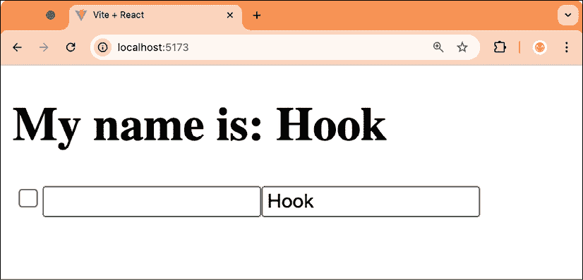
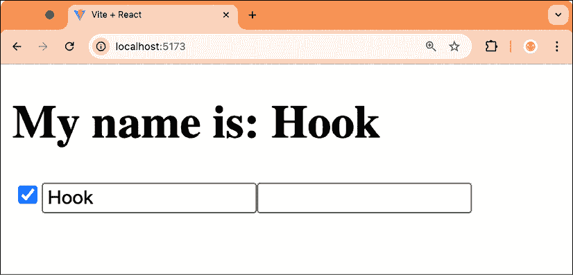
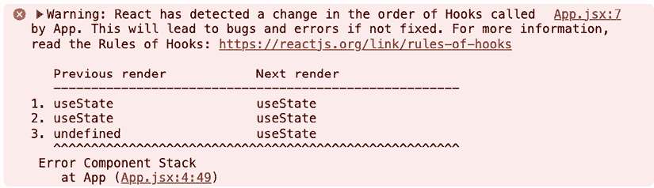
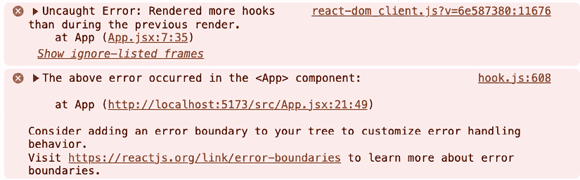
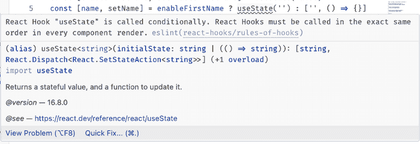

# 11

# Hooks 的规则

在上一章中，我们学习了使用 React 社区开发的各种 Hooks，以及如何找到更多这样的 Hooks。

在本章中，我们将学习使用 Hooks 时需要了解的所有内容以及需要注意的事项。我们还将学习我们需要了解的内容以开始开发自己的 Hooks。Hooks 在定义的位置和顺序方面有一定的限制。违反 Hooks 的规则可能会导致错误或意外行为，因此我们需要确保我们学习和执行这些规则。

本章将涵盖以下主题：

+   使用 Hooks

+   Hooks 的顺序

+   Hooks 的名称

+   执行 Hooks 的规则

# 使用 Hooks

Hooks 只能在以下位置使用：

+   React 函数组件

+   自定义 Hooks（我们将在下一章学习如何创建自定义 Hooks）

Hooks *不能*使用：

+   在条件或循环内部

+   在条件 `return` 语句之后

+   在事件处理程序中

+   在类组件中

+   在传递给 Memo、Reducer 或 Effect Hooks 的函数内部

+   在 `try`/`catch`/`finally` 块内部

在某些地方，比如 React 文档中，使用 Hook 有时被称为 *调用* Hook。

Hooks 是普通的 JavaScript 函数，除了 React 依赖于它们在函数组件内部被调用。当然，使用其他 Hooks 的自定义 Hooks 可以在 React 函数组件之外 *定义*，但在 *使用* 这些自定义 Hooks 时，我们始终需要确保我们在 React 组件内部调用它们。

接下来，我们将学习关于 Hooks 顺序的规则。

# Hooks 的顺序

只在 *顶层（非嵌套），最好在函数组件或自定义 Hooks 的开头* 使用 Hooks：

```js
function ExampleComponent() {
  const [name, setName] = useState('')
  // …
}
function useCustomHook() {
  const [name, setName] = useState('')
  return { name, setName }
} 
```

*不要*在条件、循环或嵌套函数中使用 Hooks——这样做会改变 Hooks 的顺序，从而导致错误。我们已经了解到改变 Hooks 的顺序会导致多个 Hooks 之间的状态混乱。

回顾，在 *第二章* *使用 State Hook* 的示例 2 中，我们学习了我们无法做以下操作：

```js
const [enableFirstName, setEnableFirstName] = useState(false)
const [name, setName] = **enableFirstName**
 **?** **useState****(****''****)**
 **: [****''****,** **() =>** **{}]**
const [lastName, setLastName] = useState('') 
```

我们渲染了一个复选框和两个用于第一个名字和最后一个名字的输入字段，然后我们在最后一个名字字段中输入了一些内容，如图中所示：



图 11.1 – 回顾 *第二章*，使用 State Hook

目前，Hooks 的顺序如下：

1.  `enableFirstName`

1.  `lastName`

然后，我们点击了复选框以启用第一个名字字段。这样做改变了 Hooks 的顺序，因为现在我们的 Hook 定义看起来像这样：

1.  `enableFirstName`

1.  `firstName`

1.  `lastName`

由于 React 仅依赖于 Hooks 的顺序来管理其状态，因此 `firstName` 字段现在是第二个 Hook，所以它从 `lastName` 字段获取状态，正如你在这里看到的：



图 11.2 – 从*第二章*，使用状态钩子中改变钩子顺序的问题

如果我们在第二章*使用状态钩子*的示例 2 中使用 React 的真正`useState`钩子，我们可以看到 React 会自动检测钩子顺序是否已更改，并且会记录一条警告，如下所示：



图 11.3 – React 在检测到钩子顺序已更改时打印警告

当以开发模式运行 React 时，如果发生这种情况，它还会抛出错误并崩溃应用程序：



图 11.4 – React 在开发模式下抛出错误

如我们所见，改变钩子的顺序或条件性地启用钩子是不可能的，因为 React 内部使用钩子的顺序来跟踪哪些数据属于哪个钩子。

为了解决这个问题，我们总是像这样定义钩子：

```js
const [enableFirstName, setEnableFirstName] = useState(false)
**const** **[name, setName] =** **useState****(****''****)**
const [lastName, setLastName] = useState('') 
```

然后，我们条件性地渲染了名称而不是条件性地定义钩子：

```js
My name is: **{enableFirstName ? name :** **''****}** {lastName} 
```

修复后的版本可以在第 3 个示例中看到，来自*第二章*，*使用状态钩子*。

在了解了钩子的顺序之后，让我们继续学习钩子的命名约定。

# 钩子名称

当涉及到命名钩子时，有一个约定，即钩子函数应该始终以`use`前缀开头，后面跟着以大写字母开头的钩子名称。例如：`useState`、`useEffect`和`useQuery`。这很重要，因为否则我们不知道哪些是钩子函数，哪些不是。特别是在自动强制执行钩子规则时，我们需要能够知道哪些是钩子函数，以确保它们没有被条件性地调用或在循环中调用。

最佳实践是给钩子命名，使其在语义上合理。例如，如果你想要为输入字段创建一个自定义钩子，你可以将其命名为`useInputField`。这确保了在使用钩子时，可以立即清楚地知道该钩子有什么用。

如我们所见，命名约定使我们的生活变得更加容易：了解普通函数和钩子之间的区别，使得自动强制执行钩子规则变得非常容易。

在下一节中，我们将学习 ESLint 如何自动强制执行钩子规则。

# 强制执行钩子规则

如果我们坚持使用`use`前缀的钩子函数的约定，我们可以自动强制执行其他两个规则：

+   只在 React 函数组件中调用钩子

+   只在顶层调用钩子（不在循环、条件或嵌套函数内部）

为了自动执行规则，React 提供了一个名为 `eslint-plugin-react-hooks` 的 ESLint 插件，该插件会自动检测 Hooks 的使用情况，并确保规则不被违反。ESLint 是一个代码检查工具，它分析源代码并找出诸如风格错误、潜在错误和编程错误等问题。

幸运的是，Vite 已经为我们设置了包含相关 React 插件的 ESLint。你可能记得，在*第二章**，使用 State Hook*中，当我们添加条件 Hook 时，必须特别禁用代码检查器，通过添加以下行：

```js
 // eslint-disable-next-line react-hooks/rules-of-hooks 
```

如果我们删除这一行，我们会得到以下代码检查器错误：



图 11.5 – ESLint 显示违反 Hooks 规则时的错误

因此，在这整个使用 Hooks 的过程中，我们的代码检查器已经确保我们没有错误地使用它们！要回顾我们如何设置 ESLint，请参阅*第一章**，介绍 React 和 React Hooks*。

# 摘要

在本章中，我们首先了解到我们应仅从 React 函数组件中调用 Hooks，并确保 Hooks 的顺序保持一致。此外，我们还学习了 Hooks 的命名约定，即它们应该始终以 `use` 前缀开头。然后，我们学习了 ESLint 如何通过强制执行 Hooks 规则来帮助我们。

了解 Hooks 的规则并强制执行它们对于避免错误和意外行为非常重要。这些规则在创建我们自己的 Hooks 时尤其重要。

现在我们已经很好地掌握了 Hooks 的工作原理以及规则和约定，在下一章中，我们将学习如何创建我们自己的 Hooks！

# 问题

为了回顾本章我们学到的内容，尝试回答以下问题：

1.  Hooks 可以在哪里被调用？

1.  我们能否在 React 类组件中使用 Hooks？

1.  我们需要注意 Hooks 的顺序问题有哪些？

1.  我们能否在条件、循环或嵌套函数内部调用 Hooks？

1.  Hooks 的命名约定是什么？

1.  Hooks 的规则是如何自动执行的？

# 进一步阅读

如果你对本章我们学到的概念有更多兴趣，请查看以下链接：

+   官方 React 文档中 Hooks 的规则：[`react.dev/reference/rules/rules-of-hooks`](https://react.dev/reference/rules/rules-of-hooks)

# 在 Discord 上了解更多

要加入本书的 Discord 社区 – 在那里你可以分享反馈、向作者提问，并了解新版本 – 请扫描下面的二维码：

`packt.link/wnXT0`


