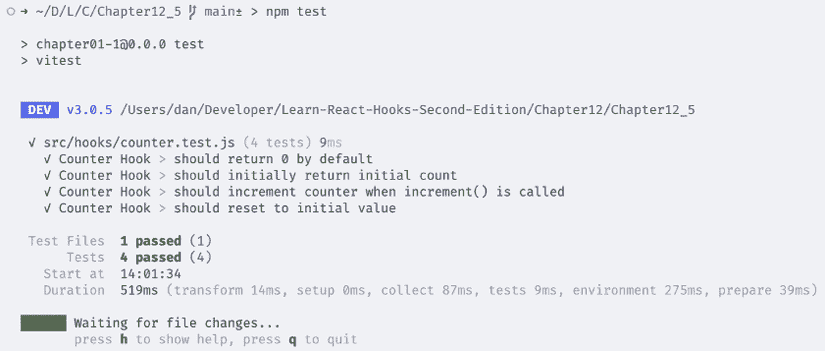
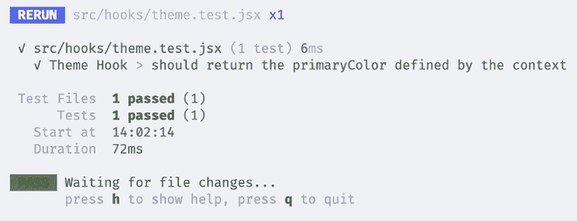
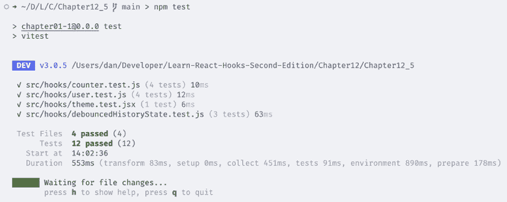

# 12

# 构建您自己的钩子

在上一章中，我们学习了钩子的限制和规则。我们还学习了在哪里调用钩子，为什么顺序很重要，以及钩子的命名约定。

在本章中，我们将学习如何通过从我们的组件中提取现有代码来创建自定义钩子。我们还将学习如何使用自定义钩子以及钩子如何相互交互。最后，我们将学习如何为我们的自定义钩子编写测试。

在本章结束时，您将能够创建自定义钩子来封装和重用应用程序逻辑，使您的代码保持整洁和可维护。

本章将涵盖以下主题：

+   创建自定义主题钩子

+   创建自定义用户钩子

+   创建自定义 API 钩子

+   创建一个防抖历史状态钩子

+   测试自定义钩子

# 技术要求

应该已经安装了一个相当新的 Node.js 版本。还需要安装 Node 包管理器（`npm`）（它应该与 Node.js 一起安装）。有关如何安装 Node.js 的更多信息，请访问他们的官方网站：[`nodejs.org/`](https://nodejs.org/)

我们将在本书的指南中使用**Visual Studio Code**（**VS Code**），但任何其他编辑器都应该以类似的方式工作。有关如何安装 VS Code 的更多信息，请参阅他们的官方网站：[`code.visualstudio.com`](https://code.visualstudio.com)

在本书中，我们使用以下版本：

+   Node.js v22.14.0

+   `npm` v10.9.2

+   Visual Studio Code v1.97.2

前面列表中提到的版本是书中使用的版本。虽然安装较新版本通常不会有问题，但请注意，某些步骤在较新版本上可能工作方式不同。如果您在使用本书中提供的代码和步骤时遇到问题，请尝试使用提到的版本。

您可以在 GitHub 上找到本章的代码：[`github.com/PacktPublishing/Learn-React-Hooks-Second-Edition/tree/main/Chapter12`](https://github.com/PacktPublishing/Learn-React-Hooks-Second-Edition/tree/main/Chapter12)

强烈建议您自己编写代码。不要简单地运行书中提供的代码示例。自己编写代码对于正确学习和理解代码非常重要。然而，如果您遇到任何问题，您始终可以参考代码示例。

# 创建自定义主题钩子

通过学习内置的 React 钩子、社区钩子以及钩子的规则，我们对钩子的概念有了很好的掌握后，现在我们将构建我们自己的钩子。

在*第五章**实现 React 上下文*中，我们引入了`ThemeContext`来为我们的应用中的博客文章设置样式。我们使用 Context 钩子在许多组件中访问`ThemeContext`。通常，跨多个组件使用的功能是创建自定义钩子的好机会。正如您可能已经注意到的，我们经常做以下事情：

```js
import { ThemeContext } from '@/contexts/ThemeContext.js'
export default function SomeComponent () {
  const theme = useContext(ThemeContext)
  // … 
```

我们可以将此功能抽象成一个 `useTheme` 钩子，该钩子将从 `ThemeContext` 获取 `theme` 对象。

通常，首先编写组件，然后如果我们注意到我们在多个组件中使用了相似的代码，再从中提取自定义钩子，这样做最有意义。这样做可以避免过早创建自定义钩子，使我们的项目变得不必要地复杂。

现在，让我们开始创建自定义主题钩子。

## 创建自定义主题钩子

让我们现在开始创建自定义主题钩子，通过将现有的上下文钩子代码提取到一个单独的函数中：

1.  通过执行以下命令将 `Chapter10_3` 文件夹复制到一个新的 `Chapter12_1` 文件夹：

    ```js
    $ cp -R Chapter10_3 Chapter12_1 
    ```

1.  在 VS Code 中打开新的 `Chapter12_1` 文件夹。

1.  创建一个新的 `src/hooks/` 文件夹。

1.  在其中，创建一个新的 `src/hooks/theme.js` 文件。

1.  在这个新创建的文件中，导入 `useContext` 函数和 `ThemeContext`：

    ```js
    import { useContext } from 'react'
    import { ThemeContext } from '@/contexts/ThemeContext.js' 
    ```

1.  现在，定义并导出一个 `useTheme` 函数，它简单地返回上下文钩子：

    ```js
    export function useTheme() {
      return useContext(ThemeContext)
    } 
    ```

如此简单，只要我们坚持钩子和命名约定规则，我们就可以轻松创建我们自己的自定义钩子！让我们继续在博客应用中使用我们的自定义主题钩子。

## 使用自定义主题钩子

要开始使用我们的自定义主题钩子：

1.  编辑 `src/components/post/Post.jsx` 并 *移除* 以下导入：

    ```js
    import { useContext } from 'react'
    import { ThemeContext } from '@/contexts/ThemeContext.js' 
    ```

*替换* 为 `useTheme` 函数的导入：

```js
import { useTheme } from '@/hooks/theme.js' 
```

1.  *替换* 现有的上下文钩子为我们的自定义主题钩子：

    ```js
    export function Post({ id }) {
      const theme = **useTheme****()** 
    ```

1.  编辑 `src/components/post/PostListItem.jsx` 并 *移除* 以下导入：

    ```js
    import { useContext } from 'react'
    import { ThemeContext } from '@/contexts/ThemeContext.js' 
    ```

*替换* 为 `useTheme` 函数的导入：

```js
import { useTheme } from '@/hooks/theme.js' 
```

1.  用我们的主题钩子替换上下文钩子：

    ```js
    export function PostListItem({ id, title, author }) {
      const theme = **useTheme****()** 
    ```

1.  按照以下方式运行 `dev` 服务器：

    ```js
    $ npm run dev 
    ```

您将看到主题仍然以相同的方式工作，以不同的颜色显示特色帖子。

如我们所见，用我们的主题钩子替换上下文钩子可以使代码稍微简化（需要更少的导入）并允许我们稍后轻松调整主题系统。例如，如果我们想从用户设置中获取默认主题而不是从上下文中获取，我们可以在主题钩子中实现此功能，所有组件将自动使用这个新的主题系统。

**示例代码**

本节示例代码可在 `Chapter12/Chapter12_1` 文件夹中找到。请检查文件夹内的 `README.md` 文件，了解如何设置和运行示例。

现在我们已经成功创建了一个自定义主题钩子，让我们继续创建自定义用户钩子。

# 创建自定义用户钩子

在 *第五章*，*实现 React 上下文*，我们定义了一个 `UserContext` 来存储当前登录用户的用户名。在 *第十章*，*使用社区钩子*，我们用本地存储钩子替换了 `UserContext`。如您所记得，从上下文钩子重构到本地存储钩子需要我们调整许多组件中的代码。

为了避免未来出现此类问题，我们可以将所有用户相关信息和函数放入一个 User Hook 中，然后将其暴露给其他组件使用。

## 创建自定义 User Hook

让我们先提取所有与处理用户名相关的现有代码到一个自定义 User Hook 中：

1.  通过执行以下命令将`Chapter12_1`文件夹复制到新的`Chapter12_2`文件夹：

    ```js
    $ cp -R Chapter12_1 Chapter12_2 
    ```

1.  在 VS Code 中打开新的`Chapter12_2`文件夹。

1.  创建一个新的`src/hooks/user.js`文件。

1.  在其中，导入`useLocalStorage`函数：

    ```js
    import { useLocalStorage } from '@uidotdev/usehooks' 
    ```

1.  定义一个新的`useUser`函数，在其中我们使用 Local Storage Hook：

    ```js
    export function useUser() {
      const [username, setUsername] = useLocalStorage('username', null) 
    ```

1.  此外，我们定义一个标志来告诉用户是否已登录：

    ```js
     const isLoggedIn = username !== null 
    ```

1.  现在，定义`register`、`login`和`logout`函数：

    ```js
     function register(username) {
        setUsername(username)
      }
      function login(username) {
        setUsername(username)
      }
      function logout() {
        setUsername(null)
      } 
    ```

1.  返回`username`、`isLoggedIn`标志和函数：

    ```js
     return { username, isLoggedIn, register, login, logout }
    } 
    ```

如您所见，我们不仅返回用户名和设置用户名的函数，而是返回一个包含有关用户会话的各种信息以及我们可以调用的调整用户状态的函数的对象。现在我们已经将此功能抽象为 User Hook，我们可以轻松地扩展它以支持完整的身份验证（而不仅仅是存储用户名）。

我们的 User Hook 成功创建后，让我们在应用程序中使用它。

## 使用自定义 User Hook

现在让我们重构我们的博客应用程序以使用 User Hook 而不是直接从 Local Storage Hook 读取和写入：

1.  编辑`src/App.jsx`并移除以下导入：

    ```js
    import { useLocalStorage } from '@uidotdev/usehooks' 
    ```

用对`useUser`函数的导入来替换它：

```js
import { useUser } from './hooks/user.js' 
```

1.  将 Local Storage Hook 替换为我们的自定义 User Hook，如下所示：

    ```js
    export function App() {
    **const** **{ isLoggedIn } =** **useUser****()** 
    ```

1.  用对`isLoggedIn`标志的检查替换`username`检查：

    ```js
     {**isLoggedIn** && <CreatePost />} 
    ```

使用 Hook 中的`isLoggedIn`标志可以使代码更容易阅读——之前可能不清楚为什么我们要检查用户名，但现在很清楚我们只想在用户登录时渲染这个组件。这样做的好处是，我们可以通过调整 User Hook 来更改以后检查用户是否登录的逻辑。

1.  现在编辑`src/components/user/UserBar.jsx`并移除以下导入：

    ```js
    import { useLocalStorage } from '@uidotdev/usehooks' 
    ```

用对`useUser`函数的导入来替换它：

```js
import { useUser } from '@/hooks/user.js' 
```

1.  将 Local Storage Hook 替换为我们的自定义 User Hook，如下所示：

    ```js
    export function UserBar() {
    **const** **{ isLoggedIn } =** **useUser****()** 
    ```

1.  将`username`检查替换为对`isLoggedIn`标志的检查：

    ```js
     if (**isLoggedIn**) { 
    ```

1.  接下来编辑`src/components/user/Register.jsx`并移除以下导入：

    ```js
    import { useLocalStorage } from '@uidotdev/usehooks' 
    ```

用对`useUser`函数的导入来替换它：

```js
import { useUser } from '@/hooks/user.js' 
```

1.  将 Local Storage Hook 替换为我们的自定义 User Hook，如下所示：

    ```js
    export function Register() {
    **const** **{ register } =** **useUser****()** 
    ```

1.  在`handleSubmit`函数中，用我们的新`register`函数替换`setUsername`函数：

    ```js
     const username = e.target.elements.username.value
    **register**(username)
      } 
    ```

同样，我们通过调用一个解释我们实际想要做什么的函数来使我们的代码更容易阅读（注册新用户）。之前，我们只是在这里调用`setUsername`。稍后，我们可能希望真正将其连接到数据库，因此 User Hook 中的`register`函数将使我们更容易稍后添加此功能。

1.  编辑 `src/components/user/Login.jsx` 并 *移除* 以下导入：

    ```js
    import { useLocalStorage } from '@uidotdev/usehooks' 
    ```

*替换* 它为对 `useUser` 函数的导入：

```js
import { useUser } from '@/hooks/user.js' 
```

1.  *替换* 本地存储钩子为我们的自定义用户钩子，如下所示：

    ```js
    export function Login() {
    **const** **{ login } =** **useUser****()** 
    ```

1.  在 `handleSubmit` 函数中，*替换* `setUsername` 函数为我们的新 `login` 函数：

    ```js
     const username = e.target.elements.username.value
    **login**(username)
      } 
    ```

1.  编辑 `src/components/user/Logout.jsx` 并 *移除* 以下导入：

    ```js
    import { useLocalStorage } from '@uidotdev/usehooks' 
    ```

*替换* 它为对 `useUser` 函数的导入：

```js
import { useUser } from '@/hooks/user.js' 
```

1.  *替换* 本地存储钩子为我们的自定义用户钩子，如下所示：

    ```js
    export function Logout() {
    **const** **{ username, logout } =** **useUser****()** 
    ```

1.  在 `handleSubmit` 函数中，*替换* `setUsername` 函数为我们的新 `logout` 函数：

    ```js
     function handleSubmit(e) {
        e.preventDefault()
    **logout****()**
      } 
    ```

1.  编辑 `src/components/post/CreatePost.jsx` 并 *移除* 对 `useLocalStorage` 函数的以下导入：

    ```js
    import { **useLocalStorage,** useHistoryState } from '@uidotdev/usehooks' 
    ```

1.  添加对 `useUser` 函数的导入，如下所示：

    ```js
    import { useUser } from '@/hooks/user.js' 
    ```

1.  *替换* 本地存储钩子为我们的自定义用户钩子，如下所示：

    ```js
    export function CreatePost() {
    **const** **{ username } =** **useUser****()** 
    ```

能够从用户钩子中访问 `username` 将组件与内部逻辑解耦。例如，我们可能稍后会在本地存储中存储整个用户对象或身份验证令牌。如果我们每个组件都使用本地存储钩子，我们就需要调整使用它的每个组件。现在，我们只需简单地调整用户钩子，只要我们仍然从它返回 `username`，我们就不需要更改任何组件。

1.  编辑 `src/components/comment/CreateComment.jsx` 并 *移除* 以下导入：

    ```js
    import { useLocalStorage } from '@uidotdev/usehooks' 
    ```

*替换* 它为对 `useUser` 函数的导入：

```js
import { useUser } from '@/hooks/user.js' 
```

1.  *替换* 本地存储钩子为我们的自定义用户钩子，如下所示：

    ```js
    export function CreateComment({ addComment }) {
    **const** **{ username } =** **useUser****()** 
    ```

1.  编辑 `src/components/comment/CommentList.jsx` 并 *移除* 以下导入：

    ```js
    import { useLocalStorage } from '@uidotdev/usehooks' 
    ```

*替换* 它为对 `useUser` 函数的导入：

```js
import { useUser } from '@/hooks/user.js' 
```

1.  *替换* 本地存储钩子为我们的自定义用户钩子，如下所示：

    ```js
    export function CommentList() {
    **const** **{ isLoggedIn } =** **useUser****()** 
    ```

1.  *替换* 对 `username` 的检查为对 `isLoggedIn` 标志的检查：

    ```js
     {**isLoggedIn** && <CreateComment addComment={addComment} />} 
    ```

如我们所见，使用用户钩子重构的代码已经显著易于阅读。我们不再对 `username` 进行检查，而是检查 `isLoggedIn` 标志。此外，我们调用 `login`、`register` 和 `logout` 函数，抽象实现细节，使组件能够专注于其功能。这样做将应用程序逻辑的关注点分离到自定义钩子中，而组件则专注于用户交互。

我们现在可以启动开发服务器，如下所示：

```js
$ npm run dev 
```

你会看到我们博客的所有功能仍然与之前一样工作。

**示例代码**

本节示例代码可在 `Chapter12/Chapter12_2` 文件夹中找到。请检查文件夹内的 `README.md` 文件，了解如何设置和运行示例。

现在我们已经完成了自定义用户钩子的创建，让我们继续创建用于 API 调用的自定义钩子。

# 创建自定义 API 钩子

我们还可以为各种 API 调用创建钩子。将这些钩子放在一个文件中，使我们能够轻松地调整 API 调用。我们将使用 `useAPI` 作为自定义 API 钩子的前缀，以便容易区分哪些函数是 API 钩子。

## 提取自定义 API 钩子

让我们按照以下步骤创建我们的 API 自定义钩子：

1.  通过执行以下命令将 `Chapter12_2` 文件夹复制到新的 `Chapter12_3` 文件夹：

    ```js
    $ cp -R Chapter12_2 Chapter12_3 
    ```

1.  在 VS Code 中打开新的 `Chapter12_3` 文件夹。

1.  创建一个新的 `src/hooks/api.js` 文件。

1.  编辑 `src/hooks/api.js` 并导入以下函数：

    ```js
    import { useSuspenseQuery, useMutation } from '@tanstack/react-query'
    import {
      fetchPosts,
      fetchPost,
      searchPosts,
      createPost,
      queryClient,
    } from '@/api.js' 
    ```

1.  定义一个函数来获取帖子，从我们在 `src/components/post/PostFeed.jsx` 中的代码复制过来：

    ```js
    export function useAPIFetchPosts({ featured }) {
      const { data } = useSuspenseQuery({
        queryKey: ['posts', featured],
        queryFn: async () => await fetchPosts({ featured }),
      })
      return data
    } 
    ```

1.  定义一个函数来获取单个帖子，从我们在 `src/components/post/Post.jsx` 中的代码复制过来：

    ```js
    export function useAPIFetchPost({ id }) {
      const { data } = useSuspenseQuery({
        queryKey: ['post', id],
        queryFn: async () => await fetchPost({ id }),
      })
      return data
    } 
    ```

1.  定义一个函数来搜索帖子，从我们在 `src/components/post/PostSearchResults.jsx` 中的代码复制过来：

    ```js
    export function useAPISearchPosts({ query }) {
      const { data } = useSuspenseQuery({
        queryKey: ['posts', query],
        queryFn: async () => await searchPosts(query),
      })
      return data
    } 
    ```

1.  定义一个函数来创建帖子，从我们在 `src/components/post/CreatePost.jsx` 中的代码复制过来：

    ```js
    export function useAPICreatePost() {
      const createPostMutation = useMutation({
        mutationFn: createPost,
        onSuccess: () => {
          queryClient.invalidateQueries(['posts'])
        },
      })
      return createPostMutation.mutateAsync
    } 
    ```

与用户钩子类似，API 钩子抽象了实现细节，只暴露必要的信息，例如 `data` 或 `mutateAsync` 函数。这意味着我们甚至可以在以后简单地通过调整自定义 API 钩子来替换 React Query 为不同的库。

我们现在可以将我们的博客应用程序重构为使用自定义 API 钩子。

## 使用自定义 API 钩子

按照以下步骤重构应用程序以使用先前定义的 API 钩子：

1.  编辑 `src/components/post/PostFeed.jsx` 并 *删除* 以下导入：

    ```js
    import { useSuspenseQuery } from '@tanstack/react-query'
    import { fetchPosts } from '@/api.js' 
    ```

*替换* 它们为 `useAPIFetchPosts` 的导入：

```js
import { useAPIFetchPosts } from '@/hooks/api.js' 
```

1.  *替换* 悬挂查询钩子为我们的 API 获取帖子钩子：

    ```js
    export function PostFeed({ featured = false }) {
    **const** **posts =** **useAPIFetchPosts****({ featured })**
    return <PostList posts={**posts**} />
    } 
    ```

而不是在 *如何* 从 API 获取帖子实现细节上，我们现在只提供与组件相关的信息（帖子是否为特色帖子）。其余的由自定义 API 钩子内部处理，并且可以在以后更改。

1.  编辑 `src/components/post/Post.jsx` 并 *删除* 以下导入：

    ```js
    import { useSuspenseQuery } from '@tanstack/react-query'
    import { fetchPost } from '@/api.js' 
    ```

*替换* 它们为 `useAPIFetchPost` 的导入：

```js
import { useAPIFetchPost } from '@/hooks/api.js' 
```

1.  *替换* 悬挂查询钩子为我们的 API 获取帖子钩子：

    ```js
    export function Post({ id }) {
      const theme = useTheme()
    **const** **{ title, content, author } =** **useAPIFetchPost****({ id })**
    return ( 
    ```

1.  编辑 `src/components/post/PostSearchResults.jsx` 并 *删除* 以下导入：

    ```js
    import { useSuspenseQuery } from '@tanstack/react-query'
    import { searchPosts } from '@/api.js' 
    ```

*替换* 它们为 `useAPISearchPosts` 的导入：

```js
import { useAPISearchPosts } from '@/hooks/api.js' 
```

1.  *替换* 悬挂查询钩子为我们的 API 获取帖子钩子：

    ```js
    export function PostSearchResults({ query }) {
    **const** **posts =** **useAPISearchPosts****({ query })**
    return <PostList posts={**posts**} />
    } 
    ```

1.  编辑 `src/components/post/CreatePost.jsx` 并 *删除* 以下导入：

    ```js
    import { useMutation } from '@tanstack/react-query'
    import { createPost, queryClient } from '@/api.js' 
    ```

*替换* 它们为 `useAPICreatePost` 的导入：

```js
import { useAPICreatePost } from '@/hooks/api.js' 
```

1.  *删除* 现有的突变钩子：

    ```js
     const createPostMutation = useMutation({
        mutationFn: createPost,
        onSuccess: () => {
          queryClient.invalidateQueries(['posts'])
        },
      }) 
    ```

*替换* 它为我们的 API 创建帖子钩子：

```js
 const createPost = useAPICreatePost() 
```

1.  我们现在可以直接调用 `createPost` 函数，如下所示：

    ```js
     const newPost = { title, content, author: username, featured: false }
          try {
            const result = await **createPost**(post)
            clear()
            navigate(`/post/${result.id}`)
          } catch (err) {
            return err
          } 
    ```

1.  启动开发服务器，并确保一切仍然像以前一样工作：

    ```js
    $ npm run dev 
    ```

再次强调，重构以使用自定义钩子使我们的组件更容易阅读，使我们能够专注于用户交互逻辑，而我们的自定义钩子则处理内部的应用逻辑。

**示例代码**

本节的示例代码可以在 `Chapter12/Chapter12_3` 文件夹中找到。请检查文件夹内的 `README.md` 文件，了解如何设置和运行示例。

在创建自定义 API 钩子之后，让我们继续创建一个防抖历史状态钩子。

# 创建一个防抖历史状态钩子

我们现在将创建一个稍微更高级的 Hook，用于防抖历史状态功能。在 *第十章* *使用社区 Hooks* 中，我们学习了 History State Hook，它允许我们在 `CreatePost` 组件中实现撤销/重做功能。然后我们使用 Debounce Hook 来避免将每个单独的更改存储在历史记录中，这样我们可以一次性撤销/重做更大的文本部分，而不是逐个字符。现在，我们将这个组合功能提取到一个自定义的 Debounced History State Hook 中。

虽然这个功能目前只在一个组件中使用，但它是一个通用的功能，可以在其他组件中使用。此外，将这个功能抽象成一个单独的 Hook 可以让我们保持 `CreatePost` 组件代码的简洁和简洁。

## 创建 Debounced History State Hook

现在让我们开始从 `CreatePost` 组件中提取代码到 Debounced History State Hook：

1.  通过执行以下命令将 `Chapter12_3` 文件夹复制到新的 `Chapter12_4` 文件夹：

    ```js
    $ cp -R Chapter12_3 Chapter12_4 
    ```

1.  在 VS Code 中打开新的 `Chapter12_4` 文件夹。

1.  创建一个新的 `src/hooks/debouncedHistoryState.js` 文件。

1.  在其中，导入以下内容：

    ```js
    import { useState, useEffect } from 'react'
    import { useDebouncedCallback } from 'use-debounce'
    import { useHistoryState } from '@uidotdev/usehooks' 
    ```

1.  定义一个函数，该函数接受初始状态和防抖超时值：

    ```js
    export function useDebouncedHistoryState(initialState, timeout) { 
    ```

1.  现在，定义 History State Hook：

    ```js
     const { state, set, undo, redo, clear, canUndo, canRedo } =
        useHistoryState(initialState) 
    ```

1.  接下来，定义一个用于活动编辑内容的 State Hook：

    ```js
     const [content, setContent] = useState(initialState) 
    ```

1.  然后，定义一个将设置 History State Hook 值的 Debounced Callback Hook：

    ```js
     const debounced = useDebouncedCallback((value) =>
     set(value), timeout) 
    ```

1.  在 `CreatePost` 组件中添加我们之前使用的 Effect Hook：

    ```js
     useEffect(() => {
        debounced.cancel()
        setContent(state)
      }, [state, debounced]) 
    ```

记住，这个 Effect Hook 用于将历史状态同步回正在编辑的 `content` 状态，这意味着每当触发 `撤销`、`重做` 或 `清除` 功能时，它都会更改文本框的内容。

1.  现在，定义一个设置 `content` 状态并启动防抖回调的处理函数：

    ```js
     function handleContentChange(e) {
        const { value } = e.target
    setContent(value)
        debounced(value)
      } 
    ```

1.  最后，从 Hook 返回所有需要的值和函数：

    ```js
     return { content, handleContentChange, undo, redo, clear, canUndo,
     canRedo }
    } 
    ```

现在，我们有了 Debounced History State 功能性的直接替换品，我们现在在 `CreatePost` 组件中使用它，所以让我们开始吧！

## 使用 Debounced History State Hook

按照以下步骤重构 `CreatePost` 组件以使用 Debounced History State Hook：

1.  编辑 `src/components/post/CreatePost.jsx` 并 *删除* 以下突出显示的导入：

    ```js
    import { useActionState**, useState, useEffect** } from 'react'
    **import** **{ useDebouncedCallback }** **from****'use-debounce'**
    **import** **{ useHistoryState }** **from****'@uidotdev/usehooks'** 
    ```

1.  添加 `useDebouncedHistoryState` 函数的导入：

    ```js
    import { useDebouncedHistoryState } from '@/hooks/debouncedHistoryState.js' 
    ```

1.  *删除* 以下所有代码：

    ```js
     const { state, set, undo, redo, clear, canUndo, canRedo } =
        useHistoryState('')
      const [content, setContent] = useState('')
      const debounced = useDebouncedCallback((value) => set(value), 200)
      useEffect(() => {
        debounced.cancel()
        setContent(state)
      }, [state, debounced]) 
    ```

*替换* 它为 Debounced History State Hook：

```js
 const { content, handleContentChange, undo, redo, clear, canUndo,
    canRedo } =
useDebouncedHistoryState('', 200) 
```

1.  *删除* 以下处理函数：

    ```js
     function handleContentChange(e) {
        const { value } = e.target
    setContent(value)
        debounced(value)
      } 
    ```

1.  启动开发服务器并确保创建帖子以及撤销/重做功能仍然正常工作：

    ```js
    $ npm run dev 
    ```

那就是全部了——现在 `CreatePost` 组件的代码变得更加简洁！

**示例代码**

本节示例代码位于 `Chapter12/Chapter12_4` 文件夹中。请检查文件夹内的 `README.md` 文件，了解如何设置和运行示例。

在创建 Debounced History State Hook 之后，让我们继续学习如何测试自定义 Hooks。

# 测试自定义 Hooks

现在，我们的博客应用完全利用了 Hooks！我们甚至为各种功能定义了自定义 Hooks，使我们的代码更具可重用性、简洁性，并且易于阅读。

当创建自定义 Hook 时，为它们编写单元测试以确保它们正常工作也是有意义的，即使我们在以后更改它们或添加更多选项。我们将使用 **Vitest** 来编写我们的单元测试。Vitest 和 Vite 一起使用得非常好，因为 Vitest 可以读取和使用 Vite 配置。Vitest 还提供了与 Jest 兼容的 API。**Jest** 是另一个非常流行的测试框架。如果你已经熟悉 Jest，学习 Vitest 将会非常容易。此外，Vitest 非常快，非常适合现代 Web 应用。

然而，由于 Hooks 的规则，我们无法在测试函数中调用 Hooks，因为它们只能在功能 React 组件的主体内部调用。由于我们不希望为每个测试创建一个特定的组件，我们将使用 React 测试库直接测试 Hooks。这个库实际上创建了一个测试组件，并提供了一些实用函数来与 Hooks 交互。

在过去，有两个库：React 测试库和 React Hooks 测试库。然而，如今 React 测试库已经内置了对渲染和测试 Hooks 的支持，因此它是测试 React 组件和 Hooks 的完美选择！React Hooks 测试库现在已被弃用，所以我们只会使用 React 测试库。

在以下情况下，我们应该特别为 Hooks 编写测试：

+   当编写定义和导出 Hooks 的库时

+   当你有在多个组件中使用的 Hooks 时

+   当一个 Hook 复杂，因此难以在以后更改/重构时

当你有特定于一个组件的 Hooks 时，通常最好是直接测试该组件。然而，测试 React 组件超出了本书的范围。有关测试组件的更多信息可以在 React 测试库网站上找到：[`testing-library.com/docs/react-testing-library/intro/`](https://testing-library.com/docs/react-testing-library/intro/)

现在，让我们开始设置 Vitest 和 React 测试库！

## 设置 Vitest 和 React 测试库

在我们可以开始为我们的 Hooks 编写测试之前，我们首先需要设置 Vitest 和 React 测试库：

1.  通过执行以下命令将 `Chapter12_4` 文件夹复制到新的 `Chapter12_5` 文件夹：

    ```js
    $ cp -R Chapter12_4 Chapter12_5 
    ```

1.  在 VS Code 中打开新的 `Chapter12_5` 文件夹。

1.  通过执行以下命令安装 Vitest、React 测试库和 jsdom：

    ```js
    $ npm install --save-exact --save-dev vitest@3.0.5 @testing-library/react@16.2.0 jsdom@26.0.0 
    ```

jsdom 为 Node.js 提供了一个访问 DOM 的环境。由于我们的测试实际上并没有在浏览器中运行，因此提供这样一个环境是必要的，以便能够渲染 React 组件并测试 Hooks。

1.  编辑 `package.json` 并添加一个用于运行 Vitest 的脚本：

    ```js
     "scripts": {
    **"test"****:** **"vitest"****,** 
    ```

1.  最后，编辑 `vite.config.js` 并在文件末尾添加一个 Vitest 配置：

    ```js
     rewrite: (path) => path.replace(/^\/api/, ''),
          },
        },
      },
    **test****: {**
    **environment****:** **'jsdom'****,**
     **},**
    }) 
    ```

现在我们已经成功设置了 Vitest，我们可以开始测试 Hooks 了！

## 测试一个简单的 Hook

首先，我们将测试一个非常简单的 Hook，它不使用上下文或异步代码，如超时。为此，我们将创建一个新的 Hook，称为 `useCounter`。然后，我们将测试 Hook 的各个部分。

### 创建 Counter Hook

Counter Hook 将提供一个当前的 `count` 以及用于 `increment` 和 `reset` 计数的函数。按照以下步骤创建它：

1.  创建一个新的 `src/hooks/counter.js` 文件。

1.  在其中，导入 `useState` 函数：

    ```js
    import { useState } from 'react' 
    ```

1.  然后，定义一个接受 `initialCount` 作为参数的 Counter Hook：

    ```js
    export function useCounter(initialCount = 0) { 
    ```

1.  定义一个用于计数的 State Hook：

    ```js
     const [count, setCount] = useState(initialCount) 
    ```

1.  现在，定义一个函数来将计数增加 1：

    ```js
     function increment() {
        setCount((count) => count + 1)
      } 
    ```

1.  接下来，定义一个函数将计数重置为初始计数：

    ```js
     function reset() {
        setCount(initialCount)
      } 
    ```

1.  返回当前计数和两个函数：

    ```js
     return { count, increment, reset }
    } 
    ```

现在我们已经定义了一个简单的 Hook，我们可以开始编写我们的第一个测试。

### 为 Counter Hook 创建单元测试

现在，让我们按照以下步骤编写 Counter Hook 的单元测试：

1.  创建一个新的 `src/hooks/counter.test.js` 文件。

1.  在其中，从 Vitest 导入 `describe`、`test` 和 `expect` 函数，以及从 React Testing Library 导入的 `renderHook` 和 `act` 函数：

    ```js
    import { describe, test, expect } from 'vitest'
    import { renderHook, act } from '@testing-library/react' 
    ```

1.  此外，导入 `useCounter` 函数，我们将为其编写测试：

    ```js
    import { useCounter } from './counter.js' 
    ```

1.  现在，我们可以开始定义测试。在 Vitest 中，我们可以使用 `describe` 函数来定义一组测试。第一个参数是组名，第二个参数是一个用于配置测试的选项对象（我们将其留为空对象），第三个参数是一个函数，在其中我们可以定义我们的各种测试。在这里，我们为 Counter Hook 创建一组测试，所以让我们称它为：

    ```js
    describe('Counter Hook', {}, () => { 
    ```

1.  在组内，我们现在可以定义我们的测试。要定义一个测试，我们使用 `test` 函数。第一个参数是测试的名称，第二个参数是测试选项，第三个参数是要执行的测试函数。在我们的第一个测试中，我们检查 Hook 默认返回 0：

    ```js
     test('should return 0 by default', {}, () => { 
    ```

1.  在这个测试中，我们使用 `renderHook` 函数来模拟 Hook 在 React 组件中被渲染。它返回一个对象给我们，其中包含一个 `result`：

    ```js
     const { result } = renderHook(() => useCounter()) 
    ```

1.  我们现在可以通过从 `result.current` 对象中获取它来访问 `count`，并检查它是否为 0：

    ```js
     expect(result.current.count).toBe(0)
      }) 
    ```

使用 `expect` 函数可以对值进行测试。它的工作方式如下：`expect(actualValue).toBe(expectedValue)`。如果 `actualValue` 与 `expectedValue` 匹配，测试将成功。否则，它将失败。

在 `expect` 中可以使用许多种匹配器 —— `toBe` 只是其中之一！要查看匹配器的完整列表，请查看 Vitest API 文档：[`vitest.dev/api/expect.html`](https://vitest.dev/api/expect.html)

如果你之前使用过 Jest，你会注意到 Vitest API 与它是完全兼容的，所以所有这些函数对你来说都很熟悉。

1.  接下来，让我们定义一个测试来检查`initialCount`参数是否工作：

    ```js
     test('should initially return initial count', {}, () => {
        const { result } = renderHook(() => useCounter(123))
        expect(result.current.count).toBe(123)
      }) 
    ```

1.  现在，我们定义一个测试来检查增量函数是否增加计数器：

    ```js
     test('should increment counter when increment() is called', {}, () => {
        const { result } = renderHook(() => useCounter(0)) 
    ```

1.  我们可以使用`act`函数从 Hook 中触发一个动作。这个函数告诉 React Testing Library 在 Hook 内部正在触发某些操作，导致`renderHook`函数的`result.current`值被更新：

    ```js
     act(() => result.current.increment()) 
    ```

1.  然后，我们可以检查新的计数是否为 1：

    ```js
     expect(result.current.count).toBe(1)
      }) 
    ```

1.  接下来，让我们进行一个测试，模拟传递给 Counter Hook 的`initialCount`通过 React 组件的属性更改而改变：

    ```js
     test('should reset to initial value', {}, () => { 
    ```

1.  要模拟一个 React 属性，我们只需定义一个变量，然后定义一个 Hook：

    ```js
     let initial = 0
    const { result, rerender } = renderHook(() =>
     useCounter(initial)) 
    ```

1.  我们现在可以通过更改变量并使用从`renderHook`返回的`rerender`函数手动触发 React 组件的重新渲染来更改属性：

    ```js
     initial = 123
    rerender() 
    ```

如我们之前所学的，React Testing Library 创建了一个虚拟组件，用于测试 Hook。我们可以强制这个虚拟组件重新渲染来模拟在真实组件中属性更改时会发生的情况。

1.  现在，我们调用`reset`函数并检查计数是否已重置到新的初始计数：

    ```js
     act(() => result.current.reset())
        expect(result.current.count).toBe(123)
      })
    }) 
    ```

1.  通过执行以下命令来运行测试：

    ```js
    $ npm test 
    ```

    记住，对于特殊的脚本，如`start`和`test`，我们不需要执行`npm run test`；我们可以简单地执行`npm test`。

以下截图显示了执行`npm test`后的结果：



图 12.1 – 在监视模式下运行 Vitest

你会看到 Vitest 自动运行监视模式。这意味着它将等待文件更改并自动为你重新运行测试。你可以在整个章节的其余部分保持在该模式下运行，以查看你编写的测试执行情况。

## 测试 Theme Hook

使用 React Hooks Testing Library，我们还可以测试更复杂的 Hooks，例如那些使用上下文的 Hooks。要测试使用上下文的 Hooks，我们首先必须创建一个上下文包装器，然后我们可以测试这个 Hook。

现在，让我们开始编写 Theme Hook 的测试：

1.  创建一个新的`src/hooks/theme.test.jsx`文件。请注意，文件扩展名需要是`.jsx`，而不是`.js`，因为我们将在这个文件中使用 JSX。

1.  在其中，从 Vitest 导入相关函数，包括`renderHook`函数、`ThemeContext`和`useTheme`函数：

    ```js
    import { describe, test, expect } from 'vitest'
    import { renderHook } from '@testing-library/react'
    import { ThemeContext } from '@/contexts/ThemeContext.js'
    import { useTheme } from './theme.js' 
    ```

1.  现在，定义一个`ThemeContextWrapper`组件，它将为测试设置上下文提供者：

    ```js
    function ThemeContextWrapper({ children }) { 
    ```

包装器接受`children`作为属性，这是 React 组件的一个特殊属性。它将包含包装器内部定义的所有其他组件，例如`<ThemeContextWrapper>{children}</ThemeContextWrapper>`。

1.  在`wrapper`组件内部，定义上下文提供者和`primaryColor`的值：

    ```js
     return (
        <ThemeContext.Provider value={{ primaryColor: 'deepskyblue' }}>
          {children}
        </ThemeContext.Provider>
      )
    } 
    ```

1.  现在，我们可以开始编写主题钩子的测试了。我们首先创建一个测试组：

    ```js
    describe('Theme Hook', {}, () => { 
    ```

1.  在组内，我们定义一个测试，用于检查主颜色：

    ```js
     test('should return the primaryColor defined by the context',
     {}, () => { 
    ```

1.  然后渲染钩子，将包装组件传递给`renderHook`函数：

    ```js
     const { result } = renderHook(() => useTheme(), {
          wrapper: ThemeContextWrapper,
        }) 
    ```

1.  现在，检查主颜色是否与我们定义在包装组件中的一致：

    ```js
     expect(result.current.primaryColor).toBe('deepskyblue')
      })
    }) 
    ```

1.  如果你保持 Vitest 在监视模式下运行，你应该看到它成功执行了我们刚才编写的测试！如果不是，请通过执行以下命令重新启动 Vitest：

    ```js
    $ npm test 
    ```

以下图像显示了 Vitest 在监视模式下自动执行我们新定义的测试：



图 12.2 – Vitest 自动执行我们新定义的测试

现在我们已经成功编写了主题钩子的测试，让我们继续进行稍微复杂一些的用户钩子。

## 测试用户钩子

用户钩子现在内部使用本地存储钩子。幸运的是，`jsdom`环境已经为我们处理了模拟 LocalStorage API，因此我们不需要为此进行任何设置。

现在让我们开始编写用户钩子的测试：

1.  创建一个新的`src/hooks/user.test.js`文件。

1.  在其中，从 Vitest 导入相关函数，以及`renderHook`、`act`和`useUser`函数：

    ```js
    import { describe, test, expect } from 'vitest'
    import { renderHook, act } from '@testing-library/react'
    import { useUser } from './user.js' 
    ```

1.  然后，为用户钩子定义一个测试组：

    ```js
    describe('User Hook', {}, () => { 
    ```

1.  对于我们的第一次测试，我们确保用户默认未登录：

    ```js
     test('should not be logged in by default', {}, () => {
        const { result } = renderHook(() => useUser())
        expect(result.current.isLoggedIn).toBe(false)
        expect(result.current.username).toBe(null)
      }) 
    ```

1.  然后，我们测试注册功能：

    ```js
     test('should be logged in after registering', {}, () => {
        const { result } = renderHook(() => useUser())
        act(() => result.current.register('testuser'))
        expect(result.current.isLoggedIn).toBe(true)
        expect(result.current.username).toBe('testuser')
      }) 
    ```

1.  接下来，我们测试登录功能：

    ```js
     test('should be logged in after logging in', {}, () => {
        const { result } = renderHook(() => useUser())
        act(() => result.current.login('testuser'))
        expect(result.current.isLoggedIn).toBe(true)
        expect(result.current.username).toBe('testuser')
      }) 
    ```

1.  对于最后的测试，我们执行两个操作，首先调用登录，然后登出，然后检查用户是否已登出：

    ```js
     test('should be logged out after logout', {}, () => {
        const { result } = renderHook(() => useUser())
        act(() => result.current.login('testuser'))
        act(() => result.current.logout())
        expect(result.current.isLoggedIn).toBe(false)
        expect(result.current.username).toBe(null)
      })
    }) 
    ```

你会看到 Vitest 执行了所有我们的测试，并且它们都通过了！现在，让我们继续到去抖动历史状态钩子。

## 测试异步钩子

有时候我们需要测试执行异步操作的钩子。这意味着我们需要等待一段时间，直到检查结果。

要为这类钩子编写测试，我们可以使用 React Testing Library 中的`waitFor`函数。这个函数可以用来等待条件满足，而不是立即尝试匹配。因此，它可以用来测试 React 组件和钩子中的异步操作。如果条件在一定时间后（可以通过可选的超时参数指定）仍然无法匹配，测试将失败。

在本章的早期，我们创建了去抖动的历史状态钩子，它只在一定时间后存储历史变化，因此使其成为一个异步钩子。现在，我们将使用`waitFor`函数来测试去抖动在去抖动历史状态钩子中的效果。

按照以下步骤开始：

1.  创建一个新的`src/hooks/debouncedHistoryState.test.js`文件。

1.  在其中，从 Vitest 导入相关函数，以及从 React Testing Library 导入的`renderHook`、`act`和`waitFor`函数，以及`useDebouncedHistoryState`函数：

    ```js
    import { describe, test, expect } from 'vitest'
    import { renderHook, act, waitFor } from '@testing-library/react'
    import { useDebouncedHistoryState } from './debouncedHistoryState.js' 
    ```

1.  定义一个测试组和第一个测试，该测试仅检查初始值：

    ```js
    describe('Debounced History State Hook', {}, () => {
      test('should return initial state as content', {}, () => {
        const { result } = renderHook(() => useDebouncedHistoryState('', 10))
        expect(result.current.content).toBe('')
      }) 
    ```

1.  现在，我们定义一个测试来检查内容是否立即更新：

    ```js
     test('should update content immediately', {}, () => {
        const { result } = renderHook(() => useDebouncedHistoryState('',
     10))
        act(() =>
          result.current.handleContentChange({ target: {
             value: 'new content' } }),
        )
        expect(result.current.content).toBe('new content')
      }) 
    ```

1.  对于最后的测试，我们检查 Hook 是否仅在去抖动后更新历史记录：

    ```js
     test('should only update history state after debounce', {},
      async () => { 
    ```

1.  在这个测试中，我们首先定义 Hook：

    ```js
     const { result } = renderHook(() => useDebouncedHistoryState('',
     10)) 
    ```

我们将去抖动超时保持在 10ms，以避免不必要地减慢我们的测试速度。

1.  现在，我们触发内容更新：

    ```js
     act(() =>
          result.current.handleContentChange({ target: {
            value: 'new content' } }),
        ) 
    ```

1.  在去抖动之前，`canUndo` 值应该是 `false`，因为历史状态中还没有存储任何内容：

    ```js
     expect(result.current.canUndo).toBe(false) 
    ```

1.  现在我们使用 `waitFor` 等待 `canUndo` 值变为 true，这应该在去抖动超时（10ms）之后发生：

    ```js
     await waitFor(() => {
          expect(result.current.canUndo).toBe(true)
        })
      })
    }) 
    ```

Vitest 将自动运行我们的新测试，我们可以看到它们都成功了！

在这种情况下，我们有一个非常简单的超时。然而，可能存在更复杂的情况，我们需要等待更长的时间。在测试 Hooks 时，为了更好地控制日期和计时器，您可以使用 Vitest 中的模拟计时器来模拟系统时间。有关更多信息，请查看官方 Vitest 文档中的模拟指南：[`vitest.dev/guide/mocking.html#dates`](https://vitest.dev/guide/mocking.html#dates)

我们没有测试 `undo`/`redo`/`clear` 功能，因为这些来自 `useHooks` 库的历史状态 Hook，因此它超出了我们自定义 Hook 的范围。在大多数情况下，仅测试我们自己在实现中添加的逻辑就足够了。

由于 API Hooks 主要是对 TanStack Query Hooks 的包装，并没有添加自己的逻辑，因此为它们编写测试也没有太多意义。

## 运行所有测试

为了验证所有测试现在是否都成功，让我们通过按 *q* 键退出 Vitest 的监视模式。然后，通过执行以下命令再次运行 Vitest：

```js
$ npm test 
```

如我们所见，Vitest 再次执行了所有我们的测试，并且它们都通过了：



图 12.3 – 所有我们的测试都通过了！

**示例代码**

本节的示例代码可以在 `Chapter12/Chapter12_5` 文件夹中找到。请检查文件夹内的 `README.md` 文件，以获取设置和运行示例的说明。

# 摘要

在本章中，我们首先学习了如何从我们的博客应用中的现有代码中提取自定义 Hooks。我们定义了主题 Hook 以轻松访问上下文，然后定义了用户 Hook，它管理用户状态并提供注册/登录/注销的函数。然后，我们创建了 API Hooks 和一个更高级的用于去抖动历史状态功能的 Hook。最后，我们学习了如何使用 Vitest 和 React 测试库为我们的自定义 Hooks 编写测试。

了解何时以及如何提取自定义 Hook 是 React 开发中非常重要的技能。在一个较大的项目中，你可能需要定义许多针对项目需求量身定制的自定义 Hooks。自定义 Hooks 还可以使维护应用程序变得更加容易，因为我们只需要在一个地方调整功能。测试自定义 Hook 非常重要，因为如果我们稍后重构自定义 Hook，我们想要确保它们仍然能够正常工作。

在下一章中，我们将学习如何从类组件迁移到基于 Hooks 的系统。我们首先使用类组件创建一个小项目，然后将其替换为 Hooks，更仔细地比较两种解决方案之间的差异。

# 问题

为了回顾本章所学内容，请尝试回答以下问题：

1.  我们如何从现有代码中提取自定义 Hook？

1.  创建自定义 Hook 的优势是什么？

1.  我们应该在何时将功能提取到自定义 Hook 中？

1.  我们如何使用自定义 Hooks？

1.  我们可以使用哪个库来测试自定义 Hooks？

1.  Hooks 执行的动作是如何被测试的？

1.  我们如何测试利用 React Context 的 Hooks？

1.  我们如何测试执行异步操作的 Hooks？

# 进一步阅读

如果你对本章所学的概念感兴趣，请查看以下链接：

+   在官方 React 文档中关于“使用自定义 Hook 重用逻辑”的指南：[`react.dev/learn/reusing-logic-with-custom-hooks`](https://react.dev/learn/reusing-logic-with-custom-hooks)

+   Vitest 文档：[`vitest.dev/`](https://vitest.dev/ )

+   React Testing Library 文档：[`testing-library.com/docs/react-testing-library/intro/`](https://testing-library.com/docs/react-testing-library/intro/)

# 在 Discord 上了解更多

要加入本书的 Discord 社区——在那里你可以分享反馈、向作者提问，并了解新版本——请扫描下面的二维码：

`packt.link/wnXT0`


