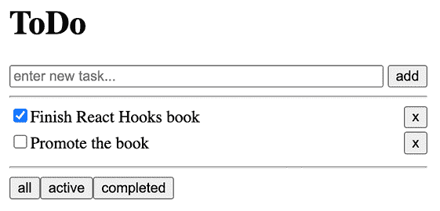
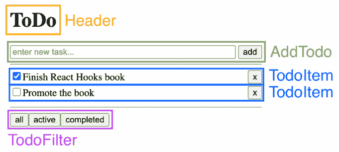
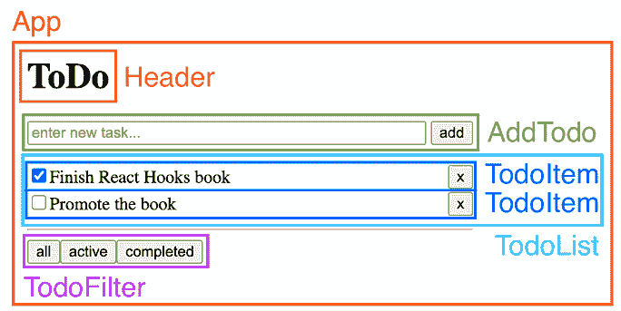
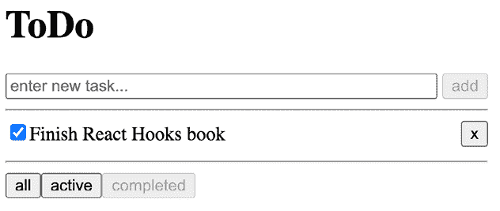

# 13

# 从 React 类组件迁移

在上一章中，我们学习了如何通过从现有代码中提取自定义钩子来构建自己的钩子。然后，我们在博客应用中使用了我们的自定义钩子。最后，我们学习了如何使用 React 测试库为钩子编写测试，并为我们的自定义钩子编写了测试。

在本章中，我们将首先通过实现一个待办事项应用来使用 React 类组件。然后，我们将学习如何将现有的 React 类组件应用迁移到钩子。通过实际比较钩子和类组件之间的差异，我们将加深对使用这两种解决方案权衡的理解。

本章将涵盖以下主题：

+   使用 React 类组件处理状态

+   从 React 类组件迁移

+   React 类组件与 React Hooks 的权衡

# 技术要求

应该已经安装了相当新的 Node.js 版本。Node 包管理器（`npm`）也需要安装（它应该与 Node.js 一起安装）。有关如何安装 Node.js 的更多信息，请访问他们的官方网站：[`nodejs.org/`](https://nodejs.org/)

我们将在本书的指南中使用**Visual Studio Code**（**VS Code**），但任何其他编辑器都应该以类似的方式工作。有关如何安装 VS Code 的更多信息，请参阅他们的官方网站：[`code.visualstudio.com`](https://code.visualstudio.com)

在本书中，我们使用以下版本：

+   Node.js v22.14.0

+   `npm` v10.9.2

+   Visual Studio Code v1.97.2

前面列表中提到的版本是本书中使用的版本。虽然安装较新版本可能不会出现问题，但请注意，某些步骤在较新版本上可能工作方式不同。如果您在使用本书中提供的代码和步骤时遇到问题，请尝试使用提到的版本。

您可以在 GitHub 上找到本章的代码：[`github.com/PacktPublishing/Learn-React-Hooks-Second-Edition/tree/main/Chapter13`](https://github.com/PacktPublishing/Learn-React-Hooks-Second-Edition/tree/main/Chapter13)

强烈建议您自己编写代码。不要简单地运行书中提供的代码示例。自己编写代码对于正确学习和理解代码非常重要。然而，如果您遇到任何问题，您始终可以参考代码示例。

# 使用 React 类组件处理状态

在我们从类组件迁移到钩子之前，我们将创建一个使用类组件的小型待办事项应用。之后，我们将使用钩子将这些类组件转换为函数组件。最后，我们将比较这两种解决方案。

## 设计应用结构

正如我们在之前的博客应用中所做的那样，我们将首先思考我们的待办事项应用的基本结构。在这里，我们需要以下内容：

+   一个标题

+   一种添加新待办事项的方法

+   一种在列表中显示所有待办事项的方法

+   待办事项的过滤器

总是先从原型开始是一个好主意。所以让我们开始：

1.  根据之前的结构元素列表，开始绘制我们的待办事项应用界面的原型：



图 13.1 – 我们的待办事项应用的原型

1.  接下来，通过围绕 UI 元素绘制并给它们命名来绘制简单的组件，类似于我们在博客应用中做的那样：



图 13.2 – 在我们的应用原型中绘制简单组件

1.  现在，绘制容器组件，它们将简单的组件组合在一起：



图 13.3 – 在我们的应用原型中绘制容器组件

如我们所见，我们需要以下组件：

+   `App`

+   `Header`

+   `AddTodo`

+   `TodoList`

+   `TodoItem`

+   `TodoFilter` (+ `TodoFilterItem`)

`TodoList`组件使用了`TodoItem`组件，用于显示一个项目，包括一个复选框来完成它和一个按钮来移除它。`TodoFilter`组件内部使用`TodoFilterItem`组件来显示各种过滤器。

## 初始化项目

我们将使用来自*第一章**，介绍 React 和 React Hooks 的裸骨 Vite 应用来创建一个新的项目。现在让我们初始化项目：

1.  将`Chapter01_3`文件夹复制到一个新的`Chapter13_1`文件夹中，如下所示：

    ```js
    $ cp -R Chapter01_3 Chapter13_1 
    ```

1.  在 VS Code 中打开新的`Chapter13_1`文件夹。

1.  *删除*当前的`src/App.jsx`文件，因为我们将在下一步创建一个新的文件。

在项目初始化后，我们可以开始定义应用结构。

## 定义应用结构

我们已经从原型中知道了应用的基本结构，所以让我们首先定义`App`组件：

1.  创建一个新的`src/App.jsx`文件。

1.  在其中，导入`React`以及我们应用的所有容器组件：

    ```js
    import React from 'react'
    import { Header } from './Header.jsx'
    import { AddTodo } from './AddTodo.jsx'
    import { TodoList } from './TodoList.jsx'
    import { TodoFilter } from './TodoFilter.jsx' 
    ```

1.  接下来，将`App`组件定义为类组件。在类组件中，我们需要定义一个`render`方法来渲染我们的组件：

    ```js
    export class App extends React.Component {
      render() {
        return (
          <div style={{ width: '400px' }}>
    <Header />
    <AddTodo />
    <hr />
    <TodoList />
    <hr />
    <TodoFilter />
    </div>
        )
      }
    } 
    ```

`App`组件定义了我们的应用的基本结构。它将包括一个标题、添加新待办事项的方式、待办事项列表和一个过滤器。

## 定义组件

现在，我们将以下组件定义为静态组件：

+   `Header`

+   `AddTodo`

+   `TodoList`

+   `TodoItem`

+   `TodoFilter`

在本章的后面部分，我们将向它们添加动态功能。

### 定义 Header 组件

我们将从最简单的组件`Header`开始，因为它是最简单的：

1.  创建一个新的`src/Header.jsx`文件。

在这个项目中，我们决定将所有组件直接放在`src/`文件夹中，因为组件数量很少。

1.  在新创建的文件中，导入`React`，并使用`render`方法定义类组件：

    ```js
    import React from 'react'
    export class Header extends React.Component {
      render() {
        return <h1>ToDo</h1>
      }
    } 
    ```

### 定义 AddTodo 组件

接下来，我们将定义`AddTodo`组件，它将渲染一个输入字段和一个按钮：

1.  创建一个新的`src/AddTodo.jsx`文件。

1.  在其中，导入`React`并定义类组件：

    ```js
    import React from 'react'
    export class AddTodo extends React.Component {
      render() { 
    ```

1.  在`render`方法中，我们返回一个包含输入字段和提交按钮的表单：

    ```js
     return (
          <form>
    <input
     type='text'
     placeholder='enter new task...'
     style={{ width: '350px' }}
            />
    <input
     type='submit'
     style={{ float: 'right' }}
     value='add'
            />
    </form>
        )
      }
    } 
    ```

### 定义 TodoList 组件

现在，我们定义`TodoList`组件，它将使用`TodoItem`组件（我们将在下一步创建它）。现在，我们将在一个数组中静态定义两个待办事项的数据，并使用它来渲染`TodoItem`组件。

让我们开始定义`TodoList`组件：

1.  创建一个新的`src/TodoList.jsx`文件。

1.  在其中，导入`React`和`TodoItem`组件：

    ```js
    import React from 'react'
    import { TodoItem } from './TodoItem.jsx' 
    ```

1.  然后，定义类组件：

    ```js
    export class TodoList extends React.Component {
      render() { 
    ```

1.  在`render`方法中，我们静态地定义了两个待办事项：

    ```js
     const items = [
          { id: 1, title: 'Finish React Hooks book', completed: true },
          { id: 2, title: 'Promote the book', completed: false },
        ] 
    ```

1.  最后，我们将使用`map`函数渲染项目：

    ```js
     return items.map((item) => <TodoItem {...item} key={item.id} />)
      }
    } 
    ```

我们最后定义`key`属性，以避免在`item`对象展开时覆盖它。

### 定义 TodoItem 组件

在定义了`TodoList`组件之后，我们现在将定义`TodoItem`组件，以便渲染单个项目。让我们开始定义`TodoItem`组件：

1.  创建一个新的`src/TodoItem.jsx`文件。

1.  在其中，导入`React`并定义类组件：

    ```js
    import React from 'react'
    export class TodoItem extends React.Component {
      render() { 
    ```

1.  现在，我们将使用解构来获取`title`和`completed`属性：

    ```js
     const { title, completed } = this.props 
    ```

1.  最后，我们将渲染一个复选框、标题和一个删除项目的按钮：

    ```js
     return (
          <div style={{ width: '400px', height: '25px' }}>
    <input type='checkbox' checked={completed} />
            {title}
            <button type='button' style={{ float: 'right' }}>x</button>
    </div>
        )
      }
    } 
    ```

### 定义 TodoFilter 组件

最后，我们将定义`TodoFilter`组件。在同一个文件中，我们还将定义`TodoFilterItem`组件，因为它们紧密相关。所以，让我们开始实现这些组件：

1.  创建一个新的`src/TodoFilter.jsx`文件。

1.  在其中，导入`React`并定义一个`TodoFilterItem`类组件：

    ```js
    import React from 'react'
    export class TodoFilterItem extends React.Component {
      render() { 
    ```

1.  我们使用解构来获取`name`属性：

    ```js
     const { name } = this.props 
    ```

1.  然后，我们返回一个按钮来选择过滤器：

    ```js
     return <button type='button'>{name}</button>
      }
    } 
    ```

1.  最后，我们定义实际的`TodoFilter`组件，它将渲染三个`TodoFilterItem`组件：

    ```js
    export class TodoFilter extends React.Component {
      render() {
        return (
          <div>
    <TodoFilterItem name='all' />
    <TodoFilterItem name='active' />
    <TodoFilterItem name='completed' />
    </div>
        )
      }
    } 
    ```

现在我们已经实现了所有静态组件，我们可以开始启动应用。

### 启动应用

要启动应用，运行以下命令：

```js
$ npm run dev 
```

在浏览器中打开 URL，你会看到应用看起来就像我们的模拟图一样！

然而，应用是完全静态的，当我们点击任何东西时，什么都不会发生。在下一步中，我们将使我们的应用动态化。

## 实现动态代码

现在我们已经定义了所有静态组件，我们的应用应该看起来就像模拟图。下一步是实现使用 React 状态、生命周期和处理器函数的动态代码。

在本节中，我们将要：

+   定义模拟 API

+   定义`StateContext`

+   使`App`组件动态化

+   使`AddTodo`组件动态化

+   使`TodoList`组件动态化

+   使`TodoItem`组件动态化

+   使`TodoFilter`组件动态化

让我们开始吧。

### 定义模拟 API

首先，我们将定义一个 API 来获取待办事项。在我们的例子中，我们将在短暂的延迟后返回一个待办事项数组，以模拟网络请求，这通常需要一些时间来解决。

现在让我们开始实现模拟 API：

1.  创建一个新的`src/api.js`文件。

1.  在其中，定义并导出一个函数，该函数在短暂的延迟后返回项目：

    ```js
    const mockItems = [
      { id: 1, title: 'Finish React Hooks book', completed: true },
      { id: 2, title: 'Promote the book', completed: false },
    ]
    export function fetchTodos() {
      return new Promise((resolve) => {
        setTimeout(() => resolve(mockItems), 100)
      })
    } 
    ```

这里我们使用 Promise API 在等待 100ms 后解析一个包含模拟项目的数组，以模拟真实的 API 请求。

接下来，我们将定义一个上下文，它将保持我们当前的待办事项列表。

### 定义状态上下文

我们现在将定义一个上下文，它将保持我们待办应用的当前状态：

1.  创建一个新的`src/StateContext.js`文件。

1.  在其中，从 React 导入`createContext`函数：

    ```js
    import { createContext } from 'react' 
    ```

1.  然后，定义并导出一个包含空数组的上下文：

    ```js
    export const StateContext = createContext([]) 
    ```

现在我们有一个可以存储我们的待办事项数组的上下文，让我们继续使组件动态化。

### 使 App 组件动态化

我们将首先使`App`组件动态化，添加获取、添加、切换、过滤和删除待办事项的功能。为此：

1.  编辑`src/App.jsx`并导入`StateContext`和`fetchTodos`函数：

    ```js
    import { StateContext } from './StateContext.js'
    import { fetchTodos } from './api.js' 
    ```

1.  接下来，我们将修改我们的`App`类代码，向其中添加一个`constructor`，它将设置初始状态：

    ```js
    export class App extends React.Component {
    **constructor****(props) {** 
    ```

1.  在这个构造函数中，我们首先需要调用`super`以确保父类（`React.Component`）的构造函数被调用，并且组件被正确初始化：

    ```js
     super(props) 
    ```

1.  现在，我们可以使用`this.state`设置初始状态。最初，没有待办事项，过滤器设置为`all`：

    ```js
     this.state = { todos: [], filteredTodos: [], filter: 'all' }
      } 
    ```

1.  然后，我们定义了`componentDidMount`生命周期方法，该方法将在组件首次渲染时加载待办事项：

    ```js
     componentDidMount() {
        this.loadTodos()
      } 
    ```

1.  接下来，我们将定义`loadTodos`方法，在我们的例子中，它将简单地设置状态，因为我们不会将这个简单的应用连接到后端。我们还将调用`this.filterTodos()`来更新`filteredTodos`数组：

    ```js
     async loadTodos() {
        const todos = await fetchTodos()
        this.setState({ todos })
        this.filterTodos()
      } 
    ```

我们将在本节稍后定义`filterTodos`方法。

1.  接下来，我们定义了`addTodo`方法，该方法创建一个新项目并将其添加到数组中：

    ```js
     addTodo(title) {
        const { todos } = this.state
    const newTodo = { id: Date.now(), title, completed: false }
        this.setState({ todos: [newTodo, ...todos] })
        this.filterTodos()
      } 
    ```

    为了保持简单，我们只是使用`Date.now()`为每个待办事项生成一个唯一的 ID。

1.  我们现在定义一个`toggleTodo`方法，它使用`map`函数查找并修改特定的待办事项：

    ```js
     toggleTodo(id) {
        const { todos } = this.state
    const updatedTodos = todos.map(item => {
          if (item.id === id) {
            return { ...item, completed: !item.completed }
          }
          return item
        })
        this.setState({ todos: updatedTodos })
        this.filterTodos()
      } 
    ```

1.  现在，定义`removeTodo`方法，它使用`filter`函数查找并删除特定的待办事项：

    ```js
     removeTodo(id) {
        const { todos } = this.state
    const updatedTodos = todos.filter((item) => item.id !== id)
        this.setState({ todos: updatedTodos })
        this.filterTodos()
      } 
    ```

1.  然后，定义一个方法来应用不同的过滤器到待办事项，例如`active`、`completed`和`all`：

    ```js
     applyFilter(todos, filter) {
        switch (filter) {
          case 'active':
            return todos.filter((item) => item.completed === false)
          case 'completed':
            return todos.filter((item) => item.completed === true)
          case 'all':
          default:
            return todos
        }
      } 
    ```

1.  现在，我们可以定义`filterTodos`方法，它将调用`applyFilter`方法并更新`filteredTodos`和`filter`状态：

    ```js
     filterTodos(filterArg) {
        this.setState(({ todos, filter }) => {
          const newFilter = filterArg ?? filter
          return {
            filter: newFilter,
            filteredTodos: this.applyFilter(todos, newFilter),
          }
        })
      } 
    ```

**空合并** (`??`) 运算符用于在左侧值是 `undefined` 或 `null` 时回退到不同的值。与 `||` 运算符不同，`??` 运算符仅针对 `undefined`/`null` 值触发，而不是针对 `0`、`''` 或 `false` 这样的假值。

我们使用 `filterTodos` 在添加/删除后以及更改过滤器时重新过滤待办事项。为了使这两种功能都能正常工作，我们需要检查是否传入了过滤器参数 `filterArg`。如果没有，我们将回退到 `state` 对象中的当前 `filter` 值。

1.  然后，我们调整 `render` 方法并使用状态为 `StateContext` 提供一个值。我们还向下传递某些方法到组件：

    ```js
     render() {
    **const** **{ filter, filteredTodos } =** **this****.****state**
    return (
          **<****StateContext.Provider****value****=****{filteredTodos}****>**
    <div style={{ width: '400px' }}>
    <Header />
    <AddTodo **addTodo****=****{this.addTodo}** />
    <hr />
    <TodoList **toggleTodo****=****{this.toggleTodo}****removeTodo****=****{this.removeTodo}** />
    <hr />
    <TodoFilter **filter****=****{filter}****filterTodos****=****{this.filterTodos}** />
    </div>
    </StateContext.Provider>
        )
      }
    } 
    ```

1.  最后，我们需要重新绑定 `this` 到类，这样我们就可以在不改变 `this` 上下文的情况下将方法传递给我们的组件。通过以下方式调整 `constructor` 方法，重新绑定所有方法中的 `this` 上下文：

    ```js
     constructor(props) {
        super(props)
        this.state = { todos: [], filteredTodos: [], filter: 'all' }
    **this****.****loadTodos** **=** **this****.****loadTodos****.****bind****(****this****)**
    **this****.****addTodo** **=** **this****.****addTodo****.****bind****(****this****)**
    **this****.****toggleTodo** **=** **this****.****toggleTodo****.****bind****(****this****)**
    **this****.****removeTodo** **=** **this****.****removeTodo****.****bind****(****this****)**
    **this****.****filterTodos** **=** **this****.****filterTodos****.****bind****(****this****)**
      } 
    ```

现在，`App` 组件可以动态地获取、添加、切换、删除和过滤待办事项。正如我们所看到的，当我们使用类组件时，我们需要重新绑定处理函数的 `this` 上下文到类。否则，当我们调用方法时，会因为它们的 `this` 上下文不再绑定到类而引发错误，因此它们无法调用如 `this.setState` 这样的方法。

### 使 `AddTodo` 组件动态化

在使 `App` 组件动态化之后，现在是时候使我们的所有其他组件也动态化了。我们将从顶部开始，以 `AddTodo` 组件为例：

1.  编辑 `src/AddTodo.jsx` 并定义一个 `constructor`，它为输入字段设置初始状态：

    ```js
    export class AddTodo extends React.Component {
    **constructor****(****props****) {**
    **super****(props)**
    **this****.****state** **= {**
    **input****:** **''****,**
     **}**
     **}** 
    ```

1.  然后，定义一个处理输入字段变化的方法：

    ```js
     handleInput(e) {
        this.setState({ input: e.target.value })
      } 
    ```

1.  现在，定义一个处理表单提交的方法：

    ```js
     handleSubmit(e) {
        e.preventDefault()
        const { input } = this.state
    const { addTodo } = this.props
    if (input) {
          addTodo(input)
          this.setState({ input: '' })
        }
      } 
    ```

1.  接下来，我们可以将输入值以及输入和提交处理程序分配给相关组件。此外，当输入字段为空时，我们将禁用按钮：

    ```js
     render() {
    **const** **{ input } =** **this****.****state**
    return (
          <form **onSubmit****=****{this.handleSubmit}****>**
    <input
     type='text'
     placeholder='enter new task...'
     style={{ width: '350px' }}
    **value****=****{input}**
    **onChange****=****{this.handleInput}**
            />
    <input
     type='submit'
     style={{ float: 'right' }}
     value='add'
    **disabled****=****{!input}**
            />
    </form>
        )
      }
    } 
    ```

1.  最后，我们需要通过重新绑定所有处理方法中的 `this` 上下文来调整构造函数，如下所示：

    ```js
     constructor(props) {
        super(props)
        this.state = {
          input: '',
        }
    **this****.****handleInput** **=** **this****.****handleInput****.****bind****(****this****)**
    **this****.****handleSubmit** **=** **this****.****handleSubmit****.****bind****(****this****)**
      } 
    ```

现在，只要没有输入文本，`AddTodo` 组件将显示一个禁用的按钮。一旦我们输入一些文本并点击按钮，它将触发 `App` 组件的 `addTodo` 方法。

### 使 `TodoList` 组件动态化

在我们的待办事项应用中的下一个组件是 `TodoList` 组件。在这里，我们只需要从 `StateContext` 获取待办事项。为此：

1.  编辑 `src/TodoList.jsx` 并导入 `StateContext`：

    ```js
    import { StateContext } from './StateContext.js' 
    ```

1.  然后，我们将 `contextType` 设置为 `StateContext`，这将允许我们通过 `this.context` 使用上下文：

    ```js
    export class TodoList extends React.Component {
    **static** **contextType =** **StateContext** 
    ```

    使用类组件时，如果您想使用多个上下文，您必须使用 `StateContext.Consumer` 组件，如下所示：

    ```js
    `<StateContext.Consumer>`
     `{value => <div>State is: {value}</div>}`
    `</StateContext.Consumer>` 
    ```

    如您所想象，使用多个上下文将导致非常深的组件树，代码将难以阅读和重构。

1.  现在，我们可以从 `this.context` 获取项目，而不是静态地定义它们：

    ```js
     render() {
        const items = **this****.****context** 
    ```

1.  最后，我们将所有 props 传递给`TodoItem`组件，这样我们就可以在那里使用`removeTodo`和`toggleTodo`方法：

    ```js
     return items.map((item) => (
          <TodoItem {...item} **{****...this.props****}** key={item.id} />
        ))
      }
    } 
    ```

现在的`TodoList`组件从`StateContext`获取项目，而不是静态定义它们。接下来，让我们继续使`TodoItem`组件动态化。

### 使 TodoItem 组件动态化

现在我们已经将`removeTodo`和`toggleTodo`方法作为 props 传递给`TodoItem`组件，我们可以在那里实现这些功能，并使`TodoItem`组件也动态化：

1.  编辑`src/TodoItem.jsx`，并为`toggleTodo`和`removeTodo`函数定义处理方法：

    ```js
     handleToggle() {
        const { toggleTodo, id } = this.props
    toggleTodo(id)
      }
      handleRemove() {
        const { removeTodo, id } = this.props
    removeTodo(id)
      } 
    ```

1.  然后，我们将处理函数分别分配给复选框和按钮：

    ```js
     render() {
        const { title, completed } = this.props
    return (
          <div style={{ width: '400px', height: '25px' }}>
    <input
     type='checkbox'
     checked={completed}
    **onChange****=****{this.handleToggle}**
            />
            {title}
            <button
     type='button'
     style={{ float: 'right' }}
    **onClick****=****{this.handleRemove}**
            >
              x
            </button>
    </div>
        )
      }
    } 
    ```

1.  最后，我们需要重新绑定处理方法的`this`上下文。定义一个新的`constructor`方法，如下所示：

    ```js
    export class TodoItem extends React.Component {
    **constructor****(****props****) {**
    **super****(props)**
    **this****.****handleToggle** **=** **this****.****handleToggle****.****bind****(****this****)**
    **this****.****handleRemove** **=** **this****.****handleRemove****.****bind****(****this****)**
     **}** 
    ```

现在的`TodoItem`组件正确触发了切换和删除方法。接下来，我们将使`TodoFilter`组件动态化。

### 使 TodoFilter 组件动态化

最后，我们将使用`filterTodos`方法动态过滤待办事项列表：

1.  编辑`src/TodoFilter.jsx`，在`TodoFilter`类组件中，将所有 props 传递给`TodoFilterItem`组件：

    ```js
    export class TodoFilter extends React.Component {
      render() {
        return (
          <div>
    <TodoFilterItem **{****...this.props****}** name='all' />
    <TodoFilterItem **{****...this.props****}** name='active' />
    <TodoFilterItem **{****...this.props****}** name='completed' />
    </div>
        )
      }
    } 
    ```

1.  在同一文件中，为`TodoFilterItem`类组件添加一个`handleFilter`方法：

    ```js
    export class TodoFilterItem extends React.Component {
    **handleFilter****() {**
    **const** **{ name, filterTodos } =** **this****.****props**
    **filterTodos****(name)**
     **}** 
    ```

1.  然后，获取`filter`属性，禁用具有当前选定过滤器的按钮，并在按钮被点击时调用`this.handleFilter`：

    ```js
     render() {
        const { name, **filter =** **'all'** } = this.props
    return (
          <button type='button' **disabled****=****{filter** **===** **name}** **onClick****=****{this.handleFilter}**>
            {name}
          </button>
        )
      }
    } 
    ```

1.  最后，我们为`TodoFilterItem`类组件定义一个`constructor`方法，并重新绑定处理函数的`this`上下文：

    ```js
    export class TodoFilterItem extends React.Component {
    **constructor****(****props****) {**
    **super****(props)**
    **this****.****handleFilter** **=** **this****.****handleFilter****.****bind****(****this****)**
     **}** 
    ```

现在，`TodoFilter`组件触发过滤处理函数来更改过滤器。我们的整个应用现在是动态的，我们可以使用其所有功能！

### 启动应用

到目前为止，我们已经使所有组件动态化，可以开始应用，如下所示：

```js
$ npm run dev 
```

在浏览器中打开 URL，尝试添加/切换/删除/过滤待办事项，你会看到一切按预期工作！



图 13.4 – 在我们的待办事项应用中仅显示已完成的项目

**示例代码**

本节的示例代码可以在`Chapter13/Chapter13_1`文件夹中找到。请检查文件夹内的`README.md`文件，以获取设置和运行示例的说明。

现在我们已经用 React 类组件使我们的应用运行良好，让我们用它来学习如何将现有应用迁移到 React Hooks。

# 从 React 类组件迁移

在使用 React 类组件设置好我们的示例项目后，我们现在将迁移此项目到 React Hooks。我们将展示如何迁移副作用，例如组件挂载时获取待办事项，以及将状态管理迁移到基于 Hook 的解决方案。

在本节中，我们将迁移以下组件：

+   `TodoItem`

+   `TodoList`

+   `TodoFilterItem`

+   `TodoFilter`

+   `AddTodo`

+   `App`

在我们这样做之前，请创建一个新的文件夹用于迁移项目，具体如下：

1.  将 `Chapter13_1` 文件夹复制到新的 `Chapter13_2` 文件夹中，具体操作如下：

    ```js
    $ cp -R Chapter13_1 Chapter13_2 
    ```

1.  在 VS Code 中打开新的 `Chapter13_2` 文件夹。

现在，我们可以开始迁移组件。

## 迁移 TodoItem 组件

最简单的组件之一要迁移的是 `TodoItem` 组件。它不使用任何状态或副作用，因此我们可以简单地将其转换为函数组件。

现在让我们开始迁移 `TodoItem` 组件：

1.  编辑 `src/TodoItem.jsx` 并*删除*所有现有的代码。

1.  现在，我们定义一个接受 `title`、`completed`、`id`、`toggleTodo` 和 `removeTodo` 属性的函数组件：

    ```js
    export function TodoItem({ title, completed, id, toggleTodo,
     removeTodo }) { 
    ```

1.  然后，我们定义两个处理函数来切换和删除待办事项：

    ```js
     function handleToggle() {
        toggleTodo(id)
      }
      function handleRemove() {
        removeTodo(id)
      } 
    ```

1.  最后，我们渲染组件：

    ```js
     return (
        <div style={{ width: '400px', height: '25px' }}>
    <input type='checkbox' checked={completed}
     onChange={handleToggle} />
          {title}
          <button type='button' style={{ float: 'right' }}  
     onClick={handleRemove}>
            x
          </button>
    </div>
      )
    } 
    ```

尽量保持你的函数组件小巧，并通过创建使用其他函数组件的新函数组件（这种模式称为**组合**）来组合它们。拥有许多小组件总是一个好主意，而不是一个大组件。它们更容易维护、重用和重构。

如您所见，函数组件不需要我们重新绑定 `this`，或者根本不需要定义构造函数。此外，我们不需要在多个地方多次从 `this.props` 中解构。我们可以在函数定义中简单地解构所有 props。

如果你现在运行应用程序，你会看到它仍然可以工作。React 实际上允许你将函数组件与类组件组合，因此不需要一次性迁移整个代码库，你可以分批迁移某些部分。React 类组件甚至可以渲染使用 Hooks 的函数组件。唯一的限制是我们不能在类组件中使用 Hooks。因此，我们需要一次迁移一个组件。

现在，让我们继续迁移 `TodoList` 组件。

## 迁移 TodoList 组件

`TodoList` 组件渲染多个 `TodoItem` 组件。在这里，我们使用了上下文，这意味着我们现在可以使用 Context Hook。

现在让我们迁移 `TodoList` 组件：

1.  编辑 `src/TodoList.jsx` 并*删除*所有现有的代码。

1.  导入以下内容：

    ```js
    import { useContext } from 'react'
    import { StateContext } from './StateContext.js'
    import { TodoItem } from './TodoItem.jsx' 
    ```

1.  定义一个函数组件。在这种情况下，我们不需要解构 props，而是简单地获取整个对象：

    ```js
    export function TodoList(props) { 
    ```

1.  现在，定义 Context Hook：

    ```js
     const items = useContext(StateContext) 
    ```

1.  最后，返回渲染项的列表：

    ```js
     return items.map((item) => <TodoItem {...item} {...props}
     key={item.id} />)
    } 
    ```

如我们所见，使用 Hooks 与上下文一起使用要简单得多。我们只需调用一个函数（Context Hook），并使用返回值。没有神奇的 `this.context` 赋值！

接下来，让我们迁移 TodoFilter 组件。

## 迁移 TodoFilter 组件

`TodoFilter` 组件没有使用任何 Hooks。然而，我们将用两个函数组件替换 `TodoFilterItem` 和 `TodoFilter` 类组件——一个用于 `TodoFilterItem`，另一个用于 `TodoFilter` 组件：

1.  编辑 `src/TodoFilter.jsx` 并*删除*所有现有的代码。

1.  定义 `TodoFilterItem` 组件，具体如下：

    ```js
    export function TodoFilterItem({ name, filterTodos, filter = 'all' }) {
      function handleFilter() {
        filterTodos(name)
      }
      return (
        <button type='button' disabled={filter === name}
     onClick={handleFilter}>
          {name}
        </button>
      )
    } 
    ```

1.  接下来，定义 `TodoFilter` 组件，如下所示：

    ```js
    export function TodoFilter(props) {
      return (
        <div>
    <TodoFilterItem {...props} name='all' />
    <TodoFilterItem {...props} name='active' />
    <TodoFilterItem {...props} name='completed' />
    </div>
      )
    } 
    ```

如我们所见，`TodoFilter` 组件静态渲染了三个 `TodoFilterItem` 组件，这些组件用于在显示 `所有`、`活动` 或 `完成` 待办事项之间切换过滤。接下来，让我们迁移 `AddTodo` 组件。

## 迁移 AddTodo 组件

对于 `AddTodo` 组件，我们将使用 State Hook 来处理输入字段状态。

现在，让我们迁移 `AddTodo` 组件：

1.  编辑 `src/AddTodo.jsx` 并 *删除* 所有的现有代码。

1.  导入 `useState` 函数：

    ```js
    import { useState } from 'react' 
    ```

1.  定义 `AddTodo` 组件，该组件接受一个 `addTodo` 函数作为属性：

    ```js
    export function AddTodo({ addTodo }) { 
    ```

1.  接下来，定义一个用于输入字段状态的 State Hook：

    ```js
     const [input, setInput] = useState('') 
    ```

1.  现在，定义处理函数：

    ```js
     function handleInput(e) {
        setInput(e.target.value)
      }
      function handleSubmit(e) {
        e.preventDefault()
        if (input) {
          addTodo(input)
          setInput('')
        }
      } 
    ```

1.  最后，渲染输入字段和按钮：

    ```js
     return (
        <form onSubmit={handleSubmit}>
    <input
     type='text'
     placeholder='enter new task...'
     style={{ width: '350px' }}
     value={input}
     onChange={handleInput}
          />
    <input
     type='submit'
     style={{ float: 'right' }}
     value='add'
     disabled={!input}
          />
    </form>
      )
    } 
    ```

如我们所见，使用 State Hook 使得状态管理变得更加简单。我们可以为每个状态值定义一个单独的值和设置函数，而不是必须处理一个单一的 `state` 对象。此外，我们不必始终从 `this.state` 中解构。因此，我们的代码更加整洁和简洁。

现在，让我们继续迁移 App 组件。

## 迁移状态管理和 App 组件

最后，剩下要做的就是迁移 `App` 组件。然后，我们的整个待办事项应用将迁移到 React Hooks。在这里，我们将使用 Reducer Hook 来管理状态，使用 Effect Hook 在组件挂载时获取待办事项，并使用 Memo Hook 存储过滤后的待办事项列表。

在本节中，我们将：

+   定义动作

+   定义计算器

+   迁移 App 组件

让我们开始吧。

### 定义动作

我们的应用将接受五个动作，让我们先花点时间想想它们会是什么样子：

+   `LOAD_TODOS`：用于加载新的待办事项列表

    ```js
    { type: 'LOAD_TODOS', todos: [] } 
    ```

+   `ADD_TODO`：用于插入一个新的待办事项

    ```js
    { type: 'ADD_TODO', title: 'Test todo app' } 
    ```

+   `TOGGLE_TODO`：用于切换待办事项的完成值

    ```js
    { type: 'TOGGLE_TODO', id: 'xxx' } 
    ```

+   `REMOVE_TODO`：用于删除待办事项

    ```js
    { type: 'REMOVE_TODO', id: 'xxx' } 
    ```

+   `FILTER_TODOS`：用于过滤待办事项

    ```js
    { type: 'FILTER_TODOS', filter: 'completed' } 
    ```

### 定义计算器

现在我们将定义我们状态的计算器。我们需要一个应用计算器和两个子计算器：一个用于待办事项，一个用于过滤。

#### 定义过滤计算器

我们将首先定义用于 `filter` 值的计算器：

1.  创建一个新的 `src/reducers.js` 文件。

1.  在此文件中，定义一个用于 `filterReducer` 的函数，该函数将处理 `FILTER_TODOS` 动作并相应地设置过滤值：

    ```js
    function filterReducer(state, action) {
        if (action.type === 'FILTER_TODOS') {
            return action.filter
        }
        return state
    } 
    ```

接下来，让我们继续到 `todosReducer` 函数。

#### 定义 todos 减法器

现在，我们将定义用于待办事项的 `todosReducer` 函数。在这里，我们将处理 `LOAD_TODOS`、`ADD_TODO`、`TOGGLE_TODO` 和 `REMOVE_TODO` 动作：

1.  编辑 `src/reducers.js` 并定义一个新的函数，该函数将处理这些动作：

    ```js
    function todosReducer(state, action) {
      switch (action.type) { 
    ```

1.  对于 `LOAD_TODOS` 动作，我们只需用新的 `todos` 数组替换当前状态：

    ```js
     case 'LOAD_TODOS':
          return action.todos 
    ```

1.  对于 `ADD_TODO` 动作，我们将在新状态数组中插入一个新的条目：

    ```js
     case 'ADD_TODO': {
          const newTodo = { id: Date.now(), title: action.title, completed: false }
          return [newTodo, ...state]
        } 
    ```

1.  对于`TOGGLE_TODO`动作，我们将使用`map`函数更新单个待办事项：

    ```js
     case 'TOGGLE_TODO': {
          return state.map((item) => {
            if (item.id === action.id) {
              return { ...item, completed: !item.completed }
            }
            return item
          })
        } 
    ```

1.  对于`REMOVE_TODO`动作，我们将使用`filter`函数删除单个待办事项：

    ```js
     case 'REMOVE_TODO': {
          return state.filter((item) => item.id !== action.id)
        } 
    ```

1.  默认情况下（对于所有其他动作），我们简单地返回当前状态：

    ```js
     default:
          return state
      }
    } 
    ```

现在我们只需要定义`appReducer`，它将把其他两个 reducer 合并成一个。

#### 定义应用 reducer

为了在一个 Reducer Hook 中处理我们的待办应用状态，我们将把创建的两个 reducer 合并成一个`appReducer`函数。为此：

1.  编辑`src/reducers.js`并定义并导出一个新的函数用于应用 reducer：

    ```js
    export function appReducer(state, action) { 
    ```

1.  在这个函数中，我们返回一个包含其他 reducer 值的对象。我们简单地将子状态和动作传递给其他 reducer：

    ```js
     return {
        todos: todosReducer(state.todos, action),
        filter: filterReducer(state.filter, action),
      }
    } 
    ```

现在我们已经定义了一个用于管理应用状态的 reducer，我们可以开始迁移`App`组件。

### 迁移 App 组件

让我们开始迁移`App`组件：

1.  编辑`src/App.jsx`并*删除*所有现有的代码。

1.  导入以下内容：

    ```js
    import { useReducer, useEffect, useMemo } from 'react'
    import { Header } from './Header.jsx'
    import { AddTodo } from './AddTodo.jsx'
    import { TodoList } from './TodoList.jsx'
    import { TodoFilter } from './TodoFilter.jsx'
    import { StateContext } from './StateContext.js'
    import { fetchTodos } from './api.js'
    import { appReducer } from './reducers.js' 
    ```

1.  首先，我们定义一个函数组件，它不会接受任何属性：

    ```js
    export function App() { 
    ```

1.  现在，我们使用`appReducer`函数定义一个 Reducer Hook：

    ```js
     const [state, dispatch] = useReducer(appReducer, { todos: [],
     filter: 'all' }) 
    ```

1.  让我们也解构`state`对象，以便我们以后更容易访问它：

    ```js
     const { todos, filter } = state 
    ```

1.  然后，我们使用 Memo Hook 实现过滤机制。这是使用 Memo Hook 实际上必要的少数情况之一。否则，我们的组件会太频繁地重新渲染，导致无限循环。我们可以使用 Memo Hook 来确保只有当`todos`或`filter`状态改变时，`filteredTodos`的改变才会被触发，如下所示：

    ```js
     const filteredTodos = useMemo(() => {
        switch (filter) {
          case 'active':
            return todos.filter((item) => item.completed === false)
          case 'completed':
            return todos.filter((item) => item.completed === true)
          case 'all':
          default:
            return todos
        }
      }, [todos, filter]) 
    ```

1.  现在，我们定义一个 Effect Hook，它将从我们的模拟 API 获取待办事项，然后派发一个`LOAD_TODOS`动作：

    ```js
     useEffect(() => {
        async function loadTodos() {
          const todos = await fetchTodos()
          dispatch({ type: 'LOAD_TODOS', todos })
        }
        void loadTodos()
      }, []) 
    ```

Effect Hook 内部的函数需要是同步的，因此我们在这里使用一种变通方法来使 async/await 构造函数工作。当不关心等待异步函数完成时，最好在函数调用前加上`void`前缀，以表明我们故意没有`await`它。

1.  接下来，我们定义各种函数，这些函数将派发动作并改变我们应用的状态：

    ```js
     function addTodo(title) {
        dispatch({ type: 'ADD_TODO', title })
      }
      function toggleTodo(id) {
        dispatch({ type: 'TOGGLE_TODO', id })
      }
      function removeTodo(id) {
        dispatch({ type: 'REMOVE_TODO', id })
      }
      function filterTodos(filter) {
        dispatch({ type: 'FILTER_TODOS', filter })
      } 
    ```

1.  最后，我们渲染我们待办应用所需的所有组件：

    ```js
     return (
        <StateContext.Provider value={filteredTodos}>
    <div style={{ width: '400px' }}>
    <Header />
    <AddTodo addTodo={addTodo} />
    <hr />
    <TodoList toggleTodo={toggleTodo} removeTodo={removeTodo} />
    <hr />
    <TodoFilter filter={filter} filterTodos={filterTodos} />
    </div>
    </StateContext.Provider>
      )
    } 
    ```

1.  现在我们应用已完全迁移，我们可以启动开发服务器并验证一切是否仍然正常工作：

    ```js
    $ npm run dev 
    ```

如我们所见，使用 Reducer Hook 来处理复杂的状态变化使我们的代码更加简洁且易于维护。我们的应用现在已完全迁移到 Hooks，并且仍然像以前一样工作！

另一种进一步重构和改进代码的可能性是将状态和派发函数存储在一个上下文中，然后定义自定义 Hooks 来处理我们待办应用的各个功能。然而，在这个例子中，我们希望尽可能接近原始类组件代码，所以任何进一步的重构都留给读者作为练习。

**示例代码**

本节的示例代码可以在`Chapter13/Chapter13_2`文件夹中找到。请检查文件夹内的`README.md`文件，以获取设置和运行示例的说明。

现在，让我们通过讨论使用 React 类组件与 React Hooks 的权衡来结束本书。

# React 类组件与 React Hooks 的权衡

现在我们已经完成了从类组件到 Hooks 的迁移，让我们回顾和总结我们所学的知识。

带有 Hooks 的函数组件更容易理解和测试，因为它们只是简单的 JavaScript 函数，而不是复杂的 React 结构。我们还能够将状态改变逻辑重构到单独的`reducers.js`文件中，从而将其从`App`组件中解耦，使其更容易重构和测试。我们可以安全地说，在应用程序逻辑和组件之间分离关注点显著提高了我们项目的可维护性。

现在，让我们回顾一下通过重构我们的应用程序所获得的优势。通过函数组件和 Hooks，以下这些点不再需要考虑：

+   无需处理构造函数。

+   没有令人困惑的`this`上下文（`this`重新绑定）。

+   无需反复解构相同的值。

+   处理上下文、props 和状态时没有魔法。

+   如果我们希望在 props 变化时重新获取数据，则无需定义`componentDidMount`和`componentDidUpdate`。

此外，函数组件还有以下优势：

+   鼓励制作小型和简单的组件。

+   更容易重构。

+   更容易测试。

+   需要的代码更少。

+   对于初学者来说更容易理解。

+   更具声明性。

+   React 服务器组件（RSCs）只能是函数组件。

然而，在以下情况下，类组件可能是可以的：

+   当坚持某些约定时。

+   当使用箭头函数来避免`this`重新绑定时。

+   可能因为现有的知识而更容易被团队理解。

+   许多项目仍然使用类。对于依赖项来说，这并不是一个问题，因为它们仍然可以很容易地在函数组件中使用。然而，在遗留代码库中，你可能仍然需要与类组件一起工作。

最后，这是一个个人喜好问题，但 Hooks 确实在许多方面优于类！如果你正在启动一个新项目，绝对选择 Hooks。如果你正在处理一个现有项目，考虑是否可能有必要将某些组件重构为基于 Hooks 的组件，以使它们更简单。

然而，你不应该立即将所有项目迁移到 Hooks，因为重构可能会引入新的错误。采用 Hooks 的最佳方式是在适当的时候，慢慢地但肯定地用基于 Hooks 的函数组件替换旧的类组件。例如，如果你已经在重构一个组件，你可以将其重构为使用 Hooks！

# 摘要

在本章中，我们首先使用 React 类组件构建了一个待办事项应用程序。我们首先设计了应用程序结构，然后实现了静态组件，最后使它们变得动态。接下来，我们学习了如何使用 Hooks 将使用类组件的现有项目迁移到函数组件。最后，我们学习了类组件的权衡，何时应该使用类组件或 Hooks，以及如何将现有项目迁移到 Hooks。

我们现在在实践中已经看到了 React 类组件与使用 Hooks 的函数组件之间的区别。Hooks 让我们的代码更加简洁，更容易阅读和维护。我们还了解到，我们应该逐步将我们的组件从类组件迁移到使用 Hooks 的函数组件——没有必要立即将整个应用程序迁移过来。

本章标志着本书的结束。在这本书中，我们以使用 Hooks 为动机开始。我们了解到，在 React 应用程序中存在一些常见问题，没有 Hooks 很难解决。然后，我们使用 Hooks 创建了我们的第一个组件，并将其与基于类的解决方案进行了比较。接下来，我们学习了 State Hook，这是其中最普遍的一个。我们还学习了使用 Hooks 解决常见问题，例如条件 Hooks 和循环中的 Hooks。我们对 Hooks 内部的工作原理及其局限性有了深入的了解。

在深入了解了 State Hook 之后，我们使用 Hooks 开发了一个小型博客应用程序。然后，我们学习了 Reducer Hooks、Effect Hooks 和 Context Hooks，以便能够在我们的应用程序中实现更多功能。接下来，我们学习了如何使用 TanStack Query Hooks 和 React Suspense 进行数据获取。然后，我们使用 Hooks 处理表单。接下来，我们使用 React Router 在我们的博客应用程序中实现路由，并学习了 Hooks 如何使动态路由变得更加容易。我们通过使用 Hooks 开发了一个真实的、面向前端的实际应用程序，获得了经验。

我们还学习了 React 提供的各种内置 Hooks，甚至包括高级的 Hooks。然后，我们学习了社区提供的各种 Hooks，这些 Hooks 使处理应用程序状态和不同用例变得更加容易。我们对 React 提供的所有 Hooks 以及如何找到更多 Hooks 有了一个深入的了解。

在书的结尾部分，我们学习了 Hooks 的规则，如何创建我们自己的自定义 Hooks，以及如何使用 Vitest 为它们编写测试。我们还学习了如何将现有的基于类组件的应用迁移到基于 Hooks 的解决方案。因此，我们了解了如何有效地使用 Hooks 重构 React 应用程序。

现在您已经深入了解了 Hooks，您已经准备好在您的应用程序中使用它们了！您也已经学会了如何将现有项目迁移到 Hooks，因此您现在可以开始这样做。我希望您喜欢学习 React Hooks，并且期待在您的应用程序中实现 Hooks！我相信使用 Hooks 会让您在编码时感到更加愉快，就像它们对我一样。

# 问题

为了回顾本章所学内容，请尝试回答以下问题：

1.  如何定义 React 类组件？

1.  使用类组件的构造函数时，我们需要调用什么？为什么？

1.  我们如何使用类组件设置初始状态？

1.  我们如何使用类组件更改状态？

1.  为什么我们需要在类组件方法中使用时重新绑定 `this` 上下文？

1.  我们如何重新绑定 `this` 上下文？

1.  我们如何使用 React Context 与类组件？

1.  迁移到 Hooks 时，我们可以用什么来替换状态管理？

1.  使用 Hooks 与类组件相比有哪些权衡？

1.  何时以及如何将现有项目迁移到 Hooks？

# 进一步阅读

如果您想了解更多关于本章所学概念的信息，请查看以下链接：

+   JavaScript 中的类：[`developer.mozilla.org/en-US/docs/Web/JavaScript/Reference/Classes`](https://developer.mozilla.org/en-US/docs/Web/JavaScript/Reference/Classes)

+   React 类组件：[`www.robinwieruch.de/react-component-types/#react-class-components`](https://www.robinwieruch.de/react-component-types/#react-class-components)

+   将类组件迁移到函数：[`react.dev/reference/react/Component#migrating-a-simple-component-from-a-class-to-a-function`](https://react.dev/reference/react/Component#migrating-a-simple-component-from-a-class-to-a-function)

# 在 Discord 上了解更多

要加入本书的 Discord 社区——在那里您可以分享反馈、向作者提问，并了解新版本——请扫描下面的二维码：

`packt.link/wnXT0`


[www.packtpub.com](https://www.packtpub.com)

订阅我们的在线数字图书馆，全面访问超过 7,000 本书和视频，以及领先的行业工具，帮助您规划个人发展并提升职业生涯。更多信息，请访问我们的网站。

# 为什么要订阅？

+   使用来自 4,000 多位行业专业人士的实用电子书和视频，花更少的时间学习，更多的时间编码

+   通过为您量身定制的技能计划提高您的学习效果

+   每月免费获得一本电子书或视频

+   完全可搜索，便于轻松访问关键信息

+   复制粘贴、打印和收藏内容

在 [www.packtpub.com](https://www.packtpub.com)，您还可以阅读一系列免费的技术文章，订阅各种免费通讯，并享受 Packt 书籍和电子书的独家折扣和优惠。

# 您可能还会喜欢的其他书籍

如果你喜欢这本书，你可能对 Packt 的这些其他书籍也感兴趣：


**React Key Concepts, Second Edition**

Maximilian Schwarzmüller

ISBN: 978-1-83620-227-1

+   构建现代、用户友好且反应灵敏的 Web 应用

+   创建组件并使用 props 在它们之间传递数据

+   处理事件，执行状态更新，并管理条件内容

+   动态和条件地添加样式以适应现代用户界面

+   使用 React 的 Context API 等高级状态管理技术

+   利用 React Router 为不同的 URL 渲染不同的页面

+   理解关键的最佳实践和优化机会

+   了解 React 服务器组件和服务器操作


**Modern Full-Stack React Projects**

Daniel Bugl

ISBN: 978-1-83763-795-9

+   使用 Express 和 MongoDB 实现后端，并使用 Jest 进行单元测试

+   使用 Docker 部署全栈 Web 应用，使用 Playwright 设置 CI/CD 和端到端测试

+   使用 JSON Web Tokens (JWT) 添加身份验证

+   创建一个 GraphQL 后端，并使用 Apollo Client 与前端集成

+   基于事件驱动架构使用 Socket.IO 构建聊天应用

+   促进搜索引擎优化 (SEO) 并实现服务器端渲染

+   使用 Next.js，一个企业级全栈框架，结合 React 服务器组件和服务器操作

# Packt 正在寻找像你这样的作者

如果你有兴趣成为 Packt 的作者，请访问 [authors.packtpub.com](https://www.authors.packtpub.com) 并今天申请。我们与成千上万的开发者和技术专业人士合作，就像你一样，帮助他们将见解分享给全球技术社区。你可以提交一个一般申请，申请我们正在招募作者的特定热门话题，或者提交你自己的想法。

# 分享你的想法

现在你已经完成了 *Learn React Hooks*, *Second Edition*，我们非常想听听你的想法！如果你在亚马逊购买了这本书，请[点击此处直接进入该书的亚马逊评论页面](https://packt.link/r/1836209177)并分享你的反馈或在该购买网站上留下评论。

你的评论对我们和整个技术社区都很重要，并将帮助我们确保我们提供高质量的内容。
