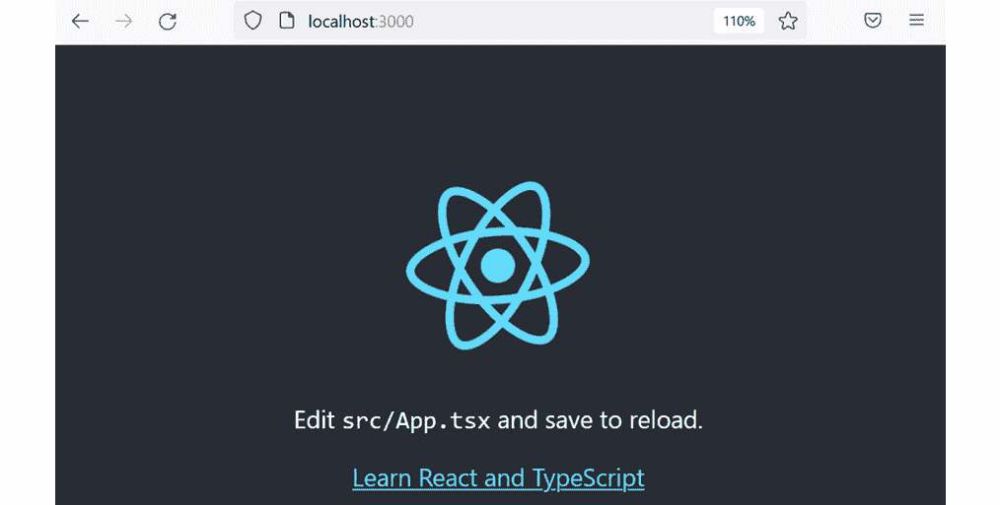

# 3

# 设置 React 和 TypeScript

在本章中，我们将学习如何同时使用 React 和 TypeScript。我们将首先通过使用 webpack 这个工具的步骤来创建一个 React 和 TypeScript 项目。然后我们将创建另一个项目，但这次使用 Create React App 这个工具来展示如何加快创建 React 和 TypeScript 项目的流程。

然后，本章将介绍如何使用 TypeScript 使 React 的 props 和 states 类型安全，扩展第一章节中构建的 alert 组件。最后，我们将学习如何使用 React 的 DevTools 调试你的应用。

本章我们将涵盖以下主题：

+   使用 webpack 创建项目

+   使用 Create React App 创建项目

+   创建 React 和 TypeScript 组件

# 技术要求

我们在本章中将使用以下技术：

+   **Node.js**和**npm**：React 和 TypeScript 依赖于这些。你可以从[`nodejs.org/en/download/`](https://nodejs.org/en/download/)安装它们。

+   **Visual Studio Code**：我们将使用这个编辑器来编写代码和执行终端命令。你可以从[`code.visualstudio.com/`](https://code.visualstudio.com/)安装它。

本章中所有的代码片段都可以在网上找到，链接为[`github.com/PacktPublishing/Learn-React-with-TypeScript-2nd-Edition/tree/main/Chapter3`](https://github.com/PacktPublishing/Learn-React-with-TypeScript-2nd-Edition/tree/main/Chapter3)。

# 使用 webpack 创建项目

设置 React 和 TypeScript 项目是棘手的，因为 JSX 和 TypeScript 代码都需要被转换成 JavaScript。在本节中，我们将逐步介绍如何使用一个名为 webpack 的工具来设置 React 和 TypeScript 项目。

## 介绍 webpack

Webpack 是一个将 JavaScript 源代码文件打包在一起的工具。它还可以打包 CSS 和图片。它可以在扫描文件时运行其他工具，如 Babel，将 React 转换成 JavaScript，以及将 TypeScript 类型检查器。它是一个成熟且在 React 社区中极其流行的工具，许多 React 项目都依赖于它。

Webpack 非常灵活，但不幸的是，它需要大量的配置。当我们使用 webpack 创建我们的项目时，我们将见证这一点。

重要的是要理解 webpack 不是一个项目创建工具。例如，它不会安装 React 或 TypeScript - 我们必须单独做这件事。相反，一旦安装和配置，webpack 会将 React 和 TypeScript 等工具结合起来。因此，我们不会在本节中早期使用 webpack。

## 创建文件夹结构

我们将首先为项目创建一个简单的文件夹结构。这个结构将把项目的配置文件与源代码分开。执行以下步骤来完成这个任务：

1.  打开你想要项目所在的文件夹中的 Visual Studio Code。

1.  在`src`。通过在`src`上右键单击可以创建一个文件夹，其中`src`是源代码的简称。

因此，`src` 文件夹将包含应用的所有源代码。项目配置文件将被放置在项目的根目录中。

接下来，我们将定义关于项目的关键信息。

## 创建 package.json

`package.json` 文件定义了我们的项目名称、描述、npm 脚本、依赖的 npm 模块等等。

在项目的根目录中创建一个 `package.json` 文件，内容如下：

```js
{
  "name": "my-app",
  "description": "My React and TypeScript app",
  "version": "0.0.1"
}
```

这个文件目前包含最少的信息。然而，它最终将包含其他详细信息，例如 React 和 TypeScript 作为应用的依赖项。

注意

更多信息可以在以下链接的 `package.json` 中找到：[`docs.npmjs.com/cli/v8/configuring-npm/package-json`](https://docs.npmjs.com/cli/v8/configuring-npm/package-json)。

接下来，我们将添加将托管 React 应用的网页。

## 添加网页

一个 HTML 页面将托管应用。在 `src` 文件夹中，创建一个名为 `index.html` 的文件，内容如下：

```js
<!DOCTYPE html>
<html>
  <head>
    <meta charset="utf-8" />
    <title>My app</title>
  </head>
  <body>
    <div id="root"></div>
  </body>
</html>
```

这个代码片段可以从以下链接复制并粘贴：[`github.com/PacktPublishing/Learn-React-with-TypeScript-2nd-Edition/blob/main/Chapter3/Section1-Creating-a-project-with-Webpack/src/index.html`](https://github.com/PacktPublishing/Learn-React-with-TypeScript-2nd-Edition/blob/main/Chapter3/Section1-Creating-a-project-with-Webpack/src/index.html)。

React 应用将被注入到具有 `"root"` 属性值的 `div` 元素中。我们将在后面的章节中介绍如何注入 React 应用，即*添加 React*。

## 添加 TypeScript

接下来，我们将安装 TypeScript 到项目中。为此，执行以下步骤：

1.  首先，通过打开 **终端** 菜单并点击 **新建终端** 来打开 Visual Studio Code 终端。

1.  我们从上一章知道，如果不指定任何选项使用 `npm install`，则会安装 `package.json` 内列出的依赖项。`install` 命令有选项用于安装尚未在 `package.json` 中列出的特定包。在终端中执行以下命令来安装 `typescript`：

    ```js
    npm install --save-dev typescript
    ```

我们还包含了一个 `--save-dev` 选项来指定 `typescript` 应该作为一个**仅开发**依赖项安装。这是因为 TypeScript 只在开发期间需要，而不在运行时需要。

1.  命令完成后，打开 `package.json`。您将看到 `typescript` 现在在 `devDependencies` 部分中被列为一个开发依赖项：

    ```js
    {
    ```

    ```js
      "name": "my-app",
    ```

    ```js
      "description": "My React and TypeScript app",
    ```

    ```js
      "version": "0.0.1",
    ```

    ```js
      "devDependencies": {
    ```

    ```js
        "typescript": "⁴.6.4"
    ```

    ```js
      }
    ```

    ```js
    }
    ```

注意，前面代码片段中 `typescript` 的版本（`4.6.4`）可能和您的示例不同。这是因为 `npm install` 会安装依赖项的最新版本，除非在命令中指定了版本。

1.  接下来，我们将创建一个 TypeScript 配置文件。请注意，我们不会配置 TypeScript 进行任何转换编译 – 我们将使用 Babel 来做，这将在后面介绍。因此，TypeScript 配置将专注于类型检查。

要完成这个任务，请在`root`文件夹中创建一个名为`tsconfig.json`的文件，并将以下内容输入到其中：

```js
{
  "compilerOptions": {
    "noEmit": true,
    "lib": [
      "dom",
      "dom.iterable",
      "esnext"
    ],
    "moduleResolution": "node",
    "allowSyntheticDefaultImports": true,
    "esModuleInterop": true,
    "jsx": "react",
    "forceConsistentCasingInFileNames": true,
    "strict": true
  },
  "include": ["src"],
  "exclude": ["node_modules", "dist"]
}
```

此代码片段可以从[`github.com/PacktPublishing/Learn-React-with-TypeScript-2nd-Edition/blob/main/Chapter3/Section1-Creating-a-project-with-Webpack/tsconfig.json`](https://github.com/PacktPublishing/Learn-React-with-TypeScript-2nd-Edition/blob/main/Chapter3/Section1-Creating-a-project-with-Webpack/tsconfig.json)复制和粘贴。

这里是对上一章未解释的每个设置的说明：

+   将`noEmit`设置为`true`可以阻止 TypeScript 编译器进行任何转换。

+   将`allowSyntheticDefaultImports`和`esModuleInterop`设置为`true`允许 React 以默认导入的方式导入，如下所示：

    ```js
    import React from 'react'
    ```

    +   如果不将这些设置设置为`true`，React 将必须像这样导入：

    ```js
    import * as React from 'react'
    ```

+   将`forceConsistentCasingInFileNames`设置为`true`可以启用类型检查过程，检查导入语句中引用的文件名的首字母大小写是否一致。

注意

关于 TypeScript 编译器选项的更多信息，请参阅以下链接：[`www.typescriptlang.org/docs/handbook/compiler-options.html`](https://www.typescriptlang.org/docs/handbook/compiler-options.html)。

## 添加 React

接下来，我们将安装 React 及其 TypeScript 类型到项目中。然后我们将添加一个 React 根组件。为此，执行以下步骤：

1.  在终端中执行以下命令以安装 React：

    ```js
    npm install react react-dom
    ```

React 有两个库：

+   核心库被称为`react`，它被用于所有版本的 React。

+   特定的 React 变体，用于构建 Web 应用的变体，称为`react-dom`。另一个变体的例子是用于构建移动应用的 React Native 变体。

1.  React 不包含 TypeScript 类型——相反，它们在单独的 npm 包中。现在让我们安装这些包：

    ```js
    npm install --save-dev @types/react @types/react-dom
    ```

1.  根组件将位于`src`文件夹中的名为`index.tsx`的文件中。创建此文件并包含以下内容：

    ```js
    import React, { StrictMode } from 'react';
    ```

    ```js
    import { createRoot } from 'react-dom/client';
    ```

    ```js
    const root = createRoot(
    ```

    ```js
      document.getElementById('root') as HTMLElement
    ```

    ```js
    );
    ```

    ```js
    function App() {
    ```

    ```js
      return <h1>My React and TypeScript App!</h1>;
    ```

    ```js
    }
    ```

    ```js
    root.render(
    ```

    ```js
      <StrictMode>
    ```

    ```js
        <App />
    ```

    ```js
      </StrictMode>
    ```

    ```js
    );
    ```

此代码片段可以从[`github.com/PacktPublishing/Learn-React-with-TypeScript-2nd-Edition/blob/main/Chapter3/Section1-Creating-a-project-with-Webpack/src/index.tsx`](https://github.com/PacktPublishing/Learn-React-with-TypeScript-2nd-Edition/blob/main/Chapter3/Section1-Creating-a-project-with-Webpack/src/index.tsx)复制和粘贴。

该文件的结构与第一章中警报组件项目中的`index.js`文件类似。它将 React 应用注入到具有`id`为`'root'`的 DOM 元素中。应用很简单——它显示一个名为**My React and** **TypeScript App!**的标题。

注意，`index`文件的扩展名是`.tsx`而不是`.js`。这允许 Babel 和 TypeScript 在转换和类型检查过程中检测包含 JSX 的 TypeScript 文件。对于不包含任何 JSX 的 TypeScript 代码，可以使用`.ts`扩展名。

此外，请注意`createRoot`调用中的`as HTMLElement`：

```js
const root = createRoot(
  document.getElementById('root') as HTMLElement
);
```

这被称为`HTMLElement | null`，因为`document.getElementById`可能找不到元素并返回`null`。然而，我们确信元素会被找到，因为我们已经在`index.html`文件中指定了它，所以使用类型断言将类型缩小到`HTMLElement`是安全的。

React 现在已安装到项目中，项目还包含一个简单的 React 应用。

## 添加 Babel

如前所述，Babel 将在这个项目中将 React 和 TypeScript 代码转换为 JavaScript。执行以下步骤以安装和配置 Babel：

1.  首先，在 Visual Studio Code 的终端中使用以下命令安装核心 Babel 库：

    ```js
    npm install --save-dev @babel/core
    ```

Babel 作为开发依赖项安装，因为它仅在开发期间需要将代码转换为 JavaScript，而不是在应用运行时。

此命令的简短版本如下：

```js
npm i -D @babel/core
```

`i`代表`install`，`-D`代表`--save-dev`。

1.  接下来，安装一个名为`@babel/preset-env`的 Babel 插件，它允许使用最新的 JavaScript 功能：

    ```js
    npm i -D @babel/preset-env
    ```

1.  现在，安装一个名为`@babel/preset-react`的 Babel 插件，它可以将 React 代码转换为 JavaScript：

    ```js
    npm i -D @babel/preset-react
    ```

1.  类似地，安装一个名为`@babel/preset-typescript`的 Babel 插件，它可以将 TypeScript 代码转换为 JavaScript：

    ```js
    npm i -D @babel/preset-typescript
    ```

1.  最后两个要安装的插件允许在 JavaScript 中使用 async 和 await 功能：

    ```js
    npm i -D @babel/plugin-transform-runtime @babel/runtime
    ```

1.  Babel 可以在一个名为`.babelrc.json`的文件中进行配置。在项目的根目录下创建此文件，并包含以下内容：

    ```js
    {
    ```

    ```js
      "presets": [
    ```

    ```js
        "@babel/preset-env",
    ```

    ```js
        "@babel/preset-react",
    ```

    ```js
        "@babel/preset-typescript"
    ```

    ```js
      ],
    ```

    ```js
      "plugins": [
    ```

    ```js
        [
    ```

    ```js
          "@babel/plugin-transform-runtime",
    ```

    ```js
          {
    ```

    ```js
            "regenerator": true
    ```

    ```js
          }
    ```

    ```js
        ]
    ```

    ```js
      ]
    ```

    ```js
    }
    ```

此代码片段可以在[`github.com/PacktPublishing/Learn-React-with-TypeScript-2nd-Edition/blob/main/Chapter3/Section1-Creating-a-project-with-Webpack/.babelrc.json`](https://github.com/PacktPublishing/Learn-React-with-TypeScript-2nd-Edition/blob/main/Chapter3/Section1-Creating-a-project-with-Webpack/.babelrc.json)找到。

上述配置告诉 Babel 使用已安装的插件。Babel 现在已安装并配置。

注意

更多关于 Babel 的信息，请参阅以下链接：[`babeljs.io/`](https://babeljs.io/)。

接下来，我们将使用 webpack 将所有内容粘合在一起。

## 添加 webpack

Webpack 是一个流行的工具，主要用于将 JavaScript 源代码文件捆绑在一起。它在扫描文件时可以运行其他工具，如 Babel。因此，我们将使用 webpack 扫描所有源文件并将它们转换为 JavaScript。Webpack 处理过程的输出将是一个在`index.html`中引用的单个 JavaScript 包。

### 安装 webpack

执行以下步骤以安装 webpack 及其相关库：

1.  首先，在 Visual Studio Code 的终端中使用以下命令安装 webpack：

    ```js
    npm i -D webpack webpack-cli
    ```

这将安装核心 webpack 库以及其命令行界面。

Webpack 在`webpack`包中包含 TypeScript 类型，因此我们不需要单独安装它们。

1.  接下来，运行以下命令以安装 webpack 的开发服务器：

    ```js
    npm i -D webpack-dev-server
    ```

在开发过程中，Webpack 的开发服务器用于托管 Web 应用程序，并在代码更改时自动更新。

1.  需要一个 Webpack 插件来允许 Babel 将 React 和 TypeScript 代码转换为 JavaScript。这个插件被称为 `babel-loader`。使用以下命令安装它：

    ```js
    npm i -D babel-loader
    ```

1.  Webpack 可以创建一个 `index.html` 文件来托管 React 应用程序。我们希望 Webpack 使用 `src` 文件夹中的 `index.html` 文件作为模板，并将 React 应用的包添加到其中。一个名为 `html-webpack-plugin` 的插件可以完成这项工作。使用以下命令安装此插件：

    ```js
    npm i -D html-webpack-plugin
    ```

Webpack 及其相关库现在已安装。

### 配置 Webpack

接下来，我们将配置 Webpack 以完成我们所需的一切。可以创建开发和生产的不同配置，因为它们的要求略有不同。然而，在本章中，我们将专注于开发配置。执行以下步骤以配置 Webpack：

1.  首先，安装一个名为 `ts-node` 的库，它允许在 TypeScript 文件中定义配置：

    ```js
    npm i -D ts-node
    ```

1.  现在，我们可以添加开发配置文件。在项目根目录下创建一个名为 `webpack.dev.config.ts` 的文件。这个文件中的代码很长，可以从以下链接复制粘贴：[`github.com/PacktPublishing/Learn-React-with-TypeScript-2nd-Edition/blob/main/Chapter3/Section1-Creating-a-project-with-Webpack/webpack.dev.config.ts`](https://github.com/PacktPublishing/Learn-React-with-TypeScript-2nd-Edition/blob/main/Chapter3/Section1-Creating-a-project-with-Webpack/webpack.dev.config.ts)。在接下来的步骤中，我们将解释这个文件的不同部分。

1.  配置文件以各种导入语句和一个配置对象类型开始：

    ```js
    import path from 'path';
    ```

    ```js
    import HtmlWebpackPlugin from 'html-webpack-plugin';
    ```

    ```js
    import {
    ```

    ```js
      Configuration as WebpackConfig,
    ```

    ```js
      HotModuleReplacementPlugin,
    ```

    ```js
    } from 'webpack';
    ```

    ```js
    import {
    ```

    ```js
      Configuration as WebpackDevServerConfig
    ```

    ```js
    } from 'webpack-dev-server';
    ```

    ```js
    type Configuration = WebpackConfig & {
    ```

    ```js
      devServer?: WebpackDevServerConfig;
    ```

    ```js
    }
    ```

让我们回顾以下最重要的几点：

+   `path` 节点库将告诉 Webpack 将包放置在哪里。

+   `HtmlWebpackPlugin` 将被用来创建 `index.html`。

+   Webpack 的配置 TypeScript 类型来自 `webpack` 和 `webpack-dev-server` 包。因此，我们使用交集类型将它们结合起来，创建了一个名为 `Configuration` 的类型。

1.  然后配置对象定义如下：

    ```js
    const config: Configuration = {
    ```

    ```js
      mode: 'development',
    ```

    ```js
      output: {
    ```

    ```js
        publicPath: '/',
    ```

    ```js
      },
    ```

    ```js
      entry: './src/index.tsx',
    ```

    ```js
      ...
    ```

    ```js
    };
    ```

    ```js
    export default config;
    ```

让我们回顾以下最重要的几点：

+   `mode` 属性告诉 Webpack 配置是用于开发的，这意味着 React 开发工具将包含在包中。

+   `output.publicPath` 属性是应用中的根路径，这对于在开发服务器中正确实现深度链接非常重要。

+   `entry` 属性告诉 Webpack React 应用程序的入口点在哪里，在我们的项目中是 `index.tsx`。

+   Webpack 期望配置对象是一个默认导出，因此我们将 `config` 对象作为默认导出。

1.  以下代码突出了进一步的配置：

    ```js
    const config: Configuration = {
    ```

    ```js
      ...,
    ```

    ```js
      module: {
    ```

    ```js
        rules: [
    ```

    ```js
          {
    ```

    ```js
            test: /\.(ts|js)x?$/i,
    ```

    ```js
            exclude: /node_modules/,
    ```

    ```js
            use: {
    ```

    ```js
              loader: 'babel-loader',
    ```

    ```js
              options: {
    ```

    ```js
                presets: ['@babel/preset-env', '@babel/              preset-react', '@babel/preset-typescript'],
    ```

    ```js
              },
    ```

    ```js
            },
    ```

    ```js
          },
    ```

    ```js
        ],
    ```

    ```js
      },
    ```

    ```js
      resolve: {
    ```

    ```js
        extensions: ['.tsx', '.ts', '.js'],
    ```

    ```js
      }
    ```

    ```js
    };
    ```

`module`属性通知 webpack 如何处理不同的模块。我们需要告诉 webpack 对于具有`.js`、`.ts`和`.tsx`扩展名的文件使用`babel-loader`。

`resolve.extensions`属性告诉 webpack 在模块解析期间查找 TypeScript 文件和 JavaScript 文件。

1.  接下来，定义了几个插件：

    ```js
    const config: Configuration = {
    ```

    ```js
      ...,
    ```

    ```js
      plugins: [
    ```

    ```js
        new HtmlWebpackPlugin({
    ```

    ```js
          template: 'src/index.html',
    ```

    ```js
        }),
    ```

    ```js
        new HotModuleReplacementPlugin(),
    ```

    ```js
      ]
    ```

    ```js
    };
    ```

如前所述，`HtmlWebpackPlugin`创建 HTML 文件。它已被配置为使用`src`文件夹中的`index.html`作为模板。

`HotModuleReplacementPlugin`允许在应用运行时更新模块，而无需完全重新加载。

1.  最后，以下属性完成了配置：

    ```js
    const config: Configuration = {
    ```

    ```js
      ...,
    ```

    ```js
      devtool: 'inline-source-map',
    ```

    ```js
      devServer: {
    ```

    ```js
        static: path.join(__dirname, 'dist'),
    ```

    ```js
        historyApiFallback: true,
    ```

    ```js
        port: 4000,
    ```

    ```js
        open: true,
    ```

    ```js
        hot: true,
    ```

    ```js
      }
    ```

    ```js
    };
    ```

`devtool`属性告诉 webpack 使用完整的内联源映射，这允许在转译之前调试原始源代码。

`devServer`属性配置 webpack 开发服务器。它配置了 Web 服务器根目录为`dist`文件夹，并在端口`4000`上提供文件。现在，`historyApiFallback`对于深度链接是必需的，并且我们还指定了在服务器启动后打开浏览器。

开发配置现在已经完成。但在我们尝试以开发模式运行应用之前，我们需要创建一个 npm 脚本来运行 webpack。

1.  首先，打开`package.json`并添加一个包含`start`脚本的`scripts`部分：

    ```js
    {
    ```

    ```js
      ...,
    ```

    ```js
      "scripts": {
    ```

    ```js
        "start": "webpack serve --config webpack.dev.config.      ts"
    ```

    ```js
      }
    ```

    ```js
    }
    ```

1.  现在，我们可以在终端运行以下命令以开发模式运行应用：

    ```js
    npm run start
    ```

`npm run`命令在`package.json`的`scripts`部分执行一个脚本。`start`脚本通常用于以开发模式运行程序。它如此常见，以至于 npm 不需要`run`部分就能识别。因此，命令可以缩短为以下形式：

```js
npm start
```

几秒钟后，应用在默认浏览器中打开：


图 3.1 – 开发模式下在浏览器中运行的应用

1.  保持应用运行并打开`index.tsx`文件。将`h1`元素的内容更改为略有不同：

    ```js
    function App() {
    ```

    ```js
      return <h1>My Super React and TypeScript App!</h1>;
    ```

    ```js
    }
    ```

当文件被保存时，请注意正在运行的应用会自动刷新：


图 3.2 – 应用自动刷新

这就完成了使用 webpack 设置 React 和 TypeScript 项目的配置。以下是设置的关键点回顾：

+   需要一个 HTML 文件来托管 React 应用

+   Webpack 在 Babel 的帮助下将应用的 React 和 TypeScript 代码转译成 JavaScript，然后在 HTML 文件中引用它

+   Webpack 有一个开发服务器，它会自动在我们编写代码时刷新应用

注意

更多关于 webpack 的信息可在以下链接找到：[`webpack.js.org/`](https://webpack.js.org/)。

设置 React 和 TypeScript 应用程序需要做大量的工作，而且它只能完成我们将要构建的实际应用程序的一小部分。例如，不能使用 CSS，并且设置不支持单元测试。幸运的是，有一个更简单的方法来创建 React 和 TypeScript 项目，我们将在下一节中学习。不过，在本节中学到的内容非常重要，因为我们即将使用的工具在底层也使用了 webpack。

# 使用 Create React App 创建项目

Create React App 是创建 React 项目的流行工具。它基于 webpack，因此上一节的知识将帮助您了解 Create React App 的工作原理。在本节中，我们将使用 Create React App 创建一个 React 和 TypeScript 项目。

## 使用 Create React App

与上一节的设置不同，Create React App 会生成一个包含我们可能需要的所有常用工具的 React 和 TypeScript 项目，包括 CSS 和单元测试支持。

要使用 Create React App，请在您选择的空白文件夹中打开 Visual Studio Code 并运行以下命令：

```js
npx create-react-app myapp --template typescript
```

`npx` 允许 npm 包临时安装和运行。这是运行项目脚手架工具（如 Create React App）的常用方法。

`create-react-app` 是用于创建项目的 Create React App 工具的包。我们已传递了应用程序名称 `myapp`。我们还指定了应使用 `typescript` 模板来创建项目。

创建项目需要花费大约一分钟的时间，但这比手动使用 webpack 创建要快得多！

当命令完成创建项目后，请在 Visual Studio Code 中重新打开位于 `myapp` 文件夹中的项目。请注意，如果您将应用程序命名为其他名称，您的目录可能会有所不同。在应用程序名称文件夹中非常重要；否则，依赖项可能会安装在不正确的位置。

接下来，我们将了解 linting 是什么，并将其扩展程序添加到 Visual Studio Code 中。

## 将 linting 添加到 Visual Studio Code

**Linting** 是检查代码中潜在问题的过程。在代码编写过程中，使用 linting 工具来捕捉问题是一种常见的做法。**ESLint** 是一个流行的工具，可以 lint React 和 TypeScript 代码。幸运的是，Create React App 已经在我们的项目中安装并配置了 ESLint。

例如 Visual Studio Code 这样的编辑器可以与 ESLint 集成，以突出显示潜在问题。按照以下步骤将 ESLint 扩展程序安装到 Visual Studio Code 中：

1.  在 Visual Studio Code 中打开 **扩展** 区域。在 Windows 的 **文件** 菜单中的 **首选项** 菜单，或者在 Mac 的 **代码** 菜单中的 **首选项** 菜单中都可以找到 **扩展** 选项。

1.  在左侧将出现一个扩展列表，并且可以在扩展列表上方的搜索框中搜索特定扩展。在扩展列表搜索框中输入 `eslint`。


图 3.3 – Visual Studio Code ESLint 扩展

应该出现在列表顶部的由微软开发的扩展 ESLint。

1.  点击 **安装** 按钮安装扩展。

1.  现在，我们需要确保 ESLint 扩展已配置为检查 React 和 TypeScript。因此，在 Visual Studio Code 中打开 **设置** 区域。在 Windows 的 **文件** 菜单中的 **首选项** 菜单或 Mac 上的 **代码** 菜单中的 **首选项** 菜单中找到 **设置** 选项。

1.  在设置搜索框中，输入 `eslint: probe` 并选择 **工作区** 选项卡：


图 3.4 – Visual Studio Code ESLint 探针设置

此设置定义了 ESLint 检查代码时使用的语言。

1.  确保列表中包含 **typescript** 和 **typescriptreact**。如果没有，请使用 **添加** **项目** 按钮添加它们。

Visual Studio Code 的 ESLint 扩展现在已在项目中安装和配置。

注意

有关 ESLint 的更多信息，请参阅以下链接：[`eslint.org/`](https://eslint.org/)。

接下来，我们将向项目中添加自动代码格式化。

## 添加代码格式化

下一个我们将自动设置的工具有助于格式化代码。自动代码格式化确保代码格式一致，这有助于提高可读性。拥有格式一致的代码也有助于开发者在代码审查中看到重要的更改——而不是格式上的差异。

**Prettier** 是一个流行的工具，能够格式化 React 和 TypeScript 代码。不幸的是，Create React App 不会为我们安装和配置它。请按照以下步骤在项目中安装和配置 Prettier：

1.  使用以下命令在 Visual Studio Code 的终端中安装 Prettier：

    ```js
    npm i -D prettier
    ```

Prettier 作为开发依赖项安装，因为它仅在开发时间使用，而不在运行时使用。

1.  Prettier 与 ESLint 有重叠的样式规则，因此安装以下两个库以允许 Prettier 从 ESLint 负责样式规则：

    ```js
    npm i -D eslint-config-prettier eslint-plugin-prettier
    ```

`eslint-config-prettier` 禁用冲突的 ESLint 规则，而 `eslint-plugin-prettier` 是一个使用 Prettier 格式化代码的 ESLint 规则。

1.  需要更新 ESLint 配置以允许 Prettier 管理样式规则。Create React App 允许在 `package.json` 中的 `eslintConfig` 部分覆盖 ESLint 配置。如下所示，将 Prettier 规则添加到 `package.json` 中的 `eslintConfig` 部分：

    ```js
    {
    ```

    ```js
      ...,
    ```

    ```js
      "eslintConfig": {
    ```

    ```js
        "extends": [
    ```

    ```js
          "react-app",
    ```

    ```js
          "react-app/jest",
    ```

    ```js
          "plugin:prettier/recommended"
    ```

    ```js
        ]
    ```

    ```js
      },
    ```

    ```js
      ...
    ```

    ```js
    }
    ```

1.  可以在名为 `.prettierrc.json` 的文件中配置 Prettier。在根目录中创建此文件，并包含以下内容：

    ```js
    {
    ```

    ```js
      "printWidth": 100,
    ```

    ```js
      "singleQuote": true,
    ```

    ```js
      "semi": true,
    ```

    ```js
      "tabWidth": 2,
    ```

    ```js
      "trailingComma": "all",
    ```

    ```js
      "endOfLine": "auto"
    ```

    ```js
    }
    ```

我们指定了以下内容：

+   行在 100 个字符处换行

+   字符串限定符是单引号

+   分号放置在语句的末尾

+   缩进级别为两个空格

+   在多行数组和对象的末尾添加尾随逗号

+   保持现有的行结束符

注意

更多有关配置选项的信息可以在以下链接中找到：[`prettier.io/docs/en/options.html`](https://prettier.io/docs/en/options.html)。

Prettier 现已安装并配置到项目中。

Visual Studio Code 可以与 Prettier 集成，在保存源文件时自动格式化代码。因此，让我们将 Prettier 扩展安装到 Visual Studio Code 中：

1.  在扩展列表的搜索框中打开 `prettier`。一个名为 **Prettier – 代码格式化器** 的扩展应该出现在列表的顶部：


图 3.5 – Visual Studio Code Prettier 扩展

1.  点击 **安装** 按钮来安装扩展。

1.  接下来，在 Visual Studio Code 中打开 **设置** 区域。选择 **工作区** 选项卡并确保 **保存时格式化** 选项被勾选：


图 3.6 – Visual Studio Code “保存时格式化”设置

此设置告诉 Visual Studio Code 在保存文件时自动格式化代码。

1.  需要设置另一个设置。这是 Visual Studio Code 应用于格式化代码的默认格式化器。点击 **工作区** 选项卡并确保 **默认格式化器** 设置为 **Prettier -** **代码格式化器**：


图 3.7 – 将默认格式化器设置为 Prettier - 代码格式化器

Visual Studio Code 的 Prettier 扩展现在已安装并配置到项目中。接下来，我们将以开发模式运行应用程序。

## 以开发模式启动应用程序

执行以下步骤以以开发模式启动应用程序：

1.  Create React App 已经创建了一个名为 `start` 的 npm 脚本，该脚本以开发模式运行应用程序。在终端中运行此脚本如下：

    ```js
    npm start
    ```

几秒钟后，应用程序将出现在默认浏览器中：


图 3.8 – 以开发模式运行的 React 应用程序

如果您的应用程序报告了 Prettier 格式化问题，请打开相关的文件并保存。这将正确格式化文件并解决错误。

1.  打开 `App.tsx` 并将 **学习 React** 链接更改为 **学习 React** **和 TypeScript**：

    ```js
    <a
    ```

    ```js
      className="App-link"
    ```

    ```js
      href="https://reactjs.org"
    ```

    ```js
      target="_blank"
    ```

    ```js
      rel="noopener noreferrer"
    ```

    ```js
    >
    ```

    ```js
      Learn React and TypeScript
    ```

    ```js
    </a>;
    ```

保存文件后，运行中的应用程序将自动刷新以更新链接文本：



图 3.9 – 更新的 React 应用程序

1.  在 `App.tsx` 中的代码进行实验。添加一个已使用的变量并在 JSX 元素中传递一个无效的属性：

    ```js
    function App() {
    ```

    ```js
      const unused = 'something';
    ```

    ```js
      return (
    ```

    ```js
        <div className="App" invalidProp="something">
    ```

    ```js
          ...
    ```

    ```js
        </div>
    ```

    ```js
      );
    ```

    ```js
    }
    ```

如预期，问题被捕获并在 Visual Studio Code 中报告。问题也在浏览器中报告。


图 3.10 – Visual Studio Code 捕获的问题

1.  在继续之前，删除无效代码并停止应用程序运行。停止应用程序的快捷键是 *Ctrl* + *C*。

我们已经看到了 Create React App 如何提供高效的开发体验。接下来，我们将生成生产构建。

## 生成生产构建

按照以下步骤生成可以部署到生产环境的应用程序构建：

1.  Create React App 已经创建了一个名为 `build` 的 npm 脚本，用于生成部署到生产所需的所有工件。在终端中按照以下方式运行此脚本：

    ```js
    npm run build
    ```

几秒钟后，部署工件将放置在 `build` 文件夹中。

1.  打开 `build` 文件夹 – 它包含许多文件。根文件是 `index.html`，它引用了其他 JavaScript、CSS 和图像文件。所有文件都经过优化，用于生产，已移除空白并压缩 JavaScript。

这完成了生产构建和用 Create React App 设置的 React 和 TypeScript 项目的设置。以下是设置的关键点回顾：

+   `npx` 工具可以执行 Create React App 库，指定 `typescript` 模板以创建一个 React 和 TypeScript 项目。

+   Create React App 设置了许多有用的项目功能，例如代码检查、CSS 支持、SVG 支持。

+   Create React App 还设置了 npm 脚本来在开发模式下运行应用程序并生成生产构建。

+   Create React App 没有设置的一个功能是自动代码格式化。然而，Prettier 可以手动安装和配置以提供此功能。

请保持此项目安全，因为我们将在下一节继续使用它。

接下来，我们将学习如何创建一个使用 TypeScript 进行类型检查的 React 组件。

# 创建 React 和 TypeScript 组件

在 *第一章**，介绍 React* 中，我们使用 React 创建了一个警告组件。在本节中，我们将使用 TypeScript 使组件具有强类型，并体验其带来的好处。我们首先为警告组件的属性添加一个类型，然后尝试为其状态定义一个类型。完成警告组件后，我们将使用 React 的 DevTools 检查该组件。

## 添加属性类型

我们将继续使用上一节中用 Create React App 创建的 React 和 TypeScript 项目。按照以下步骤添加具有强类型的警告组件：

1.  如果项目尚未打开，请打开 Visual Studio Code 中的项目。确保您在应用程序名称文件夹中打开项目，以便 `package.json` 位于根目录。

1.  在 `src` 文件夹中创建一个名为 `Alert.tsx` 的新文件。粘贴警告组件的 JavaScript 版本，该版本可在 GitHub 上找到：[`github.com/PacktPublishing/Learn-React-with-TypeScript-2nd-Edition/blob/main/Chapter1/Section7-Using-events/Alert.js`](https://github.com/PacktPublishing/Learn-React-with-TypeScript-2nd-Edition/blob/main/Chapter1/Section7-Using-events/Alert.js)。

注意，某些属性上报告了类型错误，因为它们只能推断为具有 `any` 类型。

1.  在组件上方添加以下类型。这将成为组件属性的类型：

    ```js
    type Props = {
    ```

    ```js
      type?: string;
    ```

    ```js
      heading: string;
    ```

    ```js
      children: React.ReactNode;
    ```

    ```js
      closable?: boolean;
    ```

    ```js
      onClose?: () => void;
    ```

    ```js
    };
    ```

`heading` 和 `children` 属性是必需的，但其余属性是可选的。

`children` 属性被赋予了一个特殊类型，称为 `React.ReactNode`。这允许它接受 JSX 元素以及字符串。

类型名称可以是任何名称，但通常将其称为 `Props`。

记住从 *第二章** “创建接口”部分，在 *介绍 TypeScript* 中，接口语法可以用作创建类型的替代方案，而不是类型别名。`Props` 类型的接口版本如下：

```js
interface Props {
  type?: string;
  heading: string;
  children: React.ReactNode;
  closable?: boolean;
  onClose?: () => void;
}
```

如上章所述，选择类型别名或接口作为组件属性的类型主要取决于个人喜好。

1.  现在，在解构参数之后将 `Props` 类型分配给警报组件：

    ```js
    export function Alert({
    ```

    ```js
      type = "information",
    ```

    ```js
      heading,
    ```

    ```js
      children,
    ```

    ```js
      closable,
    ```

    ```js
      onClose,
    ```

    ```js
    }: Props) {
    ```

    ```js
      ...
    ```

    ```js
    }
    ```

警报属性现在具有强类型。

1.  打开 `App.tsx` 并将标题元素替换为警报组件。在使用 JSX 之前，不要忘记导入警报组件。不要向 `Alert` 传递任何属性以测试类型检查：

    ```js
    import React from 'react';
    ```

    ```js
    import './App.css';
    ```

    ```js
    import { Alert } from './Alert';
    ```

    ```js
    function App() {
    ```

    ```js
      return (
    ```

    ```js
        <div className="App">
    ```

    ```js
          <Alert />
    ```

    ```js
        </div>
    ```

    ```js
      );
    ```

    ```js
    }
    ```

    ```js
    export default App;
    ```

如预期的那样，在 `Alert` 上引发了类型错误：


图 3.11 – 警报组件上的类型错误

1.  向 `Alert` 传递一个 `header` 属性并给它一些内容：

    ```js
    <Alert heading="Success">Everything is really good!</Alert>
    ```

类型错误将消失。

1.  如果尚未运行，请以开发模式启动应用程序（`npm start`）。之后，应用程序组件将按预期出现在页面上。

接下来，我们将学习如何显式地为 React 组件状态赋予类型。

## 添加状态类型

按照以下步骤在警报组件中实验 `visible` 状态类型：

1.  打开 `Alert.tsx` 并将鼠标悬停在 `visible` 状态变量上以确定其推断类型。它已被推断为 `boolean` 类型，因为它被初始化为 `true` 值。`boolean` 类型正是我们想要的类型。

1.  作为实验，移除传递给 `useState` 的初始值 `true`。然后，再次将鼠标悬停在 `visible` 状态变量上。它已被推断为 `undefined` 类型，因为没有传递默认值到 `useState`。这显然不是我们想要的类型。

1.  有时，`useState` 类型没有被推断为我们想要的类型，就像在上一个步骤中那样。在这些情况下，可以使用 `useState` 显式地定义状态类型。通过添加以下泛型参数显式地为 `visible` 状态赋予 `boolean` 类型：

    ```js
    const [visible, setVisible] = useState<boolean>();
    ```

注意

泛型参数就像一个常规函数参数，但为函数定义了一个类型。泛型参数在函数名称之后使用尖括号指定。

1.  将 `useState` 声明恢复到其原始状态，将其初始化为 `true` 并不指定显式类型：

    ```js
    const [visible, setVisible] = useState(true);
    ```

1.  通过按 *Ctrl* + *C* 停止应用程序运行。

总结来说，始终检查从 `useState` 推断的状态类型，如果推断的类型不是所需的类型，则使用其泛型参数显式定义类型。

接下来，我们将学习如何使用 React 浏览器开发工具。

## 使用 React DevTools

React DevTools 是适用于 Chrome 和 Firefox 的浏览器扩展。这些工具允许检查和调试 React 应用程序。扩展程序的链接如下：

+   Chrome: [`chrome.google.com/webstore/detail/react-developer-tools/fmkadmapgofadopljbjfkapdkoienihi/`](https://chrome.google.com/webstore/detail/react-developer-tools/fmkadmapgofadopljbjfkapdkoienihi/)

+   Firefox: [`addons.mozilla.org/en-GB/firefox/addon/react-devtools/`](https://addons.mozilla.org/en-GB/firefox/addon/react-devtools/)

要安装扩展，点击 **添加到 Chrome** 或 **添加到 Firefox** 按钮。您需要重新打开浏览器才能使用这些工具。

执行以下步骤以探索工具：

1.  在 Visual Studio Code 中，通过在终端中运行 `npm start` 以开发模式启动应用程序。几秒钟后，应用程序将在浏览器中显示。

1.  通过按 *F12* 打开浏览器开发工具。React DevTools 添加了两个面板，分别称为 **组件** 和 **分析器**。

1.  首先，我们将探索 **组件** 面板，因此选择此面板：


图 3.12 – React DevTools 组件面板

React 组件树出现在左侧。选择一个 React 组件将显示右侧的当前属性和状态值。

1.  注意，状态没有命名——它有一个通用的名称，**状态**。点击 **hooks** 部分右侧的魔杖图标。

状态的名称现在出现在括号中：


图 3.13 – 点击魔杖后的状态变量名

1.  在 Visual Studio Code 中，打开 `App.tsx` 并将 `closable` 属性传递给 `Alert`：

    ```js
    <Alert heading="Success" closable>
    ```

    ```js
      Everything is really good!
    ```

    ```js
    </Alert>
    ```

应用程序刷新，关闭按钮出现。

1.  点击关闭按钮，注意在 DevTools 中 `visible` 状态变为 `false`。

**组件** 面板在调试大型组件树时非常有用，可以快速了解属性和状态值。

1.  刷新浏览器，以便警报再次出现。在 React DevTools 的 **组件** 面板中，通过点击齿轮图标打开设置。在 **常规** 部分中，如果尚未勾选，请勾选 **组件渲染时高亮更新** 选项。


图 3.14 – 重新渲染高亮选项

此选项将在组件重新渲染时高亮显示。

1.  在尝试重新渲染高亮之前，打开 `Alert.tsx` 并将其更新为渲染 `visible` 状态为 `false`：

    ```js
    if (!visible) {
    ```

    ```js
      return <div>Gone!</div>;
    ```

    ```js
    }
    ```

在此更改之前，重新渲染高亮没有元素可以高亮。

1.  现在，点击浏览器中警报的关闭按钮。重新渲染的警报组件将以绿色边框突出显示：


图 3.15 – 重新渲染高亮

这完成了我们对 **组件** 面板的探索。按 *F5* 刷新浏览器，以便在继续之前警报组件再次出现。

1.  现在，我们将探索 **Profiler** 面板，因此请选择此面板。此工具允许对交互进行性能分析，这对于跟踪性能问题很有用。

1.  点击 **开始分析** 选项，即蓝色圆形图标。

1.  点击警报中的关闭按钮。

1.  点击 **停止分析** 选项，即红色圆形图标。将出现所有组件重新渲染的时间线：


图 3.16 – React DevTools 组件

这表明在点击关闭按钮时，`Alert` 被重新渲染，耗时 0.7 毫秒。

该工具有助于快速识别特定用户交互中的慢速组件。

1.  这完成了我们对 React DevTools 的探索。撤销我们对 `Alert` 组件所做的更改，以便它在不可见时再次渲染 `null`：

    ```js
    if (!visible) {
    ```

    ```js
      return null;
    ```

    ```js
    }
    ```

这完成了本节的内容。以下是一个回顾：

+   可以向组件 props 添加类型以使它们具有类型安全性

+   状态可以从其初始值推断出来，但可以使用 `useState` 上的泛型参数显式定义

+   React DevTools 可以安装在浏览器中，以检查运行中的应用程序中的组件树并帮助追踪性能问题

这就结束了本章的内容。

# 摘要

我们以使用 webpack 和 Babel 创建 React 和 TypeScript 项目开始本章。涉及了许多步骤，而我们只设置了我们实际项目所需的一小部分。例如，我们尚未设置生成用于生产的优化包的能力。

我们继续使用 Create React App 创建 React 和 TypeScript 项目。我们看到了这种方法是如何以更快、更彻底的方式创建项目。然后，我们使用了 ESLint 进行代码检查和 Prettier 进行自动代码格式化。通过这次练习，我们现在理解了 TypeScript、ESLint 和 Prettier 如何一起使用来创建高质量的 React 和 TypeScript 项目环境。

在最后一节中，我们学习了如何使用强类型属性和状态创建 React 组件。我们体验了这种方式如何帮助我们快速发现问题。我们还使用了 React 的 DevTools，它允许检查 React 组件树并分析性能。

在下一章中，我们将学习 React 的常见 hooks。

# 问题

以下问题将检查你在本章中学到的内容：

1.  在以下没有类型注解的组件中，`name` prop 将具有什么类型？

    ```js
    export function Name({ name }) {
    ```

    ```js
      return <span>{name}</span>;
    ```

    ```js
    }
    ```

1.  在下面的 `useState` 语句中，`firstName` 状态将具有什么类型？

    ```js
    const [firstName, setFirstName] = useState("");
    ```

1.  `ContactDetails` 组件的 props 具有以下类型：

    ```js
    type Props = {
    ```

    ```js
      firstName?: string;
    ```

    ```js
      email: string;
    ```

    ```js
    };
    ```

    ```js
    export function ContactDetails({ firstName, email }: Props) {
    ```

    ```js
      ...
    ```

    ```js
    }
    ```

前一个组件在另一个组件的 JSX 中如下引用：

```js
<ContactDetails email="fred@somewhere.com" />
```

是否会引发类型错误？

1.  `status` 状态变量可以存储 `"Good"` 和 `"Bad"` 的值，初始值为 `"Good"`。它在以下代码中定义：

    ```js
    const [status, setStatus] = useState("Good");
    ```

给 `status` 分配的类型是什么？如何将其类型缩小到只有 `"Good"` 或 `"Bad"`？

1.  `FruitList` 组件接收一个水果名称数组并在列表中显示它们。它在另一个组件的 JSX 中如下引用：

    ```js
    <FruitList fruits={["Banana", "Apple", "Strawberry"]} />;
    ```

你会为 `FruitList` 组件定义什么类型？

1.  一个可以存储 `null` 或电子邮件地址的 `email` 状态变量，初始值为 `null`。你将如何使用 `useState` 钩子定义此状态？

1.  以下组件允许用户同意：

    ```js
    export function Agree({ onAgree }: Props) {
    ```

    ```js
      return (
    ```

    ```js
        <button onClick={() => onAgree()}>
    ```

    ```js
          Click to agree
    ```

    ```js
        </button>
    ```

    ```js
      );
    ```

    ```js
    }
    ```

你会定义什么作为 `Props` 的类型定义？

# 答案

这里是前一个部分问题的答案。

1.  `name` 属性将具有 `any` 类型。

1.  `firstName` 状态将被赋予 `string` 类型，因为 `string` 将从初始值 `""` 推断出来。

1.  即使没有传递 `firstName`，也不会引发类型错误，因为它被定义为可选的。

1.  `status` 的推断类型是 `string`。可以使用泛型类型参数显式地为状态定义类型，如下所示：

    ```js
    const [status, setStatus] = useState<'Good' | 'Bad'>('Good');
    ```

1.  `FruitList` 组件的类型可能如下所示：

    ```js
    type Props = {
    ```

    ```js
      fruits: string[];
    ```

    ```js
    }
    ```

或者，它可以使用以下方式定义：

```js
interface Props {
  fruits: string[];
}
```

1.  `email` 状态可以定义如下：

    ```js
    const [email, setEmail] = useState<string | null>(null);
    ```

需要显式地定义类型；否则，`null` 的初始值将使 `email` 的类型变为 `null`。

1.  `Props` 的类型可能如下所示：

    ```js
    type Props = {
    ```

    ```js
      onAgree: () => void;
    ```

    ```js
    };
    ```

或者，它可以使用以下方式定义：

```js
interface Props {
  onAgree: () => void;
}
```
