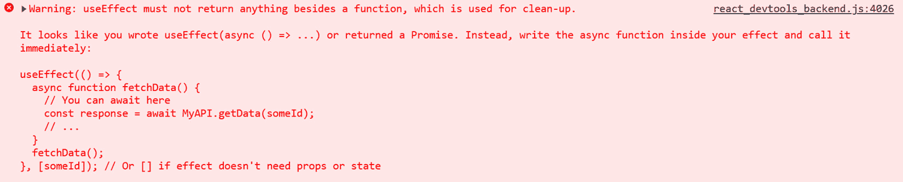
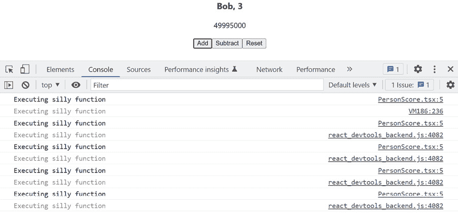
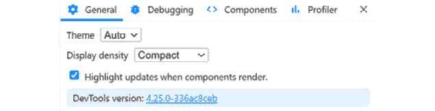
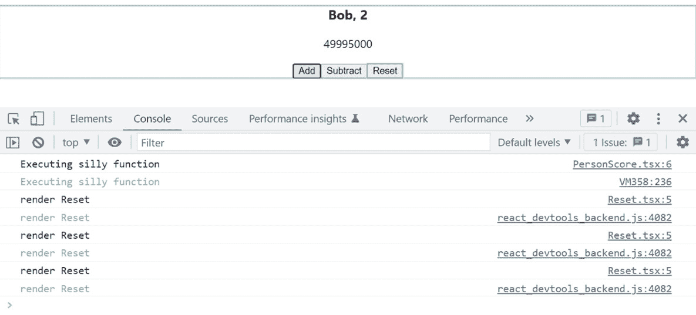
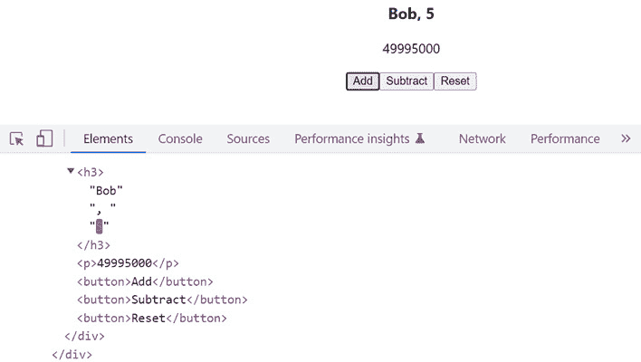
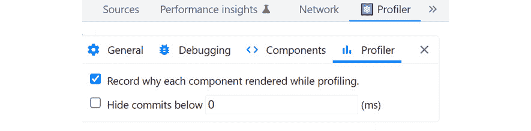
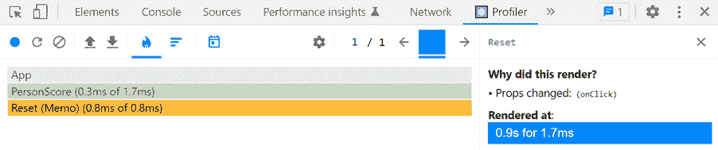

# 第四章：使用 React 钩子

在本章中，我们将学习 React 的常见钩子以及如何使用 TypeScript 使用它们。我们将在一个允许用户调整某人的得分的 React 组件中实现所有这些钩子的知识。我们将从探索 effect 钩子开始，并开始理解它在哪些用例中是有用的。然后，我们将深入研究两个状态钩子 `useState` 和 `useReducer`，了解何时最好使用每个钩子。之后，我们将介绍 ref 钩子以及它与状态钩子的区别，然后是 memo 和回调钩子，看看它们如何帮助性能。

因此，我们将涵盖以下主题：

+   使用 Effect 钩子

+   使用状态钩子

+   使用 ref 钩子

+   使用 Memo 钩子

+   使用回调钩子

# 技术要求

在本章中，我们将使用以下技术：

+   **浏览器**：一个现代浏览器，例如 Google Chrome

+   **Node.js** 和 **npm**：您可以从 [`nodejs.org/en/download/`](https://nodejs.org/en/download/) 安装它们

+   **Visual Studio Code**：您可以从 [`code.visualstudio.com/`](https://code.visualstudio.com/) 安装它

本章中所有代码片段都可以在网上找到，地址为 [`github.com/PacktPublishing/Learn-React-with-TypeScript-2nd-Edition/tree/main/Chapter4`](https://github.com/PacktPublishing/Learn-React-with-TypeScript-2nd-Edition/tree/main/Chapter4)。

# 使用 Effect 钩子

在本节中，我们将学习 effect 钩子及其用途。然后，我们将创建一个新的 React 项目和一个使用 effect 钩子的组件。

## 理解 effect 钩子参数

effect 钩子用于组件副作用。组件副作用是在组件作用域之外执行的操作，例如网络服务请求。effect 钩子是通过 React 的 `useEffect` 函数定义的。`useEffect` 包含两个参数：

+   执行效果的函数；至少，这个函数在组件渲染时运行

+   一个可选的依赖数组，当它改变时会导致效果函数重新运行

这里是一个组件中 `useEffect` 钩子的示例：

```js
function SomeComponent() {
  function someEffect() {
    console.log("Some effect");
  }
  useEffect(someEffect);
  return ...
}
```

之前的效果钩子传递了一个名为 `someEffect` 的效果函数。没有传递效果依赖项，所以效果函数在每次组件渲染时都会执行。

通常，匿名箭头函数用于效果函数。以下是一个使用匿名效果函数的相同示例：

```js
function SomeComponent() {
  useEffect(() => {
    console.log("Some effect");
  });
  return ...
}
```

如您所见，这个版本的代码稍微短一些，并且可能更容易阅读。

这里是另一个效果的示例：

```js
function SomeOtherComponent({ search }) {
  useEffect(() => {
    console.log("An effect dependent on a search prop",       search);
  }, [search]);
  Return ...;
}
```

这次效果依赖于一个 `search` 属性。因此，`search` 属性在 effect 钩子的第二个参数中的数组中定义。每当 `search` 的值改变时，效果函数都会运行。

## 钩子的规则

所有钩子都必须遵守一些规则，包括 `useEffect`：

+   Hook 只能在函数组件的顶层被调用。所以，Hook 不能在循环或嵌套函数（如事件处理器）中被调用。

+   Hook 不能有条件地被调用。

+   Hook 只能在函数组件中使用，而不能在类组件中使用。

以下示例违反了规则：

```js
export function AnotherComponent() {
  function handleClick() {
    useEffect(() => {
      console.log("Some effect");
    });
  }
  return <button onClick={handleClick}>Cause effect</button>;
}
```

这是一种违规，因为 `useEffect` 是在处理函数中而不是在顶层被调用的。修正后的版本如下：

```js
export function AnotherComponent() {
  const [clicked, setClicked] = useState(false);
  useEffect(() => {
    if (clicked) {
      console.log("Some effect");
    }
  }, [clicked]);
  function handleClick() {
    setClicked(true);
  }
  return <button onClick={handleClick}>Cause effect</button>;
}
```

`useEffect` 已经提升到顶层，并且现在依赖于在处理函数中设置的 `clicked` 状态。

以下是一个违反 Hooks 规则的另一个示例：

```js
function YetAnotherComponent({ someProp }) {
  if (!someProp) {
    return null;
  }
  useEffect(() => {
    console.log("Some effect");
  });
  return ...
}
```

违规是因为 `useEffect` 是有条件地被调用的。如果 `someProp` 是假值，组件会返回 `null`，并且 `useEffect` 从不会被调用。所以，条件是只有当 `someProp` 是真值时，`useEffect` 才会被调用。

修正后的版本如下：

```js
function YetAnotherComponent({someProp}) {
  useEffect(() => {
    if (someProp) {
      console.log("Some effect");
    }
  });
  if (!someProp) {
    return null
  }
  return ...
}
```

`useEffect` 已经提升到条件之上。条件也被放入效果函数中，以便其逻辑仅在 `someProp` 是真值时执行。

## 效果清理

效果可以返回一个函数，在组件卸载时执行清理逻辑。清理逻辑确保没有留下可能导致内存泄漏的东西。让我们考虑以下示例：

```js
function ExampleComponent({onClickAnywhere}) {
  useEffect(() => {
    function handleClick() {
      onClickAnywhere();
    }
    document.addEventListener("click", handleClick);
  });
  return ...
}
```

前面的效果函数将事件处理器附加到 `document` 元素上。尽管事件处理器不会被移除，所以随着效果的重新运行，多个事件处理器将附加到 `document` 元素上。这个问题通过返回一个 `cleanup` 函数来解决，如下所示：

```js
function ExampleComponent({ onClickAnywhere }) {
  useEffect(() => {
    function handleClick() {
      onClickAnywhere();
    }
    document.addEventListener("click", listener);
    return function cleanup() {
      document.removeEventListener("click", listener);
    };
  });
  return ...;
}
```

通常，匿名箭头函数被用于清理函数：

```js
function ExampleComponent({ onClickAnywhere }) {
  useEffect(() => {
    function handleClick() {
      onClickAnywhere();
    }
    document.addEventListener("click", listener);
    return () => {
      document.removeEventListener("click", listener);
    };
  });
  return ...;
```

匿名箭头函数比上一个例子中的命名函数要短一些。

接下来，我们将探讨效果 Hook 的一个常见用例。

## 创建项目

让我们从在 Visual Studio Code 中使用 Create React App 创建一个新项目开始。我们已经在 *第三章**，设置 React 和 TypeScript* 中学习了如何这样做 – 步骤如下：

1.  在你选择的空白文件夹中打开 Visual Studio Code 并运行以下命令：

    ```js
    npx create-react-app app --template typescript
    ```

Create React App 需要一两分钟来创建项目。在后续命令中，应用被命名为 `app`，但你可以随意更改这个名字。

1.  在刚刚创建的 `app` 文件夹（或你给它起的名字）中重新打开 Visual Studio Code。

1.  安装 Prettier 及其库，以便它能够与 ESLint 一起工作。在终端中运行以下命令来完成此操作：

    ```js
    npm i -D prettier eslint-config-prettier eslint-plugin-prettier
    ```

1.  启用 Visual Studio Code 在文件保存时自动格式化代码。为此，在项目根目录中创建一个 `.vscode` 文件夹，并创建一个包含以下内容的 `settings.json` 文件：

    ```js
    {
    ```

    ```js
      "editor.formatOnSave": true,
    ```

    ```js
      "editor.defaultFormatter": "esbenp.prettier-vscode"
    ```

    ```js
    }
    ```

1.  更新 ESLint 配置以允许 Prettier 管理样式规则。为此，将以下高亮行添加到 `package.json` 中的 `eslintConfig` 部分：

    ```js
    {
    ```

    ```js
      ...,
    ```

    ```js
      "eslintConfig": {
    ```

    ```js
        "extends": [
    ```

    ```js
          "react-app",
    ```

    ```js
          "react-app/jest",
    ```

    ```js
          "plugin:prettier/recommended"
    ```

    ```js
        ]
    ```

    ```js
      },
    ```

    ```js
      ...
    ```

    ```js
    }
    ```

1.  在一个名为 `.prettierrc.json` 的文件中添加以下 Prettier 配置：

    ```js
    {
    ```

    ```js
      "printWidth": 100,
    ```

    ```js
      "singleQuote": true,
    ```

    ```js
      "semi": true,
    ```

    ```js
      "tabWidth": 2,
    ```

    ```js
      "trailingComma": "all",
    ```

    ```js
      "endOfLine": "auto"
    ```

    ```js
    }
    ```

1.  从 `src` 文件夹中删除以下文件，因为这些文件在这个项目中不是必需的：

    +   `App.test.tsx`

    +   `Logo.svg`

1.  打开 `index.tsx` 并保存文件，无需进行任何更改。这将消除任何格式问题。

1.  打开 `App.tsx` 并将内容替换为以下内容：

    ```js
    import React from 'react';
    ```

    ```js
    import './App.css';
    ```

    ```js
    function App() {
    ```

    ```js
      return <div className="App"></div>;
    ```

    ```js
    }
    ```

    ```js
    export default App;
    ```

1.  通过在终端中运行 `npm start` 启动开发模式下的应用程序。目前应用程序包含一个空白页面。在我们探索 React 组件中的不同钩子时，请保持应用程序运行。

这就是创建的项目。接下来，我们将使用效果钩子。

## 使用效果钩子获取数据

效果钩子的一个常见用途是获取数据。执行以下步骤以实现一个获取人名的效果：

1.  创建一个将模拟数据请求的函数。为此，在 `src` 文件夹中创建一个名为 `getPerson.ts` 的文件，然后向该文件添加以下内容：

    ```js
    type Person = {
    ```

    ```js
      name: string,
    ```

    ```js
    };
    ```

    ```js
    export function getPerson(): Promise<Person> {
    ```

    ```js
      return new Promise((resolve) =>
    ```

    ```js
        setTimeout(() => resolve({ name: "Bob" }), 1000)
    ```

    ```js
      );
    ```

    ```js
    }
    ```

函数在经过一秒钟后异步返回一个对象，`{ name: "Bob" }`。

注意返回类型的类型注解，`Promise<Person>`。`Promise` 类型代表 JavaScript 的 `Promise`，它最终会被完成。`Promise` 类型有一个泛型参数，用于指定在承诺中解析的项目类型，在这个例子中是 `Person`。有关 JavaScript 承诺的更多信息，请参阅以下链接：[`developer.mozilla.org/en-US/docs/Web/JavaScript/Reference/Global_Objects/Promise`](https://developer.mozilla.org/en-US/docs/Web/JavaScript/Reference/Global_Objects/Promise)。

1.  接下来，我们将创建一个最终将显示人和分数的 React 组件。在 `src` 文件夹中创建一个名为 `PersonScore.tsx` 的文件，然后向该文件添加以下内容：

    ```js
    import { useEffect } from 'react';
    ```

    ```js
    import { getPerson } from './getPerson';
    ```

    ```js
    export function PersonScore() {
    ```

    ```js
      return null;
    ```

    ```js
    }
    ```

已经从 React 导入了 `useEffect` 钩子以及我们刚刚创建的 `getPerson` 函数。目前，组件仅返回 `null`。

1.  在返回语句上方添加以下效果：

    ```js
    export function PersonScore() {
    ```

    ```js
      useEffect(() => {
    ```

    ```js
        getPerson().then((person) => console.log(person));
    ```

    ```js
      }, []);
    ```

    ```js
      return null;
    ```

    ```js
    }
    ```

效果调用 `getPerson` 函数并将返回的人输出到控制台。由于在第二个参数中指定了一个空数组作为效果依赖项，因此效果仅在组件最初渲染后执行。

1.  打开 `App.tsx` 并在 `div` 元素内渲染 `PersonScore` 组件：

    ```js
    import React from 'react';
    ```

    ```js
    import './App.css';
    ```

    ```js
    import { PersonScore } from './PersonScore';
    ```

    ```js
    function App() {
    ```

    ```js
      return (
    ```

    ```js
        <div className="App">
    ```

    ```js
          <PersonScore />
    ```

    ```js
        </div>
    ```

    ```js
      );
    ```

    ```js
    }
    ```

    ```js
    export default App;
    ```

1.  在浏览器中转到正在运行的应用程序，并查看控制台中出现的 `person` 对象，这验证了获取 `person` 数据的效果已正确运行：


图 4.1 – 效果输出

你可能还会注意到，`effect` 函数已经执行了两次而不是一次。这种行为是故意的，并且仅在开发模式下的 React Strict Mode 中发生。这最终将允许未来的 React 功能在移除 UI 的部分时保留状态。有关此行为的更多信息，请参阅 React 团队的这篇博客文章：[`reactjs.org/blog/2022/03/29/react-v18.html#new-strict-mode-behaviors`](https://reactjs.org/blog/2022/03/29/react-v18.html#new-strict-mode-behaviors)。

1.  接下来，我们将重构调用 `effect` 函数的方式，以揭示一个有趣的问题。打开 `PersonScore.tsx` 并将 `useEffect` 调用改为使用 `async`/`await` 语法：

    ```js
    useEffect(async () => {
    ```

    ```js
      const person = await getPerson();
    ```

    ```js
      console.log(person);
    ```

    ```js
    }, []);
    ```

注意

`async`/`await` 语法是编写异步代码的另一种方式。许多开发者更喜欢它，因为它读起来像同步代码。有关 `async`/`await` 的更多信息，请参阅以下链接：[`developer.mozilla.org/en-US/docs/Learn/JavaScript/Asynchronous/Promises#async_and_await`](https://developer.mozilla.org/en-US/docs/Learn/JavaScript/Asynchronous/Promises#async_and_await)。

前面的代码可以说是更易读，但 React 会抛出一个错误。查看浏览器的控制台，你会看到以下错误：



图 4.2 – Effect 异步错误

这个错误信息非常有用——`useEffect` Hook 不允许将标记为 `async` 的函数传递给它。

1.  接下来，更新代码并使用错误消息中建议的方法：

    ```js
    useEffect(() => {
    ```

    ```js
      async function getThePerson() {
    ```

    ```js
        const person = await getPerson();
    ```

    ```js
        console.log(person);
    ```

    ```js
      }
    ```

    ```js
      getThePerson();
    ```

    ```js
    }, []);
    ```

在 `effect` 函数中定义了一个嵌套的异步函数，并立即调用；这工作得很好。

1.  与初始版本相比，这种 `effect` 实现可以说是更不易读。因此，在继续到下一节之前，请切换回那个版本。代码可以从以下链接复制：[`github.com/PacktPublishing/Learn-React-with-TypeScript-2nd-Edition/blob/main/Chapter4/Section1-Using-the-effect-hook/src/PersonScore.tsx`](https://github.com/PacktPublishing/Learn-React-with-TypeScript-2nd-Edition/blob/main/Chapter4/Section1-Using-the-effect-hook/src/PersonScore.tsx)。

这就完成了我们对 `effect Hook` 的探索——以下是总结：

+   `effect Hook` 用于在组件渲染时或某些属性或状态发生变化时执行组件副作用。

+   `effect Hook` 的一个常见用例是获取数据。另一个用例是当需要手动注册 DOM 事件时。

+   所需的任何 `effect` 清理工作都可以在 `effect` 函数返回的函数中完成。

接下来，我们将了解 React 中的两个状态 Hook。在我们移动到下一节之前，请保持应用程序运行。

# 使用状态 Hook

我们已经在之前的章节中学习了 `useState Hook`，但在这里我们将再次探讨它，并将其与另一个我们尚未涉及的 `state Hook` 进行比较，即 `useReducer`。我们将扩展上一节中创建的 `PersonScore` 组件，以探索这些状态 Hook。

## 使用 `useState`

作为提醒，`useState` Hook 允许在变量中定义状态。`useState`的语法如下：

```js
const [state, setState] = useState(initialState);
```

我们将增强上一节中创建的`PersonScore`组件，以便在`state`中存储人的姓名。我们还将为分数添加`state`，该分数可以通过组件中的某些按钮进行增加、减少和重置。我们还将向组件中添加`loading`状态，当`true`时将显示加载指示器。

执行以下步骤：

1.  打开`PersonScore.tsx`并将`useState`添加到 React 导入语句中：

    ```js
    import { useEffect, useState } from 'react';
    ```

1.  在组件函数顶部，在`useEffect`调用之上添加以下`name`、`score`和`loading`状态定义：

    ```js
    export function PersonScore() {
    ```

    ```js
      const [name, setName] = useState<string | undefined>();
    ```

    ```js
      const [score, setScore] = useState(0);
    ```

    ```js
      const [loading, setLoading] = useState(true);
    ```

    ```js
      useEffect( ... );
    ```

    ```js
      return null;
    ```

    ```js
    }
    ```

`score`状态初始化为`0`，`loading`初始化为`true`。

1.  将效果函数更改为在获取到个人信息后设置`loading`和`name`状态值。这应该替换现有的`console.log`语句：

    ```js
    useEffect(() => {
    ```

    ```js
      getPerson().then((person) => {
    ```

    ```js
        setLoading(false);
    ```

    ```js
        setName(person.name);
    ```

    ```js
      });
    ```

    ```js
    }, []);
    ```

在获取到个人信息后，`loading`设置为`false`，`name`设置为人的姓名。

1.  接下来，在`useEffect`调用和返回语句之间添加以下`if`语句：

    ```js
    useEffect( ... );
    ```

    ```js
    if (loading) {
    ```

    ```js
      return <div>Loading ...</div>;
    ```

    ```js
    }
    ```

    ```js
    return ...
    ```

当`loading`状态为`true`时，这将显示加载指示器。

1.  将组件的返回语句从输出空内容更改为输出以下内容：

    ```js
    if (loading) {
    ```

    ```js
      return <div>Loading ...</div>;
    ```

    ```js
    }
    ```

    ```js
    return (
    ```

    ```js
      <div>
    ```

    ```js
        <h3>
    ```

    ```js
          {name}, {score}
    ```

    ```js
        </h3>
    ```

    ```js
        <button>Add</button>
    ```

    ```js
        <button>Subtract</button>
    ```

    ```js
        <button>Reset</button>
    ```

    ```js
      </div>
    ```

    ```js
    );
    ```

人的姓名和分数在一个带有**添加**、**减去**和**重置**按钮的标题中显示（不用担心输出未样式化 – 我们将在下一章学习如何样式化组件）：


图 4.3 – 获取数据后的 PersonScore 组件

1.  更新**添加**按钮，以便在点击时增加分数：

    ```js
    <button onClick={() => setScore(score + 1)}>Add</button>
    ```

按钮点击事件调用分数状态设置器以增加状态。

根据它们的前一个值更新状态值的方法是另一种方法。该方法使用状态设置器中的参数来提供前一个状态值，因此我们的示例可以如下所示：

```js
setScore(previousScore => previousScore + 1)
```

这可能有点难以阅读，所以我们将继续使用我们的初始方法。

1.  按照以下方式为其他按钮添加分数状态设置器：

    ```js
    <button onClick={() => setScore(score - 1)}>Subtract</button>
    ```

    ```js
    <button onClick={() => setScore(0)}>Reset</button>
    ```

1.  在运行的应用程序中，点击不同的按钮。它们应该像您预期的那样改变分数。


图 4.4 – 点击按钮后的 PersonScore 组件

1.  在完成这个练习之前，让我们花点时间来了解状态值实际上是在何时设置的。更新效果函数以在设置后输出状态值：

    ```js
    useEffect(() => {
    ```

    ```js
      getPerson().then((person) => {
    ```

    ```js
        setLoading(false);
    ```

    ```js
        setName(person.name);
    ```

    ```js
        console.log("State values", loading, name);
    ```

    ```js
      });
    ```

    ```js
    }, []);
    ```

我们可能期望控制台输出为`false`和`"Bob"`？然而，控制台输出的是`true`和`undefined`。这是因为更新状态值不是立即的 – 相反，它们被批处理并在下一次渲染之前更新。因此，只有在下一次渲染时，`loading`才会变为`false`，`name`才会变为`"Bob"`。

我们不再需要在这个步骤中添加的 `console.log` 语句，所以在继续之前将其删除。

接下来，我们将学习一个用于使用状态的替代 React Hook。

## 理解 useReducer

`useReducer` 是管理状态的一种替代方法。它使用一个 **reducer** 函数来处理状态变化，该函数接收当前状态值并返回新的状态值。

这是一个 `useReducer` 调用的示例：

```js
const [state, dispatch] = useReducer(reducer, initialState);
```

因此，`useReducer` 接收一个 reducer 函数和初始状态值作为参数。然后它返回一个包含当前状态值和一个用于 **dispatch** 状态变化的函数的元组。

dispatch 函数接收一个描述更改的参数。这个对象被称为 `dispatch` 调用，如下所示：

```js
dispatch({ type: 'add', amount: 2 });
```

动作没有定义的结构，但通常包含一个属性，例如 `type`，用于指定更改的类型。动作中的其他属性可能根据更改的类型而变化。以下是一个 `dispatch` 调用的另一个示例：

```js
dispatch({ type: 'loaded' });
```

这次，动作只需要类型来更改必要的状态。

将我们的注意力转向 reducer 函数，它具有当前状态值和动作的参数。以下是一个 reducer 的示例代码片段：

```js
function reducer(state: State, action: Action): State {
  switch (action.type) {
    case 'add':
      return { ...state, total: state.total + action.amount };
    case ...
      ...
    default:
      return state;
  }
}
```

reducer 函数通常包含一个基于动作类型的 `switch` 语句。每个 switch 分支对状态进行必要的更改并返回更新后的状态。在状态变化期间会创建一个新的状态对象——当前状态永远不会被修改。修改状态会导致组件不重新渲染。

注意

```js
"add" branch the state variable (...state). The spread syntax copies all the properties from the object after the three dots. In the preceding code snippet, all the properties are copied from the state variable into the new state object returned. The total property value will then be overwritten by state.total + action.amount because this is defined after the spread operation in the new object creation. For more information on the spread syntax, see the following link: https://developer.mozilla.org/en-US/docs/Web/JavaScript/Reference/Operators/Spread_syntax.
```

`useReducer` 的类型可以在其泛型参数中显式定义，如下所示：

```js
const [state, dispatch] = useReducer<Reducer<State, Action>>(
  reducer,
  initialState
);
```

`Reducer` 是一个标准的 React 类型，它具有泛型参数，用于定义状态和动作的类型。

因此，`useReducer` 比起 `useState` 更复杂，因为状态变化需要通过我们必须实现的 reducer 函数进行。这对于具有相关属性或状态变化依赖于先前状态值的复杂状态对象来说是有益的。

接下来，我们将使用 `useReducer` 实现状态。

## 使用 useReducer

我们将重构我们一直在工作的 `PersonScore` 组件，使用 `useReducer` 而不是 `useState`。为此，执行以下步骤。使用的代码片段可以从 [`github.com/PacktPublishing/Learn-React-with-TypeScript-2nd-Edition/blob/main/Chapter4/Section2-Using-state-hooks/2-Using-useReducer/src/PersonScore.tsx`](https://github.com/PacktPublishing/Learn-React-with-TypeScript-2nd-Edition/blob/main/Chapter4/Section2-Using-state-hooks/2-Using-useReducer/src/PersonScore.tsx) 复制。

1.  打开 `PersonScore.tsx` 并从 React 中导入 `useReducer` 而不是 `useState`：

    ```js
    import { useEffect, useReducer } from 'react';
    ```

1.  我们将状态放在一个单独的对象中，所以定义一个类型在导入语句下方：

    ```js
    type State = {
    ```

    ```js
      name: string | undefined;
    ```

    ```js
      score: number;
    ```

    ```js
      loading: boolean;
    ```

    ```js
    };
    ```

1.  接下来，让我们也定义所有动作对象类型：

    ```js
    type Action =
    ```

    ```js
      | {
    ```

    ```js
          type: 'initialize';
    ```

    ```js
          name: string;
    ```

    ```js
        }
    ```

    ```js
      | {
    ```

    ```js
          type: 'increment';
    ```

    ```js
        }
    ```

    ```js
      | {
    ```

    ```js
          type: 'decrement';
    ```

    ```js
        }
    ```

    ```js
      | {
    ```

    ```js
          type: 'reset';
    ```

    ```js
        };
    ```

这些动作对象代表了状态可以改变的所有方式。动作对象类型通过联合类型组合，允许动作是这些中的任何一个。

1.  现在，在类型定义下方定义以下减法函数：

    ```js
    function reducer(state: State, action: Action): State {
    ```

    ```js
      switch (action.type) {
    ```

    ```js
        case 'initialize':
    ```

    ```js
          return { name: action.name, score: 0, loading: false };
    ```

    ```js
        case 'increment':
    ```

    ```js
          return { ...state, score: state.score + 1 };
    ```

    ```js
        case 'decrement':
    ```

    ```js
          return { ...state, score: state.score - 1 };
    ```

    ```js
        case 'reset':
    ```

    ```js
          return { ...state, score: 0 };
    ```

    ```js
        default:
    ```

    ```js
          return state;
    ```

    ```js
      }
    ```

    ```js
    }
    ```

减法函数包含一个`switch`语句，为每种类型的操作执行相应的状态变更。

注意当引用`state`和`action`参数时的良好 IntelliSense：


图 4.5 – 减法函数内的 IntelliSense

1.  在`PersonScore`组件内部，将`useState`调用替换为以下`useReducer`调用：

    ```js
    const [{ name, score, loading }, dispatch] = useReducer(
    ```

    ```js
      reducer,
    ```

    ```js
      {
    ```

    ```js
        name: undefined,
    ```

    ```js
        score: 0,
    ```

    ```js
        loading: true,
    ```

    ```js
      }
    ```

    ```js
    );
    ```

状态已使用`undefined`名称、分数`0`和`loading`设置为`true`初始化。

当前状态值已解构为`name`、`score`和`loading`变量。如果你悬停在解构的状态变量上，你会看到它们的类型已经被正确推断。

1.  现在我们需要修改组件中更新状态的那些地方。从效果函数开始，在返回人员信息后分发初始化操作：

    ```js
    useEffect(() => {
    ```

    ```js
      getPerson().then(({ name }) =>
    ```

    ```js
        dispatch({ type: 'initialize', name })
    ```

    ```js
      );
    ```

    ```js
    }, []);
    ```

1.  最后，在按钮点击处理程序中分发相关操作：

    ```js
    <button onClick={() => dispatch({ type: 'increment' })}>
    ```

    ```js
      Add
    ```

    ```js
    </button>
    ```

    ```js
    <button onClick={() => dispatch({ type: 'decrement' })}>
    ```

    ```js
      Subtract
    ```

    ```js
    </button>
    ```

    ```js
    <button onClick={() => dispatch({ type: 'reset' })}>
    ```

    ```js
      Reset
    ```

    ```js
    </button>
    ```

1.  如果你尝试点击运行中的应用程序中的按钮，它们将正确更新。

这就完成了我们对`useReducer`钩子的探索。它比`useState`更适合复杂的状态管理情况，例如，当状态是一个具有相关属性和状态变更依赖于先前状态值的复杂对象时。当状态基于独立于任何其他状态的原始值时，`useState`钩子更为合适。

在接下来的几节中，我们将继续扩展`PersonScore`组件。接下来，我们将学习如何使用`ref`钩子将焦点移动到**添加**按钮。

# 使用`ref`钩子

在本节中，我们将了解`ref`钩子和它的用途。然后，我们将通过增强我们一直在工作的`PersonScore`组件来演示`ref`钩子的一个常见用例。

## 理解`ref`钩子

`ref`钩子被称作`useRef`，它返回一个变量，其值在组件的生命周期内保持持久。这意味着当组件重新渲染时，变量不会丢失其值。

从`ref`钩子返回的值通常被称为**ref**。ref 可以更改而不会导致重新渲染。

这是`useRef`的语法：

```js
const ref = useRef(initialValue);
```

可以选择性地将初始值传递给`useRef`。`ref`的类型可以通过`useRef`的泛型参数显式定义：

```js
const ref = useRef<Ref>(initialValue);
```

当没有传递初始值或初始值为`null`时，泛型参数是有用的。这是因为 TypeScript 无法正确推断类型。

通过其`current`属性访问`ref`的值：

```js
console.log("Current ref value", ref.current);
```

可以通过其`current`属性更新`ref`的值：

```js
ref.current = newValue;
```

`useRef`钩子的一种常见用法是强制访问 HTML 元素。HTML 元素在 JSX 中有一个`ref`属性，可以被分配给 ref。以下是一个示例：

```js
function MyComponent() {
  const inputRef = useRef<HTMLInputElement>(null);
  function doSomething() {
    console.log(
      "All the properties and methods of the input",
      inputRef.current
    );
  }
  return <input ref={inputRef} type="text" />;
}
```

这里使用的 ref 被称为`inputRef`，初始值为`null`。因此，它被明确地赋予了一个类型`HTMLInputElement`，这是输入元素的常规类型。然后，这个 ref 被分配到 JSX 中输入元素的`ref`属性上。然后，所有输入的属性和方法都可通过 ref 的`current`属性访问。

接下来，我们将在`PersonScore`组件中使用`useRef`钩子。

## 使用 ref 钩子

我们将增强我们一直在工作的`PersonScore`组件，使用`useRef`将焦点移动到**添加**按钮。为此，执行以下步骤。所有使用的代码片段都可在以下链接中找到：[`github.com/PacktPublishing/Learn-React-with-TypeScript-2nd-Edition/blob/main/Chapter4/Section3-Using-the-ref-hook/src/PersonScore.tsx`](https://github.com/PacktPublishing/Learn-React-with-TypeScript-2nd-Edition/blob/main/Chapter4/Section3-Using-the-ref-hook/src/PersonScore.tsx)：

1.  打开`PersonScore.tsx`文件，并从 React 中导入`useRef`：

    ```js
    import { useEffect, useReducer, useRef } from 'react';
    ```

1.  为`useReducer`语句创建一个 ref：

    ```js
    const [ ... ] = useReducer( ... );
    ```

    ```js
    const addButtonRef = useRef<HTMLButtonElement>(null);
    ```

    ```js
    useEffect( ... )
    ```

这个 ref 被命名为`addButtonRef`，初始值为`null`。它被赋予了标准的`HTMLButtonElement`类型。

注意

所有标准 HTML 元素都有对应 React 的 TypeScript 类型。右键点击`HTMLButtonElement`类型并选择**转到定义**，以发现所有这些类型。React TypeScript 类型将打开，包含所有 HTML 元素类型。

1.  将 ref 分配给**添加**按钮 JSX 元素的`ref`属性：

    ```js
    <button
    ```

    ```js
      ref={addButtonRef}
    ```

    ```js
      onClick={() => dispatch({ type: 'increment' })}
    ```

    ```js
    >
    ```

    ```js
      Add
    ```

    ```js
    </button>
    ```

1.  现在我们有了`focus`方法的引用，可以在获取到人员信息后将其移动到焦点上。让我们在获取人员的现有效果下方添加另一个效果来完成此操作：

    ```js
    useEffect(() => {
    ```

    ```js
      getPerson().then(({ name }) =>
    ```

    ```js
        dispatch({ type: 'initialize', name })
    ```

    ```js
      );
    ```

    ```js
    }, []);
    ```

    ```js
    useEffect(() => {
    ```

    ```js
      if (!loading) {
    ```

    ```js
        addButtonRef.current?.focus();
    ```

    ```js
      }
    ```

    ```js
    }, [loading]);
    ```

    ```js
    if (loading) {
    ```

    ```js
      return <div>Loading ...</div>;
    ```

    ```js
    }
    ```

当`loading`状态为`true`时，效果会被执行，这将在获取到人员信息之后发生。

注意在 ref 的`current`属性后面的`?`符号。这是在不需要检查`current`是否为`null`的情况下调用的`focus`方法。有关可选链的更多信息，请访问以下链接：[`developer.mozilla.org/en-US/docs/Web/JavaScript/Reference/Operators/Optional_chaining`](https://developer.mozilla.org/en-US/docs/Web/JavaScript/Reference/Operators/Optional_chaining)。

我们可以在现有的效果中将焦点移动到**添加**按钮上，如下所示：

```js
useEffect(() => {
  getPerson().then(({ name }) => {
    dispatch({ type: 'initialize', name });
    addButtonRef.current?.focus();
  });
}, []);
```

然而，这种做法将获取数据、设置状态和设置按钮焦点等关注点混合在一起。这种关注点的混合会使组件难以理解和修改。

1.  如果你刷新包含运行中的应用程序的浏览器，你将在**添加**按钮上看到一个焦点指示器：


图 4.6 – 焦点的添加按钮

如果你按下*Enter*键，你会看到**添加**按钮被点击并且分数增加。这证明了**添加**按钮是聚焦的。

这完成了增强和我们对 ref Hook 的探索。

回顾一下，`useRef` Hook 创建了一个可变的值，并且在变化时不会引起重新渲染。它通常用于在 React 中以命令式方式访问 HTML 元素。

接下来，我们将学习 memo Hook。

# 使用 memo Hook

在本节中，我们将学习 memo Hook 及其用途。然后，我们将通过我们在`PersonScore`组件中一直在工作的例子进行演示。

## 理解 memo Hook

memo Hook 创建了一个记忆值，对于有计算成本高昂的计算的值来说是有益的。该 Hook 被称为`useMemo`，其语法如下：

```js
const memoizedValue = useMemo(() => expensiveCalculation(), []);
```

将返回记忆值的函数作为第一个参数传递给`useMemo`。这个第一个参数应该执行昂贵的计算。

传递给`useMemo`的第二个参数是一个依赖项数组。所以，如果`expensiveCalculation`函数有依赖项`a`和`b`，调用将如下所示：

```js
const memoizedValue = useMemo(
  () => expensiveCalculation(a, b),
  [a, b]
);
```

当任何依赖项发生变化时，第一个参数中的函数会再次执行以返回一个新值进行记忆。在之前的例子中，每当`a`或`b`发生变化时，就会创建一个新的`memoizedValue`版本。

记忆值的类型是推断出来的，但可以在`useMemo`上的泛型参数中显式定义。以下是一个显式定义记忆值应该具有`number`类型的示例：

```js
 const memoizedValue = useMemo<number>(
  () => expensiveCalculation(),
  []
);
```

接下来，我们将实验`useMemo`。

## 使用 memo Hook

我们将使用我们在`PersonScore`组件中一直在工作的组件来与`useMemo` Hook 进行交互。为此，执行以下步骤。使用的代码片段可在[`github.com/PacktPublishing/Learn-React-with-TypeScript-2nd-Edition/tree/main/Chapter4/Section4-Using-the-memo-hook`](https://github.com/PacktPublishing/Learn-React-with-TypeScript-2nd-Edition/tree/main/Chapter4/Section4-Using-the-memo-hook)找到：

1.  打开`PersonScore.tsx`并从 React 中导入`useMemo`：

    ```js
    import {
    ```

    ```js
      useEffect,
    ```

    ```js
      useReducer,
    ```

    ```js
      useRef,
    ```

    ```js
      useMemo
    ```

    ```js
    } from 'react';
    ```

1.  在导入语句下方添加以下昂贵的函数：

    ```js
    function sillyExpensiveFunction() {
    ```

    ```js
      console.log("Executing silly function");
    ```

    ```js
      let sum = 0;
    ```

    ```js
      for (let i = 0; i < 10000; i++) {
    ```

    ```js
        sum += i;
    ```

    ```js
      }
    ```

    ```js
      return sum;
    ```

    ```js
    }
    ```

该函数计算从`0`到`10000`之间的所有数字，并且执行需要一段时间。

1.  在`PersonScore`组件的效果下方添加对函数的调用：

    ```js
    useEffect( ... );
    ```

    ```js
    const expensiveCalculation = sillyExpensiveFunction();
    ```

    ```js
    if (loading) {
    ```

    ```js
      return <div>Loading ...</div>;
    ```

    ```js
    }
    ```

1.  将函数调用的结果添加到`name`和`score`下方的 JSX 中：

    ```js
    <h3>
    ```

    ```js
      {name}, {score}
    ```

    ```js
    </h3>
    ```

    ```js
    <p>{expensiveCalculation}</p>
    ```

    ```js
    <button ... >
    ```

    ```js
      Add
    ```

    ```js
    </button>
    ```

1.  刷新包含应用的浏览器并点击按钮。如果你查看控制台，你会看到在按钮点击后组件重新渲染时，昂贵的函数每次都会执行。



图 4.7 – 执行多次的昂贵函数

记住，在开发模式下，双渲染会发生，React 的 Strict Mode 也是如此。所以，一旦点击按钮，你会在控制台中看到**执行愚蠢函数**两次。

每次组件重新渲染时执行昂贵的函数可能会导致性能问题。

1.  将对 `sillyExpensiveFunction` 的调用重写如下：

    ```js
    const expensiveCalculation = useMemo(
    ```

    ```js
      () => sillyExpensiveFunction(),
    ```

    ```js
      []
    ```

    ```js
    );
    ```

`useMemo` Hook 用于记忆化函数调用的值。

1.  刷新包含运行中的应用程序的浏览器并点击按钮。如果你查看控制台，你会看到当按钮被点击时，昂贵的函数并没有被执行，因为使用了记忆化的值。


图 4.8 – 记忆化的昂贵函数调用

这就完成了我们对 `useMemo` Hook 的探索。本节的要点是，`useMemo` Hook 通过记忆化函数的结果并在函数重新执行时使用记忆化的值来帮助提高函数调用的性能。

接下来，我们将探讨另一个可以帮助性能的 Hook。

# 使用回调 Hook

在本节中，我们将了解回调 Hook 以及它的用途。然后，我们将使用这个 Hook 在我们一直在工作的 `PersonScore` 组件中。

## 理解回调 Hook

回调 Hook 记忆化一个函数，以便它在每次渲染时不会被重新创建。这个 Hook 被称为 `useCallback`，其语法如下：

```js
const memoizedCallback = useCallback(() => someFunction(), []);
```

将执行要记忆化函数的函数传递给 `useCallback` 作为第一个参数。传递给 `useCallback` 的第二个参数是一个依赖项数组。因此，如果 `someFunction` 函数有依赖项 `a` 和 `b`，调用将如下所示：

```js
const memoizedCallback = useCallback(
  () => someFunction(a, b),
  [a, b]
);
```

当任何依赖项发生变化时，第一个参数中的函数会再次执行，以返回一个新的函数进行记忆化。在先前的例子中，每当 `a` 或 `b` 发生变化时，就会创建一个新的 `memoizedCallback` 版本。

记忆化函数的类型是推断出来的，但可以在 `useCallback` 上的泛型参数中显式定义。以下是一个显式定义记忆化函数没有参数并返回 `void` 的例子：

```js
 const memoizedValue = useCallback<() => void>(
  () => someFunction (),
  []
);
```

`useCallback` 的一个常见用例是防止子组件不必要的重新渲染。在尝试 `useCallback` 之前，我们将花时间了解组件何时会重新渲染。

## 理解组件何时重新渲染

我们已经了解到，当组件的状态发生变化时，组件会重新渲染。考虑以下组件：

```js
export function SomeComponent() {
  const [someState, setSomeState] = useState('something');
  return (
    <div>
      <ChildComponent />
      <AnotherChildComponent something={someState} />
      <button
        onClick={() => setSomeState('Something else')}
      ></button>
    </div>
  );
}
```

当 `someState` 发生变化时，`SomeComponent` 将会重新渲染——例如，当按钮被点击时。此外，当 `someState` 发生变化时，`ChildComponent` 和 `AnotherChildComponent` 也会重新渲染。这是因为当其父组件重新渲染时，组件也会重新渲染。

这种重新渲染的行为可能会引起性能问题 – 尤其是在大型组件树的上层组件渲染时。然而，这很少会引起性能问题。这是因为只有当虚拟 DOM 发生变化时，DOM 才会更新，而更新 DOM 是这个过程中的慢速部分。在先前的例子中，如果 `ChildComponent` 的定义如下，那么在 `SomeComponent` 重新渲染时，`ChildComponent` 的 DOM 不会更新：

```js
export function ChildComponent() {
  return <span>A child component</span>;
}
```

在重新渲染期间，`ChildComponent` 的 DOM 不会更新，因为虚拟 DOM 将保持不变。

虽然这种重新渲染的行为通常不会引起性能问题，但如果一个计算密集型的组件频繁重新渲染，或者一个具有缓慢副作用组件频繁重新渲染，它可能会引起性能问题。例如，我们希望避免在具有数据获取副作用的组件中不必要的重新渲染。

React 中有一个名为 `memo` 的函数，可以用来防止不必要的重新渲染。memo 函数可以按照以下方式应用于 `ChildComponent` 以防止不必要的重新渲染：

```js
export const ChildComponent = memo(() => {
  return <span>A child component</span>;
});
```

`memo` 函数包装了组件，并针对一组给定的属性对结果进行记忆化。如果属性相同，则在重新渲染期间使用记忆化的函数。请注意，前面的代码片段使用了箭头函数语法，以便组件可以作为命名导出。

总结来说，React 的 `memo` 函数可以防止缓慢组件的不必要重新渲染。

接下来，我们将使用 `memo` 函数和 `useCallback` 钩子来防止不必要的重新渲染。

## 使用回调钩子

我们现在将通过提取 `Reset` 来重构 `PersonScore` 组件。这将导致 `Reset` 组件的不必要重新渲染，我们将使用 React 的 `memo` 函数和 `useCallback` 钩子来解决这个问题。

要这样做，请执行以下步骤。使用的代码片段可在 [`github.com/PacktPublishing/Learn-React-with-TypeScript-2nd-Edition/tree/main/Chapter4/Section5-Using-the-callback-hook`](https://github.com/PacktPublishing/Learn-React-with-TypeScript-2nd-Edition/tree/main/Chapter4/Section5-Using-the-callback-hook) 找到：

1.  在 `src` 文件夹中创建一个新的文件，名为 `Reset.tsx`，用于重置按钮，内容如下：

    ```js
    type Props = {
    ```

    ```js
      onClick: () => void,
    ```

    ```js
    };
    ```

    ```js
    export function Reset({ onClick }: Props) {
    ```

    ```js
      console.log("render Reset");
    ```

    ```js
      return <button onClick={onClick}>Reset</button>;
    ```

    ```js
    }
    ```

该组件接受一个点击处理程序并显示重置按钮。该组件还会将 **render Reset** 输出到控制台，以便我们可以清楚地看到组件何时重新渲染。

1.  打开 `PersonScore.tsx` 并导入 `Reset` 组件：

    ```js
    import { Reset } from './Reset';
    ```

1.  按照以下方式替换现有的重置按钮为新 `Reset` 组件：

    ```js
    <div>
    ```

    ```js
      ...
    ```

    ```js
      <button onClick={() => dispatch({ type: 'decrement' })}>
    ```

    ```js
        Subtract
    ```

    ```js
      </button>
    ```

    ```js
      <Reset onClick={() => dispatch({ type: 'reset' })} />
    ```

    ```js
    </div>;
    ```

1.  前往浏览器中运行的 app，打开 React 的 DevTools。确保在 **Components** 面板的设置中勾选了 **Highlight updates when components render.** 选项：



图 4.9 – 重新渲染高亮选项

1.  在浏览器中，`Reset` 不必要地重新渲染。你还会看到重新渲染高亮显示在 **Reset** 按钮周围。



图 4.10 – 重置组件不必要的重新渲染

1.  使用浏览器的 DevTools 检查 DOM。为此，右键单击 `h3` 元素内容被更新 – 由于没有其他元素因更新而高亮显示。



图 4.11 – 重新渲染后 h3 元素被更新

即使 `Reset` 不必要地重新渲染，也不会导致 DOM 更新。此外，`Reset` 的计算成本不高，也不包含任何副作用。因此，不必要的渲染实际上并不是性能问题。然而，我们将使用这个例子来学习如何使用 React 的 `memo` 函数，以及 `useCallback` 钩子可以防止不必要的渲染。

1.  我们现在将添加 React 的 `memo` 函数来尝试防止不必要的重新渲染。打开 `React.tsx` 并在文件顶部添加一个 React 导入语句以导入 `memo`：

    ```js
    import { memo } from 'react';
    ```

1.  现在，按照以下方式将 `memo` 包裹在 `Reset` 组件周围：

    ```js
    export const Reset = memo(({ onClick }: Props) => {
    ```

    ```js
      console.log("render Reset");
    ```

    ```js
      return <button onClick={onClick}>Reset</button>;
    ```

    ```js
    });
    ```

1.  此外，在 `Reset` 组件定义下方添加以下行，以便在 React 的 DevTools 中具有有意义的名称：

    ```js
    Reset.displayName = 'Reset';
    ```

1.  在浏览器中，点击 `Reset` 仍然是不必要地重新渲染。

1.  我们将使用 React 的 DevTools 来开始理解为什么当其结果被记忆化时，Reset 仍然不必要地重新渲染。打开 **Profiler** 面板并点击齿轮图标以打开设置。转到 **Profiler** 设置部分并确保 **Record why each component rendered while profiling.** 被勾选：



图 4.12 – 确保 Record why each component rendered while profiling. 选项被勾选

1.  点击蓝色圆圈图标开始分析，然后点击应用中的 **Add** 按钮。点击红色圆圈图标停止分析。

1.  在出现的火焰图中，点击 `Reset` 组件的重新渲染：



图 4.13 – 重置重新渲染的信息

因此，不必要的 `Reset` 渲染发生是因为 `onClick` 属性发生了变化。`onClick` 处理程序包含相同的代码，但在每次渲染时都会创建一个新的函数实例。这意味着 `onClick` 在每次渲染时将具有不同的引用。变化的 `onClick` 属性引用意味着从 `Reset` 中记忆的结果没有被使用，而是发生了重新渲染。

1.  我们可以使用 `useCallback` 钩子来记忆 `onClick` 处理程序并防止重新渲染。打开 `PersonScore.tsx` 并首先将处理程序重构为命名函数：

    ```js
    function handleReset() {
    ```

    ```js
      dispatch({ type: 'reset' });
    ```

    ```js
    }
    ```

    ```js
    if (loading) {
    ```

    ```js
      return <div>Loading ...</div>;
    ```

    ```js
    }
    ```

    ```js
    return (
    ```

    ```js
      <div>
    ```

    ```js
        ...
    ```

    ```js
        <Reset onClick={handleReset} />
    ```

    ```js
      </div>
    ```

    ```js
    );
    ```

1.  现在，将 `useCallback` 添加到 React 导入语句中：

    ```js
    import {
    ```

    ```js
      useEffect,
    ```

    ```js
      useReducer,
    ```

    ```js
      useRef,
    ```

    ```js
      useMemo,
    ```

    ```js
      useCallback
    ```

    ```js
    } from 'react';
    ```

1.  最后，将 `useCallback` 包裹在我们刚刚创建的点击处理程序周围：

    ```js
    const handleReset = useCallback(
    ```

    ```js
      () => dispatch({ type: 'reset' }),
    ```

    ```js
      []
    ```

    ```js
    );
    ```

1.  现在，如果你点击 `重置`，它就不再会不必要地重新渲染。

这就完成了我们对 `useCallback` Hooks 的探索。

这里是对本节所学内容的快速回顾：

+   当其父组件重新渲染时，组件会重新渲染。

+   React 的 `memo` 函数可以用来防止对子组件的不必要重新渲染。

+   `useCallback` 可以用来缓存函数。这可以用来为传递给子组件的函数属性创建一个稳定的引用，以防止不必要的重新渲染。

+   React 的 `memo` 函数和 `useCallback` 应该明智地使用——在使用它们之前确保它们有助于性能，因为它们会增加代码的复杂性。

接下来，我们将总结本章内容。

# 概述

在本章中，我们了解到所有 React Hooks 都必须在函数组件的最高级别调用，并且不能有条件地调用。

`useEffect` Hook 可以用来在组件渲染时执行组件副作用。我们学习了如何使用 `useEffect` 来获取数据，这是一个常见的用例。

`useReducer` 是 `useState` 用于使用状态的另一种选择，我们在 `PersonScore` 示例组件中体验了这两种方法。`useState` 对于原始状态值非常出色。`useReducer` 对于复杂对象状态值非常好，尤其是在状态变化依赖于先前状态值时。

`useRef` Hook 创建一个可变的值，在改变时不会引起重新渲染。我们使用 `useRef` 在渲染后设置 HTML 元素的焦点，这是一个常见的用例。

`useMemo` 和 `useCallback` Hooks 可以用来分别缓存值和函数，并且可以用于性能优化。我们用于这些 Hooks 的示例有点牵强，使用 `useCallback` 并没有提高性能，所以请记住，使用这些 Hooks 确实可以提高性能。

到目前为止，在这本书中，我们创建的组件都是未加样式的。在下一章，我们将学习几种为 React 组件添加样式的途径。

# 问题

回答以下问题以检查你对 React Hooks 的了解：

1.  以下组件将渲染一些文本 5 秒。但这是有问题的——问题是什么？

    ```js
    export function TextVanish({ text }: Props) {
    ```

    ```js
      if (!text) {
    ```

    ```js
        return null;
    ```

    ```js
      }
    ```

    ```js
      const [textToRender, setTextToRender] = useState(text);
    ```

    ```js
      useEffect(() => {
    ```

    ```js
        setTimeout(() => setTextToRender(""), 5000);
    ```

    ```js
      }, []);
    ```

    ```js
      return <span>{textToRender}</span>;
    ```

    ```js
    }
    ```

1.  以下代码是从一个 React 组件中摘取的，该组件获取一些数据并将其存储在状态中。尽管如此，这段代码有几个问题——你能找出任何问题吗？

    ```js
    const [data, setData] = useState([]);
    ```

    ```js
    useEffect(async () => {
    ```

    ```js
      const data = await getData();
    ```

    ```js
      setData(data);
    ```

    ```js
    });
    ```

1.  当按钮被点击时，以下组件在生产模式下会重新渲染多少次？此外，点击一次后按钮的内容会是什么？

    ```js
    export function Counter() {
    ```

    ```js
      const [count, setCount] = useState(0);
    ```

    ```js
      return (
    ```

    ```js
        <button
    ```

    ```js
          onClick={() => {
    ```

    ```js
            setCount(count + 1);
    ```

    ```js
            setCount(count + 1);
    ```

    ```js
            setCount(count + 1);
    ```

    ```js
          }}
    ```

    ```js
        >
    ```

    ```js
          {count}
    ```

    ```js
        </button>
    ```

    ```js
      );
    ```

    ```js
    }
    ```

1.  当按钮被点击时，以下组件在生产模式下会重新渲染多少次？此外，点击一次后按钮的内容会是什么？

    ```js
    export function CounterRef() {
    ```

    ```js
      const count = useRef(0);
    ```

    ```js
      return (
    ```

    ```js
        <button
    ```

    ```js
          onClick={() => {
    ```

    ```js
            count.current = count.current + 1;
    ```

    ```js
          }}
    ```

    ```js
        >
    ```

    ```js
          {count.current}
    ```

    ```js
        </button>
    ```

    ```js
      );
    ```

    ```js
    }
    ```

1.  考虑以下 `reducer` 函数：

    ```js
    type State = { steps: number };
    ```

    ```js
    type Action =
    ```

    ```js
      | { type: 'forward'; steps: number }
    ```

    ```js
      | { type: 'backwards'; steps: number };
    ```

    ```js
    function reducer(state: State, action: Action): State {
    ```

    ```js
      switch (action.type) {
    ```

    ```js
        case 'forward':
    ```

    ```js
          return { ...state, steps: state.steps + action.steps };
    ```

    ```js
        case 'backwards':
    ```

    ```js
          return { ...state, steps: state.steps - action.        steps };
    ```

    ```js
        default:
    ```

    ```js
          return state;
    ```

    ```js
      }
    ```

    ```js
    }
    ```

在 `"backwards"` 分支中，`action` 参数的类型会被缩小到什么？

1.  考虑以下 `Counter` 组件：

    ```js
    export function Counter() {
    ```

    ```js
      const [count, setCount] = useState(0);
    ```

    ```js
      const memoCount = useMemo(() => count, []);
    ```

    ```js
      return (
    ```

    ```js
        <div>
    ```

    ```js
          <button onClick={() => setCount(count + 1)}>
    ```

    ```js
            {memoCount}
    ```

    ```js
          </button>
    ```

    ```js
        </div>
    ```

    ```js
      );
    ```

    ```js
    }
    ```

点击一次后按钮的内容会是什么？

1.  考虑以下`Counter`组件：

    ```js
    export function Counter() {
    ```

    ```js
      const [count, setCount] = useState(0);
    ```

    ```js
      const handleClick = useCallback(() => {
    ```

    ```js
        setCount(count + 1);
    ```

    ```js
      }, []);
    ```

    ```js
      return (
    ```

    ```js
        <div>
    ```

    ```js
          <button onClick={handleClick}>{count}</button>
    ```

    ```js
        </div>
    ```

    ```js
      );
    ```

    ```js
    }
    ```

点击两次后按钮的内容会是什么？

# 答案

1.  组件的问题在于`useState`和`useEffect`都是条件性地调用的（当`text`属性定义时），React 不允许其钩子被条件性地调用。在`if`语句之前放置钩子可以解决这个问题：

    ```js
    export function TextVanish({ text }: Props) {
    ```

    ```js
      const [textToRender, setTextToRender] = useState(text);
    ```

    ```js
      useEffect(() => {
    ```

    ```js
        setTimeout(() => setTextToRender(""), 5000);
    ```

    ```js
      }, []);
    ```

    ```js
      if (!text) {
    ```

    ```js
        return null;
    ```

    ```js
      }
    ```

    ```js
      return <span>{textToRender}</span>;
    ```

    ```js
    }
    ```

1.  代码的主要问题是效果函数不能使用`async`关键字标记为异步。一个解决方案是恢复到较旧的 promise 语法：

    ```js
    const [data, setData] = useState([]);
    ```

    ```js
    useEffect(() => {
    ```

    ```js
      getData().then((theData) => setData(theData));
    ```

    ```js
    });
    ```

另一个主要问题是调用`useEffect`时没有定义依赖项。这意味着效果函数将在每次渲染时执行。效果函数设置了一些状态，这导致重新渲染。因此，组件将不断重新渲染，效果函数将无限期地执行。将空数组传递到`useEffect`的第二个参数将解决问题：

```js
useEffect(() => {
  getData().then((theData) => setData(theData));
}, []);
```

另一个问题是在`data`状态中将具有`any[]`类型，这并不理想。在这种情况下，可能最好显式定义状态类型如下：

```js
const [data, setData] = useState<Data[]>([]);
```

最后一个问题是在组件卸载之后可能设置数据状态，这可能导致内存泄漏。一个解决方案是在组件卸载时设置一个标志，并在标志设置时不设置状态：

```js
useEffect(() => {
  let cancel = false;
  getData().then((theData) => {
    if (!cancel) {
      setData(theData);
    }
  });
  return () => {
    cancel = true;
  };
}, []);
```

1.  在生产模式下，按钮只会渲染一次，因为状态更改是分批处理的。

状态直到下一次渲染才会改变，所以点击一次按钮将导致`count`被设置为`1`，这意味着按钮内容将是`1`。

1.  当按钮被点击时，按钮不会重新渲染，因为对 ref 的更改不会导致重新渲染。

当按钮被点击时，`counter`引用将增加。然而，因为不会发生重新渲染，按钮内容仍然是`0`。

1.  在`'backwards'`分支中，TypeScript 将`action`参数的类型缩小为`{ type: 'backwards'; steps: number }`。

1.  按钮的内容始终是`0`，因为初始计数`0`被记忆化且从未更新。

1.  点击一次后按钮内容将是`1`，在随后的点击中保持为`1`。所以，点击两次后，它将是`1`。

关键在于`handleClick`函数仅在组件最初渲染时创建，因为`useCallback`记忆化了它。所以，在记忆化的函数中，`count`状态始终是`0`。这意味着`count`状态将始终更新为`1`，这将出现在按钮内容中。

# 第二部分：应用基础

这一部分涵盖了构建 React 核心之外的应用程序的基本主题。这些主题包括样式、客户端路由和表单。每个主题都涉及你可以采取的不同方法，以及每种方法的优点。我们还将介绍几个常用的第三方库，这些库通常用于应用程序的这些部分。

这一部分包括以下章节：

+   *第五章*, *React 前端样式化方法*

+   *第六章*, *使用 React Router 进行路由*

+   *第七章*, *使用表单*
