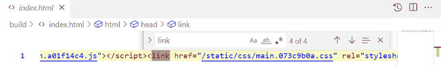
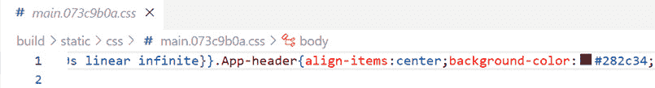
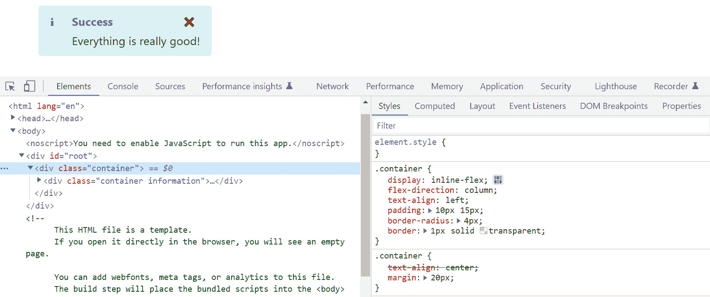
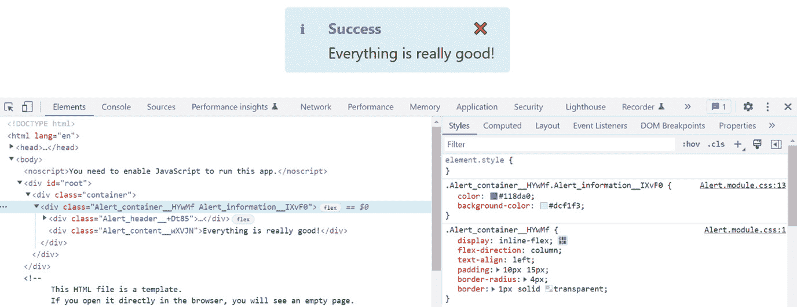
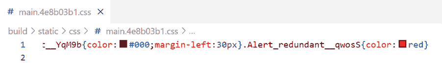
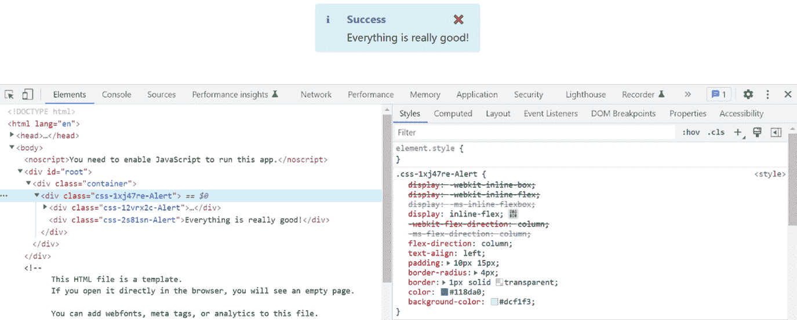
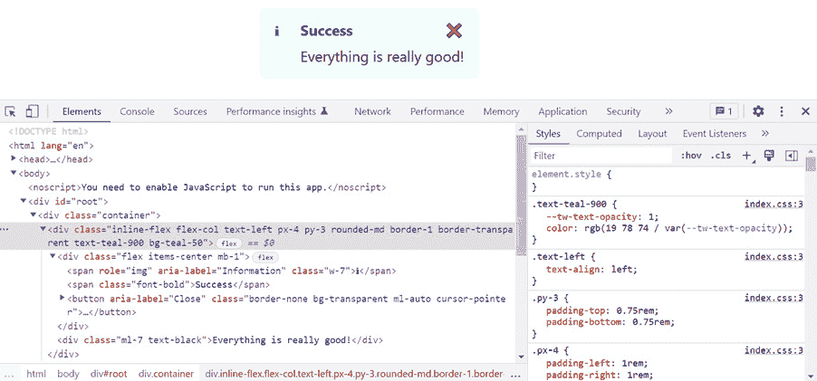
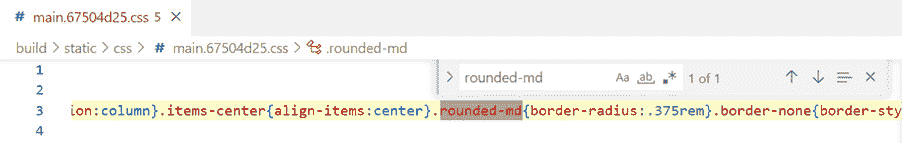

# 5

# 风格化 React 前端的方法

在本章中，我们将使用四种不同的方法来对我们在前几章中工作的警报组件进行样式设计。首先，我们将使用纯 CSS 并了解这种方法的不利之处。然后，我们将转向使用 **CSS 模块**，这将解决纯 CSS 的主要问题。接下来，我们将使用一个名为 Emotion 的 **CSS-in-JS** 库和一个名为 Tailwind CSS 的库，并了解这些库各自的优点。

我们还将学习如何在 React 应用中使用 SVG 并在警报组件的信息和警告图标中使用它们。

我们将涵盖以下主题：

+   使用纯 CSS

+   使用 CSS 模块

+   使用 CSS-in-JS

+   使用 Tailwind CSS

+   使用 SVG

# 技术要求

本章我们将使用以下技术：

+   **浏览器**：一个现代浏览器，如 Google Chrome

+   **Node.js** 和 **npm**：您可以从 [`nodejs.org/en/download/`](https://nodejs.org/en/download/) 安装它们

+   **Visual Studio Code**：您可以从 [`code.visualstudio.com/`](https://code.visualstudio.com/) 安装它

本章中使用的所有代码片段都可以在以下网址找到：[`github.com/PacktPublishing/Learn-React-with-TypeScript-2nd-Edition/tree/main/Chapter5`](https://github.com/PacktPublishing/Learn-React-with-TypeScript-2nd-Edition/tree/main/Chapter5)。

# 使用纯 CSS

我们将从这个部分开始，通过设置一个包含警报组件的 React 和 TypeScript 项目来启动，该组件来自 *第三章**，设置 React 和 TypeScript*。接下来，我们将添加来自 *第三章* 的警报组件，并使用纯 CSS 对其进行样式设计。最后，我们将探讨纯 CSS 的一些挑战，并了解我们如何减轻这些问题。

## 创建项目

我们将使用的是我们在 *第三章* 结尾时完成的项目。您可以在以下位置找到它：[`github.com/PacktPublishing/Learn-React-with-TypeScript-2nd-Edition/tree/main/Chapter3/Section2-Creating-a-project-with-Create-React-App/myapp`](https://github.com/PacktPublishing/Learn-React-with-TypeScript-2nd-Edition/tree/main/Chapter3/Section2-Creating-a-project-with-Create-React-App/myapp)。要本地复制此项目，请执行以下步骤：

1.  在您选择的文件夹中打开 Visual Studio Code。

1.  在终端中运行以下命令以克隆本书的 GitHub 仓库：

    ```js
    git clone https://github.com/PacktPublishing/Learn-React-with-TypeScript-2nd-Edition.git
    ```

1.  在 `Learn-React-with-TypeScript-2nd-Edition\Chapter3\Section2-Creating-a-project-with-Create-React-App\myapp` 子文件夹中重新打开 Visual Studio Code。这包含在 *第三章* 结尾时的项目状态。

1.  运行以下命令以安装所有依赖项：

    ```js
    npm i
    ```

项目现在已设置好。接下来，我们将花一些时间了解如何在 React 组件中使用纯 CSS。

## 理解如何引用 CSS

Create React App 已经在项目中启用了纯 CSS 的使用。实际上，如果你查看 `App.tsx` 文件，它已经使用了纯 CSS：

```js
...
import './App.css';
...
function App() {
  return (
    <div className="App">
      ...
    </div>
  );
}
...
```

从 `App.css` 文件中导入 CSS 样式，并在外部的 `div` 元素上引用 `App` CSS 类。

React 使用 `className` 属性而不是 `class`，因为 `class` 是 JavaScript 中的一个保留字。`className` 属性在转译过程中被转换为 `class` 属性。

CSS 导入语句是 webpack 的一个特性。当 webpack 处理所有文件时，它将包含所有导入的 CSS 到包中。

执行以下步骤以探索项目生成的 CSS 包：

1.  首先，打开并查看 `App.css` 文件。正如我们之前所看到的，`App.css` 在 `App.tsx` 文件中被使用。然而，它包含了一些不再使用的 CSS 类，例如 `App-header` 和 `App-logo`。在我们添加警报组件时，这些类在 `App` 组件中被引用，然后我们移除了它们。保留这些多余的 CSS 类。

1.  打开 `index.tsx` 文件，你会注意到导入了 `index.css`。然而，在这个文件中没有引用任何 CSS 类。如果你打开 `index.css`，你会注意到它只包含针对元素名称的 CSS 规则，而没有 CSS 类。

1.  在终端中运行以下命令以生成生产构建：

    ```js
    npm run build
    ```

几秒钟后，构建工件将出现在项目根目录下的 `build` 文件夹中。

1.  在 `build` 文件夹中打开 `index.html` 并注意所有空白都被移除了，因为它已经针对生产进行了优化。接下来，找到引用 CSS 文件的 `link` 元素，并记下路径 – 它将类似于 `/static/css/main.073c9b0a.css`。



图 5.1 – index.html 中的链接元素

1.  打开引用的 CSS 文件。所有空白都被移除了，因为它已经针对生产进行了优化。注意它包含来自 `index.css` 和 `App.css` 的所有 CSS，包括多余的 `App-header` 和 `App-logo` CSS 类。



图 5.2 – 包含多余的 App-header CSS 类的打包 CSS 文件

这里关键点是 webpack 不会移除任何多余的 CSS – 它将包含所有已导入的 CSS 文件中的所有内容。

接下来，我们将使用纯 CSS 来样式化警报组件。

## 在警报组件中使用纯 CSS

现在我们已经了解了如何在 React 中使用纯 CSS，让我们来样式化警报组件。执行以下步骤：

1.  在 `src` 文件夹中添加一个名为 `Alert.css` 的 CSS 文件。这个文件可以在 GitHub 上找到：[`github.com/PacktPublishing/Learn-React-with-TypeScript-2nd-Edition/blob/main/Chapter5/Section1-Using-plain-CSS/app/src/Alert.css`](https://github.com/PacktPublishing/Learn-React-with-TypeScript-2nd-Edition/blob/main/Chapter5/Section1-Using-plain-CSS/app/src/Alert.css) 以便复制。

1.  我们将逐步添加 CSS 类，并理解每个类中的样式。首先，在 `Alert.css` 中添加一个 `container` 类：

    ```js
    .container {
    ```

    ```js
      display: inline-flex;
    ```

    ```js
      flex-direction: column;
    ```

    ```js
      text-align: left;
    ```

    ```js
      padding: 10px 15px;
    ```

    ```js
      border-radius: 4px;
    ```

    ```js
      border: 1px solid transparent;
    ```

    ```js
    }
    ```

这将在外部的 `div` 元素上使用。样式使用内联 flexbox，项目垂直流动并左对齐。我们还添加了一个漂亮的圆角边框以及在边框和子元素之间的少量填充。

1.  在 `container` 中添加以下额外的类，这些类可以在其中使用：

    ```js
    .container.warning {
    ```

    ```js
      color: #e7650f;
    ```

    ```js
      background-color: #f3e8da;
    ```

    ```js
    }
    ```

    ```js
    .container.information {
    ```

    ```js
      color: #118da0;
    ```

    ```js
      background-color: #dcf1f3;
    ```

    ```js
    }
    ```

我们将使用这些类为不同类型的 alert 添加适当的颜色。

1.  为头部容器元素添加以下类：

    ```js
    .header {
    ```

    ```js
      display: flex;
    ```

    ```js
      align-items: center;
    ```

    ```js
      margin-bottom: 5px;
    ```

    ```js
    }
    ```

这将应用于包含图标、标题和关闭按钮的元素。它使用一个水平流动的 flexbox，子元素垂直居中。它还在 alert 消息之前添加了一个小的间隙。

1.  现在为图标添加以下类，使其宽度为 30 像素：

    ```js
    .header-icon {
    ```

    ```js
      width: 30px;
    ```

    ```js
    }
    ```

1.  接下来，添加以下类以应用于标题，使其加粗：

    ```js
    .header-text {
    ```

    ```js
      font-weight: bold;
    ```

    ```js
    }
    ```

1.  添加以下类以应用于关闭按钮：

    ```js
    .close-button {
    ```

    ```js
      border: none;
    ```

    ```js
      background: transparent;
    ```

    ```js
      margin-left: auto;
    ```

    ```js
      cursor: pointer;
    ```

    ```js
    }
    ```

这移除了边框和背景。它还将按钮对齐到标题的右侧，并给它一个指针鼠标光标。

1.  为内容元素添加以下类：

    ```js
    .content {
    ```

    ```js
      margin-left: 30px;
    ```

    ```js
      color: #000;
    ```

    ```js
    }
    ```

这添加了一个左外边距，使消息水平与标题对齐，并将文本颜色设置为黑色。

这完成了所有的 CSS 类定义。

1.  打开 `Alert.tsx` 并为刚刚创建的 CSS 文件添加一个导入语句：

    ```js
    import './Alert.css';
    ```

1.  现在我们将在 alert 组件的元素中引用我们刚刚创建的 CSS 类。在 alert JSX 中添加以下高亮的 CSS 类名引用来完成此操作：

    ```js
    <div className={`container ${type}`}>
    ```

    ```js
      <div className="header">
    ```

    ```js
        <span
    ```

    ```js
          ...
    ```

    ```js
          className="header-icon"
    ```

    ```js
        >
    ```

    ```js
          {type === "warning" ? "⚠" : "ℹ"}
    ```

    ```js
        </span>
    ```

    ```js
        <span className="header-text">{heading}</span>
    ```

    ```js
      </div>
    ```

    ```js
      {closable && (
    ```

    ```js
        <button
    ```

    ```js
          ...
    ```

    ```js
          className="close-button"
    ```

    ```js
        >
    ```

    ```js
          ...
    ```

    ```js
        </button>
    ```

    ```js
      )}
    ```

    ```js
      <div className="content">{children}</div>
    ```

    ```js
    </div>
    ```

现在 alert 组件中的元素正在通过导入的 CSS 文件中的 CSS 类进行样式化。

1.  将关闭按钮移动到位于头部容器内部，在 `header` 元素下方：

    ```js
    <div className={`container ${type}`}>
    ```

    ```js
      <div className="header">
    ```

    ```js
        ...
    ```

    ```js
        <span className="header-text">{heading}</span>
    ```

    ```js
        {closable && (
    ```

    ```js
          <button
    ```

    ```js
            aria-label="Close"
    ```

    ```js
            onClick={handleCloseClick}
    ```

    ```js
            className="close-button"
    ```

    ```js
          >
    ```

    ```js
            <span role="img" aria-label="Close">
    ```

    ```js
    ❌
    ```

    ```js
            </span>
    ```

    ```js
          </button>
    ```

    ```js
        )}
    ```

    ```js
      </div>
    ```

    ```js
      <div className="content">{children}</div>
    ```

    ```js
    </div>;
    ```

1.  通过在终端中运行 `npm start` 启动应用在开发模式下。

几秒钟后，改进的 alert 组件将在浏览器中显示：


图 5.3 – 使用纯 CSS 样式的 alert 组件

这完成了 alert 组件的样式，但让我们继续，以便我们可以观察到纯 CSS 的一个缺点。

## 经历 CSS 冲突

我们现在将看到一个 CSS 与不同组件冲突的例子。保持应用在开发模式下运行，然后按照以下步骤操作：

1.  打开 `App.tsx` 并将 `div` 元素上引用的 CSS 类从 `App` 更改为 `container`：

    ```js
    <div className="container">
    ```

    ```js
      <Alert ...>
    ```

    ```js
        ...
    ```

    ```js
      </Alert>
    ```

    ```js
    </div>
    ```

1.  打开 `App.css` 并将 `App` CSS 类重命名为 `container`，并为其添加 `20px` 的填充：

    ```js
    .container {
    ```

    ```js
      text-align: center;
    ```

    ```js
      padding: 20px;
    ```

    ```js
    }
    ```

1.  现在，查看正在运行的应用程序，并注意警报不再在页面上水平居中。使用浏览器 DevTools 检查元素。如果你检查 `App` 组件中的 `div` 元素，你会看到来自警报组件中 `container` CSS 类的样式也应用到了它上面，以及我们刚刚添加的 `container` CSS 类。因此，`text-align` CSS 属性是 `left` 而不是 `center`。



图 5.4 – CSS 类冲突

1.  在继续之前，通过按 *Ctrl* + *C* 停止运行的应用程序。

这里关键点是，纯 CSS 类的作用域是整个应用程序，而不仅仅是导入的文件。这意味着如果 CSS 类有相同的名称，它们可能会发生冲突，正如我们刚才所经历的。

解决 CSS 冲突的一个方法是仔细命名，在 `App` 组件中使用 `container` 可以命名为 `App__container`，而在 `Alert` 组件中的 `container` 可以命名为 `Alert__container`。然而，这需要开发团队所有成员的自律。

注意

**BEM** 代表 **Block**（块）、**Element**（元素）、**Modifier**（修饰符），是 CSS 类名的一个流行命名约定。更多信息可以在以下链接中找到：[`css-tricks.com/bem-101/`](https://css-tricks.com/bem-101/)。

这里是对本节内容的快速回顾：

+   Create React App 配置 webpack 以处理 CSS，以便 CSS 文件可以导入到 React 组件文件中

+   导入的 CSS 文件中的所有样式都应用于应用程序 – 没有作用域或删除冗余样式

接下来，我们将学习一种不会在组件间出现 CSS 冲突的样式方法。

# 使用 CSS 模块

在本节中，我们将学习一种称为 **CSS 模块** 的 React 应用程序样式方法。我们将首先了解 CSS 模块，然后我们将使用它们在我们的警报组件中。

## 理解 CSS 模块

CSS modules 是一个开源库，可在 GitHub 上找到 [`github.com/css-modules/css-modules`](https://github.com/css-modules/css-modules)，它可以添加到 webpack 处理中，以方便 CSS 类名的自动作用域。

CSS 模块是一个 CSS 文件，就像在上一节中一样；然而，文件名有一个 `.module.css` 扩展名而不是 `.css`。这个特殊的扩展名允许 webpack 区分 CSS 模块文件和纯 CSS 文件，以便可以对其进行不同的处理。

CSS 模块文件可以按照以下方式导入到 React 组件文件中：

```js
import styles from './styles.module.css';
```

这与导入纯 CSS 的语法类似，但定义了一个变量来保存 CSS 类名映射信息。在前面的代码片段中，CSS 类名信息被导入到一个名为 `styles` 的变量中，但变量名可以是任何我们选择的。

CSS 类名映射信息变量是一个包含与 CSS 类名对应的属性名的对象。每个类名属性包含一个用于 React 组件的作用域类名值。以下是将导入到名为 `MyComponent` 的组件中的映射对象的一个示例：

```js
{
  container: "MyComponent_container__M7tzC",
  error: "MyComponent_error__vj8Oj"
}
```

作用域 CSS 类名以组件文件名开头，然后是原始 CSS 类名，接着是一个随机字符串。这种命名结构防止类名冲突。

CSS 模块中的样式在组件的 `className` 属性中如下引用：

```js
<span className={styles.error}>A bad error</span>
```

元素上的 CSS 类名将解析为作用域类名。在上面的代码片段中，`styles.error` 将解析为 `MyComponent_error__ vj8Oj`。因此，运行中的应用中的样式将是作用域样式名称，而不是原始类名。

使用 Create React App 创建的项目已经安装并配置了 CSS 模块和 webpack。这意味着我们不需要安装 CSS 模块就可以在我们的项目中开始使用它们。

接下来，我们将在我们工作的警报组件中使用 CSS 模块。

## 在警报组件中使用 CSS 模块

现在我们已经理解了 CSS 模块，让我们在警报组件中使用它们。执行以下步骤：

1.  首先将 `Alert.css` 重命名为 `Alert.module.css`；现在这个文件可以作为 CSS 模块使用。

1.  打开 `Alert.module.css` 并将 CSS 类名更改为驼峰式而不是中划线式。这将使我们能够更容易地在组件中引用作用域 CSS 类名 – 例如，`styles.headerText` 而不是 `styles["header-text"]`。更改如下：

    ```js
    …
    ```

    ```js
    .headerIcon {
    ```

    ```js
      ...
    ```

    ```js
    }
    ```

    ```js
    .headerText {
    ```

    ```js
      ...
    ```

    ```js
    }
    ```

    ```js
    .closeButton {
    ```

    ```js
      ...
    ```

    ```js
    }
    ```

1.  现在，打开 `Alert.tsx` 并将 CSS 导入语句更改为如下导入 CSS 模块：

    ```js
    import styles from './Alert.module.css';
    ```

1.  在 JSX 中，更改类名引用以使用 CSS 模块的 scoped 名称：

    ```js
    <div className={`${styles.container} ${styles[type]}`}>
    ```

    ```js
      <div className={styles.header}>
    ```

    ```js
        <span
    ```

    ```js
          ...
    ```

    ```js
          className={styles.headerIcon}
    ```

    ```js
        >
    ```

    ```js
          {type === "warning" ? "⚠" : "ℹ"}
    ```

    ```js
        </span>
    ```

    ```js
        {heading && (
    ```

    ```js
          <span className={styles.headerText}>{heading}</        span>
    ```

    ```js
        )}
    ```

    ```js
        {closable && (
    ```

    ```js
          <button
    ```

    ```js
            ...
    ```

    ```js
            className={styles.closeButton}
    ```

    ```js
          >
    ```

    ```js
            ...
    ```

    ```js
          </button>
    ```

    ```js
        )}
    ```

    ```js
      </div>
    ```

    ```js
      <div className={styles.content}>{children}</div>
    ```

    ```js
    </div>
    ```

1.  通过在终端中运行 `npm start` 来启动应用。

几秒钟后，样式化的警报将出现。这次警报将水平居中，这是样式不再冲突的标志。

1.  使用浏览器的 DevTools 检查 DOM 中的元素。你会看到警报组件现在正在使用作用域 CSS 类名。这意味着警报容器样式不再与应用容器样式冲突。



图 5.5 – CSS 模块作用域的类名

1.  在继续之前，通过按 *Ctrl* + *C* 停止运行中的应用。

1.  为了完善我们对 CSS 模块的理解，让我们看看生产构建中的 CSS 会发生什么。然而，在我们这样做之前，让我们在 `Alert.module.css` 的底部添加一个冗余的 CSS 类：

    ```js
    ...
    ```

    ```js
    .content {
    ```

    ```js
      margin-left: 30px;
    ```

    ```js
      color: #000;
    ```

    ```js
    }
    ```

    ```js
    .redundant {
    ```

    ```js
      color: red;
    ```

    ```js
    }
    ```

1.  现在，通过在终端中执行 `npm run build` 来创建生产构建。

几秒钟后，在 `build` 文件夹中创建构建工件。

1.  打开捆绑的 CSS 文件，你会注意到以下要点：

    +   它包含来自 `index.css`、`App.css` 和我们刚刚创建的 CSS 模块的所有 CSS。

    +   CSS 模块中的类名具有作用域。这将确保生产环境中的样式不会冲突，就像开发模式中那样。

    +   它包含来自 CSS 模块的冗余 CSS 类名。



图 5.6 – 包含在 CSS 包中的冗余 CSS 类

这样就完成了将警报组件重构为使用 CSS 模块的过程。

注意

更多关于 CSS 模块的信息，请访问 GitHub 仓库 [`github.com/css-modules/css-modules`](https://github.com/css-modules/css-modules)。

这里是对我们关于 CSS 模块所学内容的回顾：

+   CSS 模块允许 CSS 类名自动作用域到 React 组件上。这防止了不同 React 组件的样式冲突。

+   CSS 模块不是浏览器标准功能；相反，它是一个开源库，可以添加到 webpack 流程中。

+   在使用 Create React App 创建的项目中，CSS 模块是预安装和预配置的。

+   与纯 CSS 类似，冗余的 CSS 类不会从生产 CSS 包中删除。

接下来，我们将学习另一种为 React 应用程序添加样式的途径。

# 使用 CSS-in-JS

在本节中，我们首先理解 CSS-in-JS 及其优点。然后，我们将重构我们使用的警报组件以实现 CSS-in-JS，并观察它与 CSS 模块的不同之处。

## 理解 CSS-in-JS

CSS-in-JS 不是浏览器功能，甚至不是一个特定的库 – 而是一种库类型。CSS-in-JS 库的流行例子有 **styled-components** 和 **Emotion**。styled-components 和 Emotion 之间没有显著差异 – 它们都非常流行，并且具有相似的 API。我们将在本章中使用 Emotion。

情感生成的是具有作用域的样式，类似于 CSS 模块。然而，你是在 JavaScript 中而不是在 CSS 文件中编写 CSS，因此得名 *CSS-in-JS*。实际上，你可以直接在 JSX 元素上编写 CSS，如下所示：

```js
<span
  css={css`
    font-weight: 700;
    font-size: 14;
  `}
>
  {text}
</span>
```

每个 CSS-in-JS 库的语法略有不同 – 以下示例是来自 Emotion 样式的代码片段。

将样式直接放在组件上允许开发者完全理解组件，而无需访问另一个文件。这显然会增加文件大小，可能会使代码更难阅读。然而，可以通过将子组件识别并从文件中提取出来来减轻大文件大小。或者，可以将样式从组件文件中提取到一个导入的 JavaScript 函数中。

CSS-in-JS 的一个巨大好处是你可以将逻辑混合到样式之中，这对于高度交互的应用程序非常有用。以下示例包含一个依赖于 `important` 属性的 `font-weight` 条件和依赖于 `mobile` 属性的 `font-size` 条件：

```js
<span
  css={css`
    font-weight: ${important ? 700 : 400};
    font-size: ${mobile ? 15 : 14};
  `}
>
  {text}
</span>
```

使用 JavaScript 字符串插值来定义条件语句。

相当于纯 CSS 的示例可能类似于以下示例，为不同的条件创建单独的 CSS 类：

```js
<span
  className={`${important ? "text-important" : ""} ${
    mobile ? "text-important" : ""
  }`}
>
  {text}
</span>
```

如果一个元素的样式高度条件化，那么 CSS-in-JS 可能更容易阅读，当然也更容易编写。

接下来，我们将在我们工作的警报组件中使用 Emotion。

## 在警报组件中使用情感

现在我们已经了解了 CSS-in-JS，让我们在警报组件中使用 Emotion。为此，执行以下步骤。所有使用的代码片段都可以在 [`github.com/PacktPublishing/Learn-React-with-TypeScript-2nd-Edition/blob/main/Chapter5/Section3-Using-CSS-in-JS/app/src/Alert.tsx`](https://github.com/PacktPublishing/Learn-React-with-TypeScript-2nd-Edition/blob/main/Chapter5/Section3-Using-CSS-in-JS/app/src/Alert.tsx) 找到：

1.  Create React App 没有安装和设置 Emotion，因此我们首先需要安装 Emotion。在终端中运行以下命令：

    ```js
    npm i @emotion/react
    ```

这将需要几秒钟的时间来安装。

1.  打开 `Alert.tsx` 并删除 CSS 模块导入。

1.  在文件顶部添加对 Emotion 的 `css` 属性的导入，并添加一个特殊注释：

    ```js
    /** @jsxImportSource @emotion/react */
    ```

    ```js
    import { css } from '@emotion/react';
    ```

    ```js
    import { useState } from 'react';
    ```

这个特殊注释将 JSX 元素转换为使用 Emotion 的 `jsx` 函数进行转换，而不是使用 React 的 `createElement` 函数。Emotion 的 `jsx` 函数为包含 Emotion 的 `css` 属性的元素添加样式。

1.  在 JSX 中，我们需要将所有的 `className` 属性替换为等效的 Emotion `css` 属性。样式基本上与我们之前创建的 CSS 文件中定义的相同，所以解释不会重复。

我们将一次样式化一个元素，从外部的 `div` 元素开始：

```js
<div
  css={css`
    display: inline-flex;
    flex-direction: column;
    text-align: left;
    padding: 10px 15px;
    border-radius: 4px;
    border: 1px solid transparent;
    color: ${type === "warning" ? "#e7650f" : "#118da0"};
    background-color: ${type === "warning"
      ? "#f3e8da"
      : "#dcf1f3"};
  `}
>
  ...
</div>
```

在这个代码片段中有几个重要的点需要解释：

+   `css` 属性通常不在 JSX 元素上有效。文件顶部的特殊注释 (`/** @jsxImportSource @emotion/react */`) 允许这样做。

+   在这种情况下，`css` 属性被设置为 `css`。有关标签模板字面量的更多信息，请参阅 [`developer.mozilla.org/en-US/docs/Web/JavaScript/Reference/Template_literals`](https://developer.mozilla.org/en-US/docs/Web/JavaScript/Reference/Template_literals)。

+   标签模板字面量在运行时将样式转换为 CSS 类。我们将在 *步骤 14* 中验证这一点。

+   使用字符串插值来实现颜色的条件样式。记住，我们不得不使用纯 CSS 或 CSS 模块定义三个 CSS 类。这个 CSS-in-JS 版本可能更易于阅读，当然也更简洁。

1.  接下来，设置头部容器的样式：

    ```js
    <div
    ```

    ```js
      css={css`
    ```

    ```js
        display: flex;
    ```

    ```js
        align-items: center;
    ```

    ```js
        margin-bottom: 5px;
    ```

    ```js
      `}
    ```

    ```js
    >
    ```

    ```js
      <span role="img" ... > ... </span>
    ```

    ```js
      <span ...>{heading}</span>
    ```

    ```js
      {closable && ...}
    ```

    ```js
    </div>
    ```

1.  接下来，按照以下方式设置图标样式：

    ```js
    <span
    ```

    ```js
      role="img"
    ```

    ```js
      aria-label={type === "warning" ? "Warning" :     "Information"}
    ```

    ```js
      css={css`
    ```

    ```js
        width: 30px;
    ```

    ```js
      `}
    ```

    ```js
    >
    ```

    ```js
      {type === "warning" ? "⚠" : "ℹ"}
    ```

    ```js
    </span>
    ```

1.  然后，按照以下方式设置标题样式：

    ```js
    <span
    ```

    ```js
      css={css`
    ```

    ```js
        font-weight: bold;
    ```

    ```js
      `}
    ```

    ```js
    >
    ```

    ```js
      {heading}
    ```

    ```js
    </span>
    ```

1.  现在，按照以下方式设置关闭按钮样式：

    ```js
    {closable && (
    ```

    ```js
      <button
    ```

    ```js
        ...
    ```

    ```js
        css={css`
    ```

    ```js
          border: none;
    ```

    ```js
          background: transparent;
    ```

    ```js
          margin-left: auto;
    ```

    ```js
          cursor: pointer;
    ```

    ```js
        `}
    ```

    ```js
      >
    ```

    ```js
        ...
    ```

    ```js
      </button>
    ```

    ```js
    )}
    ```

1.  最后，按照以下方式设置消息容器样式：

    ```js
    <div
    ```

    ```js
      css={css`
    ```

    ```js
        margin-left: 30px;
    ```

    ```js
        color: #000;
    ```

    ```js
      `}
    ```

    ```js
    >
    ```

    ```js
      {children}
    ```

    ```js
    </div>
    ```

1.  在终端中运行 `npm start` 来启动应用程序。警报组件将像之前一样出现。

1.  使用浏览器的开发者工具检查 DOM 中的元素。警报组件使用范围 CSS 类名，类似于 CSS 模块：



图 5.7 – Emotion 的作用域类名

1.  在继续之前，通过按*Ctrl* + *C*停止运行中的应用程序。

1.  为了完善我们对 Emotion 的理解，让我们看看生产构建中的 CSS 会发生什么。首先，通过在终端中执行`npm run build`来创建生产构建。

几秒钟后，构建工件将在`build`文件夹中创建。

1.  打开`build/static/css`文件夹中的捆绑 CSS 文件。注意，Emotion 样式不在其中。这是因为 Emotion 通过 JavaScript 在运行时生成样式，而不是在构建时。如果你这么想，样式不能在构建时生成，因为它们可能依赖于仅在运行时才知道值的 JavaScript 变量。

这完成了对警报组件的重构，以使用 CSS-in-JS。

注意

更多关于 emotion 的信息，请访问他们的网站[`emotion.sh/docs/introduction`](https://emotion.sh/docs/introduction)。

这是关于 Emotion 和 CSS-in-JS 我们所学的总结：

+   CSS-in-JS 库的样式是在 JavaScript 中定义的，而不是在 CSS 文件中。

+   Emotion 的样式可以直接在 JSX 元素上使用`css`属性定义。

+   一个巨大的好处是可以在样式上直接添加条件逻辑，这有助于我们更快地设置交互式组件的样式。

+   由于 Emotion 的样式依赖于 JavaScript 变量，它们在运行时而不是在构建时应用，这允许优雅地定义条件样式逻辑，但也意味着会有轻微的性能损失，因为样式是在运行时创建和应用的。

接下来，我们将了解另一种不同的方法来设置 React 前端。

# 使用 Tailwind CSS

在本节中，我们将首先理解 Tailwind CSS 及其优势。然后，我们将重构我们一直在使用的警报组件，以使用 Tailwind，并观察它与我们所尝试的其他方法有何不同。

## 理解 Tailwind CSS

Tailwind 是一组预构建的 CSS 类，可用于设置应用程序的样式。它被称为**实用优先 CSS 框架**，因为预构建的类可以被视为灵活的实用工具。

以下是一个 CSS 类的示例：`bg-white`，它将元素的背景设置为白色 – *bg*是*background*的缩写。另一个例子是`bg-orange-500`，它将背景颜色设置为橙色的 500 号色调。Tailwind 包含一个很棒的颜色调色板，可以进行自定义。

可以组合使用实用类来设置元素的样式。以下示例展示了如何在 JSX 中设置按钮元素的样式：

```js
<button className="border-none rounded-md bg-emerald-700 text-white cursor-pointer">
  ...
</button>
```

下面是对前面示例中使用的类的解释：

+   `border-none`移除元素的边框。

+   `rounded-md`使元素的边框圆角。*md*代表*medium*。也可以使用*lg*（大型）或甚至*full*，以获得更圆的边框。

+   `bg-emerald-700`将元素的背景颜色设置为翡翠色的 700 号色调。

+   `text-white`将元素的文本颜色设置为白色。

+   `cursor-pointer`将元素的指针设置为指针。

实用类是低级别的，专注于样式化非常具体的东西。这使得类具有灵活性，允许它们高度可重用。

Tailwind 可以通过在类名前加上 `hover:` 来指定当元素处于悬停状态时应应用该类。以下示例在悬停时将按钮背景设置为更深的翡翠色：

```js
<button className="md border-none rounded-md bg-emerald-700 text-white cursor-pointer hover:bg-emerald-800">
  ...
</button>
```

因此，Tailwind 的一个关键点是，我们不会为每个想要样式的元素编写新的 CSS 类 - 相反，我们使用大量经过深思熟虑的现有类。这种方法的优点是它有助于使应用程序看起来既美观又一致。

注意

关于 Tailwind 的更多信息，请参阅以下链接的网站：[`tailwindcss.com/`](https://tailwindcss.com/)。Tailwind 网站是搜索和理解所有可用实用类的一个关键资源。

接下来，我们将安装和配置 Tailwind，用于包含我们一直在工作的警报组件的项目。

## 安装和配置 Tailwind CSS

现在我们已经了解了 Tailwind，让我们在警报组件项目中安装和配置它。为此，执行以下步骤：

1.  在 Visual Studio 项目中，首先通过在终端运行以下命令来安装 Tailwind：

    ```js
    npm i -D tailwindcss
    ```

Tailwind 库作为开发依赖项安装，因为它在运行时不是必需的。

1.  Tailwind 通过使用名为 **PostCSS** 的库集成到 Create React App 项目中。PostCSS 是一个使用 JavaScript 转换 CSS 的工具，Tailwind 作为插件在其中运行。通过在终端运行以下命令来安装 PostCSS：

    ```js
    npm i -D postcss
    ```

1.  Tailwind 还推荐另一个名为 **Autoprefixer** 的 PostCSS，它为 CSS 添加供应商前缀。通过在终端运行以下命令来安装它：

    ```js
    npm i -D autoprefixer
    ```

1.  接下来，在终端运行以下命令以生成 Tailwind 和 PostCSS 的配置文件：

    ```js
    npx tailwindcss init -p
    ```

几秒钟后，将创建两个配置文件。Tailwind 配置文件名为 `tailwind.config.js`，PostCSS 配置文件名为 `postcss.config.js`。

1.  打开 `tailwind.config.js` 并指定 React 组件的路径如下：

    ```js
    module.exports = {
    ```

    ```js
      content: [
    ```

    ```js
        './src/**/*.{js,jsx,ts,tsx}'
    ```

    ```js
      ],
    ```

    ```js
      theme: {
    ```

    ```js
        extend: {},
    ```

    ```js
      },
    ```

    ```js
      plugins: [],
    ```

    ```js
    }
    ```

1.  现在，打开 `src` 文件夹中的 `index.css` 并在文件顶部添加以下三行：

    ```js
    @tailwind base;
    ```

    ```js
    @tailwind components;
    ```

    ```js
    @tailwind utilities;
    ```

这些被称为 **指令**，将在构建过程中生成 Tailwind 所需的 CSS。

Tailwind 已安装并准备好使用。

接下来，我们将使用 Tailwind 为我们一直在工作的警报组件进行样式设计。

## 使用 Tailwind CSS

现在，让我们使用 Tailwind 为警报组件进行样式设计。我们将删除 emotion 的 `css` JSX 属性，并在 JSX 的 `className` 属性中使用 Tailwind 实用类名。为此，执行以下步骤：

1.  打开 `Alert.tsx` 并从删除文件顶部的特殊 emotion 注释和 `css` 导入语句开始。

1.  将最外层 `div` 元素的 `css` 属性替换为 `className` 属性，如下所示：

    ```js
    <div
    ```

    ```js
      className={`inline-flex flex-col text-left px-4 py-3     rounded-md border-1 border-transparent`}
    ```

    ```js
    >
    ```

    ```js
      ...
    ```

    ```js
    </div>
    ```

这里是刚刚使用的工具类的解释：

+   `inline-flex` 和 `flex-col` 创建一个垂直流动的内联弹性盒子

+   `text-left` 将项目对齐到左侧

+   `px-4` 添加了 4 个间距单位的左右填充

+   `py-3` 添加了顶部和底部 3 个间距单位的填充

+   我们之前遇到过 `rounded-md` —— 这会使 `div` 元素的角落变得圆滑

+   `border-1` 和 `border-transparent` 添加了一个透明的 1 像素边框

注意

间距单位在 Tailwind 中定义，是一个比例刻度。一个间距单位等于 `0.25rem`，大约等于 `4px`。

1.  仍然在最外层的 `div` 元素上，使用字符串插值添加以下条件样式：

    ```js
    <div
    ```

    ```js
      className={`inline-flex flex-col text-left px-4 py-3 rounded-md border-1 border-transparent ${
    ```

    ```js
        type === 'warning' ? 'text-amber-900' : 'text-      teal-900'
    ```

    ```js
      } ${type === 'warning' ? 'bg-amber-50' : 'bg-teal-    50'}`}
    ```

    ```js
    >
    ```

    ```js
      ...
    ```

    ```js
    </div>
    ```

文本颜色设置为 900 琥珀色调用于警告警报，900 蓝绿色调用于信息警报。背景颜色设置为 50 琥珀色调用于警告警报，50 蓝绿色调用于信息警报。

1.  接下来，将标题容器的 `css` 属性替换为 `className` 属性，如下所示：

    ```js
    <div className="flex items-center mb-1">
    ```

    ```js
      <span role="img" ... > ... </span>
    ```

    ```js
      <span ... >{heading}</span>
    ```

    ```js
      {closable && ...}
    ```

    ```js
    </div>
    ```

这里是刚刚使用的工具类的解释：

+   `flex` 和 `items-center` 创建了一个水平流动的弹性盒子，其中项目垂直居中

+   `mb-1` 在元素的底部添加了 1 个间距单位边距

1.  将图标上的 `css` 属性替换为 `className` 属性，如下所示：

    ```js
    <span role="img" ... className="w-7">
    ```

    ```js
      {type === 'warning' ? '⚠' : 'ℹ'}
    ```

    ```js
    </span>
    ```

`w-7` 将元素宽度设置为 7 个间距单位。

1.  将标题上的 `css` 属性替换为 `className` 属性，如下所示：

    ```js
    <span className="font-bold">{heading}</span>
    ```

`font-bold` 将元素的字体重量设置为粗体。

1.  将关闭按钮上的 `css` 属性替换为 `className` 属性，如下所示：

    ```js
    {closable && (
    ```

    ```js
      <button
    ```

    ```js
        ...
    ```

    ```js
        className="border-none bg-transparent ml-auto cursor-      pointer"
    ```

    ```js
      >
    ```

    ```js
        ...
    ```

    ```js
      </button>
    ```

    ```js
    )}
    ```

在这里，`border-none` 移除了元素边框，`bg-transparent` 使元素背景透明。`ml-auto` 将左边距设置为自动，使元素右对齐。`cursor-pointer` 将鼠标光标设置为指针。

1.  最后，将消息容器的 `css` 属性替换为 `className` 属性，如下所示：

    ```js
    <div className="ml-7 text-black">
    ```

    ```js
      {children}
    ```

    ```js
    </div>
    ```

`ml-7` 将元素左边缘设置为 7 个间距单位，`text-black` 将文本颜色设置为黑色。

1.  通过在终端中运行 `npm start` 来运行应用程序。几秒钟后，应用程序将在浏览器中显示。

注意，由于 Tailwind 的默认颜色方案和一致的间距，警报组件看起来更美观。

1.  使用浏览器的 DevTools 检查 DOM 中的元素。注意使用的 Tailwind 工具类，并注意间距单位使用 CSS rem 单位。

一个需要注意的关键点是，没有发生 CSS 类名作用域。不需要任何作用域，因为类是通用的和可重用的，而不是特定于任何元素。



图 5.8 – 使用 Tailwind 定制的警报

1.  在继续之前，通过按 *Ctrl* + *C* 停止运行应用程序。

1.  为了结束我们对 Tailwind 的理解，让我们看看生产构建中的 CSS 会发生什么。首先，通过在终端中执行 `npm run build` 来创建一个生产构建。

几秒钟后，构建工件将在 `build` 文件夹中创建。

1.  从 `build/static/css` 文件夹打开打包的 CSS 文件。注意文件开头的基 Tailwind 样式。你还会看到我们使用的所有 Tailwind 类都包含在这个文件中。



图 5.9 – 打包的 CSS 文件中的 Tailwind CSS 类

注意

一个重要的观点是 Tailwind 不会添加所有它的 CSS 类——那样会产生一个巨大的 CSS 文件！相反，它只添加在应用中使用的 CSS 类。

这就完成了将警报组件重构为使用 Tailwind 的过程。

这里是对我们关于 Tailwind 学习的回顾：

+   Tailwind 是一组经过深思熟虑的可重用 CSS 类集合，可以应用于 React 元素。

+   Tailwind 有一个不错的默认调色板和 4 像素的间距刻度，这两者都可以自定义。

+   Tailwind 是一个 PostCSS 插件，在构建时执行。

+   与 Emotion 不同，Tailwind 不会产生运行时性能惩罚，因为样式不是在运行时创建和应用的。

+   只有在 React 元素上使用的类才包含在 CSS 构建包中。

接下来，我们将使警报组件中的图标看起来更美观。

# 使用 SVG

在本节中，我们将学习如何在 React 中使用 SVG 文件以及如何将它们用于警报组件的图标。

## 理解如何在 React 中使用 SVG

**SVG** 代表 **可缩放矢量图形**，它由基于数学公式的点、线、曲线和形状组成，而不是特定的像素。这使得它们在缩放时不会扭曲。图标的品质对于正确呈现非常重要——如果它们被扭曲，会使整个应用感觉不专业。在现代网络开发中，使用 SVG 为图标是很常见的。

Create React App 在创建项目时配置 webpack 使用 SVG 文件。实际上，`logo.svg` 在模板 `App` 组件中被引用，如下所示：

```js
import logo from './logo.svg';
...
function App() {
  return (
    <div className="App">
      <header className="App-header">
        
        ...
      </header>
    </div>
  );
}
export default App;
```

在前面的示例中，`logo` 被导入为 SVG 文件的路径，然后用于 `img` 元素的 `src` 属性以显示 SVG。

另一种引用 SVG 的方法是将其作为组件引用，如下所示：

```js
import { ReactComponent as Logo } from './logo.svg';
function SomeComponent() {
  return (
    <div>
      <Logo />
    </div>
  );
}
```

SVG React 组件在名为 `ReactComponent` 的命名导入中可用。在前面的示例中，SVG 组件被别名 `Logo`，然后在 JSX 中使用。

接下来，我们将学习如何在警报组件中使用 SVG。

## 将 SVG 添加到警报组件

执行以下步骤以将警报组件中的表情符号图标替换为 SVG：

1.  首先，在 `src` 文件夹中创建三个名为 `cross.svg`、`info.svg` 和 `warning.svg` 的文件。然后，从 GitHub 仓库 [`github.com/PacktPublishing/Learn-React-with-TypeScript-2nd-Edition/tree/main/Chapter5/Section5-Using-SVGs/app/src`](https://github.com/PacktPublishing/Learn-React-with-TypeScript-2nd-Edition/tree/main/Chapter5/Section5-Using-SVGs/app/src) 复制并粘贴这些文件的内容。

1.  打开 `Alert.tsx` 并添加以下导入语句以将 SVG 作为 React 组件导入：

    ```js
    import { ReactComponent as CrossIcon } from './cross.svg';
    ```

    ```js
    import { ReactComponent as InfoIcon } from './info.svg';
    ```

    ```js
    import { ReactComponent as WarningIcon } from './warning.svg';
    ```

我们已经为 SVG 组件赋予了适当的别名。

1.  更新包含表情符号图标的 `span` 元素，以使用以下 SVG 图标组件：

    ```js
    <span
    ```

    ```js
      role="img"
    ```

    ```js
      aria-label={type === 'warning' ? 'Warning' :     'Information'}
    ```

    ```js
      className="inline-block w-7"
    ```

    ```js
    >
    ```

    ```js
      {type === 'warning ' ? (
    ```

    ```js
        <WarningIcon className="fill-amber-900 w-5 h-5" />
    ```

    ```js
      ) : (
    ```

    ```js
        <InfoIcon className="fill-teal-900 w-5 h-5" />
    ```

    ```js
      )}
    ```

    ```js
    </span>;
    ```

我们已经使用 Tailwind 适当地调整了图标的大小和颜色。

1.  接下来，更新表情符号关闭图标为以下 SVG 关闭图标：

    ```js
    <button
    ```

    ```js
      aria-label="Close"
    ```

    ```js
      onClick={handleCloseClick}
    ```

    ```js
      className="border-none bg-transparent ml-auto cursor-    pointer"
    ```

    ```js
    >
    ```

    ```js
      <CrossIcon />
    ```

    ```js
    </button>
    ```

1.  通过在终端中运行 `npm start` 来运行应用程序。几秒钟后，应用程序将以包含改进的警报组件的浏览器形式出现：


图 5.10 – 带有 SVG 图标的警报

这就完成了警报组件——它现在看起来好多了。

下面是关于在 React 应用中使用 SVG 的快速回顾：

+   Webpack 需要配置以打包 SVG 文件，Create React App 为我们做了这个配置。

+   SVG 文件的默认导入是 SVG 的路径，然后可以在 `img` 元素中使用。

+   可以使用名为 `ReactComponent` 的命名导入来在 JSX 中将 SVG 引用为 React 组件。

接下来，我们将总结本章所学的内容。

# 摘要

在本章中，我们学习了四种样式化方法。

首先，我们了解到纯 CSS 可以用来样式化 React 应用，但所有导入的 CSS 文件中的样式都会被打包，无论是否使用了某个样式。此外，样式并不是作用域到特定的组件——我们观察到 `container` CSS 类名与 `App` 和 `Alert` 组件冲突。

接下来，我们学习了关于 CSS 模块的内容，它允许我们以作用域到组件的方式导入纯 CSS 文件。我们了解到 CSS 模块是一个开源库，在用 Create React App 创建的项目中预先安装和配置。我们看到这解决了 CSS 冲突问题，但没有移除冗余样式。

然后，我们讨论了 CSS-in-JS 库，它允许在 React 组件上直接定义样式。我们使用 emotion 的 `css` 属性来样式化警报组件，而不需要外部 CSS 文件。这种方法的优点是，条件样式逻辑可以更快地实现。我们了解到 emotion 的样式作用域类似于 CSS 模块，但作用域是在运行时而不是在构建时发生的。我们还了解到，这种方法的微小性能成本是因为样式是在运行时创建的。

我们探讨的第四种样式方法是使用 Tailwind CSS。我们了解到 Tailwind 提供了一组可重用的 CSS 类，可以应用于 React 元素，包括一个漂亮的默认调色板和 4 px 的间距刻度，这两者都可以自定义。我们还了解到，只有使用的 Tailwind 类会被包含在生产构建中。

最后，我们了解到 Create React App 配置了 webpack 以启用 SVG 文件的使用。SVG 可以作为 `img` 元素中的路径引用，或者作为名为 `import` 的 React 组件使用。

在下一章中，我们将探讨使用名为 React Router 的流行库在 React 应用中实现多页面的方法。

# 问题

回答以下问题以检查您对 React 样式的了解：

1.  为什么以下使用纯 CSS 可能会有问题？

    ```js
    <div className="wrapper"></div>
    ```

1.  我们有一个使用 CSS 模块样式化的组件，如下所示：

    ```js
    import styles from './styles1.module.css';
    ```

    ```js
    function ComponentOne() {
    ```

    ```js
      return <div className={styles.wrapper}></div>;
    ```

    ```js
    }
    ```

我们还有一个使用 CSS 模块样式化的组件，如下所示：

```js
import styles from './styles2.module.css';
function ComponentTwo() {
  return <div className={styles.wrapper}></div>;
}
```

由于它们都使用`wrapper`类名，这些`div`元素的样式是否会冲突？

1.  我们有一个使用 CSS 模块样式化的组件，如下所示：

    ```js
    import styles from './styles3.module.css';
    ```

    ```js
    function ComponentThree() {
    ```

    ```js
      return <div className={styles.wrapper}>
    ```

    ```js
    </div>
    ```

    ```js
    }
    ```

`styles3.module.css`中的样式如下：

```js
.wrap {
  display: flex;
  align-items: center;
  background: #e7650f;
}
```

当应用运行时，样式没有被应用。问题是什么？

1.  我们正在定义一个具有`kind`属性的可用按钮组件，该属性可以是`"square"`或`"rounded"`。圆形按钮应该有 4px 的边框半径，而方形按钮应该没有边框半径。我们如何使用 Emotion 的`css`属性定义这种条件样式？

1.  我们正在使用 Tailwind 对按钮元素进行样式化。它目前被样式化为以下这样：

    ```js
    <button className="bg-blue-500 text-white font-bold py-2 px-4 rounded">
    ```

    ```js
      Button
    ```

    ```js
    </button>
    ```

我们如何通过将按钮背景设置为用户悬停时的 700 度蓝色来增强样式？

1.  如下引用一个 logo SVG：

    ```js
    import Logo from './logo.svg';
    ```

    ```js
    function LogoComponent() {
    ```

    ```js
      return <Logo />;
    ```

    ```js
    }
    ```

然而，logo 没有被渲染。问题是什么？

1.  我们正在使用 Tailwind 对具有`color`属性以确定其颜色的按钮元素进行样式化，该属性如下所示：

    ```js
    <button className={`bg-${color}-500 text-white font-bold py-2 px-4 rounded`}>
    ```

    ```js
      Button
    ```

    ```js
    </button>
    ```

然而，按钮颜色不起作用。问题是什么？

# 答案

1.  包装器 CSS 类可能会与其他类冲突。为了降低这种风险，可以将类名手动范围限制到组件中：

    ```js
    <div className="card-wrapper"></div>
    ```

1.  CSS 不会冲突，因为 CSS 模块会将类名范围限制在每个组件中。

1.  组件中引用了错误的类名 - 它应该是`wrap`而不是`wrapper`：

    ```js
    import styles from './styles3.module.css';
    ```

    ```js
    function ComponentThree() {
    ```

    ```js
      return <div className={styles.wrap}>
    ```

    ```js
    </div>
    ```

    ```js
    }
    ```

1.  按钮上的`css`属性可以是以下这样：

    ```js
    <button
    ```

    ```js
      css={css`
    ```

    ```js
        border-radius: ${kind === "rounded" ? "4px" : "0px"};
    ```

    ```js
      `}
    ```

    ```js
    >
    ```

    ```js
      ...
    ```

    ```js
    </button>
    ```

1.  样式可以调整如下以包括悬停样式：

    ```js
    <button className="bg-blue-500 hover:bg-blue-700 text-white font-bold py-2 px-4 rounded">
    ```

    ```js
      ...
    ```

    ```js
    </button
    ```

1.  `Logo`将持有 SVG 的路径而不是组件。导入语句可以调整如下以导入一个 logo 组件：

    ```js
    import { ReactComponent as Logo } from './logo.svg';
    ```

    ```js
    function LogoComponent() {
    ```

    ```js
      return <Logo />;
    ```

    ```js
    }
    ```

1.  `bg-${color}-500`类名有问题，因为这只能在运行时解决，因为存在`color`变量。使用的 Tailwind 类在构建时确定并添加到包中，这意味着相关的背景颜色类不会打包。这意味着背景颜色样式不会应用到按钮上。
